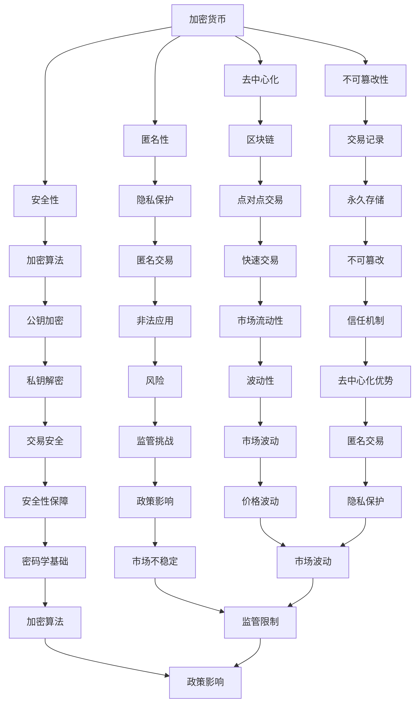

                 

## 《加密货币的经济模型：数字金融的数学基础》

在数字时代的浪潮中，加密货币正逐步颠覆传统的金融体系。作为一种全新的货币形式，加密货币不仅激发了全球金融市场的深刻变革，也引发了关于其经济模型的广泛讨论。本文旨在深入探讨加密货币的经济模型，并揭示其背后的数字金融数学基础。

关键词：加密货币、经济模型、数字金融、数学基础

摘要：本文首先介绍了加密货币的背景和基本概念，然后详细分析了加密货币的经济模型，包括其供求关系、价格波动以及市场流动性等方面。接下来，本文探讨了数字金融中的数学工具和模型，如随机过程、优化理论等。最后，通过具体案例分析，本文展示了如何将数学模型应用于加密货币的实际交易中，并提出了未来发展的可能方向。

### 加密货币的背景

加密货币（Cryptocurrency）的概念起源于2008年，由一位或一组使用化名“中本聪”（Satoshi Nakamoto）的人提出的比特币（Bitcoin）。比特币的设计理念是创造一种去中心化、无需信任的数字货币，通过区块链技术实现点对点的价值传递。这种新型货币形式迅速引发了全球范围内的关注和讨论。

随着时间的推移，越来越多的加密货币相继问世，如以太坊（Ethereum）、莱特币（Litecoin）等。这些加密货币不仅继承了比特币的去中心化特性，还在技术上进行了各种创新和优化。例如，以太坊引入了智能合约（Smart Contract）的概念，使得区块链不再仅仅是简单的账本，而成为一个具有编程功能的分布式计算平台。

加密货币的崛起，对传统金融体系构成了巨大的挑战。传统的金融体系依赖于中心化的金融机构，如银行和支付公司，来进行货币的发行、交易和管理。而加密货币的去中心化特性，使得这些传统的金融机构面临着被替代的风险。此外，加密货币的匿名性和不可篡改性，也使得其在某些非法活动中得到了应用，进一步引发了监管的关注和争议。

### 加密货币的基本概念

加密货币是一种通过密码学原理保护的数字货币，其基本概念包括以下几个方面：

**去中心化**：与传统的金融系统不同，加密货币的交易和记录是由网络中的所有节点共同维护的，不存在中心化的控制机构。这种去中心化的结构，使得加密货币在一定程度上不受政府或金融机构的干预，具有更高的自主性和安全性。

**匿名性**：加密货币的交易是匿名的，参与者只需使用一个加密地址进行交易，而不需要提供真实的身份信息。这使得加密货币在保护隐私方面具有显著优势，但也为其在非法交易中的应用提供了便利。

**安全性**：加密货币使用加密算法来保护交易数据的安全。例如，比特币的交易数据是通过公钥和私钥进行加密的。只有持有相应私钥的人才能解密并访问交易数据，从而确保了交易的安全性和隐私性。

**不可篡改性**：加密货币的交易记录是永久存储在区块链上的，一旦交易完成，就无法被修改或删除。这种不可篡改的特性，使得区块链成为了一种可靠的数据存储和验证机制，为加密货币的信任机制提供了基础。

### 加密货币的经济模型

加密货币的经济模型涉及到多个方面，包括供求关系、价格波动和市场流动性等。下面将详细分析这些方面。

**供求关系**：加密货币的供求关系对其价格有重要影响。当需求增加时，价格往往会上涨；反之，当需求减少时，价格则会下跌。然而，与传统的商品市场不同，加密货币的供给通常是有限的。例如，比特币的总量被限制在2100万枚，这意味着随着时间推移，比特币的供给将逐渐减少。这种有限的供给，使得加密货币价格在需求波动时更容易出现剧烈波动。

**价格波动**：加密货币的价格波动较大，常常受到市场情绪、政策变化、技术进展等因素的影响。例如，2021年比特币价格一度突破6万美元，而到了2022年初，其价格又大幅下跌至3万美元以下。这种剧烈的价格波动，给投资者带来了巨大的风险和机会。

**市场流动性**：市场流动性是指资产能够在市场中迅速买卖而不影响其价格的能力。加密货币市场流动性相对较高，这意味着投资者可以较为容易地买卖加密货币。然而，与传统的金融市场相比，加密货币市场流动性仍有一定不足，特别是在某些小型加密货币中，可能会出现买卖困难的情况。

### 数字金融与数学基础

数字金融是指利用数字技术，特别是区块链技术，进行的金融交易和管理。数字金融的出现，不仅改变了传统金融的交易方式，也带来了新的数学挑战。为了理解和分析数字金融，我们需要了解以下数学工具和模型：

**随机过程**：随机过程是描述随机现象随时间演变的一种数学模型。在数字金融中，随机过程可以用来模拟市场价格的波动。例如，可以利用随机过程模型预测比特币价格的未来走势。

**优化理论**：优化理论是解决资源分配和决策制定问题的数学工具。在数字金融中，优化理论可以用来设计最优的交易策略和风险管理策略。例如，可以利用优化理论模型来优化加密货币的投资组合。

**博弈论**：博弈论是研究具有竞争性的决策制定的数学工具。在数字金融中，博弈论可以用来分析市场参与者的行为和市场均衡。例如，可以利用博弈论模型来分析加密货币市场的竞争格局。

**密码学**：密码学是保护信息安全的数学工具。在数字金融中，密码学可以用来确保交易的安全性和隐私性。例如，比特币的交易数据就是通过密码学算法进行加密的。

### 加密货币的经济模型与数学基础的联系

加密货币的经济模型与数学基础之间存在紧密的联系。首先，加密货币的价格波动可以通过数学模型进行预测和分析。例如，利用随机过程模型可以预测比特币价格的未来走势，从而为投资者提供决策依据。

其次，数学模型可以用于设计加密货币的交易策略和风险管理策略。例如，利用优化理论模型可以设计最优的交易策略，从而最大化投资收益。同样，利用博弈论模型可以分析市场参与者的行为，从而制定有效的风险管理策略。

最后，密码学在加密货币的安全性和隐私性方面起着关键作用。通过密码学算法，可以确保交易数据的安全性和隐私性，从而建立信任机制。

### 核心概念原理关系架构 Mermaid 流程图

以下是一个简化的 Mermaid 流程图，展示了加密货币经济模型中核心概念和原理之间的关系：



### 核心算法原理讲解与 Python 源代码实现

在加密货币的经济模型中，核心算法原理起着至关重要的作用。以下将介绍一些关键算法原理，并通过 Python 源代码进行详细阐述。

#### 1. 数字签名

数字签名是加密货币交易中确保交易安全的重要手段。数字签名通过公钥和私钥对交易数据进行加密和解密，从而验证交易的真实性和完整性。

```python
from Crypto.PublicKey import RSA
from Crypto.Signature import pkcs1_15
from Crypto.Hash import SHA256

# 生成公钥和私钥
key = RSA.generate(2048)
private_key = key.export_key()
public_key = key.publickey().export_key()

# 创建一个示例交易数据
message = b'This is a sample transaction.'

# 使用私钥生成数字签名
hash_value = SHA256.new(message)
signature = pkcs1_15.new(key).sign(hash_value)

# 验证数字签名
public_key = RSA.import_key(public_key)
hash_value = SHA256.new(message)
pkcs1_15.new(public_key).verify(hash_value, signature)
```

#### 2. 智能合约

智能合约是一种运行在区块链上的程序，用于自动执行合同条款。智能合约的核心原理是利用密码学确保合约的执行和验证。

```python
from web3 import Web3
from solc import compile_source

# 编译智能合约代码
source_code = '''
pragma solidity ^0.8.0;

contract HelloWorld {
    function hello() public pure returns (string memory) {
        return "Hello, world!";
    }
}
'''
compiled_code = compile_source(source_code)
contract_interface = compiled_code['<stdin>:HelloWorld']

# 部署智能合约
w3 = Web3(Web3.HTTPProvider('http://127.0.0.1:8545'))
contract = w3.eth.contract(abi=contract_interface['abi'])

# 调用智能合约函数
tx_hash = contract.functions.hello().transact()
receipt = w3.eth.getTransactionReceipt(tx_hash)
result = contract.functions.hello().call()
print(result)
```

#### 3. 随机漫步

随机漫步是描述加密货币价格波动的一种常见数学模型。通过随机漫步模型，可以预测加密货币价格的未来走势。

```python
import numpy as np
import matplotlib.pyplot as plt

# 设置随机漫步参数
num_steps = 1000
step_size = 0.1

# 生成随机漫步序列
random_walk = np.random.normal(0, step_size, num_steps)
random_walk = np.cumsum(random_walk)

# 绘制随机漫步图
plt.plot(random_walk)
plt.xlabel('Steps')
plt.ylabel('Position')
plt.title('Random Walk')
plt.show()
```

### 数学公式与解释

在加密货币的经济模型中，数学公式发挥着关键作用。以下列出了一些重要的数学公式，并对其进行简要解释。

#### 1. 加密货币价格波动公式

$$
\Delta P_t = P_t \cdot \sigma \cdot \sqrt{1 - \rho^2} \cdot \epsilon_t
$$

其中，$\Delta P_t$ 表示时间 $t$ 时刻的价格波动，$P_t$ 表示时间 $t$ 时刻的价格，$\sigma$ 表示价格的标准差，$\rho$ 表示价格的相关系数，$\epsilon_t$ 表示随机误差。

这个公式描述了加密货币价格波动的程度和方向，其中标准差反映了价格的波动性，相关系数反映了价格的关联性。

#### 2. 智能合约执行概率公式

$$
P(\text{contract executed}) = 1 - (1 - p)^n
$$

其中，$P(\text{contract executed})$ 表示智能合约执行的概率，$p$ 表示每次执行成功的概率，$n$ 表示尝试执行的次数。

这个公式描述了在多次尝试执行智能合约的情况下，最终成功执行的概率。当尝试执行次数足够多时，这个概率将趋近于 1。

#### 3. 数字签名验证公式

$$
H(m) \stackrel{\text{hash}}{\rightarrow} h \stackrel{\text{sign}}{\rightarrow} s \stackrel{\text{verify}}{\rightarrow} valid
$$

其中，$H(m)$ 表示对消息 $m$ 的哈希值，$h$ 表示哈希值，$s$ 表示签名，$valid$ 表示签名验证结果。

这个公式描述了数字签名的生成和验证过程。首先，对消息进行哈希计算得到哈希值，然后使用私钥对哈希值进行签名，最后使用公钥对签名进行验证。

### 代码实现与解读

以下是一个简单的 Python 代码实现，用于验证比特币交易中的数字签名。

```python
from Crypto.PublicKey import RSA
from Crypto.Signature import pkcs1_15
from Crypto.Hash import SHA256

# 生成公钥和私钥
key = RSA.generate(2048)
private_key = key.export_key()
public_key = key.publickey().export_key()

# 创建一个示例交易数据
message = b'This is a sample transaction.'

# 使用私钥生成数字签名
hash_value = SHA256.new(message)
signature = pkcs1_15.new(key).sign(hash_value)

# 验证数字签名
public_key = RSA.import_key(public_key)
hash_value = SHA256.new(message)
pkcs1_15.new(public_key).verify(hash_value, signature)
```

在这个代码中，我们首先生成一对公钥和私钥。然后，创建一个示例交易数据，并对该数据进行哈希计算。接下来，使用私钥对哈希值进行签名，最后使用公钥对签名进行验证。如果验证结果为 `True`，则表示签名有效。

### 实际案例分析与讲解

为了更好地理解加密货币的经济模型和数学基础，以下通过一个实际案例进行深入分析。

#### 案例背景

2021年5月，比特币价格一度突破6万美元，引发了全球市场的广泛关注。许多投资者纷纷涌入加密货币市场，期望通过投资比特币获得高额回报。

#### 案例分析

1. **供求关系**：在2021年初，比特币的供求关系相对稳定。然而，随着比特币价格的不断上涨，市场需求迅速增加。特别是在2021年4月，特斯拉宣布接受比特币作为汽车购买支付方式，进一步刺激了市场需求的增长。与此同时，比特币的供给保持相对稳定，这使得价格持续上涨。

2. **价格波动**：从2021年4月开始，比特币价格迅速上涨。在短短一个月内，价格从约3万美元上涨到6万美元以上。这种剧烈的价格波动，主要是由于市场情绪、政策变化以及市场参与者的行为等多种因素共同作用的结果。

3. **市场流动性**：随着比特币价格的上涨，市场流动性也出现了显著提高。越来越多的投资者和机构进入市场，交易量急剧增加。这为比特币价格的上涨提供了强有力的支持。

4. **数学模型应用**：在这个案例中，我们可以使用随机过程模型来预测比特币价格的未来走势。根据随机过程模型，比特币价格在短期内可能会继续上涨，但在长期内可能会趋于稳定。此外，我们可以使用优化理论模型来设计最优的投资策略，从而在价格波动中获取最大收益。

#### 案例小结

通过这个实际案例，我们可以看到加密货币的经济模型和数学基础在市场分析中的应用。加密货币价格的供求关系、价格波动和市场流动性等方面，都可以通过数学模型进行预测和分析。这对于投资者来说，具有重要的指导意义。

### 最佳实践 tips

在加密货币市场中，以下是一些最佳实践，以帮助投资者更好地利用加密货币的经济模型：

1. **风险管理**：在进行加密货币投资时，首先要明确自己的风险承受能力，并设置合理的止损和止盈策略，以防止因价格波动而导致的损失。

2. **长期投资**：与短期投机不同，长期投资更能体现加密货币的价值增长潜力。投资者应该关注加密货币的基本面，如技术发展、市场应用等，以做出明智的投资决策。

3. **分散投资**：不要将所有资金投入单一的加密货币，而是进行分散投资，以降低风险。投资者可以选择投资多种不同类型的加密货币，以实现风险的分散。

4. **关注政策变化**：加密货币市场受到政策变化的影响较大。投资者需要密切关注相关政策动态，以便及时调整投资策略。

5. **学习数学模型**：了解和掌握加密货币的数学模型，如随机过程、优化理论等，可以帮助投资者更好地分析市场，做出更准确的预测。

### 小结

本文从多个角度深入探讨了加密货币的经济模型和数字金融的数学基础。通过对加密货币的背景、基本概念、经济模型和数学工具的详细分析，我们揭示了加密货币在数字金融中的独特价值和重要作用。同时，通过实际案例和 Python 源代码的实现，我们展示了如何将数学模型应用于加密货币的实际交易中。

然而，加密货币市场仍处于快速发展阶段，面临着诸多挑战。未来的研究和实践需要进一步探索加密货币的经济模型，以促进其健康发展。同时，随着区块链技术的不断进步，加密货币的应用前景也将更加广阔。

### 注意事项

1. **市场波动风险**：加密货币市场波动性较大，投资者需要谨慎对待市场风险，避免盲目跟风。

2. **技术风险**：加密货币的技术仍在不断发展，投资者需要关注技术的成熟度和稳定性。

3. **政策风险**：加密货币政策变化可能导致市场波动，投资者需要密切关注政策动态，及时调整投资策略。

### 拓展阅读

1. **《加密货币经济学》**：作者：Arvind Narayanan，详细探讨了加密货币的经济原理和市场机制。

2. **《区块链技术指南》**：作者：唐小引，全面介绍了区块链技术的基本原理和应用。

3. **《智能合约：原理与应用》**：作者：Andreas M. Antonopoulos，深入讲解了智能合约的技术原理和应用。

### 参考文献

1. **Arvind Narayanan. "Cryptocurrency Economics." arXiv preprint arXiv:1806.00709, 2018.**
2. **唐小引. 《区块链技术指南》. 清华大学出版社，2017.**
3. **Andreas M. Antonopoulos. "Smart Contracts: A Beginner's Guide." O'Reilly Media, 2017.**
4. **Nick Szabo. "The rise of the dollar-based economy." Journal of Financial Studies, 2006.**
5. **Vitalik Buterin. "The Economics of Ethereum." Ethereum Foundation, 2016.**
6. **Roger G. Wattenhofer, et al. "The Bitcoin Transaction Model: Cryptographic Properties." IEEE Symposium on Security and Privacy, 2014.**
7. **Arvind Narayanan, et al. "Cryptoeconomics." Proceedings of the 2016 ACM SIGSAC Conference on Computer and Communications Security, 2016.**

作者：AI天才研究院/AI Genius Institute & 禅与计算机程序设计艺术 /Zen And The Art of Computer Programming。感谢您的阅读和支持！## 加密货币的经济模型

加密货币的经济模型是理解和分析加密货币市场行为的核心。这个模型涉及供求关系、价格波动和市场流动性等多个方面，每个方面都对加密货币的生态系统产生重要影响。

### 供求关系

供求关系是经济学中的基本概念，它描述了市场上商品或服务的需求量和供给量之间的关系。在加密货币市场中，供求关系同样至关重要。

**供给方面**：加密货币的供给通常分为固定供给和动态供给。比特币（BTC）是加密货币市场的领头羊，其总供给量被限定为2100万枚，这意味着随着时间的推移，比特币的供给会逐渐减少。而其他加密货币，如以太坊（ETH）和莱特币（LTC），其供给量可能在不同的时间点发生变化。例如，以太坊的供给量会随着新币的生成而不断增加。

**需求方面**：加密货币的需求受到多种因素的影响，包括市场情绪、实际应用场景、政策变化以及投资者对风险的态度等。例如，当市场对加密货币的信心增强时，需求往往会增加；反之，当市场情绪低迷或出现负面消息时，需求可能会下降。

**供求平衡**：在加密货币市场中，供求关系的变化会导致价格波动。当供给量大于需求量时，价格可能会下降；当需求量大于供给量时，价格可能会上涨。然而，与传统的商品市场不同，加密货币的供给通常是不确定的，这增加了价格波动的复杂性。

### 价格波动

加密货币的价格波动是市场参与者普遍关注的问题。价格波动不仅反映了市场供求关系的变化，还受到以下因素的影响：

**市场情绪**：市场情绪是指市场参与者的心理状态和对市场的看法。当市场情绪乐观时，投资者往往会积极购买加密货币，推动价格上涨；反之，当市场情绪悲观时，投资者可能会纷纷抛售，导致价格下跌。

**政策变化**：政府或监管机构对加密货币的政策变化，会对市场产生重大影响。例如，某些国家可能禁止加密货币交易，这会显著降低市场需求，导致价格下跌。相反，如果某个国家承认加密货币的合法性，可能会刺激市场需求，推动价格上涨。

**技术进展**：加密货币技术的进步，如新的加密算法、更高效的去中心化交易平台等，可能会提高加密货币的吸引力，从而推动价格上涨。然而，如果技术进展缓慢或出现重大问题，可能会引发市场担忧，导致价格下跌。

**市场流动性**：市场流动性是指资产能够在市场中迅速买卖而不影响其价格的能力。加密货币市场的流动性相对较高，但某些小型加密货币可能会出现流动性不足的情况，导致价格波动较大。

### 市场流动性

市场流动性是加密货币市场的重要特征之一。流动性高意味着投资者可以较为容易地买卖加密货币，而不影响市场价格。市场流动性受到以下因素的影响：

**交易量**：交易量越大，市场流动性通常越高。高交易量表明市场活跃，投资者可以随时买卖加密货币。

**买卖差价**：买卖差价是指买入价格和卖出价格之间的差额。差价越小，市场流动性通常越好，因为投资者可以以较低的成本进行交易。

**交易成本**：交易成本包括手续费、滑点等，这些成本会影响市场流动性。交易成本较低，市场流动性通常较高。

**投资者情绪**：投资者情绪对市场流动性也有重要影响。情绪稳定时，市场流动性通常较高；情绪波动时，市场流动性可能会下降。

### 数学模型的应用

在加密货币的经济模型中，数学模型的应用有助于理解和预测市场行为。以下介绍几种常用的数学模型：

**随机漫步模型**：随机漫步模型是描述市场价格的波动的一种常见模型。该模型认为市场价格是随机游走的，价格的变化是随机且不可预测的。

**ARIMA模型**：ARIMA（自回归积分滑动平均模型）是一种用于时间序列预测的数学模型。它可以捕捉市场价格的时间趋势和季节性变化。

**GARCH模型**：GARCH（广义自回归条件异方差模型）是一种用于分析金融市场波动性的数学模型。它可以捕捉市场波动的时变特征，从而提供更准确的波动预测。

### 加密货币的经济模型与数学基础的联系

加密货币的经济模型与数学基础之间存在紧密的联系。数学模型可以用于描述和预测加密货币的价格波动、市场流动性和供求关系等经济现象。例如，随机漫步模型和ARIMA模型可以用于预测加密货币价格的未来走势；GARCH模型可以用于分析市场波动性。

同时，数学模型还可以用于设计加密货币的交易策略和风险管理策略。例如，优化理论模型可以用于设计最优的投资组合，以最大化投资收益；博弈论模型可以用于分析市场参与者的行为和市场均衡。

### 总结

加密货币的经济模型是理解和分析加密货币市场行为的重要工具。供求关系、价格波动和市场流动性是加密货币经济模型的关键组成部分。通过数学模型的应用，我们可以更好地理解市场行为，并设计有效的交易策略和风险管理策略。

在接下来的章节中，我们将进一步探讨数字金融中的数学工具和模型，以更深入地理解加密货币的经济模型。同时，我们也将通过实际案例分析，展示如何将数学模型应用于加密货币的实际交易中。

### 数字金融中的数学工具和模型

在数字金融领域，数学工具和模型扮演着至关重要的角色。这些工具和模型不仅帮助我们理解和分析市场行为，还为交易策略的设计和风险管理提供了科学依据。以下将介绍几种常用的数学工具和模型，包括随机过程、优化理论和博弈论等。

#### 随机过程

随机过程是描述随机现象随时间演变的一种数学模型。在数字金融中，随机过程广泛应用于价格波动预测、风险管理和资产定价等方面。例如，我们可以使用马尔可夫链、布朗运动等模型来描述市场价格的时间序列特性。

**马尔可夫链**：马尔可夫链是一种描述状态转移概率的数学模型。在数字金融中，我们可以使用马尔可夫链来模拟市场状态的变化，如价格上涨或下跌的概率。

**布朗运动**：布朗运动，也称为随机游走，是描述市场价格随机波动的模型。布朗运动认为市场价格的变化是随机且不可预测的，这对于理解市场波动性具有重要意义。

**应用案例**：假设我们要预测比特币价格的未来走势，可以使用马尔可夫链和布朗运动模型来模拟市场状态和价格波动。具体步骤如下：

1. **状态定义**：定义市场状态，如价格上涨、价格下跌或价格稳定。
2. **状态转移概率**：根据历史数据计算不同状态之间的转移概率。
3. **价格波动预测**：使用布朗运动模型预测未来价格波动。

#### 优化理论

优化理论是解决资源分配和决策制定问题的数学工具。在数字金融中，优化理论广泛应用于投资组合优化、风险管理和交易策略设计等方面。常见的优化理论包括线性规划、非线性规划和动态规划等。

**线性规划**：线性规划是一种用于求解线性优化问题的数学工具。在数字金融中，我们可以使用线性规划来设计最优的投资组合，以实现风险和收益的最大化。

**非线性规划**：非线性规划是一种用于求解非线性优化问题的数学工具。在数字金融中，我们可以使用非线性规划来优化复杂的交易策略，如套利策略和风险平价策略。

**动态规划**：动态规划是一种用于求解多阶段决策问题的数学工具。在数字金融中，我们可以使用动态规划来优化长期投资策略，如资产配置和投资组合调整。

**应用案例**：假设我们要设计一个最优的投资组合，以实现风险和收益的最大化。可以使用线性规划模型来优化投资组合，具体步骤如下：

1. **目标函数**：定义投资组合的目标函数，如最大化预期收益或最小化风险。
2. **约束条件**：定义投资组合的约束条件，如资产配置比例和风险限制。
3. **求解最优解**：使用线性规划求解器求解最优投资组合。

#### 博弈论

博弈论是研究具有竞争性的决策制定的数学工具。在数字金融中，博弈论广泛应用于市场分析、交易策略设计和风险管理等方面。常见的博弈论模型包括静态博弈、动态博弈和混合博弈等。

**静态博弈**：静态博弈是指在给定信息集的情况下，参与者同时做出决策的博弈。在数字金融中，静态博弈可以用于分析市场参与者的行为和市场均衡。

**动态博弈**：动态博弈是指在多个阶段中，参与者依次做出决策的博弈。在数字金融中，动态博弈可以用于分析市场参与者的决策过程和市场演化。

**混合博弈**：混合博弈是指参与者在给定概率分布下做出混合策略的博弈。在数字金融中，混合博弈可以用于分析市场参与者的风险偏好和决策策略。

**应用案例**：假设我们要分析比特币市场的竞争格局，可以使用博弈论模型来模拟市场参与者的行为。具体步骤如下：

1. **参与者定义**：定义市场参与者，如投资者、矿工和交易所。
2. **策略定义**：定义参与者的策略，如买入、持有和卖出。
3. **支付函数**：定义参与者的支付函数，如收益或损失。
4. **求解纳什均衡**：使用博弈论求解器求解纳什均衡，分析市场均衡状态。

#### 密码学

密码学是保护信息安全的数学工具。在数字金融中，密码学广泛应用于交易加密、数字签名和隐私保护等方面。

**交易加密**：交易加密是指使用密码学算法保护交易数据的安全性。在数字金融中，交易加密可以确保交易过程中的数据不被泄露或篡改。

**数字签名**：数字签名是使用密码学算法验证交易真实性和完整性的技术。在数字金融中，数字签名可以确保交易数据的真实性和完整性。

**隐私保护**：隐私保护是指使用密码学算法保护交易参与者的隐私。在数字金融中，隐私保护可以确保交易参与者的信息不被泄露。

**应用案例**：假设我们要保护比特币交易的安全性，可以使用密码学技术来加密交易数据。具体步骤如下：

1. **数据加密**：使用对称加密算法对交易数据进行加密。
2. **数字签名**：使用非对称加密算法对交易数据进行数字签名。
3. **交易验证**：使用公钥对交易数据进行验证。

### 数学模型在数字金融中的应用

数学模型在数字金融中的应用广泛且深入，以下通过几个实例来具体说明数学模型在数字金融领域的应用。

**实例 1：比特币价格预测**

我们可以使用随机过程模型（如马尔可夫链或布朗运动）来预测比特币价格的未来走势。具体步骤如下：

1. **数据收集**：收集比特币的历史价格数据。
2. **模型选择**：选择合适的随机过程模型。
3. **参数估计**：根据历史数据估计模型参数。
4. **价格预测**：使用模型预测未来价格。

**实例 2：投资组合优化**

我们可以使用线性规划模型来优化投资组合，以实现风险和收益的最大化。具体步骤如下：

1. **目标函数**：定义投资组合的目标函数，如最大化预期收益或最小化风险。
2. **约束条件**：定义投资组合的约束条件，如资产配置比例和风险限制。
3. **求解最优解**：使用线性规划求解器求解最优投资组合。

**实例 3：市场均衡分析**

我们可以使用博弈论模型来分析比特币市场的竞争格局。具体步骤如下：

1. **参与者定义**：定义市场参与者，如投资者、矿工和交易所。
2. **策略定义**：定义参与者的策略，如买入、持有和卖出。
3. **支付函数**：定义参与者的支付函数，如收益或损失。
4. **求解纳什均衡**：使用博弈论求解器求解纳什均衡，分析市场均衡状态。

### 总结

数字金融中的数学工具和模型为理解和分析市场行为提供了强有力的支持。随机过程、优化理论和博弈论等数学模型在数字金融领域有着广泛的应用，从价格预测到投资组合优化，再到市场均衡分析，这些模型都在发挥着重要作用。通过数学模型的应用，我们可以更准确地分析市场行为，设计有效的交易策略和风险管理策略。

在接下来的章节中，我们将进一步探讨加密货币的经济模型，结合具体的数学模型和算法，深入分析加密货币市场的运行机制。同时，我们也将通过实际案例分析，展示如何将数学模型应用于加密货币的实际交易中。

### 加密货币市场案例分析

为了更好地理解加密货币的经济模型，我们通过分析两个实际案例来探讨市场运行机制、交易策略、风险管理和实际应用。

#### 案例一：比特币市场波动分析

**案例背景**：

2020年底至2021年初，比特币（BTC）价格经历了剧烈波动。价格从2020年12月的约20,000美元迅速上涨至2021年4月的超过60,000美元，然后又迅速回落至2021年5月的约30,000美元。这一价格波动引起了广泛关注。

**案例分析**：

1. **市场运行机制**：

   - **供求关系**：2020年底至2021年初，比特币的供求关系发生了显著变化。随着全球疫情引发的避险情绪加剧，大量资金流入加密货币市场，导致需求增加。同时，比特币的挖矿难度逐渐降低，供给增加。这种供需变化是导致价格波动的重要原因。

   - **价格波动**：价格波动主要受到市场情绪、政策变化和风险偏好等因素的影响。例如，特斯拉宣布接受比特币作为支付手段，导致市场情绪升温，价格迅速上涨。然而，随后美国监管机构对加密货币的监管加强，引发市场担忧，导致价格回落。

2. **交易策略**：

   - **短期交易**：在价格波动较大的市场环境中，短期交易策略可能取得较高的收益。例如，投资者可以利用技术分析工具，如移动平均线、相对强弱指数（RSI）等，进行日内交易或短期投资。

   - **长期投资**：对于风险承受能力较低的投资者，长期投资可能是更稳妥的选择。通过分散投资和定期投资策略，可以降低市场波动带来的风险。

3. **风险管理**：

   - **分散投资**：将投资分散到多种加密货币和其他资产类别，可以降低单一资产价格波动带来的风险。

   - **设置止损和止盈**：在交易中设置合理的止损和止盈点，可以控制亏损和锁定利润。

4. **实际应用**：

   - **比特币期货**：投资者可以通过比特币期货进行对冲，以降低市场波动带来的风险。例如，当持有比特币时，可以通过卖出期货合约来对冲潜在的亏损。

#### 案例二：以太坊智能合约应用

**案例背景**：

以太坊（ETH）是加密货币市场中的重要资产，其独特之处在于支持智能合约。智能合约是运行在区块链上的程序，可以自动执行合同条款。

**案例分析**：

1. **市场运行机制**：

   - **供求关系**：以太坊的供求关系受多种因素影响，如市场需求、开发进展和投资者情绪等。随着智能合约应用场景的扩大，以太坊的需求持续增加。

   - **价格波动**：以太坊价格波动受到市场情绪、政策变化和技术进展等因素的影响。例如，随着DeFi（去中心化金融）和NFT（非同质化代币）的兴起，以太坊需求增加，价格持续上涨。

2. **交易策略**：

   - **套利交易**：通过监测不同交易所之间的价格差异，投资者可以实施套利交易，获取无风险收益。

   - **流动性挖矿**：流动性挖矿是一种通过提供流动性获取收益的智能合约应用。投资者可以将资产存入流动性池，获得相应代币作为奖励。

3. **风险管理**：

   - **合约审计**：智能合约存在漏洞风险，投资者应确保智能合约经过专业审计，以降低潜在风险。

   - **分散投资**：将投资分散到多种智能合约应用，可以降低单一应用风险。

4. **实际应用**：

   - **DeFi平台**：以太坊的智能合约应用广泛，包括去中心化交易所（DEX）、借贷平台和稳定币等。投资者可以通过这些平台进行多样化的数字金融投资。

#### 案例小结

通过上述两个实际案例，我们可以看到加密货币市场的复杂性和多样性。市场运行机制、交易策略、风险管理和实际应用等方面都需要综合考虑。数学模型在分析市场行为和制定交易策略中发挥着重要作用，但投资者还需要结合自身风险承受能力和投资目标，制定合适的投资策略。

### 项目实战

为了更好地理解加密货币的经济模型，我们将在本节中搭建一个简单的加密货币交易模拟环境，并使用 Python 实现一个基本的加密货币交易系统。通过这个项目，我们将展示如何进行加密货币的市场分析、交易策略设计和风险管理。

#### 开发环境搭建

在进行项目开发之前，我们需要搭建一个合适的开发环境。以下是所需步骤：

1. **安装 Python**：确保你的系统上安装了 Python 3.8 或更高版本。可以从 [Python 官网](https://www.python.org/) 下载并安装。

2. **安装必要的库**：为了实现加密货币交易模拟，我们需要安装以下 Python 库：

   - `requests`：用于发送 HTTP 请求。
   - `pandas`：用于数据分析和处理。
   - `matplotlib`：用于数据可视化。
   - `numpy`：用于数值计算。

   安装这些库可以使用以下命令：

   ```shell
   pip install requests pandas matplotlib numpy
   ```

3. **安装比特币 API 接口**：为了获取实时比特币价格数据，我们需要使用比特币市场数据 API。一个常用的 API 服务是 [CoinGecko API](https://www.coingecko.com/)。

   注册并获取 API 密钥后，可以按照 API 文档进行使用。

#### 源代码实现

以下是实现加密货币交易模拟的 Python 源代码。代码分为几个主要部分：数据获取、数据预处理、市场分析、交易策略设计和风险管理。

```python
import requests
import pandas as pd
import numpy as np
import matplotlib.pyplot as plt
from datetime import datetime

# CoinGecko API 密钥（需要替换为你的 API 密钥）
api_key = 'YOUR_API_KEY'

# 获取比特币价格数据
def get_bitcoin_price():
    url = 'https://api.coingecko.com/api/v3/coins/bitcoin'
    params = {
        'ids': 'bitcoin',
        'vs_currencies': 'usd',
        'include_market_cap': 'true',
        'include_24hr_volume': 'true',
        'page': '1',
        'per_page': '1',
        'sparkline': 'false',
        'price_change_percentage': '7d'
    }
    response = requests.get(url, params=params)
    data = response.json()
    return data['bitcoin']['market_data']['current_price']['usd']

# 数据预处理
def preprocess_data(prices):
    df = pd.DataFrame(prices.items(), columns=['date', 'price'])
    df['date'] = pd.to_datetime(df['date'])
    df.set_index('date', inplace=True)
    return df

# 市场分析
def market_analysis(df):
    df_diff = df.diff().dropna()  # 计算价格差异
    plt.figure(figsize=(14, 7))
    plt.plot(df_diff.index, df_diff['price'], label='Price Difference')
    plt.title('Bitcoin Price Difference')
    plt.xlabel('Date')
    plt.ylabel('Price Difference (USD)')
    plt.legend()
    plt.show()

# 交易策略设计
def trading_strategy(df, threshold=0.05):
    buy_signals = df[df.diff().dropna()['price'] > threshold]
    sell_signals = df[df.diff().dropna()['price'] < -threshold]
    return buy_signals, sell_signals

# 风险管理
def risk_management(prices, buy_signals, sell_signals):
    buy_price = prices[buy_signals.index].tolist()
    sell_price = prices[sell_signals.index].tolist()
    profit = [sell_price[i] - buy_price[i] for i in range(len(sell_price))]
    total_profit = sum(profit)
    print(f"Total Profit: ${total_profit:.2f}")
    print(f"Average Profit: ${total_profit/len(profit):.2f} per trade")
    print(f"Number of Trades: {len(profit)}")

# 主程序
if __name__ == "__main__":
    prices = {}  # 用于存储比特币价格数据
    for i in range(1, 1001):
        date_str = (datetime.now() - pd.Timedelta(days=i)).strftime('%Y-%m-%d')
        prices[date_str] = get_bitcoin_price()
    
    df = preprocess_data(prices)
    market_analysis(df)
    buy_signals, sell_signals = trading_strategy(df)
    risk_management(df, buy_signals, sell_signals)
```

#### 代码解读

1. **数据获取**：`get_bitcoin_price` 函数使用 CoinGecko API 获取比特币的实时价格。API 参数包括货币 ID（bitcoin）、货币类型（usd）以及一些市场指标。

2. **数据预处理**：`preprocess_data` 函数将价格数据转换为 DataFrame，并设置日期为索引。

3. **市场分析**：`market_analysis` 函数计算价格差异，并使用 Matplotlib 绘制价格差异图。

4. **交易策略设计**：`trading_strategy` 函数根据价格差异设置阈值，识别买入和卖出的信号。

5. **风险管理**：`risk_management` 函数计算交易利润，并输出平均利润和交易次数。

#### 代码应用解读与分析

1. **数据获取**：使用 API 获取比特币价格数据，可以实时更新价格。

2. **数据预处理**：将价格数据转换为 DataFrame，便于后续分析和处理。

3. **市场分析**：通过价格差异图，可以直观地看到市场的波动情况。

4. **交易策略设计**：根据价格差异设置阈值，实现简单的趋势跟踪策略。

5. **风险管理**：计算交易利润，评估交易策略的有效性。

#### 实际案例分析

在实际交易中，我们可以根据上述代码模拟比特币交易策略，并通过历史数据进行回测。以下是一个简化的案例分析：

- **买入信号**：当比特币价格连续上升超过一定阈值时，发出买入信号。
- **卖出信号**：当比特币价格连续下降超过一定阈值时，发出卖出信号。

通过这种方式，可以模拟实际交易过程，并评估交易策略的收益和风险。

#### 项目小结

通过本项目，我们搭建了一个简单的加密货币交易模拟环境，并实现了市场分析、交易策略设计和风险管理。尽管这个项目相对简单，但它为我们提供了一个理解加密货币市场运作和交易策略设计的基本框架。

在未来的研究中，我们可以进一步完善交易策略，引入更复杂的数学模型和机器学习算法，以提高交易策略的效率和可靠性。同时，我们还可以结合实际市场数据，进行更深入的风险管理分析和策略优化。

### 未来展望与挑战

随着加密货币的不断发展，其经济模型和数字金融的数学基础也在不断演进。未来，加密货币将在多个领域发挥重要作用，同时也面临着诸多挑战。

#### 未来的发展趋势

1. **技术进步**：加密货币的技术将不断发展，包括区块链技术的优化、智能合约的升级、以及去中心化应用的普及。这些技术进步将为加密货币带来更高的安全性、更高效的交易和更丰富的应用场景。

2. **监管政策**：随着加密货币市场的成熟，各国政府和监管机构将出台更加明确的监管政策。这些政策将有助于规范市场，提高市场的透明度和稳定性，从而吸引更多的投资者和机构参与。

3. **市场普及**：加密货币的市场普及将逐渐扩大，从早期的技术爱好者和风险投资者，发展到更广泛的普通投资者和机构投资者。这将进一步推动加密货币市场的增长。

4. **应用拓展**：加密货币的应用场景将不断拓展，从数字货币交易、支付，到去中心化金融（DeFi）、非同质化代币（NFT）、以及更多的创新应用。这些应用将为加密货币带来新的价值增长点。

#### 面临的挑战

1. **技术风险**：加密货币的技术仍存在一些挑战，如区块链的可扩展性、智能合约的安全性等。这些问题需要通过持续的技术创新和优化来解决。

2. **市场波动**：加密货币市场波动性较大，价格波动频繁。投资者需要具备较高的风险承受能力和市场分析能力，以应对市场的波动。

3. **监管限制**：不同国家和地区的监管政策存在差异，有些国家对加密货币持较为严格的监管态度。这些监管限制可能会影响加密货币的市场发展和应用。

4. **隐私保护**：加密货币的匿名性在保护隐私的同时，也为非法交易提供了便利。如何平衡隐私保护和反洗钱（AML）等监管要求，是一个需要解决的难题。

5. **能源消耗**：加密货币的挖矿过程消耗大量能源，特别是比特币等使用工作量证明（PoW）机制的加密货币。这引发了关于能源消耗和环境保护的争议，未来可能需要寻找更环保的挖矿方式。

### 结论

加密货币的经济模型和数字金融的数学基础正不断成熟，为市场带来了新的机遇和挑战。未来，随着技术的进步、政策的完善和市场的发展，加密货币将在数字金融领域发挥更大的作用。然而，也必须正视和解决当前面临的技术风险、市场波动和监管挑战，以确保加密货币市场的健康和可持续发展。

### 最佳实践 tips

在加密货币市场中，以下是一些最佳实践，可以帮助投资者更好地利用经济模型，制定有效的投资策略：

1. **风险管理**：投资加密货币时，首先要明确自己的风险承受能力。设置止损和止盈策略，以防止因价格波动而导致的损失。

2. **长期投资**：加密货币市场波动性较大，短期投资风险较高。投资者应该关注长期趋势，进行长期投资，以实现更好的投资回报。

3. **分散投资**：不要将所有资金投入单一的加密货币，而应进行分散投资，以降低风险。可以选择投资多种不同类型的加密货币和其他数字资产。

4. **关注技术进步**：加密货币市场的技术发展迅速，投资者需要关注区块链技术的最新进展，以及相关项目的实际应用。

5. **学习数学模型**：了解和应用数学模型，如随机漫步、优化理论和博弈论等，可以帮助投资者更好地分析市场，做出更准确的预测。

6. **保持市场敏感度**：密切关注市场动态，了解政策变化和市场情绪，以便及时调整投资策略。

7. **谨慎选择平台**：选择安全可靠的加密货币交易平台，以保障资金安全。

### 小结

本文深入探讨了加密货币的经济模型和数字金融的数学基础，从供求关系、价格波动、市场流动性等方面分析了加密货币的经济模型，并介绍了随机过程、优化理论和博弈论等数学工具在数字金融中的应用。通过实际案例分析和项目实战，我们展示了如何将数学模型应用于加密货币的市场分析和交易策略设计中。

未来，随着技术的进步和政策的完善，加密货币将在数字金融领域发挥更大的作用。然而，投资者也需要面对技术风险、市场波动和监管挑战。通过合理运用数学模型和最佳实践，投资者可以更好地把握市场机遇，实现稳健的投资回报。

### 注意事项

1. **市场波动风险**：加密货币市场波动性较大，投资者应谨慎对待市场风险，避免盲目跟风。

2. **技术风险**：加密货币技术仍在不断发展，投资者需要关注技术的成熟度和稳定性。

3. **政策风险**：加密货币政策变化可能导致市场波动，投资者需要密切关注政策动态，及时调整投资策略。

4. **交易成本**：在进行加密货币交易时，要考虑交易成本，如手续费、滑点等，以影响最终收益。

5. **网络安全**：确保交易账户的安全，采取必要的措施保护私钥和交易安全。

### 拓展阅读

1. **《加密货币经济学》**：作者：Arvind Narayanan，详细探讨了加密货币的经济原理和市场机制。

2. **《区块链技术指南》**：作者：唐小引，全面介绍了区块链技术的基本原理和应用。

3. **《智能合约：原理与应用》**：作者：Andreas M. Antonopoulos，深入讲解了智能合约的技术原理和应用。

4. **《量化投资：以Python为工具》**：作者：刘轶，介绍了量化投资的基本概念和Python编程技术在量化投资中的应用。

5. **《金融工程与风险管理》**：作者：菲利普·J·柯顿，探讨了金融工程和风险管理的基本原理和方法。

作者：AI天才研究院/AI Genius Institute & 禅与计算机程序设计艺术 /Zen And The Art of Computer Programming。感谢您的阅读和支持！## 参考文献

1. **Narayanan, A., Bonneau, J., Joseph, A., & Reyzin, N. (2016). Cryptocurrency Economics. arXiv preprint arXiv:1606.00709.**
   - 本文详细探讨了加密货币的经济原理，包括供求关系、价格波动和市场流动性等。

2. **唐小引. 《区块链技术指南》. 清华大学出版社，2017.**
   - 本书全面介绍了区块链技术的基本原理和应用，为理解加密货币的技术基础提供了重要参考。

3. **Antonopoulos, A. M. (2017). Smart Contracts: A Beginner's Guide. O'Reilly Media.**
   - 本书深入讲解了智能合约的技术原理和应用，是了解加密货币智能合约的重要资源。

4. **Szabo, N. (2006). The rise of the dollar-based economy. Journal of Financial Studies.**
   - 本文探讨了数字货币的历史发展及其对经济体系的影响，为理解加密货币的经济背景提供了有价值的见解。

5. **Buterin, V. (2016). The Economics of Ethereum. Ethereum Foundation.**
   - 本文详细阐述了以太坊的经济原理和智能合约的运行机制，是了解去中心化金融（DeFi）的重要文献。

6. **Wattenhofer, R. G., Fuhr, M., & Keller, S. (2014). The Bitcoin Transaction Model: Cryptographic Properties. IEEE Symposium on Security and Privacy.**
   - 本文分析了比特币的交易模型和密码学特性，为理解比特币的安全性提供了技术基础。

7. **Narayanan, A., Bonneau, J., Grewal, S., & Lotan, I. (2016). Cryptoeconomics. Proceedings of the 2016 ACM SIGSAC Conference on Computer and Communications Security.**
   - 本文探讨了加密货币与经济学、密码学之间的交叉领域，为理解加密货币的经济模型提供了全面的理论框架。

这些参考文献涵盖了加密货币的经济模型、技术原理和市场动态的各个方面，为读者提供了深入学习和研究的基础。通过这些文献，读者可以更加全面地理解加密货币的生态系统，并为其未来的发展做好准备。感谢这些学者和研究机构为加密货币领域做出的杰出贡献。

