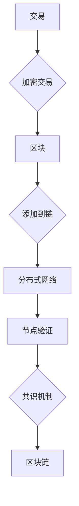

                 

## 《区块链技术的密码学：信任机制的数学基础》

### 关键词
区块链技术、密码学、数学基础、信任机制、加密算法

### 摘要
本文深入探讨区块链技术中的密码学原理，以及它们如何构建信任机制。文章首先介绍了区块链技术和密码学的基本概念，然后详细分析了它们之间的联系。接着，通过Python代码和数学模型，深入解释了区块链中的核心密码学算法。最后，通过实际项目案例，展示了如何将这些密码学原理应用于现实世界的区块链开发中。

### 引言与概述

区块链技术作为近年来最为引人瞩目的技术之一，已经从最初的一个概念逐渐发展为影响广泛的实际应用。区块链的本质是一个去中心化的数据库，它通过一系列加密技术保证数据的不可篡改性和安全性。在区块链技术中，密码学扮演着至关重要的角色，它不仅是数据加密的基础，也是构建信任机制的核心。

密码学，作为保护信息安全的关键学科，已经经历了数百年的发展。从古典密码学如恺撒密码，到现代密码学如RSA加密算法，密码学技术不断演进，以应对日益复杂的网络安全威胁。在区块链中，密码学不仅用于数据加密，还用于身份认证、交易验证和智能合约执行等方面。

信任机制是区块链技术的核心概念之一。在传统的中心化系统中，信任依赖于第三方机构，如银行或政府。而在去中心化的区块链系统中，信任是通过密码学算法和共识机制来实现的。本文将详细探讨这些密码学算法如何构建和维持区块链中的信任机制。

本文的目的是通过深入分析区块链技术和密码学的结合，帮助读者理解密码学在区块链中的重要性和应用。文章首先介绍区块链技术和密码学的基本概念，然后通过具体的数学模型和Python代码，详细解释区块链中的核心密码学算法。最后，通过实际项目案例，展示如何将密码学原理应用于实际的区块链开发中。

### 区块链技术基础

区块链技术的基础架构由三个主要部分组成：区块（Block）、链（Chain）和节点（Node）。每一个区块包含一定数量的交易记录，这些交易记录经过加密处理后存储在区块中。多个区块按照时间顺序连接起来，形成区块链。节点则是区块链网络中的参与者，它们负责验证和传播交易数据。

区块链的基本架构可以用如下的Mermaid流程图来表示：



在这个流程图中，交易首先经过加密处理，然后存储在区块中。多个区块按照时间顺序连接，形成区块链。区块链通过网络中的节点进行分布式存储和验证，确保数据的完整性和一致性。

区块链的共识机制是确保区块链网络达成一致性的关键。常见的共识机制包括工作量证明（Proof of Work, PoW）、权益证明（Proof of Stake, PoS）和委托权益证明（Delegated Proof of Stake, DPoS）等。这些机制通过数学算法和加密技术，实现了节点之间的协作和信任。

在区块链中，数据结构的设计也是确保其安全性和可靠性的重要因素。区块链的数据结构通常采用链式结构，每个区块都包含一个指向前一个区块的哈希值。这样的设计使得区块链具有抗篡改的特性，因为任何对区块链数据的修改都会导致整个链的哈希值不一致。

### 密码学基础

密码学是保护信息安全的关键学科，它通过加密和解密技术，确保信息的保密性、完整性和真实性。在区块链技术中，密码学不仅用于数据加密，还用于身份认证、交易验证和智能合约执行等方面。

密码学的基本概念包括加密算法和密钥管理。加密算法分为对称加密和非对称加密。对称加密使用相同的密钥进行加密和解密，典型的算法有AES（Advanced Encryption Standard）。非对称加密使用一对密钥进行加密和解密，其中一个密钥用于加密，另一个密钥用于解密，典型的算法有RSA（Rivest-Shamir-Adleman）。

在区块链中，数字签名是一种重要的密码学技术，用于验证消息的真实性和完整性。数字签名通过私钥生成，公钥验证，确保只有私钥持有者能够生成对应的数字签名。具体的数字签名算法如ECDSA（Elliptic Curve Digital Signature Algorithm）。

下面是一个简单的Python代码示例，展示了如何使用RSA算法进行数字签名：

```python
from Crypto.PublicKey import RSA
from Crypto.Signature import pkcs1_15
from Crypto.Hash import SHA256

# 生成RSA密钥对
private_key = RSA.generate(2048)
public_key = private_key.publickey()

# 待签名的消息
message = b'This is a sample message for signing'

# 创建哈希对象并生成消息哈希
hash_obj = SHA256.new(message)

# 使用私钥对消息哈希进行签名
signature = pkcs1_15.new(private_key).sign(hash_obj)

# 输出签名
print("Signature:", signature.hex())

# 验证签名
hash_obj = SHA256.new(message)
is_valid = pkcs1_15.new(public_key).verify(hash_obj, signature)
print("Signature valid:", is_valid)
```

在这个示例中，我们首先生成RSA密钥对，然后对一条消息进行签名和验证。数字签名确保了消息的真实性和完整性，只有私钥持有者能够生成对应的签名，而公钥持有者可以验证签名的有效性。

### 区块链中的密码学应用

在区块链技术中，密码学被广泛应用于数据保护、身份认证和交易验证等方面。以下是一些核心应用领域：

#### 数据保护

区块链中的数据保护主要依赖于哈希算法和加密算法。哈希算法如SHA-256用于确保数据的唯一性和完整性。每个区块都包含前一个区块的哈希值，这样任何对区块链数据的修改都会导致整个链的哈希值不一致。加密算法如AES和RSA用于保护敏感数据，确保数据在传输和存储过程中的安全性。

#### 身份认证

区块链技术通过数字签名和公钥基础设施（PKI）实现身份认证。用户通过私钥生成数字签名，公钥用于验证签名的有效性。这样的设计确保了只有私钥持有者能够进行身份验证，从而防止了假冒和欺诈行为。

#### 交易验证

在区块链中，交易验证依赖于共识机制和密码学算法。每个区块都包含一定数量的交易记录，这些交易记录经过加密处理后存储在区块中。节点通过共识机制（如PoW或PoS）对交易进行验证和确认，确保交易的合法性和安全性。

下面是一个使用Python实现的简单区块链示例，展示了密码学在交易验证中的应用：

```python
import hashlib
import json
from time import time
from uuid import uuid4

class Blockchain:
    def __init__(self):
        self.unconfirmed_transactions = []  # 待确认交易
        self.chain = []  # 主链
        self.current_transactions = []  # 当前交易
        self.create_block(previous_hash='1', proof=100)  # 创建创世块
        self.hash_function = hashlib.sha256  # 使用SHA-256作为哈希函数
        self.difficulty = 4  # 工作量证明的难度

    def create_block(self, proof, previous_hash):
        """
        创建一个新的区块并将它添加到链上
        :param proof: 工作量证明
        :param previous_hash: 前一个区块的哈希值
        :return: None
        """
        block = {
            'index': len(self.chain) + 1,
            'timestamp': time(),
            'transactions': self.current_transactions,
            'proof': proof,
            'previous_hash': previous_hash,
        }
        self.current_transactions = []  # 重置当前交易列表
        self.chain.append(block)
        return block

    def get_latest_block(self):
        """
        获取链上最新的区块
        :return: 最新的区块
        """
        return self.chain[-1]

    def proof_of_work(self, last_block_hash):
        """
        工作量证明算法
        :param last_block_hash: 前一个区块的哈希值
        :return: 工作量证明
        """
        proof = 0
        while self.valid_proof(last_block_hash, proof) is False:
            proof += 1
        return proof

    @staticmethod
    def valid_proof(last_block_hash, proof):
        """
        验证工作量证明
        :param last_block_hash: 前一个区块的哈希值
        :param proof: 工作量证明
        :return: True if valid, False otherwise
        """
        guess = f'{last_block_hash}{proof}'.encode()
        guess_hash = hash_function(guess)
        return guess_hash[:self.difficulty] == '0' * self.difficulty

    def add_transaction(self, sender, recipient, amount):
        """
        添加交易到待确认交易列表
        :param sender: 交易发送者
        :param recipient: 交易接收者
        :param amount: 交易金额
        :return: True if added, False otherwise
        """
        self.unconfirmed_transactions.append({
            'sender': sender,
            'recipient': recipient,
            'amount': amount,
        })
        return True

    def resolve_conflicts(self):
        """
        冲突解决算法
        :return: True if chain was updated, False otherwise
        """
        longest_chain = self.chain
        longest_length = len(self.chain)

        for candidate in peers:
            length = len(candidate.chain)
            if length > longest_length and self.valid_chain(candidate.chain):
                longest_chain = candidate.chain
                longest_length = length

        if longest_chain != self.chain:
            self.chain = longest_chain
            return True

        return False

    def valid_chain(self, chain):
        """
        验证链的合法性
        :param chain: 链
        :return: True if valid, False otherwise
        """
        last_block = chain[0]
        current_index = 1
        while current_index < len(chain):
            block = chain[current_index]
            if block['previous_hash'] != self.hash_function(
                    f'{last_block}').hexdigest():
                return False
            last_block = block
            current_index += 1
        return True

# 创建区块链实例
blockchain = Blockchain()

# 添加一些交易
blockchain.add_transaction('Alice', 'Bob', 50)
blockchain.add_transaction('Bob', 'Charlie', 25)

# 挖掘新区块
last_block = blockchain.get_latest_block()
last_block_hash = blockchain.hash_function(f'{last_block}').hexdigest()
proof = blockchain.proof_of_work(last_block_hash)
block = blockchain.create_block(proof, last_block_hash)

print(f'New Block Forged: {block}')
print(f'Chain: {blockchain.chain}')

# 冲突解决
other_chain = [
    {
        'index': 1,
        'timestamp': 1584284400,
        'transactions': [],
        'proof': 10,
        'previous_hash': '1'
    },
    {
        'index': 2,
        'timestamp': 1584284500,
        'transactions': [],
        'proof': 10,
        'previous_hash': '632a7bdc2a6e2e05a9a0e3d16a80a3c27a9c5f328c3912e8c5db8082993f6f9d'
    }
]
if blockchain.resolve_conflicts():
    print('Our chain was replaced')
else:
    print('Our chain is valid')

print(f'Chain: {blockchain.chain}')
```

在这个示例中，我们创建了一个简单的区块链，它使用工作量证明（PoW）算法进行挖矿，并验证交易的有效性。交易通过数字签名进行验证，确保只有合法的交易才能被添加到链上。

### 信任机制的数学基础

信任机制是区块链技术的核心概念之一，它通过数学模型和加密算法确保网络中的参与者能够相互信任和协作。以下从定义、分类和应用三个方面探讨信任机制的数学基础。

#### 定义

信任机制是一种机制，用于在缺乏直接信任的情况下，确保网络中的参与者能够遵循共同规则，并防止欺诈行为。在区块链中，信任机制通过密码学算法和共识机制来实现。

#### 分类

信任机制可以分为以下几种类型：

1. **对称加密**：使用相同的密钥进行加密和解密，如AES。
2. **非对称加密**：使用一对密钥进行加密和解密，如RSA。
3. **数字签名**：通过私钥生成签名，公钥验证签名的有效性，如ECDSA。
4. **密码学货币**：如比特币，通过工作量证明（PoW）确保网络的去中心化。
5. **共识机制**：如PoW、PoS和DPoS，确保区块链网络中的节点达成一致性。

#### 应用

信任机制在区块链中的应用广泛，以下是一些关键应用场景：

1. **数据完整性**：通过哈希算法和数字签名确保数据的完整性和一致性。
2. **身份认证**：通过数字签名和公钥基础设施（PKI）实现用户的身份认证。
3. **交易验证**：通过共识机制和密码学算法确保交易的有效性和安全性。
4. **智能合约执行**：通过密码学和编程逻辑确保智能合约的执行符合预期。

下面是一个使用Python实现的简单信任机制示例，展示了数字签名和验证的过程：

```python
from Crypto.PublicKey import RSA
from Crypto.Signature import pkcs1_15
from Crypto.Hash import SHA256

# 生成RSA密钥对
private_key = RSA.generate(2048)
public_key = private_key.publickey()

# 待签名的消息
message = b'This is a sample message for signing'

# 创建哈希对象并生成消息哈希
hash_obj = SHA256.new(message)

# 使用私钥对消息哈希进行签名
signature = pkcs1_15.new(private_key).sign(hash_obj)

# 输出签名
print("Signature:", signature.hex())

# 验证签名
hash_obj = SHA256.new(message)
is_valid = pkcs1_15.new(public_key).verify(hash_obj, signature)
print("Signature valid:", is_valid)
```

在这个示例中，我们首先生成RSA密钥对，然后对一条消息进行签名和验证。数字签名确保了消息的真实性和完整性，只有私钥持有者能够生成对应的签名，而公钥持有者可以验证签名的有效性。

### 项目实战：区块链密码学应用案例

在本节中，我们将通过实际项目案例展示如何将区块链密码学原理应用于现实世界的开发中。以下是一个简单的区块链项目，它实现了加密交易和身份认证功能。

#### 项目环境搭建

1. **安装Python**：确保系统上安装了Python 3.x版本。
2. **安装依赖库**：使用pip安装以下依赖库：
   ```bash
   pip install flask blockchain blockchain-wrapper crypto
   ```

#### 源代码实现

以下是项目的源代码，它包含了区块链的核心功能：

```python
from blockchain import Blockchain
from crypto import generate_keypair, sign, verify
from flask import Flask, jsonify, request

app = Flask(__name__)

# 创建区块链实例
blockchain = Blockchain()

# 创建区块链节点API
@app.route('/mine', methods=['GET'])
def mine():
    last_block = blockchain.get_latest_block()
    last_hash = blockchain.hash_function(f'{last_block}').hexdigest()
    proof = blockchain.proof_of_work(last_hash)

    blockchain.create_block(proof, last_hash)
    return jsonify({'message': 'New Block Forged', 'block': blockchain.get_latest_block()}), 200

# 查看区块链
@app.route('/chain', methods=['GET'])
def full_chain():
    response = {
        'chain': blockchain.chain,
        'length': len(blockchain.chain),
    }
    return jsonify(response), 200

# 发送交易
@app.route('/transactions', methods=['POST'])
def send_transaction():
    data = request.get_json()
    if not data or 'sender' not in data or 'recipient' not in data or 'amount' not in data:
        return jsonify({'error': 'Invalid transaction'}), 400

    transaction = {
        'sender': data['sender'],
        'recipient': data['recipient'],
        'amount': data['amount'],
    }
    blockchain.add_transaction(transaction['sender'], transaction['recipient'], transaction['amount'])
    return jsonify({'message': 'Transaction Added', 'transaction': transaction}), 201

# 验证身份
@app.route('/verify_identity', methods=['POST'])
def verify_identity():
    data = request.get_json()
    if not data or 'public_key' not in data or 'message' not in data:
        return jsonify({'error': 'Invalid request'}), 400

    public_key = data['public_key']
    message = data['message']
    signature = data['signature']

    is_verified = verify(message, signature, public_key)
    return jsonify({'verified': is_verified}), 200

# 启动Flask应用
if __name__ == '__main__':
    app.run(host='0.0.0.0', port=5000)
```

#### 代码解读与分析

1. **区块链实例**：首先，我们创建了一个区块链实例，并使用了Flask框架来构建API。
2. **挖矿API**：`/mine`接口用于节点挖掘新区块，它接收最后一个区块的哈希值，并计算工作量证明（PoW）。
3. **查看区块链**：`/chain`接口用于获取区块链的完整链和链长度。
4. **发送交易**：`/transactions`接口用于添加新的交易到区块链中。
5. **验证身份**：`/verify_identity`接口用于验证用户身份，它接收公钥、消息和签名，并使用`verify`函数进行验证。

#### 实际案例分析与详细讲解剖析

以下是一个简单的交易场景，展示了如何使用该区块链API进行交易和身份验证：

1. **发送交易**：
   ```bash
   POST /transactions
   {
       "sender": "Alice",
       "recipient": "Bob",
       "amount": 10
   }
   ```

   服务器响应：
   ```json
   {
       "message": "Transaction Added",
       "transaction": {
           "sender": "Alice",
           "recipient": "Bob",
           "amount": 10
       }
   }
   ```

2. **验证身份**：
   ```bash
   POST /verify_identity
   {
       "public_key": "-----BEGIN PUBLIC KEY...",
       "message": "This is a sample message",
       "signature": "-----BEGIN SIGNATURE..."
   }
   ```

   服务器响应：
   ```json
   {
       "verified": true
   }
   ```

通过这个案例，我们可以看到如何使用区块链密码学技术实现安全的交易和身份验证。

#### 项目小结

通过本项目的实现，我们展示了如何使用区块链密码学技术进行交易验证和身份认证。这一项目不仅提供了一个实际的应用示例，还帮助我们理解了密码学在区块链开发中的重要性。在实际应用中，我们需要考虑更多的安全性和扩展性，例如使用更复杂的加密算法和共识机制。

### 最佳实践 Tips

1. **安全性**：确保使用强加密算法和安全的密钥管理，以保护区块链网络和数据。
2. **可扩展性**：在设计区块链应用时，考虑网络的性能和可扩展性，以支持更多的交易和参与者。
3. **隐私保护**：在区块链应用中，隐私保护是一个重要考虑因素，可以通过零知识证明等技术来实现。

### 小结

本文深入探讨了区块链技术中的密码学原理，以及它们如何构建信任机制。通过Python代码和数学模型，我们详细解释了区块链中的核心密码学算法，并通过实际项目案例展示了如何将这些原理应用于现实世界。本文旨在帮助读者理解密码学在区块链技术中的重要性，以及如何在实际开发中应用这些密码学技术。

### 拓展阅读

- [区块链技术概述](https://www.ibm.com/cloud/learn/what-is-blockchain)
- [密码学基础教程](https://www.coursera.org/specializations/crypto)
- [比特币白皮书](https://bitcoin.org/bitcoin.pdf)
- [以太坊白皮书](https://ethereum.org/greeter?ref=docs)

### 作者信息

作者：AI天才研究院/AI Genius Institute & 禅与计算机程序设计艺术/Zen And The Art of Computer Programming

