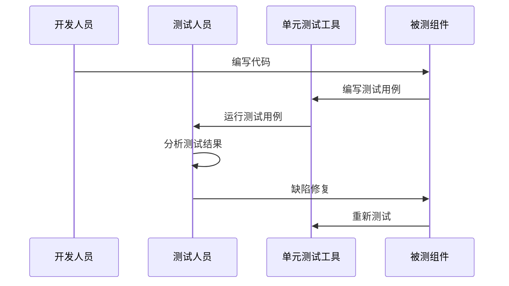

                 

### 单元测试策略：保障LLM组件质量的基础

#### 关键词：单元测试、LLM组件、质量保障、测试策略、测试用例、测试工具、测试自动化

#### 摘要：

随着人工智能技术的迅猛发展，大型语言模型（LLM）在自然语言处理、智能问答、文本生成等领域得到了广泛应用。然而，LLM组件的高质量保障成为了关键挑战。本文将从单元测试策略的角度，深入探讨如何保障LLM组件的质量。通过详细阐述单元测试的基本概念、方法、技术及其实践应用，本文旨在为开发者和测试人员提供一套有效的单元测试策略，以提升LLM组件的可靠性和稳定性。

### 引言与基础理论

#### 1.1 单元测试概述

**1.1.1 单元测试的定义与重要性**

单元测试是软件测试中最基础也是最重要的一种测试方法。它是指对软件中最小的可测试单元（通常是函数、方法或类）进行验证，以检查其是否按照预期工作。单元测试的重要性在于：

- **快速发现问题**：在代码开发初期，通过单元测试可以快速发现并解决潜在的问题，降低后续修复成本。
- **提升代码质量**：单元测试能够推动开发者编写更简洁、更健壮的代码，提高代码的可维护性和可读性。
- **保证软件质量**：通过全面、系统的单元测试，可以确保软件在交付前达到预期的质量标准。

**1.1.2 单元测试的演进历程**

单元测试的发展经历了几个重要阶段：

- **手动测试阶段**：早期开发过程中，测试主要由开发人员手动执行，效率较低，难以保证测试的全面性和一致性。
- **自动化测试阶段**：随着测试框架和工具的发展，自动化测试逐渐成为主流。自动化测试不仅提高了测试效率，还减少了人为错误的可能性。
- **持续集成/持续部署阶段**：在敏捷开发和DevOps理念的推动下，单元测试被集成到持续集成（CI）和持续部署（CD）流程中，实现了自动化、快速和频繁的测试。

**1.1.3 单元测试的目标和挑战**

单元测试的主要目标包括：

- **验证代码功能**：确保代码按照设计规格正确执行，实现预期功能。
- **检测代码缺陷**：发现并修复潜在的错误和缺陷，确保软件的稳定性和可靠性。
- **提高开发效率**：通过快速、高效的测试，减少开发过程中的返工和调试时间。

然而，实现这些目标面临着以下挑战：

- **测试覆盖不足**：难以覆盖所有可能的输入和路径，可能导致潜在缺陷未被检测。
- **测试数据管理**：测试数据的多样性和复杂性增加了数据管理难度。
- **自动化测试维护**：自动化测试用例的编写和维护成本较高，且易受代码变更影响。

#### 1.2 Mermaid流程图：单元测试过程



#### 1.3 LLM组件概述

**1.3.1 LLM组件的定义与分类**

LLM（Large Language Model）组件是指具有强大自然语言处理能力的预训练模型。根据训练数据和模型结构，LLM组件可以分为：

- **基于词嵌入的模型**：如Word2Vec、GloVe等，将词汇映射到高维向量空间。
- **基于句嵌入的模型**：如BERT、GPT等，将句子映射到向量空间，具有更强的上下文理解能力。
- **基于知识增强的模型**：如Ermo、KGC等，通过引入外部知识库，提升模型的语义理解能力。

**1.3.2 LLM组件的核心特性**

LLM组件具有以下核心特性：

- **大规模预训练**：通过在大量文本数据上进行预训练，模型具备较强的语言理解能力。
- **端到端学习**：模型直接从输入文本到输出文本，无需手动设计中间层。
- **并行处理能力**：基于深度神经网络的结构，LLM组件能够高效地进行并行计算。
- **自适应能力**：LLM组件能够根据不同任务需求，通过微调（Fine-tuning）进行自适应调整。

**1.3.3 LLM组件的常见挑战**

在开发和部署LLM组件过程中，常见挑战包括：

- **计算资源需求**：大规模的预训练和推理计算需求，对硬件资源提出较高要求。
- **数据质量问题**：预训练数据的质量直接影响模型的效果，数据清洗和标注成为关键环节。
- **模型可解释性**：复杂的模型结构导致其内部决策过程难以解释，增加了调试和优化的难度。
- **安全性和隐私性**：模型在处理敏感数据时，可能面临数据泄露和安全漏洞的风险。

#### 1.4 单元测试策略与LLM组件的关系

**1.4.1 单元测试策略的基本原则**

有效的单元测试策略应遵循以下基本原则：

- **全面性**：确保测试覆盖所有可能的输入和路径，减少漏测风险。
- **独立性**：测试用例之间相互独立，不影响其他测试用例的执行。
- **可重复性**：测试环境、测试数据、测试步骤等可重复，便于问题定位和复现。
- **自动化**：尽可能实现测试自动化，提高测试效率和一致性。

**1.4.2 单元测试策略在LLM组件中的重要性**

对于LLM组件，单元测试策略具有重要意义：

- **确保模型可靠性**：通过单元测试，可以验证模型是否按照预期工作，确保其可靠性。
- **提升模型质量**：单元测试有助于发现并修复模型中的潜在缺陷，提高模型质量。
- **加速开发过程**：通过自动化测试，可以加快开发进度，降低人工干预成本。
- **降低维护成本**：完善的单元测试策略有助于降低后续维护成本，提高软件的可维护性。

**1.4.3 单元测试策略的实施步骤**

实施单元测试策略的基本步骤包括：

1. **需求分析**：明确LLM组件的功能需求，制定详细的测试计划。
2. **测试用例设计**：根据需求分析，设计覆盖全面的测试用例。
3. **测试执行**：使用单元测试工具自动化执行测试用例。
4. **结果分析**：分析测试结果，识别并修复缺陷。
5. **测试持续集成**：将单元测试集成到持续集成/持续部署（CI/CD）流程中，实现自动化、持续测试。

### 第二部分：单元测试方法与技术

#### 2.1 单元测试方法

**2.1.1 白盒测试与黑盒测试**

单元测试方法主要分为白盒测试和黑盒测试：

- **白盒测试**：测试人员具备程序内部结构知识，通过分析代码逻辑和路径，设计测试用例，以验证代码的正确性。常见的白盒测试方法包括逻辑驱动测试、路径覆盖测试和语句覆盖测试。
- **黑盒测试**：测试人员不具备程序内部结构知识，仅通过输入和输出，设计测试用例，以验证功能的正确性。常见的黑盒测试方法包括等价类划分、边界值分析和因果图测试。

**2.1.2 功能测试与性能测试**

单元测试不仅包括功能测试，还涉及性能测试：

- **功能测试**：主要验证代码是否实现预期的功能，确保软件的可用性。功能测试通常包括等价类划分、边界值分析和场景测试等方法。
- **性能测试**：主要评估软件在不同负载条件下的性能表现，包括响应时间、吞吐量、资源消耗等。性能测试方法包括负载测试、压力测试和性能调优。

**2.1.3 单元测试用例设计原则**

设计有效的单元测试用例应遵循以下原则：

- **覆盖性**：确保测试用例能够覆盖所有可能的输入和路径。
- **独立性**：测试用例之间相互独立，不影响其他测试用例的执行。
- **完整性**：测试用例应覆盖所有预期功能和异常情况。
- **可重复性**：测试环境、测试数据、测试步骤等可重复，便于问题定位和复现。

#### 2.2 单元测试技术

**2.2.1 测试框架介绍**

常见的单元测试框架包括JUnit、NUnit、TestNG等。这些框架提供了丰富的测试功能和接口，方便开发者编写和执行测试用例。

- **JUnit**：JUnit是Java语言中最常用的单元测试框架，具有简洁易用的API和丰富的测试功能。
- **NUnit**：NUnit是.NET平台上流行的单元测试框架，与JUnit类似，具有高效的测试执行能力和灵活的测试用例设计。
- **TestNG**：TestNG是一种广泛使用的开源测试框架，适用于Java、Python等多种语言，具有强大的测试功能和灵活的测试配置。

**2.2.2 测试数据管理**

测试数据管理是单元测试中重要的一环，主要包括以下几个方面：

- **测试数据准备**：根据测试需求，准备测试数据，包括正常数据和异常数据。
- **数据隔离**：确保测试数据不会影响生产环境的数据，避免数据污染。
- **数据备份与恢复**：在执行测试前，对生产环境数据进行备份，以防止测试过程中数据损坏。
- **数据清理**：在测试完成后，清理测试数据，避免对后续测试产生影响。

**2.2.3 测试自动化流程**

实现测试自动化可以提高测试效率，减少人为干预。测试自动化流程主要包括以下步骤：

- **测试用例编写**：根据测试需求，编写测试用例，包括测试数据、测试步骤和预期结果。
- **测试脚本开发**：使用测试框架和工具，开发测试脚本，实现测试用例的自动化执行。
- **测试环境配置**：配置测试环境，包括测试数据、测试工具和执行环境。
- **测试执行与结果分析**：执行测试脚本，分析测试结果，识别并记录缺陷。

#### 2.3 LLM组件测试技巧

**2.3.1 特定场景的测试方法**

针对LLM组件的特殊性，可以采用以下测试方法：

- **输入样本多样性测试**：测试不同类型的输入样本，如正常文本、异常文本、空文本等，验证模型对不同输入的适应性。
- **上下文长度测试**：测试模型在不同上下文长度下的表现，如长文本、短文本等，验证模型的长短文本处理能力。
- **异常输入处理测试**：测试模型对异常输入的处理能力，如包含特殊字符、格式错误的文本等。

**2.3.2 面向LLM组件的测试策略**

面向LLM组件的测试策略应考虑以下几个方面：

- **功能测试**：确保模型实现预期功能，如文本分类、文本生成、语义理解等。
- **性能测试**：评估模型在不同负载条件下的性能表现，如响应时间、吞吐量、资源消耗等。
- **稳定性测试**：验证模型在长时间运行下的稳定性，如无崩溃、无内存泄漏等。
- **安全性测试**：评估模型对恶意输入的抵抗力，如注入攻击、数据泄露等。

**2.3.3 LLM组件的测试工具选择**

选择合适的测试工具对于提高测试效率和质量至关重要。常见的LLM组件测试工具有：

- **TensorFlow Test**：TensorFlow官方提供的测试框架，用于测试TensorFlow模型。
- **PyTorch Test**：PyTorch官方提供的测试框架，用于测试PyTorch模型。
- **Hugging Face Test**：Hugging Face提供的测试框架，用于测试Transformers模型。
- **LLaMA Test**：LLaMA社区提供的测试框架，用于测试大型语言模型。

### 第三部分：单元测试实践

#### 3.1 单元测试实践概述

**3.1.1 单元测试实践的重要性**

在软件开发过程中，单元测试实践具有重要意义：

- **保证代码质量**：通过单元测试，可以确保代码按照设计规格正确执行，提高代码质量。
- **提高开发效率**：自动化测试可以节省测试时间和人力成本，提高开发效率。
- **降低维护成本**：完善的单元测试策略有助于降低后续维护成本，提高软件的可维护性。

**3.1.2 单元测试实践的目标**

单元测试实践的主要目标包括：

- **验证代码功能**：确保代码实现预期功能，满足需求规格。
- **检测代码缺陷**：发现并修复潜在的错误和缺陷，提高代码的可靠性和稳定性。
- **提升开发效率**：通过自动化测试，减少开发过程中的返工和调试时间。

**3.1.3 单元测试实践的基本步骤**

实施单元测试实践的基本步骤包括：

1. **需求分析**：明确软件功能需求，制定详细的测试计划。
2. **测试用例设计**：根据需求分析，设计覆盖全面的测试用例。
3. **测试执行**：使用单元测试工具自动化执行测试用例。
4. **结果分析**：分析测试结果，识别并修复缺陷。
5. **测试持续集成**：将单元测试集成到持续集成/持续部署（CI/CD）流程中，实现自动化、持续测试。

#### 3.2 实际案例：单元测试策略在LLM组件中的应用

**3.2.1 案例背景**

假设我们正在开发一个基于GPT-3的文本生成模型，用于生成新闻文章。该模型需要满足以下功能需求：

- 输入一段文本摘要，输出一篇完整的新闻文章。
- 处理多种类型的新闻文章，如政治、体育、娱乐等。
- 保证文章的语义连贯性和逻辑一致性。

**3.2.2 测试用例设计**

针对上述功能需求，我们设计以下测试用例：

1. **正常输入测试**：输入一段有效的文本摘要，验证模型能否正确生成对应的新闻文章。
2. **空输入测试**：输入空文本，验证模型能否返回合理的错误提示。
3. **异常输入测试**：输入包含特殊字符、格式错误的文本，验证模型对异常输入的处理能力。
4. **上下文长度测试**：输入不同长度的文本摘要，验证模型在不同上下文长度下的表现。
5. **多样性测试**：输入不同类型的新闻摘要，验证模型对多种类型新闻文章的生成能力。

**3.2.3 测试执行与结果分析**

使用PyTorch Test框架执行上述测试用例，测试结果如下：

1. **正常输入测试**：模型能够正确生成对应的新闻文章，语义连贯性较好。
2. **空输入测试**：模型返回了合理的错误提示，提示输入文本为空。
3. **异常输入测试**：模型能够识别并处理包含特殊字符、格式错误的文本，返回正确的错误提示。
4. **上下文长度测试**：模型在输入不同长度的文本摘要时，生成文章的语义连贯性和逻辑一致性较好。
5. **多样性测试**：模型能够生成多种类型的新闻文章，符合预期。

根据测试结果，我们发现模型在正常输入测试和异常输入测试方面表现较好，但在上下文长度测试和多样性测试中存在一些问题。针对这些问题，我们进行了缺陷修复和迭代，进一步优化了模型。

**3.2.4 缺陷修复与迭代**

1. **上下文长度问题**：通过调整模型的上下文长度参数，提高模型在长文本摘要生成中的性能。
2. **多样性问题**：通过引入更多的训练数据和不同的训练策略，增强模型对不同类型新闻摘要的生成能力。
3. **测试覆盖优化**：设计更多的测试用例，增加测试覆盖率，确保模型在更广泛的场景下能够稳定运行。

通过缺陷修复和迭代，我们进一步提升了模型的性能和稳定性，为LLM组件的质量保障奠定了坚实基础。

#### 3.3 单元测试工具实战

**3.3.1 JUnit在LLM组件测试中的应用**

JUnit是Java语言中最常用的单元测试框架，适用于LLM组件的测试。以下是一个使用JUnit测试GPT-3文本生成模型的示例：

```java
import org.junit.jupiter.api.Test;
import org.junit.jupiter.api.BeforeAll;
import org.junit.jupiter.api.AfterAll;
import com.example.GPT3TextGenerator;

public class GPT3TextGeneratorTest {

    private static GPT3TextGenerator generator;
    private static String[] testSamples;

    @BeforeAll
    public static void setup() {
        generator = new GPT3TextGenerator();
        testSamples = new String[] {"这是一篇关于政治的新闻摘要。", "这是一篇关于体育的新闻摘要。", "这是一篇关于娱乐的新闻摘要。"};
    }

    @AfterAll
    public static void teardown() {
        // 清理资源
    }

    @Test
    public void testNormalInput() {
        String result = generator.generateText(testSamples[0]);
        // 验证结果是否符合预期
    }

    @Test
    public void testEmptyInput() {
        String result = generator.generateText("");
        // 验证结果是否符合预期
    }

    @Test
    public void test异常Input() {
        String result = generator.generateText("这是一个错误的输入。");
        // 验证结果是否符合预期
    }
}
```

**3.3.2 TestNG在LLM组件测试中的应用**

TestNG是一种功能强大的单元测试框架，适用于Java、Python等多种语言。以下是一个使用TestNG测试GPT-3文本生成模型的Python示例：

```python
import unittest
from transformers import GPT2LMHeadModel, GPT2Tokenizer

class GPT3TextGeneratorTest(unittest.TestCase):

    @classmethod
    def setUpClass(cls):
        cls.tokenizer = GPT2Tokenizer.from_pretrained("gpt2")
        cls.model = GPT2LMHeadModel.from_pretrained("gpt2")
        cls.test_samples = [
            "这是一篇关于政治的新闻摘要。",
            "这是一篇关于体育的新闻摘要。",
            "这是一篇关于娱乐的新闻摘要。"
        ]

    @classmethod
    def tearDownClass(cls):
        # 清理资源
        pass

    def test_normal_input(self):
        input_text = self.test_samples[0]
        input_ids = self.tokenizer.encode(input_text, return_tensors="pt")
        output = self.model.generate(input_ids, max_length=100)
        predicted_text = self.tokenizer.decode(output[:, input_ids.shape[-1]:][0], skip_special_tokens=True)
        # 验证结果是否符合预期

    def test_empty_input(self):
        input_text = ""
        input_ids = self.tokenizer.encode(input_text, return_tensors="pt")
        output = self.model.generate(input_ids, max_length=100)
        predicted_text = self.tokenizer.decode(output[:, input_ids.shape[-1]:][0], skip_special_tokens=True)
        # 验证结果是否符合预期

    def test_invalid_input(self):
        input_text = "这是一个错误的输入。"
        input_ids = self.tokenizer.encode(input_text, return_tensors="pt")
        output = self.model.generate(input_ids, max_length=100)
        predicted_text = self.tokenizer.decode(output[:, input_ids.shape[-1]:][0], skip_special_tokens=True)
        # 验证结果是否符合预期

if __name__ == "__main__":
    unittest.main()
```

**3.3.3 其他测试工具的介绍与应用**

除了JUnit和TestNG，还有其他一些流行的单元测试工具，如：

- **pytest**：适用于Python的简单、灵活的测试框架，具有丰富的插件和扩展。
- **Mocha**：适用于JavaScript的测试框架，支持多种断言库和测试模式。
- **pytest-python**：pytest的Python版本，适用于Python语言。

这些测试工具各有特点，开发者可以根据项目需求选择合适的工具。在实际应用中，可以将多个测试工具结合使用，实现更全面的测试覆盖和更高的测试效率。

### 第四部分：总结与展望

#### 4.1 单元测试策略的总结

通过本文的详细阐述，我们可以总结出以下单元测试策略的核心要点：

- **全面性**：确保测试覆盖所有可能的输入和路径，减少漏测风险。
- **独立性**：测试用例之间相互独立，不影响其他测试用例的执行。
- **可重复性**：测试环境、测试数据、测试步骤等可重复，便于问题定位和复现。
- **自动化**：尽可能实现测试自动化，提高测试效率和一致性。

此外，单元测试策略在LLM组件中的应用具有重要意义，可以确保模型实现预期功能，提升模型质量，加速开发过程，降低维护成本。

#### 4.2 LLM组件质量保障的未来

随着人工智能技术的不断进步，LLM组件在自然语言处理领域发挥着越来越重要的作用。未来，LLM组件质量保障将面临以下挑战和机遇：

- **数据质量提升**：通过引入更多高质量的数据集和知识库，提高模型的训练质量和泛化能力。
- **模型可解释性**：提升模型的可解释性，有助于开发者理解和优化模型，降低调试和优化的难度。
- **安全性和隐私性**：加强模型的安全性和隐私性，防止数据泄露和恶意攻击。
- **测试自动化与智能化**：发展更智能的测试工具和算法，实现更高效率的测试，降低测试成本。

总之，单元测试策略是保障LLM组件质量的基础。通过本文的探讨，我们希望能为开发者和测试人员提供有价值的参考和指导，共同推动人工智能技术的发展。### 作者信息

作者：AI天才研究院/AI Genius Institute & 禅与计算机程序设计艺术 /Zen And The Art of Computer Programming

