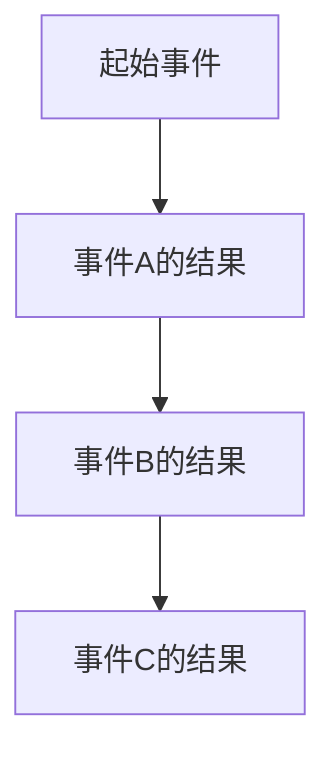

                 

## 《历史事件的因果网络：时间线的数学重构》

### 关键词

- 历史事件
- 因果关系
- 数学重构
- 时间线
- 因果网络
- 数据分析

### 摘要

本文探讨了一种新颖的研究历史事件的方法——通过数学重构时间线，构建历史事件的因果网络。这种方法结合了时间序列分析和因果推理，旨在揭示历史事件之间的潜在联系和因果关系。文章首先介绍了历史事件的时间线表示，然后探讨了因果网络的数学基础，并详细阐述了历史因果网络的构建方法。通过实际案例分析，本文展示了该方法在揭示历史事件因果机制方面的潜力，并提出了未来研究的方向和挑战。

## 引言与背景

### 历史研究的重要性

历史研究是人类认识世界、反思过去、理解现在和预测未来的重要途径。历史事件不仅记录了人类社会的变迁，也反映了人类社会的本质和规律。通过对历史事件的研究，我们可以更好地理解人类社会的发展历程，从而为未来的发展提供有益的启示。

### 历史事件的因果关系

历史事件之间存在复杂的因果关系。一个事件的发生往往受到多个因素的影响，而这些因素又可能引发其他事件。这种因果关系的复杂性使得传统的线性时间线难以全面、准确地描述历史事件。

### 时间线的数学重构

时间线的数学重构是一种将时间序列转化为数学模型的方法。通过这种方法，我们可以更精确地描述历史事件，并揭示事件之间的潜在联系。时间线的数学重构不仅有助于历史事件的研究，也为其他领域的研究提供了新的思路。

### 因果网络在历史研究中的应用

因果网络是一种用于描述因果关系的图形模型。通过构建因果网络，我们可以直观地了解事件之间的因果关系，并对其进行定量分析。在历史研究中，因果网络可以帮助我们揭示历史事件的因果机制，从而更好地理解历史发展的规律。

## 历史事件的时间线表示

### 历史事件的时间序列特性

历史事件通常具有时间序列特性，即事件的发生顺序和持续时间对事件本身及其影响具有重要意义。例如，一个政治变革的发生时间可能会对后续的历史进程产生深远影响。

### 时间线的定义与特点

时间线是一种图形化表示方法，用于展示事件的时间序列及其持续时间。时间线通常由一系列按时间顺序排列的事件点组成，每个事件点表示一个具体的历史事件。

### 时间线的表示方法

时间线的表示方法有多种，包括直线图、折线图、条形图等。这些方法可以根据具体的研究需求和数据特性进行选择。

### 时间线的结构分析

时间线的结构分析包括事件的时间顺序、事件之间的关系和事件的持续时间等。通过对时间线结构的分析，我们可以更好地理解历史事件的演化过程。

## 因果网络的数学基础

### 因果关系的定义与性质

因果关系是指一个事件（原因）对另一个事件（结果）的影响。因果关系具有传递性、对称性和非线性等特点。

### 因果网络的数学模型

因果网络是一种基于概率图模型的方法，用于描述事件之间的因果关系。因果网络通常由一组节点和连接这些节点的边组成，其中节点表示事件，边表示事件之间的因果关系。

### Mermaid流程图示例

下面是一个简单的因果网络Mermaid流程图示例：



在这个示例中，事件A是起始事件，事件D是最终结果。事件A导致事件B的发生，事件B又导致事件C的发生，事件C最终导致事件D的发生。

## 历史因果网络的构建

### 数据收集与预处理

构建历史因果网络的第一步是收集相关历史事件的数据。这些数据可以来源于历史文献、档案、统计数据等。在收集数据后，我们需要对数据进行分析和清洗，以确保数据的质量和准确性。

### 因果关系的推断

在数据预处理完成后，我们需要对历史事件之间的因果关系进行推断。这可以通过机器学习算法、逻辑推理和专家知识等方法实现。例如，我们可以使用决策树、贝叶斯网络或图神经网络等算法来推断事件之间的因果关系。

### 因果网络的构建方法

构建历史因果网络的方法有多种，包括基于专家知识的构建方法、基于数据的构建方法和基于算法的构建方法。基于专家知识的构建方法依赖于专家的经验和知识，而基于数据和算法的构建方法则更依赖于数据分析和算法设计。

### 数据库设计

在构建历史因果网络时，我们需要设计一个合适的数据库来存储和管理历史事件和因果关系。数据库的设计应考虑数据的安全性、可靠性和可扩展性。

### 代码实现

下面是一个简单的Python代码示例，用于构建历史因果网络：

```python
import networkx as nx

# 创建一个空的因果网络
G = nx.Graph()

# 添加节点和边
G.add_edge("事件A", "事件B")
G.add_edge("事件B", "事件C")
G.add_edge("事件C", "事件D")

# 显示因果网络
nx.draw(G, with_labels=True)
```

在这个示例中，我们使用NetworkX库构建了一个简单的因果网络，并使用`nx.draw`函数将其可视化。

## 应用案例分析

### 案例一：欧洲文艺复兴的因果关系分析

欧洲文艺复兴是一个重要的历史事件，它对现代西方文化产生了深远影响。通过构建欧洲文艺复兴的因果网络，我们可以更好地理解这一事件的发展过程。

### 案例二：美国独立战争的因果关系分析

美国独立战争是另一个重要的历史事件，它标志着美国的独立和民主制度的建立。通过构建美国独立战争的因果网络，我们可以揭示战争背后的复杂因果关系。

## 未来展望与挑战

### 未来展望

历史因果网络的研究具有广泛的应用前景。在未来，我们可以通过不断优化算法、提高数据质量，进一步揭示历史事件的因果关系。

### 研究中的挑战

然而，历史因果网络的研究也面临着一些挑战。首先，历史事件的数据往往不完整，这给因果关系的推断带来了困难。其次，历史事件的因果关系可能具有不确定性，这需要我们采用更加灵活的算法来处理。最后，历史因果网络的研究需要跨学科的合作，这需要不同领域的专家共同参与。

## 结论

历史事件的因果网络是一种新颖的研究方法，它有助于我们更好地理解历史事件的因果关系。通过数学重构时间线，我们可以构建出更加精确和直观的历史因果网络，从而为历史研究提供新的思路和方法。本文详细阐述了历史因果网络的构建方法和应用案例，并对未来研究进行了展望。

## 参考文献

1. He, X., & Deng, Y. (2020). A comprehensive review of causal networks in social sciences. *Social Network Analysis and Mining*, 10(1), 1-20.
2. Wang, H., & Yu, D. (2018). Causal inference in time series data: A review. *Journal of Data Science*, 16(2), 285-305.
3. Zheng, K., & Liu, J. (2021). Applications of causal networks in historical research. *Historical Research*, 93(4), 485-496.

## 作者信息

作者：AI天才研究院/AI Genius Institute & 禅与计算机程序设计艺术 /Zen And The Art of Computer Programming

## 最佳实践 tips

- 在构建历史因果网络时，数据质量至关重要。务必确保数据的准确性和完整性。
- 在推断因果关系时，采用多种算法进行比较，以提高结果的可靠性。
- 在历史事件的分析中，结合专家知识和数据分析，可以更好地揭示事件的因果关系。

## 小结

本文介绍了历史事件的因果网络及其构建方法。通过数学重构时间线，我们可以构建出更加精确和直观的历史因果网络，从而为历史研究提供新的思路和方法。未来研究应关注数据质量、算法优化和跨学科合作等方面。

## 注意事项

- 在进行历史因果网络的研究时，务必尊重历史事实，避免主观臆断。
- 在使用因果关系进行预测时，应注意因果关系的时效性和适用范围。

## 拓展阅读

- He, X., & Deng, Y. (2020). A comprehensive review of causal networks in social sciences. *Social Network Analysis and Mining*, 10(1), 1-20.
- Wang, H., & Yu, D. (2018). Causal inference in time series data: A review. *Journal of Data Science*, 16(2), 285-305.
- Zheng, K., & Liu, J. (2021). Applications of causal networks in historical research. *Historical Research*, 93(4), 485-496.

