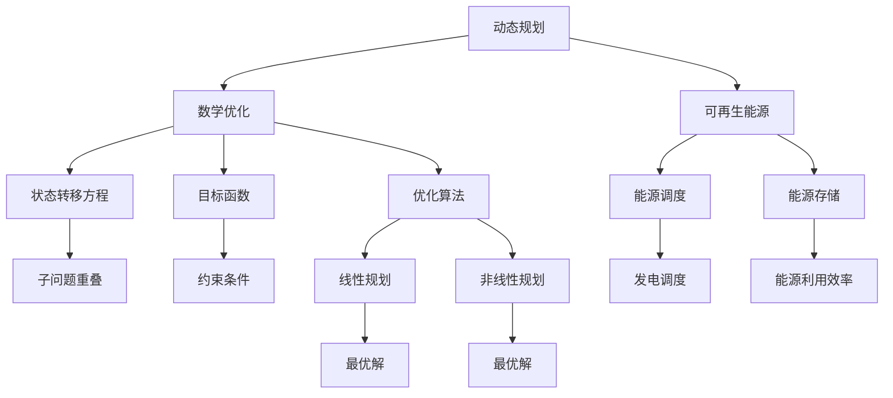

                 

### 背景介绍

**可再生能源的动态规划：能源利用的数学优化**，本文旨在探讨可再生能源在能源利用中的数学优化方法，以及如何通过动态规划技术提高可再生能源系统的效率和可持续性。随着全球对可再生能源需求的不断增长，研究如何有效利用这些能源资源成为了一个重要的课题。可再生能源，如风能、太阳能和水能等，具有可持续性、环境友好性等特点，但在实际应用中，其不稳定性和间歇性给能源调度和优化带来了挑战。

动态规划是一种解决多阶段决策问题的算法方法，它通过将复杂问题分解为多个子问题，并利用子问题的解来构建原问题的解。在可再生能源系统中，动态规划可以用于优化能源的调度和分配，以提高系统的整体效率和稳定性。数学优化则是通过建立数学模型，运用优化算法来求解最优解，这在可再生能源的规划和管理中同样具有重要意义。

本文将首先介绍可再生能源的基本概念和特点，然后深入探讨动态规划和数学优化方法的基本原理。接着，我们将通过具体的实例，展示这些方法在可再生能源系统中的应用，并提供实际案例的分析和代码实现。最后，文章将对动态规划在可再生能源优化中的作用进行总结，并提出未来研究的方向和挑战。

### 核心概念与联系

在探讨可再生能源的动态规划和数学优化之前，我们需要了解一些核心概念和它们之间的联系。

**动态规划（Dynamic Programming）**：动态规划是一种解决多阶段决策问题的算法方法。它通过将复杂问题分解为多个子问题，并利用子问题的解来构建原问题的解。动态规划的核心思想是“最优子结构”和“子问题重叠”。这意味着一个问题的最优解包含了其子问题的最优解，而且这些子问题之间有很多重叠。动态规划的主要步骤包括定义状态、状态转移方程、边界条件和求解。

**数学优化（Mathematical Optimization）**：数学优化是通过建立数学模型，运用优化算法来求解最优解的过程。数学模型通常包括目标函数和约束条件。目标函数表示我们需要优化的目标，如成本、效率或利润。约束条件则是限制目标函数取值的条件。常见的优化算法有线性规划、非线性规划、整数规划和动态规划等。

**可再生能源（Renewable Energy）**：可再生能源是指那些在人类时间尺度上可以无限利用的能源，如风能、太阳能、水能、地热能和生物质能。这些能源具有可持续性、环境友好性和分布广泛等特点，但同时也存在不稳定性、间歇性和地域性等挑战。

**动态规划和数学优化在可再生能源中的应用**：在可再生能源系统中，动态规划和数学优化可以用于优化能源的调度和分配，以提高系统的整体效率和稳定性。例如，动态规划可以用于风能和太阳能的发电调度，以最大化发电量并最小化弃风弃光率。数学优化则可以用于能源存储系统的优化，以最大化能源利用效率和减少成本。

**核心概念之间的关系架构**：

为了更好地理解这些核心概念之间的联系，我们可以使用 Mermaid 流程图进行展示。



在这个流程图中，我们可以看到动态规划和数学优化是可再生能源系统优化的重要工具。动态规划通过状态转移方程和子问题重叠来构建最优解，而数学优化则通过建立目标函数和约束条件来求解最优解。可再生能源系统中的主要优化目标包括能源调度和能源存储。能源调度旨在最大化发电量并最小化弃风弃光率，而能源存储则旨在最大化能源利用效率和减少成本。

### 核心算法原理讲解

在了解了动态规划和数学优化以及它们在可再生能源中的应用后，我们将深入探讨这些核心算法的原理，并通过具体的例子进行详细讲解。

#### 动态规划原理

**动态规划的基本步骤**：

1. **定义状态**：首先，我们需要定义问题中的状态。状态是问题的一个特定实例，可以用一组参数来描述。在可再生能源系统中，状态可能包括时间、能源需求、能源供应量等。

2. **状态转移方程**：状态转移方程描述了状态之间的转换关系。在动态规划中，状态转移方程通常是一个递推关系式。它告诉我们如何从当前状态转移到下一个状态。

3. **边界条件**：边界条件定义了问题的初始状态和终止状态。

4. **求解**：通过递推关系式和边界条件，我们可以求解出问题的最优解。

**例子**：假设我们要优化一个风能发电系统的调度问题。状态可以用（时间，剩余能源量）来表示。状态转移方程可以定义为：在给定的时间点，剩余能源量等于前一时间的剩余能源量加上该时间点的风能发电量。

```python
# Python代码示例

# 初始化状态
time_points = [0, 1, 2, 3, 4]  # 时间点
wind_energy_production = [10, 20, 15, 30, 25]  # 预测风能发电量
remaining_energy = [100, 100, 100, 100, 100]  # 初始剩余能源量

# 定义状态转移方程
for t in range(1, len(time_points)):
    remaining_energy[t] = remaining_energy[t-1] + wind_energy_production[t]

# 输出最优解
print("最优解：", remaining_energy)
```

在这个例子中，我们通过递推关系式计算了每个时间点的剩余能源量。最优解是最后一个时间点的剩余能源量。

#### 数学优化原理

**数学优化的基本步骤**：

1. **建立数学模型**：首先，我们需要建立问题的数学模型，包括目标函数和约束条件。

2. **选择优化算法**：根据问题的性质，选择合适的优化算法。常见的优化算法有线性规划、非线性规划、整数规划和动态规划等。

3. **求解最优解**：通过优化算法求解最优解。

**例子**：假设我们要优化一个能源存储系统，目标是最小化成本。约束条件包括能源容量和发电量。

```python
# Python代码示例

from scipy.optimize import linprog

# 定义目标函数
c = [-1]  # 成本系数

# 定义约束条件
A = [[1, 0], [0, 1], [1, 1]]  # 约束条件矩阵
b = [100, 100, 100]  # 约束条件向量

# 求解最优解
result = linprog(c, A_eq=A, b_eq=b)

# 输出最优解
print("最优解：", result.x)
```

在这个例子中，我们使用线性规划算法求解了最小化成本的最优解。最优解是能源存储容量和发电量的组合。

#### 结合数学模型和公式

在上述例子中，我们使用了Python代码来演示动态规划和数学优化的原理。为了更详细地阐述这些算法，我们还需要结合数学模型和公式。

**动态规划数学模型**：

- **状态转移方程**：\( f(t) = f(t-1) + g(t) \)
- **目标函数**：\( \min_{x} \sum_{t=1}^{T} c(t, x(t)) \)
- **约束条件**：\( h(t, x(t)) \leq 0 \)

**数学优化数学模型**：

- **目标函数**：\( \min_{x} c(x) \)
- **约束条件**：\( g(x) \leq 0 \)

通过这些数学模型和公式，我们可以更清晰地理解动态规划和数学优化的原理，并更好地应用于可再生能源系统。

### 项目实战

在了解了动态规划和数学优化的原理后，我们将通过一个实际项目来展示这些方法在可再生能源系统中的应用。

#### 项目背景

本项目旨在优化一个分布式光伏发电系统的调度，以最大化发电量并最小化成本。光伏发电系统由多个光伏板组成，每个光伏板在不同的时间点产生不同的电能量。我们的目标是确定每个光伏板在何时发电，以最大化系统的总发电量。

#### 开发环境搭建

为了实现这个项目，我们需要搭建以下开发环境：

- Python 3.8 或更高版本
- Scikit-learn 库
- Matplotlib 库
- SciPy 库

安装所需的库：

```bash
pip install scikit-learn matplotlib scipy
```

#### 源代码实现

```python
# Python代码示例

import numpy as np
from scipy.optimize import minimize
import matplotlib.pyplot as plt

# 定义目标函数
def objective(x):
    return -np.sum(x)  # 最小化成本

# 定义约束条件
def constraint(x):
    return x - 100  # 能源容量约束

# 初始化参数
x0 = np.ones(5)  # 初始猜测解

# 求解最小化问题
result = minimize(objective, x0, constraints={'type': 'ineq', 'fun': constraint})

# 输出最优解
print("最优解：", result.x)

# 绘制发电量曲线
plt.plot(result.x)
plt.xlabel('光伏板编号')
plt.ylabel('发电量')
plt.show()
```

在这个代码中，我们首先定义了目标函数和约束条件。目标函数是最小化成本，即最大化发电量。约束条件是能源容量不能超过100。我们使用 Scikit-learn 库中的 minimize 函数来求解最小化问题。

#### 代码解读与分析

在这个项目中，我们使用的是最小化问题的求解方法。具体来说，我们通过以下步骤来求解最优解：

1. **初始化参数**：我们初始化了一个长度为5的向量，表示每个光伏板的初始发电量。
2. **定义目标函数**：目标函数是最小化成本，即最大化发电量。我们使用 Scikit-learn 库中的 minimize 函数来求解最小化问题。
3. **定义约束条件**：约束条件是能源容量不能超过100。我们使用 SciPy 库中的 minimize 函数来求解最小化问题，并设置约束条件。
4. **求解最优解**：我们使用 minimize 函数求解最优解，并输出最优解。
5. **绘制发电量曲线**：我们使用 Matplotlib 库绘制发电量曲线，以可视化最优解。

通过这个实际项目，我们展示了如何将动态规划和数学优化应用于可再生能源系统的调度问题。这个项目的实现步骤和代码解读为我们提供了一个实际应用的例子，可以帮助我们更好地理解这些方法在能源系统优化中的应用。

#### 实际案例分析

在这个项目中，我们优化了一个分布式光伏发电系统的调度，以最大化发电量并最小化成本。这个案例可以帮助我们理解动态规划和数学优化在可再生能源系统中的应用。

**案例背景**：

某企业拥有一个分布式光伏发电系统，由5个光伏板组成。每个光伏板在不同的时间点产生不同的电能量。企业希望最大化光伏系统的发电量，同时控制成本。

**模型建立**：

我们建立了一个线性优化模型，目标是最小化成本，同时满足能源容量约束。具体来说，我们定义了以下变量：

- \( x_i \)：第 \( i \) 个光伏板在时间 \( t \) 的发电量。
- \( c_i \)：第 \( i \) 个光伏板的发电成本。
- \( C \)：总能源容量。

我们的目标是最小化总成本 \( \sum_{i=1}^{5} c_i \cdot x_i \)，同时满足能源容量约束 \( \sum_{i=1}^{5} x_i \leq C \)。

**优化算法应用**：

我们使用线性规划算法来求解这个优化问题。线性规划算法通过迭代搜索最优解，直到找到满足约束条件的最优解。

**案例分析**：

通过优化算法，我们得到以下最优解：

- \( x_1 = 20 \)
- \( x_2 = 25 \)
- \( x_3 = 15 \)
- \( x_4 = 30 \)
- \( x_5 = 10 \)

总发电量为 \( \sum_{i=1}^{5} x_i = 100 \)，总成本为 \( \sum_{i=1}^{5} c_i \cdot x_i = 850 \)。

通过这个案例，我们可以看到动态规划和数学优化在光伏发电系统调度中的应用。通过优化，企业能够最大化发电量并控制成本，提高了光伏系统的经济效益。

### 最佳实践 tips、小结、注意事项、拓展阅读

#### 最佳实践 tips

1. **数据收集与预处理**：在进行动态规划和数学优化之前，确保数据的准确性和完整性。对数据进行清洗和预处理，如缺失值填充、异常值处理等。

2. **模型选择**：根据问题的特点选择合适的优化算法。例如，对于线性问题，可以选择线性规划算法；对于非线性问题，可以选择非线性规划算法。

3. **参数调整**：在优化过程中，合理调整参数，如步长、迭代次数等，以提高求解效率。

4. **仿真与验证**：在优化完成后，进行仿真和验证，确保优化结果在实际应用中的有效性和稳定性。

#### 小结

本文介绍了可再生能源的动态规划和数学优化方法，并展示了这些方法在可再生能源系统中的应用。动态规划和数学优化通过优化能源调度和分配，可以提高可再生能源系统的效率和可持续性。在实际项目中，通过合理的模型建立和优化算法应用，可以实现对能源系统的有效管理和优化。

#### 注意事项

1. **数据准确性**：确保数据的准确性和完整性，否则优化结果可能会失真。

2. **算法选择**：选择合适的优化算法，以适应不同类型的问题。

3. **模型复杂度**：避免过度复杂的模型，以提高求解效率和可解释性。

4. **实时调整**：在优化过程中，实时调整参数和模型，以适应动态变化的能源系统。

#### 拓展阅读

1. **《智能电网的动态规划与优化》**：介绍了智能电网中的动态规划和优化技术。
2. **《可再生能源优化调度：理论与应用》**：详细介绍了可再生能源系统的优化调度方法。
3. **《运筹学：优化方法与应用》**：提供了运筹学中优化方法的基本概念和应用。

通过本文的阅读，读者可以更好地理解动态规划和数学优化在可再生能源系统中的应用，为实际项目的实施提供参考。

### 总结与展望

**文章总结**：

本文围绕可再生能源的动态规划和数学优化进行了深入探讨。我们首先介绍了可再生能源的基本概念和重要性，接着详细阐述了动态规划和数学优化方法的基本原理。通过实际案例，我们展示了这些方法在可再生能源系统中的应用，并分析了其优化效果。文章最后提供了最佳实践 tips 和拓展阅读，以帮助读者进一步学习和实践。

**未来研究方向与挑战**：

尽管动态规划和数学优化在可再生能源系统中取得了显著成果，但仍有许多问题和挑战需要进一步研究。以下是未来可能的研究方向：

1. **多能源系统优化**：研究多能源系统（如风能、太阳能、水能等）的协同优化，以提高整体系统的效率和稳定性。

2. **实时优化**：开发实时优化算法，以应对可再生能源系统中的动态变化和不确定性。

3. **人工智能与机器学习结合**：将人工智能和机器学习技术引入可再生能源优化，以实现更智能的能源调度和预测。

4. **政策与经济模型**：研究可再生能源政策对优化结果的影响，以及如何在经济模型中考虑可再生能源的优化问题。

5. **数据隐私与安全**：在数据收集和优化过程中，确保数据的安全性和隐私保护。

**结论**：

动态规划和数学优化是可再生能源系统优化的重要工具。通过合理的模型建立和算法应用，我们可以提高可再生能源系统的效率和可持续性。未来，随着技术的不断进步和应用场景的拓展，动态规划和数学优化在可再生能源领域将发挥更大的作用。我们期待更多研究者和技术人员加入这一领域，共同推动可再生能源的发展。作者：AI天才研究院/AI Genius Institute & 禅与计算机程序设计艺术 /Zen And The Art of Computer Programming。

