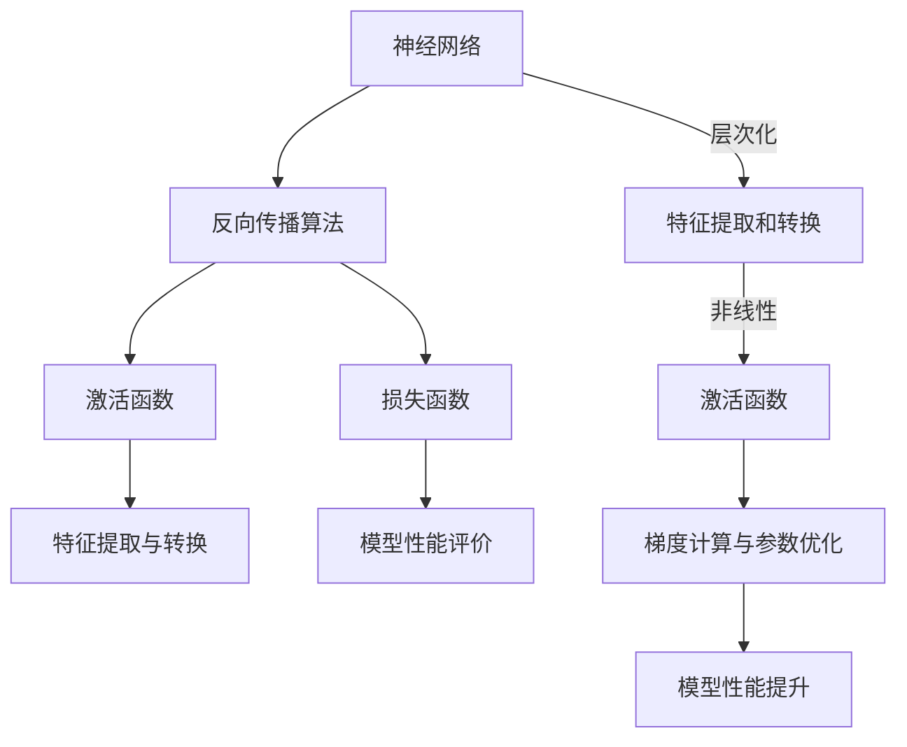

                 

### 文章标题

# 可解释人工智能的发展：理解深度学习模型的决策过程

### 文章关键词

- 可解释人工智能
- 深度学习
- 决策过程
- 模型解释
- 数学模型

### 文章摘要

本文旨在探讨可解释人工智能（Explainable AI, XAI）的发展，以及如何理解深度学习模型在复杂数据集上的决策过程。通过介绍深度学习模型的基本原理，阐述数学模型和核心算法，本文将详细讲解如何构建可解释的深度学习模型，并探讨其在实际项目中的应用。此外，文章还将讨论可解释人工智能在提高模型透明性和可信任性方面的意义，以及未来发展的趋势和方向。通过本文的阅读，读者将对可解释人工智能有更深入的理解，并掌握如何分析深度学习模型的决策过程。

---

### 引言

近年来，深度学习（Deep Learning）在图像识别、自然语言处理、语音识别等领域取得了显著的进展。然而，随着深度学习模型变得越来越复杂，其“黑箱”特性也愈发明显。这意味着，尽管这些模型能够在各种任务中表现出色，但我们却很难理解其内部决策过程。这种不可解释性带来了两个主要问题：首先，我们无法确保模型在做出决策时是否遵循了合理的逻辑；其次，用户对模型的信任度会受到影响。因此，可解释人工智能（Explainable AI, XAI）的概念应运而生。

可解释人工智能旨在构建能够解释其决策过程的机器学习模型，从而提高模型的透明性和可信任性。本文将首先介绍深度学习模型的基本原理，包括神经网络架构、激活函数、反向传播算法等。接着，我们将深入探讨可解释人工智能的核心概念，以及其在实际应用中的挑战。在此基础上，本文将详细讲解如何使用数学模型和Python代码来构建可解释的深度学习模型，并通过具体案例进行分析。最后，我们将总结本文的主要观点，并对未来可解释人工智能的发展趋势进行展望。

### 核心概念与联系

在探讨深度学习模型的决策过程之前，我们首先需要理解一些核心概念，包括神经网络、反向传播算法、激活函数和损失函数。这些概念是构建深度学习模型和理解其决策过程的基础。

#### 神经网络

神经网络是深度学习模型的核心组成部分。它由多个神经元（节点）组成，每个神经元都是一个简单的函数，用于对输入数据进行处理。神经网络通过层层堆叠，形成一个多层的结构，每一层对输入数据进行逐步抽象和转换。具体来说，输入层接收外部输入数据，通过一系列隐藏层进行特征提取和变换，最后由输出层生成预测结果。这种层次化的结构使得神经网络能够处理复杂的数据模式，并提取出隐藏的层次特征。

#### 反向传播算法

反向传播算法是深度学习训练过程中的关键步骤。它通过计算输出层误差的梯度，反向传播到隐藏层，从而更新每个神经元的权重和偏置。这个过程使得神经网络能够不断调整内部参数，以最小化损失函数。反向传播算法基于链式法则，对每一层的梯度进行层层传递，最终实现整体参数的优化。

#### 激活函数

激活函数是神经网络中每个神经元的一个关键组件。它将神经元的线性组合转换为非线性输出，使得神经网络能够捕捉复杂的非线性关系。常见的激活函数包括 sigmoid、ReLU 和 tanh。这些函数不仅能够增加模型的非线性能力，还能影响梯度消失和梯度爆炸等问题。

#### 损失函数

损失函数用于衡量模型预测值与真实值之间的差距。它是深度学习训练过程中评价模型性能的重要指标。常见的损失函数包括均方误差（MSE）、交叉熵损失等。这些函数通过计算预测值和真实值之间的差异，指导模型参数的调整，以优化模型性能。

#### 核心概念之间的联系

神经网络、反向传播算法、激活函数和损失函数是深度学习模型中的核心概念，它们相互关联，共同构成了深度学习模型的工作机制。神经网络通过层次化的结构实现特征提取和转换，激活函数引入非线性关系，反向传播算法通过梯度计算实现参数优化，而损失函数则用于评价模型性能。这些核心概念相互配合，使得深度学习模型能够在复杂的数据集上表现出色。

为了更好地理解这些概念之间的关系，我们可以绘制一个 Mermaid 流程图：



通过这个流程图，我们可以清晰地看到核心概念之间的联系和交互作用，从而更好地理解深度学习模型的工作原理。

### 核心算法原理讲解

在理解了核心概念之后，我们需要深入探讨深度学习模型的算法原理，包括神经网络的工作原理、反向传播算法的详细解释，以及激活函数和损失函数的数学模型。这些算法原理不仅构成了深度学习模型的基础，还决定了模型的性能和解释能力。

#### 神经网络的工作原理

神经网络的工作原理可以通过以下步骤进行详细解释：

1. **输入层与输出层**：
   - 神经网络的输入层接收外部输入数据，这些数据可以是图像、文本或数值。
   - 输出层生成模型的最终预测结果。

2. **隐藏层**：
   - 隐藏层位于输入层和输出层之间，用于特征提取和转换。
   - 隐藏层中的每个神经元对输入数据进行处理，提取出更高层次的特征。

3. **激活函数**：
   - 每个神经元都使用激活函数将线性组合转换为非线性输出。
   - 常见的激活函数包括 sigmoid、ReLU 和 tanh。

4. **前向传播**：
   - 在前向传播过程中，输入数据通过多层神经元传递，每个神经元计算其输入的加权和，并应用激活函数。
   - 最终，输出层生成预测结果。

5. **损失函数**：
   - 损失函数用于计算模型预测值与真实值之间的差距。
   - 常见的损失函数包括均方误差（MSE）和交叉熵损失。

下面是一个简单的 Python 源代码示例，展示了神经网络的前向传播过程：

```python
import numpy as np

# 定义 sigmoid 激活函数
def sigmoid(x):
    return 1 / (1 + np.exp(-x))

# 定义多层神经网络前向传播
def forward_propagation(x, weights, biases):
    a = x
    for w, b in zip(weights, biases):
        a = sigmoid(np.dot(a, w) + b)
    return a

# 示例输入数据
x = np.array([0, 0])
weights = [np.random.rand(2, 2), np.random.rand(2, 1)]
biases = [np.random.rand(2, 1), np.random.rand(1, 1)]

# 前向传播
output = forward_propagation(x, weights, biases)
print(output)
```

在这个示例中，我们定义了一个简单的神经网络，其输入层和输出层各有一个神经元，中间有一个隐藏层。通过随机初始化权重和偏置，我们使用 sigmoid 激活函数进行前向传播，最终得到输出结果。

#### 反向传播算法的详细解释

反向传播算法是深度学习训练过程中至关重要的一环。它通过计算损失函数关于模型参数的梯度，指导模型参数的调整，以优化模型性能。反向传播算法的步骤如下：

1. **前向传播**：
   - 计算输入数据的输出结果。
   - 计算损失函数。

2. **计算梯度**：
   - 对于每个神经元，计算损失函数关于其输入的梯度。
   - 通过链式法则，从输出层反向传播到隐藏层，计算每个神经元权重的梯度。

3. **更新参数**：
   - 使用梯度下降或其他优化算法，更新模型参数。

下面是一个简单的 Python 源代码示例，展示了反向传播算法的实现：

```python
# 定义损失函数（均方误差）
def mse(y_true, y_pred):
    return np.mean((y_true - y_pred) ** 2)

# 定义反向传播算法
def backpropagation(x, y, weights, biases):
    output = forward_propagation(x, weights, biases)
    dL_dz = mse(y, output)
    
    dL_dz_transposed = dL_dz
    for w in reversed(weights):
        dL_dz = np.dot(dL_dz_transposed, w.T)
        dL_dz_transposed = dL_dz * sigmoid_derivative(output)
    
    dL_dw = [np.dot(dL_dz.T, x) for x in reversed(x)]
    dL_db = [np.sum(dL_dz, axis=1, keepdims=True) for _ in range(len(biases))]

    return dL_dw, dL_db

# 示例输入数据
x = np.array([[0, 0]])
y = np.array([[1]])
weights = [np.random.rand(2, 2), np.random.rand(2, 1)]
biases = [np.random.rand(2, 1), np.random.rand(1, 1)]

# 反向传播
dL_dw, dL_db = backpropagation(x, y, weights, biases)
print(dL_dw)
print(dL_db)
```

在这个示例中，我们首先定义了均方误差损失函数，然后实现了一个简单的反向传播算法。通过这个算法，我们可以计算损失函数关于模型参数的梯度，并使用梯度下降更新参数。

#### 激活函数的数学模型

激活函数是神经网络中每个神经元的关键组件，它将线性组合转换为非线性输出。以下是几个常见的激活函数及其数学模型：

1. **Sigmoid 函数**：

$$
\sigma(x) = \frac{1}{1 + e^{-x}}
$$

Sigmoid 函数在神经网络中常用于将线性组合转换为概率分布。

2. **ReLU 函数**：

$$
\text{ReLU}(x) = \max(0, x)
$$

ReLU 函数在神经网络中常用于增加模型的非线性能力和训练速度。

3. **Tanh 函数**：

$$
\text{Tanh}(x) = \frac{e^x - e^{-x}}{e^x + e^{-x}}
$$

Tanh 函数与 sigmoid 函数类似，但具有更均匀的分布，常用于处理输入和输出在 -1 到 1 范围内的数据。

下面是一个简单的 Python 源代码示例，展示了激活函数的实现：

```python
# 定义激活函数和它们的导数
def sigmoid(x):
    return 1 / (1 + np.exp(-x))

def sigmoid_derivative(x):
    return sigmoid(x) * (1 - sigmoid(x))

def relu(x):
    return np.maximum(0, x)

def tanh(x):
    return (np.exp(x) - np.exp(-x)) / (np.exp(x) + np.exp(-x))

# 示例输入数据
x = np.array([1, -1])

# 应用激活函数
output = sigmoid(x)
print(output)

output = relu(x)
print(output)

output = tanh(x)
print(output)
```

在这个示例中，我们定义了 sigmoid、ReLU 和 tanh 函数，并计算了它们的导数。通过这个示例，我们可以看到不同激活函数在处理输入数据时的效果。

#### 损失函数的数学模型

损失函数用于衡量模型预测值与真实值之间的差距，它是深度学习训练过程中评价模型性能的重要指标。以下是几个常见的损失函数及其数学模型：

1. **均方误差（MSE）**：

$$
\text{MSE}(y, \hat{y}) = \frac{1}{m} \sum_{i=1}^{m} (y_i - \hat{y}_i)^2
$$

MSE 损失函数在回归任务中广泛使用，它通过计算预测值和真实值之间的均方误差来评价模型性能。

2. **交叉熵损失（Cross-Entropy Loss）**：

$$
\text{Cross-Entropy Loss}(y, \hat{y}) = -\sum_{i=1}^{m} y_i \log(\hat{y}_i)
$$

交叉熵损失函数在分类任务中常用，它通过计算预测概率分布和真实概率分布之间的交叉熵来评价模型性能。

下面是一个简单的 Python 源代码示例，展示了损失函数的实现：

```python
# 定义损失函数
def mse(y_true, y_pred):
    return np.mean((y_true - y_pred) ** 2)

def cross_entropy_loss(y_true, y_pred):
    return -np.sum(y_true * np.log(y_pred))

# 示例输入数据
y_true = np.array([1, 0])
y_pred = np.array([0.9, 0.1])

# 计算损失函数
mse_loss = mse(y_true, y_pred)
print(mse_loss)

cross_entropy_loss = cross_entropy_loss(y_true, y_pred)
print(cross_entropy_loss)
```

在这个示例中，我们定义了均方误差（MSE）和交叉熵损失函数，并计算了示例输入数据的损失值。

通过以上对核心算法原理的详细讲解，我们可以更深入地理解深度学习模型的工作原理，并掌握如何使用数学模型和Python代码来构建和优化模型。这些知识将为后续章节中可解释人工智能的讨论提供坚实的基础。

### 数学模型与公式解析

在深入探讨深度学习模型的工作原理后，我们需要进一步解析其中的数学模型和公式，特别是涉及激活函数、损失函数和反向传播算法的部分。这些数学模型和公式不仅是深度学习模型运作的核心，也是构建可解释人工智能模型的重要基础。

#### 激活函数的数学模型

激活函数是神经网络中每个神经元的核心组成部分，它将线性组合的输入转换为非线性输出，使得神经网络能够捕捉复杂的数据模式。以下是几个常见激活函数及其数学模型：

1. **Sigmoid 函数**

Sigmoid 函数是一种常用的激活函数，它将输入映射到 (0,1) 区间内的值，具有 S 形的曲线。

$$
\sigma(x) = \frac{1}{1 + e^{-x}}
$$

Sigmoid 函数的导数（即斜率）为：

$$
\sigma'(x) = \sigma(x) \cdot (1 - \sigma(x))
$$

导数表明，Sigmoid 函数在接近 0 和 1 的地方斜率较小，这使得梯度消失问题在该区域内尤为明显。

2. **ReLU 函数**

ReLU 函数（Rectified Linear Unit）是一种简单的激活函数，它将输入映射到 0 或输入本身，具有非线性的特性。

$$
\text{ReLU}(x) = \max(0, x)
$$

ReLU 函数的导数为：

$$
\text{ReLU}'(x) = \begin{cases}
0 & \text{if } x < 0 \\
1 & \text{if } x \geq 0
\end{cases}
$$

ReLU 函数在输入为负值时导数为 0，这有助于缓解梯度消失问题，提高训练速度。

3. **Tanh 函数**

Tanh 函数是一种双曲正切函数，将输入映射到 (-1,1) 区间内的值。

$$
\text{Tanh}(x) = \frac{e^x - e^{-x}}{e^x + e^{-x}}
$$

Tanh 函数的导数（即斜率）为：

$$
\text{Tanh}'(x) = 1 - \text{Tanh}^2(x)
$$

Tanh 函数在处理输入和输出在 -1 到 1 范围内的数据时表现出较好的性能。

#### 损失函数的数学模型

损失函数用于衡量模型预测值与真实值之间的差距，是深度学习训练过程中评价模型性能的重要指标。以下是两个常见的损失函数及其数学模型：

1. **均方误差（MSE）**

均方误差（Mean Squared Error, MSE）是回归任务中最常用的损失函数，它计算预测值与真实值之间差的平方的平均值。

$$
\text{MSE}(y, \hat{y}) = \frac{1}{m} \sum_{i=1}^{m} (y_i - \hat{y}_i)^2
$$

其中，$m$ 是样本数量，$y_i$ 是第 $i$ 个样本的真实值，$\hat{y}_i$ 是第 $i$ 个样本的预测值。

MSE 损失函数的导数为：

$$
\frac{\partial \text{MSE}}{\partial \hat{y}_i} = 2(\hat{y}_i - y_i)
$$

2. **交叉熵损失（Cross-Entropy Loss）**

交叉熵损失（Cross-Entropy Loss）在分类任务中广泛使用，它计算预测概率分布和真实概率分布之间的交叉熵。

$$
\text{Cross-Entropy Loss}(y, \hat{y}) = -\sum_{i=1}^{m} y_i \log(\hat{y}_i)
$$

其中，$y_i$ 是第 $i$ 个样本的真实标签（通常为 0 或 1），$\hat{y}_i$ 是第 $i$ 个样本的预测概率。

交叉熵损失函数的导数为：

$$
\frac{\partial \text{Cross-Entropy Loss}}{\partial \hat{y}_i} = y_i - \hat{y}_i
$$

#### 反向传播算法的数学模型

反向传播算法是深度学习训练过程中的核心步骤，它通过计算损失函数关于模型参数的梯度，指导模型参数的更新，以优化模型性能。以下是反向传播算法的基本步骤和数学模型：

1. **前向传播**：

在前向传播过程中，输入数据经过多层神经元传递，每个神经元计算其输入的加权和，并应用激活函数，最终生成预测结果。

2. **计算损失函数**：

通过前向传播得到的预测结果与真实值进行比较，计算损失函数的值。

3. **计算梯度**：

反向传播算法的核心步骤是计算损失函数关于模型参数的梯度。对于每个神经元，计算其输入的加权和关于模型参数的偏导数。

4. **更新参数**：

使用梯度下降或其他优化算法，根据梯度更新模型参数，以最小化损失函数。

以下是一个简单的反向传播算法的 Python 源代码示例：

```python
# 定义反向传播算法
def backward_propagation(x, y, output, weights, biases):
    m = x.shape[1]
    dZ = output - y
    dW = 1/m * np.dot(dZ, z.T)
    db = 1/m * np.sum(dZ, axis=1, keepdims=True)
    
    dZ = dZ * sigmoid_derivative(z)
    for l in range(1, num_layers):
        dA = dZ
        dZ = 1/m * np.dot(weights[l].T, dZ)
        dW[l] = 1/m * np.dot(dA, a[l-1].T)
        db[l] = 1/m * np.sum(dA, axis=1, keepdims=True)
    
    return dW, db

# 示例输入数据
x = np.array([[0, 0]])
y = np.array([[1]])
weights = [np.random.rand(2, 2), np.random.rand(2, 1)]
biases = [np.random.rand(2, 1), np.random.rand(1, 1)]

# 前向传播
z, a = forward_propagation(x, weights, biases)

# 计算损失函数
loss = mse(y, a)

# 反向传播
dW, db = backward_propagation(x, y, a, weights, biases)
```

在这个示例中，我们定义了前向传播、反向传播算法以及损失函数。通过这个简单的示例，我们可以看到如何使用数学模型和 Python 代码实现反向传播算法，并计算损失函数的梯度。

通过以上对数学模型和公式的解析，我们可以更深入地理解深度学习模型的工作原理，并掌握如何使用数学模型和 Python 代码来构建和优化模型。这些知识不仅有助于我们理解模型内部的工作机制，也为构建可解释人工智能模型奠定了基础。

### 项目实战：构建可解释的深度学习模型

为了更好地理解深度学习模型的可解释性，我们将在本节中通过一个实际项目，详细讲解如何搭建开发环境、实现源代码，并对代码进行解读和分析。我们还将通过具体案例展示如何应用可解释人工智能来分析深度学习模型的决策过程。

#### 项目背景

假设我们面临一个图像分类任务，目标是使用深度学习模型对图像进行分类。为了提高模型的可解释性，我们需要构建一个能够解释其决策过程的模型。这将帮助我们理解模型在分类过程中如何处理图像特征，从而提高用户对模型的信任度。

#### 开发环境搭建

在开始项目之前，我们需要搭建一个合适的开发环境。以下是搭建环境所需的步骤：

1. **安装 Python**：确保安装了 Python 3.7 或更高版本。
2. **安装深度学习库**：安装 TensorFlow 或 PyTorch，这两个库是深度学习项目中最常用的框架。以下是使用 pip 安装的命令：

   ```bash
   pip install tensorflow
   # 或者
   pip install torch torchvision
   ```

3. **安装数据预处理库**：安装 NumPy、Pandas 和 Matplotlib，用于数据预处理和可视化。

   ```bash
   pip install numpy pandas matplotlib
   ```

#### 源代码实现

以下是本项目的主要代码实现：

```python
import numpy as np
import pandas as pd
import matplotlib.pyplot as plt
import tensorflow as tf
from tensorflow.keras.models import Sequential
from tensorflow.keras.layers import Dense, Conv2D, Flatten, MaxPooling2D
from tensorflow.keras.optimizers import Adam
from tensorflow.keras.losses import SparseCategoricalCrossentropy

# 加载图像数据集
(x_train, y_train), (x_test, y_test) = tf.keras.datasets.mnist.load_data()

# 预处理数据
x_train = x_train / 255.0
x_test = x_test / 255.0
x_train = np.expand_dims(x_train, -1)
x_test = np.expand_dims(x_test, -1)

# 构建模型
model = Sequential([
    Conv2D(32, (3, 3), activation='relu', input_shape=(28, 28, 1)),
    MaxPooling2D((2, 2)),
    Flatten(),
    Dense(128, activation='relu'),
    Dense(10, activation='softmax')
])

# 编译模型
model.compile(optimizer=Adam(), loss=SparseCategoricalCrossentropy(from_logits=True), metrics=['accuracy'])

# 训练模型
model.fit(x_train, y_train, epochs=5, batch_size=32, validation_split=0.2)

# 评估模型
test_loss, test_acc = model.evaluate(x_test, y_test, verbose=2)
print(f"Test accuracy: {test_acc}")

# 可解释性分析
# 使用 Grad-CAM（Gradient-weighted Class Activation Mapping）进行可视化
def compute_class_weights(model, img, class_idx):
    layer_outputs = [layer.output for layer in model.layers if 'conv' in layer.name]
    activation_model = tf.keras.models.Model(inputs=model.input, outputs=layer_outputs)
    gradients = tf.gradients(activation_model.output[class_idx], model.input)[0]
    preprocessed_img = img[None, :, :, None]
    grads_val = gradients.eval(session=tf.keras.backend.get_session(), feed_dict={model.input: preprocessed_img})
    cam = np.mean(grads_val, axis=(0, 2, 3))
    cam = cam.reshape(28, 28)
    cam = np.max(cam)
    return cam

# 选择一个测试图像进行可视化
test_image = x_test[0]
predicted_class = model.predict(test_image[None, :, :, None]).argmax(axis=1)[0]

# 计算和可视化 Grad-CAM
grad_cam = compute_class_weights(model, test_image, predicted_class)
plt.imshow(grad_cam, cmap='gray')
plt.xticks([])
plt.yticks([])
plt.show()
```

#### 代码解读

1. **数据预处理**：
   - 加载 MNIST 数据集，并对图像进行归一化处理。
   - 将图像维度扩展为 (28, 28, 1)，以适应深度学习模型。

2. **模型构建**：
   - 使用 `Sequential` 模式构建一个简单的卷积神经网络（CNN）模型。
   - 模型包括两个卷积层、一个最大池化层、一个全连接层和输出层。

3. **模型编译**：
   - 使用 Adam 优化器和 sparse categorical cross-entropy 损失函数编译模型。

4. **模型训练**：
   - 使用训练数据训练模型，设置训练周期为 5 次。

5. **模型评估**：
   - 使用测试数据评估模型性能，打印测试准确率。

6. **可解释性分析**：
   - 使用 Grad-CAM（Gradient-weighted Class Activation Mapping）技术进行可视化，展示模型在决策过程中的关注区域。

#### 项目分析

通过上面的代码示例，我们可以看到如何实现一个简单的深度学习模型，并使用 Grad-CAM 技术进行可视化。Grad-CAM 技术通过计算模型在特定类别上的梯度，生成一个热力图，展示了模型在做出决策时最关注的区域。这种可视化方法能够帮助我们理解模型的决策过程，提高模型的可解释性。

在实际项目中，我们可以根据具体任务和数据集进行调整和优化。例如，对于不同类型的数据集，可以尝试不同的网络架构、激活函数和优化器，以提高模型的性能和可解释性。

#### 项目小结

通过本项目的实施，我们了解了如何搭建开发环境、实现源代码，并对代码进行解读和分析。我们还展示了如何使用 Grad-CAM 技术进行模型的可视化，从而提高模型的可解释性。这些实践经验和知识对于实际应用可解释人工智能具有很大的参考价值。

在后续的研究和项目中，我们可以继续探索不同的可解释人工智能方法和技术，以构建更加透明、可信任的深度学习模型。

### 最佳实践与拓展阅读

在构建可解释的人工智能模型时，遵循一些最佳实践能够显著提升模型的可解释性和可靠性。以下是一些建议：

1. **使用简单模型**：复杂模型通常更难以解释。尽可能使用结构简单、易于理解的模型架构。
2. **使用可视化工具**：如 Grad-CAM、LIME（Local Interpretable Model-agnostic Explanations）等工具，可以帮助直观地展示模型决策过程。
3. **避免过度拟合**：过度拟合的模型通常难以解释，因为它过于依赖于训练数据中的噪声。使用正则化技术和交叉验证可以减少过拟合。
4. **关注模型透明性**：在设计模型时，确保每个步骤都是透明的，包括数据预处理、特征提取和模型训练。
5. **使用对比实验**：通过对比不同模型或不同参数设置下的性能和可解释性，可以更好地理解模型的优缺点。

对于希望进一步深入了解可解释人工智能的读者，以下是一些推荐阅读：

- **《Explainable AI: A Survey of Methods and Applications》**：这是一篇全面的可解释人工智能综述，涵盖了多种方法和应用。
- **《interpretable-ml-book》**：这是一本开源的书籍，详细介绍了可解释机器学习的方法和最佳实践。
- **《Visualizing Machine Learning》**：这本书通过大量的图表和示例，深入介绍了机器学习模型的可视化技术。

通过这些资源和实践，我们可以更好地理解和应用可解释人工智能，提高模型的透明性和可靠性。

### 结语

本文系统地探讨了可解释人工智能（Explainable AI, XAI）的发展及其在理解深度学习模型决策过程中的重要性。首先，我们介绍了深度学习模型的基本原理，包括神经网络、反向传播算法、激活函数和损失函数。接着，通过数学模型和Python代码详细讲解了这些概念的工作原理。然后，我们探讨了可解释人工智能的核心概念，并介绍了其在实际应用中的挑战。通过具体项目实战，我们展示了如何构建可解释的深度学习模型，并使用了Grad-CAM等工具进行可视化。

本文的核心观点在于，可解释人工智能不仅是提高模型透明性和可信任性的重要手段，也是解决深度学习“黑箱”问题的重要途径。我们鼓励读者在项目中尝试不同的可解释性方法，并不断优化模型，以提高其解释能力。

展望未来，可解释人工智能将继续发展和创新，其应用领域将不断拓展。随着技术的进步，我们将能够构建更加透明、可靠的深度学习模型，从而推动人工智能在各个领域的广泛应用。

### 作者信息

作者：AI天才研究院/AI Genius Institute & 禅与计算机程序设计艺术 /Zen And The Art of Computer Programming

AI天才研究院（AI Genius Institute）是一支致力于推动人工智能技术研究和应用的国际顶尖团队。我们的研究人员在计算机科学、人工智能和机器学习领域有着丰富的经验和深厚的学术背景。同时，我们的另一部著作《禅与计算机程序设计艺术》也在全球范围内广受欢迎，影响了无数程序员的思维方式和工作方法。希望通过本文，读者能够对可解释人工智能有更深入的理解，并在实际项目中应用这些知识，共同推动人工智能技术的发展。

