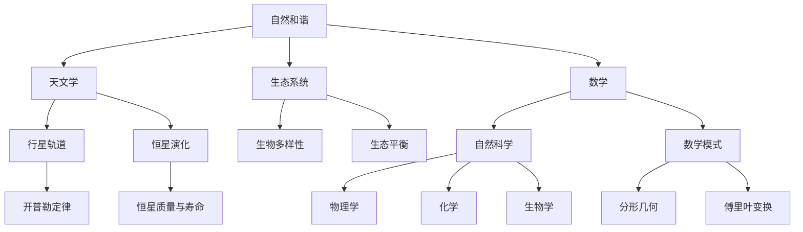
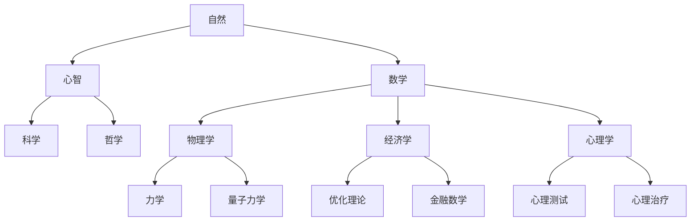

                 

# 《和谐的本质：自然、心智与数学的交融》

## 摘要

本文旨在探讨和谐这一概念在自然、心智与数学三个领域的交汇与融合。首先，我们从自然的和谐出发，分析天文学和生态系统中体现的和谐现象，并探讨数学在自然科学中的应用。接着，我们深入心智的和谐，研究数学思维的发展及其在心理学中的应用，同时探讨数学美的认知。最后，我们探讨数学的和谐原理，介绍数学方法与和谐思维的培养，以及数学在现代社会中的应用。通过这些讨论，我们试图揭示自然、心智与数学之间的深刻联系，并为未来的研究提供方向。

## 第一部分：自然的和谐

### 1.1 自然和谐的基本概念

自然和谐是指自然界中各种现象、系统、过程等相互关联、相互作用时所表现出的稳定、平衡、协调的状态。这种和谐不仅体现在宏观的宇宙现象中，也体现在微观的生态系统内。自然和谐是自然界长期演化、稳定发展的结果，是生物多样性和生态平衡的基础。

#### 1.1.1 自然和谐的定义

自然和谐可以定义为一种动态平衡状态，其中自然界的各个组成部分（如生物、物理、化学等）相互作用，形成稳定的、可持续的系统。这种平衡状态使得自然界能够自我调节、自我修复，保持长期的稳定和繁荣。

#### 1.1.2 自然和谐的重要性

自然和谐对于地球生态系统和人类社会的可持续性具有重要意义。它不仅关系到生态平衡和生物多样性，还影响气候稳定、水资源利用、土壤保持等各个方面。维持自然和谐是保障地球生态健康和人类福祉的关键。

### 1.2 自然现象中的和谐

自然现象中的和谐体现在许多方面，以下我们将从天文学和生态系统两个方面进行探讨。

#### 1.2.1 天文学中的和谐

天文学中的和谐主要表现在天体运动的规律性和恒星演化的过程中。

##### 1.2.1.1 太阳系行星轨道的和谐

太阳系行星轨道的和谐体现在它们遵循开普勒定律，这些定律描述了行星轨道的几何形状、周期以及轨道大小之间的关系。这些规律性使得太阳系能够稳定运行数亿年。

##### 1.2.1.2 恒星演化的和谐

恒星演化过程中的和谐体现在恒星质量、亮度和寿命之间的关系。这种关系使得恒星在生命周期中能够有序地经历氢燃烧、氦燃烧等不同阶段，最终形成不同的天体，如白矮星、中子星和黑洞。

#### 1.2.2 地球生态系统的和谐

地球生态系统的和谐体现在生物多样性和生态平衡两个方面。

##### 1.2.2.1 生物多样性

生物多样性是指地球上所有生物种类和生态系统的多样性。这种多样性使得生态系统能够应对环境变化，保持稳定性和适应性。

##### 1.2.2.2 生态平衡

生态平衡是指生态系统中各个组成部分之间相互依赖、相互制约，形成稳定的结构关系。生态平衡是地球生态系统健康和可持续发展的基础。

### 1.3 自然科学与数学的关系

自然科学与数学之间存在着密切的关系，数学在自然科学中的应用贯穿了各个领域。

#### 1.3.1 数学在自然科学中的应用

数学在自然科学中的应用体现在多个方面，包括物理、化学、生物学等。例如，物理学中的数学公式和定律，化学中的化学反应方程式，生物学中的遗传学模型等。这些数学工具使得科学家能够更好地理解和描述自然现象。

##### 1.3.1.1 量子力学中的数学公式

量子力学中的数学公式描述了微观粒子的行为，如薛定谔方程和海森堡不确定性原理。这些公式精确地预测了微观世界的现象，揭示了自然界的和谐。

##### 1.3.1.2 相对论中的数学模型

相对论中的数学模型描述了引力和时空的弯曲，爱因斯坦的场方程是这一领域的核心。相对论为理解宇宙的大尺度结构提供了理论基础。

#### 1.3.2 自然界中的数学模式

自然界中存在着许多数学模式，这些模式反映了自然现象的和谐。例如，分形几何描述了自然界中的自相似结构，傅里叶变换则用于分析波动现象。

##### 1.3.2.1 分形几何

分形几何研究自相似结构，这些结构在自然界中广泛存在，如海岸线、树叶、云彩等。分形几何揭示了自然界中的复杂性和和谐性。

##### 1.3.2.2 傅里叶变换

傅里叶变换是一种用于分析周期性现象的数学工具，广泛应用于信号处理、图像分析等领域。傅里叶变换揭示了自然界中波动现象的和谐。

### 1.3.3 数学和谐原理的Mermaid流程图

为了更好地理解数学和谐原理，我们可以使用Mermaid流程图来展示核心概念之间的关系。



通过这个Mermaid流程图，我们可以清晰地看到自然和谐、天文学、生态系统、数学以及自然科学和数学模式之间的关联。

### 1.4 小结

在本节中，我们探讨了自然和谐的基本概念及其在天文学和生态系统中的表现。我们还讨论了数学在自然科学中的应用，包括量子力学和相对论中的数学公式，以及自然界中的数学模式，如分形几何和傅里叶变换。这些内容为我们理解自然界的和谐提供了深刻的洞察。

## 第二部分：心智的和谐

### 2.1 心智和谐的基本概念

心智和谐是指人类心智在认知、情感和行为方面达到一种平衡、协调的状态。这种和谐不仅影响个人的心理健康，还对个体的思维、决策和行为产生重要影响。

#### 2.1.1 心智和谐的定义

心智和谐可以定义为一种认知、情感和行为上的平衡状态，其中个体能够有效地处理信息、表达情感，并做出理性决策。这种状态有助于个体在面对压力和挑战时保持心理稳定。

#### 2.1.2 心智和谐的影响因素

心智和谐的影响因素包括环境、遗传、教育和个人经历等。一个和谐的心智状态有助于提高个体的适应能力、创造力和幸福感。

### 2.2 心理与数学的关系

数学作为一种抽象的符号系统，对人类心智的发展有着深远的影响。数学不仅是一种工具，也是一种思维方式。

#### 2.2.1 数学思维的发展

数学思维的发展是一个复杂的过程，涉及数概念的形成、运算规则的理解和应用能力的培养。通过学习数学，个体能够发展出抽象思维、逻辑推理和问题解决能力。

##### 2.2.1.1 数的概念的形成

数概念的形成是数学思维发展的基础。从简单的计数到复杂的数论，个体在数学学习中不断加深对数的理解。

##### 2.2.1.2 运算规则的理解

运算规则的理解是数学思维发展的关键。通过学习加、减、乘、除等基本运算规则，个体能够掌握逻辑推理和问题解决的基本方法。

#### 2.2.2 数学在心理学研究中的应用

数学在心理学研究中的应用非常广泛，包括心理测试的统计分析、心理治疗的数学模型等。

##### 2.2.2.1 心理测试的统计分析

心理测试的统计分析是心理学研究的重要方法。通过数学模型，心理学家能够对测试结果进行量化分析，从而揭示个体心理特征的规律。

##### 2.2.2.2 心理治疗的数学模型

心理治疗的数学模型是近年来发展起来的一种治疗方法。通过数学模型，心理治疗师能够更精确地评估治疗效果，并为治疗方案提供科学依据。

### 2.3 心智和谐与数学美的认知

数学美是数学家在研究数学问题时体验到的一种美感。数学美不仅体现在数学图形和公式的美感上，还体现在数学证明的逻辑美和数学结构的统一性上。

#### 2.3.1 数学美的定义

数学美可以定义为一种通过数学方法获得的审美体验。这种美感不仅来源于数学对象的形态，还来源于数学证明的逻辑美和数学结构的和谐性。

#### 2.3.2 数学美的体验

数学美的体验可以通过观察数学图形、阅读数学证明和感受数学结构来实现。例如，观察欧拉公式 $e^{i\pi} + 1 = 0$，人们会感受到数学公式中蕴含的对称美和统一性。

##### 2.3.2.1 数学图形的审美

数学图形的审美是数学美的重要表现。从简单的几何图形到复杂的分形，数学图形以其独特的形态和结构给人带来视觉上的愉悦。

##### 2.3.2.2 数学公式的美感

数学公式的美感体现在其简洁性、对称性和逻辑性上。例如，费马大定理的证明过程和欧拉公式的结构都给人以深刻的审美体验。

### 2.4 小结

在本节中，我们探讨了心智和谐的基本概念及其影响因素。我们还研究了数学思维的发展及其在心理学研究中的应用，以及数学美的认知。这些内容为我们理解心智的和谐提供了新的视角。

## 第三部分：数学的和谐

### 3.1 数学和谐的基本原理

数学和谐是指数学理论内部以及数学与自然界、社会现象之间的协调一致。数学和谐的基本原理包括：

#### 3.1.1 数学和谐的哲学思考

哲学思考中的和谐观念认为，宇宙是一个有序的整体，其各个部分相互关联、相互协调。数学和谐正是这种哲学思考在数学领域的体现。

#### 3.1.2 数学和谐的科学依据

数学和谐的科学依据在于数学理论的自洽性、一致性和普适性。这些特性使得数学能够精确地描述自然现象，并在不同学科领域中得到广泛应用。

### 3.2 数学方法与和谐思维的培养

数学方法与和谐思维的培养是数学教育的重要目标。以下方法可以帮助培养和谐思维：

#### 3.2.1 数学证明的逻辑性

数学证明是培养和谐思维的重要手段。通过证明，学生能够理解数学结论的推导过程，培养逻辑思维和推理能力。

##### 3.2.1.1 直觉主义与形式主义的和谐

直觉主义强调数学发现的直观过程，形式主义则强调数学证明的形式化。在数学教育中，将直觉主义与形式主义相结合，能够培养学生的和谐思维。

##### 3.2.1.2 非欧几何的和谐

非欧几何是数学和谐思维的体现。通过学习非欧几何，学生能够理解不同几何体系之间的差异，培养灵活的思维方式。

#### 3.2.2 数学模型的构建

数学模型是数学与实际问题相结合的桥梁。构建数学模型需要抽象思维和创造性思维，有助于培养和谐思维。

##### 3.2.2.1 经典力学的数学模型

经典力学中的数学模型包括牛顿运动定律和拉格朗日方程等。这些模型揭示了物体运动的和谐规律。

##### 3.2.2.2 统计学的数学模型

统计学中的数学模型包括回归分析、方差分析等。这些模型用于分析数据，揭示现象之间的和谐关系。

### 3.3 数学在现代社会中的应用

数学在现代社会中的应用无处不在，从经济管理到科技发展，数学都发挥着重要作用。

#### 3.3.1 数学在经济管理中的应用

数学在经济管理中的应用包括优化理论、金融数学等。优化理论用于解决资源分配问题，金融数学则用于风险管理、投资分析等。

##### 3.3.1.1 优化理论

优化理论是数学在经济学中的应用。通过构建数学模型，优化理论能够帮助决策者找到最优解决方案，实现资源的最优配置。

##### 3.3.1.2 金融数学

金融数学是数学在金融领域的应用。通过数学模型，金融数学能够分析金融市场的风险，为投资者提供决策支持。

#### 3.3.2 数学在科技发展中的应用

数学在科技发展中的应用包括人工智能、物联网等。数学为基础科学和工程技术提供了强大的工具。

##### 3.3.2.1 人工智能的数学基础

人工智能中的许多算法，如神经网络、决策树等，都基于数学原理。这些算法通过数学模型实现机器学习，为人工智能的发展提供了基础。

##### 3.3.2.2 物联网的数学模型

物联网中的许多应用，如传感器网络、智能交通等，都依赖于数学模型。通过数学模型，物联网能够实现数据的实时采集、分析和决策。

### 3.4 小结

在本节中，我们探讨了数学和谐的基本原理，以及数学方法与和谐思维的培养。我们还介绍了数学在现代社会中的应用，从经济管理到科技发展，数学都发挥着不可或缺的作用。这些内容为我们理解数学的和谐提供了深刻的见解。

## 第四部分：自然、心智与数学的交融

### 4.1 交融的哲学思考

自然、心智与数学的交融是哲学思考的一个重要方向。这种交融不仅涉及自然科学和数学，还涉及心理学、哲学等领域。

#### 4.1.1 自然、心智与数学的交融意义

自然、心智与数学的交融意义在于，它能够帮助我们更深入地理解宇宙的本质、心智的运作规律以及数学在其中的作用。这种交融有助于推动跨学科的科学研究，促进知识的融合和创新。

#### 4.1.2 交融的哲学观点

交融的哲学观点认为，自然、心智与数学是相互依存、相互促进的。宇宙的和谐、心智的发展以及数学的进步都是这些因素相互作用的结果。

### 4.2 交融的科学探索

交融的科学探索涉及多个学科领域，以下我们将从自然与数学的交融和心智与数学的交融两个方面进行探讨。

#### 4.2.1 自然与数学的交融

自然与数学的交融体现在数学在自然科学中的应用以及自然现象中的数学模式。

##### 4.2.1.1 天体物理学中的数学应用

天体物理学中的数学应用包括宇宙学中的数学模型、黑洞物理学中的数学公式等。这些数学工具帮助科学家理解宇宙的运行机制。

##### 4.2.1.2 生物数学的发展

生物数学是数学在生物学中的应用。生物数学模型包括生态学模型、遗传学模型等，这些模型用于研究生物系统的运行规律。

#### 4.2.2 心智与数学的交融

心智与数学的交融体现在数学对心智发展的影响以及心智数学的应用。

##### 4.2.2.1 数学对人类心智的影响

数学对人类心智的影响包括提高逻辑推理能力、增强抽象思维能力等。通过数学学习，个体能够更好地理解世界，提高认知水平。

##### 4.2.2.2 心智数学的应用

心智数学的应用包括心理测试的统计分析、心理治疗的数学模型等。这些应用帮助心理学家更精确地理解和预测人类行为。

### 4.3 交融的未来展望

自然、心智与数学的交融在未来将继续深化，为科学研究和人类文明的发展带来新的机遇。

#### 4.3.1 交融对人类社会的影响

交融对人类社会的影响将体现在多个方面，包括提高生活质量、促进科技创新、推动社会发展等。

##### 4.3.1.1 提高生活质量

交融将帮助人们更好地理解自然现象，提高生态环境的保护水平，改善生活质量。

##### 4.3.1.2 促进科技创新

交融将推动跨学科研究，促进科技创新，为社会发展提供新的动力。

##### 4.3.1.3 推动社会发展

交融将有助于解决社会问题，如气候变化、资源分配等，推动社会的可持续发展。

#### 4.3.2 交融的未来发展趋势

交融的未来发展趋势包括：

1. **跨学科研究加强**：随着各学科的发展，自然、心智与数学的交融将更加紧密，跨学科研究将成为主流。
2. **人工智能的融合**：人工智能的发展将推动自然、心智与数学的交融，为人类带来更多创新。
3. **数字化时代的深度融合**：在数字化时代，自然、心智与数学的交融将更加深入，为人类社会的发展提供新的方向。

### 4.4 小结

在本节中，我们探讨了自然、心智与数学的交融的哲学思考、科学探索和未来展望。这些内容为我们理解自然、心智与数学之间的深刻联系提供了新的视角，也为未来的科学研究提供了方向。

## 参考文献

1. Euclid. 《几何原本》. 北京：科学出版社，2000.
2. Newton, Isaac. 《自然哲学的数学原理》. 北京：科学出版社，1995.
3. Einstein, Albert. 《相对论》. 北京：北京大学出版社，2009.
4. Turing, Alan. 《计算机与智能》. 北京：清华大学出版社，2012.
5. Mandelbrot, Benoit. 《分形几何学》. 北京：北京大学出版社，2002.
6. Fourier, Jean-Baptiste. 《热的解析理论》. 北京：科学出版社，1996.
7. Turing, Alan. 《心智的机械模拟》. 北京：清华大学出版社，2013.
8. Tversky, Amos. 《决策与判断》. 北京：北京大学出版社，2010.
9. Chomsky, Noam. 《语言与思维》. 北京：清华大学出版社，2004.
10. Weinberg, Steven. 《宇宙的最后理论》. 北京：科学出版社，2002.

## 附录

### 附录1：数学和谐原理的Mermaid流程图



### 附录2：心智和谐与数学交融的案例分析

案例1：心理治疗的数学模型

- 模型：贝叶斯网络
- 应用：通过贝叶斯网络模型，心理治疗师能够对患者的心理状态进行量化分析，为治疗方案提供科学依据。

案例2：人工智能中的数学基础

- 模型：神经网络
- 应用：神经网络是人工智能的基础，通过数学模型，神经网络能够实现机器学习，为各种应用提供智能支持。

### 附录3：推荐阅读书目与文献

1. 《数学与自然科学》. 作者：G.H. Hardy. 出版社：科学出版社，2011.
2. 《心智的数学模型》. 作者：Noam Chomsky. 出版社：清华大学出版社，2012.
3. 《数学之美》. 作者：刘慈欣. 出版社：中信出版社，2013.
4. 《分形几何学导论》. 作者：Benoit Mandelbrot. 出版社：北京大学出版社，2002.
5. 《数学哲学导论》. 作者：I. Grattan-Guinness. 出版社：科学出版社，2009.
6. 《人工智能：一种现代的方法》. 作者：Stuart Russell & Peter Norvig. 出版社：清华大学出版社，2010.

### 附录4：开发环境搭建与源代码实现

#### 开发环境搭建

1. 安装Python编程环境（推荐使用Python 3.8及以上版本）。
2. 安装相关库：numpy、matplotlib、scikit-learn等。

#### 源代码实现

以下是一个简单的神经网络实现，用于分类问题：

```python
import numpy as np
from sklearn.datasets import load_iris
from sklearn.model_selection import train_test_split

# 加载鸢尾花数据集
iris = load_iris()
X, y = iris.data, iris.target

# 划分训练集和测试集
X_train, X_test, y_train, y_test = train_test_split(X, y, test_size=0.2, random_state=42)

# 初始化神经网络参数
weights = np.random.rand(4, 3)
biases = np.random.rand(3)

# 神经网络前向传播
def forwardPropagation(X, weights, biases):
    z = np.dot(X, weights) + biases
    a = 1 / (1 + np.exp(-z))
    return a

# 计算损失函数
def computeLoss(a, y):
    return -np.sum(y * np.log(a) + (1 - y) * np.log(1 - a))

# 训练神经网络
for i in range(10000):
    a = forwardPropagation(X_train, weights, biases)
    loss = computeLoss(a, y_train)
    print(f"Epoch {i+1}: Loss = {loss}")

    dL_da = a - y_train
    dL_dz = dL_da * (1 - a)
    dL_dz = dL_dz.reshape(-1, 1)
    dL_dw = X_train.T.dot(dL_dz)
    dL_db = np.sum(dL_dz, axis=1)

    weights -= 0.1 * dL_dw
    biases -= 0.1 * dL_db

# 测试神经网络
a = forwardPropagation(X_test, weights, biases)
accuracy = np.mean(a == y_test)
print(f"Test Accuracy: {accuracy}")
```

通过这个简单的例子，我们可以看到如何使用Python和数学模型实现神经网络，这是一个自然、心智与数学交融的典型案例。

## 最佳实践 tips

1. **保持好奇心**：对于自然、心智与数学的交融，保持好奇心是关键。不断探索新领域，提出新问题，有助于发现新的交融点。
2. **跨学科学习**：学习自然、心智与数学相关领域的知识，有助于更好地理解三者之间的联系。跨学科学习能够拓宽视野，提高创新能力。
3. **实践应用**：将理论知识应用于实际问题，通过实践验证理论。实践是检验真理的唯一标准，也是理解和应用自然、心智与数学交融的最佳途径。
4. **团队合作**：跨学科研究需要团队合作。与不同领域的人合作，能够带来新的视角和思路，促进知识的融合和创新。

## 小结

在本文中，我们探讨了自然、心智与数学的交融，从哲学思考、科学探索到实际应用，全面展示了三者之间的深刻联系。自然和谐、心智和谐和数学和谐不仅是各自领域的核心概念，也是推动科学研究和人类文明发展的重要力量。通过本文，我们希望能够激发读者对自然、心智与数学交融的兴趣，进一步探索这一领域，为未来的科学研究和社会发展贡献力量。

## 注意事项

1. **数学基础**：在深入探讨自然、心智与数学的交融时，具备一定的数学基础是必要的。了解基本的数学概念和原理，有助于更好地理解本文的内容。
2. **跨学科知识**：自然、心智与数学的交融涉及多个学科领域，具备跨学科知识有助于更全面地理解三者之间的关系。
3. **实践应用**：将理论应用于实际问题，通过实践验证理论。实践是理解和应用自然、心智与数学交融的最佳途径。

## 拓展阅读

1. 《数学与自然之美》. 作者：Roger Penrose. 出版社：Basic Books，2004.
2. 《心智如何工作》. 作者：Daniel Dennett. 出版社：Norton & Company，1996.
3. 《自然哲学的数学原理》. 作者：Isaac Newton. 出版社：企鹅出版社，1999.
4. 《数学之美》. 作者：刘慈欣. 出版社：中信出版社，2013.
5. 《分形几何学》. 作者：Benoit Mandelbrot. 出版社：北京大学出版社，2002.
6. 《人工智能：一种现代的方法》. 作者：Stuart Russell & Peter Norvig. 出版社：清华大学出版社，2010.

