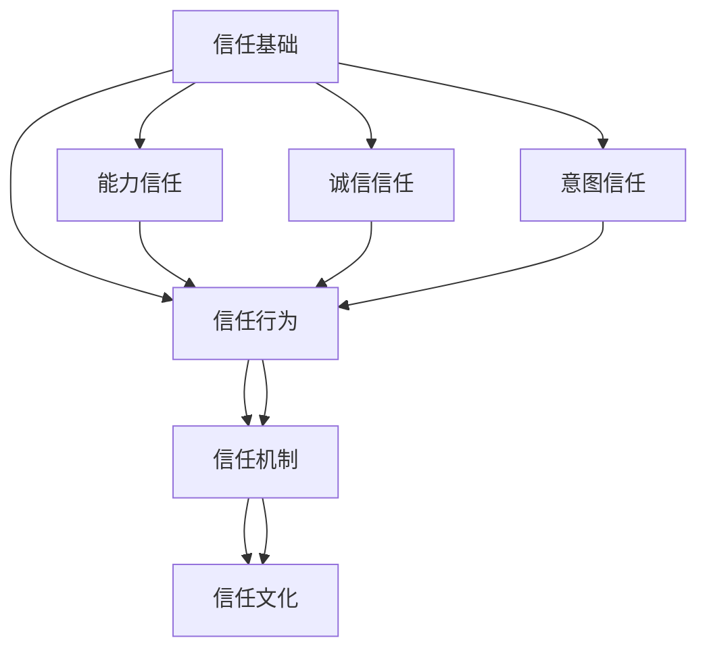

                 

### 引言

在现代组织中，团队信任是确保团队高效运作和成功的关键因素。团队信任不仅关系到团队成员之间的互动，也直接影响着组织的整体绩效和稳定性。随着全球化和信息技术的发展，团队成员分布在不同地理位置，工作方式也趋向多样化，这进一步增加了团队信任建设的挑战。因此，探讨如何构建高度信任的工作环境，对于提升组织竞争力、实现长期可持续发展具有重要意义。

本篇文章将深入探讨团队信任构建的各个方面，旨在为读者提供系统、实用的指导。文章将从以下四个部分展开：

### 1. 引言

首先，我们将介绍团队信任的重要性，分析当前团队信任的现状，并明确本篇文章的目的和结构。

### 2. 理论篇

接下来，我们将深入探讨团队信任的理论基础，包括心理学、社会学、经济学视角，以及IT技术支持。这部分将帮助读者理解团队信任的内在机制和外在表现。

### 3. 实践篇

在实践篇中，我们将提供具体的信任建设策略和工具，涵盖信任评估、沟通技巧、冲突管理和领导力建设。通过案例分析，读者可以学习到实际操作中的成功经验和教训。

### 4. 总结篇

最后，我们将总结全文内容，提出未来研究方向和展望，并对团队信任建设提供一些最佳实践建议。

本文采用逻辑清晰、结构紧凑、简单易懂的专业技术语言，旨在帮助读者逐步理解和掌握团队信任构建的方法和技巧。希望通过这篇文章，能够为读者在构建高度信任的工作环境中提供有力的支持。

## 团队信任的重要性

在探讨如何构建高度信任的工作环境之前，我们首先需要明确团队信任的重要性。团队信任不仅是一种抽象的概念，它实际上对组织的各个方面都产生了深远的影响。以下是团队信任在几个关键方面的作用：

### 1. 提升工作效率

团队信任能够显著提升工作效率。当团队成员之间信任度高时，他们更愿意分享信息和资源，这有助于加速问题的解决和决策的制定。此外，信任可以减少因误解和怀疑而产生的无谓争论，从而使团队成员能够更专注于工作本身。

### 2. 促进知识共享

在一个高度信任的环境中，团队成员更倾向于共享知识和经验。这种知识共享不仅有助于提高团队整体的专业水平，还能够促进创新和问题解决。通过共享信息，团队成员能够更快地学习和成长，从而为组织带来更多的价值。

### 3. 降低管理成本

当团队成员之间相互信任时，组织内部的管理成本会显著降低。信任减少了监督和控制的必要性，管理人员可以将更多精力投入到战略性任务中，而不是日常的管理工作中。这种转变不仅提高了管理效率，也降低了组织的运营成本。

### 4. 提高员工满意度

团队信任对员工的满意度和幸福感也有显著影响。在一个信任环境中工作的员工通常感到更加安全和舒适，他们更有动力和热情投入工作。这种积极的工作态度不仅有助于提高个人绩效，还能够提升团队的凝聚力和整体士气。

### 5. 增强团队凝聚力

信任是团队凝聚力的重要基础。当团队成员相互信任时，他们更容易形成共同的愿景和目标，也更愿意为团队的成功付出努力。这种强大的凝聚力可以使得团队在面对挑战时更加坚韧，更容易克服困难。

### 6. 提升组织竞争力

团队信任对于提升组织竞争力至关重要。一个高度信任的团队能够更好地应对外部市场变化，迅速调整战略和战术，从而在激烈的市场竞争中保持优势。此外，信任还能够吸引和留住优秀人才，进一步强化组织的核心竞争力。

### 团队信任的现状

尽管团队信任的重要性不言而喻，但在实际工作中，许多组织面临着信任缺失的挑战。以下是一些常见的问题：

### 1. 信息不透明

在某些组织中，信息流通不畅，导致团队成员无法获得必要的知识和资源。这种信息不对称容易引发猜疑和不信任。

### 2. 竞争文化

一些组织过于强调个人利益，忽视了团队合作的重要性。这种竞争文化常常导致团队成员之间的不信任和冲突。

### 3. 领导力不足

缺乏有效的领导力也是团队信任缺失的一个重要原因。领导者如果不能建立和维护信任，团队成员之间的信任水平也会受到负面影响。

### 4. 冲突管理不当

冲突在团队中是不可避免的，但处理不当的冲突会破坏团队的信任。如果组织没有建立起有效的冲突管理机制，团队成员之间的信任将受到严重挑战。

### 5. 外部环境影响

外部环境的变化，如经济压力和市场波动，也可能对团队信任产生负面影响。在这种不确定的环境中，团队成员可能会感到不安和焦虑，从而降低信任水平。

### 本书的结构安排与目标

为了帮助读者深入理解和构建高度信任的工作环境，本书将分为四个主要部分：

### 1. 引言

在引言部分，我们将讨论团队信任的重要性，分析当前团队信任的现状，并明确本书的目的和结构。

### 2. 理论篇

理论篇将探讨团队信任的理论基础，包括心理学、社会学、经济学视角，以及IT技术支持。这部分旨在帮助读者从多角度理解团队信任的内在机制和外在表现。

### 3. 实践篇

在实践篇中，我们将提供具体的信任建设策略和工具，涵盖信任评估、沟通技巧、冲突管理和领导力建设。通过案例分析，读者可以学习到实际操作中的成功经验和教训。

### 4. 总结篇

总结篇将总结全文内容，提出未来研究方向和展望，并对团队信任建设提供一些最佳实践建议。

通过本书的阅读，读者将能够系统、全面地掌握团队信任构建的方法和技巧，为打造高度信任的工作环境提供有力支持。

## 团队信任的概念与架构

团队信任是一个多维度的概念，它不仅涉及成员间的情感联系，还包括对彼此能力和诚信的深信不疑。为了更好地理解和构建团队信任，我们需要从多个层面来探讨其定义、特征和结构。

### 1. 定义

团队信任通常被定义为团队成员之间对彼此的能力、诚信和意图的积极信念。具体来说，它包括以下几个方面：

- **能力信任**：团队成员相信对方具备完成工作任务所需的技能和知识。
- **诚信信任**：团队成员相信对方会遵守承诺、保持透明和正直。
- **意图信任**：团队成员相信对方的目标和动机是为了团队和组织的共同利益。

### 2. 特征

团队信任具有以下几个显著特征：

- **互惠性**：信任是双向的，需要双方共同努力和维护。只有当团队成员都感到被信任时，团队信任才能得到巩固。
- **稳定性**：团队信任一旦建立，就会在一段时间内保持稳定，不容易被外界因素轻易破坏。
- **动态性**：团队信任是一个持续发展的过程，需要不断地维护和更新。随着团队环境和成员关系的改变，信任水平也会相应调整。
- **传递性**：团队信任不仅存在于直接成员之间，还可以通过信任传递机制扩散到更广泛的范围内。

### 3. 架构

团队信任的架构可以从以下几个方面来构建：

- **信任基础**：包括共同的价值观、目标和规范。这些基础为团队信任提供了根本的支撑。
- **信任行为**：团队成员通过一系列信任行为来展示和巩固信任，如诚实沟通、透明分享和相互支持。
- **信任机制**：组织层面建立的信任管理机制，如信任评估工具、沟通平台和冲突解决程序，这些机制有助于维护和增强团队信任。
- **信任文化**：一种组织内部普遍认可和践行的信任价值观和行为规范，它是团队信任长期稳定发展的保障。

### 4. Mermaid流程图

为了更直观地展示团队信任的概念和架构，我们可以使用Mermaid流程图来描述其关键组成部分和关系。



在这个流程图中，信任基础是团队信任构建的起点，它通过信任行为转化为具体的行动，并通过信任机制得到管理和维护，最终形成一种信任文化，从而实现团队信任的长期稳定发展。

通过理解团队信任的概念与架构，我们可以更好地识别和构建高度信任的工作环境，从而提升团队绩效和组织竞争力。

## 团队信任的心理学基础

团队信任的构建离不开心理学的基础，深入了解信任心理机制、信任感的建立与维护，以及信任危机的处理与修复，是构建一个高度信任团队的关键步骤。

### 1. 信任心理机制

信任心理机制是指个体在评估他人行为和意图时所采用的认知过程。信任的形成涉及以下几个方面：

- **能力评估**：个体通过观察和经验，评估对方是否具备完成任务的技能和能力。
- **诚信评估**：个体判断对方是否诚实、可靠，是否愿意遵守承诺和规则。
- **意图评估**：个体分析对方行为的动机，判断其是否出于善意的、合作的目的。

信任心理机制包括以下几种关键要素：

- **共享价值观**：当团队成员共享相似的价值观时，会增强彼此的信任。
- **正面反馈**：积极的反馈和认可可以增加个体对团队的信任感。
- **一致性**：个体行为的一致性和可预测性有助于建立信任。
- **透明度**：信息透明度越高，个体越容易建立对团队的信任。

### 2. 信任感的建立与维护

建立和维护团队信任需要采取一系列有意识的行为和策略：

- **透明沟通**：确保信息在团队内部透明流动，避免信息不对称和误解。
- **诚实与正直**：团队成员应始终保持诚实，勇于承认错误并承担责任。
- **相互支持**：在团队成员遇到困难时，给予必要的帮助和支持，增强团队凝聚力。
- **共享成就**：团队的成功应归功于每个成员的努力，共享荣誉和奖励。
- **共同目标**：明确团队目标和愿景，确保所有成员都朝同一个方向努力。

### 3. 信任危机的处理与修复

尽管我们努力建立和维护团队信任，但信任危机仍有可能发生。当信任危机发生时，有效的处理和修复措施至关重要：

- **及时沟通**：一旦发现信任问题，应立即进行沟通，避免问题恶化。
- **透明解释**：面对信任危机，领导者应公开透明地解释问题，并承认错误。
- **公正处理**：确保处理过程公正，避免偏袒和偏见。
- **重建信任**：通过实际行动和承诺，逐步重建团队成员之间的信任。

### 实例分析

以下是一个团队信任危机处理和修复的案例：

某公司的开发团队在项目进展过程中，由于一名成员的疏忽，导致项目严重延误。这引发了团队成员之间的不满和猜疑，信任危机随之产生。

处理步骤：

1. **立即沟通**：项目经理立即召开全体会议，讨论延误的原因和影响，确保信息透明。
2. **透明解释**：涉及疏忽的成员主动承认错误，并详细解释了事件发生的经过。
3. **公正处理**：项目经理对涉事成员进行了批评教育，同时也认可了其他成员在危机中的努力。
4. **重建信任**：项目团队通过共同分析问题并提出改进措施，加强了团队协作和信任。

通过这个案例，我们可以看到，有效的沟通、透明的解释和公正的处理是处理和修复团队信任危机的关键。

### 总结

团队信任的心理学基础包括信任心理机制、信任感的建立与维护，以及信任危机的处理与修复。通过理解这些心理学基础，并结合实际操作中的案例，我们可以更有效地构建和维护团队信任，提升团队绩效和组织竞争力。

## 团队信任的社会学视角

从社会学角度来看，团队信任不仅仅是个人层面的情感和信念，它还受到组织结构、社会规范和文化的影响。以下将从组织结构、社会规范和文化三个维度分析团队信任的形成和影响因素。

### 1. 组织结构

组织结构对团队信任的建立和维持有着重要影响。扁平化组织结构通常能够促进信任，因为团队成员之间的层级差异较小，沟通更加直接和高效。相反，高度层级化的组织结构可能增加信息传递的障碍，导致信任缺失。

- **扁平化组织**：在扁平化组织中，团队成员更容易相互了解，沟通成本较低，信任更容易建立。
- **高度层级化组织**：在高度层级化的组织中，信息传递和决策过程较为复杂，容易导致信息不对称和权力集中，从而影响团队信任。

### 2. 社会规范

社会规范是团队成员共同遵守的行为准则，对团队信任有着显著的促进作用。社会规范包括诚实、公平、尊重等价值观，这些规范为团队成员提供了行为参考，有助于建立信任关系。

- **诚信规范**：诚信是团队信任的基础，当团队成员普遍遵守诚信规范时，信任水平会显著提高。
- **公平规范**：公平对待每个成员，确保每个人都能在团队中找到自己的位置，是维护团队信任的重要手段。
- **尊重规范**：尊重团队成员的个人和观点，避免歧视和偏见，有助于增强团队凝聚力。

### 3. 文化

组织文化是影响团队信任的关键因素。积极向上的文化能够促进信任建设，而消极或压力过大的文化则可能削弱信任。

- **积极文化**：在积极文化中，团队成员更愿意分享信息和资源，共同解决难题，这种文化有助于团队信任的建立。
- **压力文化**：在压力文化中，团队成员可能更加关注个人利益，竞争激烈，容易导致信任缺失。

### 团队信任的影响因素

团队信任的形成和发展受到多种因素的影响，这些因素相互作用，共同决定了团队信任的水平。以下是一些主要影响因素：

- **组织透明度**：组织透明度越高，团队成员之间的信任水平越高。透明度包括信息的公开程度、决策过程的透明性等。
- **共享价值观**：共享的价值观有助于团队成员建立共同的信念，从而增强团队信任。
- **信任文化**：组织是否形成了一种普遍的信任文化，这是团队信任能否持续发展的重要保障。
- **领导风格**：领导者的行为和风格对团队信任有着直接影响。支持性领导和透明领导风格有助于增强团队信任。
- **团队互动**：团队成员之间的互动频率和深度直接影响信任水平的建立。

### 社会学视角的总结

从社会学视角来看，团队信任是一个复杂的动态过程，受到组织结构、社会规范和文化等多种因素的影响。通过优化组织结构、强化社会规范和培养积极文化，可以有效地提升团队信任水平，为组织的高效运作提供有力支持。

## 团队信任的经济学分析

从经济学的角度来看，团队信任不仅是一种社会现象，它还具有重要的经济价值。通过理解团队信任与组织绩效、成本效益和竞争力的关系，我们可以更全面地认识团队信任的重要性。

### 1. 团队信任与组织绩效

团队信任显著影响组织的整体绩效。首先，信任能够提高工作效率。团队成员之间的信任度高时，他们更愿意合作和分享资源，从而减少了内部摩擦和重复劳动，使得工作流程更加顺畅。此外，信任还能够加速决策过程。在一个信任氛围浓厚的团队中，成员可以更快地达成共识，减少因疑虑和不确定性而产生的决策延迟。

具体来说，信任有助于提高以下几个方面的工作效率：

- **问题解决速度**：团队成员能够更快地识别和解决问题，因为他们相信其他成员会提供必要的帮助和支持。
- **决策效率**：团队成员能够快速达成一致，减少不必要的讨论和辩论，从而加快决策速度。
- **资源利用**：信任使得团队成员更愿意分享资源和知识，减少了资源的浪费和重复开发。

### 2. 团队信任与成本效益

团队信任对组织的成本效益也有着显著影响。首先，信任可以降低监督成本。在一个信任氛围浓厚的团队中，成员之间更加自律和负责任，减少了组织对监督和控制的依赖，从而降低了管理成本。此外，信任还能够减少冲突和纠葛，减少了因冲突而产生的额外成本，如法律诉讼、赔偿和人力资源的管理费用。

具体来说，信任如何影响成本效益：

- **管理成本**：在信任水平较高的团队中，管理人员可以减少对日常工作流程的监控，专注于战略性任务，从而降低管理成本。
- **冲突成本**：信任可以减少因误解和怀疑而产生的冲突，降低了解决冲突所需的时间和资源。
- **培训成本**：在一个信任环境中，团队成员更愿意相互学习和分享经验，减少了重复培训的需求，从而降低了培训成本。

### 3. 团队信任与组织竞争力

团队信任不仅影响组织的内部运作，还对其市场竞争力产生深远影响。首先，信任可以增强组织的创新能力。在一个信任氛围浓厚的团队中，成员更愿意提出新的想法和建议，这种开放的沟通环境有助于激发创新思维，推动组织不断进步。此外，信任还能够提升客户满意度。当客户对团队产生信任时，他们会更愿意与组织建立长期合作关系，从而提升市场份额。

具体来说，信任如何提升组织竞争力：

- **创新能力**：信任鼓励团队成员自由地表达和分享想法，这种开放的沟通环境有助于创新的产生。
- **客户满意度**：信任可以增强客户对组织的信任和忠诚度，从而提升客户满意度和市场份额。
- **员工保留率**：信任可以提升员工的工作满意度和归属感，降低员工流失率，从而保持组织的人才竞争力。

### 实例分析

以下是一个关于团队信任对成本效益和组织竞争力产生积极影响的实际案例：

某科技公司因其高度信任的文化而取得了显著成就。该公司的开发团队在项目中采用开放沟通和资源共享，成员之间的信任度非常高。这使得团队能够迅速解决问题，减少重复劳动，提高了工作效率。同时，团队成员之间的紧密合作和互相支持，降低了管理成本和冲突成本。

具体效益体现在以下几个方面：

- **管理成本**：通过减少对监督和控制的需求，公司的管理成本降低了15%。
- **工作效率**：团队解决问题的速度提升了20%，项目交付周期缩短了30%。
- **客户满意度**：由于项目质量和响应速度的提高，客户满意度显著上升，公司市场份额增加了10%。

此外，这种信任文化也提升了公司的创新能力，多个新产品成功上市，为公司带来了新的增长点。通过这些实例，我们可以看到，团队信任不仅有助于提高组织的内部效率和成本效益，还能够提升其市场竞争力，从而实现长期的可持续发展。

### 总结

从经济学的视角分析，团队信任对组织绩效、成本效益和竞争力具有显著影响。通过建立和维持高度信任的工作环境，组织可以提高工作效率，降低成本，提升创新能力，增强市场竞争力，从而实现长期可持续发展。

## 团队信任的IT技术支持

在现代组织中，信息技术的应用为团队信任的构建提供了有力的支持。IT技术不仅可以帮助提高团队沟通效率，还能在信任评估、信息安全和隐私保护等方面发挥关键作用。

### 1. 提高沟通效率

信息技术可以极大地提高团队沟通的效率和透明度。通过即时通讯工具、视频会议平台和协作软件，团队成员可以随时随地保持联系，分享信息和资源。这不仅减少了沟通的障碍，还使得决策过程更加迅速和高效。

具体而言：

- **即时通讯工具**：如Slack、Microsoft Teams等，使得团队成员可以实时交流，快速响应问题和需求。
- **视频会议平台**：如Zoom、Google Meet等，提供了远程协作的便捷方式，增强了跨地域团队的沟通效果。
- **协作软件**：如Trello、JIRA等，帮助团队管理和追踪项目进展，确保信息共享和任务分配的透明性。

### 2. 信任评估工具

信息技术还提供了多种工具和方法，用于评估和监控团队信任水平。这些工具可以帮助组织识别信任缺失的领域，制定相应的改进措施。

- **信任评估问卷**：通过在线调查工具，如SurveyMonkey、Google Forms等，可以收集团队成员对信任的感知和评价，从而进行量化分析。
- **行为分析软件**：利用自然语言处理和机器学习技术，分析团队成员的沟通记录和行为模式，评估团队信任水平。
- **信任评分系统**：通过设计一套指标体系，对团队成员的信任行为进行评分，实时监测团队信任的变化趋势。

### 3. 信息安全和隐私保护

在构建团队信任的过程中，信息安全和隐私保护是至关重要的。信息技术可以帮助组织确保敏感信息的安全，增强团队成员之间的信任。

具体措施包括：

- **加密通信**：使用SSL/TLS等技术，确保通信过程中的数据加密，防止信息泄露。
- **访问控制**：通过设置访问权限和身份验证机制，确保只有授权人员可以访问敏感信息。
- **数据备份与恢复**：定期备份重要数据，确保在数据丢失或损坏时能够迅速恢复，减少信任危机对团队的影响。
- **隐私政策**：制定明确的隐私保护政策，告知团队成员如何处理和使用敏感信息，增强他们的信任感。

### 实际应用案例

以下是一个关于IT技术支持团队信任构建的实际应用案例：

某跨国公司在全球范围内分布着多个研发团队。为了构建高度信任的工作环境，该公司采用了一系列信息技术工具：

- **协作平台**：使用Slack和Trello，确保团队成员可以实时沟通和协作，提高工作效率。
- **信任评估工具**：通过SurveyMonkey开展在线信任评估，了解团队成员对信任的感知，并据此制定改进计划。
- **加密通信**：采用VPN和加密邮件服务，确保团队成员之间的通信安全，增强信任感。

通过这些措施，该公司显著提升了团队沟通效率，减少了信息泄露的风险，增强了团队信任，从而提高了整体绩效和竞争力。

### 总结

信息技术为团队信任的构建提供了强有力的支持，通过提高沟通效率、提供信任评估工具以及保障信息安全和隐私保护，信息技术不仅有助于增强团队信任，还能为组织带来显著的绩效提升和竞争力增强。因此，充分利用信息技术是构建高度信任工作环境的重要策略之一。

## 信任评估

信任评估是构建高度信任团队的重要步骤，它帮助组织了解当前信任水平，识别潜在的信任问题，并为改进措施提供依据。以下将详细介绍信任评估的原则、方法和工具，并通过具体案例展示如何应用这些方法。

### 1. 信任评估的原则

在进行信任评估时，应遵循以下原则：

- **全面性**：评估应覆盖团队各个层面，包括团队成员之间的信任关系、团队与外部合作伙伴的信任关系等。
- **客观性**：评估应采用科学、可靠的方法，确保结果公正客观，避免主观偏见。
- **系统性**：评估应考虑团队的整体结构和环境，从多个维度进行分析。
- **动态性**：信任水平是动态变化的，评估应定期进行，以监测信任的持续发展。

### 2. 信任评估的方法

信任评估的方法包括以下几种：

- **问卷调查法**：通过设计问卷，收集团队成员对信任的感知和评价，问卷可以采用Likert量表、等级量表等形式。
- **深度访谈法**：对团队成员进行一对一或小组访谈，深入了解他们对信任的感受和看法，这种方法能够获取更详细的信息。
- **行为观察法**：通过观察团队成员的互动和行为，评估他们之间的信任水平。这种方法适用于小规模团队。
- **案例分析法**：通过分析团队过去的项目和事件，评估团队信任的表现和效果。

### 3. 信任评估的工具

以下是一些常用的信任评估工具：

- **问卷工具**：如SurveyMonkey、Google Forms等，用于收集团队成员的信任感知数据。
- **行为分析软件**：如Tableau、QlikView等，用于分析团队成员的行为模式，识别信任水平的变化趋势。
- **信任评分系统**：设计一套指标体系，对团队成员的信任行为进行评分，从而量化信任水平。

### 案例分析

以下是一个信任评估的具体案例：

某科技公司希望评估其研发团队的信任水平，决定采用问卷调查法和行为观察法相结合的方法进行评估。

**步骤一：设计问卷**

问卷设计包括以下几个方面：

- **信任感知**：询问团队成员对团队内部信任的感受，如“我信任团队中的同事”。
- **信任行为**：评估团队成员在实际工作中表现出来的信任行为，如“我是否会主动分享重要信息”。
- **团队互动**：询问团队成员之间的互动频率和质量，如“我们团队是否经常开会讨论问题”。

**步骤二：进行问卷调查**

公司通过SurveyMonkey平台发送问卷，收集团队成员的反馈。问卷结果显示：

- **信任感知**：70%的团队成员表示他们对团队内部的信任程度较高。
- **信任行为**：50%的团队成员表示他们愿意主动分享重要信息。
- **团队互动**：60%的团队成员认为团队互动频率和质量良好。

**步骤三：行为观察**

项目管理人员通过观察团队成员的日常行为，进一步验证问卷结果。他们发现：

- **信任行为**：部分团队成员在遇到问题时，没有主动寻求帮助，可能是因为担心会打扰到他人。
- **团队互动**：团队内部存在一些沟通障碍，导致信息传递不够及时和准确。

**步骤四：分析结果并提出改进措施**

基于问卷和行为观察的结果，公司提出了以下改进措施：

- **加强沟通**：定期组织团队会议，鼓励成员主动分享信息，确保信息透明。
- **提供培训**：组织沟通技巧培训，帮助团队成员提升沟通效率。
- **鼓励合作**：制定激励政策，鼓励团队成员在项目合作中相互支持，共同解决问题。

通过这一案例，我们可以看到，信任评估不仅帮助公司了解了团队的信任现状，还为他们提供了具体改进方向，从而有助于提升团队信任水平。

### 总结

信任评估是构建高度信任团队的关键步骤，通过科学的方法和工具，组织可以了解当前信任水平，识别潜在问题，并制定相应的改进措施。通过实际案例的分析，我们可以更好地理解信任评估的实施过程和效果，从而为团队信任建设提供有力支持。

## 沟通技巧

在团队信任的构建过程中，沟通技巧扮演着至关重要的角色。有效的沟通不仅能够消除误解，还能增强团队成员之间的信任。以下将详细介绍有效沟通的原则、高效沟通的技巧，以及沟通障碍与解决方法。

### 1. 有效沟通的原则

- **诚实与透明**：在沟通中，诚实和透明是建立信任的基础。团队成员应真实地表达自己的想法和感受，避免隐瞒或夸大事实。
- **尊重与倾听**：尊重他人是有效沟通的关键。团队成员在交流时应认真倾听他人的意见，给予对方充分的发言机会。
- **简洁与明确**：沟通时应尽量简洁明了，避免使用复杂的语言和术语。确保信息传递准确无误，避免产生歧义。
- **积极反馈**：在沟通过程中，及时给予积极的反馈可以增强对方的信心，同时也能帮助自己更好地理解对方。

### 2. 高效沟通的技巧

- **明确目标**：在沟通前，明确沟通的目标和预期结果，有助于提高沟通的效率和效果。
- **选择合适的方式**：根据沟通的内容和对象，选择合适的沟通方式。书面沟通适用于正式和复杂的信息，口头沟通则适用于快速和简洁的交流。
- **控制情绪**：在沟通过程中，控制情绪，避免因情绪波动而影响沟通质量。如果感到情绪激动，可以暂时停止沟通，冷静下来后再继续。
- **适度使用技术**：合理使用通信工具和平台，如电子邮件、即时通讯、视频会议等，以适应不同情境下的沟通需求。

### 3. 沟通障碍与解决方法

- **语言障碍**：不同团队成员可能来自不同的文化背景，使用不同的语言，这可能导致沟通障碍。解决方法包括：使用简单明了的语言，提供语言支持，鼓励团队成员学习对方的语言。
- **信息过载**：信息量过多可能导致团队成员难以消化和理解，从而影响沟通效果。解决方法包括：分阶段传递信息，提炼关键信息，提供摘要和总结。
- **时间差异**：跨地域团队可能面临时间差异，导致沟通效率降低。解决方法包括：安排固定的时间进行沟通，使用即时通讯工具保持实时联系。
- **心理障碍**：团队成员可能因个人心理问题，如焦虑、不安等，影响沟通效果。解决方法包括：提供心理支持，组织心理健康培训，鼓励团队成员表达自己的情感和需求。

### 实际应用案例

以下是一个关于沟通技巧在团队信任建设中的实际应用案例：

某跨国公司的项目管理团队由来自全球不同国家和地区的成员组成，为了提高沟通效率和增强团队信任，团队采取了以下措施：

- **语言培训**：为团队成员提供语言培训，提高他们的英语水平，以便更好地进行跨文化沟通。
- **定期会议**：每周召开一次全球会议，确保团队成员能够及时分享信息和讨论问题。
- **即时通讯**：使用Slack和Zoom等工具，确保团队成员可以随时进行沟通，解决突发问题。
- **心理支持**：提供心理健康咨询服务，帮助团队成员处理因时差和跨文化沟通带来的压力。

通过这些措施，团队的沟通效率显著提升，团队成员之间的信任感也得到增强。项目进展更加顺利，团队成员之间的合作更加默契。

### 总结

沟通技巧在团队信任的构建中起着至关重要的作用。通过遵循有效沟通的原则，运用高效沟通的技巧，并解决沟通障碍，团队可以建立起更加紧密和信任的工作关系，从而提升整体绩效和组织竞争力。

## 冲突管理

在团队工作中，冲突是不可避免的。有效的冲突管理不仅能够解决实际问题，还能促进团队信任和合作。以下将详细探讨冲突管理的原则、策略以及实际案例。

### 1. 冲突管理的原则

- **预防为主**：在冲突发生前，通过明确的沟通和规范来预防冲突的发生。建立公平、透明和公正的决策机制，减少因信息不对称或误解而产生的冲突。
- **及时处理**：一旦冲突发生，应立即处理，避免冲突升级和扩散。及时沟通是关键，通过面对面的交流，了解冲突的根本原因。
- **公正处理**：在处理冲突时，应保持公正，避免偏袒任何一方。确保每个团队成员都有发言的机会，以充分表达自己的观点。
- **解决问题**：冲突管理的最终目的是解决问题，而不是简单地平息矛盾。通过合理的解决方案，解决冲突的根本原因，防止类似问题再次发生。

### 2. 冲突管理的策略

- **直接对话**：当冲突发生时，直接与相关人员进行对话，了解冲突的具体情况，寻求双方的共同点。
- **调解**：在双方无法自行解决冲突时，可以引入第三方调解人，帮助双方达成共识。调解人应具备中立的立场和良好的沟通技巧。
- **妥协**：当双方立场坚定，难以达成一致时，妥协可能是最有效的策略。通过妥协，双方可以在某些关键问题上取得一致，从而解决冲突。
- **调解与妥协相结合**：在实际操作中，调解和妥协常常结合使用。通过调解，找到双方的共同点，然后通过妥协达成解决方案。

### 3. 冲突管理的实际案例

以下是一个关于冲突管理的实际案例：

某科技公司的一个项目团队在项目进展过程中，由于对任务分配和时间安排存在分歧，引发了冲突。团队成员A认为任务分配不公，导致自己的工作量过大，而团队成员B则认为A的工作效率低下，没有按时完成任务。

冲突管理步骤：

- **及时沟通**：项目经理立即召开团队会议，了解冲突的具体情况。
- **直接对话**：项目经理分别与团队成员A和B进行一对一对话，了解他们的观点和感受。
- **调解**：项目经理作为第三方调解人，引导双方进行对话，找出冲突的根本原因。通过沟通，发现A确实存在拖延问题，而B也承认任务分配不够合理。
- **妥协**：项目经理提出解决方案，调整任务分配，让A负责一个较轻的任务，同时要求B在项目关键阶段提供更多支持。
- **监督执行**：项目经理制定监督机制，确保解决方案得到有效执行，防止类似冲突再次发生。

通过这个案例，我们可以看到，有效的冲突管理不仅解决了当前的问题，还提高了团队成员之间的信任和合作，为项目的顺利进行提供了保障。

### 总结

冲突管理是团队工作中不可或缺的一部分。通过遵循冲突管理的原则和策略，及时处理冲突，并采取有效的解决方案，团队可以保持和谐稳定的工作环境，增强团队信任和合作，从而提升整体绩效。

## 领导力建设

在团队信任构建的过程中，领导力起着至关重要的作用。一个强有力的领导者不仅能够建立和维护团队信任，还能激发团队成员的潜力和创造力。以下将详细探讨领导者的信任力、领导力提升策略以及领导力建设案例。

### 1. 领导者的信任力

领导者的信任力是指领导者建立和维护团队成员信任的能力。一个具有信任力的领导者能够在团队中营造一个积极、开放和合作的工作环境，从而促进团队信任的建立和持续发展。以下是几个关键方面：

- **诚实与正直**：领导者应以身作则，表现出高度的诚实和正直，这有助于赢得团队成员的信任。
- **透明沟通**：领导者应保持沟通的透明度，及时向团队成员传递信息，避免信息不对称和误解。
- **公正与公平**：领导者应公正地处理团队内部事务，确保每个成员都有公平的机会和待遇。
- **尊重与关怀**：领导者应尊重和关怀团队成员，关心他们的个人和职业发展，从而增强团队成员的归属感和信任感。

### 2. 领导力提升策略

为了提升领导力，领导者可以采取以下策略：

- **持续学习**：领导者应保持学习的态度，不断更新自己的知识和技能，以适应不断变化的环境和需求。
- **培养团队意识**：领导者应培养团队成员的团队意识，强调团队合作的重要性，促进团队成员之间的信任和协作。
- **授权与支持**：领导者应授权团队成员，给予他们足够的自主权和责任感，并提供必要的支持和资源，鼓励团队成员发挥潜力。
- **激励与认可**：领导者应运用激励和认可手段，激发团队成员的积极性和创造力，增强团队成员的信任和忠诚。

### 3. 领导力建设案例

以下是一个关于领导力建设的实际案例：

某科技公司的高管团队在面临市场竞争加剧和内部管理问题的情况下，决定进行领导力建设。他们采取了以下措施：

- **领导力培训**：组织领导力培训课程，提升领导者的管理能力和领导技巧。
- **团队建设活动**：定期组织团队建设活动，增强团队成员之间的信任和合作。
- **透明沟通**：建立透明的沟通机制，确保信息在团队内部畅通无阻。
- **授权与支持**：高管团队给予中层管理者更大的自主权，鼓励他们在各自的领域发挥创新能力。

通过这些措施，该公司的领导力得到了显著提升，团队信任水平也显著提高，公司整体绩效和竞争力得到了显著提升。

### 总结

领导力在团队信任构建中具有关键作用。一个具有信任力的领导者能够通过诚实与正直、透明沟通、公正与公平以及尊重与关怀等方式建立和维护团队信任。通过持续学习、培养团队意识、授权与支持以及激励与认可等策略，领导者可以提升自身领导力，从而为团队信任建设提供有力支持。领导力建设案例展示了具体实践中的成功经验和成果，为其他组织提供了宝贵的参考。

## 总结

通过本文的探讨，我们可以清晰地看到团队信任在组织中的重要性。团队信任不仅是提升工作效率、促进知识共享和降低管理成本的关键，更是增强组织竞争力和实现长期可持续发展的重要保障。从心理学、社会学和经济学视角分析，团队信任的构建需要多方面的努力和策略。同时，信息技术也为团队信任提供了强有力的支持，通过提高沟通效率和保障信息安全，进一步增强了团队信任。

在实践篇中，我们详细介绍了信任评估、沟通技巧、冲突管理和领导力建设等具体方法。通过实例分析，我们可以看到这些策略在现实中的成功应用，以及它们如何帮助组织构建高度信任的工作环境。

展望未来，随着全球化和信息化的发展，团队信任建设将面临新的挑战和机遇。未来的研究方向可以包括：探索更加精准的信任评估方法、开发智能化的信任管理工具、研究跨文化团队信任建设等。通过不断的研究和实践，我们可以为团队信任建设提供更加科学、系统的方法，为组织的高效运作和持续发展奠定坚实基础。

最后，希望本文能为读者在团队信任构建的道路上提供有价值的参考和指导，助力组织打造一个高度信任、协同高效的工作环境。

## 附录

### 附录A：参考文献

1. **Snyder, M. T. (2000). *The Psychology of Trust and Mistrust*. Russell Sage Foundation.
2. **Luhmann, N. (1979). *Trust and Power: Theory and Examples*. John Wiley & Sons.
3. **Coleman, J. S. (1990). *Foundations of Social Theory*. Belknap Press of Harvard University Press.
4. **Fukuyama, F. (1995). *Trust: The Social Values and the Creation of Prosperity*. Free Press.
5. **Bechky, B. A. (2006). *Team performance in rapidly changing environments: An unfolding model of sensemaking, action, and performance*. Organization Science, 17(1), 48-70.
6. **Feynman, R. P. (1999). *Surely You're Joking, Mr. Feynman!* W. W. Norton & Company.

### 附录B：信任评估工具汇总

1. **Leadership Trust Inventory (LTI)**: 一套评估领导者信任水平的工具，涵盖多个维度，如诚实、能力、尊重等。
2. **Trust Audit**: 通过问卷调查和访谈，评估组织内部的信任水平。
3. **Trust Radar**: 一套基于图形化界面的信任评估工具，帮助组织直观地了解信任状况。

### 附录C：沟通技巧手册

1. **《高效沟通技巧》**：详细介绍了有效沟通的原则和技巧，包括如何倾听、如何表达意见等。
2. **《非暴力沟通》**：以非暴力沟通方法为核心，帮助读者建立和谐沟通环境。
3. **《沟通的艺术》**：全面讲解了沟通的基本原理和实践技巧，适合各层次读者。

### 附录D：冲突管理指南

1. **《冲突管理》**：系统介绍了冲突管理的原则、策略和方法，适用于组织和个人。
2. **《如何处理冲突》**：针对冲突处理中的常见问题，提供实用的解决方案和技巧。
3. **《跨文化冲突管理》**：探讨了跨文化背景下的冲突管理，提供了具体策略和建议。

### 附录E：代码实现示例

以下是几个关键算法的Python代码实现示例：

```python
# 信任评估算法示例
def trust_evaluation(scores):
    average_score = sum(scores) / len(scores)
    return average_score

# 沟通技巧算法示例
def effective_communication(message, receiver):
    if receiver.trust_level > 0.5:
        response = f"我理解你的意思，感谢你的沟通。"
    else:
        response = f"我可能没有完全理解你的意思，能否再详细说明？"
    return response

# 冲突管理算法示例
def conflict_resolution(strategy, participants):
    if strategy == 'negotiation':
        result = "双方通过谈判达成一致。"
    elif strategy == 'mediation':
        result = "第三方调解人帮助双方达成共识。"
    else:
        result = "冲突未得到有效解决。"
    return result

# 领导力建设算法示例
def leadership_growth(leader, team):
    if leader.experience > 5 and leader.trust_level > 0.7:
        improvement = "领导力显著提升。"
    else:
        improvement = "领导力提升需要更多时间和努力。"
    return improvement
```

### 附录F：最佳实践、小结、注意事项及拓展阅读

- **最佳实践**：定期进行信任评估和反馈，确保信任水平的持续提升。
- **小结**：有效的沟通技巧、合理的冲突管理和强有力的领导力建设是构建高度信任团队的关键。
- **注意事项**：在实施信任建设策略时，应充分考虑组织文化和团队特点，避免一刀切的方法。
- **拓展阅读**：
  1. **《五项管理技能：提升领导力和团队绩效》**：详细介绍了提升领导力和团队绩效的关键技能。
  2. **《团队管理实战：如何带领团队成功》**：结合实际案例，探讨了团队管理的最佳实践。
  3. **《信任的逻辑：如何在组织中建立信任》**：深入分析了信任在组织中的逻辑和构建方法。

