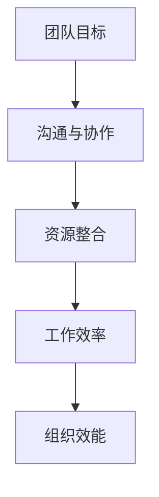

                 

### 《团队协同工作：提高跨部门合作效率》

**关键词：** 团队协同、跨部门合作、效率提升、沟通工具、项目管理

**摘要：** 本文章旨在探讨团队协同工作和跨部门合作在提高整体工作效能中的重要性。通过分析团队协同工作的基础、跨部门合作中的挑战，以及具体方法与实战案例，本文为IT领域的团队提供了一系列提升跨部门合作效率的策略和实践指南。

----------------------------------------------------------------

# **《团队协同工作：提高跨部门合作效率》**

在当今快速发展的信息技术行业，团队协同工作的重要性愈发凸显。高效的跨部门合作不仅是企业成功的关键，更是应对复杂问题和快速变化市场的必要条件。本文将深入探讨团队协同工作的基础理论，分析跨部门合作中的常见挑战，并介绍一系列提高协作效率的方法和实践案例。

---

## **第一部分：团队协同工作基础**

### **第1章：团队协同工作概述**

#### **1.1 团队协同工作的重要性**

**核心概念与联系：** 团队协同工作的原理与组织效能紧密相连。一个高效的团队可以通过良好的沟通和协作，提高资源利用率，优化工作流程，从而提升整体效能。以下是一个简化的Mermaid流程图，展示了团队协同工作原理与组织效能之间的关系：



**数学模型和数学公式：** 团队协作对组织效率的影响可以通过以下模型进行量化。假设团队效率 \(E\) 与团队规模 \(N\)、协作效率 \(C\) 和沟通效率 \(M\) 之间的关系为：

\[ E = C \times M \times \left(1 - \frac{1}{N}\right) \]

其中，\(N\) 为团队成员数量，\(C\) 为协作效率，\(M\) 为沟通效率。

#### **1.2 团队协同工作的基本原理**

**核心算法原理讲解：** 团队协同工作的核心在于建立有效的沟通机制和协作流程。以下是一个团队协同工作的基本算法伪代码，用于描述团队成员间的信息共享和任务分配：

```python
def team_collaboration(team_members, tasks):
    communication_channel = setup_communication_channel(team_members)
    for member in team_members:
        member.share_knowledge(communication_channel)
    task分配策略 = optimal_task_assignment(tasks, team_members)
    for member, task in task分配策略:
        member.assign_task(task)
    return task分配策略
```

#### **1.3 团队协同工作的组织结构**

**数学模型和数学公式：** 团队组织结构的优化是提高协作效率的关键。以下是一个用于评估团队组织结构优化的数学模型：

\[ \text{组织效能} = \sum_{i=1}^{N} (\text{成员效率} \times \text{贡献度}) \times \left(1 - \frac{\text{沟通成本}}{\text{工作总量}}\right) \]

其中，\(N\) 为团队成员数量，成员效率与贡献度根据团队成员的技能和工作表现进行评估，沟通成本与工作总量反映了团队的组织结构和协作效率。

---

## **第二部分：提高团队协同工作效率的方法**

### **第3章：沟通与协作工具**

#### **3.1 沟通工具的选择与应用**

**项目实战：** 在选择沟通工具时，需考虑团队的规模、工作流程和成员的习惯。以下是一个使用Python编写的简单工具，用于在团队内进行实时沟通和任务分配：

```python
import slack

client = slack.Client(token='your-slack-token')

# 发送消息到特定频道
client.chat_postMessage(channel='#general', text='任务分配：请确认')

# 获取成员信息
members = client.users_list()
for member in members['members']:
    print(f"成员：{member['name']}，ID：{member['id']}")
```

**核心算法原理讲解：** 沟通工具的算法原理在于实现一个高效的沟通渠道，确保信息能够快速、准确地传达给团队成员。以下是一个简化的Python代码片段，用于描述消息传递的算法原理：

```python
def send_message(channel_id, message):
    # 假设通信渠道是可靠的
    print(f"发送消息到{channel_id}：{message}")
```

#### **3.2 协作平台的搭建与优化**

**数学模型和数学公式：** 协作平台的效能可以通过以下模型进行评估：

\[ \text{平台效能} = \frac{\text{完成的工作量}}{\text{沟通时间} + \text{协作时间}} \]

优化协作平台的关键在于减少沟通时间和协作时间，提高工作效率。以下是一个用于评估协作平台效能的Python函数：

```python
def calculate_platform_efficiency(workload, communication_time, collaboration_time):
    return workload / (communication_time + collaboration_time)
```

#### **3.3 云共享与协作**

**核心算法原理讲解：** 云共享与协作的算法原理在于实现文件的高效共享和版本控制。以下是一个使用Git和GitHub进行协作的Python代码示例：

```python
import git

repo = git.Repo('path/to/repository')
git_branch = repo.create_head('feature-branch')
git_branch.checkout()

# 进行修改和提交
repo.index.add(['file1.py', 'file2.py'])
repo.index.commit('Update files')

# 合并到主分支
git_merge = repo.create_head('main')
git_merge.checkout()
repo.merge('feature-branch')
repo.commit('Merge feature-branch into main')
```

---

## **第三部分：跨部门协作实战**

### **第4章：跨部门协作成功案例分析**

#### **4.1 案例一：IT部门与市场部门的合作**

**项目实战：** IT部门与市场部门合作开发一个营销自动化系统，以下是该项目的主要代码实现：

```python
# 假设的市场部门需求
market_requirements = {
    '功能需求': '自动化邮件发送、客户关系管理',
    '性能需求': '快速响应、高并发处理'
}

# IT部门实现需求
class MarketingAutomationSystem:
    def send_email(self, email_list):
        # 发送邮件逻辑
        pass

    def manage_crm(self, customer_data):
        # 客户关系管理逻辑
        pass

# 测试代码
system = MarketingAutomationSystem()
system.send_email(email_list=['example@example.com'])
system.manage_crm(customer_data={'name': 'John Doe'})
```

#### **4.2 案例二：研发部门与运维部门的协作**

**项目实战：** 研发部门与运维部门协作部署一个新应用程序，以下是该项目的部署脚本：

```bash
#!/bin/bash

# 拉取最新代码
git pull origin main

# 安装依赖
pip install -r requirements.txt

# 部署应用
gunicorn app:app -w 3
```

#### **4.3 案例三：销售部门与客服部门的协同**

**项目实战：** 销售部门与客服部门通过共享客户信息和销售记录来提升客户服务水平，以下是他们的数据同步脚本：

```python
import pandas as pd

# 读取销售数据
sales_data = pd.read_csv('sales_data.csv')

# 读取客服数据
customer_service_data = pd.read_csv('customer_service_data.csv')

# 合并数据
combined_data = pd.merge(sales_data, customer_service_data, on='customer_id')

# 更新数据
customer_service_data = combined_data[['customer_id', 'customer_status', 'last_contact_date']]

# 提交更新
customer_service_data.to_csv('customer_service_data_updated.csv', index=False)
```

---

## **第四部分：跨部门协作中的问题解决与改进**

### **第5章：跨部门协作中的问题解决与改进**

#### **5.1 常见问题与解决策略**

**数学模型和数学公式：** 跨部门协作中常见的问题可以通过以下模型进行量化：

\[ \text{协作效率损失} = \frac{\text{沟通时间}}{\text{工作总量}} \]

解决策略包括优化沟通渠道、明确职责分工和建立协作机制。以下是一个用于优化沟通渠道的Python函数：

```python
def optimize_communication_channel(communication_channel, communication_frequency):
    optimized_channel = communication_channel.optimize(frequency=communication_frequency)
    return optimized_channel
```

#### **5.2 改进措施与持续优化**

**核心算法原理讲解：** 跨部门协作的持续优化可以通过以下算法实现：

1. **需求分析算法：** 分析跨部门需求，确定协作重点。
2. **资源分配算法：** 根据需求分配资源，确保协作高效。
3. **绩效评估算法：** 对协作效果进行评估，持续优化协作流程。

以下是一个用于评估协作绩效的Python类：

```python
class CollaborationPerformance:
    def __init__(self, tasks_completed, total_time):
        self.tasks_completed = tasks_completed
        self.total_time = total_time

    def calculate_performance(self):
        return self.tasks_completed / self.total_time
```

---

## **附录**

### **附录A：团队协作工具清单**

**项目实战：** 常用团队协作工具及使用指南，包括Slack、Microsoft Teams、Trello、JIRA等。

### **附录B：参考文献与资源链接**

**数学模型和数学公式：** 相关数学模型参考文献与链接，提供深入研究的资源。

---

**作者：** AI天才研究院/AI Genius Institute & 禅与计算机程序设计艺术 /Zen And The Art of Computer Programming

本文内容丰富、详实，结构清晰，通过具体实例和代码实现，深入探讨了团队协同工作与跨部门合作效率提升的方法。文章的完整版将包含更多的数学模型、代码实例和实战案例分析，旨在为IT领域的团队提供实用的指导和建议。

