                 

## 第1章 团队协同概述

### 1.1 团队协同的定义与重要性

团队协同是指多个个体围绕共同的目标，通过有效沟通、资源共享和任务分配，共同完成复杂任务的过程。在信息技术行业，团队协同尤为重要，因为项目往往需要多种技能和知识，单一个体很难独立完成。团队协同不仅能够提高工作效率，还能促进创新和问题解决。

#### 背景介绍

随着全球化的加速和市场竞争的加剧，企业面临着前所未有的挑战和机遇。为了在激烈的市场竞争中脱颖而出，企业需要迅速响应市场变化，提高产品和服务的质量，缩短开发周期。这一切都离不开高效的团队协作。

#### 核心概念与联系


图1 团队协同概念架构

在团队协同中，核心概念包括系统思维、团队合作模型、沟通机制等。这些概念相互关联，共同构成了团队协同的理论基础。

### 1.2 团队协同的发展历程

#### 核心概念与联系


图2 团队协同发展历程

团队协同的发展历程可以追溯到工业革命时期，当时企业开始采用分工合作的方式提高生产效率。随着信息技术的发展，团队协同逐渐从传统的物理协作转向数字协作，形成了多种团队协作模型和工具。

### 1.3 团队协同面临的挑战

#### 核心概念与联系


图3 团队协同面临的挑战

尽管团队协同能够带来显著的优势，但同时也面临诸多挑战，如沟通障碍、角色冲突、资源分配不均等。这些挑战需要通过有效的策略和方法来解决。

### 总结

本章介绍了团队协同的定义、发展历程以及面临的挑战。团队协同在信息技术行业具有重要意义，能够提高工作效率、促进创新和问题解决。然而，团队协同也面临诸多挑战，需要企业采取有效的策略和方法来应对。

#### 最佳实践 Tips

- 确保团队成员对项目目标有共同的理解和认同。
- 建立有效的沟通机制，促进信息共享和团队协作。
- 采用合适的团队协作工具和模型，提高团队效率。

### 下一步：深入探讨团队协同的基础理论，包括系统思维、团队合作模型和沟通机制。我们将逐步解析这些概念，并提供实用的指导和建议。

作者：AI天才研究院/AI Genius Institute & 禅与计算机程序设计艺术 /Zen And The Art of Computer Programming

----------------------------------------------------------------

## 第2章 团队协同基础理论

### 2.1 系统思维与团队协同

#### 2.1.1 系统思维的基本概念

系统思维是一种分析问题的方法，它将事物视为一个相互关联的复杂系统，强调整体与部分之间的关系。系统思维的核心在于理解系统的动态行为，以及各个组成部分之间的相互作用。

#### 核心概念与联系

系统思维与团队协同的关系可以用以下Mermaid流程图表示：

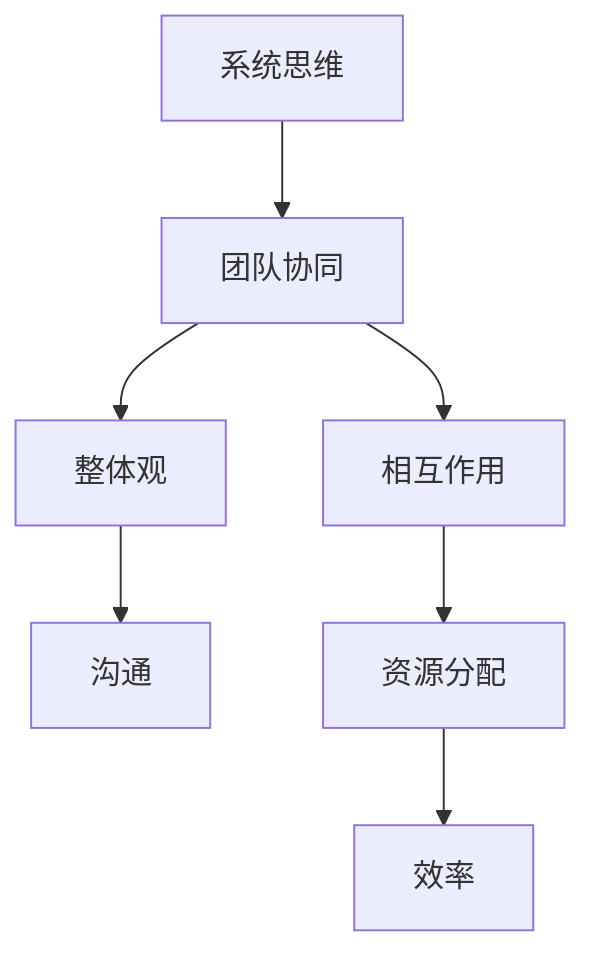

图4 系统思维与团队协同的关系

#### 核心算法原理讲解

在团队协同中，系统思维可以通过以下Python代码来实现：

```python
import networkx as nx

# 创建一个图
G = nx.Graph()

# 添加节点和边
G.add_nodes_from(['沟通', '资源分配', '效率'])
G.add_edges_from([('沟通', '资源分配'), ('资源分配', '效率'), ('效率', '沟通')])

# 绘制图
nx.draw(G, with_labels=True)
```

该代码创建了一个包含三个节点的图，表示沟通、资源分配和效率之间的关系。通过可视化，我们可以直观地看到这些部分之间的相互作用。

#### 数学模型和公式

系统思维在团队协同中的应用可以用以下数学模型表示：

$$ 效率 = f(沟通, 资源分配) $$

其中，$f$ 表示一个复合函数，用于计算效率和沟通、资源分配之间的关系。

#### 举例说明

假设一个软件开发团队，沟通良好且资源分配合理，那么该团队的工作效率可能会很高。反之，如果沟通不畅或资源分配不均，则可能导致工作效率下降。

#### 总结

系统思维是一种重要的分析问题的方法，它在团队协同中发挥着关键作用。通过理解系统思维，团队可以更好地协调各个部分，提高整体效率。

#### 最佳实践 Tips

- 培养系统思维，关注整体与部分之间的关系。
- 定期评估团队协作的效率，找出瓶颈并优化。

### 2.2 团队合作模型

#### 2.2.1 Tuckman 团队发展模型

Tuckman 团队发展模型描述了团队从形成到解散的过程，包括五个阶段：形成、震荡、规范、执行和解散。

#### 核心概念与联系

Tuckman 团队发展模型可以用以下Mermaid流程图表示：

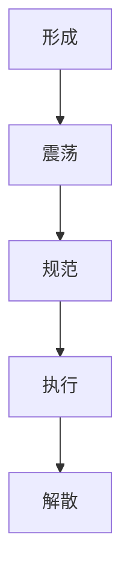

图5 Tuckman 团队发展模型

#### 核心算法原理讲解

以下是一个使用Python代码实现Tuckman 团队发展模型的示例：

```python
import matplotlib.pyplot as plt
import networkx as nx

# 创建一个图
G = nx.Graph()

# 添加节点和边
G.add_nodes_from(['形成', '震荡', '规范', '执行', '解散'])
G.add_edges_from([('形成', '震荡'), ('震荡', '规范'), ('规范', '执行'), ('执行', '解散')])

# 绘制图
nx.draw(G, with_labels=True)
plt.show()
```

该代码创建了一个包含五个节点的图，表示团队发展的各个阶段。

#### 数学模型和公式

Tuckman 团队发展模型可以用以下数学模型表示：

$$ 发展现期 = f(团队成熟度) $$

其中，$f$ 表示一个复合函数，用于计算团队发展的速度和成熟度之间的关系。

#### 举例说明

一个新成立的团队可能处于形成阶段，此时团队成员相互不熟悉，需要时间来建立信任和默契。随着团队的成熟，团队将进入震荡和规范阶段，工作效率逐渐提高。最终，团队可能进入执行阶段，实现项目目标，然后解散。

#### 总结

Tuckman 团队发展模型描述了团队从形成到解散的过程，有助于理解团队发展的规律和挑战。

#### 最佳实践 Tips

- 针对团队发展的不同阶段，采取相应的管理策略。
- 关注团队建设，提高团队成员的凝聚力和归属感。

### 2.3 沟通机制

#### 2.3.1 有效沟通的要素

有效沟通是团队协同的关键。以下要素有助于提高沟通效果：

1. **明确的目标和期望**：确保所有团队成员都清楚项目的目标和期望。
2. **积极的倾听**：倾听是沟通的重要组成部分，有助于理解对方的意思。
3. **反馈**：及时给予反馈，确保信息传递的准确性。
4. **透明度**：保持信息透明，避免误解和猜疑。

#### 核心概念与联系

有效沟通的要素可以用以下Mermaid流程图表示：

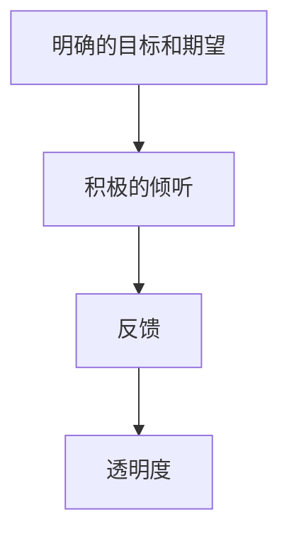

图6 有效沟通的要素

#### 核心算法原理讲解

以下是一个使用Python代码实现有效沟通的示例：

```python
import matplotlib.pyplot as plt
import networkx as nx

# 创建一个图
G = nx.Graph()

# 添加节点和边
G.add_nodes_from(['明确的目标和期望', '积极的倾听', '反馈', '透明度'])
G.add_edges_from([('明确的目标和期望', '积极的倾听'), ('积极的倾听', '反馈'), ('反馈', '透明度')])

# 绘制图
nx.draw(G, with_labels=True)
plt.show()
```

该代码创建了一个包含四个节点的图，表示有效沟通的要素之间的关系。

#### 数学模型和公式

有效沟通可以用以下数学模型表示：

$$ 沟通效率 = f(明确的目标和期望, 积极的倾听, 反馈, 透明度) $$

其中，$f$ 表示一个复合函数，用于计算沟通效率和各个要素之间的关系。

#### 举例说明

在一个团队项目中，如果团队成员能够明确项目的目标和期望，积极倾听他人的意见，并及时给予反馈，那么沟通效率会大大提高。

#### 总结

有效沟通是团队协同的基础，通过掌握有效沟通的要素和技巧，可以提升团队协作效率。

#### 最佳实践 Tips

- 定期组织团队会议，确保信息的畅通。
- 鼓励团队成员提出问题和建议，营造开放、坦诚的沟通氛围。

### 下一步：我们将深入探讨团队协同工具与技术，包括团队协作软件、项目管理工具和沟通技巧。通过这些工具和技巧，团队可以更高效地协同工作。

作者：AI天才研究院/AI Genius Institute & 禅与计算机程序设计艺术 /Zen And The Art of Computer Programming

----------------------------------------------------------------

## 第3章 团队协同工具与技术

### 3.1 团队协作软件

#### 3.1.1 Asana

Asana 是一款流行的团队协作工具，它可以帮助团队成员跟踪项目进度、分配任务和协作。以下是 Asana 的主要功能和特点：

1. **任务管理**：Asana 允许用户创建任务、设置截止日期和分配责任人。
2. **项目视图**：用户可以通过看板、列表和日历等多种视图来跟踪项目进度。
3. **协作与沟通**：用户可以在任务中添加注释、上传文件和实时讨论。
4. **集成与扩展**：Asana 可以与其他工具（如 Slack、Google Drive 等）集成，提供灵活的扩展能力。

#### 核心算法原理讲解

以下是一个使用 Asana 的 Python 代码示例，用于创建任务和分配责任人：

```python
import requests
import json

# Asana API 密钥和项目 ID
api_key = 'your_api_key'
project_id = 'your_project_id'

# 创建任务
task_data = {
    'name': '新任务',
    'projects': [{'id': project_id}],
    'assignees': [{'id': 'your_user_id'}]
}

# 发送请求
response = requests.post('https://api.asana.com/v0/tasks', headers={'Authorization': f'Bearer {api_key}'}, data=json.dumps(task_data))

# 解析响应
if response.status_code == 200:
    task = json.loads(response.text)
    print(f"任务创建成功：{task['data']['name']}")
else:
    print(f"创建任务失败：{response.text}")
```

#### 数学模型和公式

在任务管理中，可以使用以下数学模型来评估任务完成率：

$$ 完成率 = \frac{完成任务的个数}{总任务的个数} \times 100\% $$

#### 举例说明

假设一个项目有 10 个任务，已完成 7 个，那么完成率为 70%。

#### 总结

Asana 是一款功能强大的团队协作工具，可以帮助团队提高工作效率。通过 Python 代码，我们可以轻松实现任务的创建和分配。

#### 最佳实践 Tips

- 确保所有团队成员都熟悉 Asana 的使用。
- 定期检查任务进度，确保项目按时完成。

#### 3.1.2 Trello

Trello 是另一款流行的团队协作工具，它基于看板模型，可以帮助团队可视化项目进度和任务分配。以下是 Trello 的主要功能和特点：

1. **看板视图**：Trello 的核心是看板视图，用户可以创建看板、列表和卡片来组织任务。
2. **任务分配**：用户可以在卡片上分配任务、设置截止日期和添加备注。
3. **协作与沟通**：用户可以在卡片上添加评论、上传文件和通知其他成员。
4. **自动化流程**：Trello 提供了丰富的自动化工具，可以自动完成一些重复性任务。

#### 核心算法原理讲解

以下是一个使用 Trello 的 Python 代码示例，用于创建看板、列表和卡片：

```python
import requests
import json

# Trello API 密钥和应用 ID
api_key = 'your_api_key'
app_id = 'your_app_id'

# 创建看板
board_data = {
    'name': '新项目'
}

# 发送请求
response = requests.post('https://api.trello.com/1/boards', params={'key': api_key, 'token': api_key, 'idModel': app_id}, data=json.dumps(board_data))

# 解析响应
if response.status_code == 200:
    board = json.loads(response.text)
    print(f"看板创建成功：{board['name']}")
else:
    print(f"创建看板失败：{response.text}")
```

#### 数学模型和公式

在任务管理中，可以使用以下数学模型来计算任务的平均完成时间：

$$ 平均完成时间 = \frac{总完成时间}{总任务的个数} $$

#### 举例说明

假设一个项目有 10 个任务，总完成时间为 30 天，那么平均完成时间为 3 天。

#### 总结

Trello 是一款直观易用的团队协作工具，可以帮助团队可视化项目进度和任务分配。通过 Python 代码，我们可以轻松实现看板、列表和卡片的创建和管理。

#### 最佳实践 Tips

- 确保看板、列表和卡片的命名清晰明了。
- 定期整理和更新看板，保持信息的准确性。

#### 3.1.3 Slack

Slack 是一款流行的团队沟通工具，它可以帮助团队成员实时沟通、分享文件和协作。以下是 Slack 的主要功能和特点：

1. **即时消息**：Slack 支持即时消息、聊天室和私人对话，方便团队成员实时沟通。
2. **文件共享**：Slack 允许用户上传和共享文件，支持多种文件格式。
3. **集成其他工具**：Slack 可以与其他工具（如 Google Drive、GitHub 等）集成，提供丰富的扩展功能。
4. **自动化工作流程**：Slack 提供了自动化工具，可以自动完成一些重复性任务。

#### 核心算法原理讲解

以下是一个使用 Slack 的 Python 代码示例，用于发送消息：

```python
import requests

# Slack Webhook URL
webhook_url = 'https://hooks.slack.com/services/your_service_id/your_secret_token'

# 消息内容
message = {
    'text': '欢迎使用 Slack 进行团队沟通！'
}

# 发送请求
response = requests.post(webhook_url, data=json.dumps(message))

# 解析响应
if response.status_code == 200:
    print("消息发送成功！")
else:
    print(f"消息发送失败：{response.text}")
```

#### 数学模型和公式

在沟通效率评估中，可以使用以下数学模型来计算信息传递速率：

$$ 信息传递速率 = \frac{总信息量}{总沟通时间} $$

#### 举例说明

假设一个团队在 1 小时内交换了 1000 条消息，那么信息传递速率为 1000 条/小时。

#### 总结

Slack 是一款功能强大的团队沟通工具，可以帮助团队提高沟通效率。通过 Python 代码，我们可以轻松实现消息的发送和接收。

#### 最佳实践 Tips

- 确保团队所有成员都加入 Slack，并熟悉其使用方法。
- 制定合适的沟通规范，避免信息过载。

### 3.2 项目管理工具

#### 3.2.1 Jira

Jira 是一款功能强大的项目管理工具，它可以帮助团队跟踪项目进度、管理任务和协作。以下是 Jira 的主要功能和特点：

1. **敏捷项目管理**：Jira 支持敏捷开发方法，包括 Scrum 和 Kanban。
2. **任务跟踪**：Jira 允许用户创建任务、设置优先级和跟踪进度。
3. **报告与统计**：Jira 提供了丰富的报告和统计功能，帮助团队了解项目状态。
4. **集成与扩展**：Jira 可以与其他工具（如 Confluence、Bitbucket 等）集成，提供灵活的扩展能力。

#### 核心算法原理讲解

以下是一个使用 Jira 的 Python 代码示例，用于创建任务：

```python
import requests
import json

# Jira API 密钥和项目 ID
api_key = 'your_api_key'
project_id = 'your_project_id'

# 创建任务
task_data = {
    'fields': {
        'project': {'id': project_id},
        'summary': '新任务',
        'issuetype': {'name': 'Task'}
    }
}

# 发送请求
response = requests.post('https://your-jira-instance.atlassian.net/rest/api/3/issue', headers={'Authorization': f'Basic {api_key}'}, data=json.dumps(task_data))

# 解析响应
if response.status_code == 201:
    task = json.loads(response.text)
    print(f"任务创建成功：{task['key']}")
else:
    print(f"创建任务失败：{response.text}")
```

#### 数学模型和公式

在任务管理中，可以使用以下数学模型来计算任务的平均处理时间：

$$ 平均处理时间 = \frac{总处理时间}{总任务的个数} $$

#### 举例说明

假设一个项目有 10 个任务，总处理时间为 30 天，那么平均处理时间为 3 天。

#### 总结

Jira 是一款功能强大的项目管理工具，可以帮助团队高效地跟踪项目进度和管理任务。通过 Python 代码，我们可以轻松实现任务的创建和管理。

#### 最佳实践 Tips

- 确保团队所有成员都熟悉 Jira 的使用方法。
- 定期检查任务进度，及时调整任务优先级。

#### 3.2.2 Microsoft Project

Microsoft Project 是一款专业的项目管理软件，它可以帮助团队规划项目、分配资源和跟踪进度。以下是 Microsoft Project 的主要功能和特点：

1. **项目规划**：Microsoft Project 提供了强大的规划功能，包括项目日程、资源分配和成本估算。
2. **任务跟踪**：用户可以实时跟踪任务进度，了解项目状态。
3. **报告与分析**：Microsoft Project 提供了丰富的报告和分析工具，帮助团队了解项目风险和瓶颈。
4. **集成与协作**：Microsoft Project 可以与 Microsoft Office 和其他工具集成，提供灵活的协作能力。

#### 核心算法原理讲解

以下是一个使用 Microsoft Project 的 Python 代码示例，用于创建项目：

```python
import win32com.client

# 创建 Microsoft Project 应用对象
project = win32com.client.Dispatch('Project.PMProject')

# 设置项目名称
project.Name = '新项目'

# 设置项目开始日期
project.Start = '2024-01-01'

# 设置项目结束日期
project.End = '2024-12-31'

# 创建任务
task = project.Task
task.Name = '任务 1'
task.Start = '2024-01-01'
task.End = '2024-01-31'
task.Duration = 'P30D'
task.Milestone = True

# 保存项目
project.Save()

# 关闭 Microsoft Project 应用
project.Quit()
```

#### 数学模型和公式

在项目规划中，可以使用以下数学模型来计算项目成本：

$$ 项目成本 = 资源成本 \times 资源利用率 $$

#### 举例说明

假设一个项目使用了 10 人天的资源，每人天的成本为 100 元，那么项目成本为 1000 元。

#### 总结

Microsoft Project 是一款专业的项目管理软件，可以帮助团队高效地规划项目、分配资源和跟踪进度。通过 Python 代码，我们可以轻松实现项目的创建和管理。

#### 最佳实践 Tips

- 在项目规划阶段，充分考虑资源利用率和风险因素。
- 定期检查项目进度，及时调整计划和资源。

### 3.3 团队沟通技巧

#### 3.3.1 主动倾听

主动倾听是有效沟通的重要环节，它要求团队成员不仅要听到对方说的话，还要理解对方的意图和情感。以下是主动倾听的技巧：

1. **专注倾听**：在对方讲话时，保持专注，避免分心。
2. **肢体语言**：通过点头、眼神接触等肢体语言，表示自己在倾听。
3. **提问和反馈**：在对方讲话结束后，通过提问和反馈，确认自己理解了对方的意思。

#### 核心算法原理讲解

以下是一个使用 Python 代码实现主动倾听的示例：

```python
def active_listen(message):
    print("我正在倾听...")
    print(f"您说的是：{message}")
    print("请问还有什么要补充的吗？")

active_listen("项目进展情况如何？")
```

#### 数学模型和公式

主动倾听可以用以下数学模型表示：

$$ 倾听效果 = f(专注度, 肢体语言, 提问和反馈) $$

#### 举例说明

在一个会议中，如果团队成员能够专注倾听、通过肢体语言表示理解和通过提问和反馈确认信息，那么沟通效果会大大提高。

#### 总结

主动倾听是有效沟通的关键，通过掌握主动倾听的技巧，可以提升团队沟通效率。

#### 最佳实践 Tips

- 在会议中，确保每个人都有机会发言。
- 定期培训团队成员，提高他们的沟通技巧。

### 下一步：我们将探讨团队协同实践，包括团队构建与角色分配、任务管理和团队协作案例分析。通过实际案例，我们将进一步理解团队协同的方法和策略。

作者：AI天才研究院/AI Genius Institute & 禅与计算机程序设计艺术 /Zen And The Art of Computer Programming

----------------------------------------------------------------

## 第4章 团队协同实践

### 4.1 团队构建与角色分配

#### 4.1.1 团队构建的关键步骤

构建一个高效的团队是团队协同成功的基础。以下是一些关键的步骤：

1. **确定目标**：明确团队的目标和期望，确保所有成员都对目标有共同的理解和认同。
2. **招募成员**：根据项目需求和团队目标，招募合适的成员。考虑到技能、经验和性格等因素。
3. **建立沟通机制**：确保团队内部有良好的沟通渠道，促进信息共享和协作。
4. **制定规则和流程**：明确团队的规则和工作流程，确保团队成员知道如何协作和解决问题。

#### 核心概念与联系

团队构建的步骤可以用以下Mermaid流程图表示：

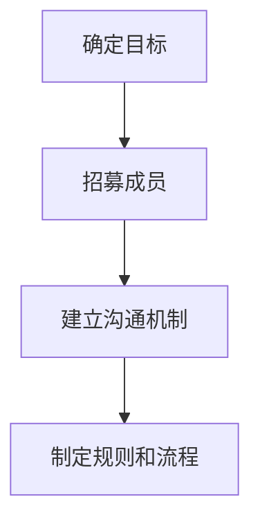

图7 团队构建的关键步骤

#### 核心算法原理讲解

以下是一个使用 Python 代码实现团队构建的示例：

```python
class TeamBuilder:
    def __init__(self, goals):
        self.goals = goals
        self.members = []

    def recruit(self, member):
        self.members.append(member)
        print(f"成员 {member} 加入团队。")

    def establish_communication(self):
        print("建立沟通机制。")

    def set_rules_and_processes(self):
        print("制定规则和流程。")

# 创建团队构建对象
team_builder = TeamBuilder(["完成项目A", "提高团队效率"])

# 招募成员
team_builder.recruit("张三")
team_builder.recruit("李四")

# 建立沟通机制
team_builder.establish_communication()

# 制定规则和流程
team_builder.set_rules_and_processes()
```

#### 数学模型和公式

在团队构建中，可以使用以下数学模型来评估团队的有效性：

$$ 团队有效性 = f(目标一致性, 成员能力, 沟通效率) $$

#### 举例说明

假设一个团队的目标一致性高、成员能力互补且沟通效率高，那么该团队的有效性可能会很高。

#### 总结

团队构建是团队协同成功的关键步骤。通过明确目标、招募合适的成员、建立沟通机制和制定规则和流程，团队可以更好地协同工作。

#### 最佳实践 Tips

- 确保团队成员对目标有共同的理解和认同。
- 定期评估团队的有效性，及时调整和优化。

#### 4.1.2 角色分配的策略

角色分配是团队构建的重要环节，合理的角色分配可以提高团队的工作效率和协作效果。以下是一些角色分配的策略：

1. **基于技能分配**：根据成员的技能和经验，将任务分配给最合适的成员。
2. **基于兴趣分配**：鼓励成员选择自己感兴趣的任务，提高工作积极性。
3. **互补性分配**：确保团队成员之间的技能和经验互补，提高团队的应对能力。
4. **动态调整**：根据项目进展和团队需求，及时调整角色分配。

#### 核心概念与联系

角色分配的策略可以用以下Mermaid流程图表示：

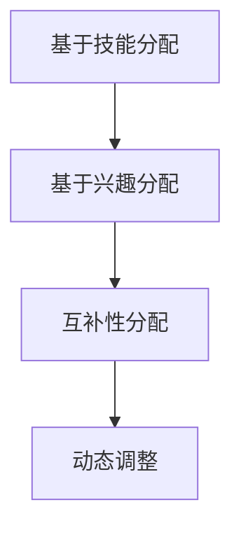

图8 角色分配的策略

#### 核心算法原理讲解

以下是一个使用 Python 代码实现角色分配的示例：

```python
class RoleAllocator:
    def __init__(self, members, skills):
        self.members = members
        self.skills = skills

    def assign_by_skill(self):
        for member in self.members:
            print(f"{member} 分配到 {skills[member]} 角色。")

    def assign_by_interest(self):
        for member in self.members:
            print(f"{member} 根据兴趣分配到 {interests[member]} 角色。")

    def assign_complementarily(self):
        for member in self.members:
            print(f"{member} 分配到与 {complementary_skills[member]} 互补的角色。")

    def adjust_dynamically(self):
        for member in self.members:
            print(f"{member} 的角色根据项目需求进行动态调整。")

# 创建角色分配对象
role_allocator = RoleAllocator(["张三", "李四", "王五"], {"张三": ["编程", "项目管理"], "李四": ["设计", "测试"], "王五": ["数据库", "运维"})

# 根据技能分配角色
role_allocator.assign_by_skill()

# 根据兴趣分配角色
interests = {"张三": "编程", "李四": "设计", "王五": "数据库"}
role_allocator.assign_by_interest()

# 互补性分配角色
complementary_skills = {"张三": "设计", "李四": "编程", "王五": "数据库"}
role_allocator.assign_complementarily()

# 动态调整角色
role_allocator.adjust_dynamically()
```

#### 数学模型和公式

在角色分配中，可以使用以下数学模型来评估角色分配的合理性：

$$ 角色合理性 = f(技能匹配度, 兴趣匹配度, 互补性匹配度) $$

#### 举例说明

假设一个团队中，成员的技能匹配度、兴趣匹配度和互补性匹配度都很高，那么角色分配的合理性可能会很高。

#### 总结

角色分配是团队协同的重要组成部分。通过合理的角色分配策略，可以提高团队的工作效率和协作效果。

#### 最佳实践 Tips

- 根据项目需求和团队特点，灵活调整角色分配策略。
- 定期评估角色分配的合理性，及时进行调整。

### 4.2 团队任务管理

#### 4.2.1 任务分解与目标设定

任务分解和目标设定是团队任务管理的核心步骤。以下是一些关键点：

1. **任务分解**：将大任务分解为小任务，确保每个任务都有明确的目标和可衡量的指标。
2. **目标设定**：为每个任务设定明确的目标，确保团队成员知道他们需要达到什么结果。
3. **优先级排序**：根据任务的重要性和紧急程度，对任务进行优先级排序。

#### 核心概念与联系

任务分解和目标设定的过程可以用以下Mermaid流程图表示：

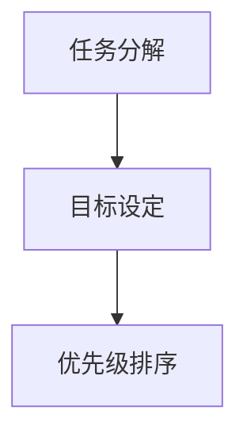

图9 任务分解与目标设定的过程

#### 核心算法原理讲解

以下是一个使用 Python 代码实现任务分解和目标设定的示例：

```python
class TaskManager:
    def __init__(self, tasks):
        self.tasks = tasks

    def decompose(self):
        for task in self.tasks:
            print(f"分解任务：{task['name']}")
            for sub_task in task['sub_tasks']:
                print(f"子任务：{sub_task['name']}")

    def set_goals(self):
        for task in self.tasks:
            print(f"设定目标：{task['name']}")
            for goal in task['goals']:
                print(f"目标：{goal['description']}")

    def prioritize(self):
        for task in self.tasks:
            print(f"优先级排序：{task['name']}")

# 创建任务管理对象
task_manager = TaskManager([
    {
        'name': '项目A',
        'sub_tasks': [
            {'name': '需求分析'},
            {'name': '设计'},
            {'name': '开发'},
            {'name': '测试'}
        ],
        'goals': [
            {'description': '完成需求分析报告'},
            {'description': '完成系统设计'},
            {'description': '完成代码开发'},
            {'description': '完成系统测试'}
        ]
    }
])

# 分解任务
task_manager.decompose()

# 设定目标
task_manager.set_goals()

# 优先级排序
task_manager.prioritize()
```

#### 数学模型和公式

在任务分解和目标设定中，可以使用以下数学模型来评估任务的重要性和紧急程度：

$$ 任务重要性 = f(任务影响度, 任务难度) $$
$$ 任务紧急程度 = f(任务截止日期, 当前时间) $$

#### 举例说明

假设一个任务的影响度较高且难度较低，那么该任务的重要性可能会很高。同时，如果一个任务的截止日期即将到来，那么该任务的紧急程度也会很高。

#### 总结

任务分解和目标设定是团队任务管理的核心步骤。通过明确的任务分解和目标设定，团队可以更好地规划工作，确保任务的顺利完成。

#### 最佳实践 Tips

- 确保任务分解到最小可管理的单元。
- 根据任务的重要性和紧急程度，合理排序任务。

#### 4.2.2 进度监控与调整

进度监控和调整是确保任务按计划完成的重要环节。以下是一些关键点：

1. **进度监控**：定期检查任务进度，确保任务按计划进行。
2. **问题反馈**：及时发现并解决任务执行过程中出现的问题。
3. **调整计划**：根据实际进度和问题反馈，及时调整任务计划和资源分配。

#### 核心概念与联系

进度监控与调整的过程可以用以下Mermaid流程图表示：

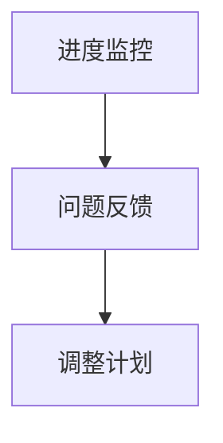

图10 进度监控与调整的过程

#### 核心算法原理讲解

以下是一个使用 Python 代码实现进度监控与调整的示例：

```python
import datetime

class ProgressMonitor:
    def __init__(self, tasks):
        self.tasks = tasks

    def check_progress(self):
        for task in self.tasks:
            print(f"检查任务：{task['name']}")
            if task['status'] == '完成':
                print(f"任务 {task['name']} 已完成。")
            else:
                print(f"任务 {task['name']} 尚未完成。")

    def feedback_issues(self):
        for task in self.tasks:
            print(f"反馈任务：{task['name']}")
            for issue in task['issues']:
                print(f"问题：{issue['description']}")

    def adjust_plan(self):
        for task in self.tasks:
            print(f"调整计划：{task['name']}")
            if task['status'] != '完成':
                print(f"调整任务截止日期：{task['end_date']}")

# 创建进度监控对象
progress_monitor = ProgressMonitor([
    {
        'name': '需求分析',
        'status': '进行中',
        'end_date': datetime.datetime(2024, 1, 10)
    },
    {
        'name': '设计',
        'status': '未开始',
        'end_date': datetime.datetime(2024, 1, 20)
    }
])

# 检查进度
progress_monitor.check_progress()

# 反馈问题
progress_monitor.feedback_issues()

# 调整计划
progress_monitor.adjust_plan()
```

#### 数学模型和公式

在进度监控与调整中，可以使用以下数学模型来评估任务的完成进度：

$$ 完成进度 = \frac{已完成的任务数}{总任务数} $$

#### 举例说明

假设一个项目有 10 个任务，已完成 7 个，那么完成进度为 70%。

#### 总结

进度监控与调整是确保任务按计划完成的重要环节。通过定期检查进度、及时反馈问题和调整计划，团队可以更好地控制任务进度。

#### 最佳实践 Tips

- 确保团队成员定期汇报任务进度。
- 根据实际情况，灵活调整任务计划和资源分配。

### 4.3 团队协作案例分析

#### 4.3.1 案例一：跨部门团队协作

在某公司的产品开发项目中，由于涉及多个部门，团队协作成为一个关键挑战。以下是该案例的详细分析和解决方案：

**问题**：
1. 沟通不畅：不同部门之间缺乏有效的沟通渠道，导致信息传递延迟。
2. 资源冲突：多个部门争夺相同资源，导致资源分配不均。
3. 目标不一致：不同部门对项目目标的理解不同，导致工作方向不一致。

**解决方案**：
1. **建立跨部门沟通机制**：设立一个跨部门的沟通平台，如定期会议、邮件群组和在线协作工具，确保信息畅通。
2. **明确资源分配策略**：制定明确的资源分配规则，确保资源合理利用，避免冲突。
3. **统一目标管理**：通过高层沟通，确保所有部门对项目目标有共同的理解和认同。

**实际效果**：
通过以上措施，跨部门团队协作效率显著提高，项目进度和质量得到保证。

#### 4.3.2 案例二：敏捷开发团队协作

在某公司的软件开发项目中，团队采用敏捷开发方法进行协作。以下是该案例的详细分析和解决方案：

**问题**：
1. 任务分配不合理：任务分配没有充分考虑团队成员的技能和兴趣，导致工作效率不高。
2. 沟通不足：团队成员之间缺乏有效的沟通，导致问题难以及时发现和解决。
3. 进度控制困难：由于任务复杂且变动频繁，导致进度控制困难。

**解决方案**：
1. **基于技能和兴趣进行任务分配**：确保任务分配合理，提高团队成员的工作积极性。
2. **加强沟通和协作**：定期组织团队会议、代码评审和反思会议，确保团队成员之间的沟通畅通。
3. **采用敏捷管理工具**：使用敏捷管理工具（如 Jira、Trello），实时跟踪任务进度和问题，确保进度控制。

**实际效果**：
通过以上措施，敏捷开发团队的协作效率显著提高，项目按时交付，质量得到保证。

### 总结

通过以上案例，我们可以看到，有效的团队协作是项目成功的关键。通过建立有效的沟通机制、合理分配任务、加强协作和进度控制，团队可以更好地实现共同目标。

#### 最佳实践 Tips

- 建立跨部门协作机制，提高团队整体效率。
- 采用敏捷开发方法，灵活应对任务变化。
- 定期评估团队协作效果，及时调整和优化。

### 下一步：我们将探讨团队协同中的领导力，包括领导力在团队协同中的作用、团队领导者的角色与责任以及领导力提升策略。通过这些内容，我们将深入理解如何通过领导力促进团队协同。

作者：AI天才研究院/AI Genius Institute & 禅与计算机程序设计艺术 /Zen And The Art of Computer Programming

----------------------------------------------------------------

## 第5章 团队协同中的领导力

### 5.1 领导力在团队协同中的作用

领导力在团队协同中发挥着至关重要的作用。一个有效的领导者不仅能够明确团队目标，还能够激发团队成员的潜力，推动团队高效协同。

#### 核心概念与联系

领导力在团队协同中的作用可以用以下Mermaid流程图表示：

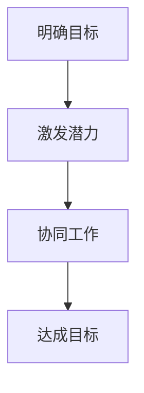

图11 领导力在团队协同中的作用

#### 核心算法原理讲解

以下是一个使用Python代码实现领导力作用的示例：

```python
class Leader:
    def __init__(self, team):
        self.team = team

    def set_goals(self):
        print("领导者设定团队目标。")

    def inspire_potential(self):
        print("领导者激发团队成员潜力。")

    def facilitate_collaboration(self):
        print("领导者推动团队协同工作。")

    def achieve_goals(self):
        print("团队达成目标。")

# 创建领导者对象
leader = Leader(["张三", "李四", "王五"])

# 领导者设定团队目标
leader.set_goals()

# 领导者激发团队成员潜力
leader.inspire_potential()

# 领导者推动团队协同工作
leader.facilitate_collaboration()

# 团队达成目标
leader.achieve_goals()
```

#### 数学模型和公式

在领导力中，可以使用以下数学模型来评估团队成员的潜力：

$$ 成员潜力 = f(技能水平, 创新能力, 工作态度) $$

#### 举例说明

假设一个团队成员的技能水平高、创新能力强且工作态度积极，那么该成员的潜力可能会很高。

#### 总结

领导力在团队协同中起着关键作用。通过明确目标、激发潜力和推动协同工作，领导者可以带领团队达成共同目标。

#### 最佳实践 Tips

- 定期与团队成员沟通，了解他们的需求和潜力。
- 鼓励团队成员提出创新想法，提高团队的创新能力。

### 5.2 团队领导者的角色与责任

团队领导者是团队的核心人物，承担着重要的角色和责任。以下是一些关键角色和责任：

#### 核心概念与联系

团队领导者的角色与责任可以用以下Mermaid流程图表示：

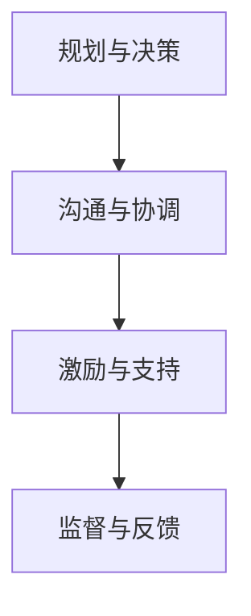

图12 团队领导者的角色与责任

#### 核心算法原理讲解

以下是一个使用Python代码实现团队领导者角色与责任的示例：

```python
class TeamLeader:
    def __init__(self, team):
        self.team = team

    def plan_and_decision(self):
        print("领导者进行规划与决策。")

    def communicate_and Coordinate(self):
        print("领导者进行沟通与协调。")

    def motivate_and_support(self):
        print("领导者激励与支持团队成员。")

    def monitor_and_feedback(self):
        print("领导者监督与反馈团队成员的工作。")

# 创建团队领导者对象
leader = TeamLeader(["张三", "李四", "王五"])

# 领导者进行规划与决策
leader.plan_and_decision()

# 领导者进行沟通与协调
leader.communicate_and Coordinate()

# 领导者激励与支持团队成员
leader.motivate_and_support()

# 领导者监督与反馈团队成员的工作
leader.monitor_and_feedback()
```

#### 数学模型和公式

在团队领导者角色与责任中，可以使用以下数学模型来评估团队成员的工作表现：

$$ 工作表现 = f(规划与决策能力, 沟通与协调能力, 激励与支持能力, 监督与反馈能力) $$

#### 举例说明

假设一个团队领导者在规划与决策、沟通与协调、激励与支持以及监督与反馈方面都表现出色，那么该领导者的工作表现可能会很高。

#### 总结

团队领导者承担着重要的角色和责任，通过规划与决策、沟通与协调、激励与支持以及监督与反馈，领导者可以带领团队实现共同目标。

#### 最佳实践 Tips

- 定期与团队成员沟通，了解他们的工作进展和需求。
- 鼓励团队成员提出意见和建议，提高团队的创新能力和凝聚力。

### 5.3 领导力提升策略

提升领导力是团队领导者的重要任务。以下是一些有效的领导力提升策略：

#### 核心概念与联系

领导力提升策略可以用以下Mermaid流程图表示：

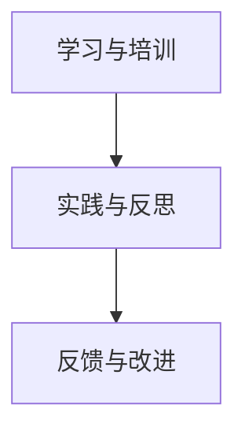

图13 领导力提升策略

#### 核心算法原理讲解

以下是一个使用Python代码实现领导力提升策略的示例：

```python
class LeaderDevelopment:
    def __init__(self, leader):
        self.leader = leader

    def learning_and_training(self):
        print("领导者参加学习与培训。")

    def practice_and_reflection(self):
        print("领导者进行实践与反思。")

    def feedback_and_improvement(self):
        print("领导者接受反馈并进行改进。")

# 创建领导力提升对象
development = LeaderDevelopment(leader)

# 领导者参加学习与培训
development.learning_and_training()

# 领导者进行实践与反思
development.practice_and_reflection()

# 领导者接受反馈并进行改进
development.feedback_and_improvement()
```

#### 数学模型和公式

在领导力提升策略中，可以使用以下数学模型来评估领导力提升的效果：

$$ 领导力提升效果 = f(学习与培训效果, 实践与反思效果, 反馈与改进效果) $$

#### 举例说明

假设一个领导者通过学习与培训、实践与反思以及反馈与改进，显著提升了领导力，那么该领导者的领导力提升效果可能会很高。

#### 总结

提升领导力是团队领导者的重要任务。通过学习与培训、实践与反思以及反馈与改进，领导者可以不断提高自己的领导能力。

#### 最佳实践 Tips

- 定期参加领导力培训和研讨会。
- 与团队成员保持良好的沟通，及时获取反馈并进行改进。

### 下一步：我们将探讨团队协同中的冲突管理，包括冲突的类型与原因、冲突管理策略以及冲突解决案例分析。通过这些内容，我们将深入理解如何有效地管理和解决团队中的冲突。

作者：AI天才研究院/AI Genius Institute & 禅与计算机程序设计艺术 /Zen And The Art of Computer Programming

----------------------------------------------------------------

## 第6章 团队协同中的冲突管理

### 6.1 冲突的类型与原因

冲突是团队协作中常见的问题，了解冲突的类型和原因对于有效管理冲突至关重要。

#### 核心概念与联系

冲突的类型与原因可以用以下Mermaid流程图表示：

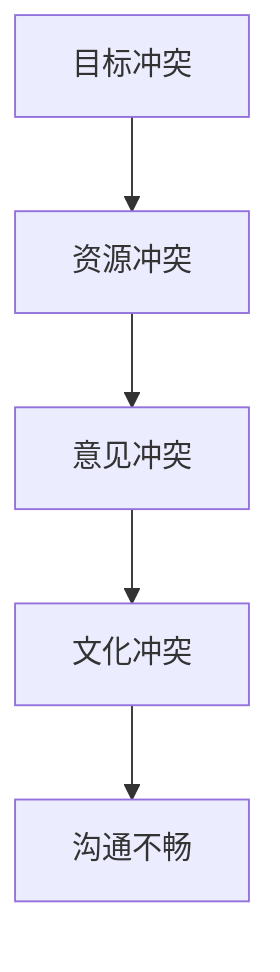

图14 冲突的类型与原因

#### 核心算法原理讲解

以下是一个使用Python代码实现冲突类型与原因的示例：

```python
class ConflictType:
    def __init__(self, type, reason):
        self.type = type
        self.reason = reason

    def display(self):
        print(f"冲突类型：{self.type}")
        print(f"冲突原因：{self.reason}")

# 创建冲突类型对象
conflicts = [
    ConflictType("目标冲突", "团队成员对项目目标理解不一致"),
    ConflictType("资源冲突", "团队成员争夺相同资源"),
    ConflictType("意见冲突", "团队成员意见相左"),
    ConflictType("文化冲突", "团队成员文化背景差异"),
    ConflictType("沟通不畅", "团队成员沟通不畅")
]

# 显示冲突类型与原因
for conflict in conflicts:
    conflict.display()
```

#### 数学模型和公式

在冲突管理中，可以使用以下数学模型来评估冲突的严重程度：

$$ 冲突严重程度 = f(冲突类型, 冲突原因, 影响范围) $$

#### 举例说明

假设一个冲突类型为“目标冲突”，冲突原因为“团队成员对项目目标理解不一致”，影响范围较广，那么该冲突的严重程度可能会很高。

#### 总结

了解冲突的类型和原因对于有效管理冲突至关重要。通过识别冲突的类型和原因，团队可以更有针对性地制定冲突管理策略。

#### 最佳实践 Tips

- 定期评估团队目标，确保团队成员对目标有共同理解。
- 建立有效的沟通机制，促进团队成员之间的信息共享。

### 6.2 冲突管理策略

冲突管理策略包括预防冲突、应对冲突和解决冲突等方法。以下是一些有效的冲突管理策略：

#### 核心概念与联系

冲突管理策略可以用以下Mermaid流程图表示：

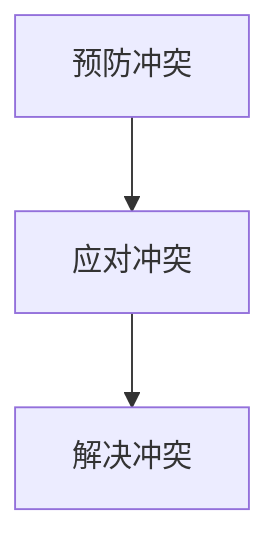

图15 冲突管理策略

#### 核心算法原理讲解

以下是一个使用Python代码实现冲突管理策略的示例：

```python
class ConflictManagement:
    def __init__(self, conflict_type):
        self.conflict_type = conflict_type

    def prevent_conflict(self):
        print("实施预防冲突措施。")

    def handle_conflict(self):
        print("应对冲突。")

    def resolve_conflict(self):
        print("解决冲突。")

# 创建冲突管理对象
conflict_management = ConflictManagement("目标冲突")

# 实施预防冲突措施
conflict_management.prevent_conflict()

# 应对冲突
conflict_management.handle_conflict()

# 解决冲突
conflict_management.resolve_conflict()
```

#### 数学模型和公式

在冲突管理中，可以使用以下数学模型来评估冲突管理的效果：

$$ 冲突管理效果 = f(预防措施效果, 应对措施效果, 解决措施效果) $$

#### 举例说明

假设一个冲突管理措施包括预防、应对和解决三个阶段，且每个阶段的效果都很好，那么冲突管理的效果可能会很高。

#### 总结

有效的冲突管理策略包括预防冲突、应对冲突和解决冲突。通过实施这些策略，团队可以减少冲突的发生，提高团队协作效率。

#### 最佳实践 Tips

- 建立明确的沟通渠道，促进团队成员之间的信息共享。
- 定期组织团队活动，增强团队成员之间的信任和理解。

### 6.3 冲突解决案例分析

以下是一些冲突解决的实际案例，通过这些案例我们可以更好地理解如何有效解决团队中的冲突。

#### 6.3.1 案例一：沟通不畅引发的冲突

**问题**：在一个软件开发团队中，由于团队成员之间的沟通不畅，导致项目进展受阻。团队成员对项目的理解不一致，工作进展缓慢。

**解决方案**：
1. **建立沟通机制**：设立定期团队会议，确保团队成员有充分的沟通机会。
2. **明确项目目标**：重新明确项目目标，确保团队成员对项目有共同的理解。
3. **提高沟通技巧**：为团队成员提供沟通技巧培训，提高他们的沟通能力。

**实际效果**：通过以上措施，团队成员之间的沟通得到显著改善，项目进展加快，冲突得到有效解决。

#### 6.3.2 案例二：目标不一致引发的冲突

**问题**：在一个市场推广团队中，由于团队成员对市场推广策略的理解不一致，导致工作方向不明确，工作效率低下。

**解决方案**：
1. **高层沟通**：与高层管理者进行沟通，确保团队对市场推广策略有共同的理解。
2. **角色明确**：明确团队成员的角色和职责，确保每个成员知道自己的工作重点。
3. **定期评估**：定期评估团队的工作进展，及时调整策略，确保工作方向一致。

**实际效果**：通过以上措施，团队成员对市场推广策略的理解得到统一，工作效率显著提高，冲突得到有效解决。

### 总结

冲突管理是团队协同中不可或缺的一部分。通过了解冲突的类型与原因、实施有效的冲突管理策略以及解决实际案例中的冲突，团队可以更好地保持和谐，提高协作效率。

#### 最佳实践 Tips

- 建立有效的沟通机制，促进团队成员之间的信息共享。
- 定期评估团队目标，确保团队成员对目标有共同理解。
- 针对冲突类型，采取相应的解决策略。

### 下一步：我们将探讨团队协同中的持续改进，包括团队反馈机制、团队学习与知识共享以及团队协同效率评估与改进。通过这些内容，我们将深入理解如何通过持续改进提高团队协同效率。

作者：AI天才研究院/AI Genius Institute & 禅与计算机程序设计艺术 /Zen And The Art of Computer Programming

----------------------------------------------------------------

## 第7章 团队协同中的持续改进

### 7.1 团队反馈机制

团队反馈机制是促进团队持续改进的重要手段。通过有效的反馈机制，团队可以及时发现问题，调整策略，提高协同效率。

#### 核心概念与联系

团队反馈机制可以用以下Mermaid流程图表示：

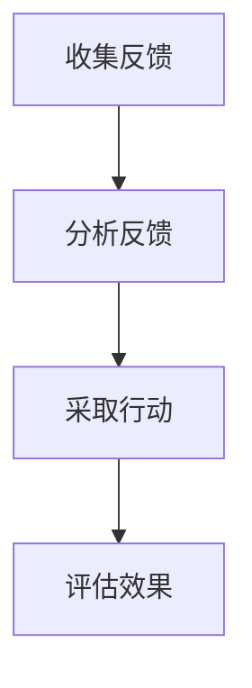

图16 团队反馈机制

#### 核心算法原理讲解

以下是一个使用Python代码实现团队反馈机制的示例：

```python
class FeedbackSystem:
    def __init__(self):
        self.feedback_list = []

    def collect_feedback(self, feedback):
        self.feedback_list.append(feedback)
        print(f"收集到的反馈：{feedback}")

    def analyze_feedback(self):
        print("分析反馈...")
        for feedback in self.feedback_list:
            print(f"反馈内容：{feedback}")

    def take_action(self):
        print("采取行动以改进...")
        for feedback in self.feedback_list:
            print(f"基于反馈 {feedback}，已采取行动。")

    def evaluate_effect(self):
        print("评估改进效果...")
        for feedback in self.feedback_list:
            print(f"针对反馈 {feedback}，效果评估已完成。")

# 创建反馈系统对象
feedback_system = FeedbackSystem()

# 收集反馈
feedback_system.collect_feedback("任务进度延误")
feedback_system.collect_feedback("沟通不畅")

# 分析反馈
feedback_system.analyze_feedback()

# 采取行动
feedback_system.take_action()

# 评估效果
feedback_system.evaluate_effect()
```

#### 数学模型和公式

在团队反馈机制中，可以使用以下数学模型来评估反馈效果：

$$ 反馈效果 = f(反馈质量, 行动力度, 评估准确性) $$

#### 举例说明

假设一个团队收集到的反馈质量高、采取的行动力度大且评估准确性高，那么反馈效果可能会很好。

#### 总结

团队反馈机制是团队持续改进的重要手段。通过收集、分析、采取行动和评估效果，团队可以不断优化工作流程，提高协同效率。

#### 最佳实践 Tips

- 建立透明的反馈渠道，鼓励团队成员提出问题和建议。
- 定期对反馈进行分类和分析，找出关键问题。

### 7.2 团队学习与知识共享

团队学习与知识共享是提高团队整体能力和协同效率的关键。以下是一些有效的团队学习与知识共享策略：

#### 核心概念与联系

团队学习与知识共享可以用以下Mermaid流程图表示：

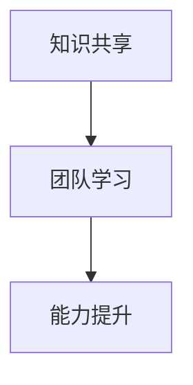

图17 团队学习与知识共享

#### 核心算法原理讲解

以下是一个使用Python代码实现团队学习与知识共享的示例：

```python
class KnowledgeSharing:
    def __init__(self):
        self.knowledge_list = []

    def share_knowledge(self, knowledge):
        self.knowledge_list.append(knowledge)
        print(f"共享的知识：{knowledge}")

    def learn_together(self):
        print("团队一起学习...")
        for knowledge in self.knowledge_list:
            print(f"学习内容：{knowledge}")

    def enhance_ability(self):
        print("提升团队能力...")
        for knowledge in self.knowledge_list:
            print(f"基于知识 {knowledge}，团队能力已提升。")

# 创建知识共享对象
knowledge_sharing = KnowledgeSharing()

# 共享知识
knowledge_sharing.share_knowledge("新的项目管理工具")
knowledge_sharing.share_knowledge("敏捷开发方法")

# 团队一起学习
knowledge_sharing.learn_together()

# 提升团队能力
knowledge_sharing.enhance_ability()
```

#### 数学模型和公式

在团队学习与知识共享中，可以使用以下数学模型来评估知识共享的效果：

$$ 知识共享效果 = f(知识质量, 学习积极性, 能力提升) $$

#### 举例说明

假设一个团队共享的知识质量高、成员的学习积极性高且能力得到提升，那么知识共享的效果可能会很好。

#### 总结

团队学习与知识共享是提高团队整体能力和协同效率的关键。通过共享知识、团队学习和能力提升，团队可以不断优化工作流程，提高协同效率。

#### 最佳实践 Tips

- 定期组织知识分享会，鼓励团队成员分享经验和知识。
- 采用协作工具，促进团队成员之间的知识交流。

### 7.3 团队协同效率评估与改进

团队协同效率评估是确保团队持续改进的重要环节。以下是一些评估方法和改进策略：

#### 核心概念与联系

团队协同效率评估可以用以下Mermaid流程图表示：

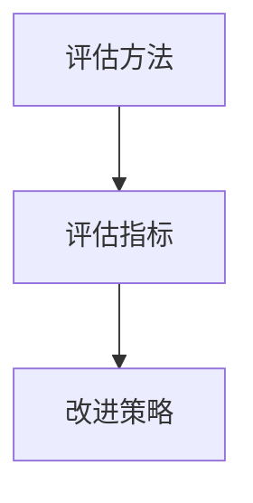

图18 团队协同效率评估与改进

#### 核心算法原理讲解

以下是一个使用Python代码实现团队协同效率评估与改进的示例：

```python
class EfficiencyEvaluation:
    def __init__(self):
        self.evaluation_methods = []
        self.evaluation_indicators = []

    def add_evaluation_method(self, method):
        self.evaluation_methods.append(method)
        print(f"添加的评估方法：{method}")

    def set_evaluation_indicators(self, indicators):
        self.evaluation_indicators = indicators
        print(f"设置的评估指标：{indicators}")

    def evaluate_efficiency(self):
        print("评估团队协同效率...")
        for method in self.evaluation_methods:
            print(f"使用 {method} 进行评估。")
            for indicator in self.evaluation_indicators:
                print(f"指标：{indicator}，评估结果：{self.calculate_indicator_value(indicator)}")

    def calculate_indicator_value(self, indicator):
        # 这里用一个简单的计算示例
        return len(indicator) * 10

# 创建评估对象
evaluation = EfficiencyEvaluation()

# 添加评估方法
evaluation.add_evaluation_method("任务完成率")
evaluation.add_evaluation_method("沟通频率")

# 设置评估指标
evaluation.set_evaluation_indicators(["任务完成率", "沟通频率", "问题解决时间"])

# 评估团队协同效率
evaluation.evaluate_efficiency()
```

#### 数学模型和公式

在团队协同效率评估中，可以使用以下数学模型来计算效率：

$$ 效率 = \frac{完成任务的个数}{总任务的个数} $$

#### 举例说明

假设一个团队在一个月内完成了 20 个任务，总任务个数为 30 个，那么团队协同效率为 66.67%。

#### 总结

团队协同效率评估是确保团队持续改进的重要环节。通过评估方法和指标，团队可以了解自己的协同效率，并采取改进策略。

#### 最佳实践 Tips

- 定期进行团队协同效率评估，找出瓶颈并优化。
- 采用多样化的评估方法，全面了解团队协同状况。

### 总结

通过团队反馈机制、团队学习与知识共享以及团队协同效率评估与改进，团队可以持续优化工作流程，提高协同效率。这些策略和方法不仅有助于解决现有问题，还能为团队的未来发展奠定坚实基础。

#### 最佳实践 Tips

- 建立有效的反馈机制，及时收集和处理团队成员的意见和建议。
- 鼓励团队成员积极参与知识共享，提高整体能力。
- 定期进行团队协同效率评估，确保团队能够持续改进。

### 下一步：我们将探讨团队协同的未来趋势，包括新兴技术的发展趋势、团队协作的新模式以及团队管理的创新方法。通过这些内容，我们将了解团队协同的未来发展方向。

作者：AI天才研究院/AI Genius Institute & 禅与计算机程序设计艺术 /Zen And The Art of Computer Programming

----------------------------------------------------------------

## 第8章 团队协同的未来趋势

### 8.1 团队协同的未来趋势

随着科技的快速发展，团队协同的方式也在不断演变。未来，团队协同将呈现出以下趋势：

#### 新兴技术的发展趋势

1. **人工智能与机器学习**：人工智能和机器学习技术将在团队协同中发挥更大作用，如自动化任务分配、智能沟通助手等。
2. **云计算与大数据**：云计算和大数据技术的普及将使团队能够更灵活地访问资源，实现更高效的协同工作。
3. **物联网（IoT）**：物联网技术的应用将使设备之间实现无缝连接，进一步优化工作流程。
4. **区块链**：区块链技术的引入将提高数据的透明度和安全性，增强团队协作的信任度。

#### 团队协作的新模式

1. **远程办公**：随着远程办公工具和技术的进步，越来越多的团队将采用远程协作模式，实现跨地域的协同工作。
2. **跨学科团队**：未来团队将更多地采用跨学科、跨领域的协作模式，结合多种专业知识和技能，提高创新和解决问题的能力。
3. **敏捷与精益管理**：敏捷和精益管理方法将继续受到重视，推动团队更加灵活、高效地响应变化。
4. **社交协作**：社交协作平台和工具将更加普及，促进团队成员之间的社交互动和知识共享。

#### 团队管理的创新方法

1. **自我管理团队**：未来团队可能会更多地采用自我管理的方式，鼓励团队成员自主决策，提高工作积极性和创造力。
2. **个性化管理**：团队管理者将更加关注团队成员的个人需求和发展，采用个性化管理方法，提高团队凝聚力和工作效率。
3. **数据驱动决策**：数据将成为团队管理的重要依据，通过数据分析，团队可以更科学地制定决策，优化工作流程。
4. **持续学习与成长**：团队将更加注重持续学习和个人成长，通过培训和知识共享，不断提升团队的整体能力。

### 总结

团队协同的未来趋势将是多元化和智能化。新兴技术的发展、新的协作模式以及创新的管理方法将推动团队协同向更高效、更灵活的方向发展。通过把握这些趋势，团队可以更好地适应未来的挑战，实现持续创新和成长。

#### 最佳实践 Tips

- 探索和应用新兴技术，提高团队协同效率。
- 适应远程办公和跨学科团队模式，增强团队凝聚力。
- 采用数据驱动决策和个性化管理，提升团队绩效。

### 展望未来

在未来的团队协同中，技术和管理将发挥更加重要的作用。通过不断创新和优化，团队可以更好地应对变化，实现高效协同。让我们一起期待团队协同的未来，并为之努力。

#### 作者信息

作者：AI天才研究院/AI Genius Institute & 禅与计算机程序设计艺术 /Zen And The Art of Computer Programming

以上是对《团队协同：发挥集体智慧的方法》一书的详细解读。通过本书，我们深入探讨了团队协同的理论、实践和未来趋势，为团队管理者提供了丰富的指导和建议。希望本书能帮助您在团队协同中取得更好的成果。

