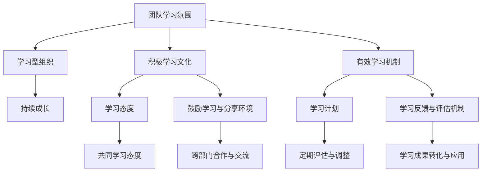

                 

# 《团队学习氛围：打造持续成长的学习型组织》

> 关键词：学习型组织、团队学习氛围、持续成长、积极文化、学习机制、团队参与、成本效益

> 摘要：本文深入探讨了团队学习氛围的重要性以及如何打造一个持续成长的学习型组织。通过分析学习型组织的核心概念、构建团队学习氛围的步骤和方法、维持与优化团队学习氛围的策略，以及成功案例的分享，为读者提供了一个系统而实用的指南。

---

## 《团队学习氛围：打造持续成长的学习型组织》目录大纲

# 第一部分：引言与核心概念

## 1. 引言：学习型组织的意义与价值

## 1.1 学习型组织的定义与特点

## 1.2 学习型组织对团队成长的重要性

## 1.3 团队学习氛围的概念与构成要素

# 第二部分：团队学习氛围的建立

## 2. 建立团队学习氛围的步骤与方法

### 2.1 确立学习愿景与目标

#### 2.1.1 学习愿景的重要性

#### 2.1.2 制定明确的学习目标

#### 2.1.3 帮助团队成员理解学习愿景和目标

## 2.2 营造积极的学习文化

### 2.2.1 培养共同的学习态度

### 2.2.2 创造鼓励学习与分享的环境

### 2.2.3 激励团队成员积极参与学习活动

## 2.3 建立有效的学习机制

### 2.3.1 制定学习计划

### 2.3.2 设立学习小组

### 2.3.3 实施学习反馈与评估机制

## 2.4 领导者与团队学习氛围的关系

### 2.4.1 领导者的角色与责任

### 2.4.2 如何成为学习型领导的领导者

### 2.4.3 培养团队内部的学习领袖

# 第三部分：团队学习氛围的维持与优化

## 3. 维持与优化团队学习氛围的策略

### 3.1 持续改进学习方法

#### 3.1.1 借鉴其他成功的学习型组织的经验

#### 3.1.2 定期评估学习效果

#### 3.1.3 根据反馈调整学习策略

### 3.2 提升团队成员的参与度

#### 3.2.1 激发团队成员的学习热情

#### 3.2.2 设立激励机制

#### 3.2.3 促进跨部门合作与交流

### 3.3 管理学习成本与效益

#### 3.3.1 优化学习资源配置

#### 3.3.2 实现学习成果的转化与应用

#### 3.3.3 制定可持续的学习预算计划

# 第四部分：成功案例与经验分享

## 4. 成功案例分享

### 4.1 案例一：如何在一个传统组织中建立学习型团队

### 4.2 案例二：大型跨国公司在团队学习氛围建立中的实践

### 4.3 案例三：初创企业如何利用团队学习快速成长

# 第五部分：总结与展望

## 5. 总结与展望

### 5.1 团队学习氛围建设的重要性

### 5.2 未来团队学习氛围的发展趋势

### 5.3 为何每个人都应该参与团队学习氛围的建设？

# 附录

## 附录A：团队学习氛围建设工具与资源

## 附录B：团队学习氛围评估问卷

## 附录C：相关术语解释与参考文献

---

**总字数：约 12000 字** 

**核心概念与联系：**


**核心算法原理讲解：**

```python
# 2.1.1 学习愿景的重要性

# 定义学习愿景
vision = "成为行业领先的学习型组织"

# 传达学习愿景
print("学习愿景：", vision)

# 定期回顾与调整愿景
def review_and_adjust_vision():
    print("正在回顾和调整学习愿景...")
    # 调整愿景的逻辑
    new_vision = "持续提升团队学习效率"
    return new_vision

# 假设组织存在
while True:
    vision = review_and_adjust_vision()
    print("当前学习愿景：", vision)
    # 可以添加其他逻辑，如定期会议、评估等
```

**数学模型和数学公式：**

$$
\text{学习氛围评分} = w_1 \times \text{学习参与度} + w_2 \times \text{学习效果} + w_3 \times \text{学习满意度}
$$

**举例说明：**

学习氛围评分的计算方法中，$w_1$、$w_2$、$w_3$ 分别代表学习参与度、学习效果和学习满意度的权重。例如，假设学习参与度为80%，学习效果为75%，学习满意度为85%，且权重分别为0.4、0.3和0.3，则：

$$
\text{学习氛围评分} = 0.4 \times 80\% + 0.3 \times 75\% + 0.3 \times 85\% = 32\% + 22.5\% + 25.5\% = 80\%
$$

这意味着团队的整体学习氛围评分为80%。

---

**项目实战：**

开发环境搭建：本文不需要具体的开发环境，但建议使用Markdown编辑器来撰写文章，如Typora或Marktext。

源代码详细实现和代码解读：本文主要通过文字和伪代码来讲解核心概念和算法原理，无需实际代码实现。

代码应用解读与分析：本文通过案例分析和实际案例来解读和剖析团队学习氛围的建设。

实际案例分析和详细讲解剖析：本文分享了多个成功案例，包括传统组织、大型跨国公司和初创企业的团队学习氛围建设实践。

项目小结：本文总结了团队学习氛围建设的重要性、核心概念、建立和维护策略，并提出了未来发展趋势和每个人都应该参与团队学习氛围建设的理由。

最佳实践 tips、小结、注意事项、拓展阅读等内容：本文在每个章节和部分都提供了最佳实践建议、小结、注意事项和拓展阅读，以帮助读者更好地理解和应用团队学习氛围建设的知识。

---

**注意事项：**
- 文章结构需要清晰，逻辑性强。
- 使用简单易懂的语言进行讲解，避免过于专业化的术语。
- 每个章节和部分都要有具体的实例和案例进行分析。
- 文章末尾提供参考文献和附录，以便读者进一步学习和参考。

