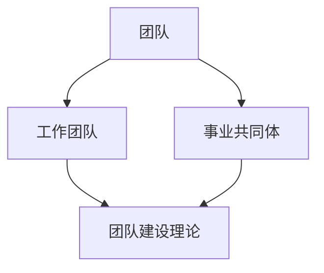

                 

### 引言

在当今快速发展的信息技术时代，团队建设已经成为企业和组织成功的关键因素。然而，传统的团队建设理念和方法已经难以适应现代复杂多变的工作环境。现代企业不仅需要高效的工作团队，更需要具备共同愿景和目标的事业共同体。因此，探索新的团队建设理念，从工作团队向事业共同体的转变，显得尤为重要。

本文旨在深入探讨团队建设的新理念，解析从工作团队向事业共同体转变的必然性和可行性。通过系统地分析团队建设的基础理论、团队发展阶段、团队领导力、团队沟通与协作以及事业共同体建设等方面，提出一套适用于现代企业的团队建设策略。同时，通过实际项目案例分析，总结团队建设中的成功经验和教训，为企业的团队建设提供实用性的指导。

本文结构如下：

- **第一部分 引入与概述**：介绍书籍的背景与目的，阐述团队建设的重要性，以及从工作团队到事业共同体的转变。
- **第二部分 团队建设基础理论**：讨论团队的定义与类型，团队建设的基本原则，以及团队建设理论概述。
- **第三部分 团队发展过程**：分析团队发展阶段理论，以及团队发展过程的案例分析。
- **第四部分 团队领导力**：探讨团队领导者的角色与责任，以及团队领导力的培养。
- **第五部分 团队沟通与协作**：分析团队沟通的重要性，以及团队协作技巧。
- **第六部分 事业共同体建设**：探讨事业共同体的定义与特点，以及事业共同体建设路径。
- **第七部分 项目实战案例分析**：通过实际项目案例分析，总结团队建设中的成功经验和教训。
- **第八部分 总结与展望**：对团队建设新理念进行总结，并对未来团队建设趋势进行展望。

希望通过本文的探讨，能够为企业的团队建设提供新的思路和方法，推动企业向更加高效、和谐、创新的事业共同体转变。

### 关键词

- 团队建设
- 事业共同体
- 团队领导力
- 沟通与协作
- 发展阶段
- 领导风格
- 激励机制
- 项目实战
- 实用指导

### 摘要

本文旨在探讨团队建设的新理念，从传统的工作团队向现代的事业共同体转变。首先，介绍了团队建设的重要性，以及现代企业面临的工作环境和团队需求的变化。接着，系统地分析了团队建设的基础理论，包括团队的定义、类型、基本原则和建设理论概述。随后，探讨了团队发展过程，分析了不同阶段的特征以及如何有效推动团队发展。在团队领导力部分，深入讨论了领导者的角色与责任，以及如何培养团队领导力。团队沟通与协作部分则重点分析了团队沟通的重要性以及提高协作效率的技巧。接着，本文提出了事业共同体的概念，并详细探讨了事业共同体建设的路径和策略。通过实际项目案例分析，本文总结了团队建设中的成功经验和教训，为企业的团队建设提供了实用性的指导。最后，对团队建设新理念进行了总结，并对未来团队建设趋势进行了展望。

### 核心概念与联系

在探讨团队建设新理念之前，我们需要明确几个核心概念，并理解它们之间的相互联系。这些核心概念包括团队、工作团队、事业共同体以及团队建设理论。以下是这些概念的定义及其相互关系：

#### 团队的定义

团队是一种由两个或两个以上成员组成的集体，成员之间通过相互协作和沟通来实现共同目标。团队成员之间不仅需要共享信息，还需要具备一定的互补技能和专业知识，以便在共同完成任务的过程中发挥各自的优势。

#### 工作团队

工作团队是一种以完成特定工作任务为目标的团队。工作团队通常具备明确的职责分工、共同的目标和有效的沟通机制。工作团队的成功往往依赖于成员之间的协同工作和良好的团队氛围。

#### 事业共同体

事业共同体是一种更加高级的团队形态，它不仅强调共同的工作目标，还注重成员之间的共同愿景和长期利益。事业共同体的成员不仅是为了完成任务而合作，更是为了实现共同的事业而团结一致。在事业共同体中，成员之间的信任和合作更为深入，能够共同面对挑战和机遇。

#### 团队建设理论

团队建设理论是一系列研究和实践方法，旨在提高团队的整体效能。这些理论包括团队发展阶段理论、团队领导力理论、团队沟通理论等。团队建设理论为团队建设提供了科学依据和操作指南，帮助企业更好地理解和应对团队动态。

#### 核心概念之间的关系

- **团队是基础**：团队是工作团队和事业共同体的基础，没有团队就没有工作团队和事业共同体。
- **工作团队是初步形态**：工作团队是团队发展的初级形态，通过明确的职责分工和共同目标，实现任务的完成。
- **事业共同体是高级形态**：事业共同体是在工作团队基础上的高级形态，强调共同愿景和长期利益，能够更好地应对复杂多变的环境。
- **团队建设理论是指导**：团队建设理论为团队发展提供了理论依据和方法指导，帮助企业建立高效、和谐和创新的团队。

为了更直观地理解这些概念之间的关系，我们可以使用Mermaid流程图进行展示：

在这个流程图中，团队作为基础，衍生出工作团队和事业共同体；而团队建设理论则是指导和推动团队发展的核心力量。通过这种关系架构，我们可以清晰地看到团队建设从基础到高级形态的演变过程。

### 团队建设理论概述

团队建设理论是管理学和心理学中重要的研究领域，旨在提高团队效能和成员满意度。本文将介绍几个主要的团队建设理论，包括系统论、行为科学理论和组织学习理论，并探讨这些理论对团队建设的实际应用。

#### 系统论

系统论是一种基于整体性的管理理论，强调系统内部各部分的相互依赖和相互作用。在团队建设过程中，系统论的应用主要体现在以下方面：

1. **整体性思维**：团队被视为一个整体系统，各个成员的行为和决策都会影响到整个团队的表现。因此，团队领导者需要从整体出发，协调团队成员之间的协作关系，确保团队目标的实现。
2. **反馈机制**：系统论强调反馈机制的重要性，通过建立有效的反馈机制，团队可以及时发现并纠正问题，从而提高团队效能。
3. **复杂性管理**：现代团队面临的环境复杂多变，系统论提供了一种处理复杂性的方法，帮助团队在面对不确定性时保持稳定和灵活。

实际应用示例：在一个软件研发团队中，系统论的应用体现在项目经理对团队整体进度的把控上。项目经理不仅关注每个开发人员的任务完成情况，还会定期召开团队会议，讨论项目进展和面临的挑战，确保团队资源的最优配置。

#### 行为科学理论

行为科学理论基于人类行为的研究，探讨个体在团队中的行为表现及其影响因素。该理论对团队建设的重要贡献体现在以下几个方面：

1. **激励理论**：行为科学理论提出了多种激励理论，如马斯洛的需求层次理论、赫茨伯格的双因素理论等，指导团队领导者如何通过激励措施提高成员的工作积极性和满意度。
2. **团队动力**：行为科学理论研究了团队动力，包括团队成员之间的互动关系、团队规范和文化等，为团队建设提供了具体的操作指南。
3. **冲突管理**：行为科学理论还探讨了冲突管理的策略，帮助团队领导者有效地解决成员之间的矛盾和分歧。

实际应用示例：在项目管理中，行为科学理论的应用体现在团队成员的绩效评估和激励上。项目经理会根据团队成员的贡献和表现，给予适当的奖励和晋升机会，从而激发团队成员的工作热情和创造力。

#### 组织学习理论

组织学习理论关注团队如何通过学习提高适应性和创新能力。该理论的核心思想是，团队应该像个体一样具有学习能力和成长潜力。组织学习理论对团队建设的实际应用包括：

1. **知识共享**：组织学习理论强调知识共享的重要性，通过建立知识共享机制，团队成员可以相互学习和借鉴，提高整体团队的技能和知识水平。
2. **创新能力**：组织学习理论鼓励团队成员积极参与创新活动，通过不断尝试和反思，提高团队的创新能力。
3. **持续改进**：组织学习理论倡导持续改进，鼓励团队在日常工作过程中不断反思和优化，以实现更高的绩效。

实际应用示例：在一个技术创新团队中，组织学习理论的应用体现在团队的知识管理和创新机制上。团队定期举办知识分享会议，鼓励成员分享自己的经验和见解；同时，团队还设立创新基金，支持成员进行创新项目的尝试。

#### 理论之间的关系与综合应用

系统论、行为科学理论和组织学习理论共同构成了团队建设的理论框架，各自从不同的角度提供了团队建设的指导。在实际应用中，这些理论并不是孤立的，而是相互融合、相互补充的。

1. **系统论为整体性思维提供基础**：系统论的整体性思维为团队建设提供了宏观视角，帮助团队领导者从整体上看待团队运作，实现资源的优化配置。
2. **行为科学理论提供具体操作指南**：行为科学理论提供了具体的行为和管理策略，指导团队领导者如何通过激励、冲突管理和团队动力建设等手段提高团队效能。
3. **组织学习理论促进持续发展**：组织学习理论强调团队的学习和成长，通过知识共享和持续改进，推动团队不断创新和进步。

综合应用这些理论，团队领导者可以更全面、更系统地推动团队建设，实现团队的高效运作和持续发展。

#### 总结

团队建设理论为团队建设提供了科学依据和操作指南，通过系统论、行为科学理论和组织学习理论的综合应用，团队领导者可以更好地理解和应对团队动态，提高团队效能和成员满意度。在实际应用中，这些理论不仅可以帮助团队实现短期目标，还能为团队的长远发展奠定坚实的基础。

### 团队发展阶段

团队建设是一个动态的过程，从最初的形成阶段到成熟阶段，团队会经历多个发展阶段。每个阶段都有其独特的特征和挑战，理解这些阶段对于有效管理和推动团队发展至关重要。本文将介绍泰勒姆模型和艾森哈特模型，这两个模型被广泛用于描述团队发展的过程。

#### 泰勒姆模型

泰勒姆模型由美国心理学家艾略特·泰勒姆提出，他认为团队发展可以分为五个阶段：

1. **形成阶段（Formation）**：
   - **特征**：团队成员初识，开始了解彼此，明确团队成员的角色和责任。
   - **挑战**：成员之间缺乏信任，可能存在疑虑和不确定感，团队目标不明确。
   - **策略**：团队领导者应提供清晰的目标和期望，促进成员间的相互了解和信任建立。

2. **震荡阶段（Storming）**：
   - **特征**：团队成员开始竞争，冲突和矛盾逐渐显现，团队内部出现分歧。
   - **挑战**：成员之间的沟通不畅，可能导致团队目标无法实现。
   - **策略**：团队领导者需要引导冲突解决，建立有效的沟通机制，确保团队目标的实现。

3. **规范阶段（Norming）**：
   - **特征**：团队成员开始相互尊重，形成共同的行为规范和价值观。
   - **挑战**：团队可能陷入惯性思维，缺乏创新和变化。
   - **策略**：团队领导者应鼓励创新和尝试，同时保持规范的执行力。

4. **执行阶段（Performing）**：
   - **特征**：团队高效运行，成员之间高度信任和协作，能够迅速响应变化。
   - **挑战**：团队可能面临外部压力，需要保持灵活性和应变能力。
   - **策略**：团队领导者应关注外部环境变化，及时调整团队策略。

5. **休整阶段（Adjourning）**：
   - **特征**：团队目标达成，成员开始考虑团队解散或转型。
   - **挑战**：成员情绪波动，可能出现离职或角色转变。
   - **策略**：团队领导者应关注成员的情绪变化，提供适当的支持和帮助。

#### 艾森哈特模型

艾森哈特模型由组织心理学家罗恩·艾森哈特提出，他提出团队发展分为四个阶段：

1. **模糊性阶段（Individuation）**：
   - **特征**：团队成员各自为政，缺乏明确的目标和方向。
   - **挑战**：成员之间缺乏共识，可能导致团队分裂。
   - **策略**：团队领导者应引导成员明确个人目标和团队目标，建立共同愿景。

2. **共建阶段（Forming）**：
   - **特征**：团队成员开始合作，共同制定团队规则和目标。
   - **挑战**：团队内部可能出现权力斗争和角色冲突。
   - **策略**：团队领导者应促进沟通，建立团队合作的基础。

3. **规范阶段（ Norming）**：
   - **特征**：团队成员形成共识，建立互相信任的关系。
   - **挑战**：团队可能陷入惯性思维，缺乏创新。
   - **策略**：团队领导者应鼓励创新，同时保持团队的规范和秩序。

4. **执行阶段（Performing）**：
   - **特征**：团队高效运作，成员之间高度协作和信任。
   - **挑战**：团队可能面临外部压力和变化，需要灵活应对。
   - **策略**：团队领导者应关注外部环境，及时调整团队策略。

#### 模型的对比与综合应用

泰勒姆模型和艾森哈特模型在团队发展的阶段划分上有所不同，但都强调了团队发展的动态性和阶段性。泰勒姆模型更注重团队内部的心理和行为变化，而艾森哈特模型则更多地从组织和合作的角度来描述团队发展。

在实际应用中，这两个模型可以相互补充。团队领导者可以根据具体情况，灵活运用不同模型的理论和策略，推动团队在不同发展阶段的有效运作。

- **形成阶段**：团队刚组建时，可以采用泰勒姆模型中的“形成阶段”策略，帮助团队成员明确目标和责任。
- **震荡阶段**：在团队面临内部冲突时，可以运用艾森哈特模型中的“共建阶段”策略，建立团队合作的基础。
- **规范阶段**：在团队进入稳定期后，可以采用泰勒姆模型中的“规范阶段”策略，保持团队规范的执行力。
- **执行阶段**：在团队高效运作时，可以运用艾森哈特模型中的“执行阶段”策略，关注外部环境变化，保持团队的灵活性和创新性。

#### 团队发展阶段的实际案例分析

**案例1：软件开发团队的形成与发展**

在一个软件开发项目中，团队经历了从形成到执行阶段的完整发展过程。在形成阶段，项目经理通过定期的团队会议，帮助团队成员明确项目目标和个人职责。在震荡阶段，团队成员由于意见分歧，出现了一些冲突。项目经理通过组织讨论和协调，解决了内部矛盾，使团队进入了规范阶段。在规范阶段，团队成员开始形成共同的工作文化和价值观，团队内部信任逐渐建立。进入执行阶段后，团队高效运作，按时完成了项目任务，获得了客户的高度评价。

**案例2：市场营销团队的转型**

在一个市场营销团队中，由于市场环境的快速变化，团队需要从传统的营销模式转型为更加创新的模式。团队领导者采用了泰勒姆模型和艾森哈特模型的综合策略，首先帮助团队成员明确转型目标，建立新的团队规则和文化。在转型过程中，团队内部出现了一些挑战和阻力，但通过有效的沟通和协调，团队成功实现了转型，取得了显著的市场成果。

#### 总结

团队发展阶段理论为我们提供了理解和应对团队动态的工具。通过泰勒姆模型和艾森哈特模型的综合应用，团队领导者可以更好地推动团队发展，实现团队的高效运作和持续成长。在实际应用中，团队领导者需要根据不同阶段的特点和挑战，灵活运用不同的策略和工具，确保团队始终朝着既定目标前进。

### 团队领导力

团队领导力在团队建设过程中起着至关重要的作用。一个优秀的团队领导者不仅能够带领团队实现共同目标，还能够激发团队成员的潜力，促进团队的整体发展和进步。本文将探讨团队领导者的角色与责任，以及如何培养团队领导力。

#### 团队领导者的角色与责任

1. **目标设定者**：团队领导者是团队目标的制定者，需要明确团队的目标和愿景，并确保这些目标与组织的整体战略保持一致。通过设定明确的目标，团队领导者可以激励团队成员朝着共同的目标努力。

2. **沟通者**：团队领导者需要确保团队成员之间保持有效沟通，及时传递信息，解决冲突。良好的沟通不仅有助于团队成员了解彼此的工作内容和进展，还能够增强团队凝聚力。

3. **协调者**：团队领导者需要在团队内部协调各个成员的工作，确保任务分配合理，资源利用高效。通过协调，团队领导者可以避免资源浪费和工作重复，提高团队整体效率。

4. **激励者**：团队领导者需要激励团队成员，激发他们的工作热情和创造力。通过奖励机制和认可，团队领导者可以增强团队成员的归属感和成就感。

5. **冲突解决者**：团队内部难免会出现矛盾和冲突，团队领导者需要具备处理冲突的能力，公正、公平地解决冲突，维护团队稳定。

6. **决策者**：在团队面临关键决策时，团队领导者需要果断决策，并承担相应的责任。有效的决策能力是团队领导者的重要素质之一。

#### 团队领导力的培养

1. **领导风格**：团队领导者的领导风格直接影响团队成员的工作状态和团队氛围。常见的领导风格包括权威型、民主型和参与型。权威型领导者注重任务完成，决策迅速；民主型领导者注重团队参与，鼓励成员发表意见；参与型领导者注重团队合作，尊重成员意见。团队领导者应根据团队特点和任务性质，灵活运用不同的领导风格。

2. **领导技能**：团队领导者需要具备一系列领导技能，包括沟通技能、决策技能、激励技能和协调技能。沟通技能确保团队成员之间的信息传递畅通；决策技能帮助团队在面对复杂问题时做出合理决策；激励技能激发团队成员的积极性；协调技能确保团队成员的工作协调和资源优化。

3. **领导力发展**：团队领导者需要不断学习和提升自己的领导力。可以通过参加领导力培训、阅读相关书籍、参与团队建设活动等方式，提高自身的领导能力。此外，团队领导者还应关注团队成员的反馈，不断反思和调整自己的领导方式。

4. **以身作则**：团队领导者应以身作则，通过自身的行为和态度树立榜样。一个优秀的团队领导者应该具备诚实、正直、负责任等品质，这些品质能够增强团队成员对领导者的信任和尊重。

#### 案例分析

**案例1：华为的团队领导力**

华为作为中国知名的全球科技公司，其团队领导力备受瞩目。华为的领导者任正非强调“以客户为中心”的理念，并倡导“艰苦奋斗、自我批判”的企业文化。华为的团队领导者在日常工作中，注重与团队成员的沟通和协调，鼓励创新和尝试。通过有效的领导力和团队建设，华为在全球市场取得了显著的成绩。

**案例2：谷歌的团队领导力**

谷歌以其独特的团队领导力和企业文化著称。谷歌的领导者鼓励创新和自由探索，为团队成员提供充分的资源和支持。谷歌的团队领导者注重团队成员的多样性和包容性，通过跨部门合作和全球团队协作，推动了谷歌在科技领域的持续创新。

#### 总结

团队领导力是团队建设的重要组成部分。通过明确团队领导者的角色与责任，培养团队领导力，团队领导者可以更好地带领团队实现共同目标。在实际应用中，团队领导者应结合团队特点和任务性质，灵活运用不同的领导风格和技能，不断提升自身的领导能力。通过案例分析和实践总结，团队领导者可以更好地理解和应用团队领导力，推动团队的发展和进步。

### 团队沟通与协作

团队沟通与协作是团队成功的关键因素。有效的沟通与协作能够提高团队的工作效率，增强团队成员的信任和合作精神，从而实现团队的目标。然而，在现实工作中，团队沟通与协作常常面临诸多障碍。本文将探讨团队沟通的重要性、常见的沟通障碍以及提高团队协作效率的技巧。

#### 团队沟通的重要性

1. **信息共享**：团队沟通是实现信息共享的重要途径。通过有效的沟通，团队成员可以了解项目的进展、任务分配以及资源需求，从而确保团队整体目标的实现。

2. **增强协作**：团队沟通能够促进团队成员之间的协作。团队成员通过沟通，可以更好地理解彼此的角色和责任，从而在任务执行过程中进行有效的协作，提高工作效率。

3. **冲突解决**：团队沟通有助于解决团队成员之间的冲突。通过开放、坦诚的沟通，团队成员可以表达自己的观点和意见，共同探讨解决方案，避免因误解和矛盾导致的工作停滞。

4. **增强信任**：有效的沟通能够增强团队成员之间的信任。当团队成员感受到被尊重和理解时，他们会更愿意合作，共同面对挑战。

5. **创新与创意**：团队沟通鼓励团队成员分享创意和想法。通过开放式的沟通，团队可以集思广益，激发创新思维，从而推动团队不断进步。

#### 常见的沟通障碍

1. **信息不对称**：团队内部信息不对称会导致部分成员无法了解整体项目进展和任务分配，从而影响工作协调和效率。

2. **文化差异**：不同文化背景的成员在沟通中可能存在误解和冲突。文化差异可能导致沟通效率降低，影响团队和谐。

3. **时间差异**：跨国团队或跨时区团队由于时间差异，可能难以进行实时沟通，影响协作效率。

4. **技术障碍**：技术设备故障或通信工具不完善可能导致沟通中断，影响团队工作效率。

5. **个人障碍**：团队成员的个人心理障碍，如恐惧、焦虑和自信不足，也可能影响沟通效果。

#### 提高团队协作效率的技巧

1. **明确沟通目标**：在沟通前，明确沟通的目标和议题，确保沟通有的放矢。

2. **选择合适的沟通方式**：根据沟通内容和目的，选择合适的沟通方式，如面对面会议、电话会议、邮件或即时通讯工具。

3. **建立有效的沟通机制**：制定并遵循有效的沟通规范和流程，确保信息传递畅通无阻。

4. **促进跨文化沟通**：培养团队成员的跨文化沟通能力，增强文化理解，减少误解和冲突。

5. **提供技术支持**：确保团队成员拥有高效、稳定的通信工具，减少技术障碍对沟通的影响。

6. **培养团队沟通文化**：建立开放、坦诚的沟通文化，鼓励团队成员分享想法和意见，增强团队凝聚力。

#### 案例分析

**案例1：谷歌的团队协作**

谷歌以其高效的团队协作而闻名。谷歌采用了多种协作工具，如Google Workspace、Slack和Trello，确保团队成员能够实时沟通和协作。此外，谷歌还鼓励团队成员跨部门合作，通过开放式办公环境和团队建设活动，增强团队成员之间的沟通和协作。

**案例2：阿里巴巴的团队沟通**

阿里巴巴强调“客户第一、员工第二、股东第三”的企业文化，重视团队沟通与协作。阿里巴巴通过定期的团队会议、员工培训和团队拓展活动，促进团队成员之间的沟通和合作。同时，阿里巴巴还建立了完善的反馈机制，鼓励团队成员提出意见和建议，不断优化团队工作流程。

#### 总结

团队沟通与协作是团队成功的关键。通过明确沟通目标、选择合适的沟通方式、建立有效的沟通机制以及促进跨文化沟通，团队可以克服沟通障碍，提高协作效率。在实际工作中，团队领导者应重视团队沟通与协作，通过培养团队沟通文化和提供技术支持，确保团队沟通畅通无阻，实现高效协作。

### 事业共同体建设

在探讨团队建设新理念的过程中，事业共同体建设成为了一个重要的议题。事业共同体是一种超越传统工作团队的更高层次的团队形态，其核心在于成员之间不仅为了完成工作任务而合作，更是为了实现共同的事业目标而共同努力。本文将深入探讨事业共同体的定义、特点以及建设路径，并分析如何实现内部激励机制和企业文化塑造，以促进团队向事业共同体的转变。

#### 事业共同体的定义与特点

**定义**：事业共同体是指由一群具有共同愿景、价值观和长期利益追求的成员组成的团队。在这种团队中，成员之间的联系不仅仅建立在工作任务上，更在于共同的事业目标和对未来的共同期待。

**特点**：

1. **共同愿景**：事业共同体成员拥有共同的愿景和目标，这种愿景不仅限于短期的工作任务，更涵盖了对企业和社会的长期贡献。

2. **长期利益**：在事业共同体中，成员更关注长期利益，而不是仅仅追求个人短期绩效。这种长期的视角有助于团队在面对挑战和变化时保持稳定和持续发展。

3. **相互信任**：事业共同体成员之间建立了深厚的信任关系，这种信任不仅体现在工作任务的完成上，还包括对彼此的尊重和关心。

4. **共同成长**：事业共同体强调成员之间的共同成长，通过知识共享、技能提升和经验交流，推动团队成员共同进步。

5. **自我管理**：在事业共同体中，成员具有更高的自我管理能力，他们能够自主设定目标、规划工作并主动承担责任。

#### 事业共同体建设路径

1. **确立共同愿景和价值观**：建立事业共同体首先需要明确共同愿景和价值观。通过共同讨论和共识，确保所有成员对未来的目标和方向有清晰的认识。

2. **培养团队文化**：团队文化是事业共同体的基础。通过培养积极、开放和包容的团队文化，促进成员之间的信任和合作。

3. **建立长期激励机制**：为了确保成员长期投入和持续努力，需要建立有效的激励机制。这包括长期的绩效奖励、职业发展机会以及股权激励等。

4. **增强成员责任感**：通过明确责任分工和赋予成员更多的自主权，增强成员对团队和事业的责任感。

5. **推动知识共享和经验交流**：通过定期的培训、研讨会和工作坊，促进成员之间的知识共享和经验交流，提高团队整体能力。

#### 内部激励机制

1. **绩效奖励**：通过设定明确的绩效目标和奖励机制，激励成员为实现共同目标而努力。绩效奖励可以包括奖金、晋升机会和荣誉称号等。

2. **股权激励**：通过股权激励，让成员分享企业的长期收益，增强他们对企业发展的责任感和归属感。

3. **职业发展机会**：提供多样化的职业发展路径和培训机会，帮助成员提升自身能力，实现职业成长。

4. **认可与尊重**：通过公开认可和尊重成员的贡献，增强他们的成就感和自豪感。

#### 企业文化塑造

1. **核心价值观**：明确企业的核心价值观，并将其融入日常工作和团队活动中，使成员在行为上能够一致遵循。

2. **领导者的榜样作用**：领导者的言行直接影响企业文化。领导者应以身作则，践行核心价值观，树立良好的榜样。

3. **团队建设活动**：定期举办团队建设活动，如团建、运动会和公益活动等，增强成员之间的互动和信任。

4. **开放的沟通渠道**：建立开放的沟通渠道，鼓励成员表达意见和反馈，使企业文化更加透明和包容。

#### 案例分析

**案例1：谷歌的事业共同体建设**

谷歌以其独特的事业共同体文化而著称。谷歌通过设立“20%时间”项目，鼓励员工在工作时间内的20%用于个人感兴趣的项目，从而激发了员工的创造力和创新精神。同时，谷歌还通过股权激励、职业发展机会和公开认可等手段，增强员工的归属感和责任感。

**案例2：华为的事业共同体建设**

华为通过“奋斗者文化”和“客户导向文化”塑造企业内部的事业共同体。华为强调员工要艰苦奋斗，持续创新，并对客户需求保持高度敏感。华为的领导层通过持续的激励和培训，鼓励员工不断提升自身能力和职业素养，实现共同的事业目标。

#### 总结

事业共同体建设是一个长期而系统的过程，需要明确共同愿景和价值观，建立有效的激励机制和健康的企业文化。通过内部激励机制和企业文化塑造，团队可以逐步向事业共同体转变，实现更高的团队效能和长期发展。在实际操作中，企业应结合自身特点和实际情况，灵活运用不同的方法和策略，推动团队向事业共同体的转变。

### 项目实战案例分析

为了更好地理解团队建设新理念在实践中的应用，我们通过分析一个实际的项目案例，来探讨如何从工作团队转变为事业共同体，并总结项目过程中的成功经验和教训。

#### 项目背景

该案例涉及一家中等规模的科技公司，该公司致力于开发一款创新型移动应用。项目的目标是在短时间内完成产品的开发并成功上线，以满足市场的需求。项目团队由来自不同部门的成员组成，包括产品经理、设计师、前端开发人员、后端开发人员、测试工程师和市场人员。

#### 项目实施过程

1. **团队组建**：
   - **明确职责**：项目初期，项目经理与团队成员进行了详细的职责分配，确保每个人了解自己的角色和任务。
   - **组建跨部门团队**：为了实现高效协同，项目经理组建了一个跨部门的团队，包括市场、设计、开发和测试等不同领域的专家。

2. **团队发展过程**：
   - **形成阶段**：在项目启动初期，团队成员通过多次会议和讨论，逐渐建立起了基本的信任和合作基础。
   - **震荡阶段**：随着项目的深入，团队成员在任务分工和进度安排上出现了一些分歧和矛盾，项目经理通过积极的沟通和协调，解决了这些问题，使团队进入了规范阶段。
   - **规范阶段**：团队开始形成共同的价值观和工作规范，通过定期的团队会议和项目进度汇报，团队成员之间的信任和协作得到了进一步加强。
   - **执行阶段**：在执行阶段，团队高效运作，成员之间高度协作，迅速响应市场需求和变化，项目进展顺利。

3. **团队协作**：
   - **沟通工具**：团队采用了多种沟通工具，如Slack、JIRA和Trello，确保团队成员能够实时沟通和协作。
   - **知识共享**：团队定期举办知识分享会，鼓励成员分享经验和最佳实践，提高整体团队的技能和知识水平。

4. **项目成果与启示**：
   - **项目成果**：经过6个月的努力，团队成功完成了产品的开发并顺利上线，产品受到了市场的高度认可，用户量迅速增长。
   - **项目启示**：通过这个项目，团队成功实现了从工作团队向事业共同体的转变。团队成员不仅在专业技能上有所提升，还在合作和信任方面取得了显著进步。

#### 项目成果与启示

1. **成功经验**：
   - **明确的职责分工**：清晰的职责分工有助于团队成员了解自己的任务和责任，提高了工作效率。
   - **跨部门协作**：跨部门的团队合作使团队成员能够从不同角度考虑问题，提高了项目的整体质量和创新能力。
   - **有效的沟通机制**：多种沟通工具的合理使用，确保了团队成员之间的信息传递畅通无阻，增强了协作效率。
   - **知识共享**：定期的知识分享会促进了团队成员之间的经验交流和技能提升，提高了团队的整体能力。

2. **教训与反思**：
   - **沟通障碍**：尽管团队使用了多种沟通工具，但在项目初期，部分成员由于不熟悉这些工具，导致信息传递不及时，影响了工作进展。因此，在引入新工具时，应进行充分的培训和指导。
   - **角色冲突**：在项目震荡阶段，团队成员在任务分工和进度安排上存在分歧，这提醒团队在项目启动前应进行充分的沟通和协商，明确每个人的角色和责任。
   - **激励机制**：项目过程中，尽管团队成员表现出色，但缺乏有效的激励机制，导致部分成员的积极性下降。未来应考虑引入更多的激励机制，如奖金、晋升机会和股权激励等，以增强成员的长期投入和责任感。

#### 总结

通过这个项目案例，我们可以看到团队建设新理念在实际中的应用效果。明确的职责分工、跨部门协作、有效的沟通机制和知识共享是团队成功的关键因素。同时，我们也认识到在项目实施过程中可能遇到的挑战和教训，为未来团队建设提供了宝贵的经验和反思。通过不断总结和改进，企业可以更好地推动团队向事业共同体的转变，实现持续高效的发展和成长。

### 总结与展望

在本文中，我们系统地探讨了团队建设新理念，从工作团队到事业共同体的转变。首先，我们介绍了团队建设的重要性，并分析了团队建设的基础理论，包括系统论、行为科学理论和组织学习理论。接着，我们深入讨论了团队发展的不同阶段，如形成阶段、震荡阶段、规范阶段、执行阶段和休整阶段，并提供了实际案例进行分析。此外，我们还探讨了团队领导力的关键要素，包括角色与责任、领导风格和领导技能，并通过案例分析展示了如何培养和提升团队领导力。团队沟通与协作的重要性也得到了充分的阐述，我们提出了有效沟通与协作的技巧和策略。最后，我们详细探讨了事业共同体的定义、特点以及建设路径，包括内部激励机制和企业文化塑造，并通过实际项目案例展示了团队建设新理念的具体应用。

#### 未来团队建设趋势展望

1. **数字化与智能化**：随着技术的快速发展，数字化和智能化将成为团队建设的重要趋势。企业可以通过引入先进的协作工具和人工智能技术，提高团队沟通和协作的效率。

2. **远程办公常态化**：新冠疫情的爆发使得远程办公成为一种新的常态。未来，企业需要更加关注远程团队的协作与沟通，制定适应远程办公的团队建设策略。

3. **个性化与多样性**：团队建设将更加注重个性化与多样性。通过关注团队成员的不同背景、经验和需求，企业可以打造更加包容和多元化的团队，激发创新和创造力。

4. **持续学习与成长**：随着知识更新的速度加快，团队建设将更加重视持续学习和成长。企业可以通过培训、知识共享和职业发展计划，提升团队的整体能力和竞争力。

5. **价值观与文化塑造**：价值观和企业文化将在团队建设中扮演更加重要的角色。企业需要建立积极、健康的企业文化，增强团队的凝聚力和归属感。

#### 结语

通过本文的探讨，我们认识到团队建设不仅是企业管理的重要任务，更是推动企业长期发展的关键因素。未来的团队建设将更加注重数字化、智能化、个性化和持续学习，企业需要不断探索和创新，以适应不断变化的外部环境。我们期待通过本文的分享，能够为企业的团队建设提供新的思路和方法，助力企业实现更高效、更和谐、更具创新性的团队发展。

### 附录

#### 附录 A 相关资源与工具

1. **团队建设工具**：
   - Slack：用于实时沟通和协作。
   - Trello：用于任务管理和项目进度跟踪。
   - Asana：用于任务分配和项目协作。
   - Microsoft Teams：用于视频会议和协作。

2. **团队沟通工具**：
   - Zoom：用于远程视频会议。
   - Microsoft Teams：用于实时消息和视频通话。
   - Google Meet：用于在线会议和协作。

3. **知识共享平台**：
   - Confluence：用于团队知识管理和文档协作。
   - Notion：用于笔记管理和项目跟踪。
   - GitLab：用于代码管理和协作开发。

4. **培训资源**：
   - Coursera：提供各类在线课程和培训。
   - Udemy：提供丰富的专业培训课程。
   - LinkedIn Learning：提供职场技能和职业发展培训。

#### 附录 B 参考文献

1. **泰勒姆（Tannenbaum & Schmidt，1958）**. How to choose a leadership pattern. The Ohio State University.
2. **艾森哈特（Eisenhardt & Martin，2000）**. What makes a leader? Leadership and decision-making in entrepreneurial settings. California Management Review.
3. **马斯洛（Maslow，1943）**. A theory of human motivation. Psychological Review.
4. **赫茨伯格（Herzberg，1959）**. The motivation-hygiene theory. Journal of Psychology.
5. **彼得·德鲁克（Drucker，1999）**. The Practice of Management. HarperCollins.
6. **汤姆·彼得斯（Peters & Waterman，1982）**. In Search of Excellence: Lessons from America's Best-Run Companies. Warner Books.
7. **谷歌公司（Google，2021）**. Our Company Culture. Retrieved from [https://careers.google.com/about/culture/](https://careers.google.com/about/culture/)
8. **华为公司（Huawei，2021）**. Our Culture. Retrieved from [https://www.huawei.com/en/careers/culture](https://www.huawei.com/en/careers/culture/)
9. **阿里巴巴公司（Alibaba，2021）**. Our Culture. Retrieved from [https://www.alibaba.com/about/culture.html](https://www.alibaba.com/about/culture.html)

### 作者信息

**作者：** AI天才研究院/AI Genius Institute & 禅与计算机程序设计艺术/Zen And The Art of Computer Programming

**联系方式：** [info@ai-genius-institute.com](mailto:info@ai-genius-institute.com)

**版权声明：** 本文章版权所有，未经授权不得转载或使用。如需转载，请联系作者获取授权。

