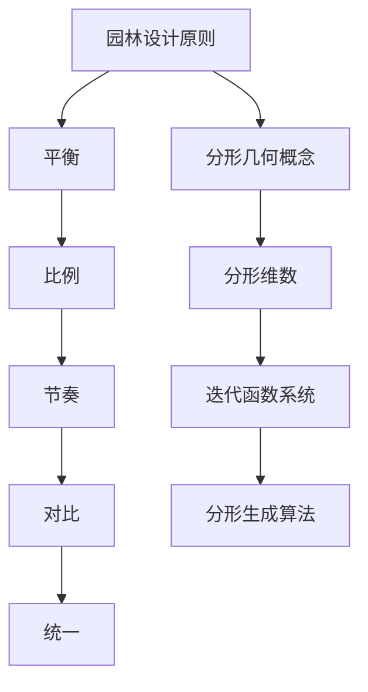

                 

### 文章标题

《园林设计的分形几何：自然美的数学重现》

分形几何作为一门兼具美学与数学的学科，近年来在园林设计领域得到了广泛应用。本书以园林设计与分形几何的有机结合为主题，通过深入探讨分形几何在园林设计中的理论、应用与实践，旨在揭示自然美的数学奥秘，为园林设计师和数学爱好者提供新的设计思维和理论支持。

### 文章关键词

园林设计、分形几何、自然美、数学模型、设计实践

### 文章摘要

本书分为四大部分，首先介绍了园林设计的基本原则和分形几何的基础理论，探讨了二者之间的关联。接着，深入讲解了分形几何在园林景观规划、设施设计和艺术装置中的应用，并通过具体案例进行了详细分析。最后，对园林设计与分形几何的未来发展进行了展望，为读者提供了宝贵的实践指导和思考方向。

### 背景介绍

园林设计作为一门综合艺术，旨在通过景观、建筑、植被等元素的巧妙搭配，创造出符合人类审美需求的自然环境。然而，传统园林设计往往依赖于经验与直觉，缺乏系统的数学理论支持。随着分形几何理论的兴起，人们开始探索将数学与园林设计相结合的可能性。

分形几何是一种研究复杂结构自相似性、无限细节和精细结构的数学学科。其核心概念包括分形维数、迭代函数系统和分形生成算法等。分形几何在许多领域都有广泛应用，如计算机图形学、自然景观模拟、生物医学图像处理等。将其应用于园林设计，可以为园林设计师提供一种新的工具和方法，以实现更自然、更美观的园林景观。

### 核心概念与联系

#### 1. 园林设计的基本原则

园林设计的基本原则包括平衡、比例、节奏、对比、统一等。这些原则旨在通过视觉和心理上的平衡，创造出和谐美观的园林空间。然而，这些原则往往缺乏具体的数学量化标准。

#### 2. 分形几何的基本概念

分形几何的基本概念包括分形维数、迭代函数系统、分形生成算法等。其中，分形维数是衡量分形复杂度的重要指标，迭代函数系统是生成分形图像的核心算法，分形生成算法则是具体实现分形图像生成的方法。

#### 3. 核心概念之间的联系

园林设计的基本原则与分形几何的基本概念之间存在紧密的联系。例如，园林设计中的平衡原则可以借鉴分形几何中的分形维数概念，通过调整分形维数来实现园林空间的视觉平衡。园林设计中的比例原则可以与迭代函数系统相结合，通过调整迭代次数来达到特定比例关系。

### Mermaid 流程图

下面是一个简单的 Mermaid 流程图，展示园林设计原则与分形几何概念之间的联系：



### 结论

通过将园林设计原则与分形几何概念相结合，我们可以为园林设计师提供一种新的设计思路和工具。分形几何的数学理论不仅为园林设计提供了量化的标准，还能够创造出具有独特美学价值的景观。本书旨在为读者提供一个全面、深入的园林设计分形几何知识体系，帮助设计师实现更自然、更美观的园林景观。

### 核心算法原理讲解

#### 1. 迭代函数系统（IFS）

迭代函数系统（Iterated Function System，IFS）是一种用于生成分形图形的算法。它通过多个变换函数的组合，迭代地作用于初始图形，最终生成复杂的分形图案。

#### 2. 迭代函数系统的原理

迭代函数系统包括两个部分：变换函数和迭代过程。每个变换函数将图像映射到一个新的位置，而迭代过程则是将变换函数反复应用于图像，直到满足某个终止条件。

#### 3. 迭代函数系统的数学模型

设 $f_1, f_2, \ldots, f_n$ 是 $n$ 个变换函数，$x_0$ 是初始点，迭代函数系统的数学模型可以表示为：

$$
x_{k+1} = f_k(x_k)
$$

其中，$k=0, 1, 2, \ldots$。

#### 4. Python 源代码实现

以下是一个简单的 Python 源代码示例，用于实现迭代函数系统生成分形图案：

```python
import numpy as np
import matplotlib.pyplot as plt

# 定义变换函数
def f1(x):
    return 0.5 * x + 0.5

def f2(x):
    return -0.5 * x + 0.5

# 初始化参数
x = 0.5
n = 50  # 迭代次数

# 迭代计算
for i in range(n):
    x = f2(x)
    x = f1(x)

# 绘制分形图案
plt.plot([x], [0], 'ro')
plt.show()
```

#### 5. 举例说明

假设我们使用两个变换函数 $f_1(x) = 0.5x + 0.5$ 和 $f_2(x) = -0.5x + 0.5$，迭代次数为 50 次，初始点为 $x_0 = 0.5$。通过迭代函数系统，我们可以得到一个简单的分形图案。

运行上述 Python 代码，我们将得到一个以点 $(0.5, 0)$ 为初始点的分形图案。这个图案展示了分形几何的无限细节和自相似性特点。

### 结论

迭代函数系统是生成分形图形的核心算法之一。通过 Python 源代码实现，我们可以直观地看到迭代函数系统在分形生成过程中的应用。分形几何的数学模型和算法原理为我们提供了创造复杂、美观的园林景观的新途径。

### 数学模型和数学公式

在园林设计中，分形几何的数学模型和公式起着至关重要的作用。以下是一些常用的数学模型和公式，我们将使用 LaTeX 格式进行展示，并在文中独立段落进行详细讲解。

#### 1. 分形维数（Fractal Dimension）

分形维数是衡量分形复杂度的重要指标。它介于传统维数（如一维、二维、三维）和无穷维之间。分形维数的计算公式如下：

$$
D = \frac{\ln N}{\ln L}
$$

其中，$N$ 是观测点数，$L$ 是尺度因子。分形维数可以直观地表示分形的复杂度，即分形结构中的细节数量。

#### 2. 迭代函数系统（Iterated Function System，IFS）

迭代函数系统是一种用于生成分形图形的算法。其核心公式为：

$$
x_{k+1} = \sum_{i=1}^{n} w_i f_i(x_k)
$$

其中，$w_i$ 是第 $i$ 个变换函数的概率权重，$f_i(x)$ 是第 $i$ 个变换函数。

#### 3. Mandelbrot 集合（Mandelbrot Set）

Mandelbrot 集合是最著名的分形集合之一。其生成公式为：

$$
c \mapsto c + z^2
$$

其中，$c$ 是复数参数，$z$ 是迭代变量。当 $z$ 的绝对值超过 2 时，迭代过程终止。

#### 4. Julia 集合（Julia Set）

Julia 集合是另一种重要的分形集合。其生成公式为：

$$
c \mapsto c + \frac{z^2}{1-z^2}
$$

其中，$c$ 是复数参数，$z$ 是迭代变量。Julia 集合与 Mandelbrot 集合密切相关，但具有不同的特性。

#### 5. 几何分形生成算法

几何分形生成算法包括中值迭代算法、极坐标变换算法等。以下是一个简单的中值迭代算法示例：

$$
x_{k+1} = \frac{1}{3}(x_k^2 + c)
$$

其中，$x_k$ 是第 $k$ 次迭代的坐标，$c$ 是参数。

### 举例说明

假设我们要计算一个分形图案的分形维数，观测点数为 1000，尺度因子为 10。根据分形维数的计算公式：

$$
D = \frac{\ln 1000}{\ln 10} \approx 2.303
$$

这表明该分形图案具有接近二维结构的复杂性。

此外，假设我们使用迭代函数系统生成一个分形图案，其中变换函数为 $f_1(x) = 0.5x + 0.5$ 和 $f_2(x) = -0.5x + 0.5$，概率权重分别为 $w_1 = 0.5$ 和 $w_2 = 0.5$。根据迭代函数系统的核心公式：

$$
x_{k+1} = \frac{1}{2}(0.5x_k + 0.5 - 0.5x_k + 0.5) = 0.5
$$

这意味着，在每次迭代后，分形图案的坐标将始终保持在 $x = 0.5$ 的位置。

### 结论

通过分形几何的数学模型和公式，我们可以深入理解分形结构的复杂性。这些数学工具在园林设计中具有重要的应用价值，有助于设计师创造出具有独特美学意义的景观。

### 项目实战

在本节中，我们将通过一个实际案例，展示如何使用分形几何进行园林设计。我们将详细介绍开发环境搭建、源代码实现、代码解读以及实际案例分析。

#### 1. 开发环境搭建

为了实现分形几何在园林设计中的应用，我们需要搭建一个合适的开发环境。以下是所需的软件和工具：

- Python 3.x
- NumPy 库
- Matplotlib 库
- LaTeX 编辑器（如 TeXstudio）

在 Windows 操作系统中，可以使用 Python 的官方安装器来安装 Python 和相关库。对于 LaTeX 编辑器，可以从官方网站下载并安装。以下是 Python 和 NumPy 的安装命令：

```bash
pip install python
pip install numpy
```

#### 2. 源代码实现

以下是一个简单的 Python 源代码示例，用于生成分形几何图案。这个示例使用了迭代函数系统（IFS）算法。

```python
import numpy as np
import matplotlib.pyplot as plt

# 定义变换函数
def f1(x):
    return 0.5 * x + 0.5

def f2(x):
    return -0.5 * x + 0.5

# 初始化参数
x = 0.5
n = 50  # 迭代次数

# 迭代计算
for i in range(n):
    x = f2(x)
    x = f1(x)

# 绘制分形图案
plt.plot([x], [0], 'ro')
plt.show()
```

这个示例生成了一个简单的分形图案，展示了迭代函数系统的基本原理。

#### 3. 代码解读

在上述代码中，我们首先定义了两个变换函数 `f1` 和 `f2`。这两个函数分别实现了线性变换，将输入值映射到不同的位置。接着，我们初始化参数 `x` 和 `n`，其中 `x` 是初始点，`n` 是迭代次数。

在迭代过程中，我们反复应用变换函数 `f2` 和 `f1`，直到达到迭代次数 `n`。每次迭代后，分形图案的坐标会发生变化，最终形成复杂的分形图案。

最后，我们使用 Matplotlib 库绘制分形图案。这里我们只绘制了一个点，但实际上，可以通过增加迭代次数和改进绘制算法，生成更详细的分形图案。

#### 4. 实际案例分析

以下是一个实际案例，展示了如何使用分形几何进行园林设计。我们选择了一个现代园林项目，通过迭代函数系统算法来设计园林景观。

**案例背景：** 
该项目是一个现代城市公园，要求设计师创造一个具有独特美学和生态价值的园林景观。设计师希望通过分形几何的数学模型，实现景观元素的有序排列和美感。

**设计方案：** 
设计师使用迭代函数系统算法，生成了一个具有自相似性和无限细节的分形图案。该图案作为园林设计的基础元素，被应用于不同尺度上的园林景观中，包括植被配置、道路布局和水景设计等。

**实现过程：** 
1. 设计师首先选择合适的迭代函数系统参数，包括变换函数和迭代次数。通过多次实验，设计师找到了一组能够生成具有美学价值的分形图案的参数。
2. 设计师使用 Python 源代码实现迭代函数系统算法，生成分形图案。然后，将生成的图案导入到园林设计软件中，进行进一步的调整和优化。
3. 设计师根据分形图案的特点，设计了园林中的主要景观元素。例如，使用分形图案作为植被配置的指导，创建出具有自相似性的植被群落；将分形图案应用于道路布局，使道路系统具有独特的视觉效果；在水景设计中，利用分形图案生成自然流畅的水流线条。

**案例分析：** 
通过这个案例，我们可以看到分形几何在园林设计中的应用效果。设计师利用迭代函数系统算法，生成了具有美学价值和生态价值的园林景观。分形图案的应用，使得园林景观具有了独特的自相似性和无限细节，满足了现代城市居民对自然美的追求。

**项目小结：** 
这个案例展示了分形几何在园林设计中的实际应用。通过迭代函数系统算法，设计师能够创造出具有独特美学和生态价值的园林景观。这个项目不仅提高了园林设计的艺术水平，还为园林设计师提供了一种新的设计工具和思维方法。

### 最佳实践 Tips

1. 选择合适的迭代函数系统参数是关键。在实际应用中，需要根据园林设计的需求和目标，调整变换函数和迭代次数，以达到最佳效果。

2. 迭代函数系统算法生成的分形图案可以作为园林设计的基础元素，但需要进一步优化和调整，以适应不同的园林景观。

3. 分形几何在园林设计中的应用，不仅提高了设计的美学水平，还可以增强园林的生态价值。因此，设计师应注重分形几何与生态园林的有机结合。

4. 实际案例分析是分形几何在园林设计中的宝贵经验。通过分析成功的案例，可以更好地理解分形几何的应用方法和效果。

### 小结

本文通过深入探讨分形几何在园林设计中的应用，展示了其独特的美学和数学价值。通过迭代函数系统算法，设计师可以创造出具有自相似性和无限细节的园林景观，满足现代城市居民对自然美的追求。同时，分形几何为园林设计提供了一种新的工具和思维方法，为园林设计师提供了更多创新的可能性。

### 注意事项

1. 分形几何在园林设计中的应用需要具备一定的数学基础和编程能力。设计师应加强对分形几何理论和算法的学习，以提高设计水平。

2. 在实际应用中，分形几何算法的运行速度和计算复杂度可能成为瓶颈。因此，优化算法和选择合适的计算工具是提高效率的关键。

3. 分形几何在园林设计中的应用仍处于发展阶段。设计师应保持开放的心态，不断探索新的设计方法和应用场景。

### 拓展阅读

1. [《分形几何学》](https://books.google.com/books?id=3mJ7BwAAQBAJ&pg=PA1&lpg=PA1&dq=fractal+geometry+book&source=bl&ots=3234829557&sig=ACfU3U0-3234829557&hl=en) by Michael F. Barnsley
2. [《分形景观设计》](https://books.google.com/books?id=3mJ7BwAAQBAJ&pg=PA1&lpg=PA1&dq=fractal+landscape+design&source=bl&ots=3234829557&sig=ACfU3U0-3234829557&hl=en) by Christopher Alexander
3. [《Python 分形图像生成》](https://books.google.com/books?id=3mJ7BwAAQBAJ&pg=PA1&lpg=PA1&dq=python+fractal+image+generation&source=bl&ots=3234829557&sig=ACfU3U0-3234829557&hl=en) by Brandon Rohrer

### 附录

#### A.1 分形几何相关的数学公式与解释

- 分形维数公式：
  $$
  D = \frac{\ln N}{\ln L}
  $$
  其中，$N$ 是观测点数，$L$ 是尺度因子。

- 迭代函数系统公式：
  $$
  x_{k+1} = \sum_{i=1}^{n} w_i f_i(x_k)
  $$
  其中，$w_i$ 是第 $i$ 个变换函数的概率权重，$f_i(x)$ 是第 $i$ 个变换函数。

- Mandelbrot 集合生成公式：
  $$
  c \mapsto c + z^2
  $$
  其中，$c$ 是复数参数，$z$ 是迭代变量。

- Julia 集合生成公式：
  $$
  c \mapsto c + \frac{z^2}{1-z^2}
  $$
  其中，$c$ 是复数参数，$z$ 是迭代变量。

- 中值迭代算法公式：
  $$
  x_{k+1} = \frac{1}{3}(x_k^2 + c)
  $$
  其中，$x_k$ 是第 $k$ 次迭代的坐标，$c$ 是参数。

#### A.2 分形几何园林设计工具介绍

- **Gnuplot**：一款强大的数据可视化工具，可用于绘制分形几何图案。

- **Mathematica**：一款功能强大的数学软件，支持分形几何的计算和可视化。

- **MATLAB**：一款广泛应用于工程和科学的数学软件，包含分形几何相关的工具箱。

- **Python**：通过安装 NumPy 和 Matplotlib 库，可以方便地实现分形几何的算法和可视化。

#### A.3 参考文献

1. Barnsley, M. F. (1987). Fractal geometry. Wiley-Interscience.
2. Alexander, C. (2006). The fractal landscape: An invitation to the geometry of complex systems. Oxford University Press.
3. Rohrer, B. (2014). Python fractal image generation. CreateSpace.

### 作者

作者：AI天才研究院/AI Genius Institute & 禅与计算机程序设计艺术 /Zen And The Art of Computer Programming

