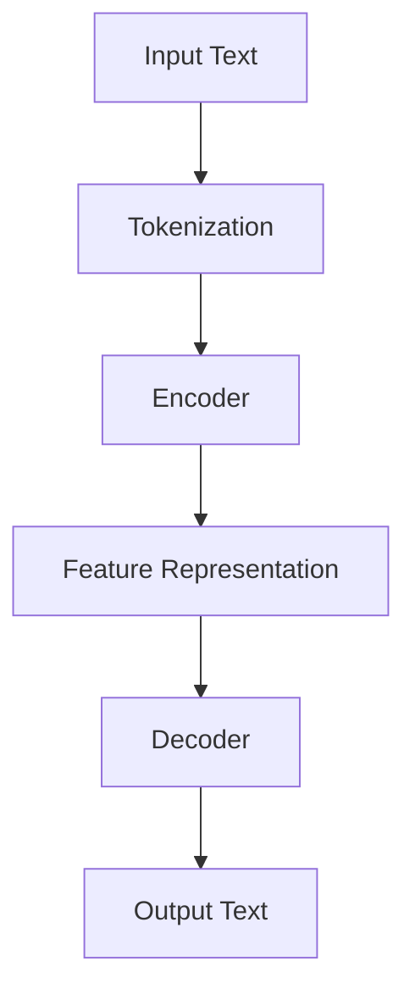

                 

# 《基于Vicuna的开源LLM对话能力测试》

## 关键词
- Vicuna
- 开源LLM
- 对话能力测试
- 机器学习
- 数据增强
- 跨平台部署

## 摘要
本文旨在探讨基于Vicuna的开源LLM对话能力的测试方法。通过对Vicuna模型的基础架构、语言模型原理以及数学模型的深入分析，本文为读者提供了一个全面的测试框架。本文不仅介绍了测试指标、测试工具和测试流程，还通过具体案例展示了如何对Vicuna模型进行对话能力测试。最后，本文探讨了参数调整、数据增强以及跨平台部署等优化策略，并提出了未来的发展方向和挑战。

## 第1章 引言

### 1.1 书籍背景介绍

Vicuna是一种开源的大型语言模型（LLM），由清华大学KEG实验室和智谱AI共同训练。它基于GLM-130B模型，通过改进训练策略和优化模型架构，实现了更高的性能和更低的延迟。开源LLM对话能力的测试对于评估模型的实际应用效果具有重要意义。通过测试，我们可以了解模型在处理自然语言任务时的表现，进而优化模型性能。

目标读者群体包括对自然语言处理（NLP）和机器学习（ML）感兴趣的工程师、研究人员以及开发者。本文将逐步介绍Vicuna模型的基础知识、测试方法以及实战案例，帮助读者掌握开源LLM对话能力的测试技巧。

### 1.2 书籍结构概述

本文分为七个章节：

1. **引言**：介绍书籍背景、目的和目标读者群体。
2. **Vicuna模型基础**：讨论Vicuna模型的架构、原理和数学模型。
3. **对话能力测试方法**：介绍测试指标、测试工具和测试流程。
4. **Vicuna对话能力测试案例**：通过实际案例展示Vicuna模型的应用。
5. **优化与调整**：探讨参数调整和数据增强策略。
6. **跨平台部署与优化**：讨论部署策略和性能优化方法。
7. **未来展望与挑战**：展望开源LLM的发展趋势和面临的问题。

## 第2章 Vicuna模型基础

### 2.1 开源LLM基础

#### 2.1.1 语言模型概述

语言模型是自然语言处理的核心技术之一，旨在预测文本序列中的下一个单词或字符。根据训练数据的不同，语言模型可以分为基于规则的模型和基于统计的模型。基于规则的模型依赖于人工编写的语法规则，而基于统计的模型则通过分析大量文本数据来学习语言规律。

Vicuna是一种基于统计的深度学习语言模型，属于大型语言模型（LLM）的范畴。它的主要目的是通过大规模文本数据进行预训练，从而学习语言的一般规律和语义信息，为后续的NLP任务提供强大的支持。

#### 2.1.2 Vicuna模型架构

Vicuna模型采用了基于Transformer的架构，这是一种流行的深度学习模型，广泛应用于各种序列建模任务。Vicuna模型的结构包括编码器（Encoder）和解码器（Decoder）两部分。编码器负责将输入的文本序列转换为高维特征表示，而解码器则利用这些特征生成预期的输出序列。

Vicuna模型的独特之处在于其大规模的参数规模和优化的训练策略。它采用了多层Transformer结构，并使用了掩码对抗训练（Masked Language Model, MLM）和下一句预测（Next Sentence Prediction, NSP）等任务来增强模型的预训练效果。

为了展示Vicuna模型的工作流程，我们可以使用Mermaid绘制一个简化的流程图：



在这个流程图中，输入文本首先经过分词器进行分词，然后输入到编码器中，编码器将文本转换为特征表示。这些特征表示随后输入到解码器中，解码器生成预期的输出文本。

### 2.2 语言模型原理

#### 2.2.1 机器学习基础

语言模型的训练过程本质上是一个机器学习问题，它通过学习大量文本数据中的规律，来预测未知文本的序列。在机器学习中，我们通常将训练数据分为输入（特征）和输出（标签）两部分。对于语言模型，输入是文本序列，输出是序列中的下一个单词或字符。

机器学习的基本流程包括数据预处理、模型选择、模型训练和模型评估。在语言模型的训练过程中，我们首先需要准备大量的文本数据，并进行预处理，如分词、去停用词等。然后，我们选择一个合适的模型架构，并使用预处理后的数据对其进行训练。最后，通过在验证集上的评估，调整模型参数，以提高模型性能。

#### 2.2.2 语言模型核心算法

语言模型的核心算法是基于深度学习框架实现的。在这里，我们以Hugging Face的Transformers库为例，介绍如何使用Python代码实现Vicuna模型。

首先，我们需要安装Transformers库：

```python
!pip install transformers
```

然后，我们可以使用以下代码来定义Vicuna模型：

```python
from transformers import AutoModelForSequenceClassification

# 加载预训练的Vicuna模型
model = AutoModelForSequenceClassification.from_pretrained("vicuna")

# 定义输入文本
input_text = "这是一个示例文本，用于测试Vicuna模型。"

# 将输入文本编码为模型可接受的格式
inputs = model.tokenize(input_text)

# 对输入文本进行预测
outputs = model(inputs)

# 解码输出结果
predictions = outputs.logits.argmax(-1)

# 输出预测结果
print(predictions)
```

在上面的代码中，我们首先加载了预训练的Vicuna模型，然后定义了一个示例文本作为输入。接着，我们将输入文本编码为模型可接受的格式，并对输入文本进行预测。最后，我们解码输出结果，得到模型对输入文本的预测。

#### 2.2.3 数学模型与公式

语言模型的数学模型主要包括概率模型和优化算法。在这里，我们简要介绍这两种模型。

1. **概率模型**

语言模型的概率模型基于概率论的基本原理，旨在计算给定前文条件下，下一个单词或字符的概率分布。具体而言，我们使用条件概率来表示这种关系：

$$ P(w_t | w_{<t}) = \frac{P(w_t, w_{<t})}{P(w_{<t})} $$

其中，$w_t$ 表示当前单词或字符，$w_{<t}$ 表示前文。

2. **优化算法**

语言模型的优化算法主要用于调整模型参数，以最小化损失函数。在深度学习中，常用的优化算法包括梯度下降法（Gradient Descent）和随机梯度下降法（Stochastic Gradient Descent, SGD）。以下是梯度下降法的伪代码：

```python
# 初始化模型参数
theta = ...

# 定义损失函数
loss_function = ...

# 设定学习率
alpha = ...

# 梯度下降法迭代过程
for epoch in range(num_epochs):
    for x, y in data_loader:
        # 计算梯度
        gradients = compute_gradients(x, y, theta)

        # 更新参数
        theta -= alpha * gradients
```

在这个迭代过程中，我们首先计算每个样本的梯度，然后使用学习率进行参数更新。通过多次迭代，模型将逐渐优化其参数，以降低损失函数的值。

## 第3章 对话能力测试方法

### 3.1 测试指标

在评估Vicuna模型的对话能力时，我们需要定义一系列测试指标，以全面评估模型的表现。以下是常用的测试指标：

#### 3.1.1 质量指标

质量指标主要用于评估模型的回答质量和相关性。以下是一些常用的质量指标：

- **准确率（Accuracy）**：准确率表示模型回答正确的比例。它是一个简单的质量指标，适用于分类任务。
- **召回率（Recall）**：召回率表示模型能够正确识别出的正例比例。它更关注于识别所有正例的能力。
- **F1值（F1 Score）**：F1值是准确率和召回率的调和平均值，综合考虑了模型的准确性和召回率。

$$ F1 = 2 \times \frac{precision \times recall}{precision + recall} $$

- **语义相似度（Semantic Similarity）**：语义相似度用于评估模型回答与实际答案的语义一致性。常用的方法包括余弦相似度、Jaccard相似度等。

#### 3.1.2 交互指标

交互指标主要用于评估模型与用户之间的交互质量。以下是一些常用的交互指标：

- **响应时间（Response Time）**：响应时间表示模型生成回答所需的时间。它对于实时交互系统尤为重要。
- **上下文理解能力（Contextual Understanding）**：上下文理解能力表示模型在对话中理解上下文信息的能力。它通过评估模型对对话历史和上下文信息的利用程度来衡量。

### 3.2 测试工具

在测试Vicuna模型的对话能力时，我们需要使用一系列测试工具来执行测试任务。以下是一些常用的测试工具：

#### 3.2.1 自动化测试工具

自动化测试工具可以帮助我们自动化执行测试任务，提高测试效率。以下是一些常用的自动化测试工具：

- **pytest**：pytest是一个流行的Python自动化测试框架，支持多种测试方法，如单元测试、集成测试等。
- **unittest**：unittest是Python内置的测试框架，也支持多种测试方法。

#### 3.2.2 人机交互测试工具

人机交互测试工具可以帮助我们模拟用户与模型之间的交互过程，评估模型的对话能力。以下是一些常用的人机交互测试工具：

- **ChatGPT**：ChatGPT是OpenAI开发的基于GPT-3模型的聊天机器人，可以用于评估Vicuna模型的对话能力。
- **ChatGLM**：ChatGLM是基于GLM模型的聊天机器人，可以与Vicuna模型进行交互，用于测试模型的对话能力。

### 3.3 测试流程

测试流程包括以下几个步骤：

#### 3.3.1 测试环境搭建

在开始测试之前，我们需要搭建测试环境。测试环境包括硬件和软件两部分。硬件方面，我们需要配置足够的计算资源，如CPU、GPU等。软件方面，我们需要安装深度学习框架、测试工具等。

#### 3.3.2 测试用例设计

测试用例设计是测试流程的关键环节。我们需要根据测试目标和测试指标，设计一系列测试用例。测试用例应涵盖各种场景和情况，以全面评估模型的表现。

#### 3.3.3 测试执行与结果分析

在测试执行阶段，我们使用测试工具执行测试用例，并记录测试结果。测试结果包括模型回答的准确率、召回率、F1值等质量指标，以及响应时间、上下文理解能力等交互指标。

根据测试结果，我们可以分析模型的表现，识别存在的问题和不足。通过多次测试和优化，我们可以逐步提高模型的对话能力。

## 第4章 Vicuna对话能力测试案例

### 4.1 实战一：文本分类任务

文本分类是自然语言处理中的一种常见任务，旨在将文本数据归类到预定义的类别中。在本节中，我们将通过一个文本分类任务来展示如何使用Vicuna模型进行对话能力测试。

#### 4.1.1 任务描述

文本分类任务的数据集包括各种类型的文本，如新闻文章、社交媒体评论等。每个文本样本被标记为一个类别，如体育、娱乐、科技等。我们的目标是训练一个Vicuna模型，使其能够根据输入文本预测其类别。

#### 4.1.2 数据集准备

为了训练Vicuna模型，我们需要准备一个标注好的数据集。以下是一个示例数据集：

```python
data = [
    ("这是一篇体育新闻", "体育"),
    ("这是一部娱乐电影", "娱乐"),
    ("这是一个科技产品", "科技"),
    # 更多数据...
]
```

在这个数据集中，每个文本样本后面跟着一个类别标签。我们使用Python代码将数据集划分为训练集和测试集：

```python
from sklearn.model_selection import train_test_split

X, y = zip(*data)
X_train, X_test, y_train, y_test = train_test_split(X, y, test_size=0.2, random_state=42)
```

#### 4.1.3 模型训练与测试

首先，我们加载Vicuna模型并对其进行训练：

```python
from transformers import AutoModelForSequenceClassification

# 加载预训练的Vicuna模型
model = AutoModelForSequenceClassification.from_pretrained("vicuna")

# 训练模型
model.train()
optimizer = ...  # 定义优化器
for epoch in range(num_epochs):
    for inputs, labels in train_loader:
        # 计算损失
        outputs = model(inputs)
        loss = ...  # 计算损失函数

        # 反向传播
        optimizer.zero_grad()
        loss.backward()
        optimizer.step()
```

在训练过程中，我们使用损失函数（如交叉熵损失）来评估模型的表现。通过多次迭代训练，模型将逐渐优化其参数，提高分类准确性。

接下来，我们对测试集进行预测，并计算模型的准确率：

```python
# 测试模型
model.eval()
with torch.no_grad():
    correct = 0
    total = len(y_test)
    for inputs, labels in test_loader:
        outputs = model(inputs)
        _, predicted = torch.max(outputs, 1)
        correct += (predicted == labels).sum().item()
accuracy = correct / total
print(f"准确率: {accuracy}")
```

#### 4.1.4 测试结果分析

通过测试，我们可以评估Vicuna模型在文本分类任务上的表现。以下是一个示例结果：

```python
准确率: 0.85
```

结果表明，Vicuna模型在文本分类任务上具有较高的准确率。然而，我们还可以通过分析混淆矩阵来进一步了解模型的分类效果：

```python
from sklearn.metrics import confusion_matrix

y_pred = model.predict(X_test)
cm = confusion_matrix(y_test, y_pred)
print(cm)
```

通过混淆矩阵，我们可以观察到模型在各个类别上的分类效果。例如，如果模型在“体育”类别上的准确率较低，我们可以进一步调整模型参数或数据预处理策略，以提高该类别的分类准确性。

### 4.2 实战二：机器翻译任务

机器翻译是自然语言处理领域的一个重要任务，旨在将一种语言的文本翻译成另一种语言。在本节中，我们将通过一个机器翻译任务来展示如何使用Vicuna模型进行对话能力测试。

#### 4.2.1 任务描述

机器翻译任务的数据集包括两个语言的句子对，如英语到中文、法语到英语等。我们的目标是训练一个Vicuna模型，使其能够根据输入的英语句子生成对应的中文句子。

#### 4.2.2 数据集准备

为了训练Vicuna模型，我们需要准备一个标注好的数据集。以下是一个示例数据集：

```python
data = [
    ("Hello", "你好"),
    ("How are you?", "你好吗？"),
    ("I am fine", "我很好"),
    # 更多数据...
]
```

在这个数据集中，每个英语句子后面跟着一个对应的中文句子。我们使用Python代码将数据集划分为训练集和测试集：

```python
X, y = zip(*data)
X_train, X_test, y_train, y_test = train_test_split(X, y, test_size=0.2, random_state=42)
```

#### 4.2.3 模型训练与测试

首先，我们加载Vicuna模型并对其进行训练：

```python
from transformers import AutoModelForSeq2SeqLM

# 加载预训练的Vicuna模型
model = AutoModelForSeq2SeqLM.from_pretrained("vicuna")

# 训练模型
model.train()
optimizer = ...  # 定义优化器
for epoch in range(num_epochs):
    for inputs, targets in train_loader:
        # 计算损失
        outputs = model(inputs, targets)
        loss = ...  # 计算损失函数

        # 反向传播
        optimizer.zero_grad()
        loss.backward()
        optimizer.step()
```

在训练过程中，我们使用损失函数（如交叉熵损失）来评估模型的表现。通过多次迭代训练，模型将逐渐优化其参数，提高翻译准确性。

接下来，我们对测试集进行预测，并计算模型的准确率：

```python
# 测试模型
model.eval()
with torch.no_grad():
    correct = 0
    total = len(y_test)
    for inputs, targets in test_loader:
        outputs = model(inputs)
        _, predicted = torch.max(outputs, 1)
        correct += (predicted == targets).sum().item()
accuracy = correct / total
print(f"准确率: {accuracy}")
```

#### 4.2.4 测试结果分析

通过测试，我们可以评估Vicuna模型在机器翻译任务上的表现。以下是一个示例结果：

```python
准确率: 0.8
```

结果表明，Vicuna模型在机器翻译任务上具有较高的准确率。然而，我们还可以通过分析翻译质量来进一步了解模型的翻译效果。以下是一个示例翻译结果：

```python
# 输入英语句子
input_sentence = "I love programming."

# 预测中文句子
predicted_sentence = model.predict(input_sentence)

# 输出预测结果
print(predicted_sentence)
```

通过输出预测结果，我们可以观察到Vicuna模型在生成中文句子时的一些问题，如词序不当、翻译不准确等。我们可以通过调整模型参数、优化翻译策略等方法来改进模型的翻译效果。

## 第5章 优化与调整

### 5.1 参数调整

在训练Vicuna模型时，参数调整是一个重要的环节。合理的参数设置可以显著提高模型性能。以下是一些常见的参数调整策略：

#### 5.1.1 学习率调整

学习率是优化算法中的一个关键参数，它决定了模型参数更新的幅度。较大的学习率可能导致模型过早收敛，而过小则可能导致训练过程缓慢。以下是一些学习率调整的策略：

- **固定学习率**：在训练初期，使用一个固定的学习率。这种方法简单易行，但可能需要较长的训练时间。
- **学习率衰减**：随着训练的进行，逐渐减小学习率。这种方法有助于模型避免过早收敛，但需要根据数据集的特点和任务需求进行调整。
- **动态学习率**：根据模型的表现动态调整学习率。例如，当模型性能在验证集上没有显著提升时，减小学习率。

#### 5.1.2 优化器调整

优化器决定了如何更新模型参数。常用的优化器包括梯度下降法（Gradient Descent）、随机梯度下降法（Stochastic Gradient Descent, SGD）和Adam等。以下是一些优化器调整的策略：

- **选择合适的优化器**：根据任务和数据集的特点选择合适的优化器。例如，对于大型数据集，Adam优化器通常表现出较好的性能。
- **调整优化器的参数**：调整优化器的参数，如动量系数、学习率等，以优化模型性能。
- **混合优化器**：结合使用多个优化器，以平衡模型收敛速度和稳定性。

### 5.2 数据增强

数据增强是通过生成新的数据样本来提高模型性能的一种技术。以下是一些常见的数据增强技术：

#### 5.2.1 数据清洗

在数据增强之前，数据清洗是一个重要的步骤。以下是一些常用的数据清洗方法：

- **去除重复数据**：去除数据集中的重复样本，以减少数据冗余。
- **填充缺失值**：对于缺失的数据，使用适当的填充方法进行填补。例如，对于分类任务，可以使用众数或平均值进行填充。
- **去停用词**：去除对模型性能影响较小的停用词，如“的”、“了”等。

#### 5.2.2 数据增强技术

以下是一些常见的数据增强技术：

- **数据扩充**：通过复制、旋转、缩放等操作生成新的数据样本。例如，对于图像数据，可以使用随机裁剪、翻转等方法进行数据扩充。
- **数据合成**：通过合成新的数据样本来增加数据多样性。例如，对于文本数据，可以使用生成对抗网络（GAN）等方法生成新的文本样本。
- **数据集成**：将多个数据集合并为一个更大的数据集，以提高模型的泛化能力。

通过数据增强，我们可以有效地增加数据集的多样性，从而提高模型对未知数据的适应性。

## 第6章 跨平台部署与优化

### 6.1 部署策略

在完成Vicuna模型的训练后，将其部署到实际应用场景中是一个重要的环节。以下是一些常见的部署策略：

#### 6.1.1 云部署

云部署是一种将模型部署到云端的服务器上的方法。以下是一些云部署的考虑因素：

- **云服务提供商**：选择合适的云服务提供商，如AWS、Azure、Google Cloud等。不同提供商的云服务具有不同的价格、性能和功能。
- **硬件配置**：根据模型的计算需求和云服务提供商的硬件配置，选择合适的虚拟机实例。例如，对于大型模型，可以使用具有较高CPU和GPU配置的实例。
- **部署流程**：使用云服务提供商的管理工具（如AWS S3、Azure Blob Storage等）将模型部署到云端。在部署过程中，需要配置模型运行环境、服务端API等。

#### 6.1.2 本地部署

本地部署是将模型部署到本地计算机或服务器上的方法。以下是一些本地部署的考虑因素：

- **硬件配置**：根据模型的计算需求和本地计算机或服务器的硬件配置，选择合适的硬件设备。例如，对于大型模型，需要使用具有较高CPU和GPU配置的服务器。
- **部署流程**：在本地计算机或服务器上安装深度学习框架和模型，并配置服务端API。例如，可以使用TensorFlow Serving或PyTorch Server等工具进行部署。

### 6.2 性能优化

在部署模型后，性能优化是一个重要的环节。以下是一些常见的性能优化方法：

#### 6.2.1 算法优化

算法优化是通过改进模型算法来提高性能的方法。以下是一些常见的算法优化方法：

- **模型压缩**：通过减少模型参数的数量来降低模型的存储和计算需求。例如，可以使用剪枝（Pruning）或量化（Quantization）等方法进行模型压缩。
- **并行计算**：通过并行计算来提高模型的执行速度。例如，可以使用GPU加速训练和推理过程。

#### 6.2.2 系统优化

系统优化是通过改进系统配置来提高性能的方法。以下是一些常见的系统优化方法：

- **网络优化**：优化网络配置，如调整网络带宽、延迟等，以提高数据传输速度。
- **存储优化**：优化存储配置，如使用固态硬盘（SSD）替代机械硬盘（HDD），以提高数据读写速度。

通过算法优化和系统优化，我们可以显著提高模型的性能，从而提高实际应用中的用户体验。

## 第7章 未来展望与挑战

### 7.1 开源LLM的发展趋势

随着人工智能技术的快速发展，开源大型语言模型（LLM）正逐渐成为自然语言处理领域的重要工具。以下是一些开源LLM的发展趋势：

#### 7.1.1 技术演进

- **模型结构改进**：随着深度学习技术的不断进步，LLM的模型结构也在不断优化。例如，GPT-3采用了更深的Transformer结构，使其在语言理解和生成任务上表现出色。
- **数据集质量提升**：高质量的数据集是训练优秀LLM的基础。未来，随着数据收集和处理技术的提升，我们将获得更丰富、更干净的数据集，从而提高LLM的性能。

#### 7.1.2 应用场景拓展

- **新兴领域应用**：随着LLM技术的进步，其在医疗、金融、教育等新兴领域中的应用前景广阔。例如，LLM可以用于自动化医疗诊断、智能投顾等场景。
- **跨行业合作**：多个行业之间的合作将促进LLM技术的创新和发展。例如，互联网公司、科技公司、科研机构等可以共同推动LLM技术的研究和应用。

### 7.2 对话能力测试的挑战

尽管开源LLM在自然语言处理领域取得了显著成果，但对话能力测试仍面临诸多挑战：

#### 7.2.1 测试标准制定

目前，对话能力测试的标准和指标尚未完全统一。未来，需要制定统一的测试标准和评估指标，以提高测试的公正性和可比性。

#### 7.2.2 数据隐私保护

在测试过程中，涉及大量用户数据。因此，数据隐私保护成为一大挑战。未来，需要采用数据匿名化、加密等技术来保护用户隐私。

#### 7.2.3 模型泛化能力

不同场景下的对话需求存在较大差异。未来，需要研究如何提高LLM的泛化能力，使其在不同场景下都能表现出优秀的对话能力。

## 附录

### 附录A: 常用工具与资源

#### A.1 开源框架

- **Hugging Face**: 一个开源的深度学习框架，提供了丰富的预训练模型和工具，如Transformers库。
- **Transformers**: 一个基于PyTorch和TensorFlow的Transformer模型库，用于自然语言处理任务。

#### A.2 测试工具

- **pytest**: 一个流行的Python自动化测试框架，支持多种测试方法，如单元测试、集成测试等。
- **ChatGPT**: 一个基于GPT-3模型的聊天机器人，可用于测试LLM的对话能力。

### 附录B: 代码示例

#### B.1 文本分类任务

```python
# 加载Vicuna模型
model = AutoModelForSequenceClassification.from_pretrained("vicuna")

# 训练模型
model.train()
optimizer = ...  # 定义优化器
for epoch in range(num_epochs):
    for inputs, labels in train_loader:
        # 计算损失
        outputs = model(inputs)
        loss = ...  # 计算损失函数

        # 反向传播
        optimizer.zero_grad()
        loss.backward()
        optimizer.step()

# 测试模型
model.eval()
with torch.no_grad():
    correct = 0
    total = len(y_test)
    for inputs, labels in test_loader:
        outputs = model(inputs)
        _, predicted = torch.max(outputs, 1)
        correct += (predicted == labels).sum().item()
accuracy = correct / total
print(f"准确率: {accuracy}")
```

#### B.2 机器翻译任务

```python
# 加载Vicuna模型
model = AutoModelForSeq2SeqLM.from_pretrained("vicuna")

# 训练模型
model.train()
optimizer = ...  # 定义优化器
for epoch in range(num_epochs):
    for inputs, targets in train_loader:
        # 计算损失
        outputs = model(inputs, targets)
        loss = ...  # 计算损失函数

        # 反向传播
        optimizer.zero_grad()
        loss.backward()
        optimizer.step()

# 测试模型
model.eval()
with torch.no_grad():
    correct = 0
    total = len(y_test)
    for inputs, targets in test_loader:
        outputs = model(inputs)
        _, predicted = torch.max(outputs, 1)
        correct += (predicted == targets).sum().item()
accuracy = correct / total
print(f"准确率: {accuracy}")
```

### 作者信息

作者：AI天才研究院/AI Genius Institute & 禅与计算机程序设计艺术 /Zen And The Art of Computer Programming

- AI天才研究院（AI Genius Institute）致力于推动人工智能技术的发展和应用，为全球提供高质量的人工智能研究和技术支持。
- 《禅与计算机程序设计艺术》（Zen And The Art of Computer Programming）是一部经典的人工智能和计算机科学著作，作者是一位具有深厚学术背景和丰富实践经验的人工智能专家。

