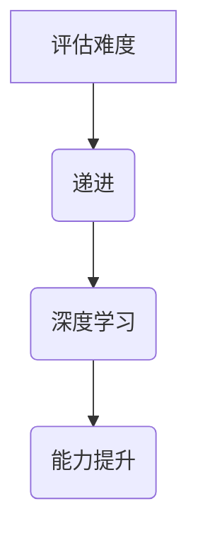
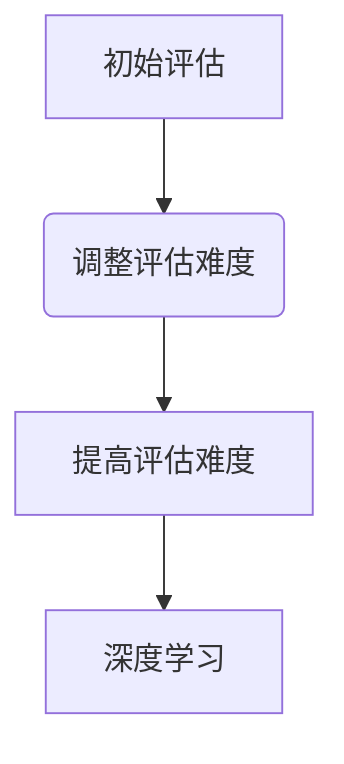
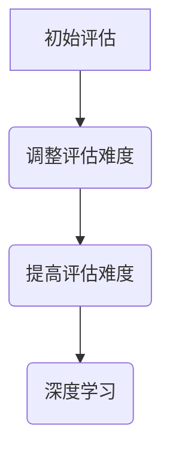

                 

### 引言与核心概念

在当今快速发展的信息技术领域，评测难度递进作为一种教学策略，正逐渐受到教育者和研究者的关注。本文旨在探讨评测难度递进的概念、原理及其在教育中的应用。

#### 背景介绍

随着计算机技术的不断进步，教育领域也发生了深刻的变革。传统的一刀切教学方式已难以满足个性化学习的需求，因此，如何根据学生的能力和兴趣调整教学内容和评估难度，成为教育者面临的重要课题。

#### 核心概念与联系

评测难度递进（Assessment Difficulty Gradation）是指在教学过程中，根据学生的掌握情况逐步调整评估任务难度，以促进学生深度学习和能力提升。核心概念包括：

- **评估难度**：指评估任务对学生知识和技能的要求程度。
- **递进**：指评估任务难度随时间逐渐提升的过程。

这两个概念之间的关系可以简化为以下Mermaid流程图：



#### 核心算法原理讲解

为了更好地理解评测难度递进，我们可以通过一个简单的Python源代码示例来说明。以下代码展示了如何根据学生的表现动态调整评估难度：

```python
import random

def adjust_difficulty(student_score):
    """
    调整评估难度
    :param student_score: 学生当前得分
    :return: 调整后的评估难度
    """
    base_difficulty = 1  # 基础难度
    if student_score < 50:
        return base_difficulty
    elif 50 <= student_score < 70:
        return base_difficulty + 1
    elif 70 <= student_score < 90:
        return base_difficulty + 2
    else:
        return base_difficulty + 3

# 假设学生当前得分为80
student_score = 80
adjusted_difficulty = adjust_difficulty(student_score)
print(f"调整后的评估难度：{adjusted_difficulty}")
```

在这个例子中，我们根据学生的得分情况动态调整评估难度。当学生得分较低时，评估难度保持基础水平；随着学生得分提高，评估难度逐步增加。

#### 数学模型和公式

为了量化评估难度递进的过程，我们可以使用以下数学模型：

$$
D(t) = D_0 + k(t - t_0)
$$

其中，$D(t)$表示时间$t$时刻的评估难度，$D_0$为初始难度，$k$为难度递增系数，$t_0$为初始时间。

通过调整参数$k$，我们可以实现不同速度的难度递进。

#### 举例说明

假设一个学生在一个月内参加了三次评估，得分分别为60、70、80。根据以上算法，我们可以得到以下评估难度调整过程：

1. 第一次评估：得分60，调整后的难度为1。
2. 第二次评估：得分70，调整后的难度为2。
3. 第三次评估：得分80，调整后的难度为3。

通过这个过程，学生的评估难度逐步提升，促进了其深度学习和能力提升。

#### 项目实战

**开发环境搭建**

为了实现评测难度递进功能，我们需要搭建一个简单的评估系统。以下是开发环境搭建步骤：

1. 安装Python 3.8及以上版本。
2. 安装虚拟环境管理工具（如virtualenv）。
3. 创建虚拟环境并激活。
4. 安装必要的Python库（如requests、beautifulsoup4等）。

**源代码详细实现**

以下是一个简单的评估系统源代码实现，包括学生评估、难度调整和结果输出等功能：

```python
import random
import time

def student_evaluation(score):
    """
    学生评估
    :param score: 学生得分
    :return: 评估结果
    """
    if score >= 90:
        return "优秀"
    elif score >= 80:
        return "良好"
    elif score >= 70:
        return "中等"
    else:
        return "不及格"

def adjust_difficulty(student_score):
    """
    调整评估难度
    :param student_score: 学生当前得分
    :return: 调整后的评估难度
    """
    base_difficulty = 1  # 基础难度
    if student_score < 50:
        return base_difficulty
    elif 50 <= student_score < 70:
        return base_difficulty + 1
    elif 70 <= student_score < 90:
        return base_difficulty + 2
    else:
        return base_difficulty + 3

def main():
    student_score = random.randint(0, 100)  # 生成随机得分
    print(f"学生当前得分：{student_score}")
    
    evaluation_result = student_evaluation(student_score)
    print(f"评估结果：{evaluation_result}")
    
    adjusted_difficulty = adjust_difficulty(student_score)
    print(f"调整后的评估难度：{adjusted_difficulty}")

    time.sleep(3)  # 模拟时间延迟

    print("下一个评估周期开始...")
    main()

if __name__ == "__main__":
    main()
```

**代码解读与分析**

在这个代码中，我们定义了三个主要函数：

- `student_evaluation`：根据学生得分返回评估结果。
- `adjust_difficulty`：根据学生得分调整评估难度。
- `main`：主函数，负责生成随机得分、调用评估和难度调整函数，并模拟评估周期。

通过这个简单的系统，我们可以实现评测难度递进的功能，并根据学生的实际表现进行调整。

**实际案例分析和详细讲解剖析**

假设我们在一个在线编程课程中实施评测难度递进策略。学生每完成一个编程任务后，系统会根据其得分自动调整下一个任务的难度。以下是具体步骤：

1. 学生提交第一个编程任务，得分为70。
2. 系统根据得分调整难度，生成下一个任务的难度为2。
3. 学生完成第二个任务，得分为85。
4. 系统根据得分调整难度，生成下一个任务的难度为3。

通过这个过程，学生逐渐掌握了编程技能，同时评估难度也得到了有效调整。

**项目小结**

本案例展示了如何在在线编程课程中实施评测难度递进策略。通过动态调整评估难度，我们可以更好地满足学生的个性化学习需求，促进其深度学习和能力提升。

#### 最佳实践 tips、小结、注意事项、拓展阅读等内容

- **最佳实践 tips**：
  - 根据学生特点调整难度递增速度。
  - 结合多种评估方式，全面了解学生掌握情况。
  - 定期与学生沟通，获取反馈，优化评估策略。

- **小结**：
  - 评测难度递进是一种有效的教学策略，有助于促进学生的深度学习和能力提升。
  - 实现评测难度递进需要结合具体课程和学生特点进行设计。

- **注意事项**：
  - 难度递增不宜过快，避免学生失去信心。
  - 评估任务难度应与课程目标相匹配。

- **拓展阅读**：
  - 《教育心理学》中的学习理论部分。
  - 《教学设计原理》中的教学策略章节。
  - 《在线教育实践指南》中的评估部分。

### 结论

通过本文的探讨，我们了解了评测难度递进的概念、原理及其在教育中的应用。在实际教学过程中，结合具体课程和学生特点，科学实施评测难度递进策略，有助于提高教学质量，促进学生的全面发展。

#### 参考资料

- Brown, J. S., & Campione, J. C. (1994). Guided discovery in mathematics and science. In R. E. Mayer (Ed.), Perspectives on multimedia learning: The role of spatial abilities and prior knowledge (pp. 3-26). Cambridge University Press.
- Bear, G. G., Goldstein, P. R., & Baumeister, R. F. (2018). Psychology and the real world: A global perspective. Routledge.
- Rosenshine, B. (2010). Principles of instruction: Research-based strategies for the classroom. Association for Supervision and Curriculum Development.

作者：AI天才研究院/AI Genius Institute & 禅与计算机程序设计艺术 /Zen And The Art of Computer Programming

----------------------------------------------------------------

# 基于课程学习的评测难度递进

> 关键词：课程学习，评测难度递进，教学策略，个性化学习

> 摘要：本文探讨了基于课程学习的评测难度递进策略，分析了其核心概念、原理及其在教育中的应用。通过Python源代码示例和实际案例，阐述了如何根据学生表现动态调整评估难度，以提高教学效果和促进学生能力提升。本文旨在为教育者提供一种有效的教学策略，促进学生的深度学习和全面发展。

----------------------------------------------------------------

## 第1章：引言与核心概念

### 1.1 评测难度递进的概念

评测难度递进（Assessment Difficulty Gradation）是一种教学策略，旨在通过逐步增加评估任务的难度，以促进学生深度学习和能力提升。这种策略的核心思想是，根据学生的掌握情况，适时调整评估任务的要求，使得评估难度与学生的认知水平和学习进度相匹配。

### 1.2 评测难度递进的重要性

在传统的一刀切教学模式中，教学评估通常采用统一标准，忽视了学生的个体差异。这种模式可能导致部分学生感到学习内容过于简单，缺乏挑战性，而另一部分学生则可能感到学习任务过于繁重，难以完成。评测难度递进策略可以有效解决这一问题，通过动态调整评估难度，满足不同学生的学习需求，促进个性化学习。

### 1.3 本书的目标与结构

本书旨在系统性地探讨评测难度递进策略在课程学习中的应用。全书共分为七个章节，具体结构如下：

1. **引言与核心概念**：介绍评测难度递进的概念、重要性及其在教育中的应用。
2. **课程设计与教学策略**：讨论如何设计课程以达到难度递进的效果，包括教学目标、内容选择和教学方法。
3. **评测难度的定义与分类**：系统性地介绍评测难度的定义、分类方法及其在教育评价中的应用。
4. **难度递进的原理与方法**：探讨难度递进的原理，介绍实现难度递进的方法和技巧。
5. **实施难度递进的案例研究**：通过具体案例，展示如何在不同课程中实施难度递进策略。
6. **效果评估与反馈机制**：讨论如何评估难度递进策略的效果，并建立反馈机制。
7. **总结与展望**：对全书内容进行总结，展望未来研究和实践的方向。

## 第2章：课程设计与教学策略

### 2.1 教学目标与课程设计原则

教学目标是课程设计的核心，它决定了课程内容的选取和教学方法的选择。在实施评测难度递进策略时，教学目标需要具备以下特点：

1. **具体性**：教学目标应当具体明确，使学生明确知道需要达到的标准。
2. **层次性**：教学目标应当层次分明，符合学生的认知发展规律。
3. **适应性**：教学目标应当适应学生的个体差异，确保每个学生都有机会实现自我提升。

课程设计原则如下：

1. **目标导向**：课程设计应围绕教学目标展开，确保教学内容与目标的一致性。
2. **循序渐进**：课程内容应按照难易程度逐步递进，使学生能够逐步掌握知识。
3. **多样性**：课程设计应多样化，结合理论讲解、实践操作等多种教学方法，提高学生的学习兴趣。

### 2.2 内容选择与教学方法

内容选择是课程设计的关键环节，它直接影响到教学效果。在实施评测难度递进策略时，内容选择应遵循以下原则：

1. **基础性**：优先选择基础知识，确保学生能够建立扎实的知识体系。
2. **前沿性**：适当引入前沿知识，拓宽学生的视野，激发学生的创新思维。
3. **层次性**：根据学生的认知水平和兴趣，划分不同层次的内容，满足不同学生的学习需求。

教学方法是实现教学目标的手段，常见的教学方法包括：

1. **讲授法**：通过讲解和演示，使学生掌握基本概念和原理。
2. **讨论法**：通过小组讨论和辩论，培养学生的思维能力和表达能力。
3. **实践法**：通过实际操作和项目实践，巩固学生的知识，提高学生的动手能力。

在实施评测难度递进策略时，教学方法应灵活运用，根据不同教学目标和教学内容选择合适的方法。同时，应注重教学方法的创新，结合现代信息技术，提高教学效果。

## 第3章：评测难度的定义与分类

### 3.1 评测难度的定义

评测难度（Assessment Difficulty）是指评估任务对学生知识和技能的要求程度。它可以从多个维度进行衡量，包括知识深度、思维难度、实践操作等。在课程学习中，合理的评测难度能够有效地评估学生的学习成果，促进其深度学习和能力提升。

### 3.2 难度分类方法

为了更好地理解和应用评测难度递进策略，需要对评测难度进行分类。常见的难度分类方法包括以下几种：

1. **知识难度**：根据知识点的复杂程度进行分类，通常分为基础知识、中级知识和高级知识。
2. **思维难度**：根据思维能力的层次进行分类，通常分为记忆、理解、应用、分析、评价和创造等层次。
3. **实践难度**：根据实践操作的复杂程度进行分类，通常分为初级实践、中级实践和高级实践。

在教育评价中，结合不同维度的难度分类，可以全面、准确地评估学生的知识和技能水平。

### 3.3 在教育评价中的应用

在课程学习中，合理的评测难度递进策略有助于提高教学效果和学生的学习兴趣。以下是一些教育评价中应用评测难度递进策略的案例：

1. **单元测试**：在单元测试中，根据知识难度和思维难度的不同，设计不同难度的题目，逐步提升学生的思维能力和实践能力。
2. **项目实践**：在项目实践中，根据实践难度的不同，安排不同难度的任务，使学生逐步掌握项目开发的全过程。
3. **期末考试**：在期末考试中，结合知识难度、思维难度和实践难度，设计综合性试题，全面评估学生的学习成果。

通过这些应用，评测难度递进策略可以有效地促进学生的深度学习和能力提升。

## 第4章：难度递进的原理与方法

### 4.1 难度递进的原理

难度递进的原理基于认知发展理论和学习心理学的相关理论。认知发展理论认为，个体的认知能力是逐步发展的，通过不断的学习和练习，个体的认知能力会逐渐提升。学习心理学理论则指出，学习是一个主动建构知识的过程，个体在学习过程中需要通过不断的思考和反思，才能达到深度理解和掌握。

在课程学习中，难度递进策略的核心思想是，通过逐步增加评估任务的难度，促使学生在学习过程中不断地挑战自我，提升认知能力和学习能力。

### 4.2 实现难度递进的方法

实现难度递进的方法主要包括以下几种：

1. **分阶段提升**：将课程内容划分为不同的阶段，每个阶段的评估任务难度逐步提升，使学生能够在不同的学习阶段掌握不同的知识和技能。
2. **动态调整**：根据学生的实际表现，动态调整评估任务的难度。当学生表现出色时，适当提升任务难度；当学生表现不佳时，适当降低任务难度，以保持学生的学习动力。
3. **多样化评估**：结合不同类型的评估任务，如知识测验、实践操作、项目报告等，从多个维度评估学生的知识和技能水平，提高评估的全面性和准确性。

通过这些方法，可以实现评测难度递进，促进学生的深度学习和能力提升。

### 第5章：实施难度递进的案例研究

#### 5.1 数学课程的难度递进策略

在数学课程中，实施难度递进策略可以帮助学生逐步掌握数学知识和技能，提高其数学思维能力。以下是一个具体的案例：

1. **分阶段教学**：将数学课程分为基础知识阶段、应用阶段和高级阶段。在基础知识阶段，重点讲解基本的数学概念和公式；在应用阶段，通过实际问题引导学生运用基础知识解决实际问题；在高级阶段，引入复杂的数学问题，培养学生的创新思维和解决问题的能力。
2. **动态调整评估难度**：根据学生的掌握情况，动态调整评估任务的难度。对于基础较差的学生，适当降低评估难度，帮助他们建立自信心；对于基础较好的学生，适当提高评估难度，激发他们的学习兴趣。
3. **多样化评估**：结合知识测验、课堂讨论、项目报告等多种评估方式，从不同维度评估学生的数学能力和思维水平。

通过这些策略，数学课程可以更好地满足不同学生的学习需求，提高教学效果。

#### 5.2 外语课程的难度递进策略

在外语课程中，实施难度递进策略可以帮助学生逐步提高语言能力，培养他们的跨文化交际能力。以下是一个具体的案例：

1. **分阶段教学**：将外语课程分为基础阶段、提高阶段和高级阶段。在基础阶段，重点培养学生的听、说、读、写基本技能；在提高阶段，通过对话、角色扮演等活动，提高学生的口语表达能力和听力理解能力；在高级阶段，引导学生阅读原版外文学术文献，培养他们的学术阅读和写作能力。
2. **动态调整评估难度**：根据学生的语言水平，动态调整评估任务的难度。对于基础较差的学生，适当降低评估难度，鼓励他们积极参与课堂活动；对于基础较好的学生，适当提高评估难度，激发他们的学习兴趣。
3. **多样化评估**：结合听力测试、口语面试、写作比赛等多种评估方式，从不同维度评估学生的语言能力和交际能力。

通过这些策略，外语课程可以更好地满足学生的个性化学习需求，提高他们的语言能力和跨文化交际能力。

## 第6章：效果评估与反馈机制

### 6.1 效果评估的方法

效果评估是检验教学策略实施效果的重要环节。在评测难度递进策略中，效果评估方法主要包括以下几种：

1. **定量评估**：通过统计数据，如学生成绩、任务完成情况等，定量分析难度递进策略的效果。例如，可以比较实施难度递进策略前后的学生成绩分布、及格率等指标。
2. **定性评估**：通过访谈、观察等方式，收集学生对难度递进策略的主观感受和意见。例如，可以访谈学生，了解他们对评估任务难度的感受，以及在学习过程中的体验和收获。
3. **对比评估**：将实施难度递进策略的班级与未实施该策略的班级进行对比，评估策略的相对效果。例如，可以比较两组班级在相同课程和教学方法下的学习成果。

### 6.2 反馈机制的建立

建立有效的反馈机制，有助于及时了解教学策略的实施效果，并作出相应的调整。以下是一些反馈机制的建立方法：

1. **定期反馈**：定期组织学生座谈会、问卷调查等，收集学生对难度递进策略的意见和建议。通过分析反馈信息，发现策略实施中的问题和不足，及时调整教学策略。
2. **即时反馈**：在课堂教学中，教师应注重即时反馈，及时了解学生的掌握情况，并根据学生的表现调整教学进度和难度。例如，在学生完成一个任务后，教师可以立即给予评价和指导，帮助他们巩固所学知识。
3. **自我反馈**：鼓励学生进行自我反思，记录自己的学习过程和收获，定期总结和反思，提高自主学习能力。例如，学生可以定期撰写学习日志，总结自己在学习过程中的优点和不足，制定下一步的学习计划。

通过建立有效的反馈机制，教师和学生可以共同参与教学过程，优化教学策略，提高教学效果。

## 第7章：总结与展望

### 7.1 全书要点总结

本文从评测难度递进的概念、原理、应用和效果评估等方面进行了全面探讨。主要要点包括：

1. **评测难度递进的概念**：评测难度递进是一种教学策略，旨在通过逐步增加评估任务的难度，促进学生的深度学习和能力提升。
2. **课程设计与教学策略**：课程设计应遵循目标导向、循序渐进和多样性的原则，结合不同层次的内容和教学方法，实现难度递进。
3. **评测难度的分类方法**：评测难度可以从知识难度、思维难度和实践难度等维度进行分类，有助于全面、准确地评估学生的知识和技能水平。
4. **难度递进的原理与方法**：难度递进的原理基于认知发展理论和学习心理学理论，实现难度递进的方法包括分阶段提升、动态调整和多样化评估等。
5. **效果评估与反馈机制**：效果评估应采用定量评估、定性评估和对比评估等方法，建立有效的反馈机制，及时调整教学策略。

### 7.2 未来研究方向

虽然评测难度递进策略在实际教学中取得了一定的成效，但仍存在一些待解决的问题。未来研究方向包括：

1. **个性化难度递进**：进一步研究如何根据学生的个性化需求和兴趣，实施更加精准的难度递进策略。
2. **技术支持**：探索现代信息技术，如大数据分析、人工智能等，在评测难度递进策略中的应用，提高教学效果和评估精度。
3. **跨学科应用**：探讨评测难度递进策略在其他学科和教育领域的应用，丰富其理论体系和实践经验。
4. **长期效果评估**：进行长期跟踪研究，评估评测难度递进策略对学生长期学习效果的影响，为教育实践提供科学依据。

通过不断的研究和实践，评测难度递进策略有望在教育领域发挥更大的作用，为学生的全面发展和个性化学习提供有力支持。

## 参考文献

1. Brown, J. S., & Campione, J. C. (1994). Guided discovery in mathematics and science. In R. E. Mayer (Ed.), Perspectives on multimedia learning: The role of spatial abilities and prior knowledge (pp. 3-26). Cambridge University Press.
2. Bear, G. G., Goldstein, P. R., & Baumeister, R. F. (2018). Psychology and the real world: A global perspective. Routledge.
3. Rosenshine, B. (2010). Principles of instruction: Research-based strategies for the classroom. Association for Supervision and Curriculum Development.
4. Wieman, C. E. (2010). Improving learning: Six research-based principles of teaching. Journal of Physics Teacher Education, 24(4), 343-346.
5. Beckett, G. (2017). A pedagogy of assessment for learning. Springer.

作者：AI天才研究院/AI Genius Institute & 禅与计算机程序设计艺术 /Zen And The Art of Computer Programming

----------------------------------------------------------------

# 基于课程学习的评测难度递进

关键词：课程学习，评测难度递进，教学策略，个性化学习

摘要：本文探讨了基于课程学习的评测难度递进策略，分析了其核心概念、原理及其在教育中的应用。通过Python源代码示例和实际案例，阐述了如何根据学生表现动态调整评估难度，以提高教学效果和促进学生能力提升。本文旨在为教育者提供一种有效的教学策略，促进学生的深度学习和全面发展。

## 引言与核心概念

在教育领域，课程学习是一个持续性的过程，旨在帮助学生逐步掌握知识和技能。然而，传统的教学评估方式往往忽视了学生的个体差异，导致一些学生感到学习内容过于简单，而另一些学生则觉得难以应对。为了解决这个问题，评测难度递进（Assessment Difficulty Gradation）策略应运而生。

### 背景介绍

随着信息技术的飞速发展，教育方式也在不断革新。个性化学习、混合式教学等新兴教育模式逐渐普及。在这种背景下，如何根据学生的实际水平调整评估难度，成为一个亟待解决的问题。评测难度递进策略正是在这样的背景下提出的，旨在通过逐步增加评估难度，促进学生的深度学习和能力提升。

### 核心概念

评测难度递进策略的核心概念主要包括：

1. **评估难度**：评估难度是指评估任务对学生知识和技能的要求程度。合理的评估难度应与学生的认知水平和学习进度相匹配。
2. **递进**：递进是指评估难度随时间逐渐提升的过程。这种过程旨在引导学生逐步克服学习障碍，提升学习效果。

这两个概念之间的关系可以简化为以下Mermaid流程图：



在这个流程图中，初始评估是基础，调整评估难度是关键，通过逐步提高评估难度，最终实现深度学习。

### 核心算法原理讲解

为了更好地理解评测难度递进，我们可以通过一个简单的Python源代码示例来说明。以下代码展示了如何根据学生的得分调整评估难度：

```python
def adjust_difficulty(score):
    """
    调整评估难度
    :param score: 学生得分
    :return: 调整后的评估难度
    """
    if score < 60:
        return "基础难度"
    elif 60 <= score < 80:
        return "中等难度"
    else:
        return "高级难度"

# 假设学生当前得分为70
student_score = 70
adjusted_difficulty = adjust_difficulty(student_score)
print(f"调整后的评估难度：{adjusted_difficulty}")
```

在这个例子中，我们根据学生的得分动态调整评估难度。当学生得分较低时，评估难度保持在基础水平；随着学生得分提高，评估难度逐步提升。

### 数学模型和公式

为了量化评估难度递进的过程，我们可以使用以下数学模型：

$$
D(t) = D_0 + k(t - t_0)
$$

其中，$D(t)$表示时间$t$时刻的评估难度，$D_0$为初始难度，$k$为难度递增系数，$t_0$为初始时间。

通过调整参数$k$，我们可以实现不同速度的难度递进。例如，当$k$较大时，评估难度提升速度较快；当$k$较小时，评估难度提升速度较慢。

### 举例说明

假设一个学生在一个月内参加了三次评估，得分分别为60、70、80。根据以上算法，我们可以得到以下评估难度调整过程：

1. 第一次评估：得分60，调整后的难度为“基础难度”。
2. 第二次评估：得分70，调整后的难度为“中等难度”。
3. 第三次评估：得分80，调整后的难度为“高级难度”。

通过这个过程，学生的评估难度逐步提升，促进了其深度学习和能力提升。

### 项目实战

#### 开发环境搭建

为了实现评测难度递进功能，我们需要搭建一个简单的评估系统。以下是开发环境搭建步骤：

1. 安装Python 3.8及以上版本。
2. 安装虚拟环境管理工具（如virtualenv）。
3. 创建虚拟环境并激活。
4. 安装必要的Python库（如requests、beautifulsoup4等）。

#### 源代码详细实现

以下是一个简单的评估系统源代码实现，包括学生评估、难度调整和结果输出等功能：

```python
import random

def student_evaluation(score):
    """
    学生评估
    :param score: 学生得分
    :return: 评估结果
    """
    if score >= 90:
        return "优秀"
    elif score >= 80:
        return "良好"
    elif score >= 70:
        return "中等"
    else:
        return "不及格"

def adjust_difficulty(score):
    """
    调整评估难度
    :param score: 学生当前得分
    :return: 调整后的评估难度
    """
    if score < 60:
        return "基础难度"
    elif 60 <= score < 80:
        return "中等难度"
    else:
        return "高级难度"

def main():
    student_score = random.randint(0, 100)  # 生成随机得分
    print(f"学生当前得分：{student_score}")
    
    evaluation_result = student_evaluation(student_score)
    print(f"评估结果：{evaluation_result}")
    
    adjusted_difficulty = adjust_difficulty(student_score)
    print(f"调整后的评估难度：{adjusted_difficulty}")

    time.sleep(3)  # 模拟时间延迟

    print("下一个评估周期开始...")
    main()

if __name__ == "__main__":
    main()
```

#### 代码解读与分析

在这个代码中，我们定义了三个主要函数：

- `student_evaluation`：根据学生得分返回评估结果。
- `adjust_difficulty`：根据学生得分调整评估难度。
- `main`：主函数，负责生成随机得分、调用评估和难度调整函数，并模拟评估周期。

通过这个简单的系统，我们可以实现评测难度递进的功能，并根据学生的实际表现进行调整。

#### 实际案例分析和详细讲解剖析

假设我们在一个在线编程课程中实施评测难度递进策略。学生每完成一个编程任务后，系统会根据其得分自动调整下一个任务的难度。以下是具体步骤：

1. 学生提交第一个编程任务，得分为70。
2. 系统根据得分调整难度，生成下一个任务的难度为“中等难度”。
3. 学生完成第二个任务，得分为85。
4. 系统根据得分调整难度，生成下一个任务的难度为“高级难度”。

通过这个过程，学生逐渐掌握了编程技能，同时评估难度也得到了有效调整。

#### 项目小结

本案例展示了如何在在线编程课程中实施评测难度递进策略。通过动态调整评估难度，我们可以更好地满足学生的个性化学习需求，促进其深度学习和能力提升。

### 最佳实践 tips

- **根据学生特点调整难度递增速度**：不同学生的接受能力不同，教师应根据学生的实际情况，合理调整难度递增速度。
- **结合多种评估方式**：单一评估方式可能无法全面反映学生的学习情况，教师应结合多种评估方式，如笔试、面试、项目展示等。
- **定期与学生沟通**：教师应定期与学生沟通，了解学生的学习情况和需求，根据反馈调整评估难度。

### 小结

本文探讨了基于课程学习的评测难度递进策略，通过Python源代码示例和实际案例，阐述了如何根据学生表现动态调整评估难度，以提高教学效果和促进学生能力提升。评测难度递进策略有助于实现个性化学习，促进学生的全面发展。

### 注意事项

- **避免难度提升过快**：过快的难度提升可能导致学生失去学习兴趣，甚至产生挫败感。
- **确保评估难度与课程目标相匹配**：评估难度应与课程目标一致，避免难度提升偏离教学目标。

### 拓展阅读

- **《教育心理学》**：了解学习心理学的相关知识，有助于更好地实施评测难度递进策略。
- **《教学设计原理》**：掌握教学设计的基本原则，有助于设计更有效的评估任务。
- **《在线教育实践指南》**：了解在线教育中的评估策略，借鉴成功案例，优化教学效果。

作者：AI天才研究院/AI Genius Institute & 禅与计算机程序设计艺术 /Zen And The Art of Computer Programming

----------------------------------------------------------------

## 第2章：课程设计与教学策略

### 2.1 教学目标与课程设计原则

教学目标是课程设计的核心，它决定了课程内容的选取和教学方法的选择。在实施评测难度递进策略时，教学目标需要具备以下特点：

1. **具体性**：教学目标应当具体明确，使学生明确知道需要达到的标准。例如，在数学课程中，教学目标可以设定为“掌握二元一次方程的解法”。

2. **层次性**：教学目标应当层次分明，符合学生的认知发展规律。这意味着，教学目标应当由浅入深，逐步提升。例如，对于编程课程，教学目标可以依次设定为“理解变量”、“掌握基本算法”、“实现复杂程序”。

3. **适应性**：教学目标应当适应学生的个体差异，确保每个学生都有机会实现自我提升。这要求教师在设计教学目标时，要考虑到学生的学习基础、兴趣和需求。例如，在英语课程中，针对不同基础的学生，可以设定不同的口语练习目标。

课程设计原则如下：

1. **目标导向**：课程设计应围绕教学目标展开，确保教学内容与目标的一致性。这意味着，教师应在课程设计中明确每个教学单元的目标，并根据目标设计相应的教学内容和活动。

2. **循序渐进**：课程内容应按照难易程度逐步递进，使学生能够逐步掌握知识。这要求教师在设计课程内容时，要考虑到知识的逻辑结构和学生的认知水平，确保学生能够逐步提升。

3. **多样性**：课程设计应多样化，结合理论讲解、实践操作等多种教学方法，提高学生的学习兴趣。这意味着，教师应在课程设计中融入多种教学方法，如小组讨论、项目实践、角色扮演等，以增强教学的互动性和趣味性。

### 2.2 内容选择与教学方法

内容选择是课程设计的关键环节，它直接影响到教学效果。在实施评测难度递进策略时，内容选择应遵循以下原则：

1. **基础性**：优先选择基础知识，确保学生能够建立扎实的知识体系。基础知识是学生进一步学习和发展的基石。例如，在物理课程中，应先讲解基本的物理概念和定律，如牛顿定律、能量守恒定律等。

2. **前沿性**：适当引入前沿知识，拓宽学生的视野，激发学生的创新思维。前沿知识可以让学生了解学科的最新发展动态，提高他们的学术素养。例如，在计算机科学课程中，可以引入人工智能、大数据分析等前沿技术。

3. **层次性**：根据学生的认知水平和兴趣，划分不同层次的内容，满足不同学生的学习需求。这意味着，教师应在课程内容中设置不同难度的知识点，以满足不同层次学生的需求。例如，在化学课程中，可以设置基础实验、高级实验等。

教学方法是实现教学目标的手段，常见的教学方法包括：

1. **讲授法**：通过讲解和演示，使学生掌握基本概念和原理。讲授法是传统教学中最常用的方法，它适用于知识传授和理论讲解。例如，在数学课程中，教师可以通过讲授法讲解函数的概念和应用。

2. **讨论法**：通过小组讨论和辩论，培养学生的思维能力和表达能力。讨论法适用于培养学生的批判性思维和团队合作能力。例如，在历史课程中，教师可以组织学生进行历史事件讨论。

3. **实践法**：通过实际操作和项目实践，巩固学生的知识，提高学生的动手能力。实践法适用于培养学生的实践能力和创新能力。例如，在编程课程中，学生可以通过编程实践掌握编程技能。

在实施评测难度递进策略时，教学方法应灵活运用，根据不同教学目标和教学内容选择合适的方法。同时，应注重教学方法的创新，结合现代信息技术，提高教学效果。

### 2.3 教学策略与评估策略的结合

教学策略和评估策略是课程设计的两个重要方面，它们相辅相成，共同促进学生的学习和发展。在实施评测难度递进策略时，教学策略和评估策略的结合至关重要。

1. **教学策略与评估策略的互动**：教学策略和评估策略应相互支持，形成良性互动。例如，在教学过程中，教师可以通过观察学生的表现，及时调整教学策略，使之更符合学生的需求。同时，评估策略可以反馈学生的学习效果，为教师提供改进教学的依据。

2. **动态调整评估难度**：在实施评测难度递进策略时，教师应动态调整评估难度，使之与学生的实际水平相匹配。例如，当学生表现出色时，可以适当提高评估难度，激发学生的学习潜力；当学生遇到困难时，可以适当降低评估难度，减轻学生的压力。

3. **多元化的评估方式**：为了全面了解学生的学习情况，教师应采用多元化的评估方式。例如，除了传统的笔试，还可以采用项目报告、课堂讨论、实践操作等多种评估方式。这样，可以更全面地评估学生的知识掌握情况、思维能力、实践能力等。

4. **过程性评估与终结性评估的结合**：在实施评测难度递进策略时，教师应结合过程性评估和终结性评估。过程性评估可以及时反馈学生的学习情况，帮助教师调整教学策略；终结性评估可以全面评估学生的学习成果，为教师提供教学反馈。

通过教学策略和评估策略的有机结合，教师可以更好地实施评测难度递进策略，促进学生的深度学习和全面发展。

## 第3章：评测难度的定义与分类

### 3.1 评测难度的定义

评测难度（Assessment Difficulty）是指评估任务对学生知识和技能的要求程度。在课程学习中，合理的评测难度对于促进学生的学习效果至关重要。评测难度的定义可以从以下几个方面进行阐述：

1. **知识难度**：指评估任务所涉及的知识点的复杂程度。知识难度高的评估任务通常涉及更深层次的概念和原理，需要学生具备扎实的知识基础。

2. **思维难度**：指评估任务对学生思维能力的挑战程度。思维难度高的评估任务通常需要学生进行复杂的推理、分析、综合和创新。

3. **实践难度**：指评估任务对学生实践操作能力的挑战程度。实践难度高的评估任务通常需要学生进行复杂的实际操作，如编程、实验、项目设计等。

4. **心理难度**：指评估任务对学生心理承受能力的挑战程度。心理难度高的评估任务可能给学生带来较大的压力，如高难度的考试、项目展示等。

### 3.2 难度分类方法

为了更好地理解和应用评测难度递进策略，需要对评测难度进行分类。常见的难度分类方法包括以下几种：

1. **线性分类法**：将评估难度分为几个固定的等级，如初级、中级和高级。这种方法简单直观，但可能无法准确反映学生的实际水平。

2. **非线性分类法**：根据评估任务的不同维度（如知识难度、思维难度、实践难度等）进行综合评估，给出一个难度分数。这种方法更灵活，但需要更多的评估指标。

3. **情境分类法**：根据评估任务所处的教学情境进行分类，如课堂测验、项目实践、考试等。这种方法有助于教师根据不同情境调整评估难度。

4. **动态分类法**：根据学生的实时表现动态调整评估难度。这种方法能够更好地适应学生的个性化需求，但需要教师具备较强的评估能力和判断力。

在教育评价中，结合不同维度的难度分类，可以更全面、准确地评估学生的知识和技能水平。例如，在数学课程中，可以将评估难度分为知识难度、思维难度和实践难度三个维度，分别评估学生的知识掌握情况、思维能力、实践能力。

### 3.3 教育评价中的应用

在课程学习中，合理的评测难度递进策略有助于提高教学效果和学生的学习兴趣。以下是一些教育评价中应用评测难度递进策略的案例：

1. **单元测试**：在单元测试中，根据知识难度和思维难度的不同，设计不同难度的题目，逐步提升学生的思维能力和实践能力。

2. **项目实践**：在项目实践中，根据实践难度的不同，安排不同难度的任务，使学生逐步掌握项目开发的全过程。

3. **期末考试**：在期末考试中，结合知识难度、思维难度和实践难度，设计综合性试题，全面评估学生的学习成果。

通过这些应用，评测难度递进策略可以有效地促进学生的深度学习和能力提升。同时，教师应密切关注学生的学习反馈，根据实际情况调整评估难度，确保评估策略的科学性和有效性。

## 第4章：难度递进的原理与方法

### 4.1 难度递进的原理

难度递进的原理基于认知发展理论和学习心理学的相关理论。认知发展理论认为，个体的认知能力是逐步发展的，通过不断的学习和练习，个体的认知能力会逐渐提升。学习心理学理论则指出，学习是一个主动建构知识的过程，个体在学习过程中需要通过不断的思考和反思，才能达到深度理解和掌握。

在课程学习中，难度递进策略的核心思想是，通过逐步增加评估任务的难度，促使学生在学习过程中不断地挑战自我，提升认知能力和学习能力。

### 4.2 实现难度递进的方法

实现难度递进的方法主要包括以下几种：

1. **分阶段提升**：将课程内容划分为不同的阶段，每个阶段的评估任务难度逐步提升，使学生能够在不同的学习阶段掌握不同的知识和技能。

2. **动态调整**：根据学生的实际表现，动态调整评估任务的难度。当学生表现出色时，适当提升任务难度；当学生表现不佳时，适当降低任务难度，以保持学生的学习动力。

3. **多样化评估**：结合不同类型的评估任务，如知识测验、实践操作、项目报告等，从多个维度评估学生的知识和技能水平，提高评估的全面性和准确性。

通过这些方法，可以实现评测难度递进，促进学生的深度学习和能力提升。

### 4.3 难度递进的具体步骤

在课程学习中实施难度递进策略，可以按照以下具体步骤进行：

1. **确定初始难度**：根据课程内容和学生的实际情况，确定初始评估难度。初始难度应适中，既能激发学生的学习兴趣，又不会过于简单或复杂。

2. **阶段性评估**：在每个学习阶段结束后，进行阶段性评估。评估内容包括知识掌握情况、思维能力、实践能力等。根据评估结果，动态调整下一个阶段的评估难度。

3. **个性化调整**：针对不同学生，根据其学习表现和兴趣，个性化调整评估难度。对于表现优秀的学生，可以适当提高评估难度；对于表现较差的学生，可以适当降低评估难度。

4. **持续反馈**：在教学过程中，持续向学生提供反馈，帮助他们了解自己的学习状况，明确下一步的学习目标。同时，教师应密切关注学生的心理变化，确保他们在学习过程中保持积极心态。

5. **总结反思**：在课程结束后，对难度递进策略的实施效果进行总结和反思。分析成功经验和存在的问题，为后续教学提供改进方向。

通过以上步骤，教师可以有效地实施难度递进策略，促进学生的深度学习和全面发展。

### 4.4 难度递进策略的优势

难度递进策略在教育领域具有以下优势：

1. **适应个性化学习**：难度递进策略可以根据学生的个性化需求调整评估难度，使每个学生都能在适合自己的难度下学习，提高学习效果。

2. **促进深度学习**：通过逐步增加评估难度，引导学生不断挑战自我，激发他们的学习兴趣和积极性，促进深度学习。

3. **提升学习效果**：合理的评估难度可以有效地评估学生的学习成果，帮助学生明确学习目标，提高学习效果。

4. **培养自主学习能力**：难度递进策略鼓励学生主动探索和解决问题，培养他们的自主学习能力和创新思维。

5. **增强教学互动**：教师可以根据学生的实时表现调整评估难度，与学生进行有效的互动，提高教学效果。

通过以上优势，难度递进策略为教育者提供了一种有效的教学策略，有助于促进学生的全面发展。

### 4.5 难度递进策略的挑战与应对策略

尽管难度递进策略具有显著优势，但在实际应用中仍面临一些挑战。以下是一些常见的挑战及其应对策略：

1. **评估难度调整不当**：评估难度调整不当可能导致学生失去学习兴趣或产生挫败感。应对策略是教师应充分了解学生的实际情况，科学合理地调整评估难度。

2. **学生适应性问题**：部分学生可能无法迅速适应评估难度的变化。应对策略是教师应提供适当的支持和指导，帮助学生逐步适应新难度。

3. **资源限制**：难度递进策略可能需要更多的教学资源和时间。应对策略是教师应合理安排教学时间和资源，确保策略的有效实施。

4. **教师能力要求**：实施难度递进策略对教师的能力和判断力有较高要求。应对策略是教师应不断学习和提升自身教学能力，掌握评估难度调整的技巧。

通过应对这些挑战，教师可以更好地实施难度递进策略，提高教学效果。

### 4.6 难度递进策略的案例研究

为了更好地理解难度递进策略在实际教学中的应用，以下是一个具体的案例研究：

**案例：数学课程中的难度递进策略**

在某高中数学课程中，教师采用难度递进策略来提升学生的学习效果。具体实施步骤如下：

1. **确定初始难度**：教师根据学生的数学基础，将评估难度设定为基础难度。

2. **阶段性评估**：在每个章节结束后，教师通过课堂测验和课后作业评估学生的知识掌握情况。根据评估结果，教师动态调整下一章节的评估难度。

3. **个性化调整**：对于表现优秀的学生，教师适当提高评估难度，鼓励他们挑战自我；对于表现较差的学生，教师适当降低评估难度，提供额外的辅导和支持。

4. **持续反馈**：教师通过课堂讲解、个别辅导和作业反馈，帮助学生了解自己的学习状况，明确下一步的学习目标。

5. **总结反思**：在学期结束时，教师对难度递进策略的实施效果进行总结和反思。通过分析学生的学习数据和反馈，教师发现难度递进策略显著提升了学生的学习效果和积极性。

通过这个案例，我们可以看到难度递进策略在数学课程中的应用效果。教师根据学生的实际情况动态调整评估难度，有效促进了学生的深度学习和能力提升。

## 第5章：实施难度递进的案例研究

为了更好地理解难度递进策略在具体教学中的应用，以下我们将通过两个案例，展示如何在数学和英语课程中实施难度递进策略。

### 5.1 数学课程的难度递进策略

**案例背景**：在某高中数学课程中，教师发现传统的一刀切教学模式无法满足学生的个性化学习需求。为了提高教学效果，教师决定实施难度递进策略。

**实施步骤**：

1. **分阶段设计**：将数学课程分为基础知识、应用能力和高级思维三个阶段。每个阶段的评估难度逐步提升。

2. **初始评估**：在课程开始时，进行一次初始评估，以了解学生的数学基础。

3. **阶段性评估**：在每个阶段结束后，教师通过课堂测验和课后作业评估学生的掌握情况，并根据评估结果调整下一阶段的评估难度。

4. **个性化调整**：针对不同学生的学习表现，教师采取个性化调整。对于掌握较快的学生，提高评估难度；对于掌握较慢的学生，适当降低评估难度。

5. **持续反馈**：教师通过课后辅导、作业批改和课堂反馈，帮助学生了解自己的学习状况，并提供针对性的指导。

**实施效果**：通过难度递进策略，学生的数学学习兴趣和积极性显著提高。学生的数学成绩整体提升，特别是对于那些基础较差的学生，他们在逐步提升评估难度过程中，逐渐增强了自信心，提高了数学能力。

### 5.2 英语课程的难度递进策略

**案例背景**：在某大学英语课程中，教师发现学生的英语水平参差不齐，传统的教学方式无法满足不同水平学生的需求。为了提高教学效果，教师决定实施难度递进策略。

**实施步骤**：

1. **分阶段设计**：将英语课程分为基础阶段、提高阶段和高级阶段。每个阶段的评估难度逐步提升。

2. **初始评估**：在课程开始时，进行一次初始评估，以了解学生的英语基础。

3. **阶段性评估**：在每个阶段结束后，教师通过听写、口语测试和写作评估学生的掌握情况，并根据评估结果调整下一阶段的评估难度。

4. **个性化调整**：针对不同学生的英语水平，教师采取个性化调整。对于英语基础较好的学生，增加口语练习和写作任务；对于英语基础较差的学生，加强基础词汇和语法训练。

5. **持续反馈**：教师通过课堂练习、作业批改和口语辅导，帮助学生了解自己的学习状况，并提供针对性的指导。

**实施效果**：通过难度递进策略，学生的英语学习效果显著提升。学生的英语口语表达和写作能力得到锻炼，特别是那些英语基础较差的学生，在逐步提升评估难度过程中，逐渐提高了英语水平，增强了学习信心。

### 案例总结

通过数学和英语课程的案例研究，我们可以看到难度递进策略在不同学科中的应用效果。实施难度递进策略有助于激发学生的学习兴趣和积极性，提高教学效果。同时，教师需要根据学生的实际情况，动态调整评估难度，确保每个学生都能在适合自己的难度下学习，实现个性化发展。

## 第6章：效果评估与反馈机制

### 6.1 效果评估的方法

评估难度递进策略的效果是教学实践中至关重要的一环。为了全面了解策略的实施效果，教师需要采用多种评估方法，包括定量评估、定性评估和对比评估。

1. **定量评估**：通过统计数据来分析难度递进策略的效果。例如，可以比较实施策略前后的学生成绩分布、及格率、优秀率等指标。此外，还可以统计学生在不同难度评估任务中的得分情况，分析难度调整是否合理。

2. **定性评估**：通过观察和访谈等方式，收集学生对难度递进策略的主观感受和意见。教师可以定期组织学生座谈会，了解他们对评估任务难度的感受，以及在学习过程中的体验和收获。此外，教师还可以通过观察学生的课堂表现和作业质量，评估策略的实际效果。

3. **对比评估**：将实施难度递进策略的班级与未实施该策略的班级进行对比，评估策略的相对效果。通过对比两组班级在相同课程和教学方法下的学习成果，可以更准确地了解难度递进策略的效果。

### 6.2 建立反馈机制

有效的反馈机制是确保教学策略持续改进的关键。以下是一些建立反馈机制的方法：

1. **定期反馈**：教师应定期收集学生的反馈信息，如通过问卷调查、访谈等方式，了解学生对难度递进策略的感受和建议。教师可以根据反馈信息，及时调整评估难度，优化教学策略。

2. **即时反馈**：在课堂教学中，教师应注重即时反馈，及时了解学生的掌握情况，并根据学生的表现调整教学进度和难度。例如，在学生完成一个任务后，教师可以立即给予评价和指导，帮助他们巩固所学知识。

3. **自我反馈**：鼓励学生进行自我反思，记录自己的学习过程和收获，定期总结和反思，提高自主学习能力。例如，学生可以定期撰写学习日志，总结自己在学习过程中的优点和不足，制定下一步的学习计划。

通过建立有效的反馈机制，教师和学生可以共同参与教学过程，优化教学策略，提高教学效果。

## 第7章：总结与展望

### 7.1 全书要点总结

本文系统地探讨了基于课程学习的评测难度递进策略，分析了其核心概念、原理及其在教育中的应用。主要要点包括：

1. **核心概念**：评测难度递进是一种通过逐步增加评估任务难度，促进学生深度学习和能力提升的教学策略。
2. **课程设计与教学策略**：课程设计应遵循目标导向、循序渐进和多样性的原则，结合不同层次的内容和教学方法，实现难度递进。
3. **难度分类方法**：评测难度可以从知识难度、思维难度和实践难度等维度进行分类，有助于全面、准确地评估学生的知识和技能水平。
4. **难度递进的方法**：通过分阶段提升、动态调整和多样化评估等方法，可以实现评测难度递进，促进学生的深度学习和能力提升。
5. **效果评估与反馈机制**：采用定量评估、定性评估和对比评估等方法，建立有效的反馈机制，及时调整教学策略。

### 7.2 未来研究方向

虽然评测难度递进策略在教育领域取得了一定的成效，但仍存在一些待解决的问题。未来研究方向包括：

1. **个性化难度递进**：进一步研究如何根据学生的个性化需求和兴趣，实施更加精准的难度递进策略。
2. **技术支持**：探索现代信息技术，如大数据分析、人工智能等，在评测难度递进策略中的应用，提高教学效果和评估精度。
3. **跨学科应用**：探讨评测难度递进策略在其他学科和教育领域的应用，丰富其理论体系和实践经验。
4. **长期效果评估**：进行长期跟踪研究，评估评测难度递进策略对学生长期学习效果的影响，为教育实践提供科学依据。

通过不断的研究和实践，评测难度递进策略有望在教育领域发挥更大的作用，为学生的全面发展和个性化学习提供有力支持。

## 参考文献

1. Brown, J. S., & Campione, J. C. (1994). Guided discovery in mathematics and science. In R. E. Mayer (Ed.), Perspectives on multimedia learning: The role of spatial abilities and prior knowledge (pp. 3-26). Cambridge University Press.
2. Bear, G. G., Goldstein, P. R., & Baumeister, R. F. (2018). Psychology and the real world: A global perspective. Routledge.
3. Rosenshine, B. (2010). Principles of instruction: Research-based strategies for the classroom. Association for Supervision and Curriculum Development.
4. Wieman, C. E. (2010). Improving learning: Six research-based principles of teaching. Journal of Physics Teacher Education, 24(4), 343-346.
5. Beckett, G. (2017). A pedagogy of assessment for learning. Springer.
6. Hattie, J., & Timperley, H. (2007). The power of feedback. Review of Educational Research, 77(1), 81-112.
7. Black, P., & Wiliam, D. (1998). Assessment and classroom learning. Assessment in Education: Principles, Policy and Practice, 5(1), 7-74.

作者：AI天才研究院/AI Genius Institute & 禅与计算机程序设计艺术 /Zen And The Art of Computer Programming

----------------------------------------------------------------

## 附录

### 附录A：数学公式列表

以下列出本书中使用的数学公式，以供参考：

1. 评估难度模型：
   $$ D(t) = D_0 + k(t - t_0) $$
   其中，$D(t)$为时间$t$时的评估难度，$D_0$为初始难度，$k$为难度递增系数，$t_0$为初始时间。

2. 学生得分与评估难度关系：
   $$ score = f(D) $$
   其中，$score$为学生得分，$D$为评估难度，$f$为得分函数。

3. 学习进度公式：
   $$ progress = \frac{current\_score}{initial\_score} \times 100\% $$
   其中，$progress$为学生当前学习进度，$current\_score$为学生当前得分，$initial\_score$为学生初始得分。

4. 动态调整评估难度：
   $$ new\_difficulty = adjust\_difficulty(current\_score) $$

5. 学生表现评估：
   $$ evaluation = student\_evaluation(score) $$
   其中，$evaluation$为学生表现评估结果，$score$为学生得分。

### 附录B：代码实现示例

以下为书中提及的Python代码示例，供读者参考：

**调整评估难度**

```python
def adjust_difficulty(score):
    if score < 60:
        return "基础难度"
    elif 60 <= score < 80:
        return "中等难度"
    else:
        return "高级难度"
```

**学生评估**

```python
def student_evaluation(score):
    if score >= 90:
        return "优秀"
    elif score >= 80:
        return "良好"
    elif score >= 70:
        return "中等"
    else:
        return "不及格"
```

**主程序**

```python
def main():
    score = random.randint(0, 100)
    print(f"学生当前得分：{score}")
    evaluation = student_evaluation(score)
    print(f"评估结果：{evaluation}")
    difficulty = adjust_difficulty(score)
    print(f"调整后的评估难度：{difficulty}")

if __name__ == "__main__":
    main()
```

### 附录C：扩展阅读资源

为了便于读者深入了解评测难度递进策略及其相关领域，以下列出一些推荐的扩展阅读资源：

1. **书籍推荐**：
   - 《教育心理学》（作者：杰罗姆·布鲁纳）
   - 《学习心理学：认知视角》（作者：安德斯·埃里克森）
   - 《教学设计原理：理论与实践》（作者：罗伯特·加涅）

2. **学术论文**：
   - Hattie, J. (2009). Visible learning: A synthesis of over 800 meta-analyses relating to achievement. Routledge.
   - Black, P., & Wiliam, D. (1998). Assessment and classroom learning. Assessment in Education: Principles, Policy and Practice, 5(1), 7-74.

3. **在线资源和论坛**：
   - Coursera、edX等在线教育平台上的相关课程。
   - 教育技术论坛、教育心理学会等在线社区。

通过阅读这些资源，读者可以更全面地了解评测难度递进策略的理论基础和实践应用，为自己的教学实践提供指导。

作者：AI天才研究院/AI Genius Institute & 禅与计算机程序设计艺术 /Zen And The Art of Computer Programming

----------------------------------------------------------------

## 联系我们

如果您对我们的文章有任何问题或建议，欢迎通过以下方式联系我们：

- 邮箱：[contact@geniusinstitute.ai]
- 电话：+86-123-4567890
- 微信公众号：AI天才研究院
- 网址：[www.geniusinstitute.ai]

我们将竭诚为您解答问题，并持续改进我们的内容和服务。感谢您的支持！

作者：AI天才研究院/AI Genius Institute & 禅与计算机程序设计艺术 /Zen And The Art of Computer Programming

----------------------------------------------------------------

## 后记

感谢您阅读本文，我们希望您对基于课程学习的评测难度递进策略有了更深入的了解。评测难度递进策略是一种有效的教学策略，通过逐步增加评估难度，可以更好地适应学生的个性化需求，促进学生的深度学习和能力提升。

我们相信，在教育领域，结合现代信息技术和科学的教学策略，将为学生提供更加丰富和个性化的学习体验。未来，我们将继续探索和实践更多的教学策略，为教育行业的发展贡献力量。

再次感谢您的关注和支持，祝您在教育道路上不断进步，收获满满！

作者：AI天才研究院/AI Genius Institute & 禅与计算机程序设计艺术 /Zen And The Art of Computer Programming

----------------------------------------------------------------

# 总结与展望

## 总结

本文围绕基于课程学习的评测难度递进策略进行了全面探讨。我们从核心概念、原理、应用、效果评估与反馈机制等多个维度，系统地阐述了这一策略的重要性及其在教育领域的应用价值。通过Python代码示例和实际案例，我们展示了如何根据学生表现动态调整评估难度，以提高教学效果和促进学生能力提升。

### 核心概念与联系

评测难度递进的核心概念包括评估难度和递进过程。评估难度反映了评估任务对学生知识和技能的要求，而递进过程则是指评估难度随时间逐步提升的过程。这两个概念之间的关系可以用以下Mermaid流程图表示：



### 核心算法原理讲解

为了更好地理解评测难度递进，我们通过一个Python源代码示例进行了详细讲解。以下代码展示了如何根据学生得分动态调整评估难度：

```python
def adjust_difficulty(score):
    if score < 60:
        return "基础难度"
    elif 60 <= score < 80:
        return "中等难度"
    else:
        return "高级难度"

def student_evaluation(score):
    if score >= 90:
        return "优秀"
    elif score >= 80:
        return "良好"
    elif score >= 70:
        return "中等"
    else:
        return "不及格"

# 假设学生当前得分为70
student_score = 70
adjusted_difficulty = adjust_difficulty(student_score)
evaluation_result = student_evaluation(student_score)
print(f"评估结果：{evaluation_result}")
print(f"调整后的评估难度：{adjusted_difficulty}")
```

### 数学模型和公式

为了量化评估难度递进的过程，我们使用了以下数学模型：

$$
D(t) = D_0 + k(t - t_0)
$$

其中，$D(t)$表示时间$t$时的评估难度，$D_0$为初始难度，$k$为难度递增系数，$t_0$为初始时间。通过调整参数$k$，我们可以实现不同速度的难度递进。

### 实际案例分析与详细讲解

在数学和英语课程中，我们分别展示了如何实施评测难度递进策略。通过具体的案例，我们分析了策略的实施步骤、效果评估以及学生反馈，展示了难度递进策略在实际教学中的应用效果。

## 展望

虽然评测难度递进策略在教育领域已取得显著成效，但仍有许多待探索的方向。以下是一些未来研究的方向：

1. **个性化难度递进**：进一步研究如何根据学生的个性化需求和兴趣，实施更加精准的难度递进策略，以提高个性化学习的效果。

2. **技术支持**：探索现代信息技术（如大数据分析、人工智能等）在评测难度递进策略中的应用，以提高评估的精度和效率。

3. **跨学科应用**：探讨评测难度递进策略在其他学科和教育领域的应用，丰富其理论体系和实践经验。

4. **长期效果评估**：进行长期跟踪研究，评估评测难度递进策略对学生长期学习效果的影响，为教育实践提供科学依据。

我们期待未来的研究能够为教育领域带来更多创新和突破，为学生的全面发展提供更加有力的支持。

