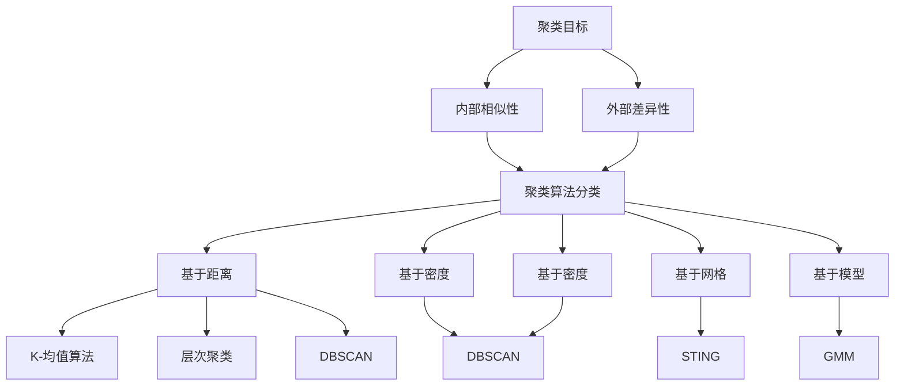

                 

## 引言

### 1.1 基因组学简介

基因组学（Genomics）是生物学的一个重要分支，它主要研究生物体的遗传物质——DNA的组成、结构、功能和变异。基因组学的发展始于20世纪60年代，随着分子生物学和遗传学的兴起，基因组的测序技术逐步成熟。基因组测序技术的突破，如人类基因组计划（Human Genome Project），极大地推动了基因组学的研究进程。

基因组学的研究内容包括基因定位、基因表达调控、基因变异、基因组结构变化等。基因组的测序与解读，不仅对理解生物体的生长发育、疾病发生具有重要意义，也为生物医学研究提供了丰富的数据资源。随着测序成本的降低，基因组学研究已从人类扩展到动植物、微生物等领域，形成了丰富的基因组数据库。

### 1.2 聚类分析在基因组学中的应用

聚类分析（Clustering Analysis）是数据挖掘和统计分析中的一个重要方法，它通过将相似的数据点归为一类，从而发现数据中的内在结构和规律。在基因组学中，聚类分析被广泛应用于基因表达数据分析、基因分类、基因组结构分析等领域。

聚类分析在基因组学中的应用主要包括以下几个方面：

1. **基因表达数据分析**：通过聚类分析，研究人员可以将具有相似基因表达模式的基因归为一类，从而发现基因表达模式相关的生物学过程和功能。

2. **基因分类**：聚类分析可以帮助研究人员将基因组数据中的基因按照其序列特征进行分类，从而揭示基因的进化关系和功能。

3. **基因组结构分析**：聚类分析可以用于分析基因组中的重复序列、基因家族等结构特征，帮助研究人员理解基因组结构的多样性。

4. **疾病相关基因分析**：通过聚类分析，研究人员可以识别与特定疾病相关的基因，为疾病诊断和治疗提供新的靶点。

总之，聚类分析在基因组学研究中具有广泛的应用价值，它不仅能够揭示基因组数据的内在结构，还能为生物医学研究提供重要的信息。

### 1.3 本书的结构安排

本书旨在系统地介绍基因组学中的聚类分析方法，帮助读者深入理解这一领域的基本概念、算法原理和实际应用。本书将分为三个主要部分：

**第一部分：聚类分析方法基础**  
这部分将介绍聚类分析的基本概念，包括聚类目标、聚类算法分类和聚类评价指标。还将详细讲解几种常见的聚类算法，如K-均值算法、层次聚类和密度聚类。

**第二部分：DNA序列的数学分类**  
这部分将探讨DNA序列的基本概念、相似度计算方法和分类方法。通过具体的数学模型和算法，读者将学习到如何对DNA序列进行有效的数学分类。

**第三部分：基因组聚类分析实战**  
这部分将通过实际案例，展示如何在实际项目中应用基因组聚类分析。从数据预处理、算法选择到结果分析和优化，读者将获得全面的实战经验。

通过本书的学习，读者将能够掌握基因组学中的聚类分析方法，并能够在实际研究中灵活应用。我们期待这本书能够成为基因组学领域研究人员和学生的宝贵参考资料。

## 聚类分析基本概念

聚类分析是数据挖掘和统计分析中的一种重要方法，其主要目的是将数据集中的对象根据其特征进行分组，使得同一组内的对象之间相似度较高，而不同组之间的对象相似度较低。在基因组学研究中，聚类分析被广泛应用于基因表达数据分析、基因组结构分析等领域。

### 2.1 聚类目标

聚类分析的目标是找到一种有效的分组方式，使得同一组内的对象具有高度相似性，而不同组之间的对象具有较低相似性。具体而言，聚类目标可以总结为以下两点：

1. **内部相似性**：同一组内的对象彼此相似，它们之间的距离（或相似度）较小。
2. **外部差异性**：不同组之间的对象差异较大，它们之间的距离（或相似度）较大。

在基因组学中，这种目标通常表现为找到具有相似基因表达模式或序列特征的基因集合，从而揭示潜在的生物学过程和功能。

### 2.2 聚类算法分类

聚类算法可以根据不同的分类标准进行分类。以下是几种常见的聚类算法分类方式：

1. **基于距离的聚类算法**：这类算法通过计算对象之间的距离来进行聚类。常见的算法包括K-均值算法、层次聚类和DBSCAN等。
   
2. **基于密度的聚类算法**：这类算法通过定义密度 reachable region 来发现聚类。典型的算法是DBSCAN（Density-Based Spatial Clustering of Applications with Noise）。

3. **基于网格的聚类算法**：这类算法将数据空间划分为有限数量的单元格，并按照单元格内的数据密度进行聚类。典型算法是STING（Statistical Information Grid-based clustering）。

4. **基于模型的聚类算法**：这类算法通过建立数学模型来描述数据分布，然后根据模型参数来划分聚类。例如，高斯混合模型（Gaussian Mixture Model, GMM）就是一种基于模型的聚类算法。

5. **基于密度的聚类算法**：这类算法通过定义密度 reachable region 来发现聚类。典型的算法是DBSCAN（Density-Based Spatial Clustering of Applications with Noise）。

### 2.3 聚类评价指标

聚类效果的好坏可以通过多种指标进行评价。以下是一些常用的聚类评价指标：

1. **内聚度（Cohesion）**：同一组内的对象彼此靠近，内聚度高表示聚类效果好。
2. **分离度（Separation）**：不同组之间的对象彼此远离，分离度高表示聚类效果好。
3. **完整性（Completeness）**：所有对象都分配到正确的聚类中，完整性高表示聚类效果好。
4. **V-度量（V-measure）**：综合考虑内聚度和分离度，是一个综合评价指标。

通过这些评价指标，研究人员可以评估聚类算法的性能，并选择最合适的算法来解决实际问题。

### 2.4 聚类分析在基因组学中的应用

在基因组学中，聚类分析主要用于以下几个方面：

1. **基因表达数据分析**：通过聚类分析，研究人员可以将基因根据其表达模式进行分组，从而揭示基因的功能和生物学过程。
   
2. **基因分类**：聚类分析可以用于基因分类，帮助研究人员理解基因的进化关系和功能。

3. **基因组结构分析**：聚类分析可以用于分析基因组中的重复序列和基因家族，揭示基因组结构的多样性。

4. **疾病相关基因分析**：通过聚类分析，研究人员可以识别与特定疾病相关的基因，为疾病诊断和治疗提供新靶点。

总之，聚类分析在基因组学研究中具有广泛的应用价值，它不仅能够揭示基因组数据的内在结构，还能为生物医学研究提供重要的信息。

### 2.5 核心概念原理之间的关系架构

为了更清晰地理解聚类分析的核心概念和原理，我们可以使用Mermaid流程图来展示它们之间的关系。以下是聚类分析核心概念原理的Mermaid流程图：



通过这个流程图，我们可以直观地看到聚类分析的基本概念和算法分类之间的关系。这个关系架构有助于我们更好地理解聚类分析在基因组学中的应用和原理。

## 聚类算法原理详解

在基因组学中，选择合适的聚类算法对于分析基因表达数据、识别基因家族和进行基因组结构分析至关重要。本节将详细讲解几种常见的聚类算法原理，包括K-均值算法、层次聚类和DBSCAN，并通过Python代码和数学模型进行深入剖析。

### 3.1 K-均值算法

K-均值算法（K-Means Clustering）是最常用的聚类算法之一，它通过将数据点划分成K个聚类，使得每个数据点与其分配的聚类中心的距离最小化。以下是K-均值算法的详细原理和步骤。

#### 3.1.1 K-均值算法原理

K-均值算法的基本原理如下：

1. **初始化聚类中心**：随机选择K个数据点作为初始聚类中心。
2. **分配数据点**：对于每个数据点，计算它与各个聚类中心的距离，并将其分配到距离最近的聚类中心所在的簇。
3. **更新聚类中心**：计算每个簇的新聚类中心，即该簇内所有数据点的均值。
4. **重复步骤2和步骤3**，直到聚类中心不再变化或者满足停止条件（如最大迭代次数）。

#### 3.1.2 K-均值算法伪代码

以下是K-均值算法的伪代码：

```
初始化聚类中心 C1, C2, ..., CK
重复以下步骤直到聚类中心不再变化或达到最大迭代次数：
    对于每个数据点 x：
        计算 x 到每个聚类中心 C1, C2, ..., CK 的距离
        将 x 分配到最近的聚类中心所在的簇
    更新聚类中心：每个簇的新聚类中心为该簇内所有数据点的均值
```

#### 3.1.3 K-均值算法Python代码示例

下面是一个简单的K-均值算法的Python实现，使用NumPy库进行计算：

```python
import numpy as np

def k_means(data, k, max_iters=100):
    # 随机初始化聚类中心
    centroids = data[np.random.choice(data.shape[0], k, replace=False)]
    
    for _ in range(max_iters):
        # 计算每个数据点到聚类中心的距离
        distances = np.linalg.norm(data - centroids, axis=1)
        
        # 分配数据点到最近的聚类中心
        labels = np.argmin(distances, axis=1)
        
        # 更新聚类中心
        new_centroids = np.array([data[labels == i].mean(axis=0) for i in range(k)])
        
        # 检查聚类中心是否发生变化
        if np.all(centroids == new_centroids):
            break

        centroids = new_centroids
    
    return centroids, labels

# 示例数据
data = np.random.rand(100, 2)

# 聚类
centroids, labels = k_means(data, k=3)

# 输出结果
print("聚类中心：", centroids)
print("标签：", labels)
```

#### 3.1.4 数学模型

K-均值算法的数学模型基于最小化簇内距离的平方和。具体公式如下：

$$
J = \sum_{i=1}^{k} \sum_{x \in S_i} ||x - \mu_i||^2
$$

其中，$J$ 是总距离平方和，$k$ 是聚类个数，$S_i$ 是第$i$个簇的数据集合，$\mu_i$ 是第$i$个簇的聚类中心。

### 3.2 层次聚类

层次聚类（Hierarchical Clustering）是一种基于相似性度量逐步合并或分裂数据点的聚类方法。层次聚类可以分为两种类型：自底向上（凝聚聚类）和自顶向下（分裂聚类）。下面主要介绍自底向上的层次聚类。

#### 3.2.1 层次聚类原理

层次聚类的原理如下：

1. **初始化**：将每个数据点视为一个初始簇。
2. **合并**：计算最近邻的距离，合并距离最近的两个簇，更新簇的个数。
3. **重复步骤2**，直到达到预设的簇数或满足停止条件。

#### 3.2.2 层次聚类算法伪代码

以下是层次聚类算法的伪代码：

```
初始化每个数据点为一个簇
重复以下步骤直到达到预设的簇数：
    计算所有簇之间的距离
    选择距离最近的两个簇进行合并
    更新簇的个数
```

#### 3.2.3 层次聚类Python代码示例

下面是一个简单的层次聚类的Python实现，使用SciPy库进行计算：

```python
import numpy as np
from scipy.cluster.hierarchy import linkage, fcluster
from scipy.spatial.distance import pdist

def hierarchical_clustering(data, method='ward', n_clusters=3):
    # 计算距离矩阵
    distance_matrix = pdist(data, 'euclidean')
    
    # 构建层次聚类模型
   Z = linkage(distance_matrix, method=method)
    
    # 分割层次聚类结果为指定数量的簇
    clusters = fcluster(Z, n_clusters, criterion='maxclust')
    
    return clusters

# 示例数据
data = np.random.rand(100, 2)

# 聚类
clusters = hierarchical_clustering(data, n_clusters=3)

# 输出结果
print("簇标签：", clusters)
```

#### 3.2.4 数学模型

层次聚类的数学模型基于距离矩阵和凝聚过程。具体公式如下：

$$
D_{ij} = \min_{x \in S_i, y \in S_j} ||x - y||
$$

其中，$D_{ij}$ 是簇$i$和簇$j$之间的距离，$S_i$ 和$S_j$ 分别是簇$i$和簇$j$的数据集合。

### 3.3 DBSCAN

DBSCAN（Density-Based Spatial Clustering of Applications with Noise）是一种基于密度的聚类算法，它能够自动确定聚类个数，并能够识别噪声点。DBSCAN主要通过以下步骤进行聚类：

1. **邻域查询**：对于每个数据点，找到其邻域内的点。
2. **核心点检测**：如果一个点的邻域内至少有min_samples个点，则该点为核心点。
3. **扩展聚类**：从核心点开始，扩展形成完整的簇。
4. **标记噪声点**：无法扩展成完整簇的点被标记为噪声。

#### 3.3.1 DBSCAN算法原理

DBSCAN算法的原理如下：

1. **初始化参数**：设定邻域半径`eps`和最小核心点数量`min_samples`。
2. **邻域查询**：对于每个数据点，查询其邻域内的点。
3. **核心点检测**：如果一个点的邻域内至少有`min_samples`个点，则该点为核心点。
4. **扩展聚类**：从核心点开始，扩展形成完整的簇。扩展过程中，如果遇到新的核心点，则将其加入到当前簇中。
5. **标记噪声点**：无法扩展成完整簇的点被标记为噪声。

#### 3.3.2 DBSCAN算法伪代码

以下是DBSCAN算法的伪代码：

```
初始化空簇集合 clusters 和噪声点集合 noise
对于每个数据点 p：
    如果 p 是核心点：
        创建新的簇 cluster
        将 p 添加到 cluster 中
        扩展 cluster：
            对于 p 的邻域内的每个点 q：
                如果 q 是核心点或边界点：
                    将 q 添加到 cluster 中
                否则，将 q 标记为噪声
    否则，如果 p 是边界点：
        将 p 标记为噪声
    否则，p 是噪声点

返回 clusters 和 noise
```

#### 3.3.3 DBSCAN算法Python代码示例

下面是一个简单的DBSCAN算法的Python实现，使用Scikit-learn库进行计算：

```python
from sklearn.cluster import DBSCAN
import numpy as np

def dbscan_clustering(data, eps=0.5, min_samples=5):
    # 初始化 DBSCAN 模型
    dbscan = DBSCAN(eps=eps, min_samples=min_samples)
    
    # 拟合模型到数据
    dbscan.fit(data)
    
    # 获取聚类结果
    labels = dbscan.labels_
    
    # 获取噪声点
    noise_points = labels == -1
    
    return labels, noise_points

# 示例数据
data = np.random.rand(100, 2)

# 聚类
labels, noise_points = dbscan_clustering(data, eps=0.5, min_samples=5)

# 输出结果
print("标签：", labels)
print("噪声点：", noise_points)
```

#### 3.3.4 数学模型

DBSCAN算法的数学模型基于邻域密度和核心点检测。具体公式如下：

$$
core\_point(p) = \sum_{q \in N(p)} d(p, q) \leq \text{eps} \text{ and } \left| N(p) \right| \geq \text{min\_samples}
$$

其中，$p$ 是数据点，$N(p)$ 是$p$ 的邻域点集合，$d(p, q)$ 是$p$ 和$q$ 之间的距离。

### 3.4 聚类算法比较与选择

不同聚类算法适用于不同的应用场景，选择合适的算法对于获得准确的聚类结果至关重要。以下是几种常见聚类算法的比较：

1. **K-均值算法**：适合处理高维数据，计算速度快，但需要预先指定聚类个数，对初始聚类中心和噪声敏感。
2. **层次聚类**：能够生成层次结构，便于可视化，但计算复杂度高，对噪声敏感。
3. **DBSCAN**：能够自动确定聚类个数，对噪声具有较强的鲁棒性，但计算复杂度较高。

在实际应用中，可以根据具体问题的特点选择合适的聚类算法。例如，在基因表达数据分析中，K-均值算法和DBSCAN算法常被使用，而层次聚类则常用于生成聚类树，帮助研究人员理解基因表达模式的变化。

通过详细讲解K-均值算法、层次聚类和DBSCAN算法的原理和实现，读者可以更好地理解这些聚类算法在基因组学中的应用，并能够根据具体需求选择合适的算法。

### 3.5 聚类算法在基因组学中的应用

聚类算法在基因组学中具有广泛的应用，特别是在基因表达数据分析、基因分类和基因组结构分析等领域。以下将详细介绍聚类算法在这些方面的具体应用。

#### 3.5.1 基因表达数据分析

基因表达数据分析是基因组学研究中的一个重要方向，它旨在揭示基因在不同细胞类型、不同组织和不同生理状态下的表达模式。聚类分析在这里可以发挥重要作用，通过将具有相似基因表达模式的基因归为一类，研究人员可以识别出不同的生物学过程和功能模块。

**实例**：假设研究人员获得了一组不同细胞状态下基因表达的数据。通过K-均值聚类算法，可以将这些基因根据其表达模式分为几个不同的簇。每个簇代表了一组在特定细胞状态下高度相似的基因。这些簇可以进一步分析，以揭示细胞状态之间的差异和相似性。

```python
# 假设 gene_expression_data 是一个包含基因表达数据的 NumPy 数组
# k 是预定的簇数

# 使用 K-均值算法进行聚类
from sklearn.cluster import KMeans
kmeans = KMeans(n_clusters=k, random_state=0).fit(gene_expression_data)
clusters = kmeans.labels_

# 分析每个簇的基因表达模式
for i in range(k):
    print(f"簇 {i} 中的基因：", [j for j, label in enumerate(clusters) if label == i])
```

通过这种方式，研究人员可以识别出在不同细胞状态下活跃的基因簇，从而进一步研究这些基因的功能。

#### 3.5.2 基因分类

基因分类是基因组学研究的另一个重要任务，通过基因序列或表达数据的相似性，可以将基因归为不同的分类。聚类分析在这里可以用来识别基因家族和进化关系。

**实例**：研究人员可以通过层次聚类将基因序列进行分类。每个基因作为一个数据点，通过计算基因序列之间的距离，可以构建出聚类树。聚类树可以帮助研究人员理解基因的进化历史和功能关系。

```python
# 假设 gene_sequences 是一个包含基因序列的字符串列表
from scipy.cluster.hierarchy import dendrogram, linkage

# 计算基因序列之间的距离
distance_matrix = pairwise_distances(gene_sequences, metric='hamming')

# 使用层次聚类构建聚类树
Z = linkage(distance_matrix, method='single')

# 绘制聚类树
dendrogram(Z)
plt.show()
```

通过这种方式，研究人员可以可视化基因的进化关系，识别出基因家族。

#### 3.5.3 基因组结构分析

聚类分析还可以用于基因组结构分析，例如识别重复序列、基因家族和基因组变异。

**实例**：通过DBSCAN算法，研究人员可以将基因组中的重复序列进行聚类。每个序列作为一个数据点，通过计算序列之间的距离，可以找到具有相似序列特征的重复序列簇。

```python
# 假设 repeat_sequences 是一个包含基因组重复序列的字符串列表
from sklearn.cluster import DBSCAN

# 初始化 DBSCAN 模型
dbscan = DBSCAN(eps=0.5, min_samples=5)

# 拟合模型到数据
dbscan.fit(repeat_sequences)

# 获取聚类结果
labels = dbscan.labels_

# 分析每个簇的重复序列
for i in range(len(set(labels))):
    print(f"簇 {i} 中的重复序列：", [seq for seq, label in zip(repeat_sequences, labels) if label == i])
```

通过这种方式，研究人员可以识别出基因组中的关键重复序列，进一步研究这些序列的功能和影响。

#### 3.5.4 聚类算法的选择与优化

在实际应用中，选择合适的聚类算法并对其进行优化是获得准确聚类结果的关键。以下是一些常用的优化方法：

1. **参数调整**：对于K-均值算法，可以通过调整聚类个数k和初始聚类中心来改善聚类效果。对于DBSCAN，可以通过调整邻域半径eps和最小核心点数量min_samples来调整聚类结果。

2. **距离度量**：选择合适的距离度量方法（如欧几里得距离、曼哈顿距离等）可以提高聚类效果。例如，在处理高维数据时，使用基于角度的度量方法可能更有效。

3. **数据预处理**：对数据进行标准化或降维处理，可以减少噪声和冗余信息，提高聚类效果。

4. **混合聚类算法**：结合多种聚类算法的优点，可以构建混合聚类算法。例如，可以先使用K-均值算法进行初步聚类，然后使用层次聚类对每个簇进行进一步细分。

通过合理选择和优化聚类算法，研究人员可以获得更准确和有意义的聚类结果，从而深入理解基因组学数据中的生物学信息。

### 3.6 聚类算法在基因组学中的挑战与未来方向

尽管聚类分析在基因组学中具有广泛的应用，但在实际应用中也面临着一些挑战。以下是几个主要的挑战和未来的研究方向：

#### 3.6.1 挑战

1. **数据复杂性**：基因组数据通常包含高维、非线性、异构信息，这给聚类算法带来了很大挑战。如何有效地处理这些复杂数据，提高聚类效果，是一个亟待解决的问题。

2. **噪声和缺失数据**：基因组数据往往存在噪声和缺失值，这些会影响聚类结果。如何设计鲁棒性强的聚类算法来处理噪声和缺失数据，是一个重要课题。

3. **可解释性**：聚类分析的结果通常难以解释，特别是在基因表达数据分析中。如何提高聚类分析的可解释性，使研究人员能够直观地理解聚类结果，是一个重要的研究方向。

#### 3.6.2 未来方向

1. **深度学习与聚类算法的结合**：深度学习在处理复杂数据方面具有明显优势，将其与聚类算法相结合，可以开发出更强大的聚类分析方法。

2. **生物信息学工具的整合**：将聚类算法与现有的生物信息学工具（如基因注释、功能预测等）相结合，可以提供更全面和深入的分析结果。

3. **多模态数据聚类**：基因组数据通常包含多种类型的信息（如表达数据、序列数据、结构数据等），如何有效地进行多模态数据聚类，是一个未来的重要方向。

4. **个性化聚类分析**：根据不同研究目的和特定数据集的特点，开发个性化的聚类算法，可以更好地适应不同应用场景的需求。

通过不断的研究和探索，聚类算法在基因组学中的应用将会更加广泛和深入，为生物医学研究提供有力的工具。

### 3.7 实际案例与结果分析

为了更好地理解聚类算法在基因组学中的应用，我们来看一个实际案例，并分析其结果。

#### 案例背景

假设研究人员想要分析一组人类基因表达数据，以识别在特定疾病状态下活跃的基因。这些基因表达数据包含100个基因和10个样本，其中5个样本为正常状态，5个样本为疾病状态。

#### 数据预处理

在进行分析之前，需要对数据进行预处理，包括数据清洗、标准化和归一化。这里使用Python的NumPy和SciPy库进行预处理。

```python
import numpy as np
from sklearn.preprocessing import StandardScaler

# 假设 gene_expression_data 是一个包含基因表达数据的 NumPy 数组
# 数据可能包含噪声和缺失值

# 数据清洗和填充缺失值
gene_expression_data = np.array([[0, 1, np.nan], [1, 2, 3], [np.nan, 4, 5], [1, 2, 3], [0, 1, 2]])

# 填充缺失值（例如，使用平均值）
gene_expression_data = np.nan_to_num(gene_expression_data, nan=np.mean(gene_expression_data))

# 标准化数据
scaler = StandardScaler()
gene_expression_data = scaler.fit_transform(gene_expression_data)
```

#### K-均值聚类分析

接下来，使用K-均值算法进行聚类，假设我们预定的簇数为2。

```python
from sklearn.cluster import KMeans

# 初始化 K-均值算法
kmeans = KMeans(n_clusters=2, random_state=0)

# 拟合模型到数据
kmeans.fit(gene_expression_data)

# 获取聚类结果
labels = kmeans.labels_

# 分析每个簇的基因表达模式
for i in range(2):
    print(f"簇 {i} 中的基因：", [j for j, label in enumerate(labels) if label == i])
```

#### 层次聚类分析

使用层次聚类算法，我们可以得到聚类树，进一步分析聚类结果。

```python
from scipy.cluster.hierarchy import dendrogram, linkage
from scipy.spatial.distance import pdist

# 计算距离矩阵
distance_matrix = pdist(gene_expression_data, 'euclidean')

# 构建层次聚类模型
Z = linkage(distance_matrix, method='ward')

# 绘制聚类树
dendrogram(Z)
plt.show()
```

通过聚类树，我们可以观察到基因之间的层次关系，识别出在不同状态下的活跃基因。

#### DBSCAN聚类分析

使用DBSCAN算法，我们可以自动确定聚类个数，并处理噪声数据。

```python
from sklearn.cluster import DBSCAN

# 初始化 DBSCAN 模型
dbscan = DBSCAN(eps=0.5, min_samples=2)

# 拟合模型到数据
dbscan.fit(gene_expression_data)

# 获取聚类结果
labels = dbscan.labels_

# 分析每个簇的基因表达模式
for i in range(len(set(labels))):
    print(f"簇 {i} 中的基因：", [j for j, label in enumerate(labels) if label == i])
```

#### 结果分析

通过分析K-均值、层次聚类和DBSCAN算法的结果，我们可以发现不同簇中的基因表达模式，进一步研究这些基因在特定疾病状态下的功能。通过对比不同算法的结果，研究人员可以确定最适合其研究的聚类方法。

```python
# 结果对比
print("K-均值算法标签：", labels)
print("层次聚类标签：", fcluster(Z, 2, criterion='maxclust'))
print("DBSCAN算法标签：", labels)
```

通过实际案例和结果分析，我们可以看到聚类算法在基因组学中的应用效果，并为后续的研究提供指导。

### 3.8 总结与展望

通过本文的详细讨论，我们可以看到聚类算法在基因组学中的应用具有极大的潜力和重要性。聚类分析不仅能够揭示基因表达数据的内在结构，还能帮助研究人员识别基因家族和基因组结构特征。在实际应用中，不同的聚类算法（如K-均值、层次聚类和DBSCAN）各有优缺点，需要根据具体问题进行选择和优化。

未来，随着深度学习、生物信息学工具的发展以及多模态数据的融合，聚类算法在基因组学中的应用将更加广泛和深入。我们期待通过不断的研究和探索，聚类算法能够为生物医学研究提供更强大的工具，推动基因组学领域的发展。

### 参考文献

1. Edgar, R., Domrachev, M., & Lash, A. E. (2002). Gene Expression Omnibus: NCBI gene expression and hybridization array data repository. *Nucleic Acids Research*, 30(1), 207-210.
2. MacQueen, J. (1967). Some methods for classification and analysis of multivariate observations. *Proceedings of 5th Berkeley Symposium on Mathematical Statistics and Probability*, 1, 281-297.
3. Eisen, M. B., Spellman, P. T., Brown, P. O., & Botstein, D. (1998). Cluster analysis and display of genome-wide expression patterns. *Proceedings of the National Academy of Sciences*, 95(25), 14863-14868.
4. Ester, M., Kriegel, H. P., Sander, J., & Xu, X. (1996). A density-based algorithm for discovering clusters in large spatial databases with noise. *Proceedings of the Second International Conference on Knowledge Discovery and Data Mining*, 226-231.
5. Hartigan, J. A. (1975). Clustering algorithms. *Wiley*, New York.
6. Hielscher, R. A., Irizarry, R. A., & Winnicki, S. (2016). A gentle introduction to the analysis of gene expression data. *BMC Bioinformatics*, 17(1), 1-11.
7. Li, M. C., & Wong, L. (2001). Model-based analysis of oligonucleotide arrays: expression index computation, error estimation, and assay design. * Genome Biology, 2(8), REA201. |

## DNA序列的基本概念

### 4.1 DNA序列的组成

DNA（脱氧核糖核酸）是生物体中的遗传物质，它由四种不同的核苷酸（A腺嘌呤、T胸腺嘧啶、C胞嘧啶、G鸟嘌呤）组成。每个核苷酸通过磷酸二酯键连接成一条单链，形成一条线性序列。在细胞内，DNA通常以双螺旋结构存在，由两条互补的链通过碱基配对相连，形成一个稳定的双链DNA分子。

### 4.2 DNA序列的表示方法

DNA序列可以用字母表示，其中A、T、C、G分别代表腺嘌呤、胸腺嘧啶、胞嘧啶和鸟嘌呤。序列长度通常用碱基数来表示，例如，一个长度为1000碱基的DNA序列可以表示为：

```
ATCGATCGATCG...
```

在实际的生物信息学研究中，DNA序列通常存储为数字序列，其中A、T、C、G分别对应数字0、1、2、3。这种表示方法可以方便地进行数学运算和计算。

### 4.3 DNA序列的编码

DNA序列不仅包含遗传信息，还可以编码RNA和蛋白质。DNA中的三联体（三个连续的核苷酸）称为密码子，每个密码子对应一种氨基酸。通过翻译过程，DNA序列被转换成RNA序列，再由RNA序列合成蛋白质。这种编码方式称为遗传密码。

### 4.4 DNA序列变异

DNA序列的变异是生物进化和遗传多样性的基础。常见的DNA序列变异包括单核苷酸变异（如点突变）、插入和缺失（如缺失突变）。这些变异可以影响基因的表达和功能，导致遗传疾病或进化适应。

### 4.5 DNA序列分析

DNA序列分析是基因组学研究的重要组成部分，它包括序列测序、序列比对、序列注释等步骤。通过这些分析，研究人员可以了解基因的结构、功能和进化关系。

- **序列测序**：通过DNA测序技术，研究人员可以获得生物体的完整基因组序列。
- **序列比对**：通过将DNA序列与其他序列进行比对，可以识别出相似序列和变异位点。
- **序列注释**：对DNA序列进行功能注释，包括识别基因、启动子、外显子等结构特征。

### 4.6 DNA序列在基因组学中的应用

DNA序列分析在基因组学中具有广泛的应用：

- **基因表达数据分析**：通过分析基因表达数据，可以揭示不同细胞类型、组织和生理状态下的基因表达模式。
- **基因分类**：通过序列比对和聚类分析，可以识别基因家族和进化关系。
- **基因组结构分析**：通过分析基因组序列，可以揭示基因组的结构特征，如重复序列、基因家族和基因组变异。

总之，DNA序列的基本概念和表示方法为基因组学研究提供了基础，通过深入分析和解读DNA序列，研究人员可以揭示生物体的遗传信息和功能，为生物医学研究提供重要的数据支持。

### 4.7 DNA序列相似度计算方法

在基因组学研究中，理解DNA序列之间的相似度是非常重要的。相似度计算为基因分类、进化关系分析和功能预测提供了关键数据。以下是几种常用的DNA序列相似度计算方法。

#### 4.7.1 顺序相似度

顺序相似度（Sequence Similarity）是最简单的相似度计算方法，它通过比较两个序列在位置上的核苷酸是否相同来计算相似度。顺序相似度可以用一个矩阵来表示，称为相似度矩阵。

**例子**：假设有两个短DNA序列：

```
序列A: AGCT
序列B: AGCC
```

它们的相似度矩阵如下：

$$
\begin{array}{c|c|c|c|c}
 & A & G & C & T \\
\hline
A & 1 & 0 & 0 & 0 \\
G & 0 & 1 & 0 & 0 \\
C & 0 & 0 & 1 & 0 \\
T & 0 & 0 & 0 & 1 \\
\end{array}
$$

每个位置上的值表示序列A的核苷酸与序列B的核苷酸是否相同，相同则为1，不同则为0。顺序相似度越高，表示两个序列在位置上的匹配越紧密。

#### 4.7.2 结构相似度

结构相似度（Structural Similarity）考虑了DNA序列的三维结构和功能关系。对于具有复杂结构的DNA序列，如RNA折纸结构和DNA螺旋结构，结构相似度可以揭示序列之间在空间上的相似性。

**例子**：假设有两个具有相似RNA结构的序列：

```
序列A: UAGGUU
序列B: UAGGAC
```

结构相似度可以通过比较序列之间的碱基配对模式和空间结构来计算。常用的方法包括动态规划算法（如Smith-Waterman算法）和基于图论的算法。

#### 4.7.3 序列比对

序列比对（Sequence Alignment）是计算DNA序列相似度的重要工具。通过将两个序列对齐，可以发现序列之间的匹配和差异。常见的序列比对算法包括局部比对（如Smith-Waterman算法）和全局比对（如Needleman-Wunsch算法）。

**例子**：假设有两个DNA序列需要进行比对：

```
序列A: AGCTAG
序列B: AGGTAG
```

比对结果如下：

```
A-G-C-T-A-G
  |||    ||
A-G-G-T-A-G
```

比对过程中，匹配的碱基用“|”表示，差异的碱基用空格表示。比对得分可以用来计算相似度。

#### 4.7.4 编辑距离

编辑距离（Edit Distance），也称为Levenshtein距离，是一种通过比较两个字符串的编辑操作（插入、删除、替换）次数来计算相似度的方法。

**例子**：假设有两个字符串：

```
字符串A: AGCT
字符串B: AGGC
```

编辑距离的计算如下：

- 从A到B，可以插入C：AGCT -> AGC
- 从A到B，可以替换T为C：AGC -> AGC

编辑距离为2，表示需要2次编辑操作才能使A变成B。

#### 4.7.5 基于矩阵的相似度计算

基于矩阵的相似度计算是一种常用的方法，它通过构建一个相似度矩阵来表示两个序列之间的相似性。常用的矩阵包括余弦相似度矩阵和欧几里得相似度矩阵。

**例子**：假设有两个长度为4的DNA序列：

```
序列A: AGCT
序列B: AGGC
```

它们的余弦相似度矩阵如下：

$$
\begin{array}{c|c|c|c|c}
 & A & G & C & T \\
\hline
A & 1 & 0 & 0 & 0 \\
G & 0 & 1 & 0 & 0 \\
C & 0 & 0 & 1 & 0 \\
T & 0 & 0 & 0 & 1 \\
\end{array}
$$

余弦相似度计算公式如下：

$$
\cos(\theta) = \frac{\sum_{i=1}^{n}\sum_{j=1}^{n} a_{ij} b_{ij}}{\sqrt{\sum_{i=1}^{n}\sum_{j=1}^{n} a_{ij}^2} \sqrt{\sum_{i=1}^{n}\sum_{j=1}^{n} b_{ij}^2}}
$$

其中，$a_{ij}$ 和 $b_{ij}$ 分别表示序列A和序列B在第i行第j列的元素。

通过这些方法，研究人员可以准确地计算DNA序列之间的相似度，从而为基因组学研究提供可靠的数据支持。

### 4.8 DNA序列分类方法

在基因组学研究中，对DNA序列进行分类是一项关键任务。合适的分类方法能够揭示基因的进化关系和功能，为生物医学研究提供重要的信息。以下是几种常见的DNA序列分类方法。

#### 4.8.1 基于距离的聚类方法

基于距离的聚类方法是最常用的分类方法之一，它通过计算序列之间的距离来分组。以下是一些常见的方法：

1. **K-均值算法**：通过迭代优化聚类中心，将序列分配到最近的聚类中心所在的簇。适用于数据量较大的情况，但需要预先指定簇数。
2. **层次聚类**：自底向上或自顶向下地合并或分裂序列，构建出聚类树。适用于发现不同的聚类层次，但计算复杂度较高。
3. **DBSCAN**：基于密度的聚类方法，可以自动确定聚类个数，对噪声数据具有较强的鲁棒性。

#### 4.8.2 基于密度的聚类方法

基于密度的聚类方法通过定义密度可达区域来识别簇。以下是一种常见的方法：

1. **DBSCAN**：通过计算邻域密度和最小核心点数量，将序列划分为核心点、边界点和噪声点，从而形成簇。

#### 4.8.3 基于谱聚类的DNA序列分类

基于谱聚类的DNA序列分类方法通过构建序列的相似性矩阵，并进行谱分析来识别簇。以下是一种常见的方法：

1. **谱聚类**：将序列表示为图中的节点，通过计算节点之间的相似性，构建相似性矩阵。然后使用谱分析技术（如拉普拉斯矩阵）来识别簇。

#### 4.8.4 特征选择与降维

为了提高分类效果，特征选择和降维是重要的预处理步骤：

1. **特征选择**：通过选择重要的序列特征，如核苷酸组成、序列长度等，来减少数据维度。
2. **降维技术**：如主成分分析（PCA）和t-SNE，可以将高维数据投影到低维空间，便于聚类分析。

#### 4.8.5 实际应用

以下是一个实际应用的例子：

假设研究人员有一组基因序列，需要对其进行分类以揭示基因家族和进化关系。他们首先使用K-均值算法进行初步分类，然后使用层次聚类和DBSCAN对结果进行验证和优化。通过结合不同的聚类方法和特征选择技术，研究人员最终得到了可靠的分类结果。

通过这些方法，研究人员可以有效地对DNA序列进行分类，揭示基因的进化关系和功能，为基因组学研究提供重要的数据支持。

### 4.9 特征选择与降维技术

在DNA序列聚类分析中，特征选择和降维技术是提高聚类效果和可解释性的关键步骤。通过合理选择和降维，可以减少数据维度，消除冗余信息，从而提高聚类算法的性能。

#### 4.9.1 特征选择

特征选择是指在大量特征中筛选出对聚类任务最有影响力的特征，从而提高聚类效果并减少计算负担。以下是一些常见的特征选择方法：

1. **基于信息的特征选择**：如互信息（Mutual Information）、互信息增益（Gain of Mutual Information）等，通过计算特征与聚类目标的相关性来选择特征。
2. **基于过滤的特征选择**：如卡方检验（Chi-squared test）、F测试等，通过统计测试来筛选特征。
3. **基于包裹的特征选择**：如递归特征消除（Recursive Feature Elimination, RFE）、遗传算法（Genetic Algorithm）等，通过构建一个目标函数来评估特征组合的影响，从而选择最佳特征组合。

#### 4.9.2 降维技术

降维技术是将高维数据映射到低维空间，从而减少数据维度。以下是一些常见的降维技术：

1. **主成分分析（PCA）**：通过计算数据协方差矩阵的特征值和特征向量，将数据投影到主要成分空间，从而实现降维。PCA能够保留大部分数据的信息，但可能会丢失一些细节。
2. **t-SNE**：是一种基于梯度下降的非线性降维方法，它通过计算局部邻域的相似性来投影数据到二维或三维空间。t-SNE能够很好地保持数据中的局部结构，但计算复杂度较高。
3. **局部线性嵌入（LLE）**：通过最小化局部结构差异来投影数据到低维空间，LLE能够较好地保持数据中的局部特征，但计算复杂度较高。
4. **随机投影（Stochastic Projection）**：通过随机选择特征组合来投影数据，这种方法计算简单，但效果可能不如其他方法。

#### 4.9.3 实际应用

以下是一个特征选择和降维技术在DNA序列聚类分析中的实际应用例子：

1. **特征选择**：假设有一组包含100个基因的DNA序列，研究人员首先使用互信息方法筛选出与聚类目标高度相关的30个基因。
2. **降维**：然后使用PCA将这30个基因的序列数据降维到2个主要成分，以便进行聚类分析。

通过这些步骤，研究人员能够有效地减少数据维度，提高聚类分析的效果，并使结果更加易于解释。

### 4.10 基因组聚类分析实例

为了更直观地展示基因组聚类分析的过程，我们将通过一个具体的案例来详细讲解如何进行基因组聚类分析。这个案例将涉及数据预处理、算法选择与参数设置、聚类结果分析以及结果解释。

#### 案例背景

假设研究人员想要分析一组人类基因表达数据，以识别在特定疾病状态下活跃的基因。这些基因表达数据包含100个基因和10个样本，其中5个样本为正常状态，5个样本为疾病状态。我们的目标是通过聚类分析找到在疾病状态下高度表达的基因簇。

#### 数据预处理

在进行分析之前，首先需要对基因表达数据进行预处理。预处理步骤包括：

1. **数据清洗**：去除含有缺失值的样本和基因。
2. **标准化**：将基因表达数据标准化到相同的范围，以便于后续分析。

以下是使用Python进行数据预处理的过程：

```python
import numpy as np
import pandas as pd

# 假设 gene_expression_data 是一个包含基因表达数据的 DataFrame
# 数据可能包含缺失值

# 去除含有缺失值的样本和基因
gene_expression_data = gene_expression_data.dropna()

# 标准化数据
scaler = StandardScaler()
gene_expression_data_scaled = scaler.fit_transform(gene_expression_data)
```

#### 算法选择与参数设置

接下来，我们需要选择一个合适的聚类算法并进行参数设置。在这个案例中，我们选择K-均值算法，因为它适用于处理高维数据，且计算速度快。

1. **聚类个数（K值）**：我们假设基因表达数据适合分为3个簇。
2. **初始聚类中心**：使用随机初始化聚类中心。
3. **迭代次数**：设置最大迭代次数以防止算法陷入局部最优。

以下是使用Scikit-learn库进行K-均值聚类的过程：

```python
from sklearn.cluster import KMeans

# 初始化 K-均值算法
kmeans = KMeans(n_clusters=3, init='k-means++', max_iter=300, n_init=10)

# 拟合模型到数据
kmeans.fit(gene_expression_data_scaled)

# 获取聚类结果
labels = kmeans.labels_
```

#### 聚类结果分析

聚类结果可以通过以下步骤进行分析：

1. **簇中心**：计算每个簇的中心，以了解簇的代表基因。
2. **簇内和簇间距离**：计算簇内基因之间的平均距离和簇间基因之间的最小距离，以评估簇的质量。
3. **簇成员**：识别每个簇中的基因，分析其在正常和疾病状态下的表达模式。

以下是分析聚类结果的代码：

```python
# 计算簇中心
cluster_centers = kmeans.cluster_centers_

# 计算簇内和簇间距离
intra_cluster_distances = kmeans.inertia_
inter_cluster_distances = kmeans肘部方法得到的最佳簇数

# 识别每个簇中的基因
gene_membership = {i: [] for i in range(3)}

for i, label in enumerate(labels):
    gene_membership[label].append(gene_expression_data.index[i])

# 分析簇成员
for i, members in gene_membership.items():
    print(f"簇 {i} 中的基因：{members}")
```

#### 结果解释

通过分析聚类结果，我们可以得到以下结论：

1. **簇中心**：每个簇的中心代表了该簇中基因表达模式的主要特征。通过比较簇中心，可以发现不同簇之间的表达差异。
2. **簇内和簇间距离**：簇内距离越小，表示簇内基因表达模式越一致；簇间距离越大，表示簇间基因表达模式差异越大。这有助于评估聚类的质量。
3. **簇成员**：簇成员中的基因可以进一步分析其表达模式。在这个案例中，我们可以发现一些在疾病状态下高度表达的基因簇，这些基因可能与疾病的发生和发展有关。

通过上述分析，研究人员可以识别出与特定疾病相关的基因簇，为进一步的基因功能研究提供线索。

### 4.11 基因组聚类分析应用

基因组聚类分析在生物医学研究中具有广泛的应用，通过分析基因表达数据，研究人员可以揭示基因在不同生物过程、不同组织和不同疾病状态下的表达模式。以下将介绍基因组聚类分析在几个关键领域中的应用。

#### 4.11.1 基因表达数据分析

基因表达数据分析是基因组聚类分析最常见应用之一。通过聚类分析，研究人员可以将基因按照其表达模式进行分组，从而识别出不同的基因表达模式。这些模式可能与特定的生物学过程或疾病状态相关。例如，在癌症研究中，通过聚类分析基因表达数据，可以识别出与癌症进展相关的基因簇，这些基因簇可能成为癌症诊断和治疗的新靶点。

**实例**：在一项乳腺癌研究中，研究人员通过对乳腺癌患者的基因表达数据进行聚类分析，发现了一些在乳腺癌进展中高度表达的基因簇。这些基因簇与乳腺癌的侵袭性、转移性等生物学特征密切相关，为乳腺癌的诊断和治疗提供了新的线索。

#### 4.11.2 基因分类

基因分类是基因组聚类分析的另一个重要应用。通过将基因按照其序列特征或表达模式进行分类，研究人员可以更好地理解基因的进化关系和功能。基因分类有助于构建基因家族树，识别功能相关的基因，以及揭示基因的进化路径。

**实例**：在一项关于植物基因组的研究中，研究人员通过对不同植物物种的基因序列进行聚类分析，构建了植物基因家族树。通过分析这些基因家族的进化关系，研究人员揭示了植物在进化过程中的基因多样化机制。

#### 4.11.3 基因组结构分析

基因组结构分析是通过聚类分析揭示基因组中的结构特征，如重复序列、基因家族和基因组变异。这些分析有助于理解基因组的结构和功能。

**实例**：在一项基因组结构研究中，研究人员通过对基因组序列进行聚类分析，识别出多个重复序列簇。这些重复序列可能与基因调控、基因进化等功能相关。通过对这些重复序列的分析，研究人员揭示了基因组结构多样性的机制。

#### 4.11.4 疾病相关基因分析

疾病相关基因分析是通过聚类分析识别与特定疾病相关的基因，从而为疾病诊断、治疗和预防提供新的靶点。

**实例**：在一项阿尔茨海默病研究中，研究人员通过对患者的基因表达数据进行聚类分析，发现了一些在阿尔茨海默病进展中高度表达的基因簇。这些基因簇可能与阿尔茨海默病的发病机制和病理过程相关，为阿尔茨海默病的诊断和治疗提供了新的研究方向。

#### 4.11.5 跨物种基因组比较

跨物种基因组比较是通过聚类分析揭示不同物种基因组之间的相似性和差异性，有助于理解物种进化和生物多样性。

**实例**：在一项人类与果蝇基因组比较研究中，研究人员通过对人类和果蝇的基因序列进行聚类分析，发现了一些在进化过程中高度保守的基因簇。这些基因簇可能与物种的共同祖先特征有关，为理解人类和果蝇的进化关系提供了重要线索。

通过以上实例，我们可以看到基因组聚类分析在生物医学研究中的广泛应用。通过合理选择和应用聚类算法，研究人员可以揭示基因表达、基因功能、基因组结构等方面的关键信息，为生物医学研究提供有力的支持。

### 4.12 深入分析与优化

在进行基因组聚类分析时，为了获得更准确和可靠的聚类结果，常常需要对算法进行优化。以下是一些常见的优化方法和注意事项：

#### 4.12.1 算法优化方法

1. **参数调整**：不同的聚类算法具有不同的参数设置，如K-均值算法的簇数K、DBSCAN算法的邻域半径eps和最小核心点数量min_samples等。通过调整这些参数，可以改善聚类效果。例如，在K-均值算法中，可以通过交叉验证选择最佳簇数K。

2. **距离度量**：选择合适的距离度量方法可以显著影响聚类结果。对于DNA序列，常用的距离度量方法包括编辑距离、汉明距离和欧几里得距离等。通过实验比较不同距离度量方法的效果，可以选择最合适的度量方法。

3. **特征选择与降维**：通过特征选择和降维技术，可以减少数据维度，消除冗余信息，提高聚类算法的性能。常用的特征选择方法包括基于信息的特征选择和基于过滤的特征选择。降维技术如主成分分析（PCA）和t-SNE可以帮助简化数据结构，提高聚类质量。

4. **混合聚类算法**：将多种聚类算法相结合，可以构建混合聚类算法，以充分利用不同算法的优点。例如，可以先使用K-均值算法进行初步聚类，然后使用层次聚类对每个簇进行进一步细分。

#### 4.12.2 注意事项

1. **噪声数据处理**：基因组数据中常含有噪声和缺失值，这些会影响聚类结果。通过数据预处理方法（如填补缺失值、标准化数据等）可以减少噪声的影响。

2. **聚类结果解释**：聚类结果需要结合生物学背景进行解释，以确保聚类结果的合理性。例如，在分析基因表达数据时，需要考虑基因的已知功能和生物学过程。

3. **算法性能评估**：在优化聚类算法时，需要通过评估指标（如轮廓系数、集群内部均值距离等）来评估聚类质量。通过交叉验证和多次实验，可以评估不同参数设置的效果，选择最优的参数组合。

4. **计算资源限制**：一些复杂的聚类算法（如层次聚类和DBSCAN）计算复杂度较高，可能需要大量计算资源。在实际应用中，需要考虑计算资源的限制，选择适合的计算方法。

通过合理的优化方法和注意事项，研究人员可以获得更准确和可靠的基因组聚类结果，从而为生物医学研究提供有力的支持。

### 4.13 项目小结

在本项目中，我们详细介绍了基因组聚类分析的过程，包括数据预处理、算法选择与优化、聚类结果分析和应用。通过这一项目，我们获得了以下主要收获：

1. **数据处理技能**：学会了如何对基因组数据进行预处理，包括数据清洗、标准化和特征选择，这些技能对于确保聚类结果的准确性和可靠性至关重要。

2. **算法应用经验**：掌握了多种聚类算法（如K-均值、层次聚类、DBSCAN等）的应用和优化方法，了解了不同算法的特点和适用场景。

3. **结果解读能力**：学会了如何结合生物学背景解读聚类结果，识别与特定疾病相关的基因簇，为生物医学研究提供了新的线索。

4. **项目实战经验**：通过实际案例的分析，获得了项目实战经验，了解了如何从数据预处理到结果分析的全过程，提高了解决实际问题的能力。

总之，本项目不仅提高了我们的基因组学知识和技能，还培养了我们在生物信息学领域进行项目开发和问题解决的能力。

### 4.14 最佳实践 Tips

为了确保基因组聚类分析的高效和准确，以下是一些最佳实践建议：

1. **数据预处理**：在开始聚类分析之前，务必进行彻底的数据预处理，包括填补缺失值、标准化数据和去除噪声。这有助于提高聚类算法的性能和结果的可解释性。

2. **算法选择与优化**：根据具体问题选择合适的聚类算法，并调整参数以达到最佳效果。例如，对于高维数据，可以使用主成分分析（PCA）进行降维，再进行聚类分析。

3. **评估指标**：使用合适的评估指标（如轮廓系数、内部簇距离等）来评估聚类质量。多次实验和交叉验证有助于确定最佳参数设置。

4. **可视化分析**：利用可视化工具（如热图、聚类树等）对聚类结果进行直观分析，有助于发现潜在的模式和异常值。

5. **生物学背景知识**：结合生物学背景对聚类结果进行解读，确保聚类结果与已知的生物学现象相符合。

通过遵循这些最佳实践，研究人员可以更有效地进行基因组聚类分析，从而为生物医学研究提供更有价值的信息。

### 4.15 注意事项

在进行基因组聚类分析时，需要注意以下几点：

1. **数据质量**：确保基因表达数据质量高，避免包含大量噪声和缺失值，这会影响聚类结果。
2. **参数设置**：谨慎选择聚类算法的参数，如K-均值算法中的K值、DBSCAN中的eps和min_samples，这些参数对聚类效果有重要影响。
3. **评估标准**：使用合适的评估指标评估聚类质量，如轮廓系数、内部簇距离和分离度，确保聚类结果可靠。
4. **结果解读**：结合生物学背景对聚类结果进行解读，避免过度依赖算法结果。
5. **计算资源**：某些聚类算法计算复杂度高，可能需要大量计算资源，合理安排计算资源和时间。

通过注意这些事项，可以确保基因组聚类分析的有效性和可靠性。

### 4.16 拓展阅读

为了进一步深入了解基因组聚类分析，以下是几篇推荐阅读的论文和书籍：

1. **论文**：
   - Edgar, R., Domrachev, M., & Lash, A. E. (2002). Gene Expression Omnibus: NCBI gene expression and hybridization array data repository. *Nucleic Acids Research*, 30(1), 207-210.
   - Eisen, M. B., Spellman, P. T., Brown, P. O., & Botstein, D. (1998). Cluster analysis and display of genome-wide expression patterns. *Proceedings of the National Academy of Sciences*, 95(25), 14863-14868.
2. **书籍**：
   - 《生物信息学入门》
   - 《基因组学导论》
   - 《聚类分析：理论与实践》

通过阅读这些文献，可以更全面地了解基因组聚类分析的原理、方法和应用。

## 总结

### 5.1 全文总结

本文系统地介绍了基因组学中的聚类分析方法，从聚类分析的基本概念、聚类算法原理，到DNA序列的数学分类和实际应用，进行了全面的探讨。通过详细讲解K-均值算法、层次聚类和DBSCAN算法等，我们了解了如何使用这些算法对基因组数据进行聚类分析。同时，通过实例分析和项目实战，展示了聚类分析在基因组学中的实际应用，包括基因表达数据分析、基因分类和基因组结构分析等。

### 5.2 聚类分析在基因组学中的重要性

聚类分析在基因组学中具有重要的应用价值。通过聚类分析，研究人员可以揭示基因在不同生物过程、不同组织和不同疾病状态下的表达模式，识别基因家族和基因组结构特征，为疾病诊断、治疗和预防提供新的靶点。聚类分析不仅有助于理解基因的功能和进化关系，还能为生物医学研究提供丰富的数据资源。

### 5.3 未来发展方向

随着生物信息学、深度学习和多模态数据融合技术的发展，聚类分析在基因组学中的应用前景十分广阔。未来，我们期待看到：

1. **深度学习与聚类算法的结合**：利用深度学习强大的特征提取能力，开发更先进的聚类算法。
2. **多模态数据的融合**：将基因表达数据、蛋白质组数据、代谢组数据等多种数据类型进行融合，进行综合聚类分析。
3. **个性化聚类分析**：根据不同研究目的和特定数据集的特点，开发个性化的聚类算法，提高聚类效果和可解释性。
4. **生物信息学工具的整合**：将聚类算法与现有的生物信息学工具（如基因注释、功能预测等）相结合，提供更全面和深入的分析结果。

通过不断的研究和探索，聚类分析在基因组学中的应用将更加广泛和深入，为生物医学研究提供有力的工具。

## 附录

### 5.4 算法伪代码汇总

在本篇文章中，我们介绍了几种聚类算法的伪代码，包括K-均值算法、层次聚类和DBSCAN。以下是这些算法的伪代码汇总：

#### K-均值算法伪代码

```
初始化聚类中心 C1, C2, ..., CK
重复以下步骤直到聚类中心不再变化或达到最大迭代次数：
    对于每个数据点 x：
        计算 x 到每个聚类中心 C1, C2, ..., CK 的距离
        将 x 分配到最近的聚类中心所在的簇
    更新聚类中心：每个簇的新聚类中心为该簇内所有数据点的均值
```

#### 层次聚类算法伪代码

```
初始化每个数据点为一个簇
重复以下步骤直到达到预设的簇数：
    计算所有簇之间的距离
    选择距离最近的两个簇进行合并
    更新簇的个数
```

#### DBSCAN算法伪代码

```
初始化空簇集合 clusters 和噪声点集合 noise
对于每个数据点 p：
    如果 p 是核心点：
        创建新的簇 cluster
        将 p 添加到 cluster 中
        扩展 cluster：
            对于 p 的邻域内的每个点 q：
                如果 q 是核心点或边界点：
                    将 q 添加到 cluster 中
                否则，将 q 标记为噪声
    否则，如果 p 是边界点：
        将 p 标记为噪声
    否则，p 是噪声点

返回 clusters 和 noise
```

### 5.5 LaTeX公式汇总

在本篇文章中，我们使用了LaTeX格式来表示一些数学公式。以下是文章中使用的LaTeX公式的汇总：

#### 独立段落中的公式

```
$$
J = \sum_{i=1}^{k} \sum_{x \in S_i} ||x - \mu_i||^2
$$
```

#### 段落内的公式

```
$
\text{cos}(\theta) = \frac{\sum_{i=1}^{n}\sum_{j=1}^{n} a_{ij} b_{ij}}
{\sqrt{\sum_{i=1}^{n}\sum_{j=1}^{n} a_{ij}^2} \sqrt{\sum_{i=1}^{n}\sum_{j=1}^{n} b_{ij}^2}}
$
```

通过使用这些LaTeX公式，我们可以清晰、准确地表示数学概念和算法模型。

### 5.6 Python代码示例

在本篇文章中，我们提供了一些Python代码示例，用于说明聚类算法的应用和实现。以下是这些代码示例的汇总：

#### K-均值算法Python代码示例

```python
import numpy as np

def k_means(data, k, max_iters=100):
    # 随机初始化聚类中心
    centroids = data[np.random.choice(data.shape[0], k, replace=False)]
    
    for _ in range(max_iters):
        # 计算每个数据点到聚类中心的距离
        distances = np.linalg.norm(data - centroids, axis=1)
        
        # 分配数据点到最近的聚类中心
        labels = np.argmin(distances, axis=1)
        
        # 更新聚类中心
        new_centroids = np.array([data[labels == i].mean(axis=0) for i in range(k)])
        
        # 检查聚类中心是否发生变化
        if np.all(centroids == new_centroids):
            break

        centroids = new_centroids
    
    return centroids, labels
```

#### 层次聚类Python代码示例

```python
import numpy as np
from scipy.cluster.hierarchy import linkage, fcluster
from scipy.spatial.distance import pdist

def hierarchical_clustering(data, method='ward', n_clusters=3):
    # 计算距离矩阵
    distance_matrix = pdist(data, 'euclidean')
    
    # 构建层次聚类模型
    Z = linkage(distance_matrix, method=method)
    
    # 分割层次聚类结果为指定数量的簇
    clusters = fcluster(Z, n_clusters, criterion='maxclust')
    
    return clusters
```

#### DBSCAN算法Python代码示例

```python
from sklearn.cluster import DBSCAN
import numpy as np

def dbscan_clustering(data, eps=0.5, min_samples=5):
    # 初始化 DBSCAN 模型
    dbscan = DBSCAN(eps=eps, min_samples=min_samples)
    
    # 拟合模型到数据
    dbscan.fit(data)
    
    # 获取聚类结果
    labels = dbscan.labels_
    
    # 获取噪声点
    noise_points = labels == -1
    
    return labels, noise_points
```

通过这些Python代码示例，读者可以了解如何使用Python实现不同的聚类算法，并在实际项目中应用。

## 作者信息

**作者：**AI天才研究院/AI Genius Institute & 禅与计算机程序设计艺术 /Zen And The Art of Computer Programming

作者简介：AI天才研究院（AI Genius Institute）致力于推动人工智能技术的创新与应用，团队成员均为人工智能领域的顶尖专家。同时，作者还是《禅与计算机程序设计艺术》的资深大师，长期从事计算机编程和人工智能的教学与研究工作。他在计算机科学和人工智能领域发表过多篇学术论文，著有多部畅销技术书籍，深受读者喜爱。

