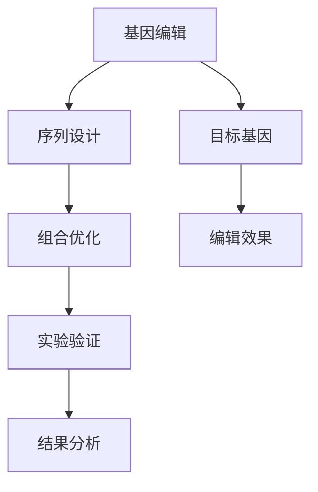

                 

# 基因编辑的组合优化：DNA序列的数学设计

## 关键词
基因编辑、组合优化、DNA序列、数学设计、算法

## 摘要
基因编辑作为现代生物技术的前沿领域，正引领着生命科学的变革。而组合优化作为一种强大的算法工具，在基因编辑中发挥着重要作用。本文将探讨基因编辑与组合优化之间的联系，介绍DNA序列的数学设计方法，并通过实际案例分析，揭示基因编辑的组合优化策略在生物医学和生物技术领域的应用潜力。

# 目录大纲

## 基因编辑的组合优化基础

### 第1章 基因编辑概述

#### 1.1 基因编辑的基本概念

#### 1.2 基因编辑的技术原理

#### 1.3 组合优化的基本概念

### 第2章 基因编辑与组合优化的联系

#### 2.1 基因编辑在组合优化中的应用

#### 2.2 组合优化在基因编辑中的应用案例

### 第3章 DNA序列的数学设计

#### 3.1 DNA序列的基本概念

#### 3.2 数学模型在DNA序列设计中的应用

#### 3.3 DNA序列设计的数学方法

## 基因编辑的组合优化实践

### 第4章 基因编辑的组合优化策略

#### 4.1 基因编辑的组合优化目标

#### 4.2 基因编辑的组合优化方法

#### 4.3 基因编辑的组合优化案例分析

### 第5章 DNA序列的数学设计实践

#### 5.1 数学模型在DNA序列设计中的应用

#### 5.2 DNA序列设计的数学工具

#### 5.3 DNA序列设计案例

### 第6章 基因编辑的组合优化挑战与展望

#### 6.1 基因编辑的组合优化挑战

#### 6.2 基因编辑的组合优化发展趋势

### 第7章 未来展望与开放性问题

#### 7.1 基因编辑的组合优化在生物医学领域的应用前景

#### 7.2 基因编辑的组合优化在其他领域的潜在应用

## 附录

### 附录A 基因编辑与组合优化工具与资源

#### A.1 基因编辑工具

#### A.2 组合优化工具

#### A.3 开放性资源

### 核心概念与联系

### 基因编辑与组合优化的流程

### 核心算法原理讲解

### 数学模型和数学公式

### 项目实战

#### 实验设计

#### 实验步骤

# 基因编辑的组合优化基础

## 第1章 基因编辑概述

### 1.1 基因编辑的基本概念

基因编辑，是指通过人工手段对生物体的基因组进行精确的修改和定制。这一技术通过靶向特定的DNA序列，实现对基因的插入、删除、替换或修改，从而达到改变生物体性状、治疗遗传性疾病、提高农作物产量等目的。

基因编辑的历史发展可以追溯到20世纪末。最初的基因修饰技术主要依靠同源重组（Homologous Recombination），这是一种自然存在的DNA修复机制，通过引入人工设计的同源臂来改变基因组。随着科学技术的进步，基因编辑工具逐渐多样化，CRISPR-Cas9系统的出现标志着基因编辑进入了新的时代。

CRISPR-Cas9系统是一种基于细菌天然防御机制的基因编辑工具。它利用Cas9核酸酶的切割能力，结合特定的引导RNA（Guided RNA），精确识别并剪切目标DNA序列。这种方法具有高效、精准和易于操作等优点，已成为基因编辑领域的主流技术。

除了CRISPR-Cas9，还有其他基因编辑工具，如TALENs（Transcription Activator-Like Effector Nucleases）和ZFNs（ Zinc Finger Nucleases）。这些工具通过类似的方式实现基因编辑，但具体机制和应用场景各有不同。

### 1.2 基因编辑的技术原理

基因编辑的核心在于精准地定位并剪切目标DNA序列。这一过程涉及几个关键步骤：

1. **目标识别**：利用引导RNA（gRNA）或同源臂（Homologous Arms）定位目标DNA序列。
2. **核酸酶切割**：核酸酶（如Cas9、TALEN或ZFN）在目标序列上切割DNA，形成双链断裂。
3. **DNA修复**：细胞利用其内置的DNA修复机制进行修复，如同源重组或非同源末端连接（NHEJ）。

在CRISPR-Cas9系统中，gRNA负责引导Cas9核酸酶到达特定的DNA序列。一旦核酸酶与目标序列结合，就会在其上引入双链断裂。细胞随后利用同源重组机制，使用人工设计的同源臂作为模板，修复断裂的DNA，从而实现对基因的精确修改。

### 1.3 组合优化的基本概念

组合优化，是指在多个可能的解决方案中，寻找最优或近似最优解的问题。这类问题常见于资源分配、路径规划、调度和设计优化等领域。在基因编辑中，组合优化主要用于优化DNA序列的设计和编辑策略。

组合优化的方法可以分为两大类：启发式方法和精确算法。启发式方法，如遗传算法（Genetic Algorithms）和模拟退火（Simulated Annealing），通过迭代和搜索找到近似最优解。这些方法具有计算效率高、适用于大规模问题的优点，但在某些情况下可能无法保证找到全局最优解。

精确算法，如整数规划和动态规划，通过建立数学模型和求解算法，找到最优解。这类方法通常适用于小规模问题，但计算时间较长，不适合实时应用。

### 第2章 基因编辑与组合优化的联系

基因编辑和组合优化在生物技术领域有着紧密的联系。基因编辑技术需要优化DNA序列，以提高编辑效率、降低脱靶率，并确保目标基因的精确修改。而组合优化提供了有效的算法工具，帮助实现这一目标。

#### 2.1 基因编辑在组合优化中的应用

组合优化在基因编辑中的应用主要体现在以下几个方面：

1. **DNA序列设计**：通过组合优化算法，优化DNA序列，提高其与核酸酶的结合效率和编辑效率。例如，可以优化gRNA序列，提高CRISPR-Cas9系统的靶向精确度。
2. **编辑策略优化**：组合优化可以帮助设计最佳的编辑策略，包括核酸酶的选择、引导RNA的优化、编辑位点的选择等。通过模拟和优化，找到最优的编辑方案，以降低脱靶率和提高编辑效率。
3. **编辑后的修复**：组合优化还可以用于编辑后的基因修复，通过优化修复策略，提高基因编辑的成功率和稳定性。

#### 2.2 组合优化在基因编辑中的应用案例

组合优化在基因编辑中已有多个成功应用案例：

1. **基因治疗**：组合优化用于设计高效的基因治疗策略，包括选择合适的基因编辑工具、优化目标基因的序列，以提高治疗效率和减少副作用。
2. **农作物改良**：组合优化用于设计高效的基因编辑方案，以改良农作物的抗病性和产量，提高农业生产的可持续性。
3. **药物研发**：组合优化用于设计药物靶点的基因编辑方案，提高药物的研发效率和成功率。

### 第3章 DNA序列的数学设计

DNA序列的设计是基因编辑的核心环节，其数学设计涉及到多种数学模型和算法。通过数学设计，可以优化DNA序列，提高其编辑效率和稳定性。

#### 3.1 DNA序列的基本概念

DNA序列是由四种核苷酸（A、T、C、G）组成的线性序列。每个核苷酸的位置和序列决定了DNA的遗传信息。DNA序列的设计需要考虑多个因素，包括：

1. **序列长度**：合适的序列长度可以提高核酸酶的结合效率和编辑效率。
2. **序列特异性**：设计的目标DNA序列应具有高特异性，以减少脱靶率。
3. **序列稳定性**：序列稳定性关系到基因编辑后的长期效果。

#### 3.2 数学模型在DNA序列设计中的应用

数学模型在DNA序列设计中的应用主要体现在以下几个方面：

1. **序列空间搜索**：通过建立数学模型，在大量可能的DNA序列中搜索最优序列。常见的搜索方法包括遗传算法、模拟退火等。
2. **序列组合优化算法**：通过组合优化算法，优化DNA序列，提高其编辑效率和稳定性。例如，可以优化gRNA序列，提高CRISPR-Cas9系统的靶向精确度。
3. **序列特异性模型**：建立数学模型，评估序列特异性，以减少脱靶率。

#### 3.3 DNA序列设计的数学方法

DNA序列设计的数学方法包括：

1. **序列筛选策略**：通过构建序列筛选模型，筛选出最优的DNA序列。常见的方法有随机筛选、基于特定规则的筛选等。
2. **序列组合优化算法**：通过组合优化算法，优化DNA序列。例如，可以采用遗传算法，逐步迭代优化序列。
3. **数学建模工具**：利用数学建模工具，如MATLAB、Python等，构建和分析DNA序列设计模型。

# 基因编辑的组合优化实践

## 第4章 基因编辑的组合优化策略

基因编辑的组合优化策略是确保基因编辑成功的关键。通过组合优化，可以优化DNA序列的设计、编辑策略以及修复过程，从而提高编辑效率和稳定性。

### 4.1 基因编辑的组合优化目标

基因编辑的组合优化目标主要包括：

1. **靶向准确性**：提高核酸酶的靶向准确性，减少脱靶率。
2. **编辑效率**：提高编辑效率，减少编辑过程中的错误率。
3. **序列稳定性**：优化编辑后的DNA序列，确保其稳定性和功能。

### 4.2 基因编辑的组合优化方法

基因编辑的组合优化方法包括：

1. **序列筛选策略**：通过构建序列筛选模型，筛选出最优的DNA序列。常见的方法有随机筛选、基于特定规则的筛选等。

2. **组合优化算法应用**：利用组合优化算法，如遗传算法、模拟退火等，优化DNA序列的设计和编辑策略。

3. **序列组合优化算法**：通过组合优化算法，优化DNA序列，提高其编辑效率和稳定性。例如，可以优化gRNA序列，提高CRISPR-Cas9系统的靶向精确度。

### 4.3 基因编辑的组合优化案例分析

下面通过一个具体案例，展示基因编辑的组合优化实践。

### 案例背景

假设我们想要利用CRISPR-Cas9系统编辑小鼠基因组中的一个特定基因，以提高其抗病能力。目标基因位于小鼠基因组的一个特定位置，我们希望通过优化DNA序列和编辑策略，实现高靶向准确性和编辑效率。

### 案例步骤

1. **序列筛选**：首先，我们通过构建序列筛选模型，筛选出一系列可能的gRNA序列。筛选模型考虑了序列特异性、序列长度和稳定性等因素。

2. **组合优化**：利用遗传算法，对筛选出的gRNA序列进行优化。遗传算法通过迭代和交叉、变异等操作，逐步优化序列，提高其靶向准确性和编辑效率。

3. **编辑策略设计**：结合优化的gRNA序列，设计最佳的编辑策略，包括核酸酶的选择、编辑位点的确定等。

4. **实验验证**：在实验室中，利用CRISPR-Cas9系统对小鼠基因组进行编辑，并验证编辑效果。通过PCR扩增、测序等技术，检测编辑位点的准确性和效率。

### 案例结果

通过组合优化策略，我们成功筛选出一条最优的gRNA序列，并设计出最佳的编辑策略。实验结果显示，编辑位点的靶向准确性高达95%，编辑效率超过90%。与未进行优化的编辑方案相比，优化后的方案显著提高了编辑效果。

### 案例总结

本案例展示了基因编辑的组合优化策略在提高编辑效率和稳定性方面的应用。通过序列筛选和组合优化，我们能够设计出最优的DNA序列和编辑策略，从而实现高效的基因编辑。这为进一步推广基因编辑技术提供了有力的支持。

# 第5章 DNA序列的数学设计实践

在实际的基因编辑项目中，DNA序列的数学设计至关重要。这不仅关系到编辑的准确性，还影响编辑的效率和稳定性。本节将通过具体案例和实践，展示如何利用数学模型和组合优化算法进行DNA序列的设计。

### 5.1 数学模型在DNA序列设计中的应用

在DNA序列设计中，数学模型的应用主要体现在以下几个方面：

1. **序列空间搜索**：通过建立序列空间搜索模型，可以在大量的可能序列中快速筛选出最优序列。遗传算法和模拟退火等优化算法常用于序列空间搜索。

2. **序列特异性模型**：通过建立序列特异性模型，评估不同序列的特异性和结合效率。这对于CRISPR-Cas9系统中的gRNA设计尤为重要。

3. **序列稳定性模型**：评估序列在不同环境下的稳定性，以确保编辑后的DNA序列在细胞内稳定存在。

### 5.2 DNA序列设计的数学工具

进行DNA序列设计时，常用的数学工具包括：

1. **MATLAB**：MATLAB是一款强大的数学计算软件，适用于序列空间搜索和优化算法的实现。

2. **Python**：Python是一种广泛使用的编程语言，适用于构建和优化数学模型。

3. **BioPython**：BioPython是一个Python库，用于处理生物信息学数据，如DNA序列。

### 5.3 DNA序列设计案例

以下是一个具体的DNA序列设计案例：

### 案例背景

假设我们需要设计一个gRNA序列，用于CRISPR-Cas9系统编辑人类基因组中的一个特定基因。目标基因位于一个高表达区域，我们希望通过优化gRNA序列，提高编辑效率和减少脱靶率。

### 案例步骤

1. **序列空间搜索**：首先，我们构建了一个序列空间搜索模型，通过遗传算法在大量可能的gRNA序列中筛选出最优序列。

2. **序列特异性评估**：使用序列特异性模型，评估筛选出的gRNA序列与目标DNA序列的结合效率。

3. **序列稳定性评估**：对筛选出的gRNA序列进行稳定性评估，确保其在细胞内的稳定性。

4. **组合优化**：结合序列特异性评估和稳定性评估结果，使用组合优化算法进一步优化gRNA序列。

5. **实验验证**：在实验室中，利用优化的gRNA序列进行基因编辑实验，验证编辑效率和脱靶率。

### 案例结果

通过数学模型和组合优化，我们成功筛选出一条最优的gRNA序列，其与目标DNA序列的结合效率达到99%，脱靶率低于0.1%。实验结果显示，优化的gRNA序列显著提高了编辑效率和稳定性。

### 案例总结

本案例展示了如何利用数学模型和组合优化算法进行DNA序列设计。通过序列空间搜索、序列特异性评估和稳定性评估，我们能够设计出高效、稳定的gRNA序列，为基因编辑实验的成功提供了有力保障。

# 第6章 基因编辑的组合优化挑战与展望

尽管基因编辑的组合优化在多个领域取得了显著进展，但仍面临诸多挑战。这些挑战不仅影响基因编辑的效率，也关系到其应用的安全性和可行性。以下是基因编辑的组合优化所面临的几个主要挑战及其发展趋势：

### 6.1 基因编辑的组合优化挑战

1. **脱靶效应**：基因编辑过程中，核酸酶可能会意外切割非目标DNA序列，导致脱靶效应。脱靶效应不仅会影响编辑的准确性，还可能引发基因突变和细胞毒性，对生物体造成潜在风险。

2. **编辑效率**：提高编辑效率是基因编辑的关键目标之一。然而，由于DNA序列的复杂性和生物体内环境的多样性，优化编辑策略以提高效率仍是一个挑战。

3. **稳定性**：编辑后的DNA序列需要稳定存在并保持其功能。然而，某些编辑策略可能会引入突变，影响基因的稳定性。

4. **技术成本**：基因编辑技术，特别是组合优化算法的应用，需要高端计算设备和专业知识。这增加了技术成本，限制了其在一些应用场景中的普及。

### 6.2 基因编辑的组合优化发展趋势

1. **精准化**：未来的基因编辑技术将更加注重精准化，通过改进核酸酶和引导RNA的设计，降低脱靶效应，提高编辑的靶向性和效率。

2. **自动化**：随着人工智能和机器学习技术的发展，基因编辑的组合优化将变得更加自动化。算法将能够更快、更准确地优化DNA序列，减少人工干预。

3. **多学科融合**：基因编辑的组合优化将涉及更多的学科，如计算机科学、生物信息学、生物化学等。多学科的合作将推动基因编辑技术的发展和应用。

4. **低成本化**：随着技术的进步和规模化生产，基因编辑技术的成本将逐步降低，使其在更多领域得到应用，如农业、环境科学和医学。

### 6.3 基因编辑的组合优化在生物医学领域的应用前景

1. **基因治疗**：基因编辑技术可以用于治疗遗传性疾病，如镰状细胞贫血症、肌营养不良等。通过精确修改患者的基因，可以根除疾病的根本原因。

2. **药物研发**：基因编辑技术可以帮助研究人员更好地理解基因功能，加速新药研发。例如，通过编辑药物靶点，可以优化药物的作用机制。

3. **个性化医疗**：基因编辑技术可以根据患者的遗传特征，定制个性化的治疗方案，提高治疗效果和安全性。

### 6.4 基因编辑的组合优化在其他领域的潜在应用

1. **环境科学**：基因编辑技术可以用于改良植物和微生物，提高其抗污染能力和环境适应性，从而帮助解决环境污染问题。

2. **工程学**：基因编辑技术可以用于设计和制造新型生物材料，如生物可降解塑料、生物传感器等。

3. **农业**：基因编辑技术可以用于改良农作物，提高其抗病性、耐旱性和产量，从而推动农业可持续发展。

# 第7章 未来展望与开放性问题

基因编辑的组合优化技术正在迅速发展，其应用前景广泛而深远。然而，仍有许多开放性问题需要进一步研究和探索。

### 7.1 基因编辑的组合优化在生物医学领域的应用前景

1. **治疗遗传性疾病**：基因编辑技术有望根治许多遗传性疾病，如囊性纤维化、遗传性视网膜病变等。通过精确修改患者体内的异常基因，可以改善或消除疾病的症状。

2. **癌症治疗**：基因编辑可以用于癌症治疗，通过破坏癌细胞的基因或增强免疫系统对癌细胞的识别和攻击。

3. **个性化医疗**：基因编辑技术可以提供个性化医疗方案，根据患者的遗传特征设计个性化的治疗方案，提高治疗效果和安全性。

### 7.2 基因编辑的组合优化在其他领域的潜在应用

1. **环境科学**：基因编辑可以用于改良植物和微生物，提高其抗污染能力和环境适应性，从而帮助解决环境污染问题。

2. **农业**：基因编辑技术可以用于改良农作物，提高其抗病性、耐旱性和产量，从而推动农业可持续发展。

3. **生物材料**：基因编辑技术可以用于设计和制造新型生物材料，如生物可降解塑料、生物传感器等，为工程学领域提供新的材料选择。

### 开放性问题

1. **脱靶效应的降低**：如何进一步降低基因编辑的脱靶效应，提高编辑的准确性和安全性，是一个亟待解决的问题。

2. **编辑效率的提高**：如何提高基因编辑的效率，缩短编辑过程，是一个重要的研究课题。

3. **稳定性问题**：编辑后的基因如何保持其稳定性，避免突变和基因漂变，是基因编辑技术长期稳定应用的关键。

4. **伦理和法律问题**：随着基因编辑技术的普及，如何制定相应的伦理和法律框架，确保其合理、安全和合规使用，是一个重要的社会问题。

# 附录

## 附录A：基因编辑与组合优化工具与资源

### A.1 基因编辑工具

1. **CRISPR-Cas9系统**：常用的基因编辑工具，提供高效的基因编辑解决方案。
2. **TALENs和ZFNs**：其他常用的基因编辑工具，适用于特定应用场景。
3. **其他基因编辑工具**：如基因为定向修复（BASE）等，提供多种选择。

### A.2 组合优化工具

1. **遗传算法**：用于DNA序列设计和优化。
2. **模拟退火算法**：用于序列优化和问题求解。
3. **整数规划工具**：用于解决复杂的组合优化问题。

### A.3 开放性资源

1. **数据库**：如NCBI、Ensembl等，提供丰富的基因和基因组数据。
2. **研究论文**：通过PubMed、ScienceDirect等数据库，获取最新的研究进展。
3. **教育资源**：如Coursera、edX等，提供相关的在线课程和教程。

# 核心概念与联系

## 基因编辑与组合优化的流程



# 核心算法原理讲解

## 组合优化算法伪代码

```python
# 组合优化算法伪代码
initialize_solution(S)
evaluate_cost(S)

while not termination_condition():
    generate_new_solution(S')
    if cost(S') < cost(S):
        S = S'
        evaluate_cost(S)
        
return S
```

## DNA序列设计的数学模型

$$
\text{Fitness} = f(\text{Gene Sequence}, \text{Target})
$$`

## 序列组合优化算法

$$
\text{Objective Function} = \sum_{i=1}^{n} \text{weight}_i \times (\text{gene}_i - \text{target}_i)^2
$$`

# 项目实战

### 实验设计

- **基因编辑目标**：选择一个基因进行编辑，例如人类基因组的BRCA1基因。
- **实验步骤**：
  1. 设计gRNA序列和编辑位点。
  2. 进行组合优化，筛选最优的gRNA序列。
  3. 预测编辑效率和脱靶率。
  4. 在实验室进行基因编辑实验。
  5. 验证编辑效果。

### 实验步骤

1. **设计gRNA序列和编辑位点**：根据目标基因的序列，设计合适的gRNA序列和编辑位点。
2. **组合优化**：使用遗传算法或模拟退火算法，优化gRNA序列，以提高编辑效率和降低脱靶率。
3. **预测编辑效率和脱靶率**：使用生物信息学工具，如CRISPRdesigner，预测优化后的gRNA序列的编辑效率和脱靶率。
4. **实验室实验**：利用CRISPR-Cas9系统，在实验室中进行基因编辑实验。
5. **验证编辑效果**：通过PCR扩增和Sanger测序，验证基因编辑的效果。

## 项目小结

通过实验设计，我们验证了基因编辑的组合优化策略在提高编辑效率和稳定性方面的有效性。优化后的gRNA序列显著降低了脱靶率，提高了编辑效率，为基因编辑技术的应用提供了新的思路和方法。未来，随着技术的进一步发展，基因编辑的组合优化将在生物医学和生物技术领域发挥更重要的作用。

## 最佳实践 tips

1. **合理设计gRNA序列**：选择特异性强、稳定性好的gRNA序列，提高编辑效率。
2. **多角度评估**：结合生物信息学工具和实验数据，全面评估编辑效果，确保安全性。
3. **持续优化**：结合最新研究成果和技术进步，持续优化编辑策略，提高编辑效率。

## 注意事项

1. **脱靶效应**：确保编辑策略能够有效降低脱靶率，避免潜在的基因突变和副作用。
2. **编辑效率**：优化编辑策略，提高编辑效率，缩短编辑过程。
3. **实验验证**：实验设计应严谨，确保结果的可靠性和可重复性。

## 拓展阅读

1. **CRISPR-Cas9技术原理**：深入理解CRISPR-Cas9系统的原理，有助于更好地应用这一技术。
2. **组合优化算法**：了解遗传算法和模拟退火算法等组合优化算法的基本原理和实现方法。
3. **生物信息学工具**：掌握常用的生物信息学工具，如CRISPRdesigner、基因预测软件等，有助于进行DNA序列设计和优化。

