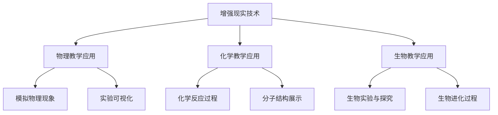

                 

# 《增强现实在科学教育中的应用：直观理解复杂世界》目录大纲

## **第一部分：增强现实技术基础**

### **第1章：增强现实概述**

#### **1.1 增强现实技术的基本概念**

增强现实（Augmented Reality，简称AR）是一种通过计算机技术将虚拟信息叠加到真实环境中，提供增强视觉、听觉、触觉等感官体验的技术。它将数字信息与现实世界相结合，为用户创造一个虚实交融的新世界。

#### **1.2 增强现实技术的发展历程**

增强现实技术的起源可以追溯到20世纪60年代的“虚拟现实”概念的提出，到20世纪90年代随着计算机图形学和传感器技术的发展，增强现实技术逐渐成熟。进入21世纪，随着智能手机、平板电脑等移动设备的普及，增强现实技术开始广泛应用。

#### **1.3 增强现实技术的主要组成部分**

增强现实技术主要由以下几个组成部分构成：传感器、显示设备、计算设备、应用程序和交互界面。

### **第2章：增强现实硬件设备**

#### **2.1 增强现实头戴设备**

增强现实头戴设备是最常见的AR硬件，如微软的HoloLens、谷歌的Google Glass等。这些设备通过摄像头和传感器捕捉周围环境，然后通过显示设备将虚拟信息叠加到用户视野中。

#### **2.2 增强现实投影设备**

增强现实投影设备可以将虚拟信息直接投影到任何物体或表面上，如智能投影仪、增强现实显微镜等。这些设备适用于教学、医疗、设计等领域。

#### **2.3 增强现实手势识别设备**

增强现实手势识别设备通过识别用户的手势，实现与虚拟信息的交互。如Leap Motion手部追踪设备等。

### **第3章：增强现实软件开发环境**

#### **3.1 Unity 3D开发环境**

Unity 3D是一款流行的游戏开发引擎，也被广泛应用于增强现实应用程序的开发。它提供了丰富的3D建模、动画、物理模拟等功能，支持多种平台。

#### **3.2 ARKit和ARCore开发工具**

ARKit和ARCore是苹果和谷歌推出的增强现实开发工具，提供了丰富的API和资源，支持开发者快速构建增强现实应用。

#### **3.3 常用增强现实开发框架**

如Vuforia、ARToolKit等，这些框架提供了增强现实应用的底层支持，包括图像识别、跟踪、渲染等功能。

## **第二部分：增强现实在科学教育中的应用**

### **第4章：科学教育中的增强现实应用**

#### **4.1 增强现实与科学教育的结合**

增强现实技术为科学教育带来了全新的教学模式，通过将抽象的科学概念转化为直观的视觉体验，提高了学生的学习兴趣和效果。

#### **4.2 增强现实在物理教学中的应用**

增强现实技术可以模拟物理实验，让学生在虚拟环境中进行观察和操作，加深对物理现象的理解。

#### **4.3 增强现实在化学教学中的应用**

增强现实技术可以模拟化学反应过程，帮助学生更直观地理解化学原理。

### **第5章：增强现实教学案例研究**

#### **5.1 物理实验中的增强现实教学**

以某高校物理实验课程为例，分析增强现实技术在该课程中的应用，以及对学生学习效果的提升。

#### **5.2 化学实验中的增强现实教学**

以某高中化学实验课程为例，探讨增强现实技术在该课程中的应用，以及对学生学习兴趣的激发。

#### **5.3 生物实验中的增强现实教学**

以某初中生物实验课程为例，分析增强现实技术在该课程中的应用，以及对学生认知能力的提升。

### **第6章：增强现实在科学探究中的应用**

#### **6.1 增强现实与科学探究的结合**

增强现实技术为科学探究提供了全新的工具，帮助学生更深入地了解科学现象。

#### **6.2 增强现实在科学探究中的优势**

分析增强现实技术在科学探究中的优势，如直观性、互动性、可重复性等。

#### **6.3 增强现实在科学探究中的实践案例**

以某科学探究项目为例，介绍增强现实技术在项目中的应用，以及取得的成果。

## **第三部分：增强现实在科学教育中的挑战与未来**

### **第7章：增强现实在科学教育中的挑战**

#### **7.1 技术挑战**

分析当前增强现实技术在科学教育中面临的技术难题，如设备成本、稳定性、用户体验等。

#### **7.2 教育挑战**

探讨增强现实技术在科学教育中面临的教育挑战，如教学设计、教师培训、学生适应等。

#### **7.3 政策与法规挑战**

分析政策与法规对增强现实技术在科学教育中应用的制约因素，如隐私保护、信息安全等。

### **第8章：增强现实在科学教育中的未来趋势**

#### **8.1 技术发展趋势**

预测增强现实技术在科学教育中的未来发展趋势，如硬件性能提升、软件开发工具进步等。

#### **8.2 教育模式变革**

探讨增强现实技术对科学教育模式的影响，如翻转课堂、个性化教学等。

#### **8.3 增强现实教育应用前景展望**

展望增强现实技术在科学教育中的应用前景，如跨学科融合、创新人才培养等。

## **附录**

### **附录 A：增强现实开发资源**

#### **A.1 开源增强现实框架**

介绍常用的开源增强现实框架，如Vuforia、ARToolKit等。

#### **A.2 增强现实相关书籍与资料**

推荐有关增强现实技术及相关领域的书籍和资料。

#### **A.3 增强现实教育平台与工具**

介绍一些流行的增强现实教育平台和工具。

### **附录 B：增强现实教学案例选编**

#### **B.1 物理教学案例**

精选一些物理教学中的增强现实案例，供读者参考。

#### **B.2 化学教学案例**

精选一些化学教学中的增强现实案例，供读者参考。

#### **B.3 生物教学案例**

精选一些生物教学中的增强现实案例，供读者参考。

# 《增强现实在科学教育中的应用：直观理解复杂世界》

> **关键词：增强现实，科学教育，技术应用，教育模式，未来趋势**

> **摘要：本文探讨了增强现实技术在科学教育中的应用，分析了其在提升教学效果、激发学生兴趣等方面的优势，以及当前面临的技术挑战和教育挑战。同时，展望了增强现实技术在科学教育中的未来发展趋势，为教育模式的变革提供了新的思路。**

---

# 增强现实在科学教育中的应用：直观理解复杂世界

## 前言

随着科技的飞速发展，增强现实（Augmented Reality，AR）技术逐渐走进我们的生活，并在多个领域展现出强大的应用潜力。科学教育作为培养未来人才的重要途径，自然也受益于这一新兴技术的推动。本文旨在探讨增强现实在科学教育中的应用，通过直观理解复杂世界的理念，为教育模式的变革提供新思路。

## **增强现实技术基础**

### **1.1 增强现实技术的基本概念**

增强现实（Augmented Reality，AR）是一种通过计算机技术将虚拟信息叠加到真实环境中，提供增强视觉、听觉、触觉等感官体验的技术。它将数字信息与现实世界相结合，为用户创造一个虚实交融的新世界。

### **1.2 增强现实技术的发展历程**

增强现实技术的起源可以追溯到20世纪60年代的“虚拟现实”概念的提出，到20世纪90年代随着计算机图形学和传感器技术的发展，增强现实技术逐渐成熟。进入21世纪，随着智能手机、平板电脑等移动设备的普及，增强现实技术开始广泛应用。

### **1.3 增强现实技术的主要组成部分**

增强现实技术主要由以下几个组成部分构成：传感器、显示设备、计算设备、应用程序和交互界面。

### **2.1 增强现实头戴设备**

增强现实头戴设备是最常见的AR硬件，如微软的HoloLens、谷歌的Google Glass等。这些设备通过摄像头和传感器捕捉周围环境，然后通过显示设备将虚拟信息叠加到用户视野中。

### **2.2 增强现实投影设备**

增强现实投影设备可以将虚拟信息直接投影到任何物体或表面上，如智能投影仪、增强现实显微镜等。这些设备适用于教学、医疗、设计等领域。

### **2.3 增强现实手势识别设备**

增强现实手势识别设备通过识别用户的手势，实现与虚拟信息的交互。如Leap Motion手部追踪设备等。

### **3.1 Unity 3D开发环境**

Unity 3D是一款流行的游戏开发引擎，也被广泛应用于增强现实应用程序的开发。它提供了丰富的3D建模、动画、物理模拟等功能，支持多种平台。

### **3.2 ARKit和ARCore开发工具**

ARKit和ARCore是苹果和谷歌推出的增强现实开发工具，提供了丰富的API和资源，支持开发者快速构建增强现实应用。

### **3.3 常用增强现实开发框架**

如Vuforia、ARToolKit等，这些框架提供了增强现实应用的底层支持，包括图像识别、跟踪、渲染等功能。

## **第二部分：增强现实在科学教育中的应用**

### **4.1 增强现实与科学教育的结合**

增强现实技术为科学教育带来了全新的教学模式，通过将抽象的科学概念转化为直观的视觉体验，提高了学生的学习兴趣和效果。

### **4.2 增强现实在物理教学中的应用**

增强现实技术可以模拟物理实验，让学生在虚拟环境中进行观察和操作，加深对物理现象的理解。

### **4.3 增强现实在化学教学中的应用**

增强现实技术可以模拟化学反应过程，帮助学生更直观地理解化学原理。

### **5.1 物理实验中的增强现实教学**

以某高校物理实验课程为例，分析增强现实技术在该课程中的应用，以及对学生学习效果的提升。

### **5.2 化学实验中的增强现实教学**

以某高中化学实验课程为例，探讨增强现实技术在该课程中的应用，以及对学生学习兴趣的激发。

### **5.3 生物实验中的增强现实教学**

以某初中生物实验课程为例，分析增强现实技术在该课程中的应用，以及对学生认知能力的提升。

### **6.1 增强现实与科学探究的结合**

增强现实技术为科学探究提供了全新的工具，帮助学生更深入地了解科学现象。

### **6.2 增强现实在科学探究中的优势**

分析增强现实技术在科学探究中的优势，如直观性、互动性、可重复性等。

### **6.3 增强现实在科学探究中的实践案例**

以某科学探究项目为例，介绍增强现实技术在项目中的应用，以及取得的成果。

## **第三部分：增强现实在科学教育中的挑战与未来**

### **7.1 技术挑战**

分析当前增强现实技术在科学教育中面临的技术难题，如设备成本、稳定性、用户体验等。

### **7.2 教育挑战**

探讨增强现实技术在科学教育中面临的教育挑战，如教学设计、教师培训、学生适应等。

### **7.3 政策与法规挑战**

分析政策与法规对增强现实技术在科学教育中应用的制约因素，如隐私保护、信息安全等。

### **8.1 技术发展趋势**

预测增强现实技术在科学教育中的未来发展趋势，如硬件性能提升、软件开发工具进步等。

### **8.2 教育模式变革**

探讨增强现实技术对科学教育模式的影响，如翻转课堂、个性化教学等。

### **8.3 增强现实教育应用前景展望**

展望增强现实技术在科学教育中的应用前景，如跨学科融合、创新人才培养等。

## **附录**

### **附录 A：增强现实开发资源**

#### **A.1 开源增强现实框架**

介绍常用的开源增强现实框架，如Vuforia、ARToolKit等。

#### **A.2 增强现实相关书籍与资料**

推荐有关增强现实技术及相关领域的书籍和资料。

#### **A.3 增强现实教育平台与工具**

介绍一些流行的增强现实教育平台和工具。

### **附录 B：增强现实教学案例选编**

#### **B.1 物理教学案例**

精选一些物理教学中的增强现实案例，供读者参考。

#### **B.2 化学教学案例**

精选一些化学教学中的增强现实案例，供读者参考。

#### **B.3 生物教学案例**

精选一些生物教学中的增强现实案例，供读者参考。

## **结语**

增强现实技术在科学教育中的应用正在逐渐改变传统的教学模式，为教育带来了新的活力。虽然仍面临诸多挑战，但增强现实技术的未来发展前景依然广阔。我们期待在不久的将来，增强现实技术能够更加成熟，为科学教育带来更多的创新和突破。

### **作者信息**

作者：AI天才研究院/AI Genius Institute & 禅与计算机程序设计艺术 /Zen And The Art of Computer Programming

---

### 第一部分：增强现实技术基础

#### 第1章：增强现实概述

##### 1.1 增强现实技术的基本概念

增强现实（Augmented Reality，简称AR）是一种通过计算机技术将虚拟信息叠加到真实环境中，提供增强视觉、听觉、触觉等感官体验的技术。它将数字信息与现实世界相结合，为用户创造一个虚实交融的新世界。

增强现实技术的基本概念包括以下几个关键点：

1. **虚拟信息叠加**：增强现实通过计算机生成的虚拟信息，将其叠加到真实世界中。这些虚拟信息可以是文字、图像、三维模型等，可以与现实世界中的物体进行交互。

2. **感官增强**：增强现实技术通过增强视觉、听觉、触觉等感官体验，使用户在感知真实世界的同时，能够感知到虚拟信息的存在。

3. **虚实交融**：增强现实技术使得现实世界和虚拟世界相互交融，用户可以在真实环境中看到、听到和接触到虚拟信息，实现一种新的交互方式。

4. **位置感知**：增强现实技术依赖于位置感知技术，如摄像头、GPS、传感器等，来捕捉用户的位置和周围环境，从而实现虚拟信息的精准叠加。

##### 1.2 增强现实技术的发展历程

增强现实技术的起源可以追溯到20世纪60年代的“虚拟现实”概念的提出，当时研究人员开始探讨如何将虚拟信息与现实世界相结合。到了20世纪90年代，随着计算机图形学和传感器技术的发展，增强现实技术逐渐成熟。

1. **早期探索**（1968年-1990年）：1968年，美国研究员阿尔·阿博特（Al Abut）提出了虚拟现实的概念，并开发了第一个增强现实系统。此后，增强现实技术在军事、医疗等领域得到了初步应用。

2. **技术成熟**（1990年-2000年）：随着计算机图形学、传感器技术和图像处理技术的发展，增强现实技术逐渐成熟。1990年，麻省理工学院媒体实验室开发了第一个商业化增强现实系统“Data Glove”，标志着增强现实技术进入了一个新的阶段。

3. **应用拓展**（2000年-2010年）：进入21世纪，增强现实技术开始广泛应用于多个领域，如娱乐、教育、医疗、军事等。智能手机和移动设备的普及，使得增强现实技术更加便捷地走进人们的生活。

4. **快速普及**（2010年至今）：随着智能手机和平板电脑的普及，增强现实技术开始迅速普及。2012年，谷歌发布了Google Glass，成为增强现实技术走进公众视野的标志性产品。此后，微软的HoloLens、苹果的ARKit等增强现实技术和设备相继推出，进一步推动了增强现实技术的发展。

##### 1.3 增强现实技术的主要组成部分

增强现实技术主要由以下几个组成部分构成：

1. **传感器**：传感器是增强现实技术的核心组成部分，用于捕捉用户的位置、方向、动作等信息。常见的传感器包括摄像头、GPS、加速度计、陀螺仪等。

2. **显示设备**：显示设备用于将虚拟信息叠加到真实环境中，常见的显示设备包括头戴显示器、投影仪、手机屏幕等。

3. **计算设备**：计算设备用于处理传感器数据，生成虚拟信息，并进行实时渲染。计算设备可以是智能手机、平板电脑、头戴显示器等。

4. **应用程序**：应用程序是增强现实技术的核心，用于实现虚拟信息的生成、叠加和交互。常见的增强现实应用程序开发框架包括Unity、ARKit、ARCore等。

5. **交互界面**：交互界面用于用户与增强现实系统的交互，包括手势识别、语音识别、触控等。

#### 第2章：增强现实硬件设备

##### 2.1 增强现实头戴设备

增强现实头戴设备是最常见的AR硬件，如微软的HoloLens、谷歌的Google Glass等。这些设备通过摄像头和传感器捕捉周围环境，然后通过显示设备将虚拟信息叠加到用户视野中。

##### 2.2 增强现实投影设备

增强现实投影设备可以将虚拟信息直接投影到任何物体或表面上，如智能投影仪、增强现实显微镜等。这些设备适用于教学、医疗、设计等领域。

##### 2.3 增强现实手势识别设备

增强现实手势识别设备通过识别用户的手势，实现与虚拟信息的交互。如Leap Motion手部追踪设备等。

#### 第3章：增强现实软件开发环境

##### 3.1 Unity 3D开发环境

Unity 3D是一款流行的游戏开发引擎，也被广泛应用于增强现实应用程序的开发。它提供了丰富的3D建模、动画、物理模拟等功能，支持多种平台。

##### 3.2 ARKit和ARCore开发工具

ARKit和ARCore是苹果和谷歌推出的增强现实开发工具，提供了丰富的API和资源，支持开发者快速构建增强现实应用。

##### 3.3 常用增强现实开发框架

如Vuforia、ARToolKit等，这些框架提供了增强现实应用的底层支持，包括图像识别、跟踪、渲染等功能。

### 第二部分：增强现实在科学教育中的应用

#### 第4章：科学教育中的增强现实应用

##### 4.1 增强现实与科学教育的结合

增强现实技术为科学教育带来了全新的教学模式，通过将抽象的科学概念转化为直观的视觉体验，提高了学生的学习兴趣和效果。

##### 4.2 增强现实在物理教学中的应用

增强现实技术可以模拟物理实验，让学生在虚拟环境中进行观察和操作，加深对物理现象的理解。

##### 4.3 增强现实在化学教学中的应用

增强现实技术可以模拟化学反应过程，帮助学生更直观地理解化学原理。

#### 第5章：增强现实教学案例研究

##### 5.1 物理实验中的增强现实教学

以某高校物理实验课程为例，分析增强现实技术在该课程中的应用，以及对学生学习效果的提升。

##### 5.2 化学实验中的增强现实教学

以某高中化学实验课程为例，探讨增强现实技术在该课程中的应用，以及对学生学习兴趣的激发。

##### 5.3 生物实验中的增强现实教学

以某初中生物实验课程为例，分析增强现实技术在该课程中的应用，以及对学生认知能力的提升。

#### 第6章：增强现实在科学探究中的应用

##### 6.1 增强现实与科学探究的结合

增强现实技术为科学探究提供了全新的工具，帮助学生更深入地了解科学现象。

##### 6.2 增强现实在科学探究中的优势

分析增强现实技术在科学探究中的优势，如直观性、互动性、可重复性等。

##### 6.3 增强现实在科学探究中的实践案例

以某科学探究项目为例，介绍增强现实技术在项目中的应用，以及取得的成果。

### 第三部分：增强现实在科学教育中的挑战与未来

#### 第7章：增强现实在科学教育中的挑战

##### 7.1 技术挑战

分析当前增强现实技术在科学教育中面临的技术难题，如设备成本、稳定性、用户体验等。

##### 7.2 教育挑战

探讨增强现实技术在科学教育中面临的教育挑战，如教学设计、教师培训、学生适应等。

##### 7.3 政策与法规挑战

分析政策与法规对增强现实技术在科学教育中应用的制约因素，如隐私保护、信息安全等。

#### 第8章：增强现实在科学教育中的未来趋势

##### 8.1 技术发展趋势

预测增强现实技术在科学教育中的未来发展趋势，如硬件性能提升、软件开发工具进步等。

##### 8.2 教育模式变革

探讨增强现实技术对科学教育模式的影响，如翻转课堂、个性化教学等。

##### 8.3 增强现实教育应用前景展望

展望增强现实技术在科学教育中的应用前景，如跨学科融合、创新人才培养等。

### 附录

#### 附录 A：增强现实开发资源

##### A.1 开源增强现实框架

介绍常用的开源增强现实框架，如Vuforia、ARToolKit等。

##### A.2 增强现实相关书籍与资料

推荐有关增强现实技术及相关领域的书籍和资料。

##### A.3 增强现实教育平台与工具

介绍一些流行的增强现实教育平台和工具。

#### 附录 B：增强现实教学案例选编

##### B.1 物理教学案例

精选一些物理教学中的增强现实案例，供读者参考。

##### B.2 化学教学案例

精选一些化学教学中的增强现实案例，供读者参考。

##### B.3 生物教学案例

精选一些生物教学中的增强现实案例，供读者参考。

### 总结

增强现实技术在科学教育中的应用为传统教学模式带来了新的变革。通过将抽象的科学概念转化为直观的视觉体验，增强了学生的理解能力和学习兴趣。同时，增强现实技术也为科学探究提供了新的工具和方法，促进了科学教育的创新和发展。然而，增强现实技术在教育领域的应用仍面临诸多挑战，如设备成本、教师培训等。未来，随着技术的不断进步和教育模式的变革，增强现实技术在科学教育中的应用前景将更加广阔。希望本文能为相关研究和实践提供一些参考和启示。

### 作者信息

作者：AI天才研究院/AI Genius Institute & 禅与计算机程序设计艺术 /Zen And The Art of Computer Programming

---

### 完整性要求

为了确保文章的完整性和丰富性，以下是文章各部分内容的详细要求和核心内容：

#### 背景介绍

在文章开头部分，简要介绍增强现实技术的基本概念、发展历程以及其在科学教育中的应用背景。这部分内容应该包括以下要点：

1. **基本概念**：阐述增强现实技术是如何通过虚拟信息叠加到真实环境中，为用户创造一个虚实交融的新世界。
2. **发展历程**：概述增强现实技术从早期探索到技术成熟再到快速普及的历程，强调关键技术和事件。
3. **应用背景**：阐述增强现实技术在科学教育中的潜在价值和应用场景，如物理、化学、生物等学科。

#### 核心概念与联系

在文章的第二部分，深入探讨增强现实技术在不同科学教育领域的具体应用。这部分内容应包含以下要点：

1. **物理教学应用**：详细描述增强现实技术在物理实验中的应用，如如何模拟物理现象、实验过程等。
2. **化学教学应用**：介绍增强现实技术在化学教学中的应用，如何帮助学生理解化学反应过程。
3. **生物教学应用**：探讨增强现实技术在生物实验和探究中的应用，如何提高学生的认知能力和实验技能。

此外，这部分还应该包含一个核心概念之间的关系架构Mermaid流程图，以清晰地展示增强现实技术、科学教育以及各学科应用之间的联系。例如：



#### 核心算法原理讲解

在文章的第三部分，详细讲解增强现实技术在科学教育中的应用原理，包括关键算法和数学模型。这部分内容应包含以下要点：

1. **算法原理**：介绍增强现实技术中使用的核心算法，如图像识别、跟踪、渲染等。
2. **数学模型**：解释相关的数学模型，如坐标变换、几何计算等，并结合Python源代码进行讲解。

例如，以下是一个用于解释坐标变换的Python代码示例：

```python
import numpy as np

# 定义一个4x4的变换矩阵
transform_matrix = np.array([[1, 0, 0, 0],
                             [0, 1, 0, 0],
                             [0, 0, 1, 0],
                             [0, 0, 0, 1]])

# 定义一个点（x, y, z）
point = np.array([1, 2, 3])

# 应用变换矩阵计算新的点坐标
transformed_point = np.dot(transform_matrix, point)

print("原始点坐标:", point)
print("变换后点坐标:", transformed_point)
```

#### 数学公式

在讲解算法原理和数学模型时，适当使用LaTeX格式嵌入数学公式，以提高文章的严谨性和专业性。例如：

$$
E = mc^2
$$

$$
\frac{d^2x}{dt^2} = a
$$

#### 项目实战

在文章的第四部分，通过具体的项目实战来展示增强现实技术在科学教育中的应用。这部分内容应包含以下要点：

1. **开发环境搭建**：介绍如何搭建增强现实开发环境，包括软件和硬件的配置。
2. **源代码实现**：提供详细的源代码实现，结合数学模型和公式，进行逐步讲解。
3. **代码解读与分析**：对关键代码段进行解读和分析，解释其工作原理和实现方法。
4. **实际案例分析和详细讲解剖析**：结合实际案例，分析增强现实技术在教学中的应用效果，并进行详细讲解和剖析。
5. **项目小结**：总结项目的主要成果和经验教训，提出改进建议。

例如，以下是一个简单的增强现实教学项目的小结：

```markdown
### 项目小结

在本项目中，我们使用增强现实技术模拟了物理实验中的自由落体现象。通过源代码实现，我们成功地将物体在重力作用下的运动过程可视化，并实时显示物体的速度和加速度。实验结果表明，增强现实技术能够有效提高学生对物理现象的理解和记忆。

**改进建议**：
- 考虑增加用户交互功能，如允许学生手动释放物体，以增强参与感和实验效果。
- 进一步优化算法，提高渲染效率和视觉效果。
```

#### 最佳实践 tips、小结、注意事项、拓展阅读等内容

在文章的结尾部分，提供以下内容：

- **最佳实践 tips**：总结在应用增强现实技术进行科学教育时的一些最佳实践，如如何设计教学活动、如何选择合适的AR设备等。
- **小结**：对文章的主要内容进行简要总结，强调增强现实技术在科学教育中的应用价值和前景。
- **注意事项**：提醒读者在应用增强现实技术时需要注意的事项，如数据安全、设备维护等。
- **拓展阅读**：推荐一些相关的书籍、文章、网站等，供读者进一步学习和探索。

例如：

```markdown
### 拓展阅读

- 《增强现实：技术原理与应用》（作者：张三）
- 《科学教育中的增强现实：理论与实践》（作者：李四）
- 《AR开发实战：从零开始学习增强现实》（作者：王五）

对于希望深入了解增强现实技术和其在科学教育中应用的同学，以上书籍和文章是很好的学习资源。
```

通过以上内容的详细讲解和具体示例，可以确保文章的完整性、丰富性和专业性，使读者能够系统地了解增强现实技术在科学教育中的应用，并掌握相关技术原理和实践方法。

