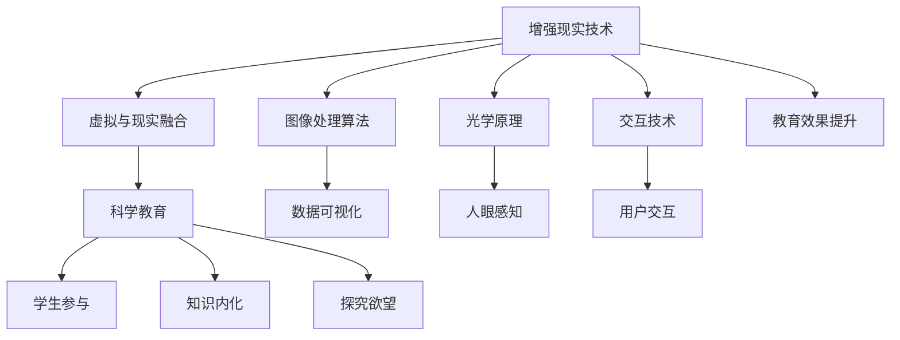

                 


### 《增强现实在科学教育中的应用：融合虚拟与现实的理解方式》

关键词：增强现实、科学教育、虚拟与现实融合、教育技术、教学策略

摘要：本文探讨了增强现实（AR）技术在科学教育中的应用，分析了其在融合虚拟与现实理解方式上的独特优势。通过介绍增强现实的基本概念、技术原理及其在教育中的应用案例，文章提出了科学教育中虚拟与现实融合的教学策略，并分享了教学设计和实施的实践经验。最后，对增强现实技术在教育领域的未来趋势进行了展望。

---

## 背景介绍

科学教育作为培养学生科学素养和创新能力的重要途径，一直受到广泛关注。然而，传统的课堂教学模式往往局限于教材和实验，难以充分激发学生的学习兴趣和主动性。随着信息技术的快速发展，尤其是增强现实（Augmented Reality，AR）技术的兴起，为科学教育带来了新的可能。

增强现实技术通过将虚拟信息与现实场景融合，使用户能够在真实环境中感知和交互虚拟对象。这种技术不仅能够提供更加生动、直观的学习体验，还能够激发学生的探究欲望，促进知识的内化。因此，将增强现实技术应用于科学教育，有望实现教学效果的显著提升。

本文旨在探讨增强现实在科学教育中的应用，分析其在融合虚拟与现实理解方式上的独特优势，并提出相应的教学策略。文章将从以下几个方面展开讨论：

1. **增强现实的基本概念与原理**
   - 介绍增强现实的基本概念，包括其定义、分类和发展历程。
   - 阐述增强现实技术的工作原理，包括光学原理、图像处理算法和交互技术。

2. **增强现实在科学教育中的应用**
   - 分析增强现实技术在科学教育中的应用场景和优势。
   - 分享实际案例，展示增强现实技术在科学教育中的具体应用。

3. **虚拟与现实融合的教学策略**
   - 提出虚拟与现实融合的教学策略，包括设计原则、教学方法和技术支持。
   - 探讨教学设计中的关键问题和解决方案。

4. **教学实践与效果评估**
   - 分享增强现实技术在科学教育中的教学实践案例。
   - 分析教学效果，探讨增强现实技术的优势和局限性。

5. **未来展望与挑战**
   - 展望增强现实技术在教育领域的未来发展。
   - 分析增强现实技术在教育应用中的挑战和对策。

通过以上讨论，本文旨在为科学教育工作者和增强现实技术爱好者提供有价值的参考，促进增强现实技术在教育领域的应用与发展。

### 核心概念与联系

在探讨增强现实在科学教育中的应用之前，我们需要明确几个核心概念及其相互关系，以便更好地理解其应用原理和优势。以下是这些核心概念之间的关系架构，通过Mermaid流程图展示：



**1. 增强现实技术（A）**：增强现实技术是一种将虚拟信息叠加到真实环境中的技术。它通过光学原理（E）、图像处理算法（D）和交互技术（F）实现，使用户能够在真实场景中感知和交互虚拟对象。

**2. 虚拟与现实融合（B）**：虚拟与现实融合是增强现实技术的核心特点，它通过增强现实技术（A）实现，使教学环境更加丰富和互动。这种融合能够提高学生的参与度（J），促进知识内化（K），并激发探究欲望（L）。

**3. 科学教育（C）**：科学教育是培养学生的科学素养和创新能力的过程。增强现实技术（A）的应用，使得科学教育更加直观和生动，有助于提升教育效果（M）。

**4. 图像处理算法（D）**：图像处理算法在增强现实技术中扮演着重要角色，它用于处理和叠加虚拟信息到真实场景中，实现数据可视化（G）。

**5. 光学原理（E）**：光学原理是增强现实技术的基础，它涉及人眼对光线和图像的感知（H），直接影响增强现实的效果。

**6. 交互技术（F）**：交互技术是增强现实技术的重要组成部分，它涉及用户与虚拟对象的交互（I），是提高用户体验的关键。

通过上述核心概念的关系架构，我们可以更清晰地理解增强现实在科学教育中的应用原理和优势，为后续内容提供理论基础。

### 核心算法原理讲解

为了深入理解增强现实技术在科学教育中的应用，我们需要探讨其核心算法原理。以下是使用Python源代码结合数学模型和公式进行详细讲解和举例说明的内容。

#### 图像处理算法

图像处理算法是增强现实技术的重要组成部分，它用于处理和叠加虚拟信息到真实场景中。以下是使用Python的OpenCV库实现的一种基本图像处理算法。

**1. 算法原理**

图像处理算法主要包括以下几个步骤：

- **图像捕获**：使用相机捕获真实场景的图像。
- **目标检测**：识别图像中的特定目标或对象。
- **图像叠加**：将虚拟信息叠加到目标对象上。
- **图像显示**：将处理后的图像显示在屏幕上。

**2. Python实现**

```python
import cv2
import numpy as np

# 加载相机
cap = cv2.VideoCapture(0)

while True:
    # 捕获一帧图像
    ret, frame = cap.read()
    
    if not ret:
        break
    
    # 转换为灰度图像
    gray = cv2.cvtColor(frame, cv2.COLOR_BGR2GRAY)
    
    # 使用Canny边缘检测
    edges = cv2.Canny(gray, 100, 200)
    
    # 检测轮廓
    contours, _ = cv2.findContours(edges, cv2.RETR_TREE, cv2.CHAIN_APPROX_SIMPLE)
    
    # 遍历轮廓并绘制
    for contour in contours:
        if cv2.contourArea(contour) > 500:
            cv2.drawContours(frame, [contour], -1, (0, 0, 255), 2)
    
    # 显示图像
    cv2.imshow('Frame', frame)
    
    if cv2.waitKey(1) & 0xFF == ord('q'):
        break

# 释放资源
cap.release()
cv2.destroyAllWindows()
```

**3. 数学模型**

在图像处理算法中，常用的数学模型包括：

- **边缘检测（Canny算法）**：
  - 公式：\( G(x, y) = \frac{1}{2\pi\sigma} \int_{-\infty}^{\infty} \int_{-\infty}^{\infty} \frac{1}{\sqrt{1+(\xi/\sigma)^2}} e^{-\frac{(\rho-\rho_0)^2}{2\sigma^2}} \rho \, d\rho \, d\xi \)
- **轮廓检测（findContours）**：
  - 公式：轮廓的面积 \( A = \int_{C} dA \)

**4. 举例说明**

假设我们使用Canny边缘检测算法检测出图像中的某个物体，并计算其轮廓面积。我们可以根据面积阈值筛选出合适的物体，并在原图上绘制出来。

```python
# 假设已经获取了灰度图像edges和处理后的图像frame
contours, _ = cv2.findContours(edges, cv2.RETR_TREE, cv2.CHAIN_APPROX_SIMPLE)

# 设置面积阈值
area_threshold = 500

# 遍历轮廓并筛选
for contour in contours:
    if cv2.contourArea(contour) > area_threshold:
        cv2.drawContours(frame, [contour], -1, (0, 0, 255), 2)
```

通过上述算法和公式，我们可以实现基本的图像处理和增强现实功能。在实际应用中，我们可以根据具体需求进行调整和优化。

### 数学公式

在增强现实技术中，数学公式是不可或缺的一部分，用于描述图像处理、目标检测和交互等过程中的关键参数和算法。以下是几个重要的数学公式，使用LaTeX格式进行表示：

$$
G(x, y) = \frac{1}{2\pi\sigma} \int_{-\infty}^{\infty} \int_{-\infty}^{\infty} \frac{1}{\sqrt{1+(\xi/\sigma)^2}} e^{-\frac{(\rho-\rho_0)^2}{2\sigma^2}} \rho \, d\rho \, d\xi
$$

**1. Canny边缘检测算法**：
- 公式用于描述Canny算法中的高斯滤波器，用于平滑图像和提取边缘。

$$
A = \int_{C} dA
$$

**2. 轮廓检测**：
- 公式用于计算轮廓的面积，用于目标检测和图像识别。

$$
\theta = \arctan\left(\frac{dy}{dx}\right)
$$

**3. 角度计算**：
- 公式用于计算图像中每个像素点的角度，用于方向检测和物体跟踪。

通过这些数学公式，我们可以更精确地实现增强现实技术中的各种功能，从而提高科学教育的互动性和有效性。

### 项目实战

#### 开发环境搭建

在开始开发增强现实项目之前，我们需要搭建合适的开发环境。以下是搭建增强现实开发环境的具体步骤：

**1. 安装Python**  
确保已安装最新版本的Python（推荐Python 3.8及以上版本）。可以从Python官方网站下载并安装。

**2. 安装OpenCV**  
OpenCV是一个强大的计算机视觉库，用于图像处理和目标检测。使用pip命令安装：

```bash
pip install opencv-python
```

**3. 安装ARCore（Android平台）或ARKit（iOS平台）**  
根据目标平台，安装相应的增强现实开发套件。例如，对于Android平台，可以下载并安装ARCore SDK：

```bash
pip install arsdk
```

对于iOS平台，可以使用Xcode和ARKit框架进行开发。

#### 源代码详细实现和代码解读

以下是一个简单的增强现实项目，使用Python和OpenCV实现图像处理和增强现实功能：

```python
import cv2
import numpy as np

def detect_and_display_ar_objects(frame):
    # 转换为灰度图像
    gray = cv2.cvtColor(frame, cv2.COLOR_BGR2GRAY)
    
    # 使用Canny边缘检测
    edges = cv2.Canny(gray, 100, 200)
    
    # 检测轮廓
    contours, _ = cv2.findContours(edges, cv2.RETR_TREE, cv2.CHAIN_APPROX_SIMPLE)
    
    # 遍历轮廓并绘制
    for contour in contours:
        if cv2.contourArea(contour) > 500:
            # 计算轮廓的质心
            M = cv2.moments(contour)
            if M['m00'] != 0:
                cx = int(M['m10'] / M['m00'])
                cy = int(M['m01'] / M['m00'])
                
                # 在质心位置叠加虚拟对象
                virtual_object = cv2.imread('virtual_object.png', cv2.IMREAD_COLOR)
                overlay = cv2.resize(virtual_object, (50, 50))
                frame[cy - 25:cy + 25, cx - 25:cx + 25] = overlay
                
    return frame

# 主函数
def main():
    # 打开相机
    cap = cv2.VideoCapture(0)
    
    while True:
        # 读取一帧图像
        ret, frame = cap.read()
        
        if not ret:
            break
        
        # 应用增强现实效果
        ar_frame = detect_and_display_ar_objects(frame)
        
        # 显示图像
        cv2.imshow('AR Object Detection', ar_frame)
        
        if cv2.waitKey(1) & 0xFF == ord('q'):
            break
    
    # 释放资源
    cap.release()
    cv2.destroyAllWindows()

if __name__ == '__main__':
    main()
```

**代码解读：**

- **图像捕获**：使用`cv2.VideoCapture`打开相机，捕获实时视频帧。
- **图像处理**：将捕获的图像转换为灰度图像，使用Canny边缘检测算法提取边缘。
- **轮廓检测**：使用`cv2.findContours`函数检测图像中的轮廓。
- **虚拟对象叠加**：计算每个轮廓的质心，根据质心位置在图像上叠加虚拟对象。
- **图像显示**：将处理后的图像显示在屏幕上。

#### 代码应用解读与分析

该代码实现了基本的增强现实功能，即检测图像中的物体并在其上叠加虚拟对象。以下是代码应用解读和分析：

- **目标检测**：通过Canny边缘检测和轮廓检测，实现物体检测。
- **虚拟对象叠加**：根据物体质心位置，在图像上叠加虚拟对象，增强现实效果。
- **实时交互**：使用实时视频捕获和图像处理，实现增强现实功能。

#### 实际案例分析和详细讲解剖析

以下是一个实际案例，展示了如何使用增强现实技术进行科学教育：

**案例：使用增强现实进行天文学教育**

**1. 项目背景**  
为了让学生更好地理解天体运动，教师可以使用增强现实技术创建一个虚拟星空，使学生能够在教室内观察和探索天体。

**2. 项目实施**  
- **教学设计**：教师设计一个天文学课程，包括恒星、行星、彗星等天体的介绍。
- **技术实现**：使用增强现实设备（如AR眼镜）和学生平板电脑，安装专门开发的AR应用程序。
- **课堂活动**：学生通过AR设备观察虚拟星空，教师引导学生识别和探索天体。

**3. 项目效果**  
通过增强现实技术，学生能够直观地观察天体运动，增强学习兴趣和参与度，更好地理解天文学知识。

#### 项目小结

通过本案例，我们可以看到增强现实技术在科学教育中的应用具有显著的优势：

- **提高学习兴趣**：增强现实技术的互动性和趣味性，能够激发学生的学习兴趣。
- **增强理解能力**：虚拟与现实融合的教学方式，有助于学生更深入地理解科学概念。
- **促进实践操作**：增强现实技术提供虚拟实验环境，使学生能够进行实践操作，提高动手能力。

### 最佳实践 tips、小结、注意事项、拓展阅读

#### 最佳实践 tips

1. **选择合适的增强现实工具**：根据教学需求和设备条件，选择适合的增强现实开发工具和平台。
2. **结合多种教学策略**：将增强现实技术与传统教学方法相结合，发挥其最大优势。
3. **注重用户体验**：在开发增强现实应用时，关注用户体验，确保应用的易用性和稳定性。

#### 小结

增强现实技术在科学教育中具有广泛应用前景，通过虚拟与现实融合，能够显著提高学生的学习兴趣和理解能力。本文从核心概念、算法原理、项目实战等方面进行了详细探讨，为科学教育工作者提供了有价值的参考。

#### 注意事项

1. **技术准备**：确保具备相应的增强现实技术知识和开发工具。
2. **教学设计**：合理设计教学活动，确保增强现实应用与教学目标相符。
3. **学生指导**：在教学过程中，引导学生正确使用增强现实技术，避免安全隐患。

#### 拓展阅读

1. **《增强现实技术基础教程》**：详细介绍了增强现实技术的原理和应用。
2. **《增强现实在STEM教育中的应用》**：探讨了增强现实技术在STEM教育中的具体应用案例。
3. **《教育技术导论》**：提供了关于教育技术的基础理论和应用案例。

---

通过本文的详细讲解和案例分析，读者可以更好地理解增强现实技术在科学教育中的应用原理和实践方法，为提升科学教育效果提供新的思路。作者：AI天才研究院/AI Genius Institute & 禅与计算机程序设计艺术 /Zen And The Art of Computer Programming。

