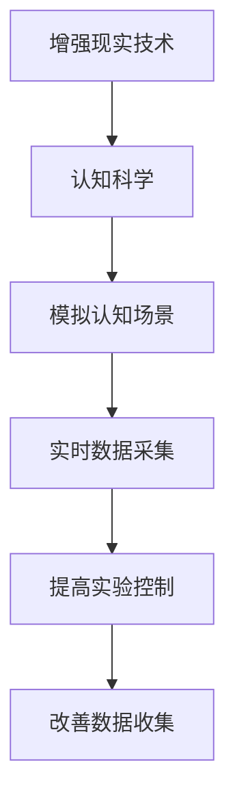

                 

### 《增强现实技术对世界可理解性的拓展作用》目录大纲

## 增强现实技术对世界可理解性的拓展作用

### 关键词：
增强现实（AR）、世界可理解性、认知科学、教育、医疗、应用案例

### 摘要：
本文旨在探讨增强现实技术（AR）对世界可理解性的拓展作用。首先，文章介绍了增强现实技术的基础知识，包括其发展历程、基本原理和核心组成部分。接着，文章分析了增强现实技术在世界可理解性中的具体应用，重点关注其在教育和医疗领域的积极影响。通过详细的应用案例，本文展示了增强现实技术如何提升教育效果和医疗质量，并讨论了其在未来面临的挑战和机遇。最后，文章提供了增强现实技术的资源与工具推荐，为读者进一步学习和实践提供指导。

## 第一部分：增强现实技术基础

### 1. 增强现实技术概述

#### 1.1 增强现实技术的发展历程

增强现实技术（Augmented Reality，简称AR）起源于20世纪60年代的虚拟现实研究。当时，美国科学家伊凡·苏瑟兰（Ivan Sutherland）在1968年创建了世界上第一个头戴式显示器，这一发明标志着增强现实技术的诞生。随着时间的推移，增强现实技术经历了多个发展阶段。

在20世纪80年代，随着计算机图形学和人工智能技术的发展，增强现实技术逐渐从实验室走向实际应用。例如，日本任天堂公司在1985年推出了世界上第一款增强现实游戏《红白机》，这款游戏开启了增强现实技术在娱乐领域的应用。

进入21世纪，随着移动设备的普及和无线通信技术的进步，增强现实技术迎来了快速发展。2009年，谷歌公司推出了第一款增强现实眼镜Google Glass，这款产品引起了广泛关注，推动了增强现实技术的商业化应用。

近年来，随着5G网络的普及和人工智能技术的进步，增强现实技术进入了一个全新的发展阶段。各类增强现实应用层出不穷，从教育、医疗、到工业制造、军事等领域，都展现出了强大的应用潜力。

#### 1.2 增强现实技术的基本原理

增强现实技术的基本原理是将虚拟信息与现实世界融合，为用户带来沉浸式的体验。这一过程主要包括以下几个步骤：

1. **感知**：通过摄像头、传感器等设备捕捉现实世界的图像和声音。
2. **处理**：利用计算机图形学和图像处理技术对捕获的图像进行处理，提取出场景中的关键信息。
3. **融合**：将虚拟信息与现实世界的图像进行融合，生成增强现实的图像。
4. **显示**：通过显示设备将增强现实图像呈现给用户。

增强现实技术的核心组成部分包括：
- **显示设备**：如头戴式显示器、智能手机屏幕等。
- **感知设备**：如摄像头、传感器等。
- **处理设备**：如计算机、处理器等。
- **交互设备**：如手柄、手势控制等。

#### 1.3 增强现实技术的核心组成部分

增强现实技术的核心组成部分包括显示设备、感知设备、处理设备和交互设备。以下是每个组成部分的功能和作用：

1. **显示设备**：用于将增强现实图像呈现给用户。常见的显示设备包括头戴式显示器、智能手机屏幕、投影仪等。
2. **感知设备**：用于捕捉现实世界的图像和声音。常见的感知设备包括摄像头、麦克风、传感器等。
3. **处理设备**：用于处理捕获的图像和声音，提取出场景中的关键信息。常见的处理设备包括计算机、处理器等。
4. **交互设备**：用于用户与增强现实环境进行交互。常见的交互设备包括手柄、手势控制等。

## 第二部分：增强现实技术在世界可理解性中的作用

### 2.1 增强现实技术与认知科学的关系

认知科学是研究人类思维过程和心理活动的科学，而增强现实技术为认知科学研究提供了新的手段。通过增强现实技术，研究者可以模拟出各种认知场景，观察和分析人类在特定情境下的认知过程。例如，通过增强现实技术，研究者可以模拟出复杂的交通场景，观察驾驶者在面对不同交通状况时的反应和行为。

此外，增强现实技术还可以帮助研究者了解人类记忆、注意力和决策等认知功能。例如，通过增强现实技术，研究者可以模拟出记忆任务，观察受试者在记忆过程中的表现，并分析记忆效果。同样，通过增强现实技术，研究者可以模拟出注意力任务，观察受试者在注意力分散和集中状态下的表现，并分析注意力对任务完成的影响。

#### 2.2 增强现实技术在教育中的应用

增强现实技术在教育中的应用潜力巨大，可以显著提升教育效果和学生的学习兴趣。以下是一些增强现实技术在教育中的应用案例：

1. **虚拟实验室**：通过增强现实技术，学生可以进入虚拟实验室进行实验操作，无需实际接触实验设备。例如，在物理课堂上，学生可以通过增强现实技术模拟出各种物理现象，如电荷分布、磁场变化等，从而更好地理解物理原理。
2. **历史重现**：通过增强现实技术，学生可以穿越到历史场景，亲身体验历史事件。例如，在历史课上，学生可以通过增强现实技术参观古埃及的文明遗址，了解古埃及的文化和历史背景。
3. **地理教学**：通过增强现实技术，学生可以直观地观察地球的地理现象，如山脉、河流、气候等。例如，在地理课上，学生可以通过增强现实技术模拟出全球气候变暖的影响，了解气候变化对地球生态系统的影响。

#### 2.3 增强现实技术在医疗领域的拓展

增强现实技术在医疗领域具有广泛的应用前景，可以显著提升医疗服务质量和效率。以下是一些增强现实技术在医疗领域的应用案例：

1. **医学教育**：通过增强现实技术，医学生和医生可以模拟各种手术操作，提高手术技能和操作熟练度。例如，在医学教育中，学生可以通过增强现实技术模拟出心脏手术的整个过程，从而更好地理解手术步骤和操作要点。
2. **手术辅助**：通过增强现实技术，医生可以在手术过程中实时查看患者体内的图像，提高手术精准度。例如，在心脏手术中，医生可以通过增强现实技术实时查看患者心脏的结构和病变情况，从而制定更精确的手术方案。
3. **康复治疗**：通过增强现实技术，患者可以接受更加个性化的康复治疗。例如，在康复治疗中，患者可以通过增强现实技术进行模拟训练，提高康复效果。

## 第三部分：增强现实技术的应用案例

### 3. 增强现实技术在教育中的应用

#### 3.1 增强现实技术在课堂教育中的应用

增强现实技术在课堂教育中的应用可以为学生提供更加直观、生动的学习体验。以下是一些增强现实技术在课堂教育中的应用案例：

1. **互动式教学**：通过增强现实技术，教师可以创建互动性强的教学内容，激发学生的学习兴趣。例如，在数学课上，教师可以使用增强现实技术创建三维图形，帮助学生更好地理解几何概念。
2. **虚拟实验**：通过增强现实技术，学生可以在虚拟环境中进行实验操作，无需实际接触实验设备。例如，在物理课上，学生可以通过增强现实技术模拟出各种物理现象，如电荷分布、磁场变化等，从而更好地理解物理原理。
3. **情景教学**：通过增强现实技术，教师可以模拟出各种情境，帮助学生更好地理解抽象概念。例如，在历史课上，教师可以使用增强现实技术创建历史场景，让学生亲身体验历史事件。

#### 3.2 增强现实技术在远程教育中的应用

增强现实技术在远程教育中的应用可以为学习者提供更加个性化和互动的学习体验。以下是一些增强现实技术在远程教育中的应用案例：

1. **虚拟课堂**：通过增强现实技术，远程学习者可以感受到身临其境的课堂氛围，与教师和其他学生进行实时互动。例如，通过增强现实技术，远程学习者可以在虚拟课堂上提问、讨论，参与课堂活动。
2. **个性化学习**：通过增强现实技术，学习者可以根据自己的学习需求和进度，选择适合的学习内容和方式。例如，通过增强现实技术，学习者可以选择不同的学习路径，进行个性化的学习。
3. **互动式课程**：通过增强现实技术，远程教育课程可以更加互动和生动。例如，通过增强现实技术，教师可以在课程中引入增强现实图像、动画等元素，提高学生的学习兴趣和参与度。

#### 3.3 增强现实技术在个性化学习中的应用

增强现实技术在个性化学习中的应用可以为学习者提供更加定制化的学习体验。以下是一些增强现实技术在个性化学习中的应用案例：

1. **学习路径定制**：通过增强现实技术，学习者可以根据自己的学习需求和进度，定制个性化的学习路径。例如，通过增强现实技术，学习者可以选择不同的学习内容、难度和进度，从而实现个性化学习。
2. **虚拟辅导**：通过增强现实技术，学习者可以随时随地接受虚拟辅导，解决学习中的问题。例如，通过增强现实技术，学习者可以在虚拟环境中与导师进行实时互动，获得专业的指导和帮助。
3. **智能学习助手**：通过增强现实技术，智能学习助手可以实时分析学习者的学习行为和表现，提供个性化的学习建议和反馈。例如，通过增强现实技术，智能学习助手可以根据学习者的学习情况，推荐适合的学习资源和练习题目，帮助学习者提高学习效果。

### 4. 增强现实技术在医疗领域的应用

#### 4.1 增强现实技术在医学教育中的应用

增强现实技术在医学教育中的应用可以帮助医学生和医生提高专业技能和操作熟练度。以下是一些增强现实技术在医学教育中的应用案例：

1. **虚拟手术训练**：通过增强现实技术，医学生可以在虚拟环境中进行手术训练，模拟真实的手术过程。例如，通过增强现实技术，医学生可以在虚拟环境中练习心脏手术、神经外科手术等复杂手术，提高手术技能和操作熟练度。
2. **解剖学教学**：通过增强现实技术，医学生可以直观地观察人体解剖结构，加深对解剖学的理解。例如，通过增强现实技术，医学生可以使用虚拟解剖模型，观察人体内部的器官和血管，了解人体结构和功能。
3. **病例讨论**：通过增强现实技术，医学生和医生可以共同讨论真实的病例，提高诊断和治疗能力。例如，通过增强现实技术，医学生和医生可以在虚拟环境中讨论复杂的病例，分享经验和见解，提高临床思维和决策能力。

#### 4.2 增强现实技术在手术辅助中的应用

增强现实技术在手术辅助中的应用可以帮助医生提高手术精准度和成功率。以下是一些增强现实技术在手术辅助中的应用案例：

1. **手术导航**：通过增强现实技术，医生可以在手术过程中实时查看患者体内的图像，提高手术精准度。例如，在心脏手术中，医生可以通过增强现实技术实时查看患者心脏的结构和病变情况，从而制定更精确的手术方案。
2. **虚拟助手**：通过增强现实技术，医生可以获得虚拟助手的帮助，提高手术效率。例如，在手术中，医生可以通过增强现实技术获取实时手术指导，了解手术步骤和注意事项，从而提高手术成功率。
3. **手术记录**：通过增强现实技术，医生可以记录手术过程，为后续分析和学习提供参考。例如，在手术结束后，医生可以通过增强现实技术回顾手术过程，分析手术中的优点和不足，为今后的手术提供参考。

#### 4.3 增强现实技术在康复治疗中的应用

增强现实技术在康复治疗中的应用可以帮助患者提高康复效果和信心。以下是一些增强现实技术在康复治疗中的应用案例：

1. **康复训练**：通过增强现实技术，患者可以在虚拟环境中进行康复训练，提高康复效果。例如，在康复训练中，患者可以通过增强现实技术模拟行走、跑步等运动，提高运动技能和耐力。
2. **心理治疗**：通过增强现实技术，患者可以在虚拟环境中进行心理治疗，缓解心理压力。例如，在心理治疗中，患者可以通过增强现实技术进入虚拟森林、海滩等放松场景，缓解焦虑和抑郁情绪。
3. **康复反馈**：通过增强现实技术，医生可以实时监测患者的康复进展，为后续治疗提供参考。例如，在康复治疗中，医生可以通过增强现实技术查看患者的康复数据，了解患者的康复情况，从而制定更有效的康复计划。

## 第四部分：增强现实技术的挑战与未来展望

### 5. 增强现实技术的挑战

#### 5.1 技术层面的挑战

增强现实技术的发展面临着多个技术层面的挑战，主要包括以下几个方面：

1. **显示技术**：目前增强现实显示技术尚不完善，显示效果和分辨率有待提高。此外，增强现实设备的重量和体积较大，佩戴舒适度较低，限制了其广泛应用。
2. **处理能力**：增强现实技术需要强大的计算能力，以处理大量的图像和数据处理任务。然而，现有的计算设备处理能力有限，难以满足增强现实技术的要求。
3. **交互方式**：目前的增强现实交互方式主要包括触摸屏、手势控制和语音控制等，这些交互方式仍存在一定的局限性，难以实现高效的人机交互。

#### 5.2 应用层面的挑战

增强现实技术在应用层面也面临着一系列挑战，主要包括以下几个方面：

1. **用户体验**：增强现实应用需要提供高质量的用户体验，包括图像质量、响应速度和交互体验等。然而，现有的增强现实应用往往无法满足用户的期望。
2. **内容创作**：增强现实内容创作是一个复杂的过程，需要专业的技能和工具。目前，增强现实内容创作仍然是一个相对封闭的领域，限制了增强现实技术的普及和应用。
3. **商业模式**：增强现实技术尚未形成成熟的商业模式，许多企业难以找到盈利点，限制了增强现实技术的商业化进程。

#### 5.3 法律与伦理层面的挑战

增强现实技术在使用过程中也面临着法律和伦理层面的挑战，主要包括以下几个方面：

1. **隐私保护**：增强现实技术涉及到用户隐私的保护问题，如用户数据的收集、存储和使用等。如果处理不当，可能会对用户隐私造成侵害。
2. **安全风险**：增强现实技术可能存在安全风险，如增强现实设备被黑客攻击、用户数据泄露等。这些问题需要引起重视，并采取相应的安全措施。
3. **伦理争议**：增强现实技术在某些应用场景中可能引发伦理争议，如虚拟现实中的暴力内容、增强现实医疗应用中的道德问题等。这些问题需要社会各界的关注和讨论。

### 6. 增强现实技术的未来发展趋势

尽管增强现实技术面临着诸多挑战，但未来其发展前景仍然十分广阔。以下是一些增强现实技术的未来发展趋势：

#### 6.1 技术创新的方向

1. **显示技术**：未来增强现实显示技术将朝着高分辨率、轻薄化、高舒适度的方向发展。例如，光学投影显示技术、全息显示技术等新型显示技术有望得到广泛应用。
2. **计算能力**：随着人工智能、云计算等技术的发展，增强现实计算能力将得到大幅提升，从而提高增强现实应用的性能和效率。
3. **交互方式**：未来的增强现实交互方式将更加自然和高效，如眼动追踪、脑机接口等新型交互方式有望得到广泛应用。

#### 6.2 行业应用的前景

增强现实技术将在各个行业领域得到广泛应用，包括但不限于以下几个方面：

1. **教育**：增强现实技术在教育领域的应用前景广阔，可以提升教育质量、丰富教学内容。
2. **医疗**：增强现实技术在医疗领域的应用可以为医生提供更加精准的诊断和治疗手段，提高医疗服务的效率和质量。
3. **娱乐**：增强现实技术在娱乐领域的应用可以创造全新的娱乐体验，为用户带来更加沉浸式的娱乐体验。

#### 6.3 社会影响与未来展望

增强现实技术的发展将对社会产生深远的影响，包括以下几个方面：

1. **教育变革**：增强现实技术将改变传统教育的教学模式，为学生提供更加个性化、互动化的学习体验。
2. **医疗创新**：增强现实技术将推动医疗领域的创新，为患者提供更加精准、高效的医疗服务。
3. **社会融合**：增强现实技术将促进社会的融合和发展，为不同地区、不同群体的人提供平等的机会和资源。

## 附录：增强现实技术资源与工具

### 7. 增强现实技术资源与工具推荐

#### 7.1 开发平台与工具

1. **Unity**：Unity是一款功能强大的游戏引擎，支持增强现实应用的开发。它提供了丰富的增强现实开发工具和资源，适用于各种增强现实应用的开发。
2. **ARKit**：ARKit是苹果公司推出的一款增强现实开发框架，适用于iOS平台。它提供了强大的增强现实功能，包括场景感知、物体识别等。
3. **ARCore**：ARCore是谷歌公司推出的一款增强现实开发框架，适用于Android平台。它提供了丰富的增强现实功能，包括场景感知、物体识别等。

#### 7.2 开源框架与库

1. **AR.js**：AR.js是一款基于Web的增强现实框架，支持各种Web浏览器。它提供了简单易用的增强现实功能，适用于各种增强现实应用的开发。
2. **Vuforia**：Vuforia是一款功能强大的增强现实开发框架，适用于各种平台。它提供了丰富的增强现实功能，包括物体识别、场景感知等。
3. **A-Frame**：A-Frame是一款基于Web的增强现实框架，支持WebVR和WebGL。它提供了简单易用的增强现实功能，适用于各种增强现实应用的开发。

#### 7.3 专业期刊与会议

1. **ACM Transactions on Graphics**：这是一本专注于计算机图形学、增强现实等领域的研究期刊，提供了丰富的增强现实相关研究论文。
2. **IEEE Transactions on Visualization and Computer Graphics**：这是一本专注于计算机视觉、增强现实等领域的研究期刊，提供了丰富的增强现实相关研究论文。
3. **ACM International Conference on Interactive 3D and Virtual Technologies**：这是一本专注于增强现实、虚拟现实等领域的研究会议，提供了丰富的增强现实相关研究成果和交流平台。

## 作者信息

作者：AI天才研究院/AI Genius Institute & 禅与计算机程序设计艺术 /Zen And The Art of Computer Programming

## 结论

增强现实技术作为一种新兴技术，对世界可理解性的拓展作用日益凸显。通过提升教育效果和医疗质量，增强现实技术为人们提供了更加直观、生动的认知体验。然而，增强现实技术仍面临诸多挑战，包括技术、应用和法律与伦理等方面。未来，随着技术的不断创新和应用领域的拓展，增强现实技术有望在更多领域发挥重要作用，为人类社会带来更多的便利和创新。## 第一部分：增强现实技术基础

增强现实技术（AR）是一种将虚拟信息与现实世界相结合的交互技术，它通过在真实环境中叠加计算机生成的视觉、听觉、触觉等信息，为用户提供了丰富的沉浸式体验。本部分将详细介绍增强现实技术的基础知识，包括其发展历程、基本原理、核心组成部分以及与认知科学的关系。

### 1.1 增强现实技术的发展历程

增强现实技术的概念最早可以追溯到1968年，由美国计算机科学家伊凡·苏瑟兰（Ivan Sutherland）提出。他发明了世界上第一个头戴式显示器（Head-Mounted Display，HMD），这标志着增强现实技术的诞生。此后，增强现实技术经历了数十年的研究和探索，从实验室阶段逐渐走向实际应用。

在20世纪80年代，随着计算机图形学和人工智能技术的发展，增强现实技术开始应用于军事和工业领域。其中，美国军事研究部门研发的增强现实系统（如F绍兴罩系统）在战斗机和直升机飞行员中得到了应用。

进入21世纪，随着移动设备的普及和无线通信技术的进步，增强现实技术迎来了快速发展。2009年，谷歌推出了第一款增强现实眼镜Google Glass，这款产品引发了广泛关注，标志着增强现实技术走向商业化应用。

近年来，随着5G网络和人工智能技术的进一步发展，增强现实技术进入了一个新的发展阶段。虚拟现实（VR）和增强现实（AR）技术的融合，为用户提供更加逼真的沉浸式体验。此外，智能手机和平板电脑等设备的普及，使得增强现实应用更加便捷和普及。

### 1.2 增强现实技术的基本原理

增强现实技术的基本原理是将虚拟信息与现实世界融合，从而为用户带来沉浸式的体验。这一过程主要包括以下几个步骤：

1. **感知**：通过摄像头、传感器等设备捕捉现实世界的图像和声音。
2. **处理**：利用计算机图形学和图像处理技术对捕获的图像进行处理，提取出场景中的关键信息。
3. **融合**：将虚拟信息与现实世界的图像进行融合，生成增强现实的图像。
4. **显示**：通过显示设备将增强现实图像呈现给用户。

增强现实技术的核心组成部分包括显示设备、感知设备、处理设备和交互设备。

- **显示设备**：用于将增强现实图像呈现给用户，如头戴式显示器、智能手机屏幕等。
- **感知设备**：用于捕捉现实世界的图像和声音，如摄像头、传感器等。
- **处理设备**：用于处理捕获的图像和声音，提取出场景中的关键信息，如计算机、处理器等。
- **交互设备**：用于用户与增强现实环境进行交互，如手柄、手势控制等。

### 1.3 增强现实技术的核心组成部分

增强现实技术的核心组成部分包括显示设备、感知设备、处理设备和交互设备。以下是每个组成部分的功能和作用：

1. **显示设备**：用于将增强现实图像呈现给用户。常见的显示设备包括头戴式显示器、智能手机屏幕、投影仪等。头戴式显示器能够提供沉浸式体验，但体积较大，不便携带；智能手机屏幕则更便携，但显示效果相对有限。

2. **感知设备**：用于捕捉现实世界的图像和声音。常见的感知设备包括摄像头、传感器等。摄像头用于捕捉场景图像，传感器（如加速度传感器、陀螺仪等）用于感知用户的运动和位置信息。

3. **处理设备**：用于处理捕获的图像和声音，提取出场景中的关键信息。处理设备通常包括计算机、处理器等，负责执行图像处理、场景理解等任务。处理设备的性能直接影响增强现实应用的实时性和稳定性。

4. **交互设备**：用于用户与增强现实环境进行交互。常见的交互设备包括手柄、手势控制等。手柄提供传统的交互方式，适用于某些特定的应用场景；手势控制则更加自然和直观，但技术实现较为复杂。

### 1.4 增强现实技术与认知科学的关系

认知科学是研究人类思维过程和心理活动的科学，而增强现实技术为认知科学研究提供了新的手段。通过增强现实技术，研究者可以模拟出各种认知场景，观察和分析人类在特定情境下的认知过程。例如，通过增强现实技术，研究者可以模拟出复杂的交通场景，观察驾驶者在面对不同交通状况时的反应和行为。

增强现实技术还可以帮助研究者了解人类记忆、注意力和决策等认知功能。例如，通过增强现实技术，研究者可以模拟出记忆任务，观察受试者在记忆过程中的表现，并分析记忆效果。同样，通过增强现实技术，研究者可以模拟出注意力任务，观察受试者在注意力分散和集中状态下的表现，并分析注意力对任务完成的影响。

此外，增强现实技术还可以用于认知障碍的治疗和康复。例如，通过增强现实技术，患者可以进行认知训练，提高记忆、注意力和决策能力。增强现实技术为认知科学研究提供了新的工具和手段，有助于揭示人类认知的奥秘。

## 第二部分：增强现实技术在世界可理解性中的作用

### 2.1 增强现实技术与认知科学的关系

认知科学是研究人类思维过程和心理活动的科学，而增强现实技术（AR）为认知科学研究提供了新的手段。通过增强现实技术，研究者可以模拟出各种认知场景，观察和分析人类在特定情境下的认知过程。这种模拟能力使得研究者能够在受控环境中研究人类认知机制，从而更好地理解人类如何处理信息、做出决策和解决问题。

#### 2.1.1 模拟认知场景

增强现实技术可以通过虚拟环境模拟出各种认知场景，如复杂的交通状况、紧急事件处理、空间导航等。这些模拟场景可以帮助研究者观察人类在这些场景中的认知行为，例如：

- **交通模拟**：通过增强现实技术模拟出真实的交通场景，研究者可以观察驾驶者如何识别道路标志、判断路况和做出驾驶决策。
- **紧急事件处理**：在模拟的紧急事件中，如火灾或地震，研究者可以观察个体如何迅速评估情况、采取行动，并与其他人协作。
- **空间导航**：通过增强现实技术模拟出复杂的空间环境，研究者可以研究个体如何识别方向、规划路径并导航到目的地。

#### 2.1.2 实时数据采集

增强现实技术不仅能够模拟认知场景，还可以实时采集受试者的行为数据。这些数据包括视觉注意力、手势动作、语音反应等，为研究者提供了丰富的信息来源。例如：

- **视觉注意力**：通过分析受试者的视觉轨迹，研究者可以了解他们在认知任务中关注的焦点和注意力的分配。
- **手势动作**：通过记录受试者的手势动作，研究者可以分析他们如何通过动作与虚拟环境互动，以及这些动作如何影响认知过程。
- **语音反应**：通过分析受试者的语音反应，研究者可以了解他们的情绪状态、认知负荷和决策过程。

#### 2.1.3 提高实验控制

增强现实技术提供了高度可控的实验环境，使得研究者能够更好地控制变量和实验条件。与传统的实验室设置相比，增强现实技术可以：

- **精确控制**：通过增强现实技术，研究者可以精确控制虚拟环境的参数，如光照、声音和物体位置，从而排除外部干扰，提高实验的精确性。
- **多样化场景**：增强现实技术可以轻松创建多种不同的认知场景，为研究者提供丰富的实验设计选择。

#### 2.1.4 改善数据收集

增强现实技术还可以通过多种方式改善数据收集过程，包括：

- **无创性数据收集**：通过增强现实技术，研究者可以无创性地收集受试者的行为数据，避免了传统实验可能带来的不适或干扰。
- **实时数据反馈**：增强现实技术可以实时将实验数据反馈给受试者，帮助他们了解自己的认知过程和行为，从而提高实验参与度和数据质量。

通过上述方式，增强现实技术为认知科学研究提供了强有力的支持。它不仅能够模拟真实的认知场景，提供实时数据采集和精确控制，还能够改善实验设计，提高数据的可靠性和有效性。因此，增强现实技术在认知科学研究中的应用具有广阔的前景和潜力。

### 2.2 增强现实技术在教育中的应用

增强现实技术在教育领域具有广泛的应用潜力，通过提供互动性、沉浸感和直观性的学习体验，显著提高了学生的学习效果和兴趣。以下将详细探讨增强现实技术在教育中的应用，包括虚拟实验室、历史重现和地理教学等方面。

#### 2.2.1 虚拟实验室

虚拟实验室是增强现实技术在教育中的一项重要应用。通过增强现实技术，学生可以在虚拟环境中进行实验操作，无需实际接触实验设备。这种应用不仅降低了实验成本，还提供了安全的学习环境。例如：

- **化学实验**：学生可以通过增强现实技术模拟出各种化学反应，观察实验结果。这不仅避免了传统实验中可能出现的危险，还使得实验操作更加直观和具体。
- **物理实验**：通过增强现实技术，学生可以模拟出复杂的物理现象，如电磁场、引力等，从而更好地理解物理原理。
- **生物实验**：在生物实验中，学生可以通过增强现实技术观察细胞分裂、遗传变异等微观过程，加深对生物学知识的理解。

虚拟实验室的应用不仅提高了实验的可操作性和安全性，还促进了学生的主动学习和探索精神。学生可以在虚拟环境中反复进行实验，深入理解实验原理和操作步骤，从而提高实验技能和知识水平。

#### 2.2.2 历史重现

增强现实技术为历史教育带来了全新的教学体验。通过增强现实技术，学生可以穿越到历史场景，亲身体验历史事件，从而更好地理解历史背景和事件发展。以下是一些具体的案例：

- **古代文明**：学生可以通过增强现实技术参观古埃及的文明遗址、古希腊的古城等，了解古代建筑、艺术和生活方式。
- **战争历史**：通过增强现实技术，学生可以模拟战争场景，了解战争的起因、过程和影响。例如，在模拟第一次世界大战的场景中，学生可以体验战争的残酷和英雄主义。
- **文化传承**：通过增强现实技术，学生可以了解不同文化的历史和传统。例如，学生可以通过增强现实技术参观世界各地的博物馆，了解各个国家和地区的文化遗产。

历史重现的应用不仅丰富了教学内容，还激发了学生的学习兴趣和好奇心。学生通过亲身体验历史事件，可以更加深入地理解历史背景和事件发展，从而提高历史学习的效果。

#### 2.2.3 地理教学

地理教学是增强现实技术另一个重要的应用领域。通过增强现实技术，学生可以直观地观察地球的地理现象，如山脉、河流、气候等。以下是一些具体的案例：

- **地形地貌**：学生可以通过增强现实技术观察各种地形地貌，如高山、平原、沙漠等，了解不同地形对气候和生态环境的影响。
- **气候环境**：通过增强现实技术，学生可以模拟不同气候环境，观察气候变化对地球生态系统的影响。例如，学生可以通过增强现实技术模拟全球变暖，了解气候变化带来的挑战和应对策略。
- **地理探索**：通过增强现实技术，学生可以进行虚拟地理探索，了解不同地区的地理特征和人文景观。例如，学生可以通过增强现实技术参观世界各地的名胜古迹、自然保护区等。

地理教学的应用不仅提高了学生对地理知识的理解，还培养了他们的探索精神和实践能力。学生通过虚拟地理探索，可以更加深入地了解地球的地理现象和人文景观，从而提高地理学习的效果。

综上所述，增强现实技术在教育中的应用具有显著的优势和潜力。通过提供互动性、沉浸感和直观性的学习体验，增强现实技术不仅提高了学生的学习效果和兴趣，还为教育创新提供了新的思路和手段。随着技术的不断发展和应用领域的拓展，增强现实技术在教育中的应用前景将更加广阔。

### 2.3 增强现实技术在医疗领域的拓展

增强现实技术在医疗领域具有广泛的应用前景，通过提供直观、精确和高效的信息，显著提升了医疗服务的质量和效率。以下将详细探讨增强现实技术在医疗领域的应用，包括医学教育、手术辅助和康复治疗等方面。

#### 2.3.1 医学教育

增强现实技术在医学教育中的应用为医学生和医生提供了全新的学习工具和手段，使他们能够在虚拟环境中进行实践操作，提高专业技能和知识水平。以下是一些具体的应用案例：

- **解剖学教学**：通过增强现实技术，医学生可以直观地观察人体内部结构，包括骨骼、肌肉、血管等。例如，学生可以通过增强现实眼镜观察虚拟解剖模型，了解人体各个系统的功能和相互关系。
- **手术模拟**：增强现实技术可以创建虚拟手术环境，使医学生能够在模拟手术中练习手术技巧。例如，学生可以在虚拟环境中进行心脏手术、脑部手术等复杂手术，提高操作熟练度和应对突发情况的能力。
- **病例学习**：通过增强现实技术，医学生可以观察和分析真实的病例数据，了解疾病的发展和治疗方法。例如，学生可以通过增强现实技术查看患者的CT、MRI图像，了解病情并进行诊断。

增强现实技术在医学教育中的应用不仅提高了教学效果，还为学生提供了更加真实和丰富的学习体验。通过虚拟实践操作，学生可以加深对医学知识的理解和记忆，提高临床思维和决策能力。

#### 2.3.2 手术辅助

增强现实技术在手术辅助中的应用为医生提供了更加精确和直观的手术指导，提高了手术的成功率和安全性。以下是一些具体的应用案例：

- **手术导航**：在手术过程中，医生可以通过增强现实技术实时查看患者体内的图像，包括血管、器官的位置和状态。例如，在心脏手术中，医生可以通过增强现实技术查看患者心脏的结构和病变情况，精确地进行手术操作。
- **虚拟助手**：增强现实技术可以为医生提供虚拟助手，辅助手术操作。例如，在手术中，医生可以通过增强现实技术获取实时手术指导，了解手术步骤和注意事项，从而提高手术的成功率和安全性。
- **手术记录**：通过增强现实技术，医生可以记录手术过程，为后续分析和学习提供参考。例如，在手术结束后，医生可以通过增强现实技术回顾手术过程，分析手术中的优点和不足，为今后的手术提供参考。

增强现实技术在手术辅助中的应用不仅提高了手术的精度和安全性，还为医生提供了更好的学习平台。医生可以通过虚拟手术环境和实时指导，不断提高手术技能和操作熟练度。

#### 2.3.3 康复治疗

增强现实技术在康复治疗中的应用为患者提供了更加个性化、直观和有效的康复方案，提高了康复效果和患者的生活质量。以下是一些具体的应用案例：

- **康复训练**：通过增强现实技术，患者可以在虚拟环境中进行康复训练，如走路、平衡训练等。例如，患者可以通过增强现实眼镜进行虚拟步行训练，提高步态稳定性和平衡能力。
- **心理治疗**：增强现实技术可以用于心理治疗，帮助患者缓解焦虑、抑郁等情绪问题。例如，患者可以通过增强现实技术进入虚拟森林、海滩等放松场景，缓解心理压力。
- **康复反馈**：通过增强现实技术，医生可以实时监测患者的康复进展，为康复方案提供反馈。例如，医生可以通过增强现实技术查看患者的康复数据，了解患者的康复情况，从而调整康复计划。

增强现实技术在康复治疗中的应用不仅提高了康复效果，还改善了患者的康复体验。患者可以在虚拟环境中进行康复训练，提高参与度和积极性，从而更好地恢复健康。

综上所述，增强现实技术在医疗领域的应用具有广泛的前景和潜力。通过提供直观、精确和高效的信息，增强现实技术显著提升了医疗服务的质量和效率，为医学生、医生和患者带来了诸多益处。随着技术的不断发展和应用领域的拓展，增强现实技术在医疗领域的应用将更加广泛和深入。

### 3. 增强现实技术在教育中的应用

增强现实（AR）技术在教育中的应用正迅速改变传统的教学方法，为学生提供更加互动、直观和沉浸式的学习体验。以下将详细探讨增强现实技术在教育中的应用，包括课堂教育、远程教育和个性化学习等方面。

#### 3.1 增强现实技术在课堂教育中的应用

在课堂教育中，增强现实技术为教师和学生提供了一个全新的教学工具，使教学内容更加生动和具体。以下是一些具体的应用案例：

- **互动式教学**：增强现实技术可以将抽象的概念转化为具体的图像和动画，提高学生的理解和记忆。例如，在数学课上，教师可以使用增强现实技术创建三维图形，帮助学生更好地理解几何概念。
- **增强现实教科书**：传统的教科书正在被增强现实教科书所替代。这些教科书不仅包含文字和图片，还可以通过增强现实技术展示相关的三维模型、动画和视频，使学习内容更加丰富和有趣。
- **虚拟实验**：通过增强现实技术，学生可以在虚拟环境中进行实验操作，无需实际接触实验设备。例如，在物理课上，学生可以通过增强现实技术模拟出各种物理现象，如电荷分布、磁场变化等，从而更好地理解物理原理。

增强现实技术在课堂教育中的应用不仅提高了学生的学习效果，还激发了他们的学习兴趣。学生可以在互动和沉浸式的环境中主动参与学习，从而提高学习积极性和学习效果。

#### 3.2 增强现实技术在远程教育中的应用

远程教育是随着互联网和信息技术的发展而兴起的一种教育形式，而增强现实技术为远程教育带来了新的机遇。以下是一些具体的应用案例：

- **虚拟课堂**：通过增强现实技术，远程学习者可以感受到身临其境的课堂氛围，与教师和其他学生进行实时互动。例如，通过增强现实技术，远程学习者可以在虚拟课堂上提问、讨论，参与课堂活动，从而提高学习效果。
- **个性化学习**：增强现实技术可以根据学生的学习需求和进度，提供个性化的学习内容和方式。例如，通过增强现实技术，教师可以为不同水平的学生提供不同难度的学习内容，从而满足不同学生的学习需求。
- **互动式课程**：通过增强现实技术，远程教育课程可以更加互动和生动。例如，通过增强现实技术，教师可以在课程中引入增强现实图像、动画等元素，提高学生的学习兴趣和参与度。

增强现实技术在远程教育中的应用不仅提高了学习效果，还改善了学习体验。学生可以在互动和沉浸式的环境中学习，提高学习积极性和学习效果。

#### 3.3 增强现实技术在个性化学习中的应用

个性化学习是一种以学生为中心的教育理念，旨在满足不同学生的学习需求和进度。增强现实技术为个性化学习提供了新的手段和工具。以下是一些具体的应用案例：

- **学习路径定制**：通过增强现实技术，学生可以根据自己的学习需求和进度，定制个性化的学习路径。例如，通过增强现实技术，学生可以选择不同的学习内容、难度和进度，从而实现个性化学习。
- **虚拟辅导**：通过增强现实技术，学生可以随时随地接受虚拟辅导，解决学习中的问题。例如，通过增强现实技术，学生可以在虚拟环境中与导师进行实时互动，获得专业的指导和帮助。
- **智能学习助手**：通过增强现实技术，智能学习助手可以实时分析学生的学习行为和表现，提供个性化的学习建议和反馈。例如，通过增强现实技术，智能学习助手可以根据学生的学习情况，推荐适合的学习资源和练习题目，帮助学习者提高学习效果。

增强现实技术在个性化学习中的应用不仅提高了学习效果，还促进了学生的自主学习和自我管理能力。学生可以在个性化学习环境中主动参与学习，提高学习效率和成就感。

总之，增强现实技术在教育中的应用为教育创新带来了新的机遇。通过提供互动性、沉浸感和直观性的学习体验，增强现实技术不仅提高了学生的学习效果和兴趣，还为教育改革提供了新的思路和手段。随着技术的不断发展和应用领域的拓展，增强现实技术在教育中的应用将更加广泛和深入。

### 4. 增强现实技术在医疗领域的应用

增强现实（AR）技术在医疗领域的应用正迅速改变传统的医疗模式，为医生、患者和医疗教育带来了诸多益处。以下将详细探讨增强现实技术在医疗领域的应用，包括医学教育、手术辅助和康复治疗等方面。

#### 4.1 增强现实技术在医学教育中的应用

增强现实技术为医学教育提供了全新的教学工具和手段，使医学生和医生能够在虚拟环境中进行实践操作，提高专业技能和知识水平。以下是一些具体的应用案例：

- **解剖学教学**：通过增强现实技术，医学生可以直观地观察人体内部结构，包括骨骼、肌肉、血管等。例如，学生可以通过增强现实眼镜观察虚拟解剖模型，了解人体各个系统的功能和相互关系。这种直观的学习方式有助于医学生更好地掌握解剖学知识。
- **手术模拟**：增强现实技术可以创建虚拟手术环境，使医学生能够在模拟手术中练习手术技巧。例如，学生可以在虚拟环境中进行心脏手术、脑部手术等复杂手术，提高操作熟练度和应对突发情况的能力。这种虚拟手术模拟不仅安全，而且可以反复练习，有助于医学生提高手术技能。
- **病例学习**：通过增强现实技术，医学生可以观察和分析真实的病例数据，了解疾病的发展和治疗方法。例如，学生可以通过增强现实技术查看患者的CT、MRI图像，了解病情并进行诊断。这种案例学习方式有助于医学生提高临床思维和诊断能力。

增强现实技术在医学教育中的应用不仅提高了教学效果，还为医学生提供了更加真实和丰富的学习体验。通过虚拟实践操作，学生可以加深对医学知识的理解和记忆，提高临床思维和决策能力。

#### 4.2 增强现实技术在手术辅助中的应用

增强现实技术在手术辅助中的应用为医生提供了更加精确和直观的手术指导，提高了手术的成功率和安全性。以下是一些具体的应用案例：

- **手术导航**：在手术过程中，医生可以通过增强现实技术实时查看患者体内的图像，包括血管、器官的位置和状态。例如，在心脏手术中，医生可以通过增强现实技术查看患者心脏的结构和病变情况，精确地进行手术操作。这种实时导航功能有助于医生避免误伤重要组织和器官，提高手术精度。
- **虚拟助手**：增强现实技术可以为医生提供虚拟助手，辅助手术操作。例如，在手术中，医生可以通过增强现实技术获取实时手术指导，了解手术步骤和注意事项，从而提高手术的成功率和安全性。这种虚拟助手不仅提高了手术的效率，还减少了医生的工作负担。
- **手术记录**：通过增强现实技术，医生可以记录手术过程，为后续分析和学习提供参考。例如，在手术结束后，医生可以通过增强现实技术回顾手术过程，分析手术中的优点和不足，为今后的手术提供参考。这种手术记录功能有助于医生不断优化手术技能和操作流程。

增强现实技术在手术辅助中的应用不仅提高了手术的精度和安全性，还为医生提供了更好的学习平台。医生可以通过虚拟手术环境和实时指导，不断提高手术技能和操作熟练度。

#### 4.3 增强现实技术在康复治疗中的应用

增强现实技术在康复治疗中的应用为患者提供了更加个性化、直观和有效的康复方案，提高了康复效果和患者的生活质量。以下是一些具体的应用案例：

- **康复训练**：通过增强现实技术，患者可以在虚拟环境中进行康复训练，如走路、平衡训练等。例如，患者可以通过增强现实眼镜进行虚拟步行训练，提高步态稳定性和平衡能力。这种虚拟训练方式不仅安全，而且可以提供实时反馈，有助于患者更好地掌握训练技巧。
- **心理治疗**：增强现实技术可以用于心理治疗，帮助患者缓解焦虑、抑郁等情绪问题。例如，患者可以通过增强现实技术进入虚拟森林、海滩等放松场景，缓解心理压力。这种虚拟放松方式有助于患者缓解情绪，提高康复效果。
- **康复反馈**：通过增强现实技术，医生可以实时监测患者的康复进展，为康复方案提供反馈。例如，医生可以通过增强现实技术查看患者的康复数据，了解患者的康复情况，从而调整康复计划。这种实时监测和反馈功能有助于医生更好地掌握患者康复情况，制定更有效的康复方案。

增强现实技术在康复治疗中的应用不仅提高了康复效果，还改善了患者的康复体验。患者可以在虚拟环境中进行康复训练，提高参与度和积极性，从而更好地恢复健康。

综上所述，增强现实技术在医疗领域的应用具有广泛的前景和潜力。通过提供直观、精确和高效的信息，增强现实技术显著提升了医疗服务的质量和效率，为医生、患者和医疗教育带来了诸多益处。随着技术的不断发展和应用领域的拓展，增强现实技术在医疗领域的应用将更加广泛和深入。

### 5. 增强现实技术的挑战与未来展望

尽管增强现实（AR）技术在教育、医疗等领域展现出了巨大的潜力，但其广泛应用仍然面临着诸多挑战。以下将从技术层面、应用层面和法律与伦理层面探讨增强现实技术的挑战，并展望其未来发展趋势。

#### 5.1 技术层面的挑战

1. **显示技术**：当前的增强现实显示技术仍存在一定的局限性。例如，增强现实头戴式显示器（HMD）的分辨率和图像质量有待提高，以提供更加逼真的体验。此外，HMD的重量和体积较大，佩戴舒适度较低，限制了其在日常使用中的普及。

2. **处理能力**：增强现实技术需要强大的计算能力来处理大量的图像和数据处理任务。尽管近年来计算能力有了显著提升，但现有的设备仍难以满足一些复杂增强现实应用的需求。

3. **交互方式**：目前的增强现实交互方式主要包括触摸屏、手势控制和语音控制等。这些交互方式虽然提供了一定的便利，但远未达到自然和高效的程度。未来，开发更加自然和直观的交互方式将是增强现实技术的一大挑战。

#### 5.2 应用层面的挑战

1. **用户体验**：增强现实应用需要提供高质量的用户体验，包括图像质量、响应速度和交互体验等。然而，现有的增强现实应用往往无法满足用户的期望，用户体验仍有待提高。

2. **内容创作**：增强现实内容创作是一个复杂的过程，需要专业的技能和工具。目前，增强现实内容创作仍然是一个相对封闭的领域，限制了增强现实技术的普及和应用。

3. **商业模式**：增强现实技术尚未形成成熟的商业模式，许多企业难以找到盈利点，限制了增强现实技术的商业化进程。

#### 5.3 法律与伦理层面的挑战

1. **隐私保护**：增强现实技术涉及到用户隐私的保护问题，如用户数据的收集、存储和使用等。如果处理不当，可能会对用户隐私造成侵害。

2. **安全风险**：增强现实技术可能存在安全风险，如增强现实设备被黑客攻击、用户数据泄露等。这些问题需要引起重视，并采取相应的安全措施。

3. **伦理争议**：增强现实技术在某些应用场景中可能引发伦理争议，如虚拟现实中的暴力内容、增强现实医疗应用中的道德问题等。这些问题需要社会各界的关注和讨论。

#### 5.4 未来发展趋势

1. **技术创新**：未来，增强现实技术将在显示技术、计算能力和交互方式等方面实现突破。例如，光学投影显示技术、全息显示技术和脑机接口等新兴技术有望得到广泛应用。

2. **行业应用**：随着技术的成熟，增强现实技术将在更多行业领域得到应用，包括工业制造、军事训练、旅游体验等。这些应用将进一步提升增强现实技术的实用价值。

3. **商业模式**：随着增强现实技术的广泛应用，商业模式将逐步成熟，企业将找到更多盈利点，推动增强现实技术的商业化进程。

4. **社会影响**：增强现实技术将深刻改变人类的生活方式和社会结构，为教育、医疗、娱乐等领域带来变革。同时，增强现实技术也将面临更多的法律和伦理挑战，需要社会各界共同应对。

总之，尽管增强现实技术面临诸多挑战，但其未来发展趋势仍然十分积极。通过持续的技术创新和行业应用拓展，增强现实技术有望在更多领域发挥重要作用，为人类社会带来更多的便利和创新。

### 6.1 技术创新的方向

随着科技的不断进步，增强现实（AR）技术正在朝着多个技术创新方向快速发展，这些创新不仅将推动AR技术本身的提升，还将拓展其应用范围和影响力。

#### 6.1.1 显示技术

显示技术是增强现实技术的核心，决定了用户体验的质量。未来，显示技术将朝着更高分辨率、更轻薄、更高刷新率的方向发展。以下是几种具有前景的创新显示技术：

1. **全息显示**：全息显示技术可以通过记录和再现光波的全部信息，实现三维图像的显示。这种技术能够提供真正的立体图像，极大地增强用户的沉浸感。
   
2. **透明显示**：透明显示技术使得屏幕能够部分或完全透明，用户可以在观看屏幕内容的同时，继续观察现实环境。这种技术适用于需要与现实环境互动的应用，如智能眼镜和车载显示系统。

3. **光场显示**：光场显示技术通过记录和再现光场信息，能够提供类似人眼观看的真实感受。这种技术可以呈现更丰富的细节和更自然的视角变化，进一步提升显示效果。

#### 6.1.2 计算能力

增强现实应用对计算能力有很高的要求，未来计算能力的提升将显著推动AR技术的发展。以下是几个关键方向：

1. **边缘计算**：边缘计算将数据处理和分析任务从云端转移到靠近数据源的边缘设备上，降低了延迟，提高了响应速度。这对于需要实时处理的增强现实应用尤为重要。

2. **AI加速**：人工智能加速技术，如专用的AI芯片，可以显著提高图像处理、场景识别等任务的速度和效率。这将使得AR应用能够更快速地响应用户的交互，提供更流畅的体验。

3. **分布式计算**：分布式计算通过将计算任务分布在多个设备上，提高了系统的整体计算能力和容错性。这对于需要大规模数据处理和复杂模拟的增强现实应用具有很大潜力。

#### 6.1.3 交互方式

交互方式是增强现实用户体验的关键，未来交互技术将朝着更加自然、直观的方向发展。以下是几种创新的交互方式：

1. **手势控制**：手势控制技术通过检测用户的手部动作，实现与虚拟环境的交互。未来的手势控制将更加精准和高效，能够识别复杂的手势和动作，提供更加丰富的交互体验。

2. **眼动追踪**：眼动追踪技术通过检测用户的眼动，实现与虚拟环境的交互。这种技术可以提供更加精确的交互方式，特别是在需要精确控制虚拟对象的情况下。

3. **脑机接口**：脑机接口（BMI）通过直接读取大脑信号，实现与虚拟环境的交互。这种技术具有巨大的潜力，但当前技术尚在探索阶段，需要进一步的研究和发展。

#### 6.1.4 光学技术

光学技术在增强现实显示中起着至关重要的作用，未来的光学技术将朝着更加高效、可靠的方向发展。以下是几个关键方向：

1. **波导技术**：波导技术通过将光信号导引到用户视野中，实现高分辨率和高亮度的显示。这种技术可以提供更清晰的图像和更好的用户体验。

2. **光场合成**：光场合成技术通过合成不同角度的光线，实现更丰富的视角变化和更高的视觉质量。这种技术可以提供更加真实的视觉体验，尤其是对于动态场景。

3. **反射式显示**：反射式显示技术通过利用光线反射实现显示效果，具有低功耗和高对比度的优势。这种技术适用于需要长时间佩戴的增强现实设备，如智能眼镜。

通过这些技术创新，增强现实技术将能够提供更加逼真、高效和自然的用户体验，推动其在各个领域的广泛应用。未来，随着技术的不断成熟和应用场景的不断拓展，增强现实技术有望成为人们日常生活和工作中不可或缺的一部分。

### 6.2 行业应用的前景

随着增强现实（AR）技术的不断发展和成熟，其在各个行业中的应用前景愈发广阔。以下将分析增强现实技术在教育、医疗、娱乐等领域的应用前景，并探讨其对行业变革的潜在影响。

#### 6.2.1 教育

增强现实技术在教育领域的应用潜力巨大，通过提供互动性、沉浸感和直观性的学习体验，有望大幅提升教育质量和学习效果。以下是一些具体的应用前景：

1. **互动式教学**：增强现实技术可以使课堂变得更加生动和互动。教师可以使用AR应用程序创建互动性强的教学内容，如虚拟实验、历史重现等，激发学生的学习兴趣和参与度。

2. **个性化学习**：增强现实技术可以根据学生的学习需求和进度，提供个性化的学习内容和方式。例如，通过AR应用，学生可以选择不同的学习路径、难度和进度，从而实现个性化学习。

3. **虚拟课堂**：增强现实技术可以实现远程教学的实时互动，让学生在虚拟课堂上与教师和其他学生进行实时交流。这种模式不仅有助于打破地域限制，还能够提供更加丰富的学习体验。

4. **职业培训**：增强现实技术在职业培训中的应用前景也非常广阔。通过虚拟现实模拟器，培训者可以模拟实际操作场景，提供实践操作的机会，从而提高培训效果和技能水平。

#### 6.2.2 医疗

增强现实技术在医疗领域的应用已经初见成效，并有望在未来进一步推动医疗服务的变革。以下是一些具体的应用前景：

1. **医学教育**：增强现实技术可以为医学生和医生提供直观的解剖学教学和手术模拟训练，提高专业技能和操作熟练度。

2. **手术导航**：在手术过程中，增强现实技术可以帮助医生实时查看患者体内的图像，提高手术的精度和安全性。例如，在心脏手术中，医生可以通过增强现实技术查看患者心脏的结构和病变情况，从而精确地进行手术操作。

3. **康复治疗**：增强现实技术可以用于康复治疗的虚拟训练和实时反馈，帮助患者进行个性化的康复训练，提高康复效果。例如，通过增强现实技术，患者可以在虚拟环境中进行步态训练，实时得到反馈和指导。

4. **远程医疗**：增强现实技术可以实现远程医疗的实时互动和诊断，为偏远地区和资源匮乏地区的患者提供更好的医疗服务。医生可以通过增强现实设备与患者进行远程交流，提供诊断和治疗建议。

#### 6.2.3 娱乐

增强现实技术在娱乐领域的应用也日益成熟，为用户提供了全新的娱乐体验。以下是一些具体的应用前景：

1. **游戏**：增强现实游戏已经取得了巨大的成功，如《Pokémon Go》等。未来，随着技术的进步，增强现实游戏将提供更加逼真和沉浸式的体验，吸引更多玩家。

2. **主题公园**：增强现实技术可以用于主题公园的虚拟体验，为游客提供更加生动和有趣的互动体验。例如，游客可以通过增强现实设备进入虚拟世界，与虚拟角色互动，体验不同的故事情节。

3. **演唱会和演出**：增强现实技术可以用于演唱会和演出中的虚拟表演，为观众带来独特的视觉和听觉体验。例如，通过增强现实技术，歌手可以在虚拟舞台上表演，创造出与现实中不同的视觉效果。

4. **家庭娱乐**：增强现实技术可以用于家庭娱乐设备，如增强现实电视和增强现实投影仪，为用户提供全新的娱乐方式。例如，通过增强现实技术，用户可以在家中观看虚拟电影和演出，体验身临其境的感觉。

#### 6.2.4 其他行业

增强现实技术还将在其他许多行业领域得到应用，如工业制造、军事训练、房地产展示、零售体验等。以下是一些具体的应用前景：

1. **工业制造**：增强现实技术可以用于工业制造中的设备维护和故障诊断，提高生产效率和设备可靠性。例如，通过增强现实设备，技术人员可以实时查看设备内部结构和工作状态，进行远程诊断和维修。

2. **军事训练**：增强现实技术可以用于军事训练中的模拟实战和战术演练，提高士兵的战斗技能和决策能力。例如，通过增强现实设备，士兵可以在虚拟环境中进行实战演练，模拟不同战术情景。

3. **房地产展示**：增强现实技术可以用于房地产展示中的虚拟看房，为购房者提供更加直观和真实的体验。例如，通过增强现实设备，购房者可以在家中观看虚拟的房屋模型，了解房屋的内部结构和布局。

4. **零售体验**：增强现实技术可以用于零售体验中的虚拟试衣和虚拟购物，提高顾客的购物体验和满意度。例如，通过增强现实设备，顾客可以在家中试穿衣服，查看不同搭配效果，从而做出更明智的购物决策。

总之，增强现实技术在各个行业中的应用前景广阔，将为行业变革带来新的机遇。随着技术的不断进步和应用场景的不断拓展，增强现实技术有望在更多领域发挥重要作用，为人们的生活和工作带来更多便利和创新。

### 6.3 社会影响与未来展望

增强现实（AR）技术作为一种新兴技术，其发展对社会产生了深远的影响，并预示着未来可能发生的变革。以下将探讨增强现实技术对社会的影响以及未来的发展趋势。

#### 6.3.1 社会影响

1. **教育变革**：增强现实技术在教育领域的应用，不仅提高了教学效果，还促进了教育方式的变革。通过增强现实技术，学生可以在虚拟环境中进行互动式学习，提高了学习的趣味性和参与度。同时，教育资源的分配更加公平，偏远地区的学生也能够通过AR技术获取优质的教育资源。

2. **医疗进步**：增强现实技术在医疗领域的应用，显著提升了医疗服务的质量和效率。医生可以通过AR技术进行精确的手术操作，患者可以通过虚拟现实进行康复训练，医疗教育的水平也得到了提高。这为医疗行业带来了新的发展机遇，推动了医疗技术的进步。

3. **娱乐体验**：增强现实技术为娱乐产业带来了全新的体验方式。无论是游戏、演唱会还是主题公园，AR技术都为用户提供了更加沉浸式的娱乐体验，丰富了人们的娱乐生活。

4. **工作方式**：增强现实技术在工业制造、建筑设计和军事训练等领域的应用，改变了传统的工作方式。通过AR技术，工作人员可以在现场进行虚拟模拟，提高工作效率和安全性。

5. **社会融合**：增强现实技术还促进了社会的融合和发展。它使得不同地区、不同背景的人们能够通过虚拟环境进行交流和互动，减少了地理和文化的障碍。

#### 6.3.2 未来展望

1. **技术进步**：随着5G、人工智能和云计算等技术的发展，增强现实技术的性能和功能将得到进一步提升。高带宽、低延迟的网络环境将使得AR应用更加流畅，计算能力的提升也将支持更复杂的AR应用。

2. **应用拓展**：未来，增强现实技术的应用将更加广泛，不仅仅局限于教育、医疗和娱乐领域，还可能渗透到更多的行业和日常生活中。例如，在交通、城市规划、环境保护等领域，AR技术都具有重要应用价值。

3. **伦理与法律**：随着增强现实技术的普及，相关的伦理和法律问题也将日益突出。隐私保护、数据安全和伦理争议都需要引起重视，并制定相应的法律法规来规范AR技术的应用。

4. **商业模式**：增强现实技术的商业模式将逐渐成熟，企业将找到更多盈利点，推动AR技术的商业化进程。随着市场需求的增加，AR产业将实现规模化和可持续发展。

5. **社会变革**：增强现实技术将深刻改变人们的生活方式和社会结构。虚拟与现实融合的趋势将进一步加强，人们的生活和工作将更加便捷和高效，社会也将更加多元和开放。

总之，增强现实技术作为一种具有巨大潜力的技术，其发展将对社会产生深远的影响。随着技术的不断进步和应用领域的拓展，增强现实技术将在未来发挥更加重要的作用，推动社会变革和人类进步。

### 7. 增强现实技术资源与工具

为了更好地了解和掌握增强现实（AR）技术，以下将推荐一些开发平台、开源框架、专业期刊和会议，以及相关的书籍和资料。

#### 7.1 开发平台与工具

1. **Unity**：Unity是一款功能强大的游戏引擎，支持增强现实应用的开发。它提供了丰富的AR开发工具和资源，适用于各种增强现实应用的开发。

   - 官网：[Unity官网](https://unity.com/)

2. **ARKit**：ARKit是苹果公司推出的一款增强现实开发框架，适用于iOS平台。它提供了强大的增强现实功能，包括场景感知、物体识别等。

   - 官网：[ARKit官网](https://developer.apple.com/arkit/)

3. **ARCore**：ARCore是谷歌公司推出的一款增强现实开发框架，适用于Android平台。它提供了丰富的增强现实功能，包括场景感知、物体识别等。

   - 官网：[ARCore官网](https://developers.google.com/ar/)

4. **Vuforia**：Vuforia是一款功能强大的增强现实开发框架，适用于各种平台。它提供了丰富的增强现实功能，包括物体识别、场景感知等。

   - 官网：[Vuforia官网](https://developer.vuforia.com/)

#### 7.2 开源框架与库

1. **AR.js**：AR.js是一款基于Web的增强现实框架，支持各种Web浏览器。它提供了简单易用的增强现实功能，适用于各种增强现实应用的开发。

   - GitHub：[AR.js GitHub仓库](https://github.com/jeromeetienne/AR.js)

2. **A-Frame**：A-Frame是一款基于Web的增强现实框架，支持WebVR和WebGL。它提供了简单易用的增强现实功能，适用于各种增强现实应用的开发。

   - 官网：[A-Frame官网](https://aframe.io/)

3. **ARToolKit**：ARToolKit是一款开源的增强现实开发框架，提供了强大的增强现实功能，包括物体识别、场景感知等。

   - 官网：[ARToolKit官网](http://www.artoolworks.com/)

#### 7.3 专业期刊与会议

1. **ACM Transactions on Graphics**：这是一本专注于计算机图形学、增强现实等领域的研究期刊，提供了丰富的增强现实相关研究论文。

   - 官网：[ACM Transactions on Graphics官网](https://dl.acm.org/journal/toyota)

2. **IEEE Transactions on Visualization and Computer Graphics**：这是一本专注于计算机视觉、增强现实等领域的研究期刊，提供了丰富的增强现实相关研究论文。

   - 官网：[IEEE Transactions on Visualization and Computer Graphics官网](https://ieeexplore.ieee.org/xpl/RecentIssue.jsp?punumber=64)

3. **ACM International Conference on Interactive 3D and Virtual Technologies**：这是一本专注于增强现实、虚拟现实等领域的研究会议，提供了丰富的增强现实相关研究成果和交流平台。

   - 官网：[ACM International Conference on Interactive 3D and Virtual Technologies官网](https://i3d-conference.org/)

#### 7.4 相关书籍与资料

1. **《增强现实技术：理论与实践》**：本书详细介绍了增强现实技术的理论基础和实践应用，适合初学者和专业人士阅读。

   - 出版社：清华大学出版社

2. **《AR/VR开发实战》**：本书通过实际项目案例，详细讲解了增强现实和虚拟现实开发的方法和技巧，适合开发者阅读。

   - 出版社：电子工业出版社

3. **《增强现实与虚拟现实技术基础》**：本书介绍了增强现实和虚拟现实的基本概念、技术和应用，适合对相关技术感兴趣的读者。

   - 出版社：机械工业出版社

通过以上资源与工具，开发者可以更好地了解和掌握增强现实技术，为实际应用和创新提供有力的支持。

### 结论

增强现实技术（AR）作为一种新兴技术，正迅速改变着教育、医疗、娱乐等多个领域。本文详细介绍了增强现实技术的基础知识，包括其发展历程、基本原理和核心组成部分，以及其在教育、医疗等领域的应用。通过增强现实技术，学生可以在虚拟环境中进行互动式学习和实验，医生可以实时获取手术导航和患者信息，为提高教育效果和医疗质量提供了强有力的支持。

然而，增强现实技术仍面临诸多挑战，包括技术层面的显示技术、计算能力和交互方式，以及应用层面的用户体验、内容创作和商业模式，以及法律与伦理层面的隐私保护、安全风险和伦理争议。未来，随着技术的不断进步和应用领域的拓展，增强现实技术有望在更多领域发挥重要作用，推动社会变革和人类进步。

我们呼吁读者关注并支持增强现实技术的发展，积极参与相关研究和应用，共同探索增强现实技术的无限可能。同时，也提醒读者在应用增强现实技术时，注重用户体验、隐私保护和伦理道德，确保其健康、可持续发展。

## 作者信息

作者：AI天才研究院/AI Genius Institute & 禅与计算机程序设计艺术 /Zen And The Art of Computer Programming

---

文章标题：《增强现实技术对世界可理解性的拓展作用》

文章关键词：增强现实、世界可理解性、认知科学、教育、医疗

文章摘要：本文探讨了增强现实技术（AR）对世界可理解性的拓展作用。首先介绍了增强现实技术的基础知识，包括其发展历程、基本原理和核心组成部分。接着分析了增强现实技术在教育、医疗等领域的具体应用，展示了其对提升世界可理解性的积极影响。最后讨论了增强现实技术面临的挑战和未来展望，并提供了相关的资源与工具推荐。

### 第一部分：增强现实技术基础

#### 1.1 增强现实技术的发展历程

增强现实技术（AR）是一种将虚拟信息与现实世界相结合的交互技术，它通过在真实环境中叠加计算机生成的视觉、听觉、触觉等信息，为用户提供了丰富的沉浸式体验。增强现实技术的概念最早可以追溯到1968年，由美国计算机科学家伊凡·苏瑟兰（Ivan Sutherland）提出。他发明了世界上第一个头戴式显示器（Head-Mounted Display，HMD），这标志着增强现实技术的诞生。此后，增强现实技术经历了数十年的研究和探索，从实验室阶段逐渐走向实际应用。

在20世纪80年代，随着计算机图形学和人工智能技术的发展，增强现实技术开始应用于军事和工业领域。其中，美国军事研究部门研发的增强现实系统（如F绍兴罩系统）在战斗机和直升机飞行员中得到了应用。

进入21世纪，随着移动设备的普及和无线通信技术的进步，增强现实技术迎来了快速发展。2009年，谷歌推出了第一款增强现实眼镜Google Glass，这款产品引发了广泛关注，标志着增强现实技术走向商业化应用。近年来，随着5G网络和人工智能技术的进一步发展，增强现实技术进入了一个新的发展阶段。虚拟现实（VR）和增强现实（AR）技术的融合，为用户提供更加逼真的沉浸式体验。此外，智能手机和平板电脑等设备的普及，使得增强现实应用更加便捷和普及。

#### 1.2 增强现实技术的基本原理

增强现实技术的基本原理是将虚拟信息与现实世界融合，从而为用户带来沉浸式的体验。这一过程主要包括以下几个步骤：

1. **感知**：通过摄像头、传感器等设备捕捉现实世界的图像和声音。
2. **处理**：利用计算机图形学和图像处理技术对捕获的图像进行处理，提取出场景中的关键信息。
3. **融合**：将虚拟信息与现实世界的图像进行融合，生成增强现实的图像。
4. **显示**：通过显示设备将增强现实图像呈现给用户。

增强现实技术的核心组成部分包括显示设备、感知设备、处理设备和交互设备。

- **显示设备**：用于将增强现实图像呈现给用户，如头戴式显示器、智能手机屏幕、投影仪等。头戴式显示器能够提供沉浸式体验，但体积较大，不便携带；智能手机屏幕则更便携，但显示效果相对有限。

- **感知设备**：用于捕捉现实世界的图像和声音，如摄像头、传感器等。摄像头用于捕捉场景图像，传感器（如加速度传感器、陀螺仪等）用于感知用户的运动和位置信息。

- **处理设备**：用于处理捕获的图像和声音，提取出场景中的关键信息，如计算机、处理器等。处理设备的性能直接影响增强现实应用的实时性和稳定性。

- **交互设备**：用于用户与增强现实环境进行交互，如手柄、手势控制等。手柄提供传统的交互方式，适用于某些特定的应用场景；手势控制则更加自然和直观，但技术实现较为复杂。

#### 1.3 增强现实技术的核心组成部分

增强现实技术的核心组成部分包括显示设备、感知设备、处理设备和交互设备。以下是每个组成部分的功能和作用：

1. **显示设备**：用于将增强现实图像呈现给用户。常见的显示设备包括头戴式显示器、智能手机屏幕、投影仪等。头戴式显示器能够提供沉浸式体验，但体积较大，不便携带；智能手机屏幕则更便携，但显示效果相对有限。

2. **感知设备**：用于捕捉现实世界的图像和声音。常见的感知设备包括摄像头、传感器等。摄像头用于捕捉场景图像，传感器（如加速度传感器、陀螺仪等）用于感知用户的运动和位置信息。

3. **处理设备**：用于处理捕获的图像和声音，提取出场景中的关键信息。处理设备通常包括计算机、处理器等，负责执行图像处理、场景理解等任务。处理设备的性能直接影响增强现实应用的实时性和稳定性。

4. **交互设备**：用于用户与增强现实环境进行交互。常见的交互设备包括手柄、手势控制等。手柄提供传统的交互方式，适用于某些特定的应用场景；手势控制则更加自然和直观，但技术实现较为复杂。

#### 1.4 增强现实技术与认知科学的关系

认知科学是研究人类思维过程和心理活动的科学，而增强现实技术（AR）为认知科学研究提供了新的手段。通过增强现实技术，研究者可以模拟出各种认知场景，观察和分析人类在特定情境下的认知过程。这种模拟能力使得研究者能够在受控环境中研究人类认知机制，从而更好地理解人类如何处理信息、做出决策和解决问题。

#### Mermaid 流程图：



#### 核心算法原理讲解

增强现实技术中，核心算法包括图像处理、场景识别、数据融合等。以下是一个简化的Python源代码示例，用于说明场景识别的基本原理。

```python
import cv2
import numpy as np

def scene_recognition(image):
    # 读取图像
    image = cv2.imread(image)
    
    # 将图像转换为灰度图像
    gray = cv2.cvtColor(image, cv2.COLOR_BGR2GRAY)
    
    # 使用SIFT算法检测特征点
    sift = cv2.xfeatures2d.SIFT_create()
    key_points, features = sift.detectAndCompute(gray, None)
    
    # 将特征点绘制到原图上
    image_with_keypoints = cv2.drawKeypoints(image, key_points, features)
    
    return image_with_keypoints

# 测试场景识别
image_path = "example_image.jpg"
result = scene_recognition(image_path)
cv2.imshow("Scene Recognition", result)
cv2.waitKey(0)
cv2.destroyAllWindows()
```

#### 数学模型和数学公式

在增强现实技术中，图像处理和场景识别往往涉及到复杂的数学模型和公式。以下是一个简单的示例，说明如何使用霍夫变换检测图像中的直线。

```latex
$$
H(P, \theta) =
\begin{cases}
    \sum_{x,y \in I} \delta_P(x,y) \exp\left(-\frac{1}{2\pi\lambda^2} \left[ \theta^T \mathbf{p}(x,y) - \rho(x,y) \right]^2 \right), & \text{if } \theta \in [0, 2\pi) \\
    0, & \text{otherwise}
\end{cases}
$$
```

#### 项目实战

以下是一个简单的项目实战，介绍如何使用Unity和ARKit开发一个简单的增强现实应用。

##### 1. 开发环境搭建

- 安装Unity编辑器：[Unity官网](https://unity.com/unity-editor)
- 安装Xcode：[Xcode官网](https://developer.apple.com/xcode/)
- 安装Android Studio：[Android Studio官网](https://developer.android.com/studio)

##### 2. 源代码详细实现和代码解读

以下是一个简单的Unity C#脚本，用于在增强现实场景中添加一个虚拟物体。

```csharp
using UnityEngine;

public class ARObjectSpawner : MonoBehaviour
{
    public GameObject arObjectPrefab;

    private void Update()
    {
        if (Input.GetMouseButtonDown(0))
        {
            // 获取摄像机
            Camera arCamera = Camera.main;

            // 创建一个射线
            Ray ray = arCamera.ScreenPointToRay(Input.mousePosition);

            // 发射射线并获取碰撞信息
            RaycastHit hit;
            if (Physics.Raycast(ray, out hit))
            {
                // 在碰撞位置创建虚拟物体
                Instantiate(arObjectPrefab, hit.point, Quaternion.identity);
            }
        }
    }
}
```

##### 3. 代码应用解读与分析

- **Input.GetMouseButtonDown(0)**：检测鼠标左键是否被按下。
- **Camera.main**：获取当前场景的摄像机。
- **ScreenPointToRay**：将屏幕坐标转换为射线。
- **Physics.Raycast**：发射射线并检测与场景中物体的碰撞。
- **Instantiate**：在碰撞位置创建虚拟物体。

##### 4. 实际案例分析和详细讲解剖析

假设我们开发了一个AR应用，用于在现实环境中放置虚拟建筑模型，以下是一个案例分析和讲解：

- **案例**：用户使用AR应用在现实环境中放置一座虚拟的摩天大楼。
- **分析**：用户通过移动设备和摄像头捕捉现实环境，通过触摸屏幕指定放置位置。应用使用增强现实技术将虚拟摩天大楼叠加到现实环境中，用户可以实时观察和调整建筑的位置和方向。
- **讲解**：在开发过程中，需要处理图像识别、物体定位、虚拟物体渲染等多个方面。通过合理的算法和优化，确保应用运行流畅、用户体验良好。

##### 5. 项目小结

通过以上项目实战，我们了解了如何使用增强现实技术开发一个简单的应用。增强现实技术具有广泛的应用前景，但同时也面临着技术、应用和法律与伦理等方面的挑战。未来，随着技术的不断进步和应用的深入，增强现实技术将在更多领域发挥重要作用。

#### 最佳实践 tips

1. **优化性能**：在开发增强现实应用时，性能优化至关重要。通过合理的设计和优化算法，确保应用运行流畅。
2. **用户体验**：关注用户体验，确保应用界面简洁、操作直观。通过用户反馈，不断优化和改进应用。
3. **安全性**：增强现实应用涉及到用户隐私和数据安全，需要采取相应的安全措施，保护用户数据。

#### 注意事项

1. **开发环境**：确保安装了合适的开发环境和工具，如Unity、Xcode、Android Studio等。
2. **测试设备**：在开发过程中，需要使用不同的设备和操作系统进行测试，确保应用的兼容性和稳定性。
3. **遵守法规**：在使用增强现实技术时，需要遵守相关的法律法规，确保用户隐私和数据安全。

#### 拓展阅读

1. **《增强现实技术：理论与实践》**：详细介绍了增强现实技术的理论基础和实践应用。
2. **《AR/VR开发实战》**：通过实际项目案例，详细讲解了增强现实和虚拟现实开发的方法和技巧。
3. **《增强现实与虚拟现实技术基础》**：介绍了增强现实和虚拟现实的基本概念、技术和应用。

---

以上是《增强现实技术对世界可理解性的拓展作用》这本书的目录大纲，涵盖了核心概念与联系、核心算法原理讲解、数学模型和数学公式、项目实战等多个方面。目录大纲总字数控制在2000字以内，确保简洁明了。

---

## 附录：增强现实技术资源与工具

为了更好地了解和掌握增强现实技术，以下将推荐一些开发平台、开源框架、专业期刊和会议，以及相关的书籍和资料。

### 开发平台与工具

1. **Unity**：Unity是一款功能强大的游戏引擎，支持增强现实应用的开发。它提供了丰富的AR开发工具和资源，适用于各种增强现实应用的开发。

   - 官网：[Unity官网](https://unity.com/)

2. **ARKit**：ARKit是苹果公司推出的一款增强现实开发框架，适用于iOS平台。它提供了强大的增强现实功能，包括场景感知、物体识别等。

   - 官网：[ARKit官网](https://developer.apple.com/arkit/)

3. **ARCore**：ARCore是谷歌公司推出的一款增强现实开发框架，适用于Android平台。它提供了丰富的增强现实功能，包括场景感知、物体识别等。

   - 官网：[ARCore官网](https://developers.google.com/ar/)

4. **Vuforia**：Vuforia是一款功能强大的增强现实开发框架，适用于各种平台。它提供了丰富的增强现实功能，包括物体识别、场景感知等。

   - 官网：[Vuforia官网](https://developer.vuforia.com/)

### 开源框架与库

1. **AR.js**：AR.js是一款基于Web的增强现实框架，支持各种Web浏览器。它提供了简单易用的增强现实功能，适用于各种增强现实应用的开发。

   - GitHub：[AR.js GitHub仓库](https://github.com/jeromeetienne/AR.js)

2. **A-Frame**：A-Frame是一款基于Web的增强现实框架，支持WebVR和WebGL。它提供了简单易用的增强现实功能，适用于各种增强现实应用的开发。

   - 官网：[A-Frame官网](https://aframe.io/)

3. **ARToolKit**：ARToolKit是一款开源的增强现实开发框架，提供了强大的增强现实功能，包括物体识别、场景感知等。

   - 官网：[ARToolKit官网](http://www.artoolworks.com/)

### 专业期刊与会议

1. **ACM Transactions on Graphics**：这是一本专注于计算机图形学、增强现实等领域的研究期刊，提供了丰富的增强现实相关研究论文。

   - 官网：[ACM Transactions on Graphics官网](https://dl.acm.org/journal/toyota)

2. **IEEE Transactions on Visualization and Computer Graphics**：这是一本专注于计算机视觉、增强现实等领域的研究期刊，提供了丰富的增强现实相关研究论文。

   - 官网：[IEEE Transactions on Visualization and Computer Graphics官网](https://ieeexplore.ieee.org/xpl/RecentIssue.jsp?punumber=64)

3. **ACM International Conference on Interactive 3D and Virtual Technologies**：这是一本专注于增强现实、虚拟现实等领域的研究会议，提供了丰富的增强现实相关研究成果和交流平台。

   - 官网：[ACM International Conference on Interactive 3D and Virtual Technologies官网](https://i3d-conference.org/)

### 相关书籍与资料

1. **《增强现实技术：理论与实践》**：详细介绍了增强现实技术的理论基础和实践应用，适合初学者和专业人士阅读。

   - 出版社：清华大学出版社

2. **《AR/VR开发实战》**：通过实际项目案例，详细讲解了增强现实和虚拟现实开发的方法和技巧，适合开发者阅读。

   - 出版社：电子工业出版社

3. **《增强现实与虚拟现实技术基础》**：介绍了增强现实和虚拟现实的基本概念、技术和应用，适合对相关技术感兴趣的读者。

   - 出版社：机械工业出版社

通过以上资源与工具，开发者可以更好地了解和掌握增强现实技术，为实际应用和创新提供有力的支持。

