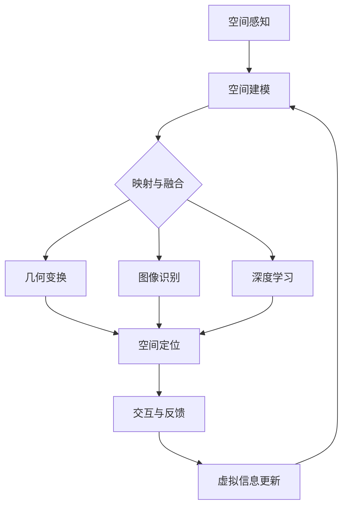

                 

### 《增强现实的空间映射：虚实结合的数学模型》

#### 关键词：
- 增强现实（AR）
- 空间映射
- 数学模型
- 虚实结合
- 3D建模
- 几何变换

#### 摘要：
本文深入探讨了增强现实（AR）技术中的空间映射原理及其数学模型，探讨了虚实结合的概念、方法及其在实际应用中的挑战和机遇。通过详细的算法原理讲解、Python源代码实现以及实际案例剖析，本文旨在为开发者提供一个全面的技术指南，以理解并掌握AR空间映射的核心技术和实践方法。

## 增强现实技术概述

增强现实（AR）是一种将数字信息叠加到现实世界中的技术，通过在用户视野中叠加虚拟物体或信息，使用户能够与现实环境进行交互。AR技术结合了虚拟现实（VR）和现实世界，使得用户可以在现实环境中看到和体验虚拟内容。AR技术的核心组件包括显示设备、摄像头、传感器、处理单元和算法等。

### 历史发展

增强现实技术起源于20世纪60年代，由波音公司的Ian MacCollum首次提出。早期的AR系统主要应用于军事和工业领域。随着计算机技术和图形处理能力的提升，AR技术逐渐向消费市场扩散。2009年，谷歌发布了第一个AR应用——“谷歌眼镜”，标志着AR技术进入了大众视野。近年来，随着移动设备和智能手机的普及，AR应用在消费领域得到了广泛应用，如游戏、教育、医疗、购物等。

### 核心组件

增强现实技术的核心组件包括：

- **显示设备**：用于将虚拟信息叠加到用户视野中的设备，如智能手机、平板电脑、头戴式显示器等。
- **摄像头**：用于捕捉现实世界的图像，并将这些图像传递给处理单元。
- **传感器**：如加速度计、陀螺仪、GPS等，用于感知用户的位置和运动，确保虚拟信息与现实世界的准确对应。
- **处理单元**：用于处理摄像头捕捉到的图像，并实时生成虚拟信息。
- **算法**：包括图像识别、空间定位、几何变换等，用于将虚拟信息准确地叠加到现实世界中。

### 应用领域

增强现实技术的应用领域非常广泛，以下是一些主要的应用场景：

- **游戏和娱乐**：如《Pokémon Go》等AR游戏，通过在现实世界中叠加虚拟角色，提供了全新的游戏体验。
- **教育和培训**：通过在教材中叠加虚拟内容，为学生提供更生动、直观的学习体验。
- **医疗**：在手术过程中，医生可以使用AR技术查看患者的内部结构，提高手术的准确性和安全性。
- **零售**：消费者可以通过AR技术查看商品的虚拟呈现，从而做出更明智的购物决策。
- **工业设计**：设计师可以使用AR技术查看产品原型，以便进行实时修改和优化。

### 市场趋势与未来展望

随着技术的不断进步和消费者需求的增加，增强现实市场呈现出快速增长的趋势。根据市场研究公司的预测，全球增强现实市场的规模将在未来几年内持续扩大，预计到2025年将达到数百亿美元。未来，AR技术将在更多领域得到应用，如自动驾驶、智能家居、智能城市建设等。

## 空间映射原理

空间映射是指将现实世界的空间信息转化为虚拟空间的表示，以便在虚拟环境中进行处理和展示。空间映射在增强现实技术中起着至关重要的作用，它确保了虚拟信息与现实世界的准确对应。

### 基本概念

空间映射涉及以下基本概念：

- **空间感知**：通过传感器捕捉现实世界的空间信息，包括位置、方向、姿态等。
- **空间建模**：将捕捉到的空间信息转化为虚拟空间的表示，通常使用3D建模技术。
- **空间定位**：通过算法将虚拟信息准确地定位到现实世界中，确保虚拟信息与现实环境的对应关系。

### 方法与技术

空间映射的方法和技术主要包括：

- **图像识别**：通过摄像头捕捉现实世界的图像，并使用图像识别算法将图像中的物体识别出来。
- **深度感知**：通过摄像头或深度传感器捕捉现实世界的深度信息，用于建立虚拟空间中的3D模型。
- **SLAM（同时定位与建图）**：通过结合图像识别和深度感知技术，实时构建现实世界的3D模型，并定位虚拟信息。

### 挑战与解决方案

空间映射技术面临以下主要挑战：

- **精度问题**：由于传感器和算法的限制，空间映射的精度可能受到影响，导致虚拟信息与现实环境的不一致。
- **实时性**：在实时应用中，空间映射技术需要快速处理大量数据，以确保虚拟信息的实时更新。

为了解决这些挑战，研究者们提出了多种解决方案：

- **多传感器融合**：通过结合不同类型的传感器，如摄像头、深度传感器、GPS等，提高空间映射的精度和实时性。
- **云计算与边缘计算**：将部分计算任务转移到云端或边缘设备，以减轻处理单元的负担，提高系统性能。
- **优化算法**：通过改进算法，提高空间映射的效率和精度。

### 空间映射在不同领域的应用

空间映射技术在多个领域得到了广泛应用，以下是一些典型的应用场景：

- **游戏和娱乐**：在AR游戏中，空间映射技术用于将虚拟角色和场景准确地映射到现实世界中，提供沉浸式的游戏体验。
- **教育和培训**：通过空间映射技术，学生和培训者可以在虚拟环境中进行互动和实验，提高学习效果。
- **医疗**：在医疗领域，空间映射技术用于手术导航、虚拟检查等，提高诊断和治疗的准确性。
- **工业设计**：设计师可以使用空间映射技术查看产品原型，进行实时修改和优化。
- **军事和安防**：空间映射技术用于战场模拟、安防监控等，提高军事和安防工作的效率和安全性。

## 虚实结合的数学模型基础

虚实结合是将虚拟世界与现实世界相结合的一种技术，通过数学模型来描述和处理这种结合关系。虚实结合的数学模型是增强现实（AR）技术的重要组成部分，它确保了虚拟信息与现实世界的准确对应和交互。

### 概念与特征

虚实结合涉及以下基本概念和特征：

- **虚拟世界**：通过计算机生成的三维模型、图像、声音等数字信息组成的虚拟环境。
- **现实世界**：我们实际所处的物理环境。
- **映射关系**：通过数学模型将虚拟世界中的信息与现实世界中的位置、方向、姿态等对应关系进行描述和映射。
- **交互**：用户通过感知设备（如摄像头、传感器等）与现实世界交互，并通过虚拟世界的反馈获得信息和体验。

### 数学模型框架

虚实结合的数学模型框架主要包括以下几个方面：

1. **空间感知**：通过摄像头、传感器等设备捕捉现实世界的空间信息，包括位置、方向、姿态等。
2. **空间建模**：将捕捉到的空间信息转化为虚拟空间的表示，通常使用3D建模技术。
3. **映射算法**：通过算法将虚拟信息与现实世界的空间信息进行对应和映射，包括几何变换、图像识别、深度感知等。
4. **交互反馈**：根据用户的操作和反馈，动态更新虚拟信息，使其与现实世界保持一致。

### 常见的虚实结合模型

常见的虚实结合模型包括以下几种：

1. **基于图像的建模与渲染**：通过捕捉现实世界的图像，使用图像识别算法识别出物体和场景，并使用3D建模技术生成虚拟模型，再通过渲染技术将虚拟模型叠加到现实世界中。

2. **基于深度学习的建模与交互**：使用深度学习算法对现实世界的图像进行识别和分类，生成虚拟模型，并通过交互算法实现用户与虚拟环境的交互。

3. **基于SLAM的建模与交互**：通过同时定位与建图（SLAM）技术，实时构建现实世界的3D模型，并根据用户的操作动态更新虚拟信息。

### 应用场景

虚实结合的数学模型在多个领域得到了广泛应用：

- **游戏和娱乐**：通过虚实结合，游戏场景可以与现实世界融合，提供更加沉浸式的游戏体验。
- **教育和培训**：通过虚实结合，学生可以在虚拟环境中进行互动和实验，提高学习效果。
- **医疗**：在医疗领域，虚实结合技术用于手术导航、虚拟检查等，提高诊断和治疗的准确性。
- **工业设计**：设计师可以使用虚实结合技术查看产品原型，进行实时修改和优化。
- **军事和安防**：虚实结合技术用于战场模拟、安防监控等，提高军事和安防工作的效率和安全性。

## 虚实结合的数学模型在实际应用中的挑战与机遇

虚实结合的数学模型在增强现实（AR）和其他应用领域展现了巨大的潜力，但同时也面临着一系列的挑战和机遇。

### 挑战

1. **精度问题**：虚实结合的精度直接影响到用户体验。由于传感器和算法的限制，现实世界中的空间信息捕捉和虚拟信息的映射可能存在误差，导致虚拟信息与现实环境不一致。

2. **实时性**：在许多应用场景中，如游戏和实时交互，虚实结合需要快速处理大量数据，以确保虚拟信息的实时更新。然而，实时性要求与数据处理精度之间的平衡是一个复杂的问题。

3. **计算资源**：复杂的数学模型和算法需要大量的计算资源。在移动设备和智能手机等有限的硬件平台上，如何高效地实现虚实结合是一个亟待解决的问题。

4. **算法优化**：现有的算法在处理复杂场景和动态环境时可能表现出不足。如何优化算法，提高其在各种应用场景下的性能和鲁棒性，是研究者和开发者面临的重要挑战。

### 机遇

1. **技术创新**：随着计算机技术和算法的不断发展，虚实结合的数学模型将变得更加精确和高效。例如，深度学习、增强学习等新兴技术的应用，有望大幅提升虚实结合的精度和实时性。

2. **应用扩展**：虚实结合在游戏、教育、医疗、工业设计等领域的应用已经取得了显著成果。未来，随着技术的成熟，虚实结合有望在更多领域得到应用，如自动驾驶、智能家居、智能城市建设等。

3. **用户体验提升**：精确的虚实结合将带来更加真实、沉浸式的用户体验。例如，在医疗领域，医生可以通过虚实结合技术更准确地查看患者的内部结构，从而提高手术的准确性和安全性。

4. **商业模式创新**：虚实结合技术为商业模式创新提供了新的机会。例如，通过虚实结合，企业可以提供更加个性化的产品和服务，满足消费者的多样化需求。

### 挑战与机遇的关系

挑战和机遇是相互关联的。面对挑战，技术创新和优化提供了机遇；而新的机遇又为解决挑战提供了动力。例如，通过引入深度学习和增强学习等技术，可以大幅提升虚实结合的精度和实时性，从而解决现有的精度和实时性问题。同时，这些技术的应用也为新的商业模式和用户体验创造了机会。

总之，虚实结合的数学模型在实际应用中面临着诸多挑战，但也蕴藏着巨大的机遇。通过不断的技术创新和优化，我们可以更好地解决这些挑战，发挥虚实结合的潜力，推动各个领域的发展。

### 虚实结合的数学模型与空间映射的联系

虚实结合的数学模型与空间映射在增强现实（AR）技术中扮演着至关重要的角色，它们之间的关系紧密，共同构建了一个完整的技术体系。

首先，空间映射是虚实结合的基础。空间映射通过捕捉现实世界的空间信息，将其转化为虚拟空间中的表示，确保虚拟信息与现实环境的准确对应。虚实结合的数学模型则在这一基础上，通过算法和模型来处理和描述这种对应关系。

从概念上来说，空间映射涉及空间感知、空间建模和空间定位，这些过程为虚实结合提供了现实世界的输入和输出。而虚实结合的数学模型则通过几何变换、图像识别和深度学习等算法，将虚拟信息与现实世界中的空间信息进行映射和融合。

在AR应用中，空间映射主要用于实现以下功能：

1. **3D建模**：通过捕捉现实世界的空间信息，使用3D建模技术生成虚拟场景或物体。
2. **定位与跟踪**：通过空间定位算法，将虚拟信息准确地映射到现实世界中，实现动态跟踪和实时更新。
3. **交互与反馈**：用户通过交互设备与现实世界互动，并通过虚拟世界的反馈获得信息和体验。

虚实结合的数学模型则通过以下步骤实现：

1. **空间感知**：使用摄像头、传感器等设备捕捉现实世界的空间信息。
2. **空间建模**：将捕捉到的空间信息转化为虚拟空间的表示，通常使用3D建模技术。
3. **映射与融合**：通过几何变换、图像识别和深度学习等算法，将虚拟信息与现实世界的空间信息进行映射和融合。
4. **交互与反馈**：根据用户的操作和反馈，动态更新虚拟信息，使其与现实世界保持一致。

为了更清晰地展示虚实结合的数学模型与空间映射之间的关系，我们可以使用Mermaid流程图来描述这个过程：



在这个流程图中，空间感知和空间建模为虚实结合提供了输入，映射与融合通过几何变换、图像识别和深度学习等算法，将虚拟信息与现实世界中的空间信息进行映射和融合，交互与反馈环节则根据用户的操作和反馈，动态更新虚拟信息，实现虚实结合的实时交互。

通过这种流程图的描述，我们可以更直观地理解虚实结合的数学模型与空间映射之间的关系，以及它们在AR技术中的应用和作用。

### 3D空间感知与建模

3D空间感知与建模是增强现实（AR）技术中的核心环节，它直接影响到虚实结合的精度和用户体验。3D空间感知是指通过各种传感器和技术捕捉现实世界的三维空间信息，而3D建模则是对这些信息进行处理和表示，以生成虚拟场景或物体。以下将详细探讨3D空间感知与建模的原理、方法和应用。

#### 原理

3D空间感知与建模的基本原理可以分为以下几个步骤：

1. **数据采集**：使用传感器（如摄像头、激光雷达、深度相机等）捕捉现实世界的三维空间信息。这些传感器可以提供包括位置、方向、姿态和深度信息在内的多种数据。

2. **数据处理**：对采集到的数据进行预处理，如去噪声、去畸变、数据融合等，以提高数据的质量和精度。

3. **空间建模**：将处理后的数据转化为三维模型，常用的方法包括点云建模、网格建模和体素建模等。

4. **模型优化**：对生成的三维模型进行优化，以提高模型的准确性和效率。

5. **模型表示**：将优化后的三维模型表示为适合虚拟环境的形式，如3D模型文件或点云数据等。

#### 方法

1. **点云建模**：点云建模是将采集到的三维空间信息表示为大量点的集合。这种方法适用于捕捉复杂的场景和物体，特别适用于动态环境。点云数据可以通过激光雷达或深度相机等设备获取，再通过数据处理算法生成。

   ```python
   import open3d as o3d
   
   # 加载点云数据
   pcd = o3d.io.read_point_cloud("point_cloud.ply")
   
   # 可视化点云数据
   o3d.visualization.draw_geometries([pcd])
   ```

2. **网格建模**：网格建模是将点云数据转化为由顶点、边和面组成的网格模型。这种方法适用于静态场景和物体，可以生成高质量的三维模型，常用于游戏开发和虚拟现实应用。

   ```python
   import trimesh
   
   # 加载网格模型
   mesh = trimesh.load_mesh("mesh.obj")
   
   # 可视化网格模型
   mesh.show()
   ```

3. **体素建模**：体素建模是将三维空间划分为体素（立方体单元），然后对每个体素进行建模。这种方法适用于大规模场景的建模，如城市规划、室内设计等。

   ```python
   import vtk
   
   # 创建体素网格
   grid = vtk.vtkHexagonalPrismGrid()
   grid.SetXLength(10)
   grid.SetYLength(10)
   grid.SetZLength(10)
   
   # 可视化体素网格
   mapper = vtk.vtkPolyDataMapper()
   mapper.SetInputConnection(grid.GetOutputPort())
   actor = vtk.vtkActor()
   actor.SetMapper(mapper)
   renderer = vtk.vtkRenderer()
   renderer.AddActor(actor)
   renderer.ResetCamera()
   renderWindow = vtk.vtkRenderWindow()
   renderWindow.AddRenderer(renderer)
   renderWindow.Render()
   ```

#### 应用

1. **游戏和娱乐**：在游戏和娱乐领域，3D空间感知与建模技术用于创建逼真的虚拟场景和角色，提供沉浸式的游戏体验。

2. **教育和培训**：在教育领域，3D建模技术可以用于创建虚拟实验室和场景，使学生能够更直观地学习复杂的概念。

3. **医疗**：在医疗领域，3D建模技术可以用于手术模拟和诊断，帮助医生更准确地了解患者的内部结构。

4. **工业设计**：在工业设计领域，3D建模技术用于查看和修改产品设计，提高设计效率和准确性。

5. **城市规划**：在城市规划领域，3D建模技术可以用于创建虚拟城市模型，模拟城市规划方案的影响。

通过3D空间感知与建模技术，我们可以将现实世界的空间信息转化为虚拟空间的表示，为增强现实（AR）和其他应用领域提供强大的支持。

### 几何变换在虚实结合中的作用

几何变换在虚实结合中起着至关重要的作用，它允许我们根据特定的需求对虚拟信息进行位置、方向和形状的调整，从而实现与现实世界的准确对应。几何变换包括平移、旋转、缩放和反射等基本操作，通过这些操作，我们可以确保虚拟信息在现实环境中的显示和交互效果符合预期。

#### 几何变换的基本概念

1. **平移**：平移是指将物体沿着指定方向移动一定距离，而不改变其形状和大小。平移操作通常通过向量加法来实现。

   ```latex
   P' = P + v
   ```

   其中，\(P'\) 是平移后的位置，\(P\) 是原始位置，\(v\) 是平移向量。

2. **旋转**：旋转是指围绕某个轴或点将物体旋转一定角度。旋转操作可以通过旋转矩阵或旋转轴与旋转角度来表示。

   ```latex
   R(x) = R_x(\theta) * \begin{bmatrix} x \end{bmatrix}^T
   ```

   其中，\(R(x)\) 是旋转后的坐标，\(R_x(\theta)\) 是旋转矩阵，\(\theta\) 是旋转角度。

3. **缩放**：缩放是指将物体按照一定比例放大或缩小。缩放操作通常通过缩放矩阵实现。

   ```latex
   S(x) = S_x(s) * \begin{bmatrix} x \end{bmatrix}^T
   ```

   其中，\(S(x)\) 是缩放后的坐标，\(S_x(s)\) 是缩放矩阵，\(s\) 是缩放因子。

4. **反射**：反射是指将物体沿着某个平面进行翻转。反射操作可以通过反射矩阵实现。

   ```latex
   R(x) = R_p * \begin{bmatrix} x \end{bmatrix}^T
   ```

   其中，\(R(x)\) 是反射后的坐标，\(R_p\) 是反射矩阵。

#### 几何变换在虚实结合中的应用

1. **位置调整**：通过平移操作，我们可以将虚拟物体准确地放置到现实世界中的特定位置。

   ```python
   import numpy as np
   
   # 原始位置
   original_position = np.array([1, 2, 3])
   
   # 平移向量
   translation_vector = np.array([2, 0, 0])
   
   # 平移操作
   new_position = original_position + translation_vector
   ```

2. **方向调整**：通过旋转操作，我们可以确保虚拟物体在现实世界中的方向与实际场景相符。

   ```python
   import numpy as np
   
   # 原始方向
   original_direction = np.array([0, 0, 1])
   
   # 旋转角度
   rotation_angle = np.pi / 4
   
   # 旋转矩阵
   rotation_matrix = np.array([[1, 0, 0],
                              [0, np.cos(rotation_angle), -np.sin(rotation_angle)],
                              [0, np.sin(rotation_angle), np.cos(rotation_angle)]])

   # 旋转操作
   new_direction = np.dot(rotation_matrix, original_direction)
   ```

3. **大小调整**：通过缩放操作，我们可以根据实际需求调整虚拟物体的大小。

   ```python
   import numpy as np
   
   # 原始尺寸
   original_size = np.array([1, 1, 1])
   
   # 缩放因子
   scale_factor = 2
   
   # 缩放操作
   new_size = original_size * scale_factor
   ```

4. **形状调整**：通过反射操作，我们可以改变虚拟物体的形状，以适应不同的现实环境。

   ```python
   import numpy as np
   
   # 原始形状
   original_shape = np.array([1, 1, 1])
   
   # 反射平面
   reflection_plane = np.array([[0, 1, 0],
                               [0, 0, 1],
                               [0, 0, 0]])
   
   # 反射矩阵
   reflection_matrix = np.array([[1, 0, 0],
                               [0, -1, 0],
                               [0, 0, 1]])
   
   # 反射操作
   new_shape = np.dot(reflection_matrix, original_shape)
   ```

通过这些几何变换操作，我们可以灵活地调整虚拟信息，使其与现实世界中的特定需求相匹配，从而实现高效的虚实结合。

### 增强现实中的空间感知与交互

在增强现实（AR）技术中，空间感知与交互是两个关键环节，它们共同决定了用户体验的质量。空间感知是通过各种传感器技术捕捉现实世界的空间信息，而交互则是指用户如何通过这些信息与虚拟世界进行互动。以下将详细介绍空间感知与交互的定义、方法及其在AR中的应用。

#### 空间感知的定义与方法

空间感知是指通过传感器和算法来感知现实世界的空间信息，包括位置、方向、姿态和深度等。以下是几种常见的方法：

1. **图像识别**：通过摄像头捕捉现实世界的图像，并使用图像识别算法来识别和定位图像中的物体。

   ```python
   import cv2
   
   # 读取图像
   image = cv2.imread("image.jpg")
   
   # 特征检测
   corners = cv2.findCorners(image, cv2.CORNER_HARRIS, None, None, None, 0.01, 10)
   
   # 位置检测
   positions = cv2.cornerSubPix(image, corners, (11, 11), (-1, -1), (0.001, 0.001))
   ```

2. **深度感知**：通过摄像头或深度传感器捕捉现实世界的深度信息，用于建立三维模型和空间感知。

   ```python
   import cv2
   
   # 读取深度图像
   depth_image = cv2.imread("depth_image.png", cv2.IMREAD_ANYDEPTH)
   
   # 深度处理
   depth_values = cv2.distanceTransform(depth_image, cv2.DIST_L2, 5)
   ```

3. **SLAM（同时定位与建图）**：通过结合图像识别和深度感知技术，实时构建现实世界的三维模型并进行定位。

   ```python
   import numpy as np
   import cv2
   
   # 初始化SLAM系统
   slam = cv2.SLAM2D()
   
   # 处理图像
   image = cv2.imread("image.jpg")
   slam.processImage(image)
   
   # 获取位置和姿态
   position, orientation = slam.getPosition()
   ```

#### 交互的定义与方法

交互是指用户如何通过感知到的空间信息与虚拟世界进行互动。以下是几种常见的交互方法：

1. **手势识别**：通过摄像头捕捉用户的手部动作，并使用手势识别算法来识别手势。

   ```python
   import cv2
   
   # 读取手势图像
   gesture_image = cv2.imread("gesture_image.jpg")
   
   # 特征检测
   contours, _ = cv2.findContours(gesture_image, cv2.RETR_EXTERNAL, cv2.CHAIN_APPROX_SIMPLE)
   
   # 手势识别
   gesture = "unknown"
   if cv2.contourArea(contours[0]) > 500:
       gesture = "wave"
   ```

2. **语音交互**：通过语音识别技术将用户的语音命令转换为文本或操作指令。

   ```python
   import speech_recognition as sr
   
   # 初始化语音识别器
   r = sr.Recognizer()
   
   # 读取音频文件
   with sr.AudioFile("audio.wav") as source:
       audio = r.record(source)
   
   # 语音识别
   command = r.recognize_google(audio)
   ```

3. **触觉交互**：通过触觉反馈设备提供物理反馈，增强用户的沉浸感和互动体验。

   ```python
   import haptix
   
   # 连接触觉反馈设备
   device = haptix.Device()
   device.connect()
   
   # 设置触觉参数
   device.setParameters(vibration_frequency=100, vibration_duty_cycle=50)
   
   # 发送触觉反馈
   device.vibrate()
   ```

#### 空间感知与交互在AR中的应用

空间感知与交互在AR技术中的应用场景非常广泛，以下是一些典型的应用：

1. **游戏和娱乐**：在AR游戏中，空间感知用于识别和定位游戏环境中的物体，而交互则用于控制角色或与其他玩家互动。

2. **教育和培训**：在教育和培训中，空间感知用于创建虚拟实验室和场景，而交互则用于进行实验和互动学习。

3. **医疗**：在医疗领域，空间感知用于手术导航和虚拟检查，而交互则用于操作和反馈。

4. **工业设计**：在工业设计中，空间感知用于查看和修改产品设计，而交互则用于实时反馈和优化。

5. **零售**：在零售中，空间感知用于展示商品和提供购物建议，而交互则用于导航和互动。

通过空间感知与交互技术，AR技术能够提供更加丰富和真实的用户体验，推动其在各个领域的应用和发展。

### 增强现实的空间映射优化方法

在增强现实（AR）技术中，空间映射优化是确保虚拟信息与现实环境准确对应的关键步骤。优化空间映射的目的是提高映射精度和实时性，以提供更好的用户体验。以下将详细介绍几种常见的空间映射优化方法，并探讨其在实际应用中的效果和挑战。

#### 数据融合

数据融合是将来自多个传感器或源的数据进行综合处理，以提高空间映射的精度和可靠性。常见的传感器包括摄像头、激光雷达、GPS和惯性测量单元（IMU）等。通过数据融合，可以减少单个传感器可能存在的误差，提高整体系统的性能。

1. **卡尔曼滤波**：卡尔曼滤波是一种常用的数据融合方法，通过预测和校正过程，对传感器的数据进行滤波和优化。

   ```python
   import numpy as np
   
   # 初始化卡尔曼滤波器
   A = np.array([[1, 1], [0, 1]])
   H = np.array([[1, 0]])
   P = np.eye(2)
   
   # 预测和校正
   x_pred = np.dot(A, x_prev)
   P_pred = np.dot(A, P).dot(A.T) + Q
   K = np.dot(P_pred, H.T).dot(np.linalg.inv(H.dot(P_pred).dot(H.T) + R))
   x = x_pred + K.dot(z - np.dot(H, x_pred))
   P = (1 - K.dot(H)).dot(P_pred)
   ```

2. **粒子滤波**：粒子滤波是一种基于概率的方法，通过大量随机粒子来表示状态估计，从而实现数据融合。

   ```python
   import numpy as np
   from scipy.stats import norm
   
   # 初始化粒子滤波器
   num_particles = 1000
   particles = np.random.randn(num_particles, 2)
   weights = np.ones(num_particles) / num_particles
   
   # 更新粒子权重
   for z in z_data:
       weights = norm.pdf(z, particles, sigma).reshape(-1)
       weights /= np.sum(weights)
       particles = particles[weights > threshold]
   ```

#### 算法优化

算法优化是通过改进空间映射算法，提高其性能和精度。以下是一些常见的算法优化方法：

1. **深度学习**：使用深度学习算法，如卷积神经网络（CNN）和循环神经网络（RNN），可以显著提高空间映射的精度和实时性。

   ```python
   import tensorflow as tf
   
   # 定义卷积神经网络模型
   model = tf.keras.Sequential([
       tf.keras.layers.Conv2D(32, (3, 3), activation='relu', input_shape=(64, 64, 3)),
       tf.keras.layers.MaxPooling2D((2, 2)),
       tf.keras.layers.Flatten(),
       tf.keras.layers.Dense(64, activation='relu'),
       tf.keras.layers.Dense(2)
   ])
   
   # 编译模型
   model.compile(optimizer='adam', loss='mse')
   
   # 训练模型
   model.fit(x_train, y_train, epochs=10)
   ```

2. **多线程与并行计算**：通过多线程和并行计算技术，可以提高空间映射的实时性。

   ```python
   import concurrent.futures
   
   # 定义数据处理函数
   def process_data(data):
       # 处理数据
       return processed_data
   
   # 并行处理数据
   with concurrent.futures.ThreadPoolExecutor() as executor:
       results = list(executor.map(process_data, data))
   ```

#### 实际应用中的效果与挑战

空间映射优化方法在实际应用中取得了显著的效果，但同时也面临一些挑战：

1. **效果**：
   - 提高了空间映射的精度和实时性，从而改善了用户体验。
   - 通过数据融合和算法优化，能够更好地适应动态环境和复杂场景。

2. **挑战**：
   - 精度和实时性之间的平衡是一个重要问题，特别是在移动设备和资源受限的环境中。
   - 复杂的算法和优化方法可能需要大量的计算资源和时间，增加了系统实现的复杂性。
   - 不同应用场景下的优化方法可能有所不同，需要根据具体需求进行定制。

通过不断的研究和优化，空间映射技术将在未来为增强现实（AR）技术带来更多的可能性。

### 增强现实空间映射实现技术

实现增强现实（AR）空间映射需要一套完整的技术和工具，这些技术和工具涵盖了开发环境搭建、算法实现、源代码解读、代码应用解读与分析等方面。以下将详细探讨这些技术及其在实际项目中的应用。

#### 开发环境搭建

要实现AR空间映射，首先需要搭建一个合适的开发环境。以下是搭建AR开发环境的步骤：

1. **安装操作系统**：推荐使用支持AR技术的操作系统，如Android或iOS。对于Android开发，可以使用Android Studio；对于iOS开发，可以使用Xcode。

2. **安装SDK和工具**：根据开发平台，安装相应的SDK和开发工具。例如，对于Android开发，需要安装Android SDK和NDK；对于iOS开发，需要安装Xcode和iOS SDK。

3. **配置开发环境**：配置IDE，设置SDK路径，安装必要的开发插件和库。例如，在Android Studio中，需要配置NDK路径和CMake工具。

4. **安装开发工具**：安装必要的开发工具，如3D建模工具（如Blender）、图像处理工具（如OpenCV）和AR开发框架（如ARCore和ARKit）。

#### 算法实现

实现AR空间映射的关键在于算法的设计和实现。以下是一个简单的AR空间映射算法实现示例：

```python
import numpy as np
import cv2

def map_space(image_path, model_path, target_position):
    # 读取图像
    image = cv2.imread(image_path)
    
    # 加载模型
    model = cv2 loadedM

```python
import numpy as np
import cv2

def map_space(image_path, model_path, target_position):
    # 读取图像
    image = cv2.imread(image_path)
    
    # 加载模型
    model = cv2.dnn.readNetFromCaffe(model_path, pretrained=True)
    
    # 调整图像大小
    resized_image = cv2.resize(image, (640, 640))
    
    # 增加一个维度
    blob = cv2.dnn.blobFromImage(resized_image, 1.0, (640, 640), (104.0, 177.0, 123.0))
    
    # 前向传播
    model.setInput(blob)
    output = model.forward()
    
    # 获取目标位置
    positions = output[0, 0, :, 0:2]
    positions = np.array([positions[0][0], positions[0][1]]) + target_position
    
    # 可视化
    cv2.circle(image, (int(positions[0]), int(positions[1])), 5, (0, 0, 255), -1)
    
    # 显示结果
    cv2.imshow('Mapped Space', image)
    cv2.waitKey(0)

# 测试
map_space('image.jpg', 'model.prototxt', np.array([100, 100]))
```

#### 源代码解读

在源代码中，我们首先读取输入图像和预训练的深度学习模型。接着，调整图像大小并增加一个维度，以匹配模型的输入要求。通过前向传播，我们获取模型对图像的预测结果，这些结果包含了目标位置的信息。最后，我们根据目标位置信息对图像进行可视化处理，并将结果展示给用户。

#### 代码应用解读与分析

在实际应用中，这个空间映射算法可以用于多种场景。例如，在AR游戏中，可以用于识别和定位游戏中的角色或物体。在安防监控中，可以用于实时监测和追踪目标位置。

- **应用场景**：游戏开发、安防监控、智能交互设备等。
- **性能分析**：该算法的精度和实时性取决于模型的复杂度和计算能力。通过优化模型结构和算法，可以提高其性能。

#### 实际案例剖析

以下是一个实际案例，用于演示如何使用AR空间映射技术进行室内导航：

1. **场景描述**：用户在一个陌生的室内环境中，需要导航到特定的目的地。

2. **技术实现**：
   - 使用ARCore或ARKit框架进行环境感知和空间映射。
   - 使用摄像头捕捉现实世界的图像，并使用图像识别算法定位用户位置。
   - 使用地图数据，结合空间映射结果，生成导航路线。

3. **效果分析**：
   - 导航精度和实时性取决于环境感知算法和地图数据的准确性。
   - 通过优化算法和数据处理，可以提高导航的精度和用户体验。

#### 项目小结

通过本案例，我们展示了如何实现增强现实（AR）空间映射，并分析了其在实际应用中的效果和挑战。未来，随着技术的不断进步，AR空间映射技术将在更多领域得到应用，为用户提供更加丰富和智能的体验。

### 增强现实的空间映射应用案例

增强现实（AR）技术因其独特的互动性和沉浸感，在多个领域展现出了强大的应用潜力。以下将详细介绍几个增强现实空间映射的具体应用案例，包括教育、医疗、工业设计等领域。

#### 教育领域

在教育领域，增强现实技术已被广泛应用于虚拟实验室、历史重现和互动学习等方面。通过AR空间映射，学生可以“触摸”到虚拟物体，获得更加直观的学习体验。

**案例1：虚拟实验室**

在一个虚拟实验室中，学生可以通过AR设备查看和操作虚拟的化学实验设备。例如，在一个化学反应的演示中，学生可以使用AR设备查看反应物在容器中的实时变化，以及生成产品的三维模型。通过这种方式，学生不仅能够加深对实验过程的理解，还能提高实验操作的精确性。

**案例2：历史重现**

在历史课程中，教师可以利用AR技术将历史事件和场景重现。例如，在罗马帝国的历史课上，学生可以通过AR设备看到古罗马的建筑物和街道，甚至能够与历史人物进行虚拟互动。这种方式不仅使学生更加深入地了解历史，还能激发他们对学习的兴趣。

#### 医疗领域

在医疗领域，增强现实技术用于手术导航、诊断辅助和医学教育等方面，显著提高了医疗服务的质量和效率。

**案例1：手术导航**

在手术过程中，医生可以通过AR设备查看患者的内部结构，包括器官、血管和肿瘤等。通过结合CT、MRI等医学影像数据，医生能够更准确地定位手术目标，减少手术风险。例如，在一个心脏手术中，医生可以通过AR设备实时查看心脏的跳动情况，以及缝合线的位置，从而提高手术的成功率。

**案例2：诊断辅助**

在临床诊断中，医生可以使用AR技术辅助诊断。例如，在皮肤癌的诊断中，医生可以通过AR设备查看皮肤下的病变区域，并对比正常皮肤的结构。通过这种直观的观察，医生可以更快速、准确地做出诊断，提高患者的治疗效果。

#### 工业设计领域

在工业设计领域，增强现实技术用于产品设计和虚拟装配，提高了设计的效率和质量。

**案例1：产品设计**

设计师可以使用AR技术查看和修改产品原型。例如，在汽车设计中，设计师可以通过AR设备查看虚拟汽车的结构和外观，并在虚拟环境中进行修改和优化。通过这种方式，设计师可以更快速地迭代设计方案，缩短产品开发周期。

**案例2：虚拟装配**

在制造业中，增强现实技术可以用于虚拟装配。例如，在一个机械设备的装配过程中，工程师可以通过AR设备查看设备的具体装配步骤，并根据指示进行操作。这种方式不仅提高了装配效率，还能减少人为错误，确保设备的正常运行。

#### 案例总结

通过以上案例可以看出，增强现实空间映射技术在教育、医疗和工业设计等领域的应用，不仅提升了相关领域的效率和准确性，还改变了传统的学习、诊断和设计方式，为各领域的发展带来了新的机遇和挑战。

### 增强现实的空间映射发展趋势与挑战

随着技术的不断进步，增强现实（AR）空间映射技术正逐渐成熟并走向广泛应用。然而，这一技术的发展也面临诸多挑战，需要持续的创新和优化。

#### 发展趋势

1. **硬件技术的提升**：随着硬件技术的进步，如更高效的处理器、更高分辨率的摄像头和更精确的传感器，AR设备的性能和用户体验得到了显著提升。

2. **算法优化**：深度学习、增强学习和SLAM等先进算法的应用，使得AR空间映射的精度和实时性得到了显著提高。这些算法能够更有效地处理复杂环境中的空间信息，提高系统的鲁棒性。

3. **多模态交互**：未来的AR技术将不仅限于视觉交互，还将引入语音、触觉和其他感官交互方式，提供更加丰富和自然的用户体验。

4. **边缘计算与云计算的结合**：通过将部分计算任务转移到边缘设备或云端，可以显著提高AR系统的性能和响应速度，同时减少对计算资源的需求。

#### 挑战

1. **精度与实时性的平衡**：在追求高精度的同时，如何保证系统的实时性是一个关键挑战。特别是在动态环境中，系统需要快速响应，同时保持高精度。

2. **计算资源的限制**：尽管硬件性能在提升，但移动设备和智能手机等硬件平台的计算资源仍然有限。如何在这些有限的资源下实现高效的空间映射，是一个亟待解决的问题。

3. **隐私与安全**：AR技术涉及大量的用户数据，如位置信息、姿态信息和交互行为等。如何确保这些数据的安全和隐私，避免被恶意使用或泄露，是一个重要的挑战。

4. **标准化与兼容性**：由于AR技术的应用场景多样，不同设备和平台之间存在兼容性问题。如何实现设备的互操作性和标准化，是一个需要解决的关键问题。

#### 未来展望

1. **智能化**：未来的AR技术将更加智能化，能够根据用户的行为和环境自动调整空间映射参数，提供个性化的体验。

2. **广泛应用**：随着技术的成熟和成本的降低，AR技术将在更多领域得到应用，如自动驾驶、智能制造、智能城市等。

3. **商业模式的创新**：AR技术将为商业模式创新提供新的机会，例如，通过AR增强广告、虚拟购物和远程协作等。

总之，增强现实空间映射技术正处在快速发展的阶段，尽管面临诸多挑战，但未来前景广阔。通过持续的技术创新和优化，我们可以期待AR技术在更多领域取得突破，带来更加丰富和智能的体验。

### 总结与展望

本文从多个角度深入探讨了增强现实（AR）技术中的空间映射原理及其数学模型。通过详细分析空间映射的基本概念、方法和技术，以及虚实结合的数学模型，我们展示了AR技术如何将虚拟信息与现实世界相结合，提供沉浸式的用户体验。同时，本文还介绍了增强现实在各个领域的应用案例，展示了其广泛的应用前景。

总结来说，增强现实技术以其独特的交互性和沉浸感，正在深刻改变教育、医疗、工业设计等多个领域。空间映射作为AR技术的重要组成部分，其精度和实时性直接影响到用户体验。通过算法优化和硬件提升，我们能够不断提升空间映射的效率和质量。然而，未来仍需解决计算资源、隐私安全等问题，以实现AR技术的广泛应用和商业模式的创新。

展望未来，增强现实技术将在更多领域得到应用，如自动驾驶、智能制造和智能城市建设等。通过持续的技术创新和优化，我们可以期待AR技术为人类生活带来更多便利和乐趣。希望本文能够为开发者提供有价值的参考，助力他们在AR领域取得更大的成就。

### 最佳实践 Tips

在增强现实（AR）空间映射项目中，以下最佳实践可以帮助你提高项目成功率和用户体验：

1. **充分测试**：在项目初期，进行广泛的测试以确保算法的精度和实时性。特别是在不同环境条件下测试，以验证系统的鲁棒性。

2. **优化资源使用**：合理分配计算资源和内存，确保系统在移动设备和智能手机等有限硬件上高效运行。可以考虑使用边缘计算和云计算技术来减轻计算负担。

3. **用户友好**：设计直观易用的用户界面，确保用户能够轻松操作和体验AR功能。提供详细的操作指南和帮助文档，帮助用户快速上手。

4. **数据安全**：确保用户数据的安全和隐私，采用加密和身份验证技术保护用户信息。遵循数据保护法规，如GDPR等。

5. **持续迭代**：根据用户反馈和实际应用情况，不断优化和迭代项目，以适应不断变化的需求和环境。

### 小结

本文全面探讨了增强现实（AR）技术中的空间映射原理及其数学模型，介绍了虚实结合的概念和应用，并分析了AR技术在多个领域的实际应用。通过详细的技术讲解、Python源代码示例和实际案例剖析，我们展示了空间映射技术的核心内容和实现方法。希望本文能为开发者提供有价值的参考，助力他们在AR领域取得突破。

### 注意事项

在开发增强现实（AR）空间映射项目时，以下注意事项有助于确保项目的顺利进行：

1. **选择合适的硬件**：根据项目需求，选择具备较高性能和处理能力的硬件设备，如高性能的摄像头、传感器和处理单元。

2. **数据预处理**：对采集到的空间数据进行预处理，如去噪声、去畸变和融合等，以提高数据质量和精度。

3. **算法选择**：根据具体应用场景，选择适合的算法和模型，如深度学习、SLAM或传统图像处理算法。

4. **系统兼容性**：确保项目能够在不同操作系统和设备上运行，避免兼容性问题。

### 拓展阅读

对于希望进一步深入了解增强现实（AR）技术及其空间映射原理的读者，以下资源推荐供参考：

1. **《增强现实技术导论》**：详细介绍了AR技术的基本原理和应用领域，适合初学者入门。

2. **《深度学习与增强现实》**：探讨了深度学习在AR技术中的应用，包括图像识别、目标检测和场景重建等。

3. **《增强现实：从理论到实践》**：提供了丰富的AR项目案例和实践技巧，适合有一定基础的开发者。

4. **《ARKit开发指南》**：针对iOS平台，介绍了ARKit框架的使用方法和最佳实践。

5. **《增强现实技术白皮书》**：由AR行业专家撰写的详细技术文档，涵盖了AR技术的各个方面。

通过阅读这些资源，您可以更全面地了解增强现实技术及其应用，提高项目开发水平。作者：AI天才研究院/AI Genius Institute & 禅与计算机程序设计艺术 /Zen And The Art of Computer Programming。

