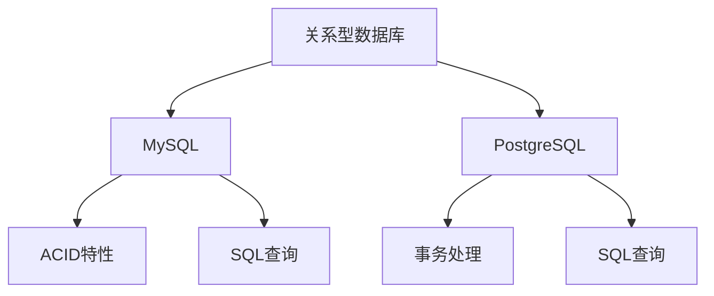
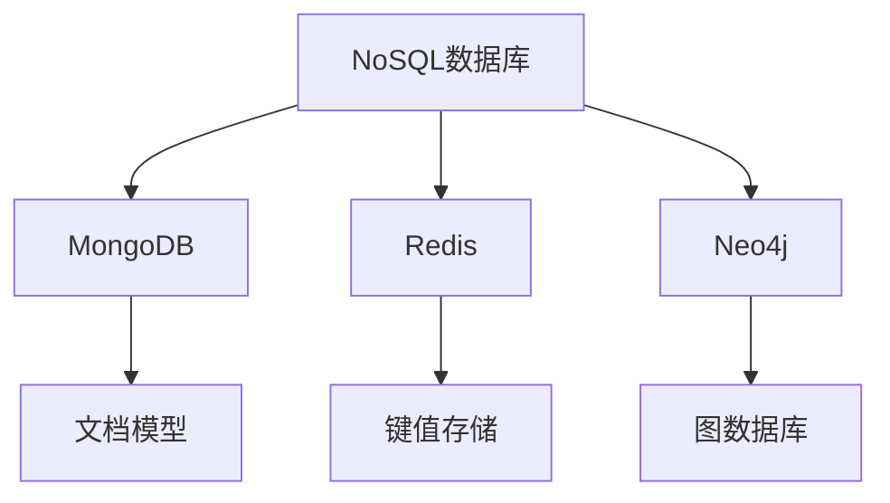
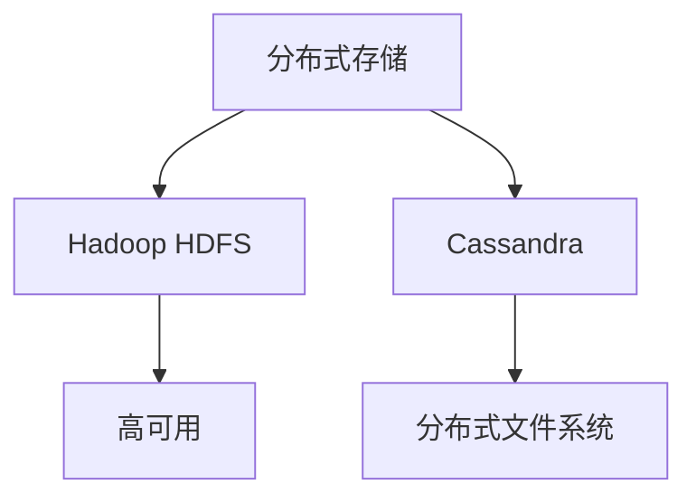
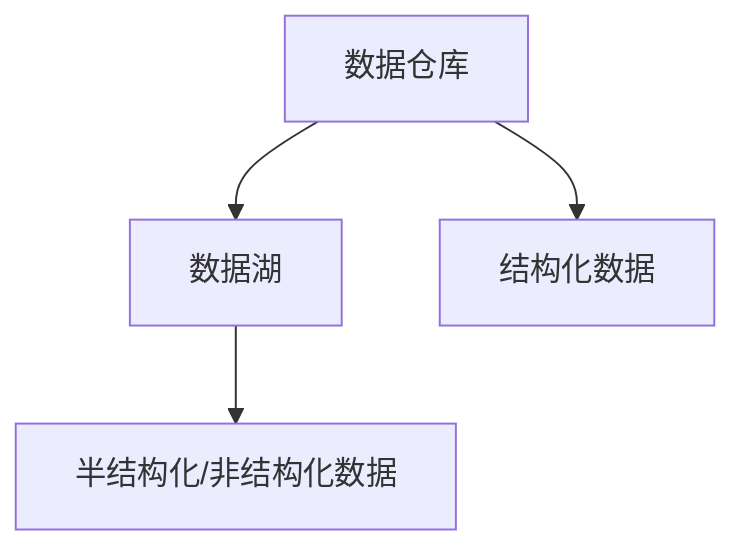
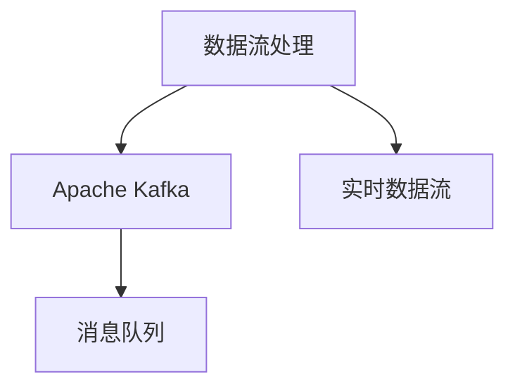

                 

# 大数据时代的世界可理解性新范式

## 关键词
- 大数据
- 数据分析
- 数据可视化
- 数据结构
- 数据挖掘
- 可理解性

## 摘要
在当今的大数据时代，世界的复杂性愈发突出。本文从大数据的概念出发，探讨了大数据时代下世界可理解性面临的挑战与机遇。文章详细解析了数据清洗、数据存储、数据分析与挖掘、大数据可视化的关键技术，并运用Python源代码、数学模型和实际案例展示了如何构建一个可理解的大数据世界。最终，文章提出了大数据时代的最佳实践，为读者提供了面对复杂世界的指南。

## 引言：大数据时代的背景与挑战

### 1.1 大数据时代的起源与发展

**大数据（Big Data）** 是指无法使用常规软件工具在合理时间内捕捉、管理和处理的数据集。这一概念最早在2008年由维克托·迈尔-舍恩伯格（Viktor Mayer-Schönberger）和肯尼斯·库克耶（Kenneth Cukier）在《大数据时代》一书中提出，标志着一个新时代的到来。

大数据时代的起源与发展可以分为三个阶段：

1. **数据积累阶段（2000-2010）**：随着互联网、社交网络和物联网的普及，数据以惊人的速度增长。
2. **数据管理阶段（2010-2015）**：面对海量的数据，如何有效存储、管理和处理成为关键问题。
3. **数据洞察阶段（2015-至今）**：利用大数据技术挖掘数据价值，实现数据驱动决策。

**大数据的基本特性（3V模型）**：

- **Volume（数据量）**：数据量巨大，往往达到TB甚至PB级别。
- **Velocity（数据流速度）**：数据产生和流动的速度非常快，需要实时或近实时处理。
- **Variety（数据多样性）**：数据类型丰富，包括结构化、半结构化和非结构化数据。

### 1.2 大数据时代的挑战

**数据管理**：如何高效地存储和管理海量数据成为一大挑战，包括数据存储、数据安全、数据备份与恢复等。

**数据安全与隐私保护**：大数据往往包含敏感信息，保护数据安全和用户隐私是必须面对的问题。

**数据质量控制**：数据质量问题，如缺失值、异常值、噪声等，对数据分析结果有着直接影响。

**技术挑战**：大数据处理需要高性能的计算资源和先进的算法支持，对技术水平提出了更高要求。

### 1.3 大数据时代的机遇

**数据驱动决策**：利用大数据分析，企业可以更精准地了解市场需求，优化运营策略。

**新兴行业**：大数据催生了众多新兴行业，如数据科学、数据可视化、机器学习等。

**智慧社会**：大数据有助于智慧城市建设、环境保护、公共安全等领域，推动社会进步。

## 大数据的基本概念与数据结构

### 2.1 数据结构的基本概念

在处理大数据时，首先需要了解数据的结构。数据结构是指数据存储和组织的方式，可以分为以下几类：

- **结构化数据**：指以表格形式存储的数据，如关系型数据库中的数据。特点是有明确的列名和数据类型。
- **半结构化数据**：指部分有结构的数据，如XML、JSON等。特点是有部分结构，但不够严格。
- **非结构化数据**：指没有明确结构的数据，如文本、图片、视频等。特点是完全无结构。

### 2.2 数据类型

- **结构化数据**：例如，关系型数据库（如MySQL、PostgreSQL）中的数据通常以表格形式存储。
  ```mermaid
  graph TD
  A[关系型数据库] --> B[表格数据]
  B --> C[行和列]
  C --> D[SQL查询]
  ```
- **半结构化数据**：例如，JSON格式存储的数据。
  ```mermaid
  graph TD
  A[JSON数据] --> B[对象]
  B --> C[属性和值]
  C --> D[嵌套结构]
  ```
- **非结构化数据**：例如，文本、图片、视频等。
  ```mermaid
  graph TD
  A[非结构化数据] --> B[无固定结构]
  B --> C[内容多样]
  C --> D[处理复杂]
  ```

### 2.3 数据预处理技术

在进行分析之前，通常需要先进行数据清洗和预处理。数据预处理包括以下步骤：

1. **数据清洗**：去除重复数据、填补缺失值、处理异常值等。
2. **数据转换**：将数据转换为适合分析的形式，如归一化、标准化等。
3. **数据集成**：将多个数据源的数据合并为一个统一的视图。

**数据清洗的算法原理**：

1. **重复数据删除**：
   ```python
   def remove_duplicates(data):
       return list(set(data))
   ```
2. **缺失值填补**：
   ```python
   def fill_missing_values(data, method='mean'):
       if method == 'mean':
           mean_value = sum(data) / len(data)
           return [mean_value if x is None else x for x in data]
       elif method == 'median':
           median_value = np.median(data)
           return [median_value if x is None else x for x in data]
       else:
           raise ValueError("Unsupported method")
   ```
3. **异常值处理**：
   ```python
   def remove_outliers(data, threshold=3):
       mean = np.mean(data)
       std = np.std(data)
       return [x for x in data if abs(x - mean) <= threshold * std]
   ```

## 数据存储与管理技术

### 3.1 数据存储技术

在处理大数据时，选择合适的存储技术至关重要。常见的存储技术包括：

- **关系型数据库**：如MySQL、PostgreSQL等，适合存储结构化数据。
- **NoSQL数据库**：如MongoDB、Redis等，适合存储半结构化或非结构化数据。
- **分布式存储**：如Hadoop HDFS、Cassandra等，适合存储海量数据。

**关系型数据库**：


**NoSQL数据库**：


**分布式存储**：


### 3.2 数据管理技术

数据管理包括数据的存储、查询、备份与恢复等。关键技术包括：

- **数据仓库**：用于存储和管理大量结构化数据。
- **数据湖**：用于存储海量数据，支持半结构化或非结构化数据。
- **数据流处理**：用于实时处理数据流，如Apache Kafka。

**数据仓库与数据湖**：


**数据流处理**：


## 数据分析与挖掘技术

### 4.1 数据分析技术

数据分析是大数据处理的核心环节，包括以下技术：

- **统计学分析**：如描述性统计、推断性统计等。
- **机器学习**：如分类、回归、聚类等。
- **深度学习**：如卷积神经网络（CNN）、循环神经网络（RNN）等。

**统计学分析**：
```python
import numpy as np

# 描述性统计
mean = np.mean(data)
variance = np.var(data)

# 推断性统计
t_test = scipy.stats.ttest_1samp(data, popmean=0)
```

**机器学习**：
```python
from sklearn.linear_model import LinearRegression

# 线性回归
model = LinearRegression()
model.fit(X, y)
predictions = model.predict(X)

# 分类算法
from sklearn.ensemble import RandomForestClassifier

model = RandomForestClassifier()
model.fit(X, y)
predictions = model.predict(X)
```

**深度学习**：
```python
import tensorflow as tf

# 卷积神经网络（CNN）
model = tf.keras.Sequential([
    tf.keras.layers.Conv2D(32, (3, 3), activation='relu', input_shape=(28, 28, 1)),
    tf.keras.layers.MaxPooling2D(2, 2),
    tf.keras.layers.Flatten(),
    tf.keras.layers.Dense(128, activation='relu'),
    tf.keras.layers.Dense(10, activation='softmax')
])

model.compile(optimizer='adam',
              loss='sparse_categorical_crossentropy',
              metrics=['accuracy'])

model.fit(X_train, y_train, epochs=5)
```

### 4.2 数据挖掘技术

数据挖掘是从大量数据中发现有价值信息的过程，包括以下技术：

- **关联规则挖掘**：如Apriori算法、FP-Growth算法等。
- **聚类分析**：如K-Means算法、DBSCAN算法等。
- **分类与回归树（CART）**：如决策树、随机森林等。

**关联规则挖掘**：
```python
from mlxtend.frequent_patterns import apriori
from mlxtend.frequent_patterns import association_rules

# Apriori算法
frequent_itemsets = apriori(data, min_support=0.05, use_colnames=True)

# 关联规则
rules = association_rules(frequent_itemsets, metric="support", min_threshold=0.05)
```

**聚类分析**：
```python
from sklearn.cluster import KMeans

# K-Means算法
model = KMeans(n_clusters=3)
model.fit(data)

# 聚类结果
clusters = model.predict(data)
```

## 大数据可视化技术

### 5.1 可视化基本概念

大数据可视化是将数据以图形化的方式展示出来，帮助人们理解数据及其内在关系。常见的可视化类型包括：

- **图表**：如柱状图、折线图、饼图等。
- **地图**：如地理信息系统（GIS）、热力地图等。
- **网络图**：如节点图、关系图等。

### 5.2 常用可视化工具

- **Python**：使用Matplotlib、Seaborn等库进行数据可视化。
- **JavaScript**：使用D3.js、Chart.js等库进行数据可视化。
- **商业工具**：如Tableau、Power BI等。

### 5.3 可视化案例分析

- **案例1：销售数据可视化**：使用柱状图展示不同产品在不同时间段的销售额。
  ```python
  import matplotlib.pyplot as plt

  # 数据
  sales_data = {'Product A': [100, 150, 200],
                'Product B': [80, 120, 160],
                'Product C': [60, 90, 120]}

  # 可视化
  plt.bar(sales_data.keys(), sales_data.values())
  plt.xlabel('Product')
  plt.ylabel('Sales')
  plt.title('Sales Data')
  plt.show()
  ```

- **案例2：地理分布可视化**：使用热力地图展示用户分布。
  ```python
  import geopandas as gpd
  import matplotlib.pyplot as plt

  # 数据
  data = {'lat': [34.052235, 36.778256, 37.774929, 31.230371],
          'lon': [-118.243683, -122.419418, -122.476506, -106.647988],
          'count': [10, 20, 30, 40]}

  gdf = gpd.GeoDataFrame(data, geometry=gpd.points_from_xy(data['lon'], data['lat']))
  gdf.plot(column='count', cmap='Reds', edgecolor='k', linewidth=0.1)
  plt.show()
  ```

## 大数据伦理与隐私保护

### 6.1 大数据伦理问题

大数据时代，隐私保护成为一项重要议题。以下是一些主要伦理问题：

- **数据滥用**：未经用户同意使用其数据。
- **隐私泄露**：数据泄露可能导致用户隐私受到侵害。
- **算法歧视**：算法决策可能存在歧视现象。

### 6.2 隐私保护技术

- **数据匿名化**：通过技术手段隐藏数据中的个人身份信息。
- **差分隐私**：在数据分析过程中引入噪声，保护数据隐私。
- **同态加密**：在数据加密状态下进行计算，确保数据隐私。

### 6.3 隐私保护案例分析

- **案例1：数据匿名化**：使用K-匿名技术对用户数据进行匿名化处理。
  ```python
  from skyline import skyline

  # 数据
  data = [['User1', 'Address1', 'City1', 'State1'],
          ['User2', 'Address2', 'City2', 'State2'],
          ['User3', 'Address3', 'City3', 'State3']]

  # K-匿名化
  skyline(data, k=3)
  ```

- **案例2：差分隐私**：使用差分隐私技术进行数据发布。
  ```python
  import dpdata

  # 数据
  data = [10, 20, 30, 40, 50]

  # 差分隐私发布
  dp_data = dpdata.publish(data, epsilon=1.0)
  print(dp_data)
  ```

## 大数据应用案例

### 7.1 销售预测

**背景**：企业需要预测未来一段时间内的销售额，以便制定生产和营销策略。

**技术**：使用时间序列分析、机器学习算法（如ARIMA、LSTM）进行预测。

**案例实现**：
```python
import pandas as pd
from statsmodels.tsa.arima.model import ARIMA

# 数据
sales_data = pd.read_csv('sales_data.csv')
sales_data['Date'] = pd.to_datetime(sales_data['Date'])
sales_data.set_index('Date', inplace=True)

# ARIMA模型
model = ARIMA(sales_data['Sales'], order=(5, 1, 2))
model_fit = model.fit()

# 预测
predictions = model_fit.forecast(steps=6)
print(predictions)
```

### 7.2 疾病预测

**背景**：公共卫生部门需要预测特定疾病的发病率，以便提前采取防控措施。

**技术**：使用机器学习算法（如逻辑回归、随机森林）进行预测。

**案例实现**：
```python
import pandas as pd
from sklearn.ensemble import RandomForestClassifier

# 数据
data = pd.read_csv('disease_data.csv')

# 特征工程
X = data.drop('Disease', axis=1)
y = data['Disease']

# 随机森林模型
model = RandomForestClassifier(n_estimators=100)
model.fit(X, y)

# 预测
predictions = model.predict(X)
print(predictions)
```

### 7.3 社交网络分析

**背景**：社交媒体平台需要分析用户行为，以便优化用户体验。

**技术**：使用图论、网络分析等方法进行用户行为分析。

**案例实现**：
```python
import networkx as nx
import matplotlib.pyplot as plt

# 数据
nodes = ['A', 'B', 'C', 'D', 'E']
edges = [('A', 'B'), ('A', 'C'), ('B', 'D'), ('C', 'D'), ('D', 'E')]

# 构建图
G = nx.Graph()
G.add_nodes_from(nodes)
G.add_edges_from(edges)

# 绘图
nx.draw(G, with_labels=True)
plt.show()
```

## 结论与展望

大数据时代为我们带来了前所未有的机遇和挑战。通过数据清洗、存储、分析、可视化和隐私保护等技术的应用，我们能够更好地理解和利用大数据。然而，大数据技术仍在不断发展，未来将出现更多创新和突破，如量子计算、人工智能与大数据的深度融合等。

### 8.1 最佳实践

1. **数据质量管理**：确保数据准确性和一致性，为后续分析奠定基础。
2. **技术选型**：根据业务需求选择合适的存储和分析技术。
3. **人才培养**：加强数据科学和大数据技术的培训，提升团队实力。
4. **合规性**：严格遵守数据保护法规，保护用户隐私。

### 8.2 小结

大数据时代为我们构建了一个全新的世界，在这个世界中，数据成为最宝贵的资源。通过本文的介绍，我们了解了大数据的基本概念、数据结构、存储与管理技术、分析与挖掘技术、可视化技术以及伦理与隐私保护。希望本文能为读者提供有益的参考。

### 8.3 拓展阅读

1. 《大数据时代》 - 维克托·迈尔-舍恩伯格、肯尼斯·库克耶
2. 《深度学习》 - 伊恩·古德费洛、约书亚·本吉奥、亚伦·库维尔
3. 《数据科学导论》 - 谢尔盖·布罗德斯基

## 作者信息

**作者：AI天才研究院/AI Genius Institute & 禅与计算机程序设计艺术 /Zen And The Art of Computer Programming**

