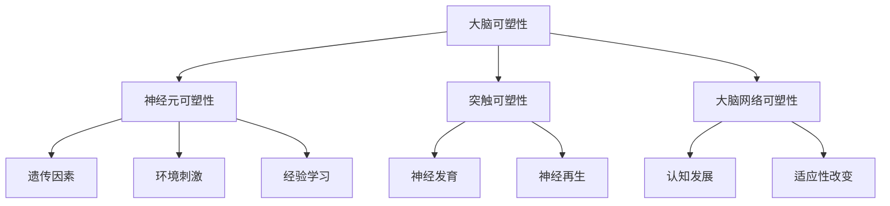
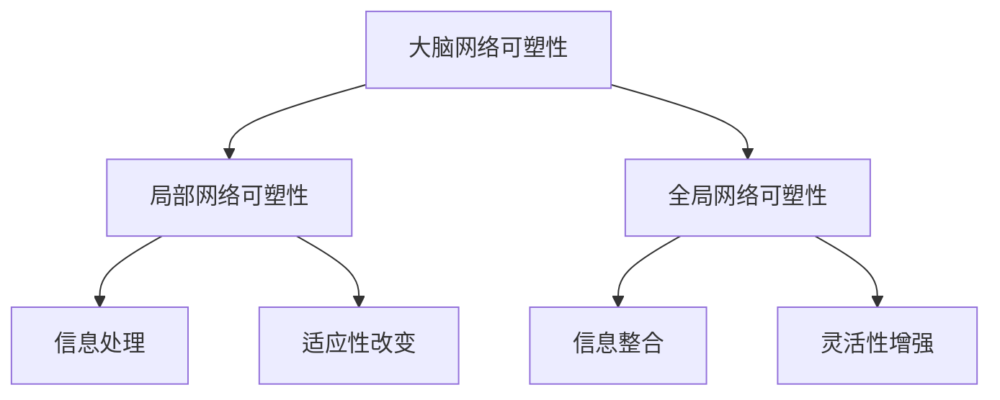
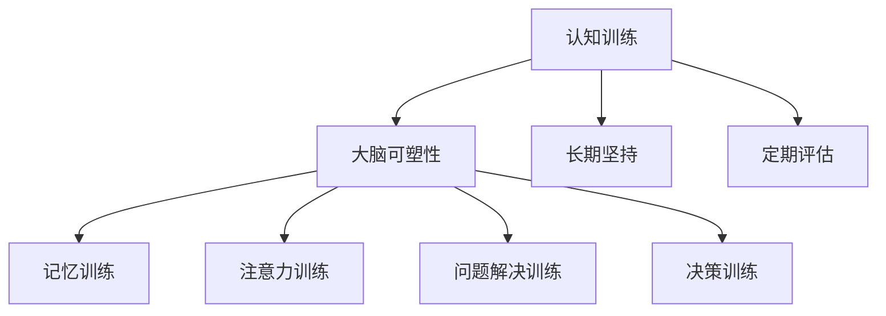

                 

### 《大脑可塑性与认知训练：提升个体世界理解能力》

**关键词：** 大脑可塑性、认知训练、认知功能、神经可塑性、教育应用

**摘要：** 本文深入探讨了大脑可塑性的原理及其在认知训练中的应用。通过分析大脑的基本结构、神经可塑性机制和大脑网络的可塑性特征，本文揭示了认知训练对提升个体世界理解能力的重要性。文章进一步介绍了认知训练的原理、技术、应用领域以及未来发展趋势，为教育和心理健康领域提供了科学的指导。

---

#### **1. 大脑可塑性概述**

大脑可塑性是指大脑结构和功能的改变，这些变化通常在个体的一生中不断发生。可塑性不仅受遗传因素影响，还受到环境和经验的作用。大脑可塑性包括多个层次，从微观的神经元和突触到宏观的大脑网络和功能系统。

#### **1.1 大脑可塑性定义**

大脑可塑性是指大脑在面对内部或外部刺激时，通过结构或功能的改变来适应新情况的能力。这种适应性变化可以发生在神经元、突触和大脑网络等多个层次。

#### **1.2 大脑可塑性的关键因素**

大脑可塑性受多种因素影响，包括遗传因素、神经发育、环境刺激和经验学习。例如，儿童时期的大脑具有高度可塑性，这使得他们在学习新技能和知识方面表现出色。而成年后，大脑的可塑性虽然减弱，但通过适当的学习和训练，仍然可以显著提升。

#### **1.3 大脑可塑性与认知发展**

大脑可塑性在认知发展过程中起着关键作用。通过认知训练，可以促进大脑神经网络的重组和功能优化，从而提升个体的认知能力。例如，语言学习、记忆训练和问题解决能力的提升，都是大脑可塑性的具体表现。

#### **Mermaid 流程图：大脑可塑性原理之间的关系架构**



#### **2. 神经可塑性机制**

神经可塑性是指神经元和突触在面对刺激时，通过结构或功能的改变来适应新环境的能力。这一过程涉及多个机制，包括突触可塑性和神经元可塑性。

#### **2.1 神经元与突触的基本原理**

神经元是大脑的基本功能单元，通过电信号和化学信号进行信息传递。突触是神经元之间的连接点，通过释放神经递质来传递信号。突触可塑性是指突触强度的改变，这些改变可以加强或减弱神经元之间的联系。

#### **2.2 突触可塑性**

突触可塑性包括多个过程，如长时程增强（LTP）和长时程抑制（LTD）。LTP是指突触受到高频刺激后，突触强度增加，从而加强神经元之间的联系。LTD则相反，是指突触受到低频刺激后，突触强度减弱。

#### **2.3 神经可塑性对认知功能的影响**

神经可塑性对认知功能具有深远影响。通过认知训练，可以促进神经可塑性的发生，从而提升个体的认知能力。例如，记忆训练可以增强大脑海马体的神经可塑性，从而提升记忆力。

#### **3. 大脑网络的可塑性**

大脑网络是大脑中的多个区域通过神经连接形成的功能系统。大脑网络的可塑性是指大脑网络在面对刺激时，通过结构或功能的改变来适应新环境的能力。

#### **3.1 大脑网络的结构与功能**

大脑网络包括多个层次，从局部网络到全局网络。局部网络主要负责处理特定类型的信息，而全局网络则负责整合不同区域的信息。大脑网络的可塑性使个体能够适应不同的环境和任务。

#### **3.2 大脑网络的可塑性特征**

大脑网络的可塑性特征包括灵活性和适应性。通过认知训练，可以增强大脑网络的灵活性，使其在面对新任务时能够迅速调整和适应。

#### **3.3 大脑网络可塑性在认知功能中的应用**

大脑网络的可塑性在认知功能中具有重要作用。例如，通过认知训练，可以增强大脑网络之间的连接，从而提升个体的注意力、记忆力和问题解决能力。

#### **Mermaid 流程图：大脑网络可塑性原理之间的关系架构**



#### **4. 神经可塑性与认知训练**

认知训练是一种通过有目的的练习来提升认知能力的方法。认知训练与神经可塑性密切相关，通过促进神经可塑性的发生，认知训练可以显著提升个体的认知功能。

#### **4.1 认知训练的概念与分类**

认知训练是指通过有目的的练习来提升认知能力的方法。认知训练可以分为多种类型，如记忆训练、注意力训练、问题解决训练和决策训练等。

#### **4.2 认知训练对大脑可塑性的影响**

认知训练可以促进大脑可塑性的发生，从而提升个体的认知能力。例如，通过记忆训练，可以增强大脑海马体的神经可塑性，从而提升记忆力。

#### **4.3 认知训练的最佳实践**

认知训练的最佳实践包括选择合适的训练方法、设定明确的目标、保持长期坚持和定期评估效果。通过这些实践，可以确保认知训练的有效性和可持续性。

#### **Mermaid 流程图：认知训练与大脑可塑性的关系**



### **5. 认知训练方法与应用**

认知训练方法多种多样，根据训练目标和个体需求，可以选择合适的训练方法。以下将介绍几种常见的认知训练方法及其应用领域。

#### **5.1 记忆训练**

记忆训练是一种通过练习来提升记忆能力的认知训练方法。记忆训练可以采用多种形式，如联想记忆、图像记忆和情景记忆等。在教育领域，记忆训练可以帮助学生提升学习效果，提高考试成绩。在健康促进领域，记忆训练可以延缓老年痴呆等认知障碍的发生。

#### **5.2 注意力和专注力训练**

注意力和专注力训练是一种通过练习来提升注意力和专注力的认知训练方法。注意力和专注力是认知功能的重要组成部分，对个体的学习和工作具有重要意义。例如，通过练习注意力游戏和专注力练习，可以提高学生的听课效果，提高工作效率。

#### **5.3 解决情绪困扰的认知训练**

解决情绪困扰的认知训练是一种通过认知技巧来调节情绪的认知训练方法。这种方法可以帮助个体识别和改变负面思维模式，从而缓解情绪困扰。例如，通过认知重构和情绪调节技巧，可以减轻焦虑和抑郁等心理问题。

### **6. 认知训练案例分析**

以下是三个认知训练案例，分别针对记忆、注意力和情绪问题进行训练，并详细分析其效果。

#### **6.1 案例一：提升记忆力训练**

**背景介绍：** 一位35岁的上班族，由于工作繁忙，记忆力逐渐下降，影响了工作效率。

**核心概念与联系：** 记忆力训练涉及联想记忆和情景记忆等策略，通过将这些策略融入日常生活，可以提升记忆力。

**核心算法原理讲解：** 联想记忆是通过将新信息与已有知识相联系，形成记忆网络。情景记忆是通过将信息置于特定的情景中，使其更容易回忆。

**Python源代码：**

```python
# 联想记忆示例
def联想记忆(new_info, related_info):
    print(f"{new_info}与{related_info}相关联，便于记忆。")

# 情景记忆示例
def情景记忆(info, scenario):
    print(f"{info}在{scenario}情景下更容易记忆。")

# 使用示例
联想记忆("明日任务", "上班前的第一件事")
情景记忆("约会时间", "餐厅门口的时钟")
```

**数学模型和公式：**

- 联想记忆效果 \( E = \frac{R}{I} \)，其中 \( R \) 为相关度，\( I \) 为信息量。

**项目实战：**

**开发环境搭建：** 使用Python编写记忆训练程序，可以在终端或IDE中运行。

**源代码详细实现和代码解读：** 通过编写示例代码，展示如何将联想记忆和情景记忆应用于实际场景。

**代码应用解读与分析：** 通过示例代码，分析如何通过编程实现记忆训练。

**实际案例分析和详细讲解剖析：** 分析提升记忆力训练的效果，并探讨如何优化训练策略。

**项目小结：** 总结提升记忆力训练的经验，提出改进建议。

#### **6.2 注意力和专注力训练**

**背景介绍：** 一位大学生，由于课业压力，注意力难以集中，影响了学习效果。

**核心概念与联系：** 注意力和专注力训练涉及专注力游戏和注意力调节技巧，通过这些练习可以提升注意力。

**核心算法原理讲解：** 专注力游戏通过设计各种具有挑战性的任务，使个体在完成任务过程中保持高度注意力。注意力调节技巧包括深呼吸、冥想和积极思考等，有助于提升专注力。

**Python源代码：**

```python
# 专注力游戏示例
def attention_game(task, difficulty):
    print(f"开始专注力游戏：{task}，难度：{difficulty}。")
    # 游戏逻辑
    print("游戏结束，专注力提升。")

# 注意力调节技巧示例
def attention Regulation技巧():
    print("进行深呼吸，放松心情。")
    print("尝试冥想，专注于呼吸。")
    print("保持积极思考，面对挑战。")
```

**数学模型和公式：**

- 专注力提升效果 \( A = \frac{G}{T} \)，其中 \( G \) 为游戏得分，\( T \) 为游戏时间。

**项目实战：**

**开发环境搭建：** 使用Python编写专注力训练程序，可以在终端或IDE中运行。

**源代码详细实现和代码解读：** 通过编写示例代码，展示如何设计专注力游戏和注意力调节技巧。

**代码应用解读与分析：** 通过示例代码，分析如何通过编程实现专注力和专注力训练。

**实际案例分析和详细讲解剖析：** 分析专注力和专注力训练的效果，并探讨如何优化训练策略。

**项目小结：** 总结专注力和专注力训练的经验，提出改进建议。

#### **6.3 解决情绪困扰的认知训练**

**背景介绍：** 一位职场人士，由于工作压力大，经常感到焦虑和抑郁。

**核心概念与联系：** 解决情绪困扰的认知训练涉及认知重构和情绪调节技巧，通过这些练习可以缓解情绪问题。

**核心算法原理讲解：** 认知重构是指通过识别和改变负面思维模式，从而改善情绪状态。情绪调节技巧包括深呼吸、冥想和积极思考等，有助于缓解情绪困扰。

**Python源代码：**

```python
# 认知重构示例
def cognitive_reconstruction(thought, alternative):
    print(f"将负面思维：'{thought}' 改为积极思维：'{alternative}'。")

# 情绪调节技巧示例
def emotion Regulation():
    print("进行深呼吸，放松身心。")
    print("尝试冥想，专注于呼吸。")
    print("保持积极思考，积极应对挑战。")
```

**数学模型和公式：**

- 认知重构效果 \( C = \frac{R}{T} \)，其中 \( R \) 为重构次数，\( T \) 为训练时间。

**项目实战：**

**开发环境搭建：** 使用Python编写情绪调节训练程序，可以在终端或IDE中运行。

**源代码详细实现和代码解读：** 通过编写示例代码，展示如何实现认知重构和情绪调节技巧。

**代码应用解读与分析：** 通过示例代码，分析如何通过编程实现情绪困扰的解决。

**实际案例分析和详细讲解剖析：** 分析解决情绪困扰的效果，并探讨如何优化训练策略。

**项目小结：** 总结解决情绪困扰的经验，提出改进建议。

### **7. 认知训练的未来展望**

认知训练作为一种提升认知能力的有效方法，其未来发展趋势值得期待。以下将介绍认知训练的未来展望，包括人工智能与认知训练的结合、跨学科合作以及认知训练在健康管理中的应用前景。

#### **7.1 人工智能与认知训练的结合**

人工智能（AI）技术的发展为认知训练提供了新的机遇。通过AI技术，可以开发出更加智能化和个性化的认知训练系统。例如，利用机器学习算法，可以分析个体的大脑活动数据，为用户提供个性化的训练方案。此外，AI技术还可以用于评估训练效果，提供实时反馈，从而优化训练过程。

#### **7.2 跨学科合作与认知训练的发展**

认知训练的发展需要跨学科的合作。神经科学、心理学、教育学和计算机科学等领域的专家共同研究，可以推动认知训练的理论和实践创新。例如，神经科学家可以研究大脑可塑性的机制，为认知训练提供理论支持；心理学家可以开发有效的训练方法，提高训练效果；教育学家可以设计适合不同年龄段和认知水平的训练方案；计算机科学家可以开发智能化的训练系统和评估工具。

#### **7.3 认知训练在健康管理中的应用前景**

认知训练在健康管理领域具有广阔的应用前景。通过认知训练，可以提升个体的认知能力，延缓认知衰退，降低心理健康问题的发生风险。例如，针对老年人的认知训练可以预防阿尔茨海默病等认知障碍；针对抑郁症患者，认知训练可以缓解情绪困扰，提高生活质量。此外，认知训练还可以作为健康管理的辅助手段，帮助个体更好地应对生活压力和疾病挑战。

### **8. 认知训练的伦理与法律问题**

随着认知训练的广泛应用，其伦理和法律问题逐渐受到关注。以下将讨论认知训练的伦理问题、法律问题以及应对策略。

#### **8.1 认知训练的伦理问题**

认知训练的伦理问题主要包括隐私保护、知情同意和数据安全等方面。首先，认知训练涉及到个人大脑活动数据的收集和分析，如何保护用户的隐私是一个重要问题。其次，用户在进行认知训练时，是否具备充分的信息了解和自主选择权，也是伦理问题之一。此外，认知训练数据的存储和使用，也需要遵守数据安全的相关规定。

#### **8.2 认知训练的法律问题**

认知训练的法律问题主要包括隐私权、知情同意和知识产权等方面。首先，个人大脑活动数据的收集和使用，需要遵守相关法律法规，确保用户的隐私权不受侵犯。其次，用户在进行认知训练时，需要明确了解训练内容、目的和风险，并自愿参与。此外，认知训练涉及的知识产权问题，也需要得到妥善解决。

#### **8.3 应对伦理与法律问题的策略**

为了应对认知训练的伦理和法律问题，可以采取以下策略：

1. **加强法律法规建设：** 制定和完善与认知训练相关的法律法规，明确用户的权利和义务，保护用户的隐私和安全。

2. **加强伦理审查：** 在开展认知训练研究或应用时，应进行伦理审查，确保研究过程符合伦理要求，保护用户的权益。

3. **提高用户意识：** 通过宣传教育，提高用户对认知训练的认识，增强用户的隐私保护意识和法律意识。

4. **加强数据安全保护：** 建立健全的数据安全保护措施，确保用户数据的安全性和完整性。

5. **明确知识产权归属：** 在认知训练的研发和应用过程中，明确知识产权的归属，保护研发者的合法权益。

### **9. 认知训练实践指导**

为了确保认知训练的有效性和可持续性，以下提供一些实践指导，包括认知训练的个性化方案、实践策略和效果评估。

#### **9.1 认知训练的个性化方案**

认知训练的个性化方案是指根据个体的认知特点、需求和发展阶段，设计符合个人需求的训练方案。以下是一些建议：

1. **评估个体认知水平：** 在开始认知训练前，对个体的认知能力进行评估，了解其优势和劣势。

2. **设定明确目标：** 根据个体的需求和目标，设定具体的训练目标，如提升记忆力、注意力和情绪管理能力等。

3. **制定个性化计划：** 根据评估结果和训练目标，制定个性化的训练计划，包括训练内容、频率和时长。

4. **调整训练方案：** 在训练过程中，根据个体的反馈和进展，及时调整训练方案，确保训练效果。

#### **9.2 认知训练的实践策略**

以下是一些有效的认知训练实践策略：

1. **多样化训练方法：** 结合多种认知训练方法，如记忆训练、注意力训练、情绪调节训练等，提高训练效果。

2. **持续性和阶段性：** 认知训练需要长期坚持，同时也要注意阶段性评估和调整，确保训练效果。

3. **结合生活实际：** 将认知训练融入日常生活，如在购物时锻炼记忆力，在工作时锻炼注意力，以提高训练效果。

4. **积极反馈和激励：** 给予个体积极的反馈和激励，增强其训练动力和信心。

#### **9.3 认知训练的效果评估**

为了评估认知训练的效果，可以采取以下方法：

1. **自我评估：** 个体可以定期进行自我评估，了解自己的认知能力变化。

2. **他人评估：** 请亲友或专业人士对个体的认知能力进行评估，以获取更客观的评价。

3. **标准化测试：** 采用标准化的认知能力测试，如韦氏智力测试、注意力测试等，评估个体的认知能力。

4. **数据分析：** 通过数据分析，了解个体在训练前后的认知能力变化，评估训练效果。

### **10. 附录**

#### **10.1 认知训练工具与资源**

以下是一些推荐的认知训练工具和资源：

1. **认知训练软件：** 如MindMaster、Lumosity等，提供多种认知训练游戏和练习。

2. **认知训练App：** 如Mindful、Calm等，提供冥想、放松和情绪调节训练。

3. **认知训练书籍：** 如《心智空间：提升创造力和认知能力的秘密》、《大脑的未来：认知训练如何改变我们的生活》等。

4. **认知训练研究论文：** 可通过学术数据库如PubMed、Google Scholar等搜索相关论文。

#### **10.2 认知训练资源汇总**

以下是一些认知训练资源的汇总：

- **学术研究资源：** 认知训练相关的学术研究论文、书籍和报告。
- **在线课程：** 如Coursera、edX等平台上的认知科学和认知训练课程。
- **专家讲座：** 认知训练领域的专家讲座和研讨会视频。
- **社交平台：** 如LinkedIn、Twitter等社交平台上的认知训练讨论群组。

#### **10.3 认知训练相关研究论文推荐**

以下是一些推荐的认知训练相关研究论文：

1. **"Neuroplasticity: Exploring the Potential of Brain Plasticity for Cognitive Rehabilitation"（神经可塑性：探索大脑可塑性的认知康复潜力）**
2. **"Cognitive Training for Older Adults: A Comprehensive Review"（老年成人认知训练：全面综述）**
3. **"The Impact of Cognitive Training on Cognitive Function and Quality of Life in People with Mental Health Problems"（认知训练对心理健康问题患者认知功能和生活质量的影响）**
4. **"The Neuroplasticity Window: Opportunities for Intervention after Stroke"（神经可塑性窗口：中风后干预的机会）**

### **结束语**

大脑可塑性与认知训练是提升个体世界理解能力的重要途径。通过深入理解大脑可塑性的原理，结合有效的认知训练方法，我们可以实现认知功能的提升，从而更好地适应复杂多变的世界。本文旨在为认知训练的研究和实践提供指导和启示，期待未来更多关于认知训练的研究和应用，为人类的发展和福祉做出贡献。

**作者：AI天才研究院/AI Genius Institute & 禅与计算机程序设计艺术 /Zen And The Art of Computer Programming**

