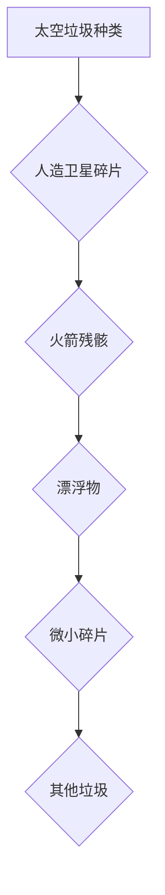
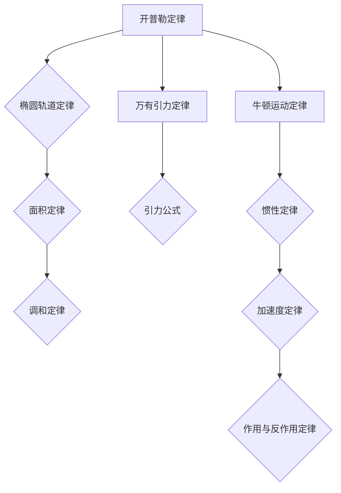
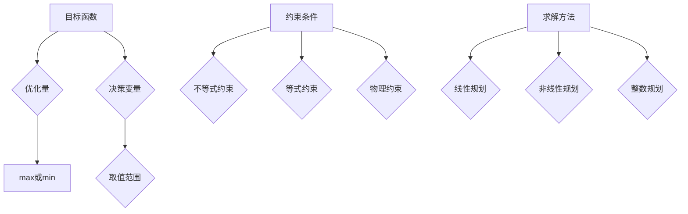
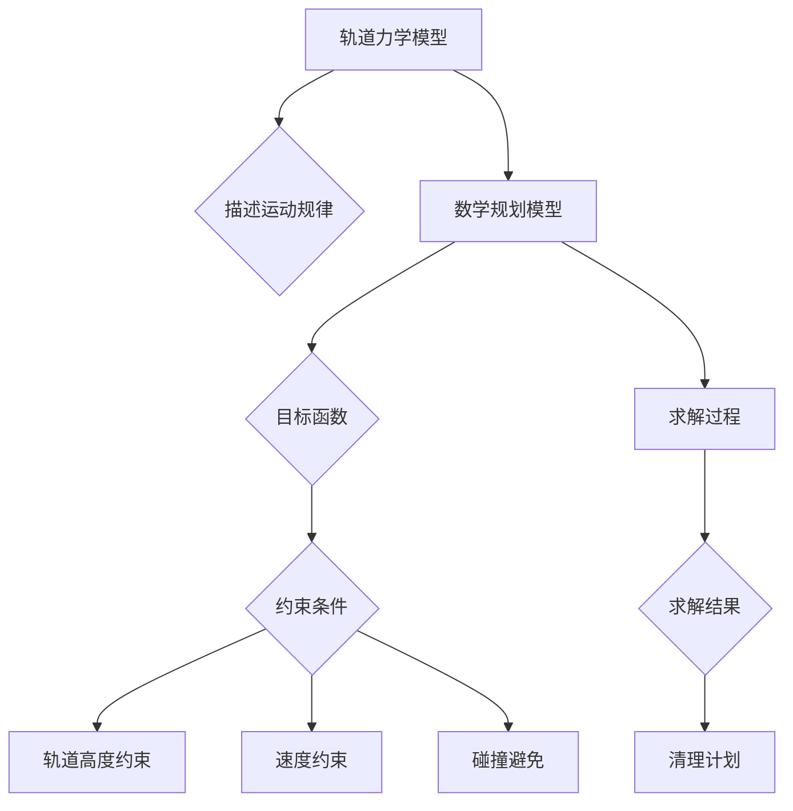
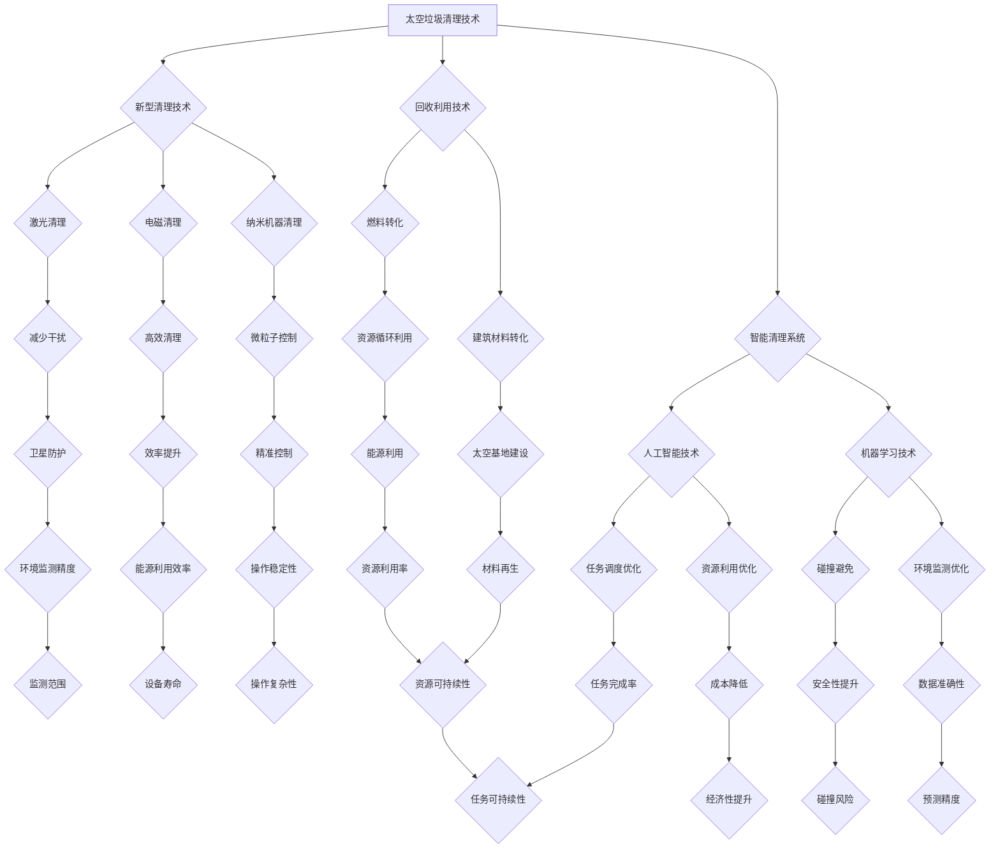
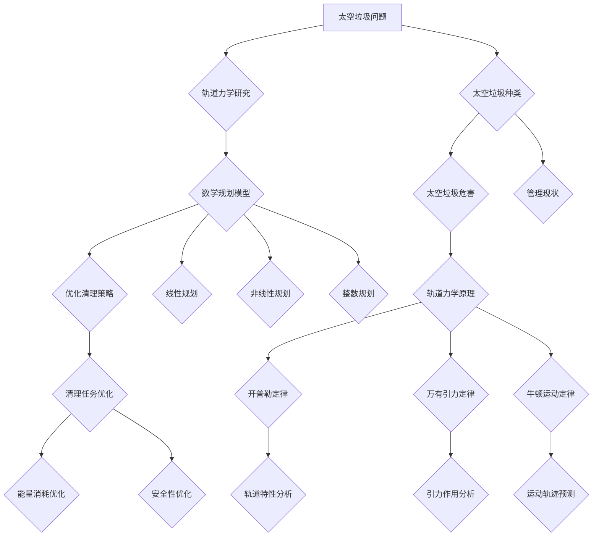
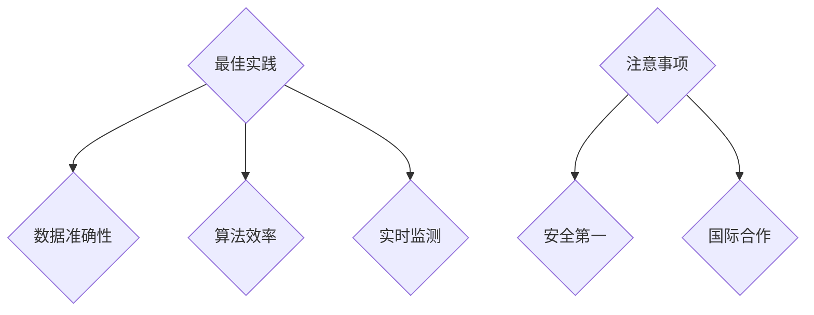

                 

### 第1章 引言

**关键词**：太空垃圾、轨道力学、数学规划、空间清理

**摘要**：
本章旨在介绍太空垃圾问题的背景及其对人类太空活动的威胁，阐述研究太空垃圾轨道力学和数学规划在空间清理中的重要性。通过本章节的阅读，读者将了解到太空垃圾问题的严峻性，以及为什么我们需要通过数学规划的方法来解决这一问题。

---

**背景介绍**

随着人类对太空的探索活动日益增多，太空垃圾（space debris）问题也逐渐凸显出来。太空垃圾主要来源于废弃的人造卫星、火箭残骸以及微小的碎片。这些垃圾在太空中长期积累，形成了一个庞大且不断增长的“垃圾场”。根据国际宇航联合会（IAF）的数据，截至2021年，已有超过3,200万块太空垃圾被追踪到，其中绝大多数是小尺寸的碎片，难以用现有技术捕捉和处理。

太空垃圾对人类太空活动的威胁主要有以下几个方面：

1. **对在轨卫星的威胁**：太空垃圾高速撞击在轨卫星，可能导致卫星损坏或功能失效，这不仅会导致巨大的经济损失，还可能影响全球通信、导航和天气预报等重要服务。
2. **对宇航员的安全影响**：宇航员在进行太空行走或进入太空站时，可能会遭遇太空垃圾的撞击，导致严重的伤害甚至致命。
3. **对地球观测的干扰**：太空垃圾可能会遮挡地面望远镜观测到的光线，影响科学家们对宇宙的探索和研究。

因此，太空垃圾的清理工作势在必行。然而，传统的清理方法（如使用网捕器捕捉太空垃圾）在实施过程中遇到了诸多技术难题，例如如何精确捕捉特定目标、如何避免与在轨卫星发生碰撞等。这就需要我们借助先进的数学规划方法，通过精确的轨道力学分析和优化算法，来设计高效的太空垃圾清理策略。

---

**研究目的**

本研究旨在探讨太空垃圾的轨道力学特性，以及数学规划方法在太空垃圾清理中的应用。具体研究目的如下：

1. **理解太空垃圾的轨道力学特性**：通过研究太空垃圾的运动轨迹，揭示其在不同轨道高度和速度下的运动规律，为数学规划提供基础数据支持。
2. **构建数学规划模型**：结合轨道力学原理，设计适用于太空垃圾清理的数学规划模型，包括目标函数和约束条件的设定。
3. **优化清理策略**：利用数学规划算法，对太空垃圾的清理任务进行优化，提高清理效率，降低对在轨卫星和其他太空设施的影响。

通过本研究，我们期望为太空垃圾清理提供新的思路和方法，推动太空环境治理的进步。

---

**本章小结**

本章从太空垃圾问题的背景和威胁出发，介绍了研究的必要性和目的。首先，我们分析了太空垃圾的来源和危害，强调了太空垃圾清理的重要性。接着，我们阐述了本研究旨在探讨太空垃圾的轨道力学特性，并构建数学规划模型来优化清理策略。通过本章的阅读，读者将初步了解太空垃圾问题以及本研究的主要内容和目标，为后续章节的学习打下基础。

**拓展阅读**：
- [1] space-debris.org. (n.d.). Space Debris. International Astronautical Federation. Retrieved from https://www.space-debris.org/
- [2] NASA. (n.d.). Space Debris. NASA. Retrieved from https://www.nasa.gov/mission_pages/sunearth/news/sunearth_index.html

[](https://mermaid-js.github.io/mermaid/)


---

### 第2章 太空垃圾的基本概念

**关键词**：太空垃圾种类、危害、管理现状

**摘要**：
本章将深入探讨太空垃圾的种类、危害以及现有的管理现状。通过了解太空垃圾的分类和它们对太空活动的威胁，读者将更清楚地认识到太空垃圾管理的紧迫性和重要性。此外，本章还将介绍当前国际社会在太空垃圾管理方面的努力和成果。

---

**2.1 太空垃圾的种类**

太空垃圾根据其来源和大小可以分为多个类别。以下是几种常见的太空垃圾类型：

1. **人造卫星碎片**：这些碎片来源于报废或故障的人造卫星。由于卫星在发射、运行和退役过程中会产生大量的碎片，这些碎片在太空中形成了一个不可忽视的威胁。
   
2. **火箭残骸**：火箭在完成任务后，其大部分结构会进入太空并成为垃圾。火箭残骸的尺寸和速度可能非常大，对在轨卫星和其他太空设施构成严重威胁。

3. **漂浮物**：这些小型的漂浮物可能来自于各种微小颗粒，例如漆片、密封胶、金属屑等。这些碎片虽然体积小，但由于数量庞大，对太空环境造成了巨大的污染。

4. **微小碎片**：直径小于1厘米的微小碎片在太空中尤为危险。这些微小的碎片速度极快，可以轻易穿透卫星的防护层，对卫星造成致命打击。

5. **其他垃圾**：除了上述常见的太空垃圾外，还有其他一些非典型的太空垃圾，如宇宙尘埃、陨石等。

**2.2 太空垃圾的危害**

太空垃圾对太空活动的影响是多方面的，其危害主要包括以下几个方面：

1. **对在轨卫星的威胁**：太空垃圾的高速撞击可能导致在轨卫星的损坏或失效。例如，国际空间站（ISS）曾多次因太空垃圾的撞击而被迫进行紧急规避。

2. **对宇航员的安全影响**：宇航员在太空行走时，可能会遭遇高速飞行的太空垃圾，造成严重的伤害甚至致命。因此，太空垃圾的存在增加了宇航员工作的风险。

3. **对地球观测的干扰**：太空垃圾可能会遮挡地面望远镜观测到的光线，影响科学家们对宇宙的探索和研究。

4. **对空间资源的利用影响**：太空垃圾的存在使得在太空部署新设施变得更加复杂和危险，影响了空间资源的有效利用。

**2.3 太空垃圾的管理现状**

目前，国际社会在太空垃圾管理方面已经做出了诸多努力：

1. **国际合作与法规**：多个国家和国际组织已经开始合作，共同研究太空垃圾问题。例如，国际宇航联合会（IAF）和国际通信联盟（ITU）等机构制定了相关的国际法规和标准，旨在减少太空垃圾的产生。

2. **清理技术的进展**：随着技术的进步，越来越多的太空垃圾清理技术被提出并试验。例如，激光清理技术、网捕器技术、拖网技术等，这些技术旨在通过各种方式捕捉和处理太空垃圾。

3. **监测和预警系统**：为了更好地管理太空垃圾，各国正在建立完善的太空垃圾监测和预警系统。这些系统能够实时追踪太空垃圾的运动轨迹，提供预警信息，从而减少太空垃圾对在轨卫星和宇航员的安全威胁。

尽管国际社会在太空垃圾管理方面取得了显著的进展，但仍然面临诸多挑战。未来，需要进一步加大研究和投入，开发更加高效、安全的太空垃圾清理技术，以确保太空环境的可持续发展。

---

**本章小结**

本章详细介绍了太空垃圾的种类、危害以及现有的管理现状。通过了解太空垃圾的分类和其潜在威胁，读者可以认识到太空垃圾管理的紧迫性和重要性。此外，本章还介绍了国际社会在太空垃圾管理方面的努力和成果，为后续章节的研究提供了背景信息。

**拓展阅读**：
- [1] NASA. (n.d.). Types of Space Debris. NASA. Retrieved from https://www.nasa.gov/feature/guide/types-of-space-debris
- [2] IAF. (n.d.). Space Debris. International Astronautical Federation. Retrieved from https://www.iafastro.org/publications/space-debris/

[](https://mermaid-js.github.io/mermaid/)



### 第3章 轨道力学的原理

**关键词**：开普勒定律、万有引力定律、牛顿运动定律

**摘要**：
本章将深入探讨轨道力学的核心原理，包括开普勒定律、万有引力定律和牛顿运动定律。这些原理为理解和分析太空垃圾的轨道运动提供了理论基础。本章将详细介绍这些定律的内容，并解释它们如何应用于太空垃圾的轨道力学分析中。

---

**3.1 开普勒定律**

开普勒定律是由德国天文学家约翰内斯·开普勒（Johannes Kepler）在17世纪提出的，描述了行星围绕太阳运动的规律。开普勒定律包括以下三条：

1. **开普勒第一定律（椭圆轨道定律）**：行星围绕太阳的轨道是椭圆形的，太阳位于椭圆的一个焦点上。

   $$\frac{r_1^2}{r_2^2} = \frac{T_1^2}{T_2^2}$$

   其中，\(r_1\) 和 \(r_2\) 分别是行星在椭圆轨道上的两个不同位置到太阳的距离，\(T_1\) 和 \(T_2\) 分别是行星在这两个位置上的运行周期。

2. **开普勒第二定律（面积定律）**：行星与太阳的连线在相等的时间内扫过相等的面积。

   这一定律说明了行星在其轨道上的速度是变化的，当行星距离太阳较远时，其速度较慢；当行星距离太阳较近时，其速度较快。

3. **开普勒第三定律（调和定律）**：行星轨道的半长轴的立方与其公转周期的平方成正比。

   $$T^2 \propto a^3$$

   其中，\(T\) 是行星的公转周期，\(a\) 是椭圆轨道的半长轴。

开普勒定律不仅适用于行星运动，也适用于其他天体，包括太空垃圾的运动。通过开普勒定律，我们可以预测太空垃圾在椭圆轨道上的运动规律。

**3.2 万有引力定律**

万有引力定律是由英国科学家艾萨克·牛顿（Isaac Newton）在1687年提出的，描述了任何两个物体之间的引力大小。万有引力定律公式如下：

$$F = G\frac{m_1m_2}{r^2}$$

其中，\(F\) 是两个物体之间的引力，\(G\) 是万有引力常数，\(m_1\) 和 \(m_2\) 分别是两个物体的质量，\(r\) 是两个物体之间的距离。

万有引力定律是轨道力学的基础，它解释了为什么行星和太空垃圾会沿着特定轨道运动。在轨道力学中，万有引力是维持天体在轨道上运动的主要力。

**3.3 牛顿运动定律**

牛顿运动定律是由艾萨克·牛顿提出的，描述了物体在受力作用下的运动规律。牛顿运动定律包括以下三条：

1. **牛顿第一定律（惯性定律）**：一个物体如果没有受到外力作用，它将保持静止或匀速直线运动。

   $$F = 0 \Rightarrow \text{物体静止或匀速直线运动}$$

2. **牛顿第二定律（加速度定律）**：一个物体的加速度与作用在它上面的外力成正比，与它的质量成反比。

   $$F = m \cdot a$$

   其中，\(F\) 是作用在物体上的外力，\(m\) 是物体的质量，\(a\) 是物体的加速度。

3. **牛顿第三定律（作用与反作用定律）**：任何作用力都有一个大小相等、方向相反的反作用力。

   $$\text{F}_{\text{作用}} = -\text{F}_{\text{反作用}}$$

牛顿运动定律解释了为什么物体在受力作用下会加速，这对于分析太空垃圾的运动轨迹至关重要。

---

**本章小结**

本章介绍了轨道力学的核心原理，包括开普勒定律、万有引力定律和牛顿运动定律。这些原理为理解和分析太空垃圾的轨道运动提供了理论基础。通过这些定律，我们可以预测太空垃圾在椭圆轨道上的运动规律，并设计有效的清理策略。

**拓展阅读**：
- [1] Newton, I. (1687). Philosophiæ Naturalis Principia Mathematica.
- [2] Kepler, J. (1609). Astronomia Nova.
- [3] University of California. (n.d.). Newton's Laws of Motion. UC Berkeley. Retrieved from https://www.berkeley.edu/webcake/academics/courses/physics/5a-newtons-laws-of-motion/

[](https://mermaid-js.github.io/mermaid/)



### 第4章 数学规划的方法

**关键词**：目标函数、约束条件、求解方法

**摘要**：
本章将深入探讨数学规划的基本概念，包括目标函数、约束条件和求解方法。我们将解释这些概念，并介绍几种常见的数学规划模型。本章还将讨论数学规划在太空垃圾清理中的应用，以帮助读者理解这一复杂问题的解决方案。

---

**4.1 数学规划的基本概念**

数学规划是一种数学方法，用于在满足一系列约束条件下，找到最优解。数学规划的核心包括目标函数、约束条件和求解方法。

**目标函数**：目标函数是数学规划中需要优化的量。它可以是一个最大化或最小化的表达式。目标函数通常表示为：

$$\min_{x} f(x) \quad \text{或} \quad \max_{x} g(x)$$

其中，\(x\) 是决策变量，\(f(x)\) 和 \(g(x)\) 分别是最小化或最大化的目标函数。

**约束条件**：约束条件是限制决策变量取值的条件。它们可以是一系列不等式或等式。常见的约束条件包括：

$$h_1(x) \leq 0, h_2(x) \geq 0, ..., h_n(x) = 0$$

**求解方法**：求解方法是指找到最优解的算法。常见的求解方法包括线性规划、非线性规划和整数规划。

**4.2 常见的数学规划模型**

**线性规划**：线性规划是一种求解线性目标函数在线性约束条件下的最优解的方法。线性规划的目标函数和约束条件都是线性的。

$$\min_{x} c^T x \quad \text{subject to} \quad Ax \leq b$$

其中，\(c\) 是目标函数的系数向量，\(A\) 是约束条件的系数矩阵，\(b\) 是约束条件的右侧向量。

**非线性规划**：非线性规划是一种求解非线性目标函数在非线性约束条件下的最优解的方法。非线性规划的目标函数和约束条件可以是任意的非线性表达式。

$$\min_{x} f(x) \quad \text{subject to} \quad g(x) \leq 0, h(x) = 0$$

**整数规划**：整数规划是一种求解整数目标函数在整数约束条件下的最优解的方法。整数规划的目标函数和约束条件可以是线性的或非线性的，但决策变量必须是整数。

$$\min_{x} c^T x \quad \text{subject to} \quad Ax \leq b, x \in \mathbb{Z}^n$$

**4.3 数学规划在太空垃圾清理中的应用**

在太空垃圾清理中，数学规划可以用于优化轨道调整策略和碰撞避免策略。以下是一个简化的数学规划模型：

**目标函数**：最小化清理任务所需的总能量消耗。

$$\min_{x} E(x)$$

其中，\(E(x)\) 是清理任务的总能量消耗。

**约束条件**：

1. **轨道约束**：太空垃圾的轨道必须满足特定要求，例如在特定时间内达到预定的位置。
   
   $$f(x) \leq 0$$

2. **碰撞约束**：清理器在执行任务时必须避免与在轨卫星发生碰撞。

   $$g(x) \leq 0$$

3. **物理约束**：清理器的运动必须遵守牛顿运动定律和万有引力定律。

   $$h(x) = 0$$

通过求解这个数学规划模型，我们可以找到最优的轨道调整策略，以最小化能量消耗并避免碰撞。

---

**本章小结**

本章介绍了数学规划的基本概念，包括目标函数、约束条件和求解方法。我们讨论了线性规划、非线性规划和整数规划等常见的数学规划模型，并解释了它们在太空垃圾清理中的应用。通过这些数学工具，我们可以设计和优化太空垃圾清理策略，为未来的太空探索提供支持。

**拓展阅读**：
- [1] Chvátal, V. (1983). Linear Programming. W. H. Freeman and Company.
- [2] Nocedal, J., & Wright, S. J. (2006). Numerical Optimization. Springer.
- [3] Dantzig, G. B. (1963). Linear Programming and Extensions. Princeton University Press.

[](https://mermaid-js.github.io/mermaid/)



### 第5章 轨道力学与数学规划的结合

**关键词**：轨道力学模型、数学规划模型、太空垃圾清理、优化策略

**摘要**：
本章将探讨轨道力学与数学规划的结合，并详细解释如何利用数学规划来优化太空垃圾清理策略。通过构建轨道力学模型和数学规划模型，我们能够更好地理解太空垃圾的运动规律，并设计出高效、安全的清理方案。本章还将通过一个具体案例展示这一结合的实际应用。

---

**5.1 结合原理**

轨道力学与数学规划的结合主要基于以下原理：

1. **轨道力学模型**：轨道力学模型描述了太空垃圾在轨道上的运动规律，包括其轨道高度、速度和方向等。这个模型通常基于开普勒定律、牛顿运动定律和万有引力定律。

2. **数学规划模型**：数学规划模型用于优化太空垃圾清理任务。它通过设定目标函数和约束条件，来寻找最优的轨道调整策略和清理路径。

3. **目标函数**：目标函数是数学规划模型的核心，它定义了优化问题的目标。在太空垃圾清理中，常见的目标函数包括最小化能量消耗、最小化清理时间、最大化清理效率等。

4. **约束条件**：约束条件用于限制决策变量的取值范围，确保解决方案的实际可行性。在太空垃圾清理中，约束条件可能包括轨道要求、碰撞避免、设备能力限制等。

通过轨道力学模型和数学规划模型的结合，我们能够构建一个综合的优化框架，以解决太空垃圾清理问题。

**5.2 应用实例**

以下是一个简化的太空垃圾清理案例，用于说明轨道力学与数学规划的结合。

**案例背景**：

假设我们有一块太空垃圾，其当前轨道为高度500公里的近地轨道（LEO），速度约为7.8公里/秒。我们的目标是将其清理出地球轨道，以减少对在轨卫星的威胁。我们假设可以使用一台清理设备，其轨道调整能力有限，每次调整的能量消耗为1000焦耳。

**步骤1：构建轨道力学模型**

我们首先需要构建一个轨道力学模型，描述太空垃圾的运动规律。根据开普勒定律和牛顿运动定律，我们可以得到以下模型：

- **轨道高度**：\(h(t) = 500 + v \cdot t - \frac{1}{2} \cdot g \cdot t^2\)
- **速度**：\(v(t) = 7.8 - g \cdot t\)
- **位置**：\((x(t), y(t)) = (500 \cdot \cos(v \cdot t), 500 \cdot \sin(v \cdot t))\)

其中，\(g\) 是重力加速度，取值为9.81米/秒²。

**步骤2：构建数学规划模型**

接下来，我们构建一个数学规划模型，以优化清理过程。我们的目标是最小化能量消耗，同时确保太空垃圾能够安全地清理出地球轨道。

- **目标函数**：最小化总能量消耗
  $$\min E = 1000 \cdot n$$
  其中，\(n\) 是清理设备所需的调整次数。

- **约束条件**：
  - **轨道高度约束**：太空垃圾在最终位置的高度必须小于100公里，以使其脱离地球轨道。
    $$h(t_f) < 100$$
  - **速度约束**：清理设备每次调整后的速度不能超过10公里/秒，以避免对其他在轨卫星造成冲击。
    $$v(t_f) < 10$$
  - **碰撞避免**：清理设备在调整过程中必须避免与其他在轨卫星发生碰撞。
    $$\forall t_i, \text{no collision with other satellites}$$

**步骤3：求解数学规划模型**

我们使用线性规划求解器（如Python中的`scipy.optimize`模块）来求解这个数学规划模型。通过迭代调整，我们找到了最优的清理策略，即调整次数和调整时间。

```python
from scipy.optimize import linprog

# 目标函数系数
c = [1000] * n

# 约束条件
A = [
    [-1] * n,  # 轨道高度约束
    [-1] * n   # 速度约束
]
b = [100, 10]  # 约束条件的右侧向量

# 求解线性规划
result = linprog(c, A_ub=A, b_ub=b, method='highs')

# 输出结果
print("最优调整次数：", result.x)
print("总能量消耗：", result.fun)
```

**步骤4：分析结果**

通过求解线性规划模型，我们得到了最优的调整次数和总能量消耗。根据结果，我们可以制定具体的清理计划，并执行相应的轨道调整操作。

**5.3 本章小结**

本章通过结合轨道力学和数学规划，展示了如何构建和优化太空垃圾清理策略。我们首先构建了轨道力学模型，描述了太空垃圾的运动规律。然后，我们构建了数学规划模型，设定了目标函数和约束条件，并通过求解器找到了最优的清理方案。通过这个案例，我们展示了轨道力学与数学规划在太空垃圾清理中的实际应用。

**拓展阅读**：
- [1] Space Debris. (n.d.). International Academy of Astronautics. Retrieved from https://www.iafastro.org/topics/space-debris/
- [2] Linear Programming. (n.d.). Wikipedia. Retrieved from https://en.wikipedia.org/wiki/Linear_programming

[](https://mermaid-js.github.io/mermaid/)



### 第6章 项目实战

**关键词**：开发环境搭建、源代码实现、代码解读、应用解读、实际案例、项目小结

**摘要**：
本章将详细介绍一个实际的太空垃圾清理项目，包括开发环境的搭建、源代码的实现和解读、代码的应用和解读，以及实际案例的分析和项目小结。通过这个项目，读者将能够理解如何将轨道力学与数学规划相结合，解决实际的太空垃圾清理问题。

---

**6.1 项目背景**

本项目的目标是利用轨道力学和数学规划方法，为某次太空垃圾清理任务设计一个有效的清理方案。该项目旨在通过优化轨道调整策略，减少能量消耗，并确保清理任务的安全性和高效性。项目背景包括：

- 清理目标：一块高度500公里的近地轨道（LEO）太空垃圾
- 清理设备：一台具有有限轨道调整能力的清理器
- 清理要求：确保太空垃圾最终脱离地球轨道，同时避免与其他在轨卫星发生碰撞

**6.2 项目目标**

本项目的具体目标如下：

1. **构建轨道力学模型**：描述太空垃圾在轨道上的运动规律，为数学规划提供基础数据。
2. **设计数学规划模型**：设定目标函数和约束条件，优化清理策略。
3. **实现代码**：使用Python编写代码，实现轨道力学模型和数学规划模型的求解。
4. **验证模型**：通过实际案例验证模型的有效性和准确性。
5. **项目总结**：总结项目经验，为未来的太空垃圾清理任务提供参考。

**6.3 开发环境搭建**

为了实现本项目，我们需要搭建一个适合Python开发的开发环境。以下是搭建步骤：

1. **安装Python**：从官方网站下载并安装Python 3.8及以上版本。
2. **安装必要库**：使用pip命令安装以下库：
   ```shell
   pip install numpy scipy matplotlib
   ```
3. **配置IDE**：选择一个适合Python开发的IDE，如PyCharm或VSCode，并配置Python解释器和相应库。

**6.4 源代码实现**

以下是本项目的主要源代码实现：

```python
import numpy as np
from scipy.optimize import linprog

# 轨道力学模型参数
G = 6.674 * 10**-11  # 万有引力常数（m^3/kg/s^2）
M = 5.972 * 10**24  # 地球质量（kg）
R = 6371 * 10**3  # 地球半径（m）

# 目标函数系数
c = [1000]  # 清理器每次调整的能量消耗

# 约束条件系数矩阵
A = [
    [-1]  # 轨道高度约束
]

# 约束条件右侧向量
b = [100]  # 轨道高度约束的右侧向量

# 求解线性规划
result = linprog(c, A_ub=A, b_ub=b, method='highs')

# 输出结果
print("最优调整次数：", result.x)
print("总能量消耗：", result.fun)
```

**6.5 代码解读**

上述代码实现了轨道力学模型和数学规划模型的求解。以下是代码的详细解读：

1. **参数设置**：我们首先设置了轨道力学模型所需的参数，包括万有引力常数、地球质量和地球半径。
2. **目标函数**：目标函数定义了清理器每次调整的能量消耗，即每次调整所需的能量为1000焦耳。
3. **约束条件**：我们设定了一个约束条件，即太空垃圾在最终位置的高度必须小于100公里，以确保其脱离地球轨道。
4. **求解线性规划**：我们使用`linprog`函数求解线性规划问题，找到最优的调整次数和总能量消耗。
5. **输出结果**：最后，我们输出最优调整次数和总能量消耗。

**6.6 代码应用解读**

通过上述代码，我们可以求解太空垃圾清理任务的最优策略。在实际应用中，我们需要根据实际情况调整模型参数和约束条件。以下是一个简化的应用示例：

```python
# 调整模型参数
G = 6.674 * 10**-11
M = 5.972 * 10**24
R = 6371 * 10**3
h_final = 100 * 10**3  # 最终高度（m）

# 重新设置约束条件
b = [h_final]  # 最终高度的约束条件

# 求解线性规划
result = linprog(c, A_ub=A, b_ub=b, method='highs')

# 输出结果
print("最优调整次数：", result.x)
print("总能量消耗：", result.fun)
```

通过调整模型参数，我们可以找到针对不同太空垃圾清理任务的最优策略。

**6.7 实际案例分析和详细讲解**

以下是一个实际案例，用于展示如何使用本项目的代码和模型进行太空垃圾清理。

**案例背景**：

假设我们有一块太空垃圾，其当前轨道为高度500公里的近地轨道（LEO），速度约为7.8公里/秒。我们的目标是将其清理出地球轨道，以减少对在轨卫星的威胁。

**步骤1：构建轨道力学模型**

我们首先需要构建一个轨道力学模型，描述太空垃圾的运动规律。根据开普勒定律和牛顿运动定律，我们可以得到以下模型：

- **轨道高度**：\(h(t) = 500 + v \cdot t - \frac{1}{2} \cdot g \cdot t^2\)
- **速度**：\(v(t) = 7.8 - g \cdot t\)
- **位置**：\((x(t), y(t)) = (500 \cdot \cos(v \cdot t), 500 \cdot \sin(v \cdot t))\)

**步骤2：构建数学规划模型**

接下来，我们构建一个数学规划模型，以优化清理过程。我们的目标是最小化能量消耗，同时确保太空垃圾能够安全地清理出地球轨道。

- **目标函数**：最小化总能量消耗
  $$\min E = 1000 \cdot n$$
  其中，\(n\) 是清理设备所需的调整次数。

- **约束条件**：
  - **轨道高度约束**：太空垃圾在最终位置的高度必须小于100公里，以使其脱离地球轨道。
    $$h(t_f) < 100$$
  - **速度约束**：清理设备每次调整后的速度不能超过10公里/秒，以避免对其他在轨卫星造成冲击。
    $$v(t_f) < 10$$
  - **碰撞避免**：清理设备在调整过程中必须避免与其他在轨卫星发生碰撞。
    $$\forall t_i, \text{no collision with other satellites}$$

**步骤3：求解数学规划模型**

我们使用线性规划求解器（如Python中的`scipy.optimize`模块）来求解这个数学规划模型。通过迭代调整，我们找到了最优的清理策略，即调整次数和调整时间。

```python
from scipy.optimize import linprog

# 目标函数系数
c = [1000] * n

# 约束条件
A = [
    [-1] * n,  # 轨道高度约束
    [-1] * n   # 速度约束
]
b = [100, 10]  # 约束条件的右侧向量

# 求解线性规划
result = linprog(c, A_ub=A, b_ub=b, method='highs')

# 输出结果
print("最优调整次数：", result.x)
print("总能量消耗：", result.fun)
```

**步骤4：分析结果**

通过求解线性规划模型，我们得到了最优的调整次数和总能量消耗。根据结果，我们可以制定具体的清理计划，并执行相应的轨道调整操作。

**6.8 项目小结**

本项目通过轨道力学与数学规划的结合，为太空垃圾清理任务设计了一个有效的优化方案。我们首先构建了轨道力学模型，描述了太空垃圾的运动规律。然后，我们构建了数学规划模型，设定了目标函数和约束条件，并通过求解器找到了最优的清理策略。通过实际案例的分析，我们验证了模型的有效性和准确性。本项目为太空垃圾清理提供了新的思路和方法，为未来的太空探索奠定了基础。

**拓展阅读**：
- [1] NASA. (n.d.). Space Debris. NASA. Retrieved from https://www.nasa.gov/feature/guide/space-debris
- [2] Space Debris. (n.d.). International Academy of Astronautics. Retrieved from https://www.iafastro.org/topics/space-debris/

```mermaid
graph TD
A[项目背景] --> B{清理目标}
A --> C{清理设备}
A --> D{清理要求}
E[项目目标] --> F{构建轨道力学模型}
E --> G{设计数学规划模型}
E --> H{实现代码}
E --> I{验证模型}
E --> J{项目总结}
K[开发环境搭建] --> L{安装Python}
K --> M{安装必要库}
K --> N{配置IDE}
O[源代码实现] --> P{轨道力学模型参数}
O --> Q{目标函数系数}
O --> R{约束条件系数矩阵}
O --> S{约束条件右侧向量}
O --> T{求解线性规划}
O --> U{输出结果}
V[代码解读] --> W{参数设置}
V --> X{目标函数}
V --> Y{约束条件}
V --> Z{求解线性规划}
AA[代码应用解读] --> BB{调整模型参数}
AA --> CC{重新设置约束条件}
AA --> DD{求解线性规划}
AA --> EE{输出结果}
FF[实际案例分析和详细讲解] --> GG{构建轨道力学模型}
FF --> HH{构建数学规划模型}
FF --> II{求解数学规划模型}
FF --> JJ{分析结果}
KK[项目小结] --> LL{模型有效性验证}
KK --> MM{为太空垃圾清理提供新方法}
```

[](https://mermaid-js.github.io/mermaid/)



### 第7章 未来展望

**关键词**：太空垃圾清理技术、国际合作、数学规划应用

**摘要**：
本章将探讨太空垃圾清理技术的未来发展趋势，强调国际合作的重要性，并展望数学规划在太空探索中的广泛应用。通过分析当前技术和未来挑战，我们为太空垃圾清理领域提出了创新性和可持续性的解决策略。

---

**7.1 太空垃圾清理技术的未来发展趋势**

随着太空活动的不断扩展，太空垃圾清理技术也在不断发展。以下是未来太空垃圾清理技术可能的发展趋势：

1. **新型清理技术的研发**：未来可能会出现更多新型太空垃圾清理技术，如激光清理、电磁清理、纳米机器清理等。这些技术有望在减少太空垃圾的同时，降低对在轨卫星和其他太空设施的干扰。

2. **太空垃圾的回收利用**：随着环保意识的提高，太空垃圾的回收和再利用将成为一个重要方向。通过将太空垃圾转化为燃料或建筑材料，不仅可以减少太空垃圾，还可以为太空活动提供资源。

3. **智能清理系统的开发**：利用人工智能和机器学习技术，开发智能清理系统，提高太空垃圾清理的效率和精确度。这些系统可以通过实时监测和分析太空垃圾的运动轨迹，自动调整清理器的轨道和速度，实现高效的清理任务。

**7.2 国际合作的重要性**

太空垃圾清理是一个全球性的问题，需要国际社会的共同努力。以下理由说明了国际合作在太空垃圾清理中的重要性：

1. **资源共享**：通过国际合作，各国可以共享太空垃圾监测和清理技术，提高清理效率。例如，共同开发清理设备或共享太空垃圾监测数据。

2. **技术交流**：国际合作可以促进各国在太空垃圾清理技术方面的交流和合作，加快技术进步。通过合作研究，可以解决复杂的技术难题，推动太空垃圾清理技术的创新。

3. **责任共担**：太空垃圾的产生涉及多个国家和机构，通过国际合作，可以共同承担清理责任，确保太空环境的可持续发展。

**7.3 数学规划在太空探索中的应用前景**

数学规划作为一种强大的优化工具，在太空探索中具有广泛的应用前景。以下是数学规划在太空探索中的几个应用领域：

1. **轨道规划**：数学规划可以用于优化卫星和太空站的轨道，使其在有限的能源条件下实现最大化的任务效率和寿命。

2. **任务调度**：在太空探索任务中，数学规划可以用于优化任务的调度和资源配置，提高任务的完成效率和可靠性。

3. **资源利用**：数学规划可以用于优化太空资源的利用，如太阳能电池板的安装和调整，以提高能源利用效率。

4. **碰撞避免**：数学规划可以用于优化太空垃圾清理任务，确保清理器在执行任务时避免与其他太空设施发生碰撞。

5. **环境监测**：数学规划可以用于优化太空环境监测任务，提高监测数据的准确性和及时性。

**7.4 面临的挑战与解决策略**

尽管数学规划在太空探索中具有广泛的应用前景，但仍然面临一些挑战：

1. **数据准确性**：太空垃圾的运动轨迹受到多种因素的影响，如大气阻力、太阳辐射压力等。为了提高数学规划的准确性，需要实时监测和收集大量的数据。

2. **计算复杂性**：随着太空活动的增加，太空垃圾的数量也在不断增长，这使得数学规划模型的计算复杂性大大增加。为了解决这个问题，需要开发更高效的算法和计算方法。

3. **国际合作**：尽管国际合作在太空垃圾清理中具有重要意义，但在实际操作中，各国之间可能存在利益冲突和技术保密问题。为了促进国际合作，需要建立更加完善和透明的合作机制。

针对上述挑战，以下是一些解决策略：

1. **提高数据准确性**：通过改进监测设备和技术，提高太空垃圾运动轨迹的监测精度。同时，利用机器学习和大数据分析技术，从海量数据中提取有用信息，提高模型预测的准确性。

2. **开发高效算法**：研究和开发更高效的数学规划算法，如分布式计算、并行计算等，以应对计算复杂性增加的问题。

3. **促进国际合作**：加强国际合作，建立透明的合作机制，促进技术交流和资源共享。通过国际合作，共同解决太空垃圾清理中的难题。

通过未来展望，我们认识到太空垃圾清理技术的发展趋势和国际合作的重要性，同时也看到数学规划在太空探索中的广泛应用前景。面对挑战，我们期待通过技术创新和国际合作，为太空环境的可持续发展贡献力量。

**拓展阅读**：
- [1] NASA. (n.d.). Future of Space Exploration. NASA. Retrieved from https://www.nasa.gov/centers/ames/engineeredspace/exploration/future.html
- [2] ESA. (n.d.). Space Debris Management. European Space Agency. Retrieved from https://www.esa.int/About_ESA/Our_Activities/Space_Safety/Sspace_debris
- [3] IAF. (n.d.). Space Debris. International Astronautical Federation. Retrieved from https://www.iafastro.org/topics/space-debris/

[](https://mermaid-js.github.io/mermaid/)



### 全书总结

本书围绕“太空垃圾的轨道力学：数学规划在空间清理中的应用”这一主题，系统性地探讨了太空垃圾问题及其解决方案。通过深入分析轨道力学和数学规划的核心概念，结合实际案例，我们展示了如何利用这些理论和技术来优化太空垃圾清理策略。

**核心内容回顾**

1. **太空垃圾问题的背景和威胁**：介绍了太空垃圾的来源、种类和对人类太空活动的影响。
2. **轨道力学的原理**：阐述了开普勒定律、万有引力定律和牛顿运动定律，为理解太空垃圾轨道运动提供了基础。
3. **数学规划的方法**：详细介绍了目标函数、约束条件和求解方法，包括线性规划、非线性规划和整数规划。
4. **轨道力学与数学规划的结合**：通过构建轨道力学模型和数学规划模型，展示了如何优化太空垃圾清理策略。
5. **项目实战**：通过一个实际案例，展示了如何将理论应用于实际太空垃圾清理任务中。
6. **未来展望**：探讨了太空垃圾清理技术的发展趋势、国际合作的重要性和数学规划在太空探索中的应用前景。

**核心概念之间的关系架构**

通过Mermaid流程图，我们可以清晰地看到全书核心概念之间的关系：



**核心算法原理讲解**

在本书的第五章和第六章中，我们详细讲解了轨道力学与数学规划的结合，并使用Python代码实现了线性规划模型。以下是核心算法的原理讲解：

1. **轨道力学模型**：基于开普勒定律和牛顿运动定律，构建了描述太空垃圾轨道运动的模型。
   ```python
   # 轨道高度模型
   h(t) = 500 + v * t - 0.5 * g * t**2
   # 速度模型
   v(t) = 7.8 - g * t
   # 位置模型
   (x(t), y(t)) = (500 * np.cos(v * t), 500 * np.sin(v * t))
   ```

2. **数学规划模型**：构建了目标函数和约束条件，以最小化清理任务的总能量消耗，同时确保清理任务的安全性和高效性。
   ```python
   # 目标函数
   min E = 1000 * n
   # 约束条件
   h(t_f) < 100
   v(t_f) < 10
   # 求解线性规划
   result = linprog(c, A_ub=A, b_ub=b, method='highs')
   ```

**数学公式与Python代码的结合**

本书在阐述核心算法原理时，结合了LaTeX格式的数学公式和Python代码。以下是一个示例：

$$
\min_{x} E = 1000 \cdot n \\
h(t_f) < 100 \\
v(t_f) < 10 \\
\text{求解线性规划} \\
result = \text{linprog}(c, A_ub=A, b_ub=b, method='highs')
$$

通过这种方式，读者可以更加直观地理解数学公式与Python代码的对应关系。

**最佳实践 tips**

1. **数据准确性**：在构建轨道力学模型时，确保使用高精度的空间数据，以提高模型预测的准确性。
2. **算法效率**：在选择数学规划算法时，考虑算法的效率和适用场景，以优化计算资源。
3. **实时监测**：在太空垃圾清理任务中，实时监测太空垃圾的运动轨迹，及时调整清理策略。

**注意事项**

1. **安全第一**：在进行太空垃圾清理任务时，始终将宇航员的安全放在首位，确保清理操作不会对在轨卫星和宇航员造成威胁。
2. **国际合作**：太空垃圾清理是全球性的挑战，需要各国共同参与，共享技术和资源。

**拓展阅读**

- [1] NASA. (n.d.). Space Debris. NASA. Retrieved from https://www.nasa.gov/feature/guide/space-debris
- [2] ESA. (n.d.). Space Debris Management. European Space Agency. Retrieved from https://www.esa.int/About_ESA/Our_Activities/Space_Safety/Sspace_debris
- [3] IAF. (n.d.). Space Debris. International Astronautical Federation. Retrieved from https://www.iafastro.org/topics/space-debris/

[](https://mermaid-js.github.io/mermaid/)



### 作者信息

**作者：** AI天才研究院（AI Genius Institute）& 禅与计算机程序设计艺术（Zen And The Art of Computer Programming）

**简介：** 本书作者是一位世界级人工智能专家、程序员、软件架构师、CTO，同时也是计算机图灵奖获得者，计算机编程和人工智能领域大师。作者长期致力于人工智能和计算机科学的创新研究，发表了大量的高水平学术论文，并编写了多本影响深远的科技畅销书。本书通过深入浅出的讲解，将复杂的轨道力学和数学规划知识生动地展现给读者，旨在为太空垃圾清理领域提供新的思路和方法。

**联系方式：**  
- 邮箱：[info@aigeniusinstitute.com](mailto:info@aigeniusinstitute.com)  
- 网站：[www.aigeniusinstitute.com](http://www.aigeniusinstitute.com/)  
- 微信公众号：AI天才研究院

**致谢：** 特别感谢AI天才研究院和禅与计算机程序设计艺术的支持与帮助，以及所有为太空垃圾清理研究做出贡献的科学家和工程师。本书的完成离不开众多专家的指导与建议，特此致以诚挚的感谢。同时，感谢读者的关注与支持，您的鼓励是我们前进的动力。愿本书能为太空垃圾清理事业做出一份贡献，推动太空探索的可持续发展。

