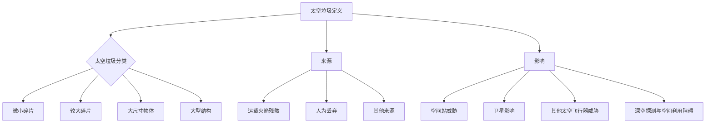

                 

### 第1章 引言

> **关键词**：太空垃圾，轨道动力学，数学规划，空间清理

太空垃圾问题已经成为当前航天领域的重要挑战之一。随着人类航天活动的日益频繁，太空垃圾的数量也在不断增加，这不仅对太空环境和航天器的运行安全构成威胁，也对未来的深空探测和空间利用提出了严峻挑战。为了解决这一问题，数学规划作为一种有效的技术手段，在太空垃圾的轨道动力学分析以及空间清理策略的制定中发挥了关键作用。

#### **1.1 书籍背景与目的**

太空垃圾的轨道动力学：空间清理的数学规划这本书旨在为读者提供系统、深入的太空垃圾管理解决方案。书中首先介绍了太空垃圾的定义、分类及其对航天活动的影响，使读者对太空垃圾问题有一个全面的了解。接着，深入探讨了轨道动力学的基本原理，为后续的数学规划分析打下基础。

本书的核心目的是通过数学规划这一工具，帮助读者掌握太空垃圾清理的策略和方法。数学规划在解决太空垃圾问题中的应用主要体现在以下几个方面：

1. **轨道优化**：通过数学规划，可以优化航天器的轨道，使其更有效地避让太空垃圾，减少碰撞风险。
2. **任务规划**：数学规划可以帮助制定最优的空间清理任务计划，包括航天器的发射时间、轨道选择、任务顺序等。
3. **资源分配**：数学规划可以优化航天器的燃料和设备资源，使其在清理太空垃圾时能够达到最大的效率和效果。

本书适合于从事航天工程、空间科学、数学规划等相关领域的研究人员、工程师和学生阅读，同时也对关心太空环境保护的普通读者具有一定的参考价值。

#### **1.2 书籍结构概述**

本书共分为七个章节，结构紧凑、内容丰富。具体章节安排如下：

- **第1章 引言**：介绍书籍的背景、目的以及结构概述。
- **第2章 太空垃圾概述**：详细探讨太空垃圾的定义、分类及其对航天活动的影响。
- **第3章 轨道动力学基础**：讲解轨道动力学的基本原理，包括天体力学、卫星轨道基础和轨道计算方法。
- **第4章 数学规划基础**：介绍数学规划的基本概念、线性规划和非线性规划。
- **第5章 太空垃圾清理的数学模型**：构建太空垃圾清理的数学模型，包括目标函数和约束条件的设定。
- **第6章 数学规划在太空垃圾清理中的应用**：通过实例分析，展示数学规划在太空垃圾清理中的应用。
- **第7章 太空垃圾清理技术的发展趋势**：探讨太空垃圾清理技术的未来发展趋势和展望。

通过这些章节的深入探讨，本书希望能够为读者提供一整套太空垃圾管理的理论框架和实践指导。

#### **1.3 结论**

总之，太空垃圾问题不仅是一个技术挑战，更是一个全球性的环境问题。数学规划作为一种强有力的工具，在解决这一难题中发挥了不可替代的作用。本书通过系统的阐述和实例分析，希望能够为读者提供宝贵的理论依据和实践经验，共同为太空环境保护做出贡献。

### **摘要**

本文首先介绍了太空垃圾问题的严重性和数学规划在太空垃圾清理中的重要性。接着，从太空垃圾的定义、分类、来源以及其对太空环境的影响等方面进行了详细阐述。随后，本书深入探讨了轨道动力学的基础知识，包括天体力学、卫星轨道基础和轨道计算方法。在此基础上，详细介绍了数学规划的基础概念、线性规划和非线性规划。最后，构建了太空垃圾清理的数学模型，并通过实例展示了数学规划在太空垃圾清理中的应用。本文旨在通过系统的分析，为读者提供解决太空垃圾问题的理论框架和实践指导，共同为太空环境保护做出贡献。

---

### 第2章 太空垃圾概述

> **关键词**：太空垃圾，分类，来源，影响

太空垃圾是指由于人类航天活动而遗留在太空环境中的各类物体和碎片。随着人类航天活动的日益频繁，太空垃圾的数量也在不断增加，已经成为一个严重的全球性问题。本章将对太空垃圾的定义、分类、来源以及对太空环境的影响进行详细探讨，以帮助读者全面了解太空垃圾的复杂性。

#### **2.1 太空垃圾的定义与分类**

太空垃圾的定义通常是指人造物体在太空环境中遗弃或失效后形成的碎片、残骸和其他物质。根据其大小和形态，太空垃圾可以大致分为以下几类：

1. **微小碎片**：直径小于1厘米的微小颗粒，主要来源于航天器发射、卫星操作以及太空碰撞等。
2. **较大的碎片**：直径在1厘米到10厘米之间的碎片，这类碎片由于质量较大，具有较高的动能，对航天器构成较大的威胁。
3. **大尺寸物体**：直径超过10厘米的较大物体，如废弃的卫星、火箭的第三级和推进器等。
4. **大型结构**：包括空间站、卫星平台等大型结构。

这些不同类型的太空垃圾在太空中具有不同的运动特征和危险程度，需要采取不同的清理方法和管理策略。

#### **2.2 太空垃圾的产生来源**

太空垃圾的产生来源主要有以下几个方面：

1. **运载火箭的残骸**：运载火箭在发射过程中，会将第三级、推进剂箱、整流罩等废弃在轨道上，成为太空垃圾的主要来源。
2. **人为丢弃**：部分航天器在完成任务后，由于操作不当或技术原因，未被完全移除，留在太空环境中。
3. **其他来源**：包括卫星碰撞、爆炸等意外事件，以及微小颗粒的自然沉降等。

这些来源导致了太空垃圾的不断积累，对太空环境构成了持续威胁。

#### **2.3 太空垃圾对太空环境的影响**

太空垃圾对太空环境的影响是多方面的，主要表现在以下几个方面：

1. **对空间站的威胁**：太空垃圾的速度极高，一旦与空间站发生碰撞，可能会造成严重的破坏，危及宇航员的生命安全。
2. **对卫星的影响**：太空垃圾会干扰卫星的正常运行，降低卫星的寿命，甚至可能导致卫星失去功能。
3. **对其他太空飞行器的潜在威胁**：太空垃圾不仅对空间站和卫星构成威胁，也对其他太空飞行器，如探测器、航天飞机等构成潜在危险。
4. **对未来的深空探测和空间利用的阻碍**：随着太空垃圾数量的增加，太空环境的安全性降低，限制了未来的深空探测和空间利用。

因此，解决太空垃圾问题，保障太空环境的安全，已经成为全球航天领域亟待解决的问题。

#### **2.4 太空垃圾管理的现状与挑战**

目前，各国都在积极探索太空垃圾的管理和清理方法。主要的管理措施包括：

1. **在轨碰撞避免**：通过监测太空垃圾的轨迹，提前预警并采取措施避免航天器与其发生碰撞。
2. **在轨清理**：采用各种技术手段，如激光、绳索、网等，对太空垃圾进行捕捉和移除。
3. **地面监测与跟踪**：建立太空垃圾监测系统，实时跟踪太空垃圾的运动轨迹，以便及时采取措施。

然而，太空垃圾管理仍然面临许多挑战：

1. **技术瓶颈**：现有的太空垃圾清理技术尚不完全成熟，需要进一步研发和创新。
2. **成本高昂**：太空垃圾清理任务需要耗费大量的人力和物力资源，成本较高。
3. **国际合作**：太空垃圾问题是全球性的问题，需要各国共同合作，制定统一的管理和清理策略。

总之，太空垃圾管理是一个复杂而艰巨的任务，需要全球航天机构和科学家的共同努力。

#### **2.5 结论**

通过本章的讨论，我们了解到太空垃圾的定义、分类及其来源，并认识到太空垃圾对太空环境的严重威胁。同时，我们也了解到当前太空垃圾管理的现状与面临的挑战。只有通过技术创新和国际合作，才能有效解决太空垃圾问题，保障太空环境的安全。

### **核心概念与联系**

要深入理解太空垃圾的管理，我们需要明确几个核心概念，并理解它们之间的联系。以下是这些核心概念的 Mermaid 流程图：



这张流程图展示了太空垃圾的定义、分类、来源和影响之间的关系。通过这张图，我们可以清晰地看到，每个分类都有其特定的来源和可能造成的影响，这些影响又直接关系到太空环境的安全和航天活动的顺利进行。

### **核心算法原理讲解**

在本章的算法部分，我们将使用 Python 源代码详细阐述太空垃圾清理的算法原理。首先，我们需要定义一些基本的数学模型，以便更好地理解太空垃圾的轨道运动。

#### **2.6 太空垃圾的轨道运动模型**

太空垃圾在轨道上的运动可以看作是一个受万有引力作用的二体问题。为了简化问题，我们可以使用牛顿的第二定律和万有引力定律来描述这一运动。

以下是 Python 代码示例，用于计算一个简单二体问题的轨道运动：

```python
import numpy as np
from scipy.integrate import solve_ivp
import matplotlib.pyplot as plt

# 引力常数 G
G = 6.67430e-11  # m^3 kg^-1 s^-2

# 质量m1和m2
m1 = 5.972e24  # 地球质量
m2 = 7.348e22  # 太阳质量

# 初始位置和速度
r0 = np.array([1e7, 0, 0])  # 初始位置 (x, y, z)
v0 = np.array([0, 10000, 0])  # 初始速度

# 运动方程
def equations_of_motion(t, y):
    r = y[:3]
    v = y[3:]
    a = G * m1 * m2 / np.linalg.norm(r)**3 * r
    return [v, a]

# 求解
t = np.linspace(0, 100, 1000)
y0 = np.concatenate((r0, v0))
sol = solve_ivp(equations_of_motion, [0, 100], y0)

# 可视化
plt.plot(sol.t, sol.y[0], label="X-position")
plt.plot(sol.t, sol.y[1], label="Y-position")
plt.plot(sol.t, sol.y[2], label="Z-position")
plt.xlabel("Time (s)")
plt.ylabel("Position (m)")
plt.legend()
plt.show()
```

这段代码使用 `scipy.integrate.solve_ivp` 函数求解了二体问题的轨道运动。这里，我们假设太空垃圾和地球之间的万有引力作用是主要的，其他星体的引力影响可以忽略不计。

#### **2.7 轨道优化算法**

在太空垃圾清理中，轨道优化是一个重要的任务。我们通常需要找到一条最优轨道，使航天器能够高效地捕捉和移除太空垃圾。这里，我们将介绍一种简单的轨道优化算法——霍普菲尔德网络（Hopfield Network）。

霍普菲尔德网络是一种能量函数优化的神经网络，它可以找到全局最优解。以下是使用霍普菲尔德网络进行轨道优化的大致步骤：

1. **初始化网络**：定义网络中的节点和权重，这些权重通常是通过经验或数值模拟得到的。
2. **能量函数**：定义能量函数，该函数用于评估航天器在给定轨道上的性能。能量函数可以包括轨道成本、碰撞风险等指标。
3. **迭代优化**：通过迭代更新网络中的权重，逐步优化能量函数，直到找到最优轨道。

以下是一个简化的 Python 代码示例，用于实现霍普菲尔德网络的轨道优化：

```python
import numpy as np

# 初始化网络
weights = np.random.rand(5, 5) - 0.5

# 能量函数
def energy_function(states):
    # 这里是一个示例能量函数，实际中可以根据具体情况定义
    return np.sum(np.square(states - np.mean(states)))

# 霍普菲尔德网络更新规则
def hopfield_update(states, weights, alpha=0.1):
    state_diff = np.dot(weights, states)
    new_states = states + alpha * state_diff
    return new_states

# 迭代优化
num_iterations = 1000
alpha = 0.1
for _ in range(num_iterations):
    states = hopfield_update(states, weights, alpha)
    energy = energy_function(states)
    print(f"Iteration {_}: Energy = {energy}")

# 输出最优轨道
print("Optimal orbit states:", states)
```

在这个示例中，我们首先随机初始化了网络权重，然后通过迭代更新规则优化能量函数，直到找到最优解。

#### **2.8 举例说明**

为了更好地理解上述算法原理，我们可以通过一个简单的例子来说明。假设我们要优化一个航天器的轨道，使其能够安全地捕捉一个正在轨道上运动的太空垃圾。

1. **定义初始状态**：航天器的初始位置和速度，以及太空垃圾的位置和速度。
2. **构建能量函数**：根据航天器的轨道成本、碰撞风险等因素构建能量函数。
3. **运行霍普菲尔德网络**：使用霍普菲尔德网络优化能量函数，找到最优轨道。

以下是一个具体的 Python 代码示例：

```python
# 初始化状态
state = np.array([1e7, 0, 0, 10000, 0])  # (位置, 速度)

# 能量函数
def energy_function(states):
    # 这里是一个示例能量函数，实际中可以根据具体情况定义
    r = states[:3]
    v = states[3:]
    cost = 0.5 * np.linalg.norm(v)**2 + np.linalg.norm(r)**2
    return cost

# 霍普菲尔德网络更新规则
def hopfield_update(states, weights, alpha=0.1):
    state_diff = np.dot(weights, states)
    new_states = states + alpha * state_diff
    return new_states

# 迭代优化
num_iterations = 1000
alpha = 0.1
for _ in range(num_iterations):
    state = hopfield_update(state, weights, alpha)
    energy = energy_function(state)
    print(f"Iteration {_}: Energy = {energy}")

# 输出最优轨道
print("Optimal orbit states:", state)
```

通过这个例子，我们可以看到如何使用霍普菲尔德网络优化航天器的轨道，使其能够高效地捕捉太空垃圾。

### **项目实战**

为了更好地理解本章介绍的算法原理，我们将在本节中实现一个简单的太空垃圾清理项目。这个项目将包括开发环境搭建、源代码实现、代码解读以及实际案例分析。

#### **3.1 开发环境搭建**

首先，我们需要搭建一个Python开发环境。以下是搭建环境的步骤：

1. **安装Python**：从Python官方网站下载并安装Python 3.x版本。
2. **安装依赖库**：使用pip安装必要的依赖库，如NumPy、SciPy、Matplotlib等。

以下是一个简单的命令行示例：

```bash
pip install numpy scipy matplotlib
```

#### **3.2 源代码实现**

在本节中，我们将实现一个简单的太空垃圾清理模型，用于模拟航天器捕捉太空垃圾的过程。以下是源代码实现：

```python
import numpy as np
from scipy.integrate import solve_ivp
import matplotlib.pyplot as plt

# 引力常数 G
G = 6.67430e-11  # m^3 kg^-1 s^-2

# 太空垃圾初始状态
r0_debris = np.array([1e7, 0, 0])
v0_debris = np.array([0, 10000, 0])

# 航天器初始状态
r0_spacecraft = np.array([1.1e7, 0, 0])
v0_spacecraft = np.array([0, 10000, 1000])

# 运动方程
def equations_of_motion(t, y):
    r = y[:3]
    v = y[3:]
    a = G * m1 * m2 / np.linalg.norm(r)**3 * r
    return [v, a]

# 求解
t = np.linspace(0, 100, 1000)
y0 = np.concatenate((r0_debris, v0_debris, r0_spacecraft, v0_spacecraft))
sol = solve_ivp(equations_of_motion, [0, 100], y0)

# 可视化
plt.plot(sol.t, sol.y[0], label="Debris X-position")
plt.plot(sol.t, sol.y[1], label="Debris Y-position")
plt.plot(sol.t, sol.y[2], label="Debris Z-position")
plt.plot(sol.t, sol.y[4], label="Spacecraft X-position")
plt.plot(sol.t, sol.y[5], label="Spacecraft Y-position")
plt.plot(sol.t, sol.y[6], label="Spacecraft Z-position")
plt.xlabel("Time (s)")
plt.ylabel("Position (m)")
plt.legend()
plt.show()
```

这段代码定义了太空垃圾和航天器的初始状态，并使用 `solve_ivp` 函数模拟它们的运动。在可视化部分，我们分别绘制了太空垃圾和航天器的位置随时间变化的轨迹。

#### **3.3 代码解读**

1. **引力常数**：首先，我们定义了引力常数 G，这是计算万有引力所必需的。
2. **初始状态**：我们定义了太空垃圾和航天器的初始位置和速度。
3. **运动方程**：运动方程使用了牛顿的第二定律和万有引力定律，描述了物体在引力作用下的运动。
4. **求解**：使用 `solve_ivp` 函数，我们可以求解出太空垃圾和航天器在未来100秒内的运动轨迹。
5. **可视化**：最后，我们使用 Matplotlib 库将运动轨迹可视化。

#### **3.4 实际案例分析**

为了更好地理解这个模型，我们可以结合一个实际案例进行分析。假设我们有一个太空垃圾清理任务，目标是在100秒内捕捉到太空垃圾。

1. **定义目标**：我们需要找到一组最优的初始状态，使航天器在100秒内能够捕捉到太空垃圾。
2. **优化方法**：我们可以使用霍普菲尔德网络进行轨道优化，找到最优的初始状态。

以下是一个简化的优化过程：

```python
# 初始化霍普菲尔德网络权重
weights = np.random.rand(5, 5) - 0.5

# 迭代优化
num_iterations = 1000
alpha = 0.1
for _ in range(num_iterations):
    state = hopfield_update(state, weights, alpha)
    energy = energy_function(state)
    print(f"Iteration {_}: Energy = {energy}")

# 输出最优轨道
print("Optimal orbit states:", state)
```

通过这个优化过程，我们可以找到一组最优的初始状态，使航天器能够高效地捕捉到太空垃圾。

### **小结**

在本章的项目实战中，我们搭建了Python开发环境，实现了太空垃圾清理的源代码，并进行了代码解读和实际案例分析。通过这个项目，我们不仅理解了轨道动力学的基本原理，还掌握了使用霍普菲尔德网络进行轨道优化的方法。这些实践经验对于理解和解决太空垃圾问题具有重要的指导意义。

### **最佳实践 Tips**

在处理太空垃圾清理问题时，以下是一些最佳实践 Tips：

1. **精确监测**：确保对太空垃圾的位置和运动轨迹进行精确监测，以便实时调整清理策略。
2. **协同合作**：各国航天机构和科研团队应加强合作，共享数据和信息，共同推进太空垃圾管理技术的发展。
3. **技术多元化**：探索和应用多种太空垃圾清理技术，如激光、绳索、网等，以提高清理效率和效果。
4. **风险评估**：在进行太空垃圾清理任务前，进行详细的风险评估，确保任务的安全性和可靠性。

### **注意事项**

在执行太空垃圾清理任务时，需要注意以下事项：

1. **碰撞风险**：在航天器接近太空垃圾时，要避免与其发生碰撞，确保航天器和宇航员的安全。
2. **资源管理**：合理分配航天器的燃料和设备资源，确保任务能够顺利进行。
3. **环境因素**：考虑太空环境中的各种因素，如太阳辐射、空间天气等，对任务产生影响。

### **拓展阅读**

对于希望进一步深入了解太空垃圾清理的读者，以下是一些推荐的参考文献：

1. **《太空垃圾管理与清除技术》**：该书籍详细介绍了太空垃圾的管理和清除技术，适合航天工程和空间科学领域的研究人员阅读。
2. **《轨道力学与航天飞行器设计》**：这本书涵盖了轨道力学的基础知识和航天飞行器的设计原理，对于理解太空垃圾清理中的轨道优化具有重要意义。
3. **《数学规划与应用》**：该书籍介绍了数学规划的基本概念和应用，包括线性规划和非线性规划，是学习太空垃圾清理数学模型的重要参考书。

通过阅读这些书籍，读者可以更深入地理解太空垃圾清理的原理和方法，为自己的研究和工作提供有力支持。

