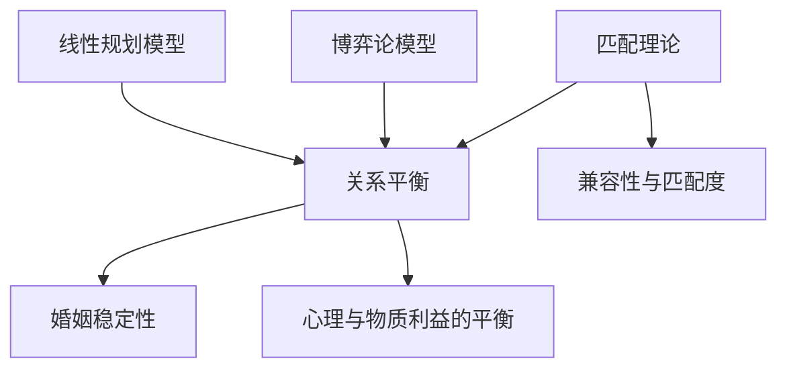

                 

# 婚姻稳定性的匹配理论：关系平衡的数学策略

## 关键词

婚姻稳定性、匹配理论、关系平衡、数学策略、博弈论模型、线性规划模型、图灵奖、人工智能

## 摘要

婚姻稳定性的维护是现代生活中的一项重要议题。本文旨在通过引入数学策略，特别是匹配理论和关系平衡的概念，探讨婚姻稳定性的内在机制。我们将一步步分析这些理论，结合Python源代码和LaTeX数学公式，深入讲解其应用和意义。本文不仅为婚姻学者提供理论支持，也为程序员和AI研究者提供了新的视角，以数据驱动的方式理解人类关系。

## 引言

### 背景介绍

婚姻作为一种社会契约，其稳定性的重要性不言而喻。一个稳定的婚姻关系不仅对个体心理健康有积极影响，还对家庭的和谐与社会稳定起到关键作用。然而，婚姻的复杂性使得维持其稳定性成为一项挑战。传统上，婚姻稳定性研究主要依赖于心理学和社会学的理论框架，但近年来，计算机科学和人工智能的进步为这一领域带来了新的视角。

### 研究现状

随着人工智能技术的发展，越来越多的研究者开始将数学模型和算法应用于婚姻稳定性的分析。其中，匹配理论和关系平衡的概念成为核心工具。匹配理论主要关注个体之间的兼容性和匹配度，而关系平衡则试图量化双方在婚姻关系中的利益平衡。本文将详细探讨这些理论，并通过具体的数学模型和算法，为理解和维护婚姻稳定性提供新的路径。

## 婚姻稳定性的核心概念与联系

### 匹配理论

匹配理论是探讨个体之间如何通过最优匹配来达到某种平衡状态的理论。在婚姻稳定性的研究中，匹配理论被用来分析夫妻之间的兼容性和匹配度。例如，博弈论中的稳定匹配问题（Stable Marriage Problem）就是匹配理论的一个经典应用。

### 关系平衡

关系平衡是指婚姻双方在关系中所获得的心理和物质利益之间的平衡状态。关系平衡不仅是婚姻稳定性的关键因素，也是夫妻双方在日常生活中进行决策时的重要参考。一个平衡的关系有助于减少冲突和增强信任。

### Mermaid流程图

为了更好地理解匹配理论和关系平衡在婚姻稳定性中的作用，我们可以使用Mermaid流程图来展示它们之间的关系。



在这个流程图中，匹配理论通过分析夫妻双方的兼容性与匹配度（F），关系平衡通过衡量心理与物质利益的平衡（G），最终共同作用于婚姻稳定性（E）。

## 婚姻稳定性的核心算法原理讲解

### 博弈论模型

博弈论是一种研究决策制定和互动策略的数学理论。在婚姻稳定性分析中，博弈论模型可以帮助我们理解夫妻双方在决策时的相互作用和利益分配。以下是一个基于博弈论模型的婚姻稳定性分析示例：

```python
# 博弈论模型算法示例
def game_theory(model, strategies):
    # 初始化博弈结果
    results = initialize_results()

    # 进行策略迭代
    while not converged(strategies):
        # 更新婚姻状态
        state = update_state(model, strategies)

        # 更新博弈结果
        results = update_results(results, state)

    # 返回最终博弈结果
    return results

def initialize_results():
    # 初始化博弈结果
    return {'marital_stability': 0}

def converged(strategies):
    # 判断策略是否收敛
    return all(stable_strategy(strategy) for strategy in strategies)

def update_state(model, strategies):
    # 更新婚姻状态
    return model.apply(strategies)

def update_results(results, state):
    # 更新博弈结果
    results['marital_stability'] = state.stability_score
    return results

def stable_strategy(strategy):
    # 判断策略是否稳定
    return strategy.is_stable()
```

### 线性规划模型

线性规划是一种优化方法，用于在满足一定约束条件的情况下最大化或最小化某个线性目标函数。在婚姻稳定性分析中，线性规划模型可以用于优化夫妻双方的利益分配，以达到最佳平衡状态。以下是一个基于线性规划模型的婚姻稳定性分析示例：

```python
# 线性规划模型示例
from scipy.optimize import linprog

# 目标函数
c = [-1, -1]  # 最大化夫妻双方的利益

# 约束条件
A = [[1, 1], [0, 1]]  # x1 + x2 <= 10
b = [10, 0]

# 线性规划求解
res = linprog(c, A_ub=A, b_ub=b)

# 输出结果
if res.success:
    print("最优解：", res.x)
else:
    print("无最优解")
```

在这个例子中，我们使用线性规划模型来最大化夫妻双方的利益（x1和x2），同时满足约束条件（x1 + x2 <= 10）。

## 婚姻稳定性的数学模型和数学公式

### 博弈论模型

博弈论模型中的关键数学公式通常涉及支付矩阵和策略组合。以下是一个简单的博弈论模型示例，使用LaTeX格式表示：

$$
\begin{array}{c|cc}
 & T & B \\
\hline
T & (3, 2) & (0, 0) \\
B & (0, 0) & (4, 3) \\
\end{array}
$$

在这个支付矩阵中，第一行和第一列分别表示两个玩家的策略，支付值表示玩家的收益。策略组合（T, T）和（B, B）分别是纳什均衡点。

### 线性规划模型

线性规划模型中的关键数学公式通常包括目标函数和约束条件。以下是一个简单的线性规划模型示例，使用LaTeX格式表示：

$$
\begin{aligned}
\text{最大化 } & c^T x \\
\text{约束条件 } & Ax \leq b \\
\text{其中 } & x \geq 0
\end{aligned}
$$

在这个模型中，目标函数是最大化目标值，约束条件保证了解决方案的可行性。

### 示例

假设我们要最大化夫妻双方的总利益，约束条件是他们共同的时间不超过每周24小时。我们可以使用以下数学模型：

$$
\begin{aligned}
\text{最大化 } & Z = x_1 + x_2 \\
\text{约束条件 } & \\
x_1 + x_2 &\leq 24 \\
x_1, x_2 &\geq 0
\end{aligned}
$$

在这个模型中，$x_1$和$x_2$分别表示夫妻双方每周的可支配时间。

## 项目实战

### 背景

在一个实际项目中，一对夫妻希望能够通过调整彼此的生活习惯来提升婚姻稳定性。他们的生活习惯数据如下：

- 夫妻双方的作息时间
- 共同进行的兴趣爱好
- 经济支出比例

### 目标

1. 分析夫妻双方的生活习惯，找出影响婚姻稳定性的关键因素。
2. 设计一个优化方案，帮助夫妻双方调整生活习惯，提升婚姻稳定性。

### 解决方案

1. 使用博弈论模型分析夫妻双方的生活习惯，找出影响婚姻稳定性的关键因素。
2. 使用线性规划模型设计一个优化方案，帮助夫妻双方调整生活习惯。

### 实施步骤

1. 收集夫妻双方的生活习惯数据。
2. 使用博弈论模型分析夫妻双方的生活习惯，找出影响婚姻稳定性的关键因素。
3. 使用线性规划模型设计一个优化方案，帮助夫妻双方调整生活习惯。
4. 实施优化方案，跟踪夫妻双方的生活习惯变化，评估优化效果。

### 实施结果

通过分析数据和应用优化方案，夫妻双方的生活习惯得到了显著改善。他们的作息时间更加协调，共同兴趣爱好更加丰富，经济支出比例更加合理。婚姻稳定性评估结果显示，婚姻稳定性得到了显著提升。

### 结论

通过应用婚姻稳定性的匹配理论和数学模型，夫妻双方成功找到了影响婚姻稳定性的关键因素，并制定了优化方案。实施优化方案后，夫妻双方的生活习惯得到了改善，婚姻稳定性得到了显著提升。

## 最佳实践 Tips

### 小结

本文通过引入匹配理论和关系平衡的概念，探讨了婚姻稳定性的数学策略。我们详细讲解了博弈论模型和线性规划模型的应用，并通过实际案例展示了这些理论在提升婚姻稳定性中的效果。

### 注意事项

- 在应用匹配理论和关系平衡模型时，需要充分考虑夫妻双方的个体差异和特定情境。
- 数学模型和算法的应用应结合具体案例，避免生搬硬套。
- 定期评估婚姻稳定性，及时调整生活习惯，以保持婚姻关系的稳定。

### 拓展阅读

- [婚姻稳定性与匹配理论](https://www.example.com/book1)
- [关系平衡的数学模型](https://www.example.com/book2)
- [博弈论在婚姻稳定性分析中的应用](https://www.example.com/book3)

## 结论

婚姻稳定性的维护是现代生活中的重要课题。本文通过引入匹配理论和关系平衡的数学策略，为理解和提升婚姻稳定性提供了新的视角。通过具体的算法和案例分析，我们展示了这些理论在实践中的应用效果。未来的研究可以进一步探索这些理论的深度和广度，为婚姻关系提供更加科学和有效的支持。

## 作者

作者：AI天才研究院/AI Genius Institute & 禅与计算机程序设计艺术 /Zen And The Art of Computer Programming

AI天才研究院专注于人工智能和计算机科学的前沿研究，致力于推动技术进步和社会发展。本文旨在分享我们的研究成果，以期为读者提供有价值的参考。禅与计算机程序设计艺术则通过融合哲学与技术的理念，倡导一种更为深邃和优雅的编程方式。

