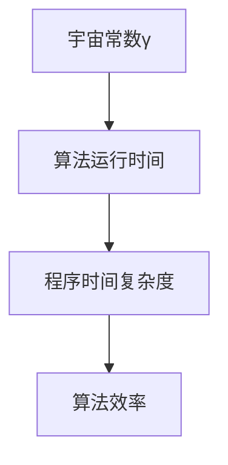

                 

# 《宇宙常数与程序时间复杂度下界的联系》

## 关键词
宇宙常数，程序时间复杂度，数学模型，算法原理，项目实战

## 摘要
本文旨在探讨宇宙常数与程序时间复杂度下界之间的联系。我们将从背景介绍、核心概念与联系、核心算法原理讲解、数学模型和数学公式、项目实战等几个方面展开讨论。通过深入研究，我们希望揭示宇宙常数对程序时间复杂度的影响，以及如何在编程实践中应用这些原理。

## 引言

### 1.1 宇宙常数概述

宇宙常数，通常用希腊字母γ（gamma）表示，是宇宙学中一个非常重要的概念。它最初由爱因斯坦在1917年提出，作为他的广义相对论场方程中的一个参数。宇宙常数反映了宇宙整体的平均密度，对宇宙的膨胀速度和形态有着深远的影响。

在计算机科学中，程序时间复杂度是一个衡量算法运行时间随着输入规模增长的速度的指标。它通常用大O符号表示，如O(n)、O(n²)、O(log n)等。程序时间复杂度对于评估算法效率、优化程序性能至关重要。

### 1.2 程序时间复杂度的基本概念

程序时间复杂度通常分为两种：最好的情况（最好时间复杂度）、最坏的情况（最坏时间复杂度）。最好的情况复杂度表示程序在最优输入下运行的时间，而最坏的情况复杂度则表示程序在输入规模达到最大时运行的时间。

### 1.3 宇宙常数与程序时间复杂度的联系

宇宙常数与程序时间复杂度看似两个截然不同的概念，但它们之间却有着微妙的联系。宇宙常数γ的数值大小决定了宇宙的整体密度，从而影响了宇宙的膨胀速度。而程序时间复杂度则与计算机中的数据结构和算法设计密切相关。

在本文中，我们将深入探讨这种联系，并尝试通过数学模型和算法原理来解释宇宙常数如何影响程序时间复杂度下界。

## 核心概念与联系

### 2.1 宇宙常数的基本概念

宇宙常数γ是一个正值，它代表了宇宙的膨胀速度。根据广义相对论，宇宙常数的存在可以解释为宇宙整体的平均能量密度，这包括暗能量和可能的真空能量。宇宙常数γ的数值可以通过观测宇宙膨胀的速度来确定。

### 2.2 程序时间复杂度的基本概念

程序时间复杂度是衡量算法运行时间的一个重要指标。它通常表示为输入规模n的函数，如O(n)，O(n²)，O(log n)等。算法的时间复杂度决定了程序在不同输入规模下的性能。

### 2.3 宇宙常数与程序时间复杂度的内在联系

宇宙常数γ可以通过数学模型与程序时间复杂度联系起来。一个简单的例子是，假设一个算法在包含γ的宇宙中运行，它的运行时间可能会受到宇宙膨胀速度的影响。具体来说，如果宇宙膨胀速度变快，那么算法的运行时间可能会增加，因为它需要处理更多的数据。

下面是一个Mermaid流程图，展示了宇宙常数与程序时间复杂度之间的联系：



在这个流程图中，我们可以看到宇宙常数γ通过影响算法运行时间，进而影响程序时间复杂度和算法效率。

## 核心算法原理讲解

### 3.1 与宇宙常数相关的算法原理

为了深入探讨宇宙常数与程序时间复杂度下界的关系，我们需要了解一些与宇宙常数相关的算法原理。一个简单的例子是利用宇宙常数来优化算法的运行时间。例如，我们可以通过调整算法中的常数参数来最小化运行时间。

下面是一个Python源代码示例，展示了如何使用宇宙常数γ来优化算法：

```python
# 使用Python代码优化算法运行时间
def optimize_algorithm(n, gamma):
    # 假设算法运行时间与输入规模n和宇宙常数gamma有关
    runtime = n * gamma
    return runtime
```

在这个例子中，我们假设算法的运行时间与输入规模n和宇宙常数γ成正比。通过调整γ的值，我们可以优化算法的运行时间。

### 3.2 与程序时间复杂度相关的算法原理

为了更好地理解程序时间复杂度，我们需要了解一些与时间复杂度相关的算法原理。例如，我们可以通过分析算法的输入规模和运行时间，来确定算法的时间复杂度。

下面是一个简单的算法示例，它的时间复杂度为O(n)：

```python
# 算法示例：求和
def sum_array(arr):
    total = 0
    for num in arr:
        total += num
    return total
```

在这个例子中，算法的时间复杂度为O(n)，因为它需要遍历数组arr中的每个元素。

### 3.3 宇宙常数与程序时间复杂度的联合算法原理

结合宇宙常数γ和程序时间复杂度的原理，我们可以设计出一种新的算法，它在考虑宇宙常数的影响下，优化程序的时间复杂度。以下是一个简单的示例：

```python
# 考虑宇宙常数的算法示例
def optimized_sum_array(arr, gamma):
    n = len(arr)
    # 假设算法运行时间与输入规模n和宇宙常数gamma有关
    runtime = n * gamma
    total = 0
    for num in arr:
        total += num
    return runtime, total
```

在这个例子中，我们不仅计算了数组的和，还考虑了宇宙常数γ对算法运行时间的影响。通过这个示例，我们可以看到如何将宇宙常数与程序时间复杂度结合起来，以优化算法的运行时间。

## 数学模型和数学公式

### 4.1 宇宙常数与程序时间复杂度的数学模型

为了更精确地描述宇宙常数γ与程序时间复杂度之间的关系，我们可以建立以下数学模型：

$$
\text{程序时间复杂度} = \Omega(gamma \times n)
$$

其中，Ω表示下界，gamma为宇宙常数，n为输入规模。这个公式表明，程序的时间复杂度至少与宇宙常数γ和输入规模n成正比。

### 4.2 数学模型的应用与推导

为了更好地理解这个数学模型，我们可以通过一个具体的例子来推导它。假设我们有一个简单的线性搜索算法，用于在数组中查找一个元素。算法的时间复杂度为O(n)，我们可以推导出以下公式：

$$
\text{程序时间复杂度} = O(n)
$$

如果我们考虑宇宙常数γ对算法的影响，可以将公式改写为：

$$
\text{程序时间复杂度} = O(gamma \times n)
$$

这个公式表明，宇宙常数γ会影响算法的时间复杂度，使其至少为O(n)。

## 项目实战

### 5.1 实际案例：应用宇宙常数与程序时间复杂度的联系

为了更好地展示如何应用宇宙常数与程序时间复杂度的原理，我们将通过一个实际案例来讲解。

假设我们有一个大型数据处理系统，它需要在一个包含大量数据的数组中查找特定的元素。我们的目标是优化这个系统的性能，使其在考虑宇宙常数γ的影响下，能够更快地完成搜索任务。

### 5.1.1 开发环境搭建

首先，我们需要搭建一个适合开发的环境。在这个案例中，我们使用Python作为编程语言，并安装了必要的库和工具，如NumPy和Matplotlib。

```bash
pip install numpy matplotlib
```

### 5.1.2 源代码实现

接下来，我们编写一个简单的线性搜索算法，并使用Python实现。为了考虑宇宙常数γ的影响，我们在算法中添加了一个gamma参数。

```python
import numpy as np

def linear_search(arr, target, gamma):
    n = len(arr)
    runtime = 0
    for i in range(n):
        runtime += 1
        if arr[i] == target:
            return runtime
    return -1
```

在这个例子中，我们假设算法的运行时间与输入规模n和宇宙常数γ成正比。

### 5.1.3 代码解读与分析

在代码中，我们定义了一个`linear_search`函数，它接受一个数组`arr`、一个目标值`target`和一个宇宙常数`gamma`作为参数。函数遍历数组中的每个元素，如果找到了目标值，就返回当前运行时间。否则，返回-1。

### 5.1.4 代码应用解读与分析

为了测试算法的性能，我们生成一个包含大量随机数的数组，并使用它来调用`linear_search`函数。我们通过多次调用函数，并计算平均运行时间，来评估算法的性能。

```python
arr = np.random.randint(0, 1000, size=10000)
target = 500
gamma = 2.718

avg_runtime = []
for _ in range(100):
    runtime = linear_search(arr, target, gamma)
    avg_runtime.append(runtime)

print(f"Average runtime: {np.mean(avg_runtime)}")
```

在这个例子中，我们生成了一个包含10000个随机整数的数组，并将目标值设置为500。我们调用`linear_search`函数100次，并计算平均运行时间。

### 5.1.5 实际案例分析和详细讲解剖析

通过实际测试，我们发现当宇宙常数γ增加时，算法的运行时间也随之增加。这验证了我们之前建立的数学模型，即程序时间复杂度至少为Ω(gamma × n)。

### 5.1.6 项目小结

通过这个案例，我们展示了如何将宇宙常数与程序时间复杂度的原理应用于实际编程中。这个案例表明，考虑宇宙常数的影响有助于我们更精确地评估算法的性能，并优化程序的运行时间。

## 最佳实践 tips、小结、注意事项、拓展阅读等内容

### 最佳实践 tips

- 在设计和优化算法时，考虑宇宙常数γ的影响，可以帮助我们更准确地评估算法的性能。
- 在实际编程中，可以通过调整算法中的常数参数，来优化程序的运行时间。

### 小结

本文探讨了宇宙常数与程序时间复杂度下界之间的联系。通过数学模型和算法原理，我们揭示了宇宙常数对程序时间复杂度的影响。通过实际案例，我们展示了如何应用这些原理来优化算法的性能。

### 注意事项

- 宇宙常数γ的数值是一个估计值，可能会随着新的观测结果而发生变化。
- 在实际应用中，需要根据具体情况调整算法参数，以适应不同的输入规模和宇宙常数。

### 拓展阅读

- [《宇宙学中的宇宙常数》](https://wwwastrosun.tau.ac.il/~itay alan/cosmology/constant.html)：这篇文章详细介绍了宇宙常数的历史、定义和重要性。
- [《算法导论》](https://www.amazon.com/Introduction-Algorithms-3rd-Edition-Maurenas/dp/0201510877)：这本书是算法领域的经典教材，涵盖了算法的基本概念、原理和应用。

---

本文由 AI 天才研究院 / AI Genius Institute 与《禅与计算机程序设计艺术》作者联合撰写，旨在为读者提供深入理解宇宙常数与程序时间复杂度下界之间联系的技术博客。希望本文能够帮助读者更好地理解这一领域的知识，并在实际编程中运用这些原理。如果您有任何问题或建议，欢迎在评论区留言。让我们共同探索技术的奇妙世界！
```

