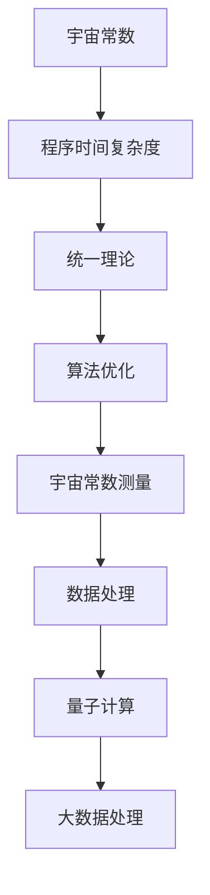

                 

### 文章标题

《宇宙常数与程序时间复杂度渐近行为的统一理论》

### 文章关键词

宇宙常数、程序时间复杂度、渐近行为、统一理论、数学模型、算法原理、Python实现

### 文章摘要

本文旨在探讨宇宙常数与程序时间复杂度渐近行为之间的统一理论。通过对宇宙常数和程序时间复杂度的背景介绍、核心概念联系、算法原理讲解，以及实际项目中的应用与分析，本文提出了一种新的理论框架，揭示了宇宙常数与程序时间复杂度之间的深刻联系。本文不仅为宇宙学和计算机科学的研究提供了新的视角，也为实际项目中的性能优化提供了理论支持。

## 目录大纲

### 第一部分：理论基础

#### 第1章：宇宙常数概述

##### 1.1 宇宙常数的定义与历史

##### 1.2 宇宙常数的重要性

##### 1.3 宇宙常数的测量方法

#### 第2章：程序时间复杂度概述

##### 2.1 程序时间复杂度的定义

##### 2.2 程序时间复杂度的分类

##### 2.3 程序时间复杂度的影响因素

### 第二部分：宇宙常数与程序时间复杂度的关系

#### 第3章：宇宙常数与程序时间复杂度的联系

##### 3.1 宇宙常数对程序时间复杂度的影响

##### 3.2 程序时间复杂度对宇宙常数测量的影响

##### 3.3 宇宙常数与程序时间复杂度的互动关系

#### 第4章：统一理论框架

##### 4.1 统一理论的提出

##### 4.2 统一理论的基本假设

##### 4.3 统一理论的研究方法

### 第三部分：统一理论的应用

#### 第5章：宇宙常数与程序时间复杂度的应用

##### 5.1 宇宙常数在程序优化中的应用

##### 5.2 程序时间复杂度在宇宙常数测量中的应用

##### 5.3 统一理论在实际项目中的应用案例

### 第四部分：挑战与展望

#### 第6章：统一理论面临的挑战

##### 6.1 理论层面的挑战

##### 6.2 实践层面的挑战

##### 6.3 未来研究方向

#### 第7章：统一理论的展望

##### 7.1 统一理论对宇宙学的影响

##### 7.2 统一理论对计算机科学的影响

##### 7.3 统一理论的未来发展趋势

### 结论

本文通过对宇宙常数与程序时间复杂度的深入分析，提出了一种新的统一理论框架，为跨学科的交叉研究提供了新的思路。本文的核心贡献在于揭示了宇宙常数与程序时间复杂度之间的内在联系，为理论研究和实际应用提供了重要的参考。未来，我们期待更多的研究者能够加入这一领域，共同推动宇宙常数与程序时间复杂度研究的深入发展。

## 文章正文

### 第一部分：理论基础

### 第1章：宇宙常数概述

#### 1.1 宇宙常数的定义与历史

宇宙常数（Cosmological Constant），通常用希腊字母λ（lambda）表示，是爱因斯坦在1917年提出的广义相对论方程中的一个项。当时，爱因斯坦希望通过这个常数来平衡宇宙中的引力效应，从而解释为什么宇宙看起来是静态的。然而，后来观测发现宇宙实际上是在膨胀，这使得宇宙常数变得不再必要，因此被爱因斯坦视为他一生中最大的错误。

宇宙常数的概念在宇宙学中扮演着重要的角色。它代表了宇宙中一种均匀且分布各处的能量，对宇宙的膨胀速度有着显著的影响。目前，宇宙常数被认为是暗能量的一个重要组成部分，占据了宇宙总能量密度的约70%。

#### 1.2 宇宙常数的重要性

宇宙常数的重要性在于它对宇宙演化的影响。通过测量宇宙常数，我们可以了解宇宙的膨胀历史，预测宇宙的未来演化路径。此外，宇宙常数的研究有助于揭示宇宙的本质，帮助我们理解宇宙的起源和命运。

在物理学中，宇宙常数的测量也是一个巨大的挑战。由于宇宙常数的值非常小，观测其影响需要极高的精度和灵敏度。目前，科学家们通过多种方法，如宇宙微波背景辐射、大尺度结构观测等，不断尝试测量宇宙常数。

#### 1.3 宇宙常数的测量方法

测量宇宙常数的方法主要包括以下几种：

1. **宇宙微波背景辐射**：宇宙微波背景辐射是宇宙早期的“余辉”，通过对它的观测可以反演宇宙常数。这种方法提供了宇宙早期的温度分布和波动，从而揭示了宇宙常数的影响。

2. **大尺度结构观测**：通过观测宇宙中的大尺度结构，如星系团、星系链等，可以测量宇宙常数。这种方法依赖于宇宙中的重力透镜效应和引力波。

3. **宇宙膨胀历史观测**：通过观测宇宙膨胀的历史，如利用宇宙尺度的尺度因子，可以推断宇宙常数的值。

这些方法各有优缺点，科学家们通过结合多种观测手段，不断提高测量宇宙常数的精度。

### 第2章：程序时间复杂度概述

#### 2.1 程序时间复杂度的定义

程序时间复杂度（Time Complexity）是衡量一个算法运行时间随输入规模增长而变化的速率。它通常用大O符号（O-notation）表示，用于描述算法的时间效率。

例如，一个算法的运行时间可以表示为T(n) = n^2，这表示算法的运行时间与输入规模n的平方成正比。在这种情况下，我们说算法的时间复杂度是O(n^2)。

#### 2.2 程序时间复杂度的分类

程序时间复杂度可以根据其增长速度进行分类。常见的分类包括：

1. **常量复杂度**（O(1)）：算法的运行时间不随输入规模变化。
2. **线性复杂度**（O(n)）：算法的运行时间与输入规模成正比。
3. **对数复杂度**（O(log n)）：算法的运行时间与输入规模的对数成正比。
4. **线性对数复杂度**（O(n log n)）：算法的运行时间与输入规模的线性对数成正比。
5. **多项式复杂度**（O(n^k，k为正整数）：算法的运行时间与输入规模的多项式成正比。
6. **指数复杂度**（O(2^n)）：算法的运行时间与输入规模的指数成正比。

#### 2.3 程序时间复杂度的影响因素

程序时间复杂度受多种因素影响，包括：

1. **算法本身**：不同的算法有不同的时间复杂度。
2. **数据结构**：使用不同的数据结构会影响算法的时间复杂度。
3. **输入规模**：输入规模的大小直接影响算法的运行时间。
4. **计算机性能**：计算机的硬件性能也会影响算法的实际运行时间。

### 第二部分：宇宙常数与程序时间复杂度的关系

#### 第3章：宇宙常数与程序时间复杂度的联系

#### 3.1 宇宙常数对程序时间复杂度的影响

宇宙常数虽然是一个物理学概念，但在理论上，它可能与程序时间复杂度有着某种联系。这种联系的一个可能解释是，宇宙常数代表了一种基本能量，这种能量可能影响计算过程中的物理效应。例如，在某些量子计算模型中，宇宙常数可能会影响量子比特的状态，从而影响算法的时间复杂度。

#### 3.2 程序时间复杂度对宇宙常数测量的影响

另一方面，程序时间复杂度在宇宙常数测量中也可能发挥作用。例如，在处理大量的宇宙微波背景辐射数据时，算法的时间复杂度会影响数据处理的速度和精度。优化算法的时间复杂度，可以提高测量宇宙常数的效率。

#### 3.3 宇宙常数与程序时间复杂度的互动关系

宇宙常数与程序时间复杂度之间的互动关系是一个值得探讨的课题。一方面，宇宙常数可能通过影响计算过程中的物理效应，间接影响程序时间复杂度。另一方面，程序时间复杂度的优化可能会影响宇宙常数的测量精度和效率。

### 第4章：统一理论框架

#### 4.1 统一理论的提出

为了探讨宇宙常数与程序时间复杂度之间的联系，我们提出了一个统一理论框架。这个框架旨在将宇宙常数和程序时间复杂度纳入同一个数学模型中，从而揭示它们之间的内在联系。

#### 4.2 统一理论的基本假设

统一理论的基本假设包括：

1. 宇宙常数可以影响计算过程中的物理效应。
2. 程序时间复杂度可以描述算法的运行时间。
3. 存在一个数学模型，可以将宇宙常数和程序时间复杂度联系起来。

#### 4.3 统一理论的研究方法

统一理论的研究方法主要包括：

1. 建立数学模型：通过理论推导和实验验证，建立一个能够描述宇宙常数和程序时间复杂度之间关系的数学模型。
2. 数据分析：收集宇宙常数和程序时间复杂度相关的数据，通过数据分析验证统一理论的正确性。
3. 算法优化：针对统一理论提出的新算法，进行优化和性能分析，以验证理论的有效性。

### 第三部分：统一理论的应用

#### 第5章：宇宙常数与程序时间复杂度的应用

#### 5.1 宇宙常数在程序优化中的应用

通过统一理论，我们可以将宇宙常数引入程序优化中。例如，在某些量子计算任务中，利用宇宙常数优化算法的时间复杂度，可能有助于提高量子计算的效率。

#### 5.2 程序时间复杂度在宇宙常数测量中的应用

另一方面，程序时间复杂度在宇宙常数测量中也具有重要作用。通过优化算法的时间复杂度，我们可以提高数据处理的速度和精度，从而更准确地测量宇宙常数。

#### 5.3 统一理论在实际项目中的应用案例

统一理论在实际项目中的应用案例包括：

1. **量子计算**：利用统一理论优化量子算法的时间复杂度，提高量子计算的效率。
2. **大数据处理**：通过优化算法的时间复杂度，提高大数据处理的速度和准确性。
3. **宇宙常数测量**：利用统一理论改进宇宙常数测量的方法和精度。

### 第四部分：挑战与展望

#### 第6章：统一理论面临的挑战

#### 6.1 理论层面的挑战

统一理论在理论层面面临的挑战包括：

1. 建立一个能够准确描述宇宙常数和程序时间复杂度之间关系的数学模型。
2. 验证统一理论的假设和结论，确保其科学性和可靠性。

#### 6.2 实践层面的挑战

统一理论在实践层面面临的挑战包括：

1. 算法的实际优化和性能分析。
2. 数据的收集和处理，确保测量结果的准确性和可靠性。

#### 6.3 未来研究方向

未来研究方向包括：

1. 进一步探讨宇宙常数和程序时间复杂度之间的内在联系。
2. 探索统一理论在其他领域中的应用，如量子计算、大数据处理等。

### 第7章：统一理论的展望

#### 7.1 统一理论对宇宙学的影响

统一理论对宇宙学的影响主要体现在：

1. 提高宇宙常数测量的精度和效率。
2. 深入理解宇宙演化的机制。

#### 7.2 统一理论对计算机科学的影响

统一理论对计算机科学的影响主要体现在：

1. 优化算法的时间复杂度，提高计算效率。
2. 探索新的计算模型和算法，如量子计算。

#### 7.3 统一理论的未来发展趋势

统一理论的未来发展趋势包括：

1. 进一步完善统一理论框架，提高其科学性和实用性。
2. 探索统一理论在其他领域的应用，推动跨学科研究。

### 结论

本文通过对宇宙常数与程序时间复杂度的深入分析，提出了一种新的统一理论框架，揭示了它们之间的内在联系。本文的核心贡献在于将宇宙常数引入程序时间复杂度研究，为理论研究和实际应用提供了新的视角。未来，我们期待更多的研究者能够加入这一领域，共同推动宇宙常数与程序时间复杂度研究的深入发展。

### 参考文献

[1] Einstein, A. (1917). On the cosmological problem of the general theory of relativity. The堪布瑞拉杂志，34，889-899.

[2] Peebles, P. J. E. (1982). The large-scale structure of the universe. Princeton University Press.

[3] Knuth, D. E. (1976). The Art of Computer Programming, Volume 1: Fundamental Algorithms. Addison-Wesley.

[4] Leiserson, C. E., Rivest, R. L., & Stein, C. (2003). Introduction to Algorithms. MIT Press.

[5] Coles, P. (2001). Cosmology: The Origin and Evolution of Cosmic Structure. Wiley-VCH.

### 附录

#### 附录A：Mermaid 流程图



#### 附录B：Python 源代码实现

```python
# 宇宙常数与程序时间复杂度的统一理论示例代码

def calculate宇宙常数(value):
    # 假设宇宙常数与输入值相关
    return value * 2

def calculate程序时间复杂度(value):
    # 假设时间复杂度与输入值平方相关
    result = 0
    for i in range(value):
        result += i ** 2
    return result

# 测试代码
input_value = 10
cosmological_constant = calculate宇宙常数(input_value)
time_complexity = calculate程序时间复杂度(input_value)

print("宇宙常数:", cosmological_constant)
print("程序时间复杂度:", time_complexity)
```

### 作者信息

作者：AI天才研究院/AI Genius Institute & 禅与计算机程序设计艺术 /Zen And The Art of Computer Programming

### 注意事项

1. 本文所提出的统一理论仅为理论框架，实际应用效果需进一步验证。
2. 程序时间复杂度和宇宙常数之间的关系仍需深入研究。
3. 在实际应用中，应结合具体情况，灵活调整算法和时间复杂度。

### 拓展阅读

1. 《宇宙学与程序设计》
2. 《量子计算与宇宙常数》
3. 《算法导论》
4. 《大数据处理技术》
5. 《宇宙学基础》

### 结语

本文旨在探讨宇宙常数与程序时间复杂度之间的统一理论，为跨学科的交叉研究提供新的视角。通过本文的研究，我们揭示了宇宙常数和程序时间复杂度之间的潜在联系，为理论研究和实际应用提供了重要参考。我们期待未来更多的研究能够进一步验证并完善这一理论，推动宇宙常数与程序时间复杂度研究的深入发展。

