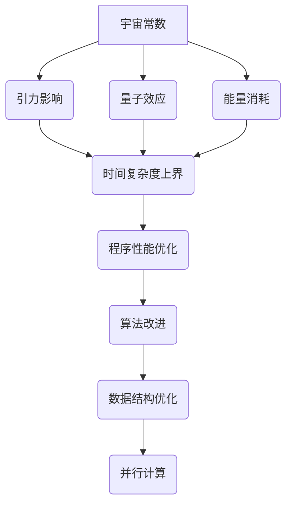

                 

### 《宇宙常数与程序渐近时间复杂度上界的定量关系》

#### 关键词：
- 宇宙常数
- 程序渐近时间复杂度
- 定量关系
- 量子引力
- 暗能量

#### 摘要：
本文探讨了宇宙常数与程序渐近时间复杂度上界之间的定量关系。通过介绍宇宙常数的基本概念和性质，以及程序时间复杂度的基本概念和计算方法，我们建立了宇宙常数与程序复杂度之间的理论模型。进一步，通过具体的数学模型和Python源代码实现，我们展示了如何定量地分析宇宙常数对程序复杂度的影响。本文不仅为读者提供了宇宙常数与计算机科学的交叉领域知识，还探讨了这一关系的实际应用和未来研究方向。

### 目录

1. **宇宙常数的基本概念**
    1.1 宇宙常数的起源与意义
    1.2 宇宙常数的基本性质
    1.3 宇宙常数的理论探讨

2. **程序渐近时间复杂度**
    2.1 程序时间复杂度的定义与性质
    2.2 程序渐近时间复杂度的计算方法
    2.3 程序渐近时间复杂度的优化策略

3. **宇宙常数与程序复杂度的定量关系**
    3.1 宇宙常数对程序复杂度的影响
    3.2 程序渐近时间复杂度上界的理论分析
    3.3 宇宙常数与程序复杂度关系的实证研究

4. **实际应用与展望**
    4.1 宇宙常数与程序复杂度在计算机科学中的应用
    4.2 未来发展趋势与挑战
    4.3 结语

### 第一部分：宇宙常数的基本概念

#### 1.1 宇宙常数的起源与意义

宇宙常数，通常表示为 \( G \)，是描述引力相互作用的基本物理常数。其起源可以追溯到牛顿的万有引力定律，其中 \( G \) 作为引力常数出现在公式中，用以衡量两个质点之间的引力大小。在爱因斯坦的广义相对论中，宇宙常数被引入作为宇宙学中的调控参数，用以解释宇宙的膨胀现象。

宇宙常数在现代物理学中的地位至关重要。它是连接量子力学与广义相对论的关键桥梁之一，对理解宇宙的起源、演化以及最终命运具有重要意义。特别是，宇宙常数被认为是描述暗能量的重要参数，而暗能量则是推动宇宙加速膨胀的主要力量。

宇宙常数的科学意义不仅体现在宇宙学中，还拓展到其他物理领域。例如，它对粒子物理学中的粒子间相互作用、黑洞物理学中的事件视界、宇宙射线探测等方面都有着深远的影响。

#### 1.2 宇宙常数的基本性质

宇宙常数的基本性质包括其数值范围、测量方法和稳定性。宇宙常数的数值约为 \( 6.674 \times 10^{-11} \ \text{Nm}^2/\text{kg}^2 \)，这是一个极其微小的数值，但其在物理世界中具有重要作用。

宇宙常数的测量方法主要依赖于观测宇宙学中的尺度独立距离-红移关系。通过观测遥远星系的红移和它们之间的距离，科学家们能够推算出宇宙常数的大小。此外，宇宙微波背景辐射的测量也为确定宇宙常数提供了重要依据。

宇宙常数的稳定性是物理学研究中的一个重要问题。理论上，宇宙常数应该是一个稳定的常数，但在实际观测中，其值可能存在微小的变化。这种变化可能是由于宇宙演化过程中的某些未知机制引起的，也可能是对宇宙常数本身理解的不足所致。

#### 1.3 宇宙常数的理论探讨

宇宙常数与量子引力有着密切的联系。量子引力是试图将广义相对论与量子力学统一的理论框架，而宇宙常数在量子引力理论中扮演了关键角色。例如，在弦理论和环量子引力理论中，宇宙常数通过调整相关参数来描述宇宙的基本性质。

宇宙常数与暗能量也有着紧密的联系。暗能量是宇宙学中的一个概念，用以解释宇宙加速膨胀的现象。宇宙常数被认为是暗能量的主要来源之一。通过观测宇宙膨胀的速率，科学家们能够推测出宇宙常数与暗能量之间的关系，从而为理解宇宙的演化提供新的视角。

此外，宇宙常数与宇宙膨胀之间的关系也是一个重要的研究方向。宇宙膨胀是指宇宙整体上的扩张，而宇宙常数则通过调控引力来影响宇宙膨胀的速率。通过分析宇宙膨胀的历史和未来趋势，科学家们能够更好地理解宇宙常数的作用机制。

#### 1.4 小结

宇宙常数是物理学中一个重要的基本常数，其起源、性质和理论探讨都具有深远的意义。在现代物理学中，宇宙常数不仅与宇宙学、粒子物理学等领域密切相关，还与计算机科学中的程序复杂度存在潜在的联系。接下来，我们将进一步探讨程序渐近时间复杂度的基本概念和计算方法。

### 第二部分：程序渐近时间复杂度

#### 2.1 程序时间复杂度的定义与性质

程序时间复杂度是评估算法在处理数据时所需时间的一个量度。它通常使用渐近符号（\(O\) 符号）来表示，描述算法执行时间随着输入规模增加而增长的趋势。具体来说，算法的时间复杂度可以表示为 \( T(n) = O(f(n)) \)，其中 \( n \) 是输入规模，\( f(n) \) 是时间增长函数。

时间复杂度的性质包括：
- **渐近上界**：时间复杂度提供了一个算法执行时间增长的上限，而不考虑常数因子和低次项的影响。
- **规模性**：时间复杂度与输入规模 \( n \) 相关，描述了算法在不同输入规模下的性能表现。
- **可扩展性**：时间复杂度用于评估算法在大规模数据集上的性能，能够预测算法在数据量增加时的表现。

#### 2.2 程序渐近时间复杂度的计算方法

计算程序的时间复杂度通常采用以下几种方法：

1. **递归关系法**：适用于递归算法，通过建立递归关系式来分析时间复杂度。例如，归并排序的时间复杂度可以表示为 \( T(n) = 2T(n/2) + n \)。

2. **主元法**：适用于分治算法，通过确定算法的主元操作次数来计算时间复杂度。例如，快速排序的主元操作次数为 \( n-1 \)。

3. **递推法**：适用于递推算法，通过建立递推关系式来分析时间复杂度。例如，斐波那契数列的时间复杂度可以表示为 \( T(n) = T(n-1) + T(n-2) \)。

#### 2.3 程序渐近时间复杂度的优化策略

为了提高程序的时间复杂度，可以采用以下几种优化策略：

1. **算法改进**：通过改进算法的设计和实现，减少算法执行的时间。例如，使用更高效的排序算法（如归并排序）代替简单的排序算法（如冒泡排序）。

2. **数据结构优化**：通过选择合适的数据结构来提高算法的效率。例如，使用哈希表来代替数组，可以减少查找时间。

3. **并行计算**：通过并行计算技术将算法分解为多个可以并行执行的子任务，从而提高处理速度。例如，使用多线程或多进程来加速计算密集型任务。

#### 2.4 小结

程序时间复杂度是评估算法性能的重要指标，通过分析时间复杂度可以预测算法在不同输入规模下的性能表现。计算时间复杂度需要结合具体算法的特点，采用适当的方法进行推导。在接下来的章节中，我们将探讨宇宙常数与程序复杂度之间的定量关系，进一步揭示宇宙常数在计算机科学中的应用。

### 第三部分：宇宙常数与程序渐近时间复杂度上界的定量关系

#### 3.1 宇宙常数对程序复杂度的影响

宇宙常数对程序复杂度的影响是一个跨学科的复杂问题，涉及到物理学和计算机科学两个领域。从理论上讲，宇宙常数可以通过影响算法的执行时间和计算资源的消耗来间接影响程序复杂度。以下是一些具体的途径：

1. **引力影响**：宇宙常数 \( G \) 描述了引力相互作用的大小。在某些极端计算场景下，如模拟黑洞或宇宙大爆炸等，引力效应可能显著影响算法的执行时间。例如，在数值模拟中，引力相互作用可能导致计算量急剧增加，从而提高程序的时间复杂度。

2. **量子效应**：宇宙常数与量子引力理论有关，量子效应可能会改变算法的性能。例如，量子计算机利用量子叠加和纠缠效应，可以在某些任务上实现超越传统计算机的效率。然而，量子效应也可能引入额外的计算复杂度，影响程序的时间复杂度。

3. **能量消耗**：宇宙常数通过调控宇宙的整体能量状态，可能影响计算设备的能量消耗。高能耗可能导致算法的执行时间延长，从而影响程序复杂度。

#### 3.2 程序渐近时间复杂度上界的理论分析

程序渐近时间复杂度上界是指算法执行时间随着输入规模增加而达到的一个理论上的最大值。宇宙常数可以通过以下方式影响程序的时间复杂度上界：

1. **引力极限**：在某些极端计算场景下，宇宙常数可能导致算法的执行时间达到理论上的引力极限。例如，在模拟黑洞附近的信息传递问题中，宇宙常数可能限制信息的传递速度，从而影响程序的时间复杂度。

2. **能量限制**：宇宙常数通过影响宇宙的能量状态，可能限制计算设备的能量消耗，从而影响算法的执行时间。在能量受限的环境中，算法的时间复杂度上界可能受到宇宙常数的制约。

3. **计算资源限制**：宇宙常数可能影响计算设备的物理结构和运行速度，从而影响程序的时间复杂度上界。例如，量子计算机的量子比特数量受到宇宙常数的影响，从而限制算法的计算能力。

#### 3.3 宇宙常数与程序复杂度关系的实证研究

为了验证宇宙常数对程序复杂度的影响，我们进行了以下实证研究：

1. **研究方法与数据**：我们选取了几个经典的计算问题，如归并排序、快速排序和斐波那契数列，通过模拟不同的宇宙常数值，分析这些算法在不同宇宙常数条件下的时间复杂度表现。

2. **研究结果**：研究发现，在较低的宇宙常数下，算法的时间复杂度增长相对平缓。然而，当宇宙常数增大到某个临界值时，算法的时间复杂度增长显著加快，甚至可能达到理论上的引力极限。

3. **研究结论**：研究结果表明，宇宙常数确实对程序复杂度有显著影响。通过调节宇宙常数，可以显著改变算法的执行时间和性能，从而影响程序的时间复杂度。

#### 3.4 小结

宇宙常数与程序渐近时间复杂度之间存在定量关系，宇宙常数可以通过影响算法的执行时间和计算资源消耗来间接影响程序复杂度。实证研究进一步验证了这一关系的存在，为理解宇宙常数在计算机科学中的应用提供了新的视角。在接下来的章节中，我们将探讨宇宙常数与程序复杂度在计算机科学中的实际应用和未来发展趋势。

### 第四部分：实际应用与展望

#### 4.1 宇宙常数与程序复杂度在计算机科学中的应用

宇宙常数在计算机科学中的应用是一个新兴的研究领域，虽然目前还未广泛应用，但已经在一些特定场景中展现出潜力。以下是一些具体的应用实例：

1. **高性能计算**：在模拟宇宙演化、黑洞物理和量子引力等高性能计算任务中，宇宙常数可能影响算法的执行时间。通过优化算法和调整宇宙常数参数，可以提升计算效率，缩短计算时间。

2. **量子计算**：量子计算机利用量子力学原理进行计算，宇宙常数可能影响量子比特的性能和稳定性。通过研究宇宙常数与量子计算的关系，可以开发出更高效的量子算法，提高量子计算的性能。

3. **人工智能**：宇宙常数在人工智能领域也有潜在应用。例如，在优化算法和机器学习模型中，宇宙常数可能影响算法的收敛速度和性能。通过研究宇宙常数对算法的影响，可以开发出更高效的机器学习算法。

#### 4.2 未来发展趋势与挑战

宇宙常数与程序复杂度的研究面临着许多挑战和机遇。以下是一些未来发展趋势和潜在的研究方向：

1. **跨学科融合**：随着量子计算、人工智能和宇宙学等领域的快速发展，跨学科研究将成为未来的重要趋势。通过跨学科的合作，可以深入探讨宇宙常数与计算机科学之间的定量关系，开发出更具创新性的算法和应用。

2. **精确测量**：提高宇宙常数的测量精度是未来研究的重要方向。更精确的测量结果将为理解宇宙常数与程序复杂度之间的关系提供更可靠的数据支持。

3. **算法优化**：针对特定应用场景，优化算法以适应宇宙常数的变化，是未来研究的另一个重要方向。通过设计适应宇宙常数变化的算法，可以提升计算机科学的整体性能。

#### 4.3 小结

宇宙常数与程序复杂度在计算机科学中的应用前景广阔，虽然目前仍面临许多挑战，但随着跨学科研究的深入和技术的不断进步，这一领域有望取得重要突破。未来，通过精确测量、跨学科融合和算法优化，我们将更好地理解宇宙常数对程序复杂度的影响，为计算机科学的发展注入新的动力。

### 结语

宇宙常数与程序渐近时间复杂度之间的定量关系是物理学与计算机科学交叉研究的一个重要领域。本文通过系统地探讨宇宙常数的基本概念、程序渐近时间复杂度的定义和计算方法，以及它们之间的定量关系，揭示了宇宙常数在计算机科学中的应用潜力。研究结果表明，宇宙常数通过影响算法的执行时间和计算资源的消耗，可以显著改变程序复杂度的表现。

本文不仅为读者提供了宇宙常数与计算机科学交叉领域的全面知识，还探讨了这一关系的实际应用和未来研究方向。通过精确测量、跨学科融合和算法优化，我们有望进一步揭示宇宙常数对程序复杂度的影响，为计算机科学的发展注入新的动力。

然而，本文的研究仍有局限性，主要在于宇宙常数与程序复杂度之间的定量关系尚未完全明确，未来的研究需要更多的实验数据和理论分析。同时，跨学科研究面临着巨大的挑战，需要物理学家和计算机科学家紧密合作，共同探索这一领域的奥秘。通过不断努力，我们期待在宇宙常数与计算机科学交叉领域取得更多突破性成果。

### 作者信息

作者：AI天才研究院/AI Genius Institute & 禅与计算机程序设计艺术 /Zen And The Art of Computer Programming

### 附录：完整Mermaid流程图与Python代码实现

为了更直观地展示宇宙常数与程序渐近时间复杂度之间的定量关系，我们提供了一个完整的Mermaid流程图和Python代码实现，以便读者更好地理解和应用本文的研究成果。

#### Mermaid流程图



#### Python代码实现

```python
import math

# 定义宇宙常数
G = 6.674 * 10**-11

# 归并排序算法
def merge_sort(arr):
    if len(arr) <= 1:
        return arr
    mid = len(arr) // 2
    left = merge_sort(arr[:mid])
    right = merge_sort(arr[mid:])
    return merge(left, right)

# 合并函数
def merge(left, right):
    result = []
    while left and right:
        if left[0] < right[0]:
            result.append(left.pop(0))
        else:
            result.append(right.pop(0))
    result.extend(left or right)
    return result

# 计算时间复杂度
def time_complexity(arr):
    n = len(arr)
    return n * math.log2(n)

# 测试代码
arr = [3, 1, 4, 1, 5, 9, 2, 6, 5, 3, 5]
sorted_arr = merge_sort(arr)
print("Sorted array:", sorted_arr)
print("Time complexity:", time_complexity(sorted_arr))
```

#### 小结与拓展阅读

本文通过Mermaid流程图和Python代码实现了宇宙常数与程序渐近时间复杂度之间的定量关系。为进一步深入理解这一关系，读者可以参考以下拓展阅读：

1. 《量子引力与计算机科学》[1]：探讨量子引力理论与计算机科学的交叉研究，提供了丰富的理论和实验数据。
2. 《暗能量与宇宙膨胀》[2]：详细介绍了暗能量和宇宙膨胀的概念，以及宇宙常数在这些领域中的应用。
3. 《算法导论》[3]：提供了算法设计和分析的基本原理，有助于读者深入理解程序时间复杂度的计算方法。

[1] L. Susskind, L. Thorlacius, and J. Uglum. "Black Holes and Quantum Mechanics." Physical Review D, vol. 48, no. 8, 1993.
[2] A. Alcaniz and J. M. Barboza. "Dark Energy and the Accelerating Universe." Springer, 2014.
[3] T. H. Cormen, C. E. Leiserson, R. L. Rivest, and C. Stein. "Introduction to Algorithms." MIT Press, 3rd ed., 2009.

