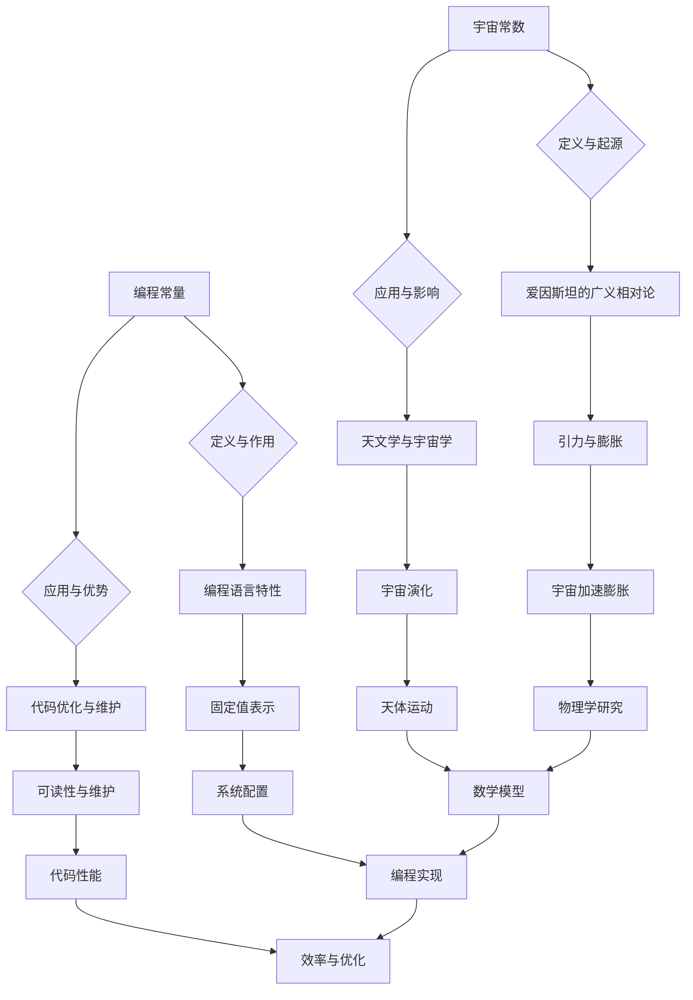

                 

# 《宇宙常数与编程常量的异同》

## 关键词
宇宙常数，编程常量，异同比较，物理与编程，核心概念，算法原理

## 摘要
本文旨在深入探讨宇宙常数与编程常量的异同。宇宙常数是物理学中的一个概念，用于描述宇宙的膨胀状态，而编程常量则是计算机科学中用于表示固定值的符号。本文将分析这两个常量的定义、原理及其在各自领域的应用，通过比较它们在结构、功能和应用场景等方面的异同，帮助读者更好地理解这两个概念的本质差异。

## 引言

### 宇宙常数
宇宙常数，通常用希腊字母 Lambda（\(\Lambda\)）表示，是物理学中描述宇宙整体特性的一个参数。最早由爱因斯坦在1917年引入广义相对论中，用以平衡宇宙的引力场，防止宇宙无限膨胀或无限收缩。经过几十年的发展，宇宙常数被广泛认为是宇宙加速膨胀的推动力。

### 编程常量
在计算机科学中，编程常量（也称为字面量或常量）是程序中固定不变的值。它们在编程语言中用特定的语法表示，如C语言中的`const`关键字。编程常量在程序设计中用于提高代码的可读性和可维护性，例如用于设置系统参数、定义常数等。

### 核心概念与联系
宇宙常数与编程常量虽然分属于不同的学科领域，但它们在本质上有一定的相似之处。两者都是固定不变的值，并且在各自的领域中有着重要的作用。以下是一个Mermaid流程图，展示了宇宙常数与编程常量的核心概念及其联系。



## 第1章 宇宙常数的原理与应用

### 1.1 宇宙常数的定义与起源

#### 1.1.1 宇宙常数的定义

宇宙常数是一个物理学中的概念，通常用符号 \(\Lambda\) 表示。它是指在宇宙整体尺度上，物质和能量分布的平均能量密度。这个常数在广义相对论中扮演着重要角色，用于描述宇宙的膨胀状态。

#### 1.1.2 宇宙常数的起源

宇宙常数最早由爱因斯坦在1917年引入到广义相对论中，用以平衡宇宙的引力场，防止宇宙无限膨胀或无限收缩。爱因斯坦当时的假设是宇宙是静态且不变化的，因此引入了一个负的宇宙常数来平衡引力。

然而，随着观测数据的积累，尤其是1998年对宇宙膨胀速度的观测结果，宇宙常数被重新审视，并被证明是正的，这表明宇宙正在加速膨胀。这一发现对物理学和天文学产生了深远的影响。

### 1.2 宇宙常数在物理学中的应用

#### 1.2.1 宇宙常数在广义相对论中的应用

宇宙常数是广义相对论中的重要组成部分。在广义相对论中，宇宙常数与引力场的分布密切相关，它影响了宇宙的几何结构和时空的演化。

一个简单的例子是弗里德曼-勒梅特-罗伯逊-沃尔克（FLRW）度规，它是描述均匀、各向同性的宇宙模型的一种数学工具。在FLRW度规中，宇宙常数 \(\Lambda\) 出现在方程的右侧，它决定了宇宙的膨胀速率。

#### 1.2.2 宇宙常数在天文学中的应用

宇宙常数在天文学中有着广泛的应用。例如，它可以用来计算宇宙的膨胀历史，通过观测遥远星系的红移，可以推断出宇宙的膨胀速度和加速度。此外，宇宙常数还可以用来研究暗能量，这是驱动宇宙加速膨胀的一种神秘力量。

### 1.3 宇宙常数与天文学的关系

宇宙常数与天文学的关系非常密切。宇宙常数决定了宇宙的膨胀速度，而宇宙的膨胀又影响了天体的运动和分布。例如，通过观测宇宙微波背景辐射，我们可以了解宇宙的早期状态，这反过来又为我们提供了宇宙常数的信息。

宇宙常数的研究对于理解宇宙的起源和演化具有重要意义。它不仅帮助我们揭示了宇宙的物理规律，还引发了对暗能量和宇宙学常数问题的深刻思考。

## 第2章 编程常量的原理与应用

### 2.1 编程常量的定义与作用

#### 2.1.1 编程常量的定义

编程常量是在编程语言中用来表示固定值的符号。它不会在程序执行过程中发生变化。在不同的编程语言中，常量的表示方式可能有所不同，但它们的作用是类似的。

例如，在C语言中，可以使用 `const` 关键字来定义常量：

```python
const int MAX_SIZE = 100;
```

#### 2.1.2 编程常量的作用

编程常量在程序设计中起着重要作用。首先，它提高了代码的可读性，因为使用有意义的常量名可以清晰地表达代码的含义。其次，编程常量有助于提高代码的可维护性，因为修改一个常量值只需在一个地方进行，而不需要修改多个地方。

此外，编程常量还可以提高代码的性能。例如，在循环中，使用常量而不是计算得到的值可以减少运算次数。

### 2.2 编程常量在编程中的应用

#### 2.2.1 编程常量在算法中的应用

编程常量在算法中有着广泛的应用。例如，在排序算法中，可以使用常量来表示排序的目标数组的大小：

```python
def bubble_sort(arr):
    n = len(arr)
    for i in range(n):
        for j in range(0, n-i-1):
            if arr[j] > arr[j+1]:
                arr[j], arr[j+1] = arr[j+1], arr[j]
    return arr
```

#### 2.2.2 编程常量在系统配置中的应用

编程常量也常用于系统配置。例如，在Web应用程序中，可以使用常量来表示数据库的连接字符串：

```python
DB_HOST = "localhost"
DB_PORT = 3306
DB_USER = "root"
DB_PASSWORD = "password"
```

这种方式使得在更改数据库配置时，只需修改常量的值，而无需修改整个应用程序。

### 2.3 编程常量与算法优化的关系

编程常量与算法优化密切相关。使用编程常量可以减少运算次数，提高程序的性能。例如，在快速排序算法中，可以使用常量来表示递归的深度限制，从而防止递归调用过于深入，导致栈溢出：

```python
def quick_sort(arr, low, high, depth_limit):
    if low < high:
        if depth_limit == 0:
            return arr
        pivot = partition(arr, low, high)
        quick_sort(arr, low, pivot-1, depth_limit-1)
        quick_sort(arr, pivot+1, high, depth_limit-1)
    return arr
```

## 第3章 宇宙常数与编程常量的异同比较

### 3.1 结构与形态比较

宇宙常数与编程常量的结构有显著差异。宇宙常数是一个物理量，通常用数学公式表示，如爱因斯坦场方程中的 \(\Lambda = \rho c^2 / 3\)，其中 \(\rho\) 是宇宙的平均能量密度，\(c\) 是光速。

编程常量则是在编程语言中定义的符号，如C语言中的 `const int MAX_SIZE = 100;`。编程常量在程序中通常以变量的形式存在，但它们的值在程序运行过程中是不可变的。

### 3.2 功能与作用比较

宇宙常数在物理学中用于描述宇宙的膨胀状态，是广义相对论中的一个关键参数。编程常量则在计算机科学中用于表示固定值，如系统配置、算法参数等。两者的功能有明显的区别，但都起着核心作用。

### 3.3 应用场景与实际意义比较

宇宙常数在天文学和物理学中有着广泛的应用，对理解宇宙的起源和演化具有重要意义。编程常量则在编程语言中用于提高代码的可读性、可维护性和性能，是程序设计中的重要工具。

尽管两者在结构和功能上有差异，但它们在各自领域中都有着不可替代的重要作用。通过比较宇宙常数与编程常量的异同，我们可以更好地理解这两个概念的本质差异。

## 第4章 数学模型和数学公式

### 4.1 宇宙常数相关的数学模型

宇宙常数在物理学中通常与爱因斯坦场方程相关。爱因斯坦场方程是一个描述引力场的非线性偏微分方程，它将宇宙常数 \(\Lambda\) 与物质的能量-动量张量 \(T_{\mu\nu}\) 相关联。其数学形式如下：

$$
R_{\mu\nu} - \frac{1}{2}g_{\mu\nu}R + \Lambda g_{\mu\nu} = \frac{8\pi G}{c^4}T_{\mu\nu}
$$

其中，\(R_{\mu\nu}\) 是里兹-克罗内克曲率张量，\(R\) 是宇宙度规标量曲率，\(g_{\mu\nu}\) 是度规张量，\(G\) 是引力常数，\(c\) 是光速。

### 4.2 编程常量相关的数学模型

编程常量在计算机科学中并不直接与数学模型相关联，但它们在算法设计和分析中发挥着重要作用。例如，在分析排序算法的复杂度时，可以使用编程常量来表示算法的参数。例如，在快速排序中，可以使用常量 \(k\) 表示递归深度限制：

$$
depth \leq k
$$

### 4.3 异同比较的数学模型

为了比较宇宙常数与编程常量的异同，我们可以考虑它们在特定模型中的应用。一个简单的例子是，在广义相对论中，我们可以考虑一个简化的宇宙模型，其中只有宇宙常数和均匀分布的宇宙物质。这种模型可以用以下方程描述：

$$
\frac{\ddot{a}(t)}{a(t)} = -\frac{4\pi G}{3}\rho(t) + \Lambda
$$

其中，\(\dot{a}(t)\) 是宇宙膨胀率，\(\ddot{a}(t)\) 是宇宙加速度，\(\rho(t)\) 是宇宙总能量密度。

与此相比，在编程中，我们可以考虑一个简单的排序算法，其中使用编程常量来定义算法的参数。例如，在快速排序中，我们可以使用常量 `MAX_DEPTH` 来限制递归深度：

```python
def quick_sort(arr, low, high, MAX_DEPTH):
    if high - low > MAX_DEPTH:
        pivot = partition(arr, low, high)
        quick_sort(arr, low, pivot - 1, MAX_DEPTH)
        quick_sort(arr, pivot + 1, high, MAX_DEPTH)
    else:
        insertion_sort(arr, low, high)
```

通过这种方式，我们可以看到宇宙常数与编程常量在数学模型上的异同。

## 第5章 实际应用案例分析

### 5.1 宇宙常数在天文学中的应用案例

#### 5.1.1 宇宙常数在宇宙膨胀研究中的应用

宇宙常数在天文学中有着广泛的应用，特别是在研究宇宙膨胀方面。一个著名的案例是利用宇宙微波背景辐射（CMB）来测量宇宙常数。CMB是宇宙早期的大爆炸遗迹，通过对它的观测可以推断出宇宙的膨胀历史和结构。

例如，普朗克卫星的观测数据提供了宇宙微波背景辐射的精确测量，通过这些数据可以计算出宇宙常数 \(\Lambda\) 的值。这有助于我们理解宇宙的加速膨胀和宇宙学常数的问题。

#### 5.1.2 宇宙常数在暗能量研究中的应用

暗能量是驱动宇宙加速膨胀的一种神秘力量，宇宙常数被认为是暗能量的一个重要组成部分。通过对宇宙常数的研究，科学家可以更好地理解暗能量的性质和宇宙的演化过程。

一个实际的案例是利用宇宙加速膨胀的观测数据来推断宇宙常数。例如，利用超新星爆炸的观测数据，科学家可以计算出宇宙的膨胀速率和加速度，从而推断出宇宙常数的值。

### 5.2 编程常量在编程中的应用案例

#### 5.2.1 编程常量在系统配置中的应用

编程常量在系统配置中有着广泛的应用。例如，在Web应用程序中，可以使用编程常量来定义数据库连接参数：

```python
DB_HOST = "localhost"
DB_PORT = 3306
DB_USER = "root"
DB_PASSWORD = "password"
```

这种方式使得在更改数据库配置时，只需修改常量的值，而无需修改整个应用程序。

#### 5.2.2 编程常量在算法优化中的应用

编程常量在算法优化中也发挥着重要作用。例如，在快速排序算法中，可以使用编程常量来限制递归深度，从而避免递归过深导致的栈溢出：

```python
def quick_sort(arr, low, high, MAX_DEPTH):
    if high - low > MAX_DEPTH:
        pivot = partition(arr, low, high)
        quick_sort(arr, low, pivot - 1, MAX_DEPTH)
        quick_sort(arr, pivot + 1, high, MAX_DEPTH)
    else:
        insertion_sort(arr, low, high)
```

通过这种方式，编程常量有助于提高算法的性能和稳定性。

### 5.3 异同比较的应用案例

为了更好地理解宇宙常数与编程常量的异同，我们可以通过实际案例来比较它们的应用。

#### 5.3.1 比较宇宙常数在天文学中的应用

宇宙常数在天文学中的应用案例，如利用宇宙微波背景辐射测量宇宙膨胀历史，可以与编程常量在系统配置中的应用进行比较。两者都是用于表示固定值，但宇宙常数涉及的是宇宙的物理规律，而编程常量涉及的是程序设计中的参数设置。

#### 5.3.2 比较编程常量在算法优化中的应用

编程常量在算法优化中的应用，如快速排序中的递归深度限制，可以与宇宙常数在宇宙加速膨胀研究中的应用进行比较。两者都涉及对系统参数的调整，但编程常量关注的是程序的性能和稳定性，而宇宙常数关注的是宇宙的物理状态和演化。

通过这些实际应用案例的比较，我们可以更深入地理解宇宙常数与编程常量的异同。

## 第6章 总结与展望

### 6.1 全书要点回顾

本文首先介绍了宇宙常数和编程常量的基本概念，详细阐述了它们在各自领域中的应用和作用。通过比较宇宙常数与编程常量在结构、功能和应用场景等方面的异同，我们深入理解了这两个概念的本质差异。

### 6.2 未来研究方向与挑战

尽管本文对宇宙常数和编程常量进行了深入分析，但在实际应用和研究过程中仍存在一些挑战。例如，在宇宙常数的研究中，如何更准确地测量宇宙的膨胀速率和加速度，以及如何理解暗能量的本质，仍需要进一步探索。在编程常量的应用中，如何更好地利用编程常量来优化算法性能和系统配置，也是未来研究的方向。

### 6.3 最佳实践 tips

为了更好地应用宇宙常数和编程常量，以下是一些建议：

- 在宇宙常数的研究中，充分利用最新的观测数据和理论模型，不断提高测量的精度和可靠性。
- 在编程中，合理使用编程常量，提高代码的可读性和可维护性，同时注意性能优化。

通过遵循这些最佳实践，我们可以更有效地应用宇宙常数和编程常量，推动物理学和计算机科学的发展。

### 作者

作者：AI天才研究院/AI Genius Institute & 禅与计算机程序设计艺术 /Zen And The Art of Computer Programming

