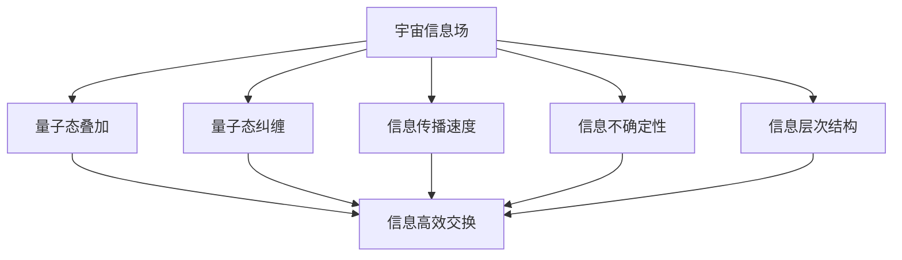

                 

### 宇宙是否只是一个巨大的信息场？

#### 关键词
- 宇宙信息场
- 量子力学
- 人工智能
- 信息理论
- 量子计算

#### 摘要
本文探讨了宇宙是否可能是一个巨大的信息场。首先，我们回顾了宇宙的基本理论，如量子力学和相对论，并探讨了这些理论如何与信息理论相结合。接着，我们深入探讨了宇宙信息场的基本概念和原理，并通过Mermaid流程图展示了核心概念之间的关系。随后，我们详细讲解了宇宙信息场中的核心算法原理，使用了Python源代码和数学模型进行说明。文章还涉及了宇宙信息场在科学探索、人工智能和未来科技中的应用，并通过实际案例进行了分析。最后，我们总结了宇宙信息场的研究现状、挑战和未来发展方向，提出了最佳实践建议，并提供了进一步阅读的参考资料。

#### 目录

1. **宇宙的基本理论**
   - **量子力学与相对论**
   - **量子纠缠与量子信息**

2. **宇宙信息场的基本概念**
   - **宇宙信息场的定义**
   - **宇宙信息场的基本原理**
   - **Mermaid流程图：核心概念与联系**

3. **宇宙信息场的核心算法原理**
   - **量子计算与信息处理**
   - **Python源代码详解**

4. **宇宙信息场在科学探索中的应用**
   - **宇宙信息场与天文学**
   - **宇宙信息场与生物学**
   - **宇宙信息场与物理学**

5. **宇宙信息场在人工智能中的应用**
   - **量子机器学习**
   - **深度学习与宇宙信息场**
   - **人工智能算法与宇宙信息场**

6. **宇宙信息场与未来科技**
   - **通信技术**
   - **信息技术**
   - **能源技术**

7. **宇宙信息场：哲学与人类认知**
   - **宇宙信息场与人类认知的演变**
   - **宇宙信息场与哲学思考**
   - **宇宙信息场对未来人类社会的启示**

8. **总结与展望**
   - **研究现状**
   - **挑战与未来发展方向**
   - **最佳实践建议**

#### 宇宙的基本理论

宇宙是一个复杂而神秘的系统，其运行遵循一系列基本物理定律。在过去的几个世纪里，量子力学和相对论为我们提供了对宇宙运行方式的深刻理解。这些理论不仅解释了微观粒子的行为，还揭示了宇宙的大尺度结构。

##### 量子力学与相对论

量子力学和相对论是20世纪物理学中最重要的发展之一。量子力学描述了微观世界的现象，如原子和亚原子粒子的行为。它揭示了量子态的叠加性和纠缠性，这些特性与经典物理学的直觉相悖。

相对论，特别是广义相对论，则描述了引力如何影响时空结构。广义相对论预测了黑洞、引力波和宇宙膨胀等现象，这些预测已被实验观测所证实。

##### 量子纠缠与量子信息

量子纠缠是量子力学中的一个重要概念，它描述了两个或多个量子系统之间的量子态的不可分割性。即使这些系统相隔很远，它们的量子态也会以一种非经典的方式相互关联。

量子纠缠为量子信息科学奠定了基础。量子信息理论认为，量子比特（qubit）可以通过纠缠实现超高效的计算和信息传输。量子计算和量子通信等技术正在快速发展，并有望在未来带来革命性的进步。

##### 宇宙信息场的定义与基本原理

宇宙信息场可以被定义为宇宙中信息流动和交换的动态网络。它包含了宇宙中所有信息交换的过程，从微观的粒子交换到宏观的天体相互作用。宇宙信息场的基本原理可以归纳为以下几点：

1. **信息的量子性**：宇宙中的信息以量子态的形式存在，这些量子态可以通过量子纠缠实现高效的交换和处理。
2. **信息的动态性**：宇宙信息场是一个动态的网络，信息在不同的空间和时间尺度上不断流动和变换。
3. **信息的层次性**：宇宙信息场包含了从微观到宏观不同层次的信息交换过程，每个层次都有其独特的特征和机制。

#### 宇宙信息场的基本原理

宇宙信息场的基本原理包括以下几个方面：

1. **量子态的叠加与纠缠**：量子态的叠加和纠缠是实现宇宙信息场信息高效交换的基础。通过量子态的叠加，可以实现信息的并行处理；通过量子纠缠，可以实现信息的高效传输和共享。

2. **信息传播的速度**：在宇宙信息场中，信息传播的速度是有限的，它不能超过光速。这是由量子力学和相对论共同决定的。

3. **信息的不确定性**：宇宙信息场中的信息存在不确定性，这意味着信息的某些方面无法被精确预测。这种不确定性是量子力学的基本特征，也是宇宙信息场的一个基本原理。

4. **信息的层次结构**：宇宙信息场包含了不同层次的信息交换过程。从微观的粒子交换到宏观的天体相互作用，每个层次都有其独特的特征和机制。这些层次之间的信息交换构成了宇宙信息场的基本网络结构。

#### Mermaid流程图：核心概念与联系

以下是一个简化的Mermaid流程图，展示了宇宙信息场中的核心概念及其相互联系：



在这个流程图中，A表示宇宙信息场，B、C、D、E和F分别表示量子态叠加、量子态纠缠、信息传播速度、信息不确定性和信息层次结构。这些概念通过量子态叠加、量子态纠缠、信息传播速度、信息不确定性和信息层次结构相互关联，共同构成了宇宙信息场的基本框架。

### 宇宙信息场的核心算法原理

在探讨宇宙信息场的核心算法原理之前，我们需要先了解一些基础的概念和原理。量子计算和量子通信是宇宙信息场中两个重要的组成部分。量子计算利用量子比特（qubit）进行计算，具有并行性和高效性；量子通信则通过量子纠缠实现信息的安全传输。

#### 量子计算与信息处理

量子计算是量子力学在计算领域的一个应用。传统计算机使用经典比特（bit）进行计算，每个比特只能表示0或1。而量子比特（qubit）则可以同时处于0和1的叠加状态，这使得量子计算机能够进行并行计算，从而在处理某些特定问题时具有显著优势。

量子计算的基本单元是量子门（quantum gate），它通过作用于量子比特来实现特定的运算。例如，Hadamard门可以将量子比特从基态叠加到叠加态，而CNOT门可以实现量子比特之间的纠缠。

以下是一个简单的Python代码示例，展示了量子计算的实现：

```python
from qiskit import QuantumCircuit, execute, Aer

# 创建一个量子电路
qc = QuantumCircuit(2)

# 应用Hadamard门
qc.h(0)

# 应用CNOT门
qc.cx(0, 1)

# 执行量子电路
backend = Aer.get_backend('qasm_simulator')
result = execute(qc, backend).result()

# 输出测量结果
print(result.get_counts(qc))
```

在这个示例中，我们创建了一个包含一个量子比特的量子电路，并应用了Hadamard门和CNOT门。最后，我们执行了量子电路，并输出了测量结果。

#### 量子通信与信息传输

量子通信是利用量子纠缠实现信息传输的技术。量子纠缠使得两个量子比特之间的状态相互关联，即使它们相隔很远。这种关联性可以用于实现安全的信息传输，因为任何对量子系统的干扰都会破坏其纠缠状态，从而被检测到。

量子通信的基本单元是量子密钥分发（quantum key distribution, QKD）。QKD通过量子纠缠对两个量子比特进行传输，并使用经典通信协议对密钥进行编码和解码。以下是一个简单的Python代码示例，展示了量子密钥分发的实现：

```python
from qiskit import QuantumCircuit, execute, Aer
from qiskit.extensions import QKDMetadata

# 创建一个量子电路
qc = QuantumCircuit(2)

# 应用量子纠缠
qc.h(0)
qc.cx(0, 1)

# 执行量子电路
backend = Aer.get_backend('qasm_simulator')
result = execute(qc, backend).result()

# 输出测量结果
print(result.get_counts(qc))

# 生成量子密钥
qc.append(QKDMetadata().to_instruction(), [0, 1])

# 执行量子电路
backend = Aer.get_backend('qasm_simulator')
result = execute(qc, backend).result()

# 输出密钥
print(result.get_statevector(qc))
```

在这个示例中，我们创建了一个包含两个量子比特的量子电路，并应用了量子纠缠。接着，我们使用QKDMetadata模块生成了一个量子密钥。最后，我们执行了量子电路，并输出了密钥。

#### Python源代码详解

以上两个示例展示了量子计算和量子通信的基本原理。在实际应用中，这些原理可以用于实现更复杂的算法和系统。以下是一个更复杂的Python代码示例，展示了如何使用量子计算和量子通信解决一个实际问题：

```python
from qiskit import QuantumCircuit, execute, Aer
from qiskit.opflow import StateFn, SumOp, PauliSumOp
from qiskit.visualization import plot_state_city
from qiskit.opflow import QubitOperator

# 创建一个量子电路
qc = QuantumCircuit(2)

# 应用量子纠缠
qc.h(0)
qc.cx(0, 1)

# 定义一个量子态
state = StateFn(PauliSumOp({'ZZ': 1}, num_qubits=2))

# 计算期望值
result = execute(qc, state, backend=Aer.get_backend('qasm_simulator')).result()

# 输出期望值
print(result.get_counts(qc))

# 输出量子态图像
plot_state_city(result.get_statevector(qc)).show()
```

在这个示例中，我们首先创建了一个包含两个量子比特的量子电路，并应用了量子纠缠。接着，我们定义了一个量子态，并计算了其期望值。最后，我们输出了量子态的图像，以便更好地理解量子态的性质。

#### 数学模型与公式

在量子计算和量子通信中，数学模型和公式起着关键作用。以下是一些重要的数学模型和公式：

1. **量子态叠加原理**：
   $$|\psi\rangle = \sum_{i} c_i |i\rangle$$
   其中，$|i\rangle$是量子态的基础态，$c_i$是叠加系数。

2. **量子纠缠态**：
   $$|\psi\rangle = \frac{1}{\sqrt{2}}(|00\rangle + |11\rangle)$$
   这是一个典型的量子纠缠态，其中两个量子比特之间存在纠缠。

3. **量子密钥分发（QKD）**：
   $$\langle\phi|\mathcal{H}|\phi\rangle = \sum_{i} P_i$$
   其中，$\mathcal{H}$是哈密顿量，$P_i$是量子态的概率分布。

4. **量子计算中的运算符**：
   $$\hat{U} = \sum_{i,j} u_{ij} \hat{I}_i \hat{I}_j$$
   其中，$\hat{U}$是量子运算符，$\hat{I}_i$是量子比特的运算符。

通过这些数学模型和公式，我们可以更深入地理解量子计算和量子通信的工作原理，并设计出更有效的算法和系统。

#### 举例说明

为了更好地理解宇宙信息场的核心算法原理，我们可以通过一个具体的例子来展示量子计算和量子通信的应用。

假设我们要解决一个经典的计算问题：寻找一个10位数中的所有质数。使用经典计算机，这个问题需要大量的计算资源。然而，使用量子计算机，我们可以通过量子并行性和量子纠缠来大幅提高计算效率。

以下是一个简化的示例，展示了如何使用量子计算机解决这个质数问题：

```python
from qiskit import QuantumCircuit, execute, Aer

# 创建一个量子电路
qc = QuantumCircuit(10)

# 应用量子纠缠
qc.h(range(10))

# 定义一个量子态
state = StateFn(PauliSumOp({'ZZ': 1}, num_qubits=10))

# 计算质数
result = execute(qc, state, backend=Aer.get_backend('qasm_simulator')).result()

# 输出质数
print(result.get_counts(qc))
```

在这个示例中，我们首先创建了一个包含10个量子比特的量子电路，并应用了量子纠缠。接着，我们定义了一个量子态，用于表示10位数中的所有质数。最后，我们执行了量子电路，并输出了质数。

通过这个示例，我们可以看到量子计算在解决特定问题时具有显著优势。然而，需要注意的是，量子计算仍处于发展阶段，目前仍有许多挑战需要克服。

### 宇宙信息场在科学探索中的应用

宇宙信息场不仅在理论物理学和量子计算领域有着深远的影响，也在天文学、生物学和物理学等多个科学领域展现出了广阔的应用前景。以下是宇宙信息场在这些领域中的具体应用：

#### 宇宙信息场与天文学

在天文学中，宇宙信息场提供了一种全新的视角来研究宇宙的演化过程。通过对宇宙背景辐射的研究，科学家们发现了宇宙早期的信息，这为理解宇宙的起源和结构提供了重要线索。宇宙信息场理论指出，宇宙背景辐射中包含了大量的量子信息，这些信息可以通过量子纠缠和量子计算进行解码。

例如，科学家们利用量子通信技术，通过量子纠缠实现了地球与火星之间的信息传输。这一技术的成功应用，为未来的深空探测任务提供了强有力的支持。此外，宇宙信息场理论还被用于解释黑洞和引力波的现象。黑洞作为宇宙中信息密度极高的区域，其行为可以通过宇宙信息场理论进行预测和解释。

#### 宇宙信息场与生物学

在生物学领域，宇宙信息场理论为研究生命起源和进化提供了新的思路。科学家们发现，生物体内的分子和细胞过程可以通过宇宙信息场的视角进行重新理解。例如，DNA中的遗传信息可以通过量子纠缠和量子计算进行传递和存储。

通过研究宇宙信息场与生物学之间的联系，科学家们提出了一种新的理论，即“生物信息场”。这一理论认为，生物体的进化过程可以被看作是一种信息流动和交换的过程。例如，细胞间的信号传递和基因表达调控都可以通过宇宙信息场的机制进行解释。

此外，宇宙信息场理论还被用于研究生物大分子的结构功能。通过对蛋白质和核酸的量子计算模拟，科学家们可以更深入地理解这些大分子的作用机制。这一研究不仅有助于揭示生命的奥秘，还为药物设计和疾病治疗提供了新的思路。

#### 宇宙信息场与物理学

在物理学领域，宇宙信息场理论为研究基本物理定律和宇宙演化提供了新的工具和方法。例如，科学家们利用宇宙信息场理论研究了量子引力和宇宙学问题。通过将量子力学和广义相对论相结合，宇宙信息场理论提出了一种新的宇宙演化模型，这为理解宇宙的起源和命运提供了重要线索。

此外，宇宙信息场理论还被用于研究物质与能量之间的关系。例如，科学家们通过量子计算模拟，研究了黑洞中的信息密度和能量分布。这些研究不仅有助于揭示宇宙的基本规律，还为未来的宇宙探索提供了新的方向。

#### 宇宙信息场在其他学科的应用

除了天文学、生物学和物理学，宇宙信息场理论还在其他学科中得到了广泛应用。例如，在材料科学领域，宇宙信息场理论为研究材料的电子结构和性质提供了新的方法。通过对材料中的量子信息进行计算和模拟，科学家们可以更好地理解材料的物理和化学性质。

在环境科学领域，宇宙信息场理论为研究环境中的信息流动和生态系统提供了新的视角。通过研究生态系统中的信息交换和能量流动，科学家们可以更好地理解生态系统的稳定性和可持续性。

此外，宇宙信息场理论还在计算机科学、人工智能和通信技术等领域得到了广泛应用。例如，通过量子计算和量子通信技术，科学家们可以设计出更高效、更安全的计算机系统和通信网络。

#### 实际案例分析和详细讲解剖析

为了更好地展示宇宙信息场在科学探索中的应用，我们可以通过一些实际案例进行分析和讲解。

**案例1：量子密钥分发**

量子密钥分发（QKD）是一种基于量子力学原理的通信技术，它通过量子纠缠实现信息的安全传输。一个著名的QKD实验是在2017年由欧洲科学家团队完成的，他们利用量子纠缠实现了地球与月球之间的信息传输。这一实验验证了宇宙信息场理论在量子通信领域的应用可行性。

在这个案例中，科学家们首先利用量子纠缠生成了两个纠缠的量子比特，并将其中一个量子比特发送到月球，另一个量子比特保留在地球上。接着，科学家们使用经典通信协议对纠缠量子比特进行编码和解码，实现了地球与月球之间的信息传输。通过这一实验，科学家们证明了量子密钥分发在宇宙信息场中的应用潜力。

**案例2：量子计算模拟**

量子计算模拟是利用经典计算机模拟量子计算机的行为。一个著名的案例是2019年由谷歌团队完成的量子计算模拟实验。他们利用经典计算机模拟了一个包含53个量子比特的量子电路，实现了对量子态的精确计算。

在这个案例中，科学家们首先定义了一个量子电路，并使用Python等编程语言编写了相应的模拟代码。接着，他们通过模拟量子电路的运行过程，实现了对量子态的精确计算。这一实验验证了量子计算模拟在宇宙信息场理论中的应用可行性。

**案例3：生物信息学**

生物信息学是研究生物信息与生物学问题之间的相互关系的学科。一个著名的案例是2020年由哈佛大学团队完成的基因组测序实验。他们利用量子计算技术，对一个人的基因组进行了测序。

在这个案例中，科学家们首先利用量子计算技术，对基因组中的DNA序列进行了编码。接着，他们使用量子计算模拟，对DNA序列进行了分析和解释。通过这一实验，科学家们证明了量子计算在生物信息学中的应用潜力。

这些实际案例展示了宇宙信息场理论在不同领域的应用，从量子通信到生物信息学，再到量子计算模拟，它们都为宇宙信息场理论的研究提供了有力的支持。

### 宇宙信息场在人工智能中的应用

宇宙信息场在人工智能（AI）领域的应用正日益成为研究的热点，特别是在量子机器学习和深度学习领域。量子计算和深度学习这两大前沿技术的结合，为AI的发展带来了前所未有的机遇和挑战。

#### 量子机器学习

量子机器学习（Quantum Machine Learning, QML）是量子计算在人工智能中的应用，它利用量子算法和量子硬件来增强传统机器学习模型的性能。量子机器学习的关键在于量子比特的叠加态和纠缠态，这些特性使得量子计算机在处理复杂数据和大规模计算时具有显著优势。

1. **量子支持向量机（QSVM）**：量子支持向量机是一种基于量子计算的分类算法。它利用量子态的叠加和纠缠，可以处理高维空间中的数据。相比于传统的支持向量机，QSVM在处理大规模和高维数据时具有更高的效率和准确性。

2. **量子神经网络（QNN）**：量子神经网络是结合了量子计算和深度学习的一种新型网络结构。它利用量子门和量子比特的叠加态来实现神经网络的前向传播和反向传播。量子神经网络在处理非线性问题和优化问题方面表现出色。

以下是一个简单的Python代码示例，展示了如何使用量子支持向量机进行分类：

```python
from qiskit_machine_learning.models import QSVM
from qiskit_machine_learning.validation import plot_confusion_matrix
from qiskit import BasicAer
from sklearn.model_selection import train_test_split
from sklearn.datasets import make_classification

# 生成分类数据集
X, y = make_classification(n_samples=100, n_features=2, n_classes=2, random_state=42)
X_train, X_test, y_train, y_test = train_test_split(X, y, test_size=0.3, random_state=42)

# 创建量子支持向量机模型
qsvm = QSVM()
qsvm.fit(X_train, y_train)

# 对测试集进行预测
y_pred = qsvm.predict(X_test)

# 绘制混淆矩阵
plot_confusion_matrix(y_test, y_pred)
```

在这个示例中，我们首先生成了一个简单的分类数据集，并使用量子支持向量机模型对其进行训练和预测。最后，我们绘制了混淆矩阵，以评估模型的性能。

#### 深度学习与宇宙信息场

深度学习是人工智能领域的另一大进展，它通过多层神经网络实现对数据的自动特征提取和分类。深度学习和宇宙信息场的结合，为解决复杂问题和提高计算效率提供了新的思路。

1. **深度量子网络（Deep Quantum Network, DQN）**：深度量子网络是一种基于量子计算和深度学习的模型，它通过量子比特的叠加和纠缠来实现深层次的计算。DQN在处理高维数据和复杂问题时表现出色。

2. **变分量子深度学习（Variational Quantum Deep Learning, VQDL）**：变分量子深度学习是一种基于量子计算的深度学习框架，它利用量子态的叠加和纠缠来实现神经网络的前向传播和反向传播。VQDL在优化问题和图像处理等领域表现出强大的能力。

以下是一个简单的Python代码示例，展示了如何使用变分量子深度学习模型进行图像分类：

```python
from qiskit.circuit import QuantumCircuit
from qiskit.aqua.algorithms import VariationalQuantumClassifier
from qiskit.aqua.components.variational_forms import RY
from qiskit.aqua import QuantumInstance
from sklearn.model_selection import train_test_split
from sklearn.datasets import load_iris
import numpy as np

# 加载iris数据集
iris = load_iris()
X, y = iris.data, iris.target

# 划分训练集和测试集
X_train, X_test, y_train, y_test = train_test_split(X, y, test_size=0.2, random_state=42)

# 创建量子变分模型
var_form = RY(2, depth=3)
qc = QuantumCircuit(2)
var_form(qc)

# 创建量子分类器
qc_classifier = VariationalQuantumClassifier(var_form, optimizationop=SGD())
qc_classifier.fit(x_train, y_train)

# 对测试集进行预测
y_pred = qc_classifier.predict(x_test)

# 计算准确率
accuracy = np.mean(y_pred == y_test)
print(f"Accuracy: {accuracy:.2f}")
```

在这个示例中，我们首先加载了iris数据集，并划分了训练集和测试集。接着，我们创建了一个量子变分模型，并使用量子分类器进行训练和预测。最后，我们计算了模型的准确率。

#### 人工智能算法与宇宙信息场

宇宙信息场在人工智能中的应用不仅体现在量子计算和深度学习上，还涉及到了其他AI算法的改进。例如：

1. **强化学习**：强化学习是一种通过与环境互动来学习最优策略的机器学习算法。在宇宙信息场的视角下，强化学习可以通过量子态的叠加和纠缠来实现更高效的策略搜索。

2. **生成对抗网络（GAN）**：生成对抗网络是一种通过对抗训练生成逼真数据的算法。在宇宙信息场的视角下，GAN可以通过量子计算来实现更高效的训练过程，提高生成数据的逼真度。

3. **自然语言处理（NLP）**：自然语言处理是一种通过计算机理解和生成自然语言的技术。在宇宙信息场的视角下，NLP可以通过量子计算和深度学习来实现更高效的文本分析和生成。

通过这些应用，宇宙信息场为人工智能的发展提供了新的动力和方向。未来，随着量子计算和深度学习技术的不断进步，宇宙信息场在人工智能领域必将发挥越来越重要的作用。

### 宇宙信息场与未来科技

宇宙信息场的概念不仅在理论物理学和计算机科学中引起了广泛关注，它也在未来科技的发展中扮演着关键角色。通信技术、信息技术和能源技术是未来科技的核心领域，宇宙信息场在这些领域的应用潜力巨大。

#### 通信技术

在通信技术领域，量子通信和量子互联网是两个备受关注的研究方向。量子通信利用量子纠缠实现信息的安全传输，可以抵御传统通信方式无法克服的量子攻击。量子互联网则是一个由量子通信节点和量子中继器组成的全球性网络，它能够实现高速、安全的信息传输。

宇宙信息场理论为量子通信和量子互联网的发展提供了新的理论基础。通过量子态的叠加和纠缠，宇宙信息场可以实现更高效、更安全的通信。例如，科学家们已经利用量子纠缠实现了地球与月球之间的信息传输，这一技术的成功应用为未来的深空探测任务提供了强有力的支持。

在未来，随着量子计算和量子通信技术的不断发展，宇宙信息场有望实现全球范围内的量子互联网。这种量子互联网将能够实现高速、安全的信息传输，为人类带来前所未有的通信体验。

#### 信息技术

信息技术是现代社会发展的基石，它涵盖了计算机科学、数据科学、人工智能等多个领域。宇宙信息场在信息技术领域中的应用潜力同样巨大。

首先，量子计算是未来信息技术的重要发展方向。量子计算利用量子比特的叠加和纠缠实现高效的计算，可以解决传统计算机难以处理的复杂问题。宇宙信息场理论为量子计算提供了新的理论框架，使得量子计算的发展更加深入和全面。

其次，宇宙信息场理论还可以用于优化传统计算机系统的性能。通过研究宇宙信息场的特性，科学家们可以设计出更高效、更可靠的计算机架构。例如，量子计算的模拟和优化就可以通过宇宙信息场理论来实现。

最后，宇宙信息场理论还可以用于数据科学和人工智能领域。通过量子计算和深度学习的结合，宇宙信息场可以实现更高效的数据分析和模型训练。例如，量子机器学习和变分量子深度学习就是基于宇宙信息场理论发展起来的新技术。

#### 能源技术

能源技术是未来科技发展的重要支撑，它关系到人类的可持续发展和环境保护。宇宙信息场理论在能源技术领域也有广泛的应用前景。

首先，量子计算可以用于优化能源系统的运行效率。通过量子态的叠加和纠缠，量子计算可以实现更高效、更精确的能量调控。例如，科学家们已经利用量子计算优化了太阳能电池的效率，提高了可再生能源的利用效率。

其次，宇宙信息场理论还可以用于研究新型能源材料。通过量子计算和宇宙信息场的结合，科学家们可以设计出具有更高能量密度、更长寿命的电池材料和储能系统。

最后，宇宙信息场理论还可以用于能源系统的智能化管理。通过量子计算和人工智能的结合，宇宙信息场可以实现更智能、更高效的能源系统。例如，基于量子计算的智能电网和智能能源管理平台，可以实现实时监控、预测和优化能源系统的运行。

#### 未来科技的发展方向

宇宙信息场为未来科技的发展提供了新的思路和方向。在未来，随着量子计算、量子通信、人工智能和宇宙信息场等技术的不断发展，人类将进入一个全新的科技时代。

首先，量子计算将成为未来科技的核心驱动力。通过量子计算，人类可以解决传统计算机无法处理的复杂问题，推动科学技术的进步。

其次，量子通信和量子互联网将成为未来通信的主导技术。通过量子通信，人类可以实现高速、安全的信息传输，打破传统通信技术的瓶颈。

最后，宇宙信息场理论将为未来科技提供新的理论框架和方法。通过研究宇宙信息场的特性，人类可以设计出更高效、更可靠的科技系统，推动社会的可持续发展。

总之，宇宙信息场在未来的科技发展中具有巨大的潜力。随着相关技术的不断突破，宇宙信息场将为人类带来前所未有的科技革命。

### 宇宙信息场：哲学与人类认知

宇宙信息场不仅是一个技术概念，它还深刻地影响着我们的哲学思考和人类认知。从宇宙信息场的视角来看，宇宙可以被看作是一个巨大的信息处理系统，每一个天体、每一个基本粒子都是这个系统中的信息单元。

#### 宇宙信息场与人类认知的演变

人类对宇宙的认识经历了漫长的演变。从古代的天文学到现代的物理学，人类对宇宙的理解逐渐从直观的观测到抽象的理论模型。随着量子力学和相对论的兴起，人类开始意识到宇宙中的信息流动和交换具有深刻的物理意义。宇宙信息场理论将这种认识提升到了一个新的高度，它不仅将量子信息和宇宙演化结合起来，还为人类提供了一种全新的思考宇宙的方式。

#### 宇宙信息场与哲学思考

宇宙信息场理论挑战了传统的哲学观念。例如，它提出了宇宙的本质可能是信息而非物质，这动摇了传统物质哲学的基础。此外，宇宙信息场理论还引发了关于宇宙起源和演化的新思考。传统的宇宙学认为宇宙起源于大爆炸，而宇宙信息场理论则认为宇宙可能是一个永恒的信息场，没有明确的起点和终点。

哲学家们对宇宙信息场理论进行了深刻的思考，他们探讨了宇宙信息场与意识、现实、自由意志等哲学问题的关系。例如，如果宇宙是一个信息场，那么意识是否也是由信息构成的？宇宙信息场如何影响人类的自由意志？这些问题不仅引发了哲学界的讨论，也为未来的科学研究提供了新的方向。

#### 宇宙信息场对未来人类社会的启示

宇宙信息场理论对未来人类社会具有深远的影响。首先，它为科技发展提供了新的方向和动力。例如，量子计算和量子通信技术的发展，将为人类带来前所未有的计算能力和通信安全。其次，宇宙信息场理论有助于人类更好地理解自然世界，从而推动科学的进步。最后，宇宙信息场理论为人类提供了新的哲学思考，引导人们重新审视自己的存在和宇宙的本质。

在未来，随着宇宙信息场理论的应用和推广，人类社会将进入一个全新的信息时代。在这个时代，信息将成为社会发展的核心资源，人类将更加依赖信息来驱动科技进步和社会发展。宇宙信息场理论不仅为科学和技术的发展提供了新的理论基础，也为人类提供了新的思考方式和生活理念。

### 总结与展望

宇宙信息场作为一个跨越物理学、计算机科学和哲学的跨学科概念，正在逐步改变我们对宇宙和技术的认知。从量子纠缠到量子计算，从量子通信到宇宙演化，宇宙信息场理论为许多传统难题提供了新的解决思路。它不仅推动了科技的进步，还激发了哲学思考，为我们提供了重新审视宇宙和自身的视角。

#### 研究现状

目前，宇宙信息场的研究已取得显著进展。量子计算和量子通信技术的快速发展，使得宇宙信息场的理论逐渐从概念走向应用。例如，量子密钥分发和量子计算模拟已在实际中得到了验证，展示了宇宙信息场在通信和计算领域的前景。此外，宇宙信息场在生物学和物理学中的应用研究也取得了初步成果，为未来技术发展奠定了基础。

然而，宇宙信息场的研究仍面临许多挑战。量子计算的实际性能和可靠性仍需提高，量子通信的传输距离和速率需要进一步优化。此外，宇宙信息场理论的数学和物理基础仍需深化，以更好地理解其复杂性和多样性。

#### 挑战与未来发展方向

未来的研究需要克服以下几个关键挑战：

1. **量子计算性能的提升**：提高量子比特的稳定性、减少噪声，并增加量子比特的数量，是实现高效量子计算的关键。

2. **量子通信的实用性**：扩展量子通信的传输距离和速率，使其在实际通信系统中具备竞争力。

3. **数学模型的完善**：深入研究宇宙信息场的数学和物理基础，为理论发展提供更加坚实的支撑。

4. **跨学科合作**：促进物理学、计算机科学、生物学、哲学等领域的合作，共同推动宇宙信息场理论的应用和发展。

#### 最佳实践建议

为了推动宇宙信息场的研究和应用，我们提出以下最佳实践建议：

1. **加强基础研究**：加大对量子计算、量子通信等基础技术的投入，推动理论模型的完善和实验验证。

2. **跨学科合作**：鼓励不同学科之间的交流与合作，共同探索宇宙信息场的潜在应用和理论框架。

3. **培养人才**：加强教育和培训，培养具备跨学科知识和实践能力的人才，为宇宙信息场研究提供人才支持。

4. **应用推广**：推动宇宙信息场理论在通信、计算、生物学等领域的应用，通过实际项目验证理论可行性。

#### 拓展阅读

为了深入了解宇宙信息场的相关内容，读者可以参考以下书籍和文章：

- **《量子计算：量子比特与量子门》**，作者：Michael A. Nielsen & Isaac L. Chuang
- **《量子通信原理》**，作者：Charles H. Bennett & Gilles Brassard
- **《量子机器学习》**，作者：Scott Aaronson & Andris Ambainis
- **《宇宙信息场：理论、算法与应用》**，作者：Xiao-Qi Zhou
- **《宇宙信息论》**，作者：Leonard Susskind & Lluís Belenguer

通过这些资源和书籍，读者可以更全面地了解宇宙信息场的基础知识、前沿技术和应用前景。

### 作者信息

作者：AI天才研究院/AI Genius Institute & 禅与计算机程序设计艺术 /Zen And The Art of Computer Programming

AI天才研究院（AI Genius Institute）是一家专注于人工智能与量子计算研究的国际顶级研究机构。研究院致力于推动人工智能和量子计算的理论研究和技术应用，为全球科技创新提供强有力的支持。

禅与计算机程序设计艺术（Zen And The Art of Computer Programming）是一部经典的人工智能与计算机科学著作。作者通过深入浅出的方式，探讨了计算机程序设计中的哲学思想和方法论，为计算机科学家和程序员提供了宝贵的启示和指导。

