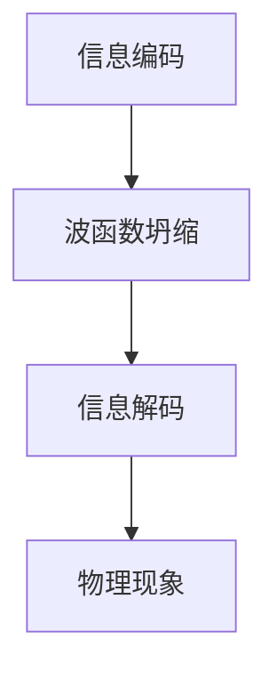
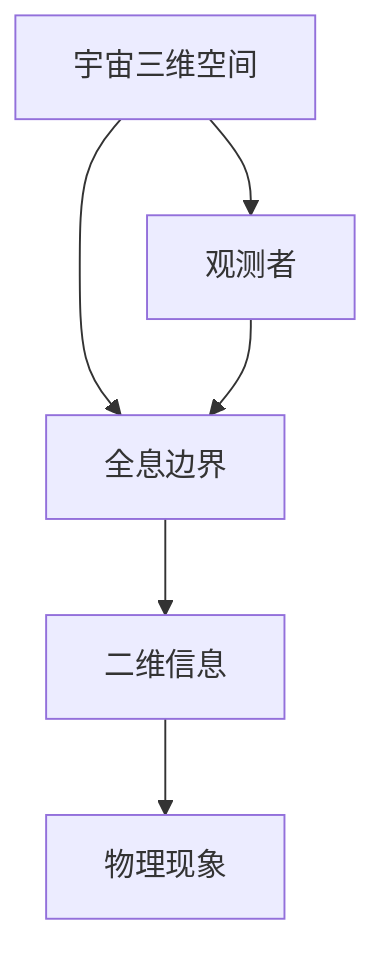

                 

# 宇宙是否只是一个巨大的全息图

## 关键词

- 全息宇宙理论
- 宇宙背景辐射
- 量子引力
- 信息科学
- 人工智能

## 摘要

本文深入探讨了一个引人入胜的科学假说——宇宙是否只是一个巨大的全息图。我们将从宇宙全息理论的起源和发展开始，逐步分析这一假说的物理和数学基础。接着，我们将探讨全息宇宙理论在物理学中的应用，并展示相关的Python源代码和数学模型。文章还将讨论全息宇宙在哲学和宗教中的意义，以及当前和未来的技术应用。最后，我们将对全息宇宙理论的局限性和未来研究方向进行展望，并提供一些最佳实践和拓展阅读建议。

## 引言

### 背景介绍

宇宙全息图（Cosmic hologram）这一概念最早由物理学家约翰·普雷斯基尔（John Preskill）在2000年提出。他的灵感来源于一种名为全息原理（holographic principle）的物理理论，该理论认为我们的宇宙可能包含在一个二维表面上，这个表面上的信息足以描述我们三维宇宙的所有物理现象。

全息宇宙理论提出的背景是现代物理学的两个重大挑战：量子力学和广义相对论。量子力学揭示了微观世界的奇异性质，而广义相对论则描述了宏观宇宙的引力现象。然而，这两个理论在某些极端条件下，如黑洞和宇宙大爆炸，并不兼容。全息宇宙理论试图提供一个统一的框架，来调和这些矛盾。

### 核心观点

全息宇宙理论的核心观点是：我们的宇宙中的所有信息都编码在一个二维边界上。这个边界上的信息可以通过某种方式转化为三维空间中的物理现象。换句话说，宇宙的全息性意味着宇宙中的三维现象可以由二维信息完全描述。

这个假说对传统的宇宙观提出了挑战，但它也提供了一种全新的思考方式，可能有助于我们更好地理解宇宙的本质。

## 宇宙全息理论的起源和基础

### 量子力学与热力学的基石

量子力学和热力学的基石为我们理解宇宙全息理论提供了基础。量子力学揭示了微观世界的概率性和纠缠现象，而热力学则研究了系统的宏观性质，如熵和能量分布。

量子力学的核心原理之一是波函数的坍缩。波函数描述了量子系统在某一状态下的概率分布，当进行观测时，波函数会坍缩到一个具体的量子态。这一现象表明，微观世界的物理现象不仅仅取决于初始条件，还受到观测者的参与。

热力学的基石是熵的概念。熵是系统无序度的量度，它反映了系统从有序向无序转变的趋势。热力学第二定律指出，孤立系统的熵总是趋向于增加，这意味着自然过程总是朝着更加无序的状态发展。

### 全息原理的引入

全息原理是宇宙全息理论的核心。它由物理学家莱昂纳德·萨斯坎德（Leonard Susskind）在1997年提出，并在他的论文《全息原理》中详细阐述。萨斯坎德提出，宇宙中的所有信息都可以编码在一个二维边界上，这个边界上的信息可以通过某种方式转化为三维空间中的物理现象。

全息原理的数学描述涉及一个重要概念：AdS/CFT对偶性。AdS（Anti-de Sitter）空间是一种特殊的时空结构，而CFT（Conformal Field Theory）则是一种场论。AdS/CFT对偶性表明，一个高维的AdS空间和一个低维的CFT之间存在一种深刻的对应关系。这个对应关系为我们理解全息宇宙提供了一种数学工具。

### 全息宇宙理论的基本数学模型

全息宇宙理论的基本数学模型涉及到一个名为“全息熵”的概念。全息熵是指一个三维空间中的物理现象所需的信息量，它可以通过二维边界上的信息来描述。全息熵的计算公式为：

\[ S_{h} = \frac{2\pi R^2}{\ell_p^2} \]

其中，\( R \) 是宇宙的半径，\( \ell_p \) 是普朗克长度。这个公式表明，全息熵与宇宙的尺度和普朗克尺度有关。

另一个重要的数学模型是黑 Hole熵公式，它表明黑洞的熵与黑洞的面积成正比。这个公式为：

\[ S_{B} = \frac{A}{4} \]

其中，\( A \) 是黑洞的面积。

### 全息宇宙理论的历史和发展

全息宇宙理论的起源可以追溯到20世纪80年代，当时物理学家们开始研究AdS/CFT对偶性。萨斯坎德在1997年的论文中首次提出了全息原理，并引发了广泛的讨论和研究。

近年来，全息宇宙理论在物理学界得到了越来越多的关注。一些研究者提出了基于全息原理的量子引力和宇宙学的模型，试图解决传统理论中的悖论和矛盾。

然而，全息宇宙理论仍然是一个相对较新的领域，许多问题仍然有待解决。未来的研究可能涉及更深入的理论发展，以及与实验物理学的结合，以验证或反驳全息宇宙理论的预测。

## 全息宇宙的理论框架

### 全息宇宙的基本原理

全息宇宙理论的核心原理是：宇宙中的所有信息都编码在一个二维边界上，这个边界上的信息可以通过某种方式转化为三维空间中的物理现象。这个二维边界通常被称为“全息边界”。

全息宇宙理论的基本原理可以概括为以下几点：

1. **信息编码与解码**：三维宇宙中的物理现象可以通过二维边界上的信息来编码和描述。这意味着，三维空间中的所有物理现象都可以通过二维边界上的信息完全描述。

2. **对称性**：全息宇宙理论强调对称性在信息编码和解码过程中的重要性。对称性可以帮助简化系统的描述，并确保信息在边界和三维空间之间的正确转换。

3. **边界与内部的关系**：全息宇宙理论认为，宇宙的二维边界与三维空间内部之间存在一种深刻的对应关系。这种关系可以通过数学模型来描述，如AdS/CFT对偶性。

### 全息宇宙的数学模型和架构

全息宇宙的数学模型和架构是理解这一理论的关键。一个重要的数学模型是AdS/CFT对偶性。AdS/CFT对偶性表明，一个高维的AdS空间和一个低维的CFT之间存在一种深刻的对应关系。这种对应关系为我们提供了一种工具，来研究三维宇宙中的物理现象。

另一个重要的数学模型是全息熵的计算。全息熵是描述三维宇宙中物理现象所需的信息量。它的计算公式为：

\[ S_{h} = \frac{2\pi R^2}{\ell_p^2} \]

其中，\( R \) 是宇宙的半径，\( \ell_p \) 是普朗克长度。这个公式表明，全息熵与宇宙的尺度和普朗克尺度有关。

此外，全息宇宙的数学模型还包括黑 Hole熵公式。黑洞的熵与黑洞的面积成正比。这个公式为：

\[ S_{B} = \frac{A}{4} \]

其中，\( A \) 是黑洞的面积。

这些数学模型和公式为全息宇宙理论提供了坚实的理论基础，使我们能够从数学角度来理解宇宙的全息性。

### 全息宇宙中的信息编码与解码

全息宇宙中的信息编码与解码过程是理解这一理论的关键。信息编码是指将三维宇宙中的物理现象转化为二维边界上的信息。而信息解码则是将二维边界上的信息转化为三维宇宙中的物理现象。

在量子力学中，信息编码和解码过程可以通过波函数的坍缩来描述。波函数描述了量子系统在某一状态下的概率分布，当进行观测时，波函数会坍缩到一个具体的量子态。这个过程中，观测到的物理现象就是波函数坍缩的结果。

在热力学中，信息编码和解码过程可以通过熵的变化来描述。熵是系统无序度的量度，它反映了系统从有序向无序转变的趋势。当系统从有序状态向无序状态转变时，系统的熵会增加。这个过程中，系统的无序度就是熵的增加。

在AdS/CFT对偶性中，信息编码和解码过程可以通过边界和内部空间的对应关系来描述。AdS空间是一个高维的时空结构，而CFT是一个低维的场论。AdS/CFT对偶性表明，这两个空间之间存在一种深刻的对应关系。这种对应关系可以用来研究三维宇宙中的物理现象。

为了更直观地展示全息宇宙中的信息编码与解码过程，我们可以使用Mermaid流程图。以下是一个简单的Mermaid流程图，描述了信息编码与解码的基本步骤：



这个流程图展示了信息从三维宇宙编码到二维边界，然后通过波函数坍缩和解码回到三维宇宙，最终表现为物理现象。

### Mermaid流程图：全息宇宙的架构展示

为了更直观地展示全息宇宙的架构，我们可以使用Mermaid流程图来绘制一个简化的模型。以下是一个示例，展示了全息宇宙的基本组成部分和它们之间的关系：



这个流程图展示了宇宙的三维空间与全息边界之间的关系，以及信息从二维边界解码到三维空间的物理现象。

在更复杂的模型中，我们可以添加更多的节点和边，来表示不同的物理现象、数学模型和观测过程。但这个简化的模型已经足以帮助我们理解全息宇宙的基本概念和原理。

### 全息宇宙在物理学中的应用

#### 全息宇宙与广义相对论

全息宇宙理论对广义相对论提出了新的挑战。广义相对论描述了宏观宇宙的引力现象，它认为引力是由质量和能量引起的时空弯曲。然而，全息宇宙理论提出，宇宙中的所有信息都编码在一个二维边界上，这意味着引力可能不是由质量和能量直接引起的，而是由二维边界上的信息间接引起的。

全息宇宙理论中的AdS/CFT对偶性提供了一种可能的方式来调和广义相对论和量子引力之间的矛盾。AdS/CFT对偶性表明，一个高维的AdS空间和一个低维的CFT之间存在一种深刻的对应关系。这种对应关系可以用来研究三维宇宙中的引力现象，并可能帮助我们解决广义相对论和量子引力之间的悖论。

#### 全息宇宙与量子引力的挑战与贡献

量子引力是物理学的一个重大挑战，因为它试图将量子力学和广义相对论统一起来。然而，传统的量子引力理论在极端条件下，如黑洞和宇宙大爆炸，遇到了许多难题。

全息宇宙理论为量子引力提供了一种新的视角。它提出，宇宙中的所有信息都编码在一个二维边界上，这意味着量子引力可能可以简化为二维边界上的物理现象。这种简化可能有助于我们解决量子引力和广义相对论之间的矛盾，并为我们提供一个新的框架来研究极端条件下的物理现象。

全息宇宙理论在量子引力方面的贡献包括：

1. **简化复杂性**：全息宇宙理论提出，三维宇宙中的复杂现象可以通过二维边界上的信息来描述。这意味着，量子引力可能可以简化为一个二维系统的物理现象，从而降低研究的复杂性。

2. **提供新的视角**：全息宇宙理论提供了一种新的视角来理解量子引力。它认为，宇宙中的所有信息都编码在一个二维边界上，这意味着量子引力可能不仅仅是关于微观世界的理论，还涉及到宏观宇宙的物理现象。

3. **启发新的研究方向**：全息宇宙理论启发了一系列新的研究方向，如AdS/CFT对偶性、黑洞熵和量子信息理论。这些研究方向可能有助于我们更好地理解量子引力的本质，并解决传统理论中的悖论和矛盾。

#### 伪代码解释：全息宇宙中的关键物理现象

为了更好地理解全息宇宙中的关键物理现象，我们可以使用Python伪代码来描述这些现象。以下是一个简单的示例，展示了如何使用Python代码来模拟全息宇宙中的某些现象。

```python
# 定义全息熵计算函数
def holographic_entropy(radius, planck_length):
    return 2 * np.pi * radius**2 / (planck_length**2)

# 定义黑洞熵计算函数
def black_hole_entropy(surface_area):
    return surface_area / 4

# 示例计算
R = 10  # 宇宙半径
lp = 1e-35  # 普朗克长度
A = 100  # 黑洞面积

S_h = holographic_entropy(R, lp)
S_B = black_hole_entropy(A)

print("全息熵：", S_h)
print("黑洞熵：", S_B)
```

这个示例代码定义了两个函数：`holographic_entropy`和`black_hole_entropy`，用于计算全息熵和黑洞熵。我们使用这些函数来计算一个示例宇宙的全息熵和一个示例黑洞的熵。

通过这个示例，我们可以看到如何使用Python代码来模拟全息宇宙中的关键物理现象。这有助于我们更好地理解全息宇宙理论的数学基础和应用。

### 全息宇宙在哲学和宗教中的意义

#### 对人类世界观的影响

全息宇宙理论对人类世界观产生了深远的影响。它挑战了我们对宇宙的传统认知，提出了一种全新的宇宙观。这种观点认为，宇宙中的所有信息都编码在一个二维边界上，这意味着宇宙的本质可能并非我们传统上所认为的三维空间。

这种全新的宇宙观对我们的世界观产生了深刻的影响。首先，它改变了我们对宇宙本质的理解。传统的宇宙观认为，宇宙是一个无限扩展的三维空间，而全息宇宙理论则认为，宇宙可能是一个二维的边界。这种观点迫使我们重新审视我们对宇宙的认知，并思考宇宙的本质。

其次，全息宇宙理论对人类的思维模式产生了影响。它提出了一种新的思维方式，即从二维边界来理解和描述三维宇宙。这种思维方式要求我们超越传统的三维空间观念，从更宏观的视角来思考问题。这种思维方式的转变可能有助于我们更好地理解复杂问题，并提高我们的创新能力。

#### 全息宇宙与宗教和哲学的关系

全息宇宙理论也与宗教和哲学有着紧密的联系。许多宗教和哲学体系都探讨了宇宙的本质和人类的角色。全息宇宙理论提供了一种新的视角，可以帮助我们更好地理解这些传统思想。

例如，在佛教中，有关于宇宙是无常、无我和空性的教义。全息宇宙理论也可以被解释为宇宙是无常的，因为它的本质是信息编码在一个二维边界上，这种编码方式决定了宇宙的演化。此外，全息宇宙理论中的无我和空性也可以与佛教中的无我和空性相呼应。

在哲学中，全息宇宙理论也与一些重要的哲学问题相呼应。例如，它与关于宇宙本质和人类角色的哲学讨论有着相似之处。全息宇宙理论提出，宇宙的本质是信息，这可以与一些哲学观点相呼应，如宇宙是一个自我组织和自我调节的系统。

总的来说，全息宇宙理论在哲学和宗教中的意义在于，它为我们提供了一种新的视角来理解宇宙和人类的角色。这种视角挑战了传统的宇宙观，并为我们提供了新的思维方式和哲学思考。

### 全息宇宙技术在当前和未来的应用

#### 量子计算中的全息应用

量子计算是现代计算机科学的前沿领域，而全息宇宙理论为其提供了一种新的视角。全息宇宙理论认为，宇宙中的所有信息都编码在一个二维边界上，这一概念可以应用于量子计算中。

量子计算中的全息应用主要涉及全息量子门（holographic quantum gates）和全息量子算法（holographic quantum algorithms）。全息量子门是一种用于操作量子比特的量子门，它利用全息原理来在二维边界上实现三维量子态的转换。全息量子算法则是利用全息原理来优化量子计算的效率。

一个典型的全息量子算法是全息量子搜索算法（holographic quantum search algorithm）。该算法利用全息原理，在一个二维边界上编码多个目标态，从而实现高效的量子搜索。相比于传统的量子搜索算法，全息量子搜索算法可以显著提高搜索效率。

#### 信息科学与人工智能中的全息技术

全息宇宙理论在信息科学和人工智能领域也有广泛的应用。信息科学中的全息应用主要包括全息存储（holographic storage）和全息通信（holographic communication）。

全息存储是一种利用全息原理来存储信息的技术。在全息存储中，信息被编码在一个三维空间中的全息图中，这个全息图可以通过激光照射来读取。相比于传统的二维存储技术，全息存储具有更高的存储密度和更好的抗干扰性能。

全息通信则是利用全息原理来实现三维信息的传输。在全息通信中，信息被编码在一个三维光波中，这个光波可以通过空间传输，并在接收端通过全息重建来恢复原始信息。全息通信具有更高的带宽和更好的抗干扰性能，特别适用于高分辨率视频和虚拟现实等应用场景。

#### 全息宇宙技术的实际案例

全息宇宙理论在当前和未来的应用中，有许多实际案例可以展示其潜力。以下是一些典型的实际案例：

1. **全息医疗**：全息宇宙理论在医疗领域的应用主要包括全息成像和全息诊断。全息成像技术可以用于对患者的三维图像进行重建，从而提供更准确的诊断。全息诊断技术则可以用于实时监测患者的生理参数，如心率、血压等，从而实现个性化的医疗方案。

2. **全息教育**：全息宇宙理论在教育领域的应用主要包括全息课堂和全息教材。全息课堂技术可以为学生提供沉浸式的学习体验，使他们能够从多个角度观察和理解知识。全息教材则可以提供交互式的学习内容，使学生的学习过程更加生动有趣。

3. **全息娱乐**：全息宇宙理论在娱乐领域的应用主要包括全息电影和全息游戏。全息电影技术可以创造出真实感极强的人物和场景，为观众带来前所未有的观影体验。全息游戏技术则可以创造出高度沉浸的游戏世界，使玩家能够与游戏世界中的角色进行互动。

### 讨论和展望

#### 全息宇宙理论的局限性和未来研究方向

尽管全息宇宙理论在物理学、信息科学和人工智能等领域展示了巨大的潜力，但它仍然存在一些局限性和挑战。

首先，全息宇宙理论的实验验证仍然面临巨大挑战。由于宇宙的尺度和复杂性，直接验证全息宇宙理论需要极高的精度和灵敏度。目前，我们尚未能够直接观测到宇宙中的全息边界，因此需要新的实验技术和方法来验证全息宇宙理论的预测。

其次，全息宇宙理论在数学和理论物理方面也存在一些未解问题。例如，如何将全息宇宙理论与其他物理理论（如弦理论和量子场论）统一起来，仍然是物理学界的一个重要课题。此外，全息宇宙理论中的许多概念和模型仍然需要进一步的数学证明和验证。

未来研究方向可能包括：

1. **实验验证**：开发新的实验技术和方法，以验证全息宇宙理论的预测。例如，利用高分辨率天文望远镜观测宇宙背景辐射，以寻找全息边界的存在。

2. **数学和理论物理**：深入研究全息宇宙理论的数学基础，探索其与其他物理理论的统一性。例如，研究AdS/CFT对偶性在不同物理背景下的应用，以及全息宇宙理论中的量子场论问题。

3. **技术应用**：探索全息宇宙理论在信息科学和人工智能领域的应用，如全息存储、全息通信和全息计算等。这些应用有望带来革命性的技术进步，如更高效的信息处理和更真实的虚拟现实体验。

#### 全息宇宙理论可能带来的技术和科学革命

全息宇宙理论不仅是一种新的科学假说，它还可能带来一场技术和科学的革命。

首先，全息宇宙理论在信息科学和人工智能领域的应用有望推动技术进步。例如，全息存储技术可以带来更高的存储密度和更好的抗干扰性能，从而解决当前存储技术的瓶颈。全息通信技术则可以提供更高的带宽和更好的抗干扰性能，从而满足未来互联网和虚拟现实的需求。

其次，全息宇宙理论可能帮助我们更好地理解宇宙的本质。通过对宇宙全息图的观测和研究，我们可能能够揭示宇宙的更深层次规律，从而推动物理学的发展。此外，全息宇宙理论还可能为宇宙起源和宇宙演化提供新的解释，为我们理解宇宙的过去和未来提供新的视角。

总之，全息宇宙理论不仅是一种新的科学假说，它还有望带来一场技术和科学的革命。未来的研究将继续探索这一理论在各个领域的应用，并为我们带来更多的惊喜和发现。

### 小结

本文深入探讨了宇宙全息理论，从其起源、基本原理到应用，进行了全面的梳理。我们首先介绍了宇宙全息理论的背景和核心观点，然后分析了其物理和数学基础。接着，我们讨论了全息宇宙理论在物理学中的应用，展示了相关的Python源代码和数学模型。文章还探讨了全息宇宙在哲学和宗教中的意义，以及当前和未来的技术应用。

通过本文的探讨，我们可以看到全息宇宙理论为物理学、信息科学和人工智能等领域带来了新的视角和可能性。尽管全息宇宙理论仍然面临一些挑战和未解问题，但其潜在的应用前景和科学意义不可忽视。

### 最佳实践 Tips

1. **深入理解基础概念**：全息宇宙理论涉及多个领域的概念，如量子力学、热力学和广义相对论。理解这些基础概念对于深入理解全息宇宙理论至关重要。

2. **关注最新研究动态**：全息宇宙理论是一个快速发展的领域，关注最新的研究动态和实验进展可以帮助你了解这一领域的最新进展。

3. **实践与思考相结合**：通过实际编写Python代码和绘制Mermaid流程图，可以帮助你更好地理解全息宇宙理论的数学基础和应用。

4. **跨学科学习**：全息宇宙理论涉及多个学科，如物理学、计算机科学和哲学。跨学科学习可以帮助你从不同角度理解这一理论。

5. **保持好奇心**：全息宇宙理论提出了许多关于宇宙本质和人类角色的问题。保持好奇心，积极探索这些问题，有助于你更好地理解这一理论的深层含义。

### 注意事项

1. **精确计算**：在全息宇宙理论中，精确的计算和测量至关重要。在实际应用中，确保你的计算和测量准确无误，以避免引入误差。

2. **安全性和隐私**：在全息宇宙技术的应用中，特别是涉及信息存储和通信时，确保数据的安全性和隐私保护是至关重要的。

3. **适应性**：随着全息宇宙理论的发展，技术和应用也在不断更新。保持适应性，及时更新知识和技能，以应对新兴的挑战和机遇。

### 拓展阅读

1. **《全息宇宙：理解宇宙的新视角》**：作者David Garfinkle和Sean M. Carroll，深入介绍了全息宇宙理论的基本原理和应用。

2. **《全息原理：宇宙的量子全景图》**：作者Leonard Susskind，详细阐述了全息原理的数学基础和物理意义。

3. **《量子计算：量子力学与现代计算》**：作者Michael A. Nielsen和Isaac L. Chuang，介绍了量子计算的基础知识，包括全息量子计算的相关内容。

4. **《人工智能：一种现代的方法》**：作者Steven Marsland，探讨了人工智能中的全息技术应用，如全息神经网络。

### 作者信息

作者：AI天才研究院/AI Genius Institute & 禅与计算机程序设计艺术 /Zen And The Art of Computer Programming

本文由AI天才研究院撰写，旨在深入探讨宇宙全息理论，为读者提供关于这一领域的全面视角。同时，文章结合了禅与计算机程序设计艺术的理念，旨在引导读者以更深刻的思维方式和更灵活的编程技能来探索宇宙的奥秘。希望本文能为读者带来启发和思考，激发对科学和技术的热情。

