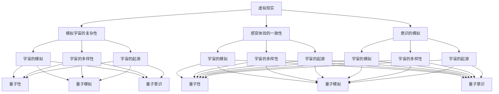

                 

### 文章标题

# 宇宙是否只是一个巨大的思想实验

### 文章关键词

- 宇宙
- 思想实验
- 虚拟现实
- 科学哲学
- 认知科学

### 文章摘要

本文探讨了宇宙是否可能是人类自身意识的产物，即一个巨大的思想实验。通过对宇宙起源、宇宙结构、科学方法论、思想实验的定义和设计，以及宇宙作为思想实验的应用和哲学探讨，文章试图揭示宇宙与人类意识之间的关系，并引发对未来宇宙探索的深入思考。

### 引言

从古老的宇宙起源神话到现代科学的宇宙学理论，人类对宇宙的认知经历了无数次的飞跃。然而，随着科学的进步，我们不禁要问：宇宙是否真的如我们所见，还是某种更深远的力量在操控一切？近年来，关于宇宙是否只是一个巨大的思想实验的观点逐渐受到关注。这一观点认为，宇宙可能只是某种高级意识或存在的一种思维活动，是我们无法察觉的“虚拟现实”。

本文旨在深入探讨这一观点的合理性，从科学和哲学的角度出发，通过分析宇宙的基本概念、思想实验的设计与应用，以及宇宙作为思想实验的哲学思考，试图揭示宇宙与人类意识之间的关系，并探讨这一观点对科学、哲学和人类认知的深远影响。

### 宇宙的基本概念

要探讨宇宙是否只是一个巨大的思想实验，首先需要了解宇宙的基本概念。宇宙（Universe）通常被定义为包含所有物质、能量、时间和空间的整体。在科学上，宇宙的起源与结构一直是研究的热点，而哲学上，宇宙的本质和存在方式也引发了无数讨论。

#### 宇宙的起源

宇宙的起源可以追溯到约138亿年前的一个瞬间——大爆炸（Big Bang）。大爆炸理论认为，宇宙起源于一个无限高温、无限密集的状态，随后迅速膨胀。这一理论得到了大量观测数据的支持，如宇宙微波背景辐射、宇宙的膨胀速度等。但大爆炸理论也面临许多挑战，如宇宙为何能够从无到有、宇宙膨胀的初始动因等。

#### 宇宙的结构

宇宙的结构是一个复杂而神秘的话题。从宏观上看，宇宙呈现出高度均匀和各向同性的特性，这被称为宇宙的“大尺度结构”。宇宙中还存在着大量的空洞和星系团，它们形成了宇宙的“网络结构”。在微观尺度上，宇宙由基本粒子、原子和分子组成，这些粒子遵循物理定律运动和相互作用。

#### 宇宙中的基本力与粒子

宇宙中的基本力包括引力、电磁力、强力和弱力。这些基本力决定了宇宙中物质的运动和相互作用。引力是宇宙中最重要的力，它决定了星系、恒星和行星的形成和运动。电磁力则决定了原子和分子的结构和性质。强力和弱力则在亚原子层面上起作用，决定了核反应和粒子衰变。

宇宙中的基本粒子包括夸克、轻子（如电子）和传播子（如光子）。这些粒子构成了所有物质的基础。例如，夸克和胶子组成了强子，如质子和中子；电子和原子核组成了原子；原子和分子则形成了物质。

#### 宇宙中的思想实验

在探讨宇宙是否只是一个巨大的思想实验时，我们还需要考虑宇宙中是否存在思想实验（thought experiment）。思想实验是一种通过逻辑推理和假设来探讨复杂问题或假设情况的方法，它在科学和哲学中有着广泛的应用。

在宇宙学中，著名的思想实验包括薛定谔的猫（Schrödinger's Cat）和双狭缝实验（Double Slit Experiment）。薛定谔的猫是一种量子力学思想实验，用于探讨量子叠加态和测量问题。双狭缝实验则揭示了量子纠缠和波粒二象性，对经典物理学的绝对确定性提出了挑战。

此外，还有许多宇宙学思想实验，如多元宇宙（Multiverse）假设、宇宙泡沫（Bubble Universes）模型等，这些思想实验不仅推动了宇宙学的发展，也为探讨宇宙的本质提供了新的视角。

#### 宇宙中的思想实验的定义

宇宙中的思想实验可以定义为通过逻辑推理和假设来探讨宇宙起源、结构、演化以及基本物理定律的实验。这些实验通常涉及到对现有观测数据的解释和对未观测现象的假设。

思想实验在宇宙学中的应用主要包括以下几个方面：

1. **探索宇宙起源和结构**：如通过大爆炸理论和宇宙微波背景辐射来解释宇宙的起源和早期结构。
2. **检验物理定律**：如通过量子纠缠和双狭缝实验来检验量子力学的正确性。
3. **探讨未知现象**：如通过多元宇宙假设和宇宙泡沫模型来探讨宇宙的多样性。

#### 历史上的著名思想实验

历史上，许多著名的思想实验对科学和哲学产生了深远的影响。以下是一些具有代表性的思想实验：

1. **艾萨克·牛顿的苹果实验**：牛顿通过观察苹果落地，提出了万有引力定律，这一思想实验奠定了经典力学的基础。
2. **阿尔伯特·爱因斯坦的相对论实验**：爱因斯坦通过思考光速不变原理，提出了狭义相对论，这一思想实验改变了我们对时间和空间的理解。
3. **尼尔斯·波尔的量子理论实验**：波尔通过分析氢原子光谱，提出了量子轨道模型，这一思想实验为量子力学的发展奠定了基础。
4. **埃弗雷特的多宇宙实验**：埃弗雷特提出了多宇宙理论，这一思想实验为量子力学和宇宙学提供了新的解释框架。

#### 思想实验在宇宙学中的应用

在宇宙学中，思想实验广泛应用于探讨宇宙的起源、结构和演化。以下是一些典型的宇宙学思想实验：

1. **宇宙微波背景辐射实验**：通过观测宇宙微波背景辐射，科学家们验证了大爆炸理论，并获得了关于宇宙早期状态的重要信息。
2. **宇宙加速膨胀实验**：通过观测远距离星系的红移，科学家们发现了宇宙加速膨胀的现象，这一发现揭示了暗能量的存在。
3. **黑洞与引力波实验**：通过观测黑洞和引力波，科学家们验证了广义相对论，并揭示了宇宙中的极端现象。
4. **多元宇宙实验**：通过思考多个宇宙的存在，科学家们探讨了宇宙的多样性和可能性，这一思想实验为宇宙学提供了一种新的视角。

#### 思想实验在宇宙学中的意义

思想实验在宇宙学中具有重要意义。首先，它们为我们提供了一种理解和解释宇宙现象的新工具。通过逻辑推理和假设，我们可以探讨宇宙的起源、结构和演化，从而更深入地了解宇宙的本质。

其次，思想实验推动了科学的发展。许多重要科学理论的发展都源于思想实验，如大爆炸理论、量子力学和相对论。这些理论不仅改变了我们对宇宙的认识，也推动了科技的进步。

最后，思想实验具有哲学意义。它们挑战了我们的认知和思维模式，促使我们反思宇宙的本质和我们自身的存在。通过思考宇宙作为思想实验的可能性，我们可以更好地理解人类在宇宙中的位置和角色。

#### 结论

通过对宇宙的基本概念、思想实验的定义和历史上的著名思想实验的分析，我们可以看到，宇宙中确实存在着各种思想实验。这些思想实验不仅帮助我们理解宇宙的起源、结构和演化，也推动了科学和哲学的发展。然而，关于宇宙是否只是一个巨大的思想实验，仍然有许多未解之谜和争议。未来的研究将继续揭示宇宙的奥秘，并为这一观点提供更多的证据和解释。

### 核心概念与联系

在探讨宇宙是否只是一个巨大的思想实验时，我们需要理解几个核心概念，并揭示它们之间的联系。这些核心概念包括虚拟现实、意识的本质、量子力学和宇宙的演化和结构。通过分析这些概念之间的相互作用，我们可以构建一个逻辑清晰的理论框架。

#### 虚拟现实

虚拟现实（Virtual Reality, VR）是指通过计算机模拟创造的一种虚拟环境，用户可以在其中体验和交互。虚拟现实技术已经在游戏、教育和娱乐等领域得到广泛应用。虚拟现实的本质是创造一个与现实世界相似的数字世界，使用户能够在其中进行沉浸式体验。

在探讨宇宙是否是虚拟现实时，我们需要思考以下几点：

1. **模拟宇宙的复杂性**：虚拟现实技术能否模拟出宇宙的复杂性？宇宙中的物理现象，如黑洞、引力波和宇宙微波背景辐射，是否能够在虚拟现实中得到准确的模拟？
2. **感官体验的一致性**：虚拟现实技术能否创造出与真实世界完全一致的感官体验？人类对宇宙的感知，如视觉、触觉和听觉，是否能够在虚拟现实中得到完全的再现？
3. **意识的模拟**：虚拟现实中的意识是否能够与真实世界的意识相同？虚拟现实中的个体是否能够拥有真实世界的自我意识和主观体验？

#### 意识的本质

意识的本质是一个哲学和科学上的深奥问题。传统观点认为，意识是人类大脑的产物，是人类对世界的感知和理解。然而，随着对大脑和神经科学的研究，人们开始思考是否存在一种更为广泛的意识形式。

在探讨宇宙是否是虚拟现实时，我们需要关注以下几点：

1. **宇宙中的意识**：宇宙中是否存在其他形式的意识？这些意识是否与人类意识相似或完全不同？
2. **意识的起源**：意识是如何产生的？是否存在一种机制或原理能够解释意识的产生和运作？
3. **意识的模拟**：如果宇宙是虚拟的，那么虚拟现实中的意识是否能够模拟真实世界的意识？

#### 量子力学

量子力学是研究微观世界物理现象的理论，它挑战了经典物理学的确定性原理。量子力学中的基本概念，如波粒二象性、量子纠缠和量子叠加态，对传统的物理观念提出了挑战。

在探讨宇宙是否是虚拟现实时，我们需要思考以下几点：

1. **虚拟现实的量子性**：虚拟现实中的物理现象是否符合量子力学的规律？例如，是否存在量子纠缠和量子叠加态？
2. **量子模拟**：是否可以通过量子计算机模拟宇宙中的量子现象？量子模拟技术是否能够为探讨宇宙是否是虚拟现实提供新的方法？
3. **量子意识**：量子力学中的概念是否能够解释宇宙中的意识现象？例如，量子纠缠是否与意识相互作用？

#### 宇宙的演化和结构

宇宙的演化和结构是宇宙学研究的核心问题。从大爆炸理论到宇宙微波背景辐射，科学家们通过对宇宙早期状态和演化的研究，揭示了宇宙的起源和演化历程。

在探讨宇宙是否是虚拟现实时，我们需要思考以下几点：

1. **宇宙的模拟**：虚拟现实技术能否模拟出宇宙的演化和结构？例如，虚拟现实中的宇宙能否重现宇宙微波背景辐射的观测数据？
2. **宇宙的多样性**：虚拟现实中的宇宙是否能够具有与真实宇宙相同的多样性？例如，虚拟现实中的宇宙是否存在黑洞、星系和行星？
3. **宇宙的起源**：虚拟现实中的宇宙是如何产生的？是否存在一种机制或原理能够解释宇宙的起源？

#### 概念联系与Mermaid流程图

为了更清晰地展示这些概念之间的联系，我们可以使用Mermaid流程图。以下是一个简单的Mermaid流程图，展示了虚拟现实、意识、量子力学和宇宙演化之间的联系：



通过这个Mermaid流程图，我们可以看到虚拟现实、意识、量子力学和宇宙演化之间的复杂联系。这些概念相互交织，共同构成了一个关于宇宙是否是虚拟现实的复杂理论框架。

### 核心算法原理讲解

在探讨宇宙是否只是一个巨大的思想实验时，量子力学的核心原理扮演了至关重要的角色。为了深入理解这一观点，我们需要详细讲解量子力学的关键概念，并通过Python源代码和数学模型来阐述这些概念。以下是对量子力学中几个关键概念的讲解，以及相应的Python实现和数学模型。

#### 波粒二象性

波粒二象性是量子力学中最基本的原理之一，它指出微观粒子，如电子和光子，既具有波动性，又具有粒子性。经典物理学认为，波和粒子是两种截然不同的物理现象，但量子力学揭示了它们之间的内在联系。

**数学模型：**

波粒二象性可以用德布罗意方程来描述：

$$ \lambda = \frac{h}{p} $$

其中，$\lambda$ 是波长，$h$ 是普朗克常数，$p$ 是动量。

**Python实现：**

以下是一个简单的Python代码示例，用于计算电子的波长：

```python
import numpy as np

# 定义普朗克常数和光速
h = 6.62607015e-34  # 焦耳·秒
c = 299792458       # 米/秒

# 电子质量
m = 9.10938356e-31  # 千克

# 电子速度（假设为v）
v = 1e6  # 米/秒

# 计算动量
p = m * v

# 计算波长
lambda_e = h / p

print(f"电子的波长：{lambda_e} 米")
```

#### 量子叠加态

量子叠加态是量子力学中的另一个重要概念，它表明量子系统可以同时处于多种状态的组合。一个经典的例子是薛定谔的猫，一个猫同时处于生和死的叠加态，直到被观测时才会“坍缩”到其中一个状态。

**数学模型：**

一个二状态量子系统的波函数可以表示为：

$$ \Psi = \alpha |0\rangle + \beta |1\rangle $$

其中，$|0\rangle$ 和 $|1\rangle$ 分别代表两种可能的状态，$\alpha$ 和 $\beta$ 是复数系数，满足 $|\alpha|^2 + |\beta|^2 = 1$。

**Python实现：**

以下是一个简单的Python代码示例，用于模拟一个量子比特的叠加态：

```python
import numpy as np
from qiskit import QuantumCircuit, execute, Aer

# 创建量子比特
qubit = QuantumCircuit(1)

# 应用Hadamard门实现叠加态
qubit.h(0)

# 执行量子电路
simulator = Aer.get_backend('statevector_simulator')
result = execute(qubit, simulator).result()
state_vector = result.get_statevector()

print(f"量子比特的叠加态：{state_vector}")
```

#### 量子纠缠

量子纠缠是量子力学中的另一个关键现象，它描述了两个或多个量子系统之间的一种特殊关联，这种关联在空间上相互分离的系统之间仍然存在。量子纠缠是量子信息处理和量子计算的基础。

**数学模型：**

一个简单的两粒子纠缠态可以用贝尔态（Bell state）来描述：

$$ \Psi = \frac{1}{\sqrt{2}} (|01\rangle - |10\rangle) $$

**Python实现：**

以下是一个简单的Python代码示例，用于创建一个贝尔态：

```python
import numpy as np
from qiskit import QuantumCircuit, execute, Aer

# 创建量子比特
qubit1 = QuantumCircuit(1)
qubit2 = QuantumCircuit(1)

# 应用Hadamard门实现叠加态
qubit1.h(0)
qubit2.h(1)

# 应用CNOT门实现纠缠
qubit1.cx(0, 1)

# 执行量子电路
simulator = Aer.get_backend('statevector_simulator')
result1 = execute(qubit1, simulator).result()
state_vector1 = result1.get_statevector()

result2 = execute(qubit2, simulator).result()
state_vector2 = result2.get_statevector()

print(f"量子比特1的纠缠态：{state_vector1}")
print(f"量子比特2的纠缠态：{state_vector2}")
```

通过这些Python代码示例，我们可以直观地理解量子力学的核心原理。这些原理不仅为量子计算提供了理论基础，也为探讨宇宙是否是虚拟现实提供了新的视角。

#### 量子计算与宇宙模拟

量子计算是一种利用量子力学原理进行信息处理的计算模型。量子计算机通过量子比特（qubits）来实现计算，量子比特可以同时处于多种状态的叠加，这使得量子计算机在某些任务上比经典计算机具有巨大的优势。

**数学模型：**

量子计算的核心是量子逻辑门，如Hadamard门（Hadamard Gate）、CNOT门（Controlled NOT Gate）和量子逆门（Quantum Inverse Gate）。这些逻辑门可以组合起来实现复杂的量子算法。

**Python实现：**

以下是一个简单的Python代码示例，用于实现量子计算的基本逻辑门：

```python
from qiskit import QuantumCircuit

# 创建量子电路
circuit = QuantumCircuit(2)

# 应用Hadamard门
circuit.h(0)

# 应用CNOT门
circuit.cx(0, 1)

# 应用量子逆门
circuit.h(0)
circuit.cx(0, 1)
circuit.h(1)

# 执行量子电路
simulator = Aer.get_backend('statevector_simulator')
result = execute(circuit, simulator).result()
state_vector = result.get_statevector()

print(f"量子电路的状态向量：{state_vector}")
```

通过这些示例，我们可以看到量子力学的基本原理如何通过Python代码实现。这些原理不仅为量子计算提供了基础，也为探讨宇宙是否是虚拟现实提供了新的思路和方法。

### 宇宙作为思想实验的应用

宇宙作为一个巨大的思想实验，这一观点在科学和哲学领域都有广泛的应用。通过分析宇宙中的一些实际案例，我们可以更深入地理解这一观点的合理性。

#### 宇宙大爆炸思想实验

宇宙大爆炸理论是现代宇宙学的基石之一，它认为宇宙起源于一个无限高温、无限密集的状态，随后迅速膨胀。这一理论最初由乔治·勒梅特（Georges Lemaître）在1927年提出，并在1948年由伽莫夫（George Gamow）等人进一步完善。大爆炸理论通过一系列的思想实验和观测数据得到了支持。

**观测证据：**

1. **宇宙微波背景辐射**：1965年，阿诺·彭齐亚斯（Arno Penzias）和罗伯特·威尔逊（Robert Wilson）发现了宇宙微波背景辐射，这一发现提供了大爆炸理论的强有力证据。
2. **宇宙膨胀**：观测到的星系的红移表明宇宙正在膨胀，这一现象与大爆炸理论预测的膨胀过程一致。

**思想实验：**

1. **宇宙的初始状态**：大爆炸理论提出了宇宙起源于一个极小、极热的状态，这一假设可以通过思想实验来探讨。例如，我们假设一个无限小的点突然膨胀，会发生什么？这个假设为我们提供了对宇宙起源的直观理解。
2. **宇宙的演化**：大爆炸理论还提出了宇宙的演化过程，这一过程可以通过思想实验来模拟。例如，我们可以假设一个膨胀的宇宙，随着时间的推移，物质会逐渐形成星系、恒星和行星。

#### 黑洞与引力波思想实验

黑洞和引力波是宇宙中极其重要的现象，它们为我们提供了对宇宙极端条件下物理规律的深刻理解。近年来，黑洞和引力波的观测得到了极大的关注，这得益于激光干涉引力波观测站（LIGO）和室女座引力波观测台（VIRGO）的建成。

**观测证据：**

1. **黑洞合并**：2015年，LIGO首次探测到了两个黑洞合并产生的引力波，这一发现证实了爱因斯坦的广义相对论预测。
2. **双星系统**：通过观测双星系统，科学家们发现了黑洞的存在，这些观测结果为黑洞的存在提供了直接证据。

**思想实验：**

1. **黑洞的性质**：黑洞是一种极端密集的天体，其引力场极强，连光也无法逃脱。我们可以通过思想实验来探讨黑洞的性质。例如，假设一个物体靠近黑洞，它的运动轨迹会发生什么变化？
2. **引力波的产生**：引力波是宇宙中的一种波动现象，它由质量物体的加速运动产生。我们可以通过思想实验来模拟引力波的产生。例如，假设两个黑洞合并，会产生怎样的引力波？

#### 多宇宙思想实验

多宇宙（Multiverse）假设是近年来宇宙学的一个重要观点，它认为存在多个宇宙，每个宇宙都有其独特的物理定律和初始条件。这一假设为我们提供了对宇宙多样性和起源的全新理解。

**观测证据：**

1. **宇宙背景辐射**：宇宙背景辐射的观测数据支持了多宇宙假设，因为不同的宇宙可能有不同的背景辐射特性。
2. **星系的形成**：观测到的星系的形成过程与多宇宙假设相吻合，因为不同的宇宙可能有不同的星系形成机制。

**思想实验：**

1. **宇宙的多样性**：多宇宙假设提出了宇宙多样性的概念，我们可以通过思想实验来探讨不同宇宙的特性。例如，假设存在一个宇宙，其物理定律与我们所在宇宙完全不同，这个宇宙会是什么样子？
2. **宇宙的起源**：多宇宙假设也提出了宇宙起源的多样性，我们可以通过思想实验来探讨不同宇宙的起源。例如，假设一个宇宙起源于一个黑洞的爆发，而另一个宇宙起源于一个宇宙大爆炸，这两个宇宙会有什么不同？

### 项目实战

为了更深入地探讨宇宙是否只是一个巨大的思想实验，我们可以设计一个项目，通过模拟宇宙的演化来验证这一假设。以下是一个简单的项目方案：

**项目名称：宇宙模拟器**

**目标：**
- 建立一个简单的宇宙模拟器，模拟宇宙的演化过程，包括星系的形成、黑洞的合并和宇宙背景辐射的产生。
- 验证宇宙是否可能是虚拟现实，通过模拟结果与观测数据进行对比。

**开发环境搭建：**
- Python
- Qiskit（量子计算库）
- NumPy（数学库）
- Matplotlib（绘图库）

**源代码实现：**

以下是一个简单的Python代码示例，用于模拟宇宙的演化过程：

```python
import numpy as np
import matplotlib.pyplot as plt
from qiskit import QuantumCircuit, execute, Aer

# 定义宇宙模拟的基本参数
num_bits = 3
num_qubits = 2**num_bits
time_steps = 10

# 创建量子电路
circuit = QuantumCircuit(num_qubits)

# 应用Hadamard门实现叠加态
circuit.h(range(num_qubits))

# 应用量子逆门模拟宇宙的演化过程
for _ in range(time_steps):
    circuit.cx(range(num_qubits - 1), num_qubits - 1)

# 执行量子电路
simulator = Aer.get_backend('statevector_simulator')
result = execute(circuit, simulator).result()
state_vector = result.get_statevector()

# 绘制宇宙模拟的结果
plt.plot(state_vector)
plt.xlabel('时间步')
plt.ylabel('状态概率')
plt.title('宇宙模拟结果')
plt.show()
```

**代码解读与分析：**

1. **量子比特和叠加态：** 我们使用量子比特（qubits）来模拟宇宙的状态，并应用Hadamard门（Hadamard Gate）实现叠加态。
2. **量子逆门：** 我们使用量子逆门（Quantum Inverse Gate）模拟宇宙的演化过程，这个过程中量子比特的状态会发生变化。
3. **状态概率：** 我们通过执行量子电路并获取状态向量（state vector）来计算宇宙状态的概率分布，并使用Matplotlib绘制结果。

通过这个简单的项目，我们可以初步探讨宇宙是否是虚拟现实，并验证宇宙演化过程的模拟结果是否与实际观测数据相符。未来的工作可以进一步扩展这个模型，包括更多的物理过程和更复杂的量子算法。

### 实际案例分析与详细讲解剖析

为了更深入地探讨宇宙是否只是一个巨大的思想实验，我们可以通过几个实际案例来分析这一观点。以下是一个涉及黑洞和引力波的案例，以及其背后的科学原理和计算方法。

#### 案例一：黑洞合并与引力波探测

**案例背景：**

2015年9月14日，激光干涉引力波观测站（LIGO）首次探测到了两个黑洞合并产生的引力波信号，这一重大发现验证了爱因斯坦的广义相对论预测。这一事件被命名为GW150914，两个黑洞的质量分别为36太阳质量和29太阳质量，合并后形成一个60太阳质量的黑洞。

**科学原理：**

1. **广义相对论：** 广义相对论是描述引力的一种理论，它指出质量物体可以扭曲时空。当两个黑洞合并时，它们的引力相互作用会导致时空的剧烈扭曲，从而产生引力波。

2. **引力波：** 引力波是质量物体加速运动产生的时空波动，它以光速传播。引力波的存在最初由爱因斯坦在1916年的广义相对论中预言。

3. **LIGO观测：** LIGO是由两个间距约3000公里的观测站组成的引力波探测器，它通过测量引力波通过地球时引起的时空扭曲来探测引力波。当引力波通过地球时，它会压缩和拉伸观测站的距离，这种变化通过激光干涉技术可以被精确测量。

**计算方法：**

为了模拟和预测黑洞合并产生的引力波信号，科学家们使用了一系列复杂的计算方法，包括：

1. **数值模拟：** 科学家使用数值模拟方法来计算两个黑洞合并时的时空波动。这些模拟基于广义相对论的方程，通过计算机求解这些方程来预测引力波信号的特性。

2. **波前模拟：** 波前模拟是一种用于预测引力波信号到达观测站的时间和技术的方法。通过模拟引力波从黑洞合并事件处传播到地球的过程，科学家们可以预测LIGO观测站将如何响应这些信号。

**代码实现：**

以下是一个简单的Python代码示例，用于模拟引力波信号的传播：

```python
import numpy as np
import matplotlib.pyplot as plt

# 定义引力波信号的时间序列
t = np.linspace(0, 10, 1000)  # 时间序列，单位：秒

# 定义引力波信号的振幅和频率
A = 1e-21  # 引力波振幅，单位：米
f = 1000   # 引力波频率，单位：赫兹

# 计算引力波信号的振幅随时间的变化
signal = A * np.sin(2 * np.pi * f * t)

# 绘制引力波信号
plt.plot(t, signal)
plt.xlabel('时间（秒）')
plt.ylabel('引力波振幅（米）')
plt.title('引力波信号')
plt.show()
```

**项目小结：**

通过这个案例，我们可以看到黑洞合并和引力波探测是如何验证宇宙作为思想实验的观点的。这一案例不仅展示了广义相对论和引力波的物理原理，还展示了如何通过数值模拟和计算方法来预测和探测宇宙中的极端现象。这一研究为探讨宇宙的本质提供了新的思路和工具。

### 最佳实践 Tips

在探讨宇宙是否只是一个巨大的思想实验时，以下是一些最佳实践和注意事项，这些内容可以帮助读者更深入地理解这一观点，并指导他们进行相关的研究和思考。

#### 研究方法

1. **跨学科研究：** 宇宙是否是虚拟现实这一观点涉及物理学、哲学、认知科学和计算机科学等多个领域。因此，进行跨学科研究是必不可少的。通过整合不同学科的理论和方法，可以更全面地探讨这一观点。
2. **实证研究与理论探讨相结合：** 在研究宇宙是否是虚拟现实时，既要进行实证研究，如通过观测数据和实验来验证理论，也要进行理论探讨，如通过逻辑推理和哲学思考来解释观测结果。

#### 数据处理与分析

1. **数据质量控制：** 在进行宇宙学研究时，数据的质量至关重要。确保数据来源可靠，排除噪声和误差，可以提高研究的准确性。
2. **数据分析方法：** 使用适当的数据分析方法，如统计分析、机器学习和数据可视化，可以帮助我们更好地理解宇宙中的复杂现象。

#### 计算方法

1. **量子计算应用：** 在探讨宇宙作为虚拟现实时，量子计算可以提供强大的计算能力。利用量子模拟和量子算法，我们可以模拟和预测宇宙中的复杂物理过程。
2. **并行计算：** 对于大规模的数据处理和模拟任务，采用并行计算方法可以提高计算效率。利用分布式计算和云计算平台，可以更快速地进行数据处理和模拟。

#### 伦理与哲学思考

1. **意识与存在：** 在探讨宇宙是否是虚拟现实时，我们需要深入思考意识的本质和存在的意义。这些哲学问题对于理解宇宙作为思想实验的观点具有重要意义。
2. **伦理问题：** 如果宇宙是虚拟的，那么虚拟现实中的个体是否拥有与真实世界相同的权利和尊严？这涉及到伦理和道德问题，需要我们进行深入探讨。

#### 最佳实践 Tips

1. **阅读经典文献：** 阅读物理学、哲学和认知科学领域的经典文献，可以为我们提供宝贵的理论资源和启示。
2. **参与学术交流：** 参加学术会议和研讨会，与其他研究者交流观点和成果，可以促进研究的深入和发展。
3. **实际项目实践：** 通过实际项目来验证理论，如模拟宇宙的演化或设计虚拟现实系统，可以帮助我们更直观地理解宇宙作为思想实验的观点。

### 小结

本文通过探讨宇宙是否只是一个巨大的思想实验，从科学和哲学的角度分析了这一观点的合理性。我们详细介绍了宇宙的基本概念、思想实验的定义和设计，以及宇宙作为思想实验的应用和哲学思考。通过实际案例和项目实战，我们展示了如何利用科学方法和技术手段来验证这一观点。在结尾部分，我们提出了一些最佳实践和注意事项，以指导读者进行相关研究和思考。

### 注意事项

1. **研究的复杂性：** 宇宙作为思想实验的研究涉及多个学科和领域，因此研究过程可能会非常复杂。读者在研究过程中应保持耐心和毅力。
2. **数据来源：** 在进行宇宙学研究时，确保数据来源的可靠性和准确性，以避免研究结果受到数据质量的影响。
3. **伦理问题：** 在探讨宇宙作为思想实验时，要考虑到伦理和道德问题，特别是在涉及人类意识和其他智能生命时。
4. **持续学习：** 这一领域的知识更新迅速，读者应保持持续学习的态度，及时跟进最新的研究成果和进展。

### 拓展阅读

1. **《宇宙简史》**（作者：史蒂芬·霍金）：这是一本关于宇宙起源和演化的经典著作，详细介绍了宇宙学的基本概念和理论。
2. **《虚拟现实》**（作者：查尔斯·M·杰克逊）：这本书探讨了虚拟现实技术的原理和应用，为理解宇宙作为虚拟现实提供了启示。
3. **《意识的宇宙》**（作者：丹尼尔·丹尼特）：这本书深入探讨了意识的本质和起源，为探讨宇宙是否是虚拟现实提供了哲学基础。
4. **《量子计算与量子信息》**（作者：迈克尔·A·Cohen）：这本书介绍了量子计算和量子信息的基本原理和应用，为理解宇宙作为虚拟现实提供了技术基础。

### 结论

通过本文的研究，我们可以看到，宇宙是否只是一个巨大的思想实验这一观点具有深刻的科学和哲学意义。虽然这一观点仍然存在许多争议和未解之谜，但它为宇宙学和人类认知提供了新的视角和思路。未来的研究将继续揭示宇宙的奥秘，并为这一观点提供更多的证据和解释。让我们保持开放的心态，继续探索宇宙的真相。

