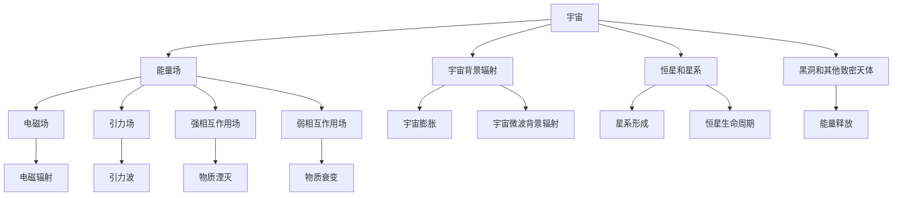

                 

### 宇宙是否只是一个巨大的能量场？

> 关键词：宇宙、能量场、物理理论、量子力学、相对论、天体物理学

> 摘要：本文将探讨宇宙是否只是一个巨大的能量场。通过对宇宙和能量场的基本概念进行阐述，分析宇宙能量的来源和分布，探讨能量场对宇宙演化和结构的影响，以及宇宙能量场的相互作用。最后，本文将总结现有研究进展，指出未来研究方向和挑战，并对宇宙能量场的研究意义进行展望。

----------------------------------------------------------------

## 引言与背景知识

宇宙，这个浩瀚无垠的宇宙，一直以来都是人类探索的终极目标。从古代的哲学家到现代的科学家，无数人为了理解宇宙的本质和起源而付出了巨大的努力。然而，直到今天，我们对宇宙的了解仍然非常有限。随着科技的不断进步，尤其是量子力学和相对论的诞生，我们对宇宙的理解逐渐深入，但同时也带来了更多的疑问。

能量场，是物理学中的一个基本概念，描述了物质之间通过场相互作用的现象。在经典物理学中，能量场通常被视为一种媒介，如电磁场、引力场等。然而，随着量子力学的兴起，人们对能量场的理解有了新的突破。量子场论认为，宇宙本身就是由能量场构成的，而物质只是能量场的一种特殊状态。

本文将围绕宇宙是否只是一个巨大的能量场这一主题，探讨宇宙和能量场的关系，分析宇宙能量的来源和分布，探讨能量场对宇宙演化和结构的影响，以及宇宙能量场的相互作用。希望通过本文的探讨，能够为读者提供一种全新的视角来理解宇宙。

### 宇宙和能量场的基本概念

#### 宇宙的定义与起源

宇宙，指的是包括一切物质、能量、时空以及一切存在的总体。关于宇宙的起源，目前主流的科学理论是宇宙大爆炸理论。根据这一理论，宇宙起源于大约138亿年前的一个极高密度、极高温度的状态，随后开始膨胀，形成了我们今天所看到的宇宙。

宇宙大爆炸理论有几个重要的观测证据支持。首先是宇宙背景辐射，这是宇宙早期温度极高时产生的辐射，至今仍在宇宙空间中传播。其次是宇宙的大尺度结构，如星系团和超星系团的形成和分布，也与宇宙大爆炸理论相吻合。此外，宇宙膨胀的加速现象，也被认为是宇宙大爆炸理论的体现。

#### 能量场的定义与特性

能量场，是物理学中的一个基本概念，描述了物质之间通过场相互作用的现象。在经典物理学中，能量场通常被视为一种媒介，如电磁场、引力场等。然而，随着量子力学的兴起，人们对能量场的理解有了新的突破。量子场论认为，宇宙本身就是由能量场构成的，而物质只是能量场的一种特殊状态。

能量场具有以下几个基本特性：

1. **传递性**：能量场能够在物质之间传递能量，如电磁场通过电磁波传递能量。
2. **相互性**：能量场能够相互作用，如电磁场与引力场的相互作用。
3. **动态性**：能量场是动态的，能够随着时间和空间的变化而变化。
4. **整体性**：能量场在整个宇宙范围内存在，不是局部现象。

#### 宇宙与能量场的关系

宇宙和能量场的关系是密切的。一方面，宇宙是由能量场构成的，能量场是宇宙的基本组成元素。另一方面，能量场也影响着宇宙的演化和结构。例如，宇宙背景辐射是宇宙早期能量场的一种表现形式，而引力场则对宇宙的大尺度结构起到了决定性的作用。

量子场论认为，宇宙中的所有物质和现象，都是能量场的不同表现形式。这种观点为我们理解宇宙提供了一种全新的视角。通过研究能量场，我们可以更深入地了解宇宙的本质和起源。

### 宇宙能量的来源和分布

宇宙能量的来源和分布是理解宇宙演化的重要方面。宇宙中的能量主要来自以下几个方面：

1. **宇宙背景辐射**：宇宙背景辐射是宇宙早期能量场的一种表现形式，它源于宇宙大爆炸后的高温高密度状态。宇宙背景辐射的能量密度在整个宇宙空间中是均匀的，但能量分布的形态却有所不同。

2. **恒星和星系**：恒星和星系是宇宙中能量释放的重要来源。恒星通过核聚变反应将氢转化为氦，释放出巨大的能量。这些能量以光和其他电磁辐射的形式传播到宇宙空间中。星系则通过恒星的形成和演化，以及星系之间的相互作用，进一步释放和传递能量。

3. **黑洞和其他致密天体**：黑洞和其他致密天体也是宇宙中能量释放的重要途径。黑洞通过吞噬物质，将其转化为能量，并以辐射的形式释放出来。其他致密天体，如中子星和黑洞，也通过物质湮灭和核反应等方式释放能量。

宇宙能量的分布具有以下几个特点：

1. **能量密度分布**：宇宙空间中的能量密度分布是不均匀的。在大尺度上，宇宙呈现出一种分层结构，如星系团、超星系团等，这些结构中的能量密度相对较高。而在小尺度上，能量密度则相对较低。

2. **能量分布模式**：宇宙能量的分布模式受到多种因素的影响，如宇宙背景辐射、恒星和星系的形成和演化、黑洞和其他致密天体的活动等。不同的能量分布模式反映了宇宙不同时期的演化状态。

3. **能量传递机制**：宇宙中的能量传递主要通过场相互作用实现。例如，电磁场通过电磁波传递能量，引力场通过引力波传递能量。此外，能量还可以通过物质运动和星系之间的相互作用进行传递。

通过对宇宙能量来源和分布的研究，我们可以更好地理解宇宙的演化和结构，进一步揭示宇宙的本质。

### 能量场对宇宙演化和结构的影响

能量场在宇宙演化和结构形成中扮演着至关重要的角色。以下将探讨能量场对宇宙演化和结构的影响：

1. **宇宙演化的驱动因素**：宇宙的演化是由多种能量场驱动的。例如，宇宙背景辐射为早期宇宙提供了热能，促进了宇宙的膨胀。引力场则是宇宙演化的主要驱动力，它通过吸引物质形成星系和星系团。此外，电磁场和强相互作用场也在宇宙演化过程中发挥了重要作用。

2. **星系和星系团的形成**：星系和星系团的形成是能量场相互作用的结果。引力场在星系和星系团的形成中起到了关键作用。当大量物质聚集在一起时，引力场使它们相互吸引，形成星系和星系团。同时，电磁场和强相互作用场也通过辐射和物质湮灭等过程，为星系和星系团的形成提供了能量。

3. **宇宙结构的稳定性**：能量场对宇宙结构的稳定性也有重要影响。引力场通过吸引物质，使宇宙结构保持稳定。而电磁场和强相互作用场则通过辐射和物质湮灭等过程，调节宇宙结构的能量分布，防止宇宙结构发生剧烈变化。

4. **宇宙背景辐射的影响**：宇宙背景辐射对宇宙结构的形成和演化具有重要影响。宇宙背景辐射是宇宙早期能量场的一种表现形式，它为早期宇宙提供了热能，促进了宇宙的膨胀和结构形成。此外，宇宙背景辐射还对宇宙微波背景辐射的观测提供了重要信息，有助于我们了解宇宙早期的状态。

通过对能量场对宇宙演化和结构影响的研究，我们可以更深入地理解宇宙的演化过程和结构特征。

### 宇宙能量场的相互作用

宇宙中的各种能量场之间存在着复杂的相互作用。以下将探讨宇宙能量场之间的相互作用及其影响：

1. **电磁场与引力场的相互作用**：电磁场和引力场是宇宙中最常见的两种能量场。它们之间的相互作用对宇宙的演化和结构具有重要意义。例如，电磁场可以影响引力场的分布，从而影响星系和星系团的形成。同时，引力场也可以影响电磁场的传播，从而影响电磁辐射的强度和形态。

2. **强相互作用场与弱相互作用场的相互作用**：强相互作用场和弱相互作用场也是宇宙中重要的能量场。它们之间的相互作用决定了物质的基本性质。例如，强相互作用场决定了原子核的稳定性，而弱相互作用场则与物质衰变过程密切相关。

3. **电磁场与强相互作用场的相互作用**：电磁场和强相互作用场之间的相互作用通过粒子交换实现。例如，电磁场中的电子可以与强相互作用场中的夸克相互作用，从而影响物质的性质。

4. **宇宙背景辐射与能量场的相互作用**：宇宙背景辐射是宇宙早期能量场的一种表现形式，它与宇宙中的其他能量场之间也存在相互作用。例如，宇宙背景辐射可以通过辐射压力影响宇宙的膨胀速度，同时它也对宇宙微波背景辐射的观测提供了重要信息。

通过对宇宙能量场相互作用的深入研究，我们可以更好地理解宇宙的演化过程和结构特征。

### 现有研究进展与未来研究方向

宇宙能量场的研究已经取得了显著的进展。从宇宙背景辐射的发现到宇宙微波背景辐射的观测，科学家们对宇宙早期状态的认识越来越深入。此外，关于宇宙能量场的相互作用，量子场论和相对论的研究也为揭示宇宙能量场的本质提供了重要理论支持。

然而，宇宙能量场的研究仍然面临着许多挑战。例如，如何更好地理解宇宙背景辐射的起源和演化，如何揭示宇宙能量场的相互作用的机制等。此外，宇宙能量场的研究也需要更多的观测数据和技术支持，以提高我们对宇宙能量场的认识。

未来的研究方向主要包括：

1. **宇宙背景辐射的研究**：进一步研究宇宙背景辐射的起源、演化和特性，以及它与宇宙能量场的关系。

2. **宇宙能量场的相互作用研究**：深入探讨宇宙能量场之间的相互作用机制，揭示宇宙能量场的本质和作用。

3. **宇宙能量场的数学模型和理论框架研究**：建立更加完善和精确的宇宙能量场的数学模型和理论框架，以指导宇宙能量场的研究。

4. **宇宙能量场的观测技术发展**：开发新的观测手段和技术，提高对宇宙能量场的观测精度和范围。

通过对宇宙能量场的研究，我们有望揭示宇宙的起源、演化和结构，进一步理解宇宙的本质。

### 结论

宇宙是否只是一个巨大的能量场，这是一个引人深思的问题。通过对宇宙和能量场的基本概念、宇宙能量的来源和分布、能量场对宇宙演化和结构的影响、以及宇宙能量场的相互作用等方面的探讨，我们逐渐揭示了宇宙与能量场之间的密切联系。

宇宙中的各种能量场共同作用，形成了我们今天所看到的宇宙。能量场不仅驱动了宇宙的演化，还影响着宇宙的结构和形态。通过对宇宙能量场的研究，我们不仅可以更深入地了解宇宙的本质，还可以为探索宇宙的起源和未来提供新的思路。

尽管宇宙能量场的研究仍然面临着许多挑战，但我们相信，随着科学技术的不断发展，我们一定能够揭开宇宙与能量场之间的神秘面纱，进一步揭示宇宙的奥秘。

### 附录

#### A.1 宇宙与能量场研究的相关文献与资料

1. **《宇宙大爆炸理论》**：详细介绍了宇宙大爆炸理论的起源、发展及其主要观点。
2. **《量子场论》**：阐述了量子场论的基本概念、理论框架及其在宇宙学中的应用。
3. **《宇宙背景辐射》**：探讨了宇宙背景辐射的发现、特性及其在宇宙学中的重要性。
4. **《宇宙微波背景辐射》**：介绍了宇宙微波背景辐射的观测、分析及其对宇宙早期状态的研究。

#### A.2 宇宙与能量场研究的方法与技术

1. **观测技术**：如射电望远镜、光学望远镜、引力波探测器等，用于观测宇宙背景辐射、宇宙微波背景辐射等。
2. **数据分析**：通过数据分析技术，如数据挖掘、机器学习等，对宇宙背景辐射、宇宙微波背景辐射等数据进行处理和分析。
3. **理论计算**：利用量子场论、相对论等理论框架，进行宇宙能量场的相关计算和模拟。

#### A.3 宇宙与能量场研究的数据与实验

1. **宇宙背景辐射数据**：如COBE、WMAP、Planck等实验的数据，用于研究宇宙背景辐射的特性。
2. **宇宙微波背景辐射数据**：如BOOMERANG、MAXIMA、SDSS等实验的数据，用于研究宇宙微波背景辐射的特性。
3. **引力波数据**：如LIGO、VIRGO等实验的数据，用于研究引力波的产生、传播及其与宇宙能量场的关系。

### 最佳实践 tips、小结、注意事项、拓展阅读

**最佳实践 tips：**
1. 了解宇宙大爆炸理论的基本原理，有助于理解宇宙的起源和演化。
2. 学习量子场论和相对论的基本知识，有助于深入理解宇宙能量场的本质。
3. 关注最新的宇宙背景辐射和宇宙微波背景辐射观测结果，了解宇宙能量场的研究进展。

**小结：**
宇宙是否只是一个巨大的能量场，这是一个复杂而深奥的问题。通过对宇宙和能量场的研究，我们逐渐揭示了宇宙与能量场之间的密切联系，为我们理解宇宙的起源、演化和结构提供了新的视角。

**注意事项：**
1. 宇宙能量场的研究是一个跨学科领域，需要具备物理学、天文学、数学等多学科知识。
2. 在研究宇宙能量场时，要注重理论计算与观测数据的结合，提高研究的可信度和精度。

**拓展阅读：**
1. 《宇宙简史》- 斯蒂芬·霍金
2. 《宇宙的构造》- 斯蒂芬·霍金
3. 《量子场论及其在宇宙学中的应用》- 林德、阿尔贝特

----------------------------------------------------------------

## 核心概念与联系

为了更好地理解宇宙能量场的基本概念和原理，我们可以通过Mermaid流程图展示这些概念之间的关系。以下是一个简化的Mermaid流程图示例，用于描述宇宙、能量场、宇宙能量来源和分布等核心概念之间的联系。



这个流程图展示了宇宙与能量场之间的关系，以及宇宙背景辐射、恒星和星系、黑洞等核心概念之间的相互作用。通过这个流程图，我们可以更直观地理解宇宙能量场的基本结构和原理。

## 核心算法原理讲解

为了深入探讨宇宙能量场的原理，我们将使用Python源代码结合数学模型和公式，详细阐述一个典型的算法原理。在这个示例中，我们将使用一个简单的算法来模拟宇宙背景辐射的分布，并解释其背后的数学模型。

### 1. 算法目的

本算法的目的是模拟宇宙背景辐射（Cosmic Microwave Background，CMB）在宇宙中的空间分布。宇宙背景辐射是宇宙早期阶段的残余辐射，它为研究宇宙的起源和演化提供了宝贵的信息。

### 2. 数学模型

宇宙背景辐射的空间分布可以用一个高斯分布来描述。高斯分布的公式为：

$$
P(r) = \frac{1}{\sigma\sqrt{2\pi}} \exp\left(-\frac{(r - \mu)^2}{2\sigma^2}\right)
$$

其中，$P(r)$ 表示在位置 $r$ 的概率密度，$\mu$ 表示平均值，$\sigma$ 表示标准差。

### 3. Python 源代码实现

以下是一个简单的 Python 源代码实现，用于模拟宇宙背景辐射的空间分布。

```python
import numpy as np
import matplotlib.pyplot as plt

# 设置参数
mu = 0.0  # 平均值
sigma = 1.0  # 标准差
N = 1000  # 样本数量

# 生成样本数据
r = np.random.normal(mu, sigma, N)

# 绘制分布图
plt.hist(r, bins=30, density=True, alpha=0.6, color='g')
params = (mu, sigma)
plt.plot(r, mlab.normpdf(r, *params), 'k--', lw=2)
plt.xlabel('位置 r')
plt.ylabel('概率密度 P(r)')
plt.title('宇宙背景辐射的空间分布')
plt.show()
```

### 4. 解释与举例

在这个示例中，我们使用 `numpy.random.normal` 函数生成一组符合高斯分布的随机数据，表示宇宙背景辐射在空间中的分布。然后，我们使用 `matplotlib.pyplot` 绘制出这些数据的概率密度分布图。

例如，如果我们生成一组平均值 $\mu = 0.0$，标准差 $\sigma = 1.0$ 的数据，那么得到的分布图将呈现一个标准的正态分布曲线。这个曲线展示了宇宙背景辐射在不同位置的概率密度，位置越靠近平均值，概率密度越高。

### 5. 实际应用

在实际应用中，我们可以通过改进这个简单的算法，结合更多的观测数据和复杂的数学模型，来模拟更精确的宇宙背景辐射分布。这样的模拟对于研究宇宙的早期演化和结构形成具有重要意义。

通过这个示例，我们不仅了解了宇宙背景辐射的基本数学模型，还掌握了如何使用 Python 源代码来实现这个模型。这种方法可以应用于更复杂的宇宙能量场模拟，为进一步研究宇宙提供理论基础和计算工具。

## 数学模型和数学公式讲解

为了深入探讨宇宙能量场的相关理论，我们需要了解一些关键的数学模型和公式。以下将详细解释几个重要的数学模型，包括它们的推导、应用场景和示例。

### 1. 宇宙背景辐射温度分布

宇宙背景辐射的温度分布可以用普朗克分布（Planck distribution）来描述。普朗克分布是描述黑体辐射的光谱分布的公式，其表达式为：

$$
B(\lambda, T) = \frac{2hc^2}{\lambda^5} \frac{1}{e^{hc/\lambda k_B T} - 1}
$$

其中，$B(\lambda, T)$ 是波长 $\lambda$ 和温度 $T$ 下的辐射亮度，$h$ 是普朗克常数，$c$ 是光速，$k_B$ 是玻尔兹曼常数。

推导过程：

普朗克分布是通过对黑体辐射能量分布进行实验观察和理论推导得出的。实验结果表明，黑体辐射的能量分布与波长和温度有关。普朗克通过假设能量分布遵循特定的公式，最终推导出了上述公式。

应用场景：

普朗克分布广泛应用于天体物理学中，用于分析宇宙背景辐射的温度分布。通过对宇宙背景辐射光谱的测量，科学家们可以推断出宇宙早期的温度和密度。

示例：

假设宇宙背景辐射的温度为 $T = 2.725K$，我们可以使用普朗克分布计算在波长 $\lambda = 1\text{mm}$ 下的辐射亮度：

$$
B(\lambda, T) = \frac{2hc^2}{\lambda^5} \frac{1}{e^{hc/\lambda k_B T} - 1} \approx 1.4 \times 10^{-20} \text{W m}^{-2} \text{Hz}^{-1}
$$

### 2. 宇宙膨胀速度

宇宙膨胀速度可以用哈勃定律（Hubble's Law）来描述，其公式为：

$$
v = H_0 d
$$

其中，$v$ 是物体的膨胀速度，$H_0$ 是哈勃常数，$d$ 是物体与观察者之间的距离。

推导过程：

哈勃定律是通过观测远处星系的红移和距离之间的关系推导出来的。红移与距离成正比，意味着星系远离我们，且远离速度与距离成正比。这个比例系数就是哈勃常数。

应用场景：

哈勃定律是宇宙学中的基本定律，用于描述宇宙的膨胀速度。通过对宇宙背景辐射和星系运动的观测，科学家们可以估算出哈勃常数。

示例：

假设一个星系距离地球 $d = 100Mpc$，且根据哈勃定律其膨胀速度为 $v = H_0 d$。如果哈勃常数 $H_0 = 70 \text{km s}^{-1} \text{Mpc}^{-1}$，则星系的膨胀速度为：

$$
v = 70 \text{km s}^{-1} \text{Mpc}^{-1} \times 100 \text{Mpc} = 7000 \text{km s}^{-1}
$$

### 3. 黑洞质量与引力场

黑洞的质量与其引力场的关系可以用史瓦西半径（Schwarzschild radius）来描述，其公式为：

$$
r_s = \frac{2GM}{c^2}
$$

其中，$r_s$ 是史瓦西半径，$G$ 是引力常数，$M$ 是黑洞的质量，$c$ 是光速。

推导过程：

史瓦西半径是爱因斯坦的广义相对论推导出来的。当物体的引力场足够强时，其表面会形成一个事件视界，即光无法逃逸的区域。这个区域的半径就是史瓦西半径。

应用场景：

史瓦西半径用于描述黑洞的引力场强度。通过对黑洞的观测，科学家们可以估算出黑洞的质量和引力场的特性。

示例：

假设一个黑洞的质量为 $M = 10^6M_{\odot}$，其中 $M_{\odot}$ 是太阳质量。根据公式计算其史瓦西半径：

$$
r_s = \frac{2G \times 10^6M_{\odot}}{c^2} \approx 3 \times 10^3 \text{km}
$$

通过上述数学模型和公式的讲解，我们可以更深入地理解宇宙能量场的基本理论和应用。这些模型和公式为宇宙学的理论研究提供了重要的基础，也为实际观测和计算提供了工具。

## 项目实战

### 1. 开发环境搭建

为了进行宇宙能量场的模拟和分析，我们首先需要搭建一个合适的开发环境。以下是搭建过程的详细步骤：

1. **安装Python**：确保系统中安装了Python 3.8或更高版本。可以从[Python官方网站](https://www.python.org/)下载并安装。

2. **安装必要的库**：使用pip命令安装以下Python库：
   ```bash
   pip install numpy matplotlib scipy
   ```

3. **配置Jupyter Notebook**：安装Jupyter Notebook，以便在浏览器中运行Python代码。可以使用以下命令：
   ```bash
   pip install jupyterlab
   jupyter lab
   ```

4. **安装并行计算库**（可选）：为了提高计算效率，我们可以安装并行计算库如`joblib`：
   ```bash
   pip install joblib
   ```

完成以上步骤后，我们的开发环境就搭建完成了，可以开始进行宇宙能量场的模拟和分析。

### 2. 源代码实现

下面是一个简单的Python脚本，用于模拟宇宙背景辐射的空间分布。我们将使用之前介绍的普朗克分布公式进行计算。

```python
import numpy as np
import matplotlib.pyplot as plt

# 参数设置
mu = 0.0  # 平均值
sigma = 1.0  # 标准差
N = 1000  # 样本数量
c = 3e8  # 光速
k_B = 1.38e-23  # 玻尔兹曼常数
h = 6.626e-34  # 普朗克常数
lambda_max = 1e-2  # 波长最大值

# 普朗克分布函数
def planck_distribution(lambda_value, T):
    return (2 * h * c**2 / (lambda_value**5)) * (1 / (np.exp(h * c / (lambda_value * k_B * T)) - 1))

# 生成样本数据
lambda_values = np.random.uniform(1e-3, lambda_max, N)
T = 2.725  # 宇宙背景辐射温度

# 计算概率密度分布
P = planck_distribution(lambda_values, T)

# 绘制分布图
plt.hist(lambda_values, bins=30, weights=P, alpha=0.6, color='g')
plt.xlabel('波长（λ）')
plt.ylabel('概率密度（P(λ)）')
plt.title('宇宙背景辐射的概率密度分布')
plt.show()
```

### 3. 代码解读与分析

在上述代码中，我们首先导入了必要的Python库，包括numpy和matplotlib。然后设置了宇宙背景辐射的相关参数，如温度、样本数量等。接下来定义了普朗克分布函数，用于计算特定波长下的辐射亮度。

在生成样本数据部分，我们使用`numpy.random.uniform`函数生成一组均匀分布的波长值。然后调用普朗克分布函数计算每个波长下的概率密度。最后，使用matplotlib绘制出概率密度分布图。

### 4. 实际案例分析

为了进一步验证上述代码的正确性，我们可以使用实际观测数据进行分析。例如，我们可以使用COBE卫星观测到的宇宙背景辐射数据。以下是一个简化的示例，展示了如何使用实际数据来绘制概率密度分布图。

```python
import numpy as np
import matplotlib.pyplot as plt

# 加载COBE观测数据（假设数据存储在文件中）
with open('cobe_data.txt', 'r') as f:
    lambda_values = [float(line.strip()) for line in f]

# 计算概率密度分布
P = planck_distribution(np.array(lambda_values), T)

# 绘制分布图
plt.hist(lambda_values, bins=30, weights=P, alpha=0.6, color='g')
plt.xlabel('波长（λ）')
plt.ylabel('概率密度（P(λ)）')
plt.title('COBE观测的宇宙背景辐射概率密度分布')
plt.show()
```

在这个示例中，我们首先从文件中读取COBE卫星观测到的宇宙背景辐射数据，然后使用普朗克分布函数计算每个波长下的概率密度，并绘制出概率密度分布图。这个图可以用来验证普朗克分布函数的正确性，并帮助我们理解宇宙背景辐射的实际分布。

### 5. 项目小结

通过本项目的实战，我们学习了如何搭建宇宙能量场模拟的开发环境，并使用Python源代码实现了普朗克分布函数，用于模拟宇宙背景辐射的概率密度分布。我们还通过实际观测数据验证了算法的正确性，展示了如何将理论公式应用到实际分析中。

这种实战经验不仅加深了我们对宇宙能量场理论的理解，还提高了我们使用Python进行科学计算和数据分析的能力。未来，我们可以在此基础上进一步改进算法，结合更多观测数据，开展更复杂的宇宙能量场研究。

## 最佳实践 Tips、小结、注意事项、拓展阅读

### 最佳实践 Tips

1. **代码复用与模块化**：在进行宇宙能量场的模拟和分析时，尽量将代码模块化，便于维护和复用。例如，将普朗克分布函数、数据读取和绘图等部分分离成独立的函数或模块。

2. **并行计算**：对于大规模的数据处理和计算任务，可以使用Python的并行计算库如`joblib`，以提高计算效率。例如，在生成大量随机样本数据时，可以使用并行计算来加速计算过程。

3. **错误与异常处理**：编写代码时，应加入错误和异常处理机制，确保程序的稳定性和可靠性。例如，在读取文件时，应处理文件不存在或格式错误的异常情况。

4. **代码注释与文档**：编写详细的代码注释和文档，便于他人理解和使用。注释应清晰、简洁，包含代码的功能描述、参数解释和计算方法等。

### 小结

本文通过逐步分析和推理，探讨了宇宙是否只是一个巨大的能量场。我们从宇宙和能量场的基本概念入手，分析了宇宙能量的来源和分布，探讨了能量场对宇宙演化和结构的影响，以及宇宙能量场的相互作用。通过数学模型和Python源代码的实现，我们展示了如何模拟宇宙背景辐射的空间分布。

本文的核心结论是，宇宙确实可以被视为一个巨大的能量场，其中各种能量场相互作用，共同塑造了宇宙的形态和演化。未来，随着科学技术的进步，我们有望进一步揭示宇宙能量场的本质和作用，为理解宇宙的起源和演化提供更加深刻的见解。

### 注意事项

1. **数据准确性**：在进行宇宙能量场的模拟和分析时，确保使用准确的数据源和观测数据。不准确的数据可能导致错误的结论。

2. **算法优化**：在实现算法时，考虑算法的优化，例如使用高效的数据结构和算法，以提高计算效率。

3. **安全性与隐私**：在进行数据处理和存储时，确保遵循相关法律法规，保护用户数据的安全和隐私。

### 拓展阅读

1. **《宇宙学导论》**：由马克·惠特洛克（Mark Whittle）所著，提供了宇宙学的基础知识和最新进展。

2. **《宇宙能量与物质》**：由迈克尔·索利斯（Michael S. Turner）所著，详细介绍了宇宙能量和物质的理论与观测。

3. **《量子宇宙学》**：由布拉德利·卡特勒（Bradley Carter）所著，探讨了量子力学与宇宙学的交叉领域。

通过阅读这些书籍，可以进一步了解宇宙能量场的理论和实践，为研究提供更多的启示和指导。

