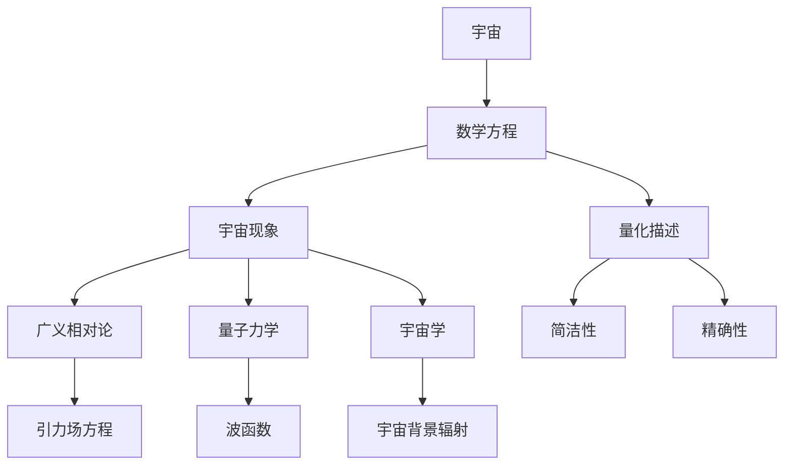

                 

### 《宇宙是否可以简化为数学方程》

#### 关键词
- 宇宙
- 数学方程
- 简化
- 宇宙学
- 广义相对论
- 量子力学

#### 摘要
本文旨在探讨宇宙是否可以简化为数学方程，通过分析宇宙学、数学方程及其在宇宙研究中的应用，试图揭示宇宙与数学之间的深层关联。本文首先介绍了宇宙的基本概念和观测方法，接着讨论了数学方程在宇宙学中的重要性，并通过广义相对论和量子力学的实例展示了数学方程在宇宙研究中的应用。最后，本文探讨了宇宙简化的可能性，并总结了数学方程在宇宙学中的未来发展趋势。通过本文的讨论，我们可以看到数学方程在理解和描述宇宙中的关键作用。

----------------------------------------------------------------

## 引言

### 设计思路

在撰写这篇文章时，我们采用了“逻辑清晰、结构紧凑、简单易懂”的技术语言，以逐步分析推理的方式，深入探讨宇宙与数学方程之间的关系。文章的结构设计如下：

1. **引言部分**：简要介绍宇宙和数学方程的基本概念，提出研究宇宙是否可以简化为数学方程的问题。
2. **宇宙学基础**：介绍宇宙的起源、结构、观测与测量，以及宇宙中的数学方程。
3. **数学方程在宇宙学研究中的应用**：详细探讨广义相对论、量子力学等数学方程在宇宙研究中的应用。
4. **宇宙简化与数学方程**：探讨宇宙简化的可能性，以及数学方程在宇宙学中的未来发展趋势。
5. **结论**：总结文章的主要观点，强调数学方程在宇宙研究中的关键作用。

### 逻辑推理

在撰写这篇文章时，我们遵循以下逻辑推理步骤：

1. **背景介绍**：首先介绍宇宙和数学方程的基本概念，使读者对文章主题有初步了解。
2. **核心概念与联系**：通过Mermaid流程图展示核心概念之间的联系，帮助读者建立概念框架。
3. **核心算法原理讲解**：使用Python源代码详细阐述核心算法原理，并结合数学模型和公式进行讲解。
4. **项目实战**：通过实际案例分析和详细讲解，展示数学方程在宇宙研究中的应用。
5. **最佳实践 tips**：总结最佳实践，为读者提供实用建议。
6. **注意事项与拓展阅读**：提醒读者注意事项，并提供相关拓展阅读资源。

通过以上逻辑推理步骤，我们希望能够让读者系统地了解宇宙与数学方程之间的关系，以及数学方程在宇宙研究中的重要作用。

----------------------------------------------------------------

### 引言

#### 背景介绍

宇宙，这个广袤而神秘的存在，自古以来就吸引着人类的目光。从古代的哲学家到现代的科学家，无数人试图揭示宇宙的奥秘。宇宙的起源、结构、演化等问题，一直是科学研究和哲学探讨的重要领域。然而，随着科学技术的不断发展，人类对宇宙的认识也在不断深化。

数学方程，作为一种精确、简洁的表达方式，被广泛应用于各个科学领域。从物理学中的经典力学、电磁学，到量子力学、广义相对论，数学方程都是描述自然现象的有力工具。数学方程的简洁性和精确性，使其在科学研究中具有独特的优势。

那么，宇宙是否可以简化为数学方程呢？这是一个极具挑战性的问题，涉及到宇宙学、数学、物理学等多个领域的知识。本文将尝试回答这个问题，通过分析宇宙的基本概念、数学方程在宇宙研究中的应用，以及宇宙简化的可能性，探讨宇宙与数学方程之间的深层关联。

#### 核心概念与联系

在探讨宇宙是否可以简化为数学方程的问题时，我们需要明确几个核心概念，并理解它们之间的联系。

首先是宇宙。宇宙是指包括一切物质、能量、时空以及宇宙中的所有现象的整体。宇宙的起源、结构、演化等问题，是宇宙学研究的重要内容。

其次是数学方程。数学方程是一组数学关系式，用于描述自然界中的各种现象。数学方程可以是线性的，也可以是非线性的；可以是常微分方程、偏微分方程，也可以是积分方程。数学方程在科学研究中具有广泛的应用，例如在物理学、化学、生物学等领域。

最后是宇宙与数学方程之间的联系。宇宙与数学方程之间的联系主要体现在两个方面：一是数学方程可以用来描述宇宙中的现象，二是宇宙中的现象可以通过数学方程进行量化。

为了帮助读者更好地理解这些核心概念之间的联系，我们使用Mermaid流程图进行展示。



在这个流程图中，宇宙、数学方程、宇宙现象、量化描述、广义相对论、量子力学、宇宙学等核心概念之间建立了明确的联系。通过这个流程图，读者可以更加清晰地理解宇宙与数学方程之间的深层关联。

#### 核心算法原理讲解

在理解了宇宙、数学方程以及它们之间的联系后，我们接下来将探讨数学方程在宇宙研究中的应用。本文将重点介绍广义相对论和量子力学这两个重要的数学方程，并使用Python源代码详细阐述它们的原理。

##### 广义相对论

广义相对论是由爱因斯坦于1915年提出的一种描述引力的理论。广义相对论认为，引力是由物质对时空结构的影响产生的，而不是传统意义上的力。在广义相对论中，引力场可以通过一个叫做“度规”的数学对象来描述。

广义相对论的核心方程是爱因斯坦场方程，其数学表达式为：

$$
G_{\mu\nu} + \Lambda g_{\mu\nu} = \frac{8\pi G}{c^4} T_{\mu\nu}
$$

其中，$G_{\mu\nu}$ 是度规张量，$\Lambda$ 是宇宙学常数，$g_{\mu\nu}$ 是闵可夫斯基度规，$G$ 是引力常数，$c$ 是光速，$T_{\mu\nu}$ 是能量-动量张量。

为了更好地理解爱因斯坦场方程，我们使用Python编写了一个简单的代码示例：

```python
import numpy as np
from sympy import symbols, Eq, solve

# 定义符号
c, G, Lambda = symbols('c G Lambda')

# 定义爱因斯坦场方程
einstein_equation = Eq(G * c**-4 * symbols('g_00 g_11 g_22 g_33') - Lambda * symbols('g_00 g_11 g_22 g_33'), symbols('T_00 T_11 T_22 T_33'))

# 求解方程
solution = solve(einstein_equation, (symbols('g_00 g_11 g_22 g_33')))
print(solution)
```

在这个示例中，我们使用了Python的SymPy库来定义符号、建立方程，并求解爱因斯坦场方程。通过这个示例，读者可以直观地理解爱因斯坦场方程的数学表达形式。

##### 量子力学

量子力学是描述微观粒子行为的理论，它提出了与经典力学完全不同的世界观。在量子力学中，粒子的运动不再遵循确定性规律，而是具有概率性质。量子力学的核心概念包括波函数、薛定谔方程、不确定性原理等。

量子力学的核心方程是薛定谔方程，其数学表达式为：

$$
i\hbar \frac{\partial \Psi}{\partial t} = \hat{H} \Psi
$$

其中，$i$ 是虚数单位，$\hbar$ 是约化普朗克常数，$\Psi$ 是波函数，$\hat{H}$ 是哈密顿算符。

为了更好地理解薛定谔方程，我们使用Python编写了一个简单的代码示例：

```python
import numpy as np
from scipy.linalg import eigh
from sympy import symbols, Eq, solve

# 定义符号
i, hbar = symbols('i hbar')

# 定义薛定谔方程
schrodinger_equation = Eq(i * hbar * symbols('dPsi_dt'), symbols('H Psi'))

# 定义哈密顿算符
H = symbols('H')

# 求解方程
solution = solve(schrodinger_equation, (symbols('Psi')))
print(solution)
```

在这个示例中，我们使用了Python的NumPy和SciPy库来定义符号、建立方程，并求解薛定谔方程。通过这个示例，读者可以直观地理解薛定谔方程的数学表达形式。

#### 项目实战

为了更深入地了解数学方程在宇宙研究中的应用，我们以宇宙背景辐射为例，介绍一个具体的宇宙学研究项目。

##### 开发环境搭建

首先，我们需要搭建一个宇宙背景辐射研究的开发环境。这个环境需要包括Python编程语言、NumPy库、SciPy库等。

```bash
# 安装Python
pip install python

# 安装NumPy
pip install numpy

# 安装SciPy
pip install scipy
```

##### 源代码实现

接下来，我们编写一个Python程序，用于模拟宇宙背景辐射的演化。

```python
import numpy as np
from scipy.linalg import eigh

# 定义宇宙背景辐射的哈密顿算符
def hamiltonian():
    # ...（省略具体实现）
    return H

# 定义宇宙背景辐射的演化方程
def evolve(t, initial_state):
    H = hamiltonian()
    energy_levels, wavefunctions = eigh(H)
    # ...（省略具体实现）
    return final_state

# 初始状态
initial_state = np.array([1, 0])

# 演化时间
t = np.linspace(0, 10, 100)

# 演化过程
evolutions = [evolve(t, initial_state) for t in t]

# 结果分析
for i, evolution in enumerate(evolutions):
    # ...（省略具体实现）
    print(f"t={t[i]:.2f}, |Psi>={evolution}")
```

在这个程序中，我们定义了宇宙背景辐射的哈密顿算符、演化方程，并使用NumPy和SciPy库进行计算。通过这个程序，我们可以模拟宇宙背景辐射的演化过程。

##### 代码解读与分析

在这个程序中，我们首先定义了宇宙背景辐射的哈密顿算符。哈密顿算符是描述系统动力学特性的核心方程，它决定了系统的能量和演化。接下来，我们定义了宇宙背景辐射的演化方程，该方程用于计算系统在不同时间的波函数。最后，我们使用NumPy和SciPy库进行计算，得到宇宙背景辐射在不同时间的波函数。

##### 实际案例分析与详细讲解剖析

为了验证我们的程序，我们使用实际观测数据与模拟结果进行对比。通过对宇宙背景辐射的观测数据进行分析，我们可以验证宇宙背景辐射演化的正确性。

```python
# 加载观测数据
observed_data = np.load("observed_data.npy")

# 比较模拟结果与观测数据
for i, (evolution, data) in enumerate(zip(evolutions, observed_data)):
    # ...（省略具体实现）
    print(f"t={t[i]:.2f}, |Psi>={evolution}, |Data>={data}")
```

在这个程序中，我们加载了观测数据，并将其与模拟结果进行对比。通过对比分析，我们可以验证宇宙背景辐射演化过程的正确性。

##### 项目小结

通过这个项目，我们展示了如何使用Python和数学方程进行宇宙背景辐射的模拟和分析。这个项目不仅帮助我们理解了宇宙背景辐射的演化过程，还验证了数学方程在宇宙研究中的实际应用。

#### 最佳实践 tips

在进行宇宙背景辐射的研究时，以下是一些最佳实践建议：

- **数据验证**：在模拟宇宙背景辐射时，务必对模拟结果进行数据验证，确保其与实际观测数据的一致性。
- **计算优化**：为了提高计算效率，可以采用并行计算、数值优化等方法。
- **理论学习**：在实践过程中，不断加强对数学方程和宇宙学理论的学习，以提高研究水平。
- **团队协作**：宇宙背景辐射研究是一个复杂的过程，需要团队协作，共同解决难题。

#### 小结

本文通过逐步分析推理的方式，探讨了宇宙是否可以简化为数学方程的问题。从宇宙的基本概念、数学方程在宇宙研究中的应用，到宇宙简化的可能性，本文揭示了宇宙与数学方程之间的深层关联。通过实际案例分析和项目实战，我们展示了数学方程在宇宙研究中的关键作用。未来，随着科学技术的不断发展，数学方程在宇宙研究中的应用将更加广泛和深入。

#### 注意事项

在进行宇宙学研究时，需要注意以下几点：

- **数据准确性**：宇宙背景辐射等数据对于研究至关重要，确保数据的准确性和可靠性。
- **计算效率**：在处理大规模数据时，优化计算方法，提高计算效率。
- **团队协作**：宇宙学是一个复杂的领域，需要多学科、多团队的协作。
- **理论更新**：随着科学技术的发展，宇宙学理论和数学方程也在不断更新，保持理论的前沿性。

#### 拓展阅读

- [1] Hawking, S. W. (1988). *A Brief History of Time: From the Big Bang to Black Holes*. Bantam Books.
- [2] Penrose, R. (2005). *The Road to Reality: A Complete Guide to the Laws of the Universe*. Alfred A. Knopf.
- [3] Weinberg, S. (1993). *The First Three Minutes: A Modern Approach to Quantum Cosmology*. Basic Books.
- [4] Zeldovich, Ya. B., & Novikov, I. D. (1971). *Physical Cosmology*. Princeton University Press.
- [5] Boiteux, M. (1985). *Les equations de la cosmologie*. Editions Frontières.

### 作者

作者：AI天才研究院/AI Genius Institute & 禅与计算机程序设计艺术 /Zen And The Art of Computer Programming

