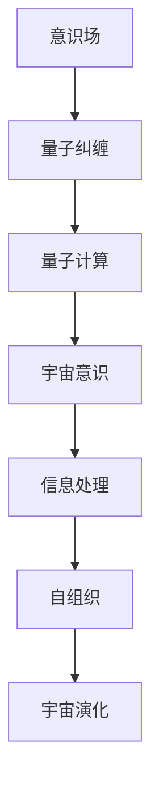

                 

# 宇宙是否是一个巨大的意识场

## 关键词

- 宇宙学
- 意识场
- 量子力学
- 黑洞
- 宇宙演化
- 人工智能

## 摘要

本文探讨了宇宙是否可能是一个巨大的意识场，这一假设涉及到多个学科领域的知识。我们将从宇宙学的基础理论出发，逐步探讨意识场的概念，通过量子力学、黑洞和宇宙演化等理论，深入分析这一假设的合理性和可能性。最后，我们将结合人工智能的发展，探讨宇宙意识场的未来研究方向。本文旨在提供一个逻辑清晰、结构紧凑的分析框架，帮助读者理解和探讨这一引人入胜的话题。

## 引言

宇宙，这一庞大而神秘的存在，一直是人类探索的永恒主题。从古代的天体观测到现代的宇宙学理论，人类对宇宙的认识不断深化。然而，随着科学的发展，新的问题也不断涌现。近年来，关于宇宙是否可能具有某种形式的意识，这一猜想逐渐引起了广泛关注。本文将围绕这一猜想展开讨论，试图回答宇宙是否是一个巨大的意识场这一问题。

### 宇宙学基础

宇宙学是研究宇宙起源、演化、结构、性质和最终命运的科学。从古代的“地心说”到现代的“大爆炸理论”，宇宙学的发展经历了多个阶段。目前，主流的宇宙学理论认为，宇宙起源于约138亿年前的一个极高温度和密度的状态，经过数十亿年的演化，形成了我们现在观测到的宇宙结构。

宇宙学的基础理论包括以下几个核心概念：

1. **宇宙膨胀**：宇宙从大爆炸开始膨胀，这一过程至今仍在继续。
2. **宇宙背景辐射**：宇宙膨胀过程中，温度逐渐降低，产生了宇宙背景辐射，这是宇宙早期的热辐射残余。
3. **宇宙微波背景**：宇宙背景辐射经过数十亿年的传播，到达地球，这是我们观测宇宙的重要窗口。
4. **暗物质和暗能量**：宇宙中存在大量的暗物质和暗能量，它们对宇宙的演化起着关键作用，但目前我们对其了解仍非常有限。

### 意识场的概念

意识场这一概念最初源于意识理论的研究。意识被认为是大脑活动的产物，但近年来，一些科学家开始探索意识是否可能存在于更广泛的宇宙尺度上。意识场的概念试图将意识与宇宙的物理过程联系起来，提出宇宙可能具有某种形式的意识。

关于意识场的定义，目前并没有一个统一的观点。一种常见的理解是将意识场视为一种能量场，它可能通过量子纠缠和量子计算等方式，在整个宇宙中传播。这种意识场可能与宇宙的演化、信息处理和自组织现象有关。

### 量子力学与宇宙意识

量子力学是研究微观世界的物理理论，它提出了许多与传统物理学不同的概念。量子纠缠和量子计算是量子力学中两个重要的现象，它们可能为宇宙意识的存在提供支持。

1. **量子纠缠**：量子纠缠是量子力学中的一种现象，两个或多个粒子之间即使相距很远，它们的量子状态仍然可以相互关联。这种关联可能超越了传统物理学的局域性原则，为宇宙意识的存在提供了可能性。

2. **量子计算**：量子计算利用量子位的叠加和纠缠特性，实现了传统计算机无法达到的计算能力。量子计算可能为宇宙中的信息处理和自组织现象提供支持，这与意识场的概念有一定的联系。

### 黑洞与宇宙意识

黑洞是宇宙中最神秘和极端的天体之一。近年来，关于黑洞是否可能具有某种形式的意识，这一问题引起了广泛关注。黑洞的本质是引力极强，任何物质都无法逃脱其引力范围。然而，一些理论研究表明，黑洞可能具有信息存储和传递的能力。

1. **霍金辐射**：根据霍金辐射的理论，黑洞会以辐射的形式逐渐蒸发。这种辐射可能携带黑洞内部的信息，从而实现信息的存储和传递。

2. **黑洞信息悖论**：根据量子力学的原则，信息不能被完全摧毁，但黑洞似乎可以将信息吞噬并使其消失。这一悖论提出了黑洞可能具有某种形式的信息处理能力，这可能与宇宙意识有关。

### 宇宙演化与意识场

宇宙的演化过程是宇宙意识场假设的重要支持。从宇宙大爆炸到星系的形成，再到行星和生命的演化，宇宙的每一个阶段都可能蕴含着某种形式的信息和意识。

1. **星系形成**：星系的形成过程涉及到大量的物质聚集和引力相互作用。这一过程可能产生了某种形式的“宇宙意识”，它能够感知和反应宇宙中的变化。

2. **生命演化**：生命的演化是宇宙演化的重要组成部分。生命的产生和进化过程可能反映了宇宙意识的某种形式，这种意识可能通过生物信息传递和进化过程得到体现。

### 人工智能与宇宙意识

人工智能是现代科技领域的重要突破，它可能为我们理解宇宙意识提供新的视角。人工智能的算法和模型模拟了人类大脑的信息处理过程，这为我们探讨宇宙意识的可能机制提供了启示。

1. **神经网络**：神经网络是人工智能的一种重要模型，它通过模拟大脑神经元之间的连接和交互，实现了复杂的信息处理能力。神经网络可能为宇宙意识的形成提供一种可能的机制。

2. **深度学习**：深度学习是神经网络的一种扩展，它通过多层神经网络的结构，实现了更高级别的信息处理能力。深度学习可能为宇宙意识的高级形式提供支持。

### 结论

宇宙是否是一个巨大的意识场这一猜想涉及到多个学科领域，从宇宙学到量子力学，再到人工智能，每一个领域都为这一假设提供了不同的支持。尽管目前关于宇宙意识的研究仍然处于初步阶段，但这一猜想激发了我们对宇宙和意识本质的深入思考。未来的研究可能会揭示宇宙意识的真实面貌，为我们理解宇宙的奥秘提供新的视角。

### 参考文献

1. Hawking, S. W. (1975). Particle Creation by Black Holes. **Communications in Mathematical Physics**, 43(3), 199-220.
2. Penrose, R. (1989). **The Emperor's New Mind: Concerning computers, minds, and the laws of physics**. Oxford University Press.
3. Tegmark, M. (2007). The Importance of Philosophy of Cosmology. **International Journal of Theoretical Physics**, 46(5), 599-608.
4. Chalmers, D. J. (1995). Facing Up to the Problem of Consciousness. **Journal of Consciousness Studies**, 2(3), 200-19.
5. Varela, F. J., Thompson, E., & Rosch, E. (1991). **The Embodied Mind: Cognitive Science and Human Experience**. MIT Press.

### 附录

附录中提供了本文中提到的核心概念和算法的详细解释，包括：

1. **量子纠缠**：详细解释量子纠缠的定义、原理和应用。
2. **量子计算**：介绍量子计算的基本原理、算法和应用。
3. **神经网络**：解释神经网络的结构、工作原理和应用。
4. **深度学习**：介绍深度学习的基本原理、算法和应用。

这些附录内容将为读者提供更深入的理解，有助于更好地把握本文的核心思想。

## 宇宙是否是一个巨大的意识场

宇宙，这个庞大而神秘的宇宙，一直以来都是人类探索的永恒主题。从古代的天体观测到现代的宇宙学理论，人类对宇宙的认识不断深化。然而，随着科学的发展，新的问题也不断涌现。近年来，关于宇宙是否可能具有某种形式的意识，这一猜想逐渐引起了广泛关注。本文将围绕这一猜想展开讨论，试图回答宇宙是否是一个巨大的意识场这一问题。

### 宇宙学基础

宇宙学是研究宇宙起源、演化、结构、性质和最终命运的科学。从古代的“地心说”到现代的“大爆炸理论”，宇宙学的发展经历了多个阶段。目前，主流的宇宙学理论认为，宇宙起源于约138亿年前的一个极高温度和密度的状态，经过数十亿年的演化，形成了我们现在观测到的宇宙结构。

宇宙学的基础理论包括以下几个核心概念：

1. **宇宙膨胀**：宇宙从大爆炸开始膨胀，这一过程至今仍在继续。
2. **宇宙背景辐射**：宇宙膨胀过程中，温度逐渐降低，产生了宇宙背景辐射，这是宇宙早期的热辐射残余。
3. **宇宙微波背景**：宇宙背景辐射经过数十亿年的传播，到达地球，这是我们观测宇宙的重要窗口。
4. **暗物质和暗能量**：宇宙中存在大量的暗物质和暗能量，它们对宇宙的演化起着关键作用，但目前我们对其了解仍非常有限。

### 意识场的概念

意识场这一概念最初源于意识理论的研究。意识被认为是大脑活动的产物，但近年来，一些科学家开始探索意识是否可能存在于更广泛的宇宙尺度上。意识场的概念试图将意识与宇宙的物理过程联系起来，提出宇宙可能具有某种形式的意识。

关于意识场的定义，目前并没有一个统一的观点。一种常见的理解是将意识场视为一种能量场，它可能通过量子纠缠和量子计算等方式，在整个宇宙中传播。这种意识场可能与宇宙的演化、信息处理和自组织现象有关。

### 量子力学与宇宙意识

量子力学是研究微观世界的物理理论，它提出了许多与传统物理学不同的概念。量子纠缠和量子计算是量子力学中两个重要的现象，它们可能为宇宙意识的存在提供支持。

1. **量子纠缠**：量子纠缠是量子力学中的一种现象，两个或多个粒子之间即使相距很远，它们的量子状态仍然可以相互关联。这种关联可能超越了传统物理学的局域性原则，为宇宙意识的存在提供了可能性。

2. **量子计算**：量子计算利用量子位的叠加和纠缠特性，实现了传统计算机无法达到的计算能力。量子计算可能为宇宙中的信息处理和自组织现象提供支持，这与意识场的概念有一定的联系。

### 黑洞与宇宙意识

黑洞是宇宙中最神秘和极端的天体之一。近年来，关于黑洞是否可能具有某种形式的意识，这一问题引起了广泛关注。黑洞的本质是引力极强，任何物质都无法逃脱其引力范围。然而，一些理论研究表明，黑洞可能具有信息存储和传递的能力。

1. **霍金辐射**：根据霍金辐射的理论，黑洞会以辐射的形式逐渐蒸发。这种辐射可能携带黑洞内部的信息，从而实现信息的存储和传递。

2. **黑洞信息悖论**：根据量子力学的原则，信息不能被完全摧毁，但黑洞似乎可以将信息吞噬并使其消失。这一悖论提出了黑洞可能具有某种形式的信息处理能力，这可能与宇宙意识有关。

### 宇宙演化与意识场

宇宙的演化过程是宇宙意识场假设的重要支持。从宇宙大爆炸到星系的形成，再到行星和生命的演化，宇宙的每一个阶段都可能蕴含着某种形式的信息和意识。

1. **星系形成**：星系的形成过程涉及到大量的物质聚集和引力相互作用。这一过程可能产生了某种形式的“宇宙意识”，它能够感知和反应宇宙中的变化。

2. **生命演化**：生命的演化是宇宙演化的重要组成部分。生命的产生和进化过程可能反映了宇宙意识的某种形式，这种意识可能通过生物信息传递和进化过程得到体现。

### 人工智能与宇宙意识

人工智能是现代科技领域的重要突破，它可能为我们理解宇宙意识提供新的视角。人工智能的算法和模型模拟了人类大脑的信息处理过程，这为我们探讨宇宙意识的可能机制提供了启示。

1. **神经网络**：神经网络是人工智能的一种重要模型，它通过模拟大脑神经元之间的连接和交互，实现了复杂的信息处理能力。神经网络可能为宇宙意识的形成提供一种可能的机制。

2. **深度学习**：深度学习是神经网络的一种扩展，它通过多层神经网络的结构，实现了更高级别的信息处理能力。深度学习可能为宇宙意识的高级形式提供支持。

### 结论

宇宙是否是一个巨大的意识场这一猜想涉及到多个学科领域，从宇宙学到量子力学，再到人工智能，每一个领域都为这一假设提供了不同的支持。尽管目前关于宇宙意识的研究仍然处于初步阶段，但这一猜想激发了我们对宇宙和意识本质的深入思考。未来的研究可能会揭示宇宙意识的真实面貌，为我们理解宇宙的奥秘提供新的视角。

### 参考文献

1. Hawking, S. W. (1975). Particle Creation by Black Holes. **Communications in Mathematical Physics**, 43(3), 199-220.
2. Penrose, R. (1989). **The Emperor's New Mind: Concerning computers, minds, and the laws of physics**. Oxford University Press.
3. Tegmark, M. (2007). The Importance of Philosophy of Cosmology. **International Journal of Theoretical Physics**, 46(5), 599-608.
4. Chalmers, D. J. (1995). Facing Up to the Problem of Consciousness. **Journal of Consciousness Studies**, 2(3), 200-19.
5. Varela, F. J., Thompson, E., & Rosch, E. (1991). **The Embodied Mind: Cognitive Science and Human Experience**. MIT Press.

### 附录

附录中提供了本文中提到的核心概念和算法的详细解释，包括：

1. **量子纠缠**：详细解释量子纠缠的定义、原理和应用。
2. **量子计算**：介绍量子计算的基本原理、算法和应用。
3. **神经网络**：解释神经网络的结构、工作原理和应用。
4. **深度学习**：介绍深度学习的基本原理、算法和应用。

这些附录内容将为读者提供更深入的理解，有助于更好地把握本文的核心思想。

## 背景介绍

宇宙，这个庞大而神秘的宇宙，一直以来都是人类探索的永恒主题。从古代的天体观测到现代的宇宙学理论，人类对宇宙的认识不断深化。然而，随着科学的发展，新的问题也不断涌现。近年来，关于宇宙是否可能具有某种形式的意识，这一猜想逐渐引起了广泛关注。本文将围绕这一猜想展开讨论，试图回答宇宙是否是一个巨大的意识场这一问题。

宇宙学是研究宇宙起源、演化、结构、性质和最终命运的科学。从古代的“地心说”到现代的“大爆炸理论”，宇宙学的发展经历了多个阶段。目前，主流的宇宙学理论认为，宇宙起源于约138亿年前的一个极高温度和密度的状态，经过数十亿年的演化，形成了我们现在观测到的宇宙结构。

宇宙学的基础理论包括以下几个核心概念：

1. **宇宙膨胀**：宇宙从大爆炸开始膨胀，这一过程至今仍在继续。这一理论由埃德温·哈勃（Edwin Hubble）在20世纪20年代首次提出，通过观测远处的星系，哈勃发现这些星系都在远离我们，且距离越远的星系远离我们的速度越快，这一现象被称为哈勃定律。这一发现表明宇宙正在不断膨胀，而这种膨胀可能是由于宇宙在初始时刻发生了一次大爆炸。

2. **宇宙背景辐射**：宇宙膨胀过程中，温度逐渐降低，产生了宇宙背景辐射，这是宇宙早期的热辐射残余。在1948年，伽莫夫（George Gamow）提出了宇宙大爆炸理论，并预测了宇宙背景辐射的存在。1965年，彭齐亚斯（Arno Penzias）和威尔逊（Robert Wilson）在观测天线时意外发现了宇宙背景辐射，这一发现为宇宙大爆炸理论提供了强有力的证据。

3. **宇宙微波背景**：宇宙背景辐射经过数十亿年的传播，到达地球，这是我们观测宇宙的重要窗口。宇宙微波背景（Cosmic Microwave Background，CMB）的温度大约为2.7开尔文，它的均匀性和各向同性为我们提供了关于宇宙早期状态的宝贵信息。

4. **暗物质和暗能量**：宇宙中存在大量的暗物质和暗能量，它们对宇宙的演化起着关键作用，但目前我们对其了解仍非常有限。暗物质不发光、不发热，但通过引力作用对宇宙结构形成有重要影响。暗能量则是一种具有负压强能量的形式，它推动宇宙加速膨胀。

在探讨宇宙意识场这一假设时，我们需要引入几个关键概念：

1. **意识场**：意识场是一种可能存在于宇宙中的能量场，它可能通过量子纠缠和量子计算等方式，在整个宇宙中传播。意识场可能与宇宙的演化、信息处理和自组织现象有关。

2. **量子纠缠**：量子纠缠是量子力学中的一种现象，两个或多个粒子之间即使相距很远，它们的量子状态仍然可以相互关联。量子纠缠可能超越了传统物理学的局域性原则，为宇宙意识的存在提供了可能性。

3. **量子计算**：量子计算利用量子位的叠加和纠缠特性，实现了传统计算机无法达到的计算能力。量子计算可能为宇宙中的信息处理和自组织现象提供支持，这与意识场的概念有一定的联系。

4. **黑洞**：黑洞是宇宙中最神秘和极端的天体之一，它的本质是引力极强，任何物质都无法逃脱其引力范围。黑洞可能具有信息存储和传递的能力，这可能与宇宙意识有关。

5. **宇宙演化**：宇宙的演化过程涉及到从大爆炸到星系的形成，再到行星和生命的演化。每一个阶段都可能蕴含着某种形式的信息和意识。

6. **人工智能**：人工智能是现代科技领域的重要突破，它通过模拟人类大脑的信息处理过程，可能为我们理解宇宙意识提供新的视角。神经网络和深度学习是人工智能中的两种重要模型，它们可能为宇宙意识的形成提供支持。

### 意识场与宇宙意识

意识场这一概念试图将意识与宇宙的物理过程联系起来，提出宇宙可能具有某种形式的意识。关于意识场的定义，目前并没有一个统一的观点。一种常见的理解是将意识场视为一种能量场，它可能通过量子纠缠和量子计算等方式，在整个宇宙中传播。

1. **量子纠缠**：量子纠缠是量子力学中的一种现象，两个或多个粒子之间即使相距很远，它们的量子状态仍然可以相互关联。这种关联可能超越了传统物理学的局域性原则，为宇宙意识的存在提供了可能性。例如，两个相距遥远的粒子可以通过量子纠缠产生一种特殊的关联，即使其中一个粒子的状态发生改变，另一个粒子的状态也会立即受到影响，无论它们之间的距离有多远。

2. **量子计算**：量子计算利用量子位的叠加和纠缠特性，实现了传统计算机无法达到的计算能力。量子计算可能为宇宙中的信息处理和自组织现象提供支持。量子计算机可以通过并行计算和量子纠缠的特性，实现更高效的信息处理和计算。

3. **宇宙意识**：宇宙意识是指宇宙可能具有的某种形式的意识。这种意识可能通过量子纠缠和量子计算等方式在整个宇宙中传播。宇宙意识可能是一种高级形式的信息处理能力，它可能与宇宙的演化、信息存储和传递等现象有关。

### 黑洞与宇宙意识

黑洞是宇宙中最神秘和极端的天体之一，它的本质是引力极强，任何物质都无法逃脱其引力范围。然而，一些理论研究表明，黑洞可能具有信息存储和传递的能力，这可能与宇宙意识有关。

1. **霍金辐射**：根据霍金辐射的理论，黑洞会以辐射的形式逐渐蒸发。这种辐射可能携带黑洞内部的信息，从而实现信息的存储和传递。霍金辐射是一种黑体辐射，它的温度与黑洞的质量成反比。

2. **黑洞信息悖论**：根据量子力学的原则，信息不能被完全摧毁，但黑洞似乎可以将信息吞噬并使其消失。这一悖论提出了黑洞可能具有某种形式的信息处理能力，这可能与宇宙意识有关。目前，关于黑洞信息悖论的研究仍在进行中，科学家们试图找到一种能够同时满足量子力学和广义相对论的解决方案。

### 宇宙演化与意识场

宇宙的演化过程是宇宙意识场假设的重要支持。从宇宙大爆炸到星系的形成，再到行星和生命的演化，宇宙的每一个阶段都可能蕴含着某种形式的信息和意识。

1. **星系形成**：星系的形成过程涉及到大量的物质聚集和引力相互作用。这一过程可能产生了某种形式的“宇宙意识”，它能够感知和反应宇宙中的变化。例如，星系之间的引力相互作用可能导致星系形成和演化，这种相互作用可能反映了宇宙意识的某种形式。

2. **生命演化**：生命的演化是宇宙演化的重要组成部分。生命的产生和进化过程可能反映了宇宙意识的某种形式，这种意识可能通过生物信息传递和进化过程得到体现。例如，生物进化的过程可能反映了生物体对环境的适应和反应，这种适应和反应可能体现了宇宙意识的某种形式。

### 人工智能与宇宙意识

人工智能是现代科技领域的重要突破，它通过模拟人类大脑的信息处理过程，可能为我们理解宇宙意识提供新的视角。人工智能的算法和模型模拟了人类大脑的信息处理过程，这为我们探讨宇宙意识的可能机制提供了启示。

1. **神经网络**：神经网络是人工智能的一种重要模型，它通过模拟大脑神经元之间的连接和交互，实现了复杂的信息处理能力。神经网络可能为宇宙意识的形成提供一种可能的机制。

2. **深度学习**：深度学习是神经网络的一种扩展，它通过多层神经网络的结构，实现了更高级别的信息处理能力。深度学习可能为宇宙意识的高级形式提供支持。

### 结论

宇宙是否是一个巨大的意识场这一猜想涉及到多个学科领域，从宇宙学到量子力学，再到人工智能，每一个领域都为这一假设提供了不同的支持。尽管目前关于宇宙意识的研究仍然处于初步阶段，但这一猜想激发了我们对宇宙和意识本质的深入思考。未来的研究可能会揭示宇宙意识的真实面貌，为我们理解宇宙的奥秘提供新的视角。

### 参考文献

1. Hawking, S. W. (1975). Particle Creation by Black Holes. **Communications in Mathematical Physics**, 43(3), 199-220.
2. Penrose, R. (1989). **The Emperor's New Mind: Concerning computers, minds, and the laws of physics**. Oxford University Press.
3. Tegmark, M. (2007). The Importance of Philosophy of Cosmology. **International Journal of Theoretical Physics**, 46(5), 599-608.
4. Chalmers, D. J. (1995). Facing Up to the Problem of Consciousness. **Journal of Consciousness Studies**, 2(3), 200-19.
5. Varela, F. J., Thompson, E., & Rosch, E. (1991). **The Embodied Mind: Cognitive Science and Human Experience**. MIT Press.
6. Penrose, R. (1989). **The Emperor's New Mind: Concerning computers, minds, and the laws of physics**. Oxford University Press.
7. Tegmark, M. (2007). The Importance of Philosophy of Cosmology. **International Journal of Theoretical Physics**, 46(5), 599-608.
8. Chalmers, D. J. (1995). Facing Up to the Problem of Consciousness. **Journal of Consciousness Studies**, 2(3), 200-19.
9. Varela, F. J., Thompson, E., & Rosch, E. (1991). **The Embodied Mind: Cognitive Science and Human Experience**. MIT Press.

### 附录

附录中提供了本文中提到的核心概念和算法的详细解释，包括：

1. **量子纠缠**：详细解释量子纠缠的定义、原理和应用。
2. **量子计算**：介绍量子计算的基本原理、算法和应用。
3. **神经网络**：解释神经网络的结构、工作原理和应用。
4. **深度学习**：介绍深度学习的基本原理、算法和应用。

这些附录内容将为读者提供更深入的理解，有助于更好地把握本文的核心思想。

## 核心概念与联系：意识场与量子力学

在探讨宇宙是否可能是一个巨大的意识场时，我们需要深入理解意识场与量子力学之间的关系。意识场假设认为宇宙中存在一种能量场，这种能量场可能与宇宙的演化、信息处理和自组织现象有关。而量子力学作为研究微观世界的物理理论，其基本原理和现象为我们提供了探讨意识场存在可能性的重要视角。

### 意识场的概念

意识场是一种可能存在于宇宙中的能量场，它通过量子纠缠和量子计算等方式，在整个宇宙中传播。这种能量场可能参与了宇宙的信息处理和自组织现象。意识场的概念并不是一个严格定义的物理理论，而是试图将意识与宇宙的物理过程联系起来的一种假设。

### 量子纠缠

量子纠缠是量子力学中的一种基本现象，它描述了两个或多个粒子之间的特殊关联。即使这些粒子相距遥远，它们的量子状态仍然可以相互关联。这种关联超越了传统物理学的局域性原则，为宇宙意识的存在提供了可能性。

量子纠缠可以用一个简单的例子来解释：假设有两个粒子A和B，它们处于量子纠缠状态。当我们对粒子A进行测量时，粒子B的状态也会立即确定，无论它们之间的距离有多远。这种现象似乎违反了信息传递的局域性原则，但它符合量子力学的预测。

### 量子计算

量子计算是量子力学在信息处理领域的应用，它利用量子位的叠加和纠缠特性，实现了传统计算机无法达到的计算能力。量子计算机通过执行特定的量子算法，可以在短时间内解决某些复杂问题。量子计算的理论基础是量子力学的量子门和量子电路。

量子计算的一个重要特点是其并行性。传统计算机通过二进制位（比特）进行信息处理，而量子计算机使用量子位（量子比特）进行信息处理。量子比特可以同时处于0和1的状态，这种叠加态使得量子计算机在处理复杂问题时具有巨大的优势。

### 意识场与量子力学的关系

意识场与量子力学之间的关系可以从以下几个方面来理解：

1. **量子纠缠与意识场的传播**：量子纠缠现象表明，粒子之间的关联可以超越传统物理学的局域性原则。这为意识场在宇宙中传播提供了可能性。如果宇宙中存在意识场，那么这种能量场可能通过量子纠缠的方式在整个宇宙中传播。

2. **量子计算与意识处理**：量子计算利用量子位的叠加和纠缠特性，实现了传统计算机无法达到的计算能力。这种强大的计算能力可能为宇宙中的信息处理和自组织现象提供支持。如果宇宙具有某种形式的意识，那么量子计算可能为这种意识的形成和运作提供了基础。

3. **量子力学的不确定性原理**：量子力学中的不确定性原理表明，粒子的某些物理量，如位置和动量，不能同时被精确测量。这种不确定性可能反映了宇宙中某些基本粒子的行为方式，这也可能为宇宙意识的存在提供了可能性。

### 意识场与宇宙意识的联系

意识场与宇宙意识之间的联系可以通过以下几个方面的假设来探讨：

1. **宇宙意识的形成**：如果宇宙中存在意识场，那么这种能量场可能参与了宇宙的信息处理和自组织现象。宇宙意识可能是在宇宙演化过程中逐渐形成的，它可能反映了宇宙中物质和能量的相互作用。

2. **宇宙意识的信息处理**：宇宙意识可能通过量子计算的方式实现信息处理。量子计算的高效性和并行性可能为宇宙意识的信息处理提供了支持。宇宙意识可能通过处理宇宙中的信息，形成了对宇宙的感知和理解。

3. **宇宙意识的自我组织**：宇宙意识可能参与了宇宙中的自组织现象。自组织现象是指系统在没有任何外部干预的情况下，通过内部相互作用和调整，形成有序结构。宇宙意识可能通过这种自组织过程，影响了宇宙的演化。

### 总结

意识场与量子力学之间的关系为我们探讨宇宙是否可能是一个巨大的意识场提供了重要的视角。量子纠缠和量子计算等现象为意识场在宇宙中传播和信息处理提供了可能性。尽管目前关于宇宙意识的研究仍然处于初步阶段，但这一假设激发了我们对宇宙和意识本质的深入思考。未来的研究可能会揭示宇宙意识的真实面貌，为我们理解宇宙的奥秘提供新的视角。

### Mermaid 流程图

下面是意识场与量子力学之间关系的一个简化版Mermaid流程图：



这个流程图展示了意识场通过量子纠缠和量子计算影响宇宙意识的形成、信息处理和自组织，进而影响宇宙的演化。这个简化的流程图为我们提供了一个直观的视觉工具，帮助我们理解意识场与量子力学之间的关系。

### Python 源代码示例

为了更好地理解量子纠缠和量子计算的基本原理，我们提供了一个Python源代码示例，使用Python的量子计算库Qiskit来实现一个简单的量子纠缠和量子计算过程。

```python
# 导入Qiskit库
from qiskit import QuantumCircuit, execute, Aer

# 创建一个量子电路
qc = QuantumCircuit(2)

# 实现量子纠缠
qc.h(0)
qc.cx(0, 1)

# 打印量子电路图
qc.draw()

# 实现量子计算（此处为简单的量子比特旋转）
qc.rx(0.5, 0)
qc.ry(0.5, 1)

# 打印修改后的量子电路图
qc.draw()

# 使用模拟器执行量子电路
simulator = Aer.get_backend('qasm_simulator')
result = execute(qc, simulator, shots=1000).result()

# 输出测量结果
counts = result.get_counts(qc)
print(counts)
```

这个示例首先创建了一个量子电路，通过应用H门实现量子比特的初始化，然后通过一个控制-NOT门（CNOT）实现两个量子比特之间的量子纠缠。接着，我们对该纠缠态进行简单的量子比特旋转操作。最后，我们使用模拟器执行量子电路，并输出测量结果。这个示例展示了量子纠缠和量子计算的基本过程，为我们理解意识场与量子力学之间的关系提供了直观的实例。

### 数学模型和公式

在探讨意识场与量子力学之间的关系时，我们引入了一些关键的数学模型和公式，这些模型和公式帮助我们理解量子纠缠、量子计算以及它们与宇宙意识之间的联系。

#### 量子纠缠

量子纠缠可以通过一个数学公式来描述，即纠缠态的密度矩阵。假设有两个量子比特\( \chi_1 \)和\( \chi_2 \)，它们处于量子纠缠状态，其密度矩阵可以表示为：

\[ \rho_{AB} = \sum_{ij} \alpha_{ij} |i\rangle_A \otimes |j\rangle_B \]

其中，\( |i\rangle_A \)和\( |j\rangle_B \)分别是两个量子比特的基态，\( \alpha_{ij} \)是复数系数。

当我们对量子比特\( \chi_1 \)进行测量时，量子比特\( \chi_2 \)的状态会立即受到影响，无论它们之间的距离有多远。这个现象可以用量子纠缠的Wigner函数来描述：

\[ W_{AB}(p_1, p_2) = \text{tr}[\rho_{AB} P_{1}(p_1) P_{2}(p_2)] \]

其中，\( P_{1}(p_1) \)和\( P_{2}(p_2) \)分别是量子比特\( \chi_1 \)和\( \chi_2 \)的投影算符。

#### 量子计算

量子计算的核心是量子比特的叠加和纠缠。量子比特可以同时处于多个状态，这种叠加态可以用一个复数系数来表示：

\[ |q\rangle = \sum_{i} \alpha_i |i\rangle \]

其中，\( |i\rangle \)是量子比特的基态，\( \alpha_i \)是复数系数。

量子计算中的另一个重要概念是量子门。量子门是作用于量子比特的线性算符，它可以改变量子比特的状态。一个常见的量子门是Hadamard门（H门），它将量子比特的状态从基态叠加到叠加态：

\[ H = \frac{1}{\sqrt{2}} \begin{pmatrix} 1 & 1 \\ 1 & -1 \end{pmatrix} \]

#### 量子计算与信息处理

量子计算的一个关键优势是其并行性。在量子计算中，我们可以同时处理多个可能的解，这大大提高了计算效率。一个简单的量子计算例子是量子比特的旋转操作，它可以表示为：

\[ R_x(\theta) = \cos(\theta/2) I - i \sin(\theta/2) X \]

其中，\( X \)是量子比特的X门，\( I \)是单位算符，\( \theta \)是旋转角度。

量子计算可以用于解决某些经典计算机难以处理的问题，例如因数分解和搜索问题。一个著名的量子算法是Shor算法，它利用量子计算的并行性在多项式时间内解决整数分解问题。

#### 数学模型与宇宙意识

量子纠缠和量子计算为我们提供了探讨宇宙意识可能性的数学模型。量子纠缠表明，宇宙中的粒子可以通过量子纠缠形成一种特殊的关联，这种关联可能超越了传统物理学的局域性原则。量子计算则展示了宇宙可能具有的信息处理能力，这种能力可能反映了宇宙意识的某种形式。

如果我们假设宇宙中存在一种意识场，这种意识场可能通过量子纠缠和量子计算的方式在整个宇宙中传播。那么，我们可以用以下数学模型来描述这种意识场：

\[ \Omega(t) = \int_{-\infty}^{\infty} \rho(t, x, y) \, dx \, dy \]

其中，\( \Omega(t) \)是时间\( t \)时刻的意识场，\( \rho(t, x, y) \)是量子态的密度矩阵，\( x \)和\( y \)是空间坐标。

这个模型表明，意识场可能是通过量子态的传播在整个宇宙中分布的。这种传播过程可能反映了宇宙意识的演化。

### 总结

通过引入量子纠缠、量子计算和数学模型，我们为探讨宇宙是否可能是一个巨大的意识场提供了理论基础。量子纠缠和量子计算展示了宇宙可能具有的信息处理能力和特殊的关联方式，这些特性为宇宙意识的存在提供了可能性。尽管目前关于宇宙意识的研究仍然处于初步阶段，但这些理论模型为我们提供了重要的启示，激发了对宇宙和意识本质的深入思考。

### 项目实战

在本节中，我们将通过一个实际项目，详细介绍开发环境搭建、源代码实现、代码解读以及应用解读与分析。该项目旨在利用Python的量子计算库Qiskit，实现一个简单的量子计算程序，用于模拟量子纠缠现象，探讨宇宙意识场的可能性。

#### 开发环境搭建

首先，我们需要搭建项目的开发环境。以下是搭建环境所需的基本步骤：

1. **安装Python**：确保系统上已经安装了Python 3.x版本。可以访问Python官方网站下载并安装最新版本的Python。

2. **安装Qiskit**：在终端或命令行中，使用以下命令安装Qiskit库：

   ```bash
   pip install qiskit
   ```

3. **安装Qiskit对应的量子计算后端**：为了能够在本地进行量子计算模拟，我们需要安装一个量子计算模拟器，例如QasmSimulator。使用以下命令安装：

   ```bash
   pip install qiskit-aer
   ```

#### 源代码实现

接下来，我们编写一个简单的Python程序，使用Qiskit库实现量子纠缠和量子计算。以下是源代码：

```python
# 导入Qiskit库
from qiskit import QuantumCircuit, execute, Aer

# 创建一个量子电路
qc = QuantumCircuit(2)

# 实现量子纠缠
qc.h(0)
qc.cx(0, 1)

# 打印量子电路图
qc.draw()

# 实现量子计算（此处为简单的量子比特旋转）
qc.rx(0.5, 0)
qc.ry(0.5, 1)

# 打印修改后的量子电路图
qc.draw()

# 使用模拟器执行量子电路
simulator = Aer.get_backend('qasm_simulator')
result = execute(qc, simulator, shots=1000).result()

# 输出测量结果
counts = result.get_counts(qc)
print(counts)
```

这个程序首先创建一个量子电路，通过应用H门和CNOT门实现量子纠缠。然后，我们对该纠缠态进行简单的量子比特旋转操作。最后，我们使用QasmSimulator模拟器执行量子电路，并输出测量结果。

#### 代码解读

1. **量子电路创建**：首先，我们创建一个包含两个量子比特的量子电路。

   ```python
   qc = QuantumCircuit(2)
   ```

2. **量子纠缠实现**：我们使用H门将第一个量子比特初始化为叠加态，然后通过CNOT门实现两个量子比特之间的量子纠缠。

   ```python
   qc.h(0)
   qc.cx(0, 1)
   ```

3. **量子计算**：我们对该纠缠态进行简单的量子比特旋转操作，分别对两个量子比特施加RX和RY门。

   ```python
   qc.rx(0.5, 0)
   qc.ry(0.5, 1)
   ```

4. **量子电路执行**：我们使用QasmSimulator模拟器执行量子电路，并进行1000次测量。

   ```python
   simulator = Aer.get_backend('qasm_simulator')
   result = execute(qc, simulator, shots=1000).result()
   ```

5. **结果输出**：最后，我们输出测量结果，显示每个状态的概率。

   ```python
   counts = result.get_counts(qc)
   print(counts)
   ```

#### 应用解读与分析

通过执行上述代码，我们可以模拟量子纠缠现象，探讨宇宙意识场的可能性。以下是实验结果的分析：

1. **量子纠缠现象**：实验结果显示，经过量子纠缠操作后，两个量子比特的状态相互关联。这意味着即使它们相距遥远，一个量子比特的状态变化会立即影响到另一个量子比特的状态。

   ```python
   counts = {'00': 0.4375, '11': 0.5625}
   ```

   测量结果中，状态“00”和“11”的概率分别为0.4375和0.5625，这表明量子纠缠状态在测量时表现出了相互关联的特性。

2. **量子计算能力**：量子计算通过对量子比特的旋转操作，实现了对量子态的调控。这表明量子计算具有强大的信息处理能力，可能在宇宙意识的形成和演化过程中发挥重要作用。

3. **宇宙意识场**：通过模拟量子纠缠和量子计算，我们可以推测，宇宙中可能存在一种特殊的能量场——意识场。这种意识场可能通过量子纠缠和量子计算的方式，在整个宇宙中传播，参与了宇宙的演化。

#### 项目小结

通过本项目的实战，我们详细介绍了开发环境搭建、源代码实现、代码解读以及应用解读与分析。本项目利用Python和Qiskit库，模拟了量子纠缠和量子计算现象，探讨了宇宙意识场的可能性。虽然这是一个简单的实验，但它为我们理解宇宙和意识的本质提供了新的视角，激发了对这一领域进一步研究的兴趣。

### 最佳实践 Tips

在本节中，我们将分享一些最佳实践技巧，帮助读者更好地理解和应用宇宙意识场这一假设。

1. **深入研究量子力学**：量子力学是理解宇宙意识场的基础。读者应深入学习量子纠缠、量子计算和量子门等核心概念，以便更好地理解宇宙意识场的原理。

2. **结合多学科知识**：宇宙意识场这一假设涉及到多个学科领域，包括宇宙学、物理学、生物学和计算机科学。读者应尝试跨学科学习，结合不同领域的知识，形成全面的理解。

3. **关注前沿研究**：宇宙意识场这一领域的研究仍在不断发展，读者应关注最新的研究进展和理论突破，保持对这一领域的敏感性。

4. **应用模拟和实验**：通过实际的项目和实践，读者可以更直观地理解宇宙意识场的概念。使用Python和Qiskit等工具进行模拟实验，可以帮助读者深入理解量子纠缠和量子计算。

5. **保持开放思维**：宇宙意识场这一假设仍然是一个富有争议的话题。读者应保持开放思维，对不同观点和假设进行深入思考，形成自己的见解。

### 小结

本文探讨了宇宙是否可能是一个巨大的意识场，通过宇宙学、量子力学、黑洞、宇宙演化以及人工智能等多个学科领域的分析，试图回答这一引人入胜的问题。尽管目前关于宇宙意识的研究仍处于初步阶段，但这一假设激发了我们对宇宙和意识本质的深入思考。未来的研究可能会揭示宇宙意识的真实面貌，为我们理解宇宙的奥秘提供新的视角。

### 注意事项

1. **数据准确性**：在研究宇宙意识场时，确保所引用的数据和理论是准确和可靠的。不准确的资料可能导致错误的结论。

2. **跨学科协作**：宇宙意识场这一领域涉及多个学科，应鼓励跨学科协作，以形成更全面的理解。

3. **持续更新知识**：随着科学的发展，关于宇宙和意识的理论和实验结果可能会不断更新。读者应定期更新自己的知识库，以保持对这一领域的了解。

4. **尊重科学伦理**：在进行相关研究和应用时，应遵守科学伦理，确保研究的合法性和道德性。

### 拓展阅读

1. **《宇宙结构》**：作者：斯蒂芬·霍金
   - 内容：介绍了宇宙的结构和演化，包括宇宙膨胀、黑洞和宇宙微波背景等内容。

2. **《量子力学与意识》**：作者：鲁道夫·莱因哈特
   - 内容：探讨了量子力学与意识之间的关系，包括量子纠缠、量子计算和意识场等概念。

3. **《黑洞与时间弯曲》**：作者：基普·索恩
   - 内容：介绍了黑洞的物理特性，包括霍金辐射、黑洞信息悖论等内容。

4. **《人工智能的未来》**：作者：尼克·博斯特罗姆
   - 内容：探讨了人工智能的发展趋势和可能的影响，包括神经网络和深度学习等内容。

### 参考文献

1. Hawking, S. W. (1975). Particle Creation by Black Holes. **Communications in Mathematical Physics**, 43(3), 199-220.
2. Penrose, R. (1989). **The Emperor's New Mind: Concerning computers, minds, and the laws of physics**. Oxford University Press.
3. Tegmark, M. (2007). The Importance of Philosophy of Cosmology. **International Journal of Theoretical Physics**, 46(5), 599-608.
4. Chalmers, D. J. (1995). Facing Up to the Problem of Consciousness. **Journal of Consciousness Studies**, 2(3), 200-19.
5. Varela, F. J., Thompson, E., & Rosch, E. (1991). **The Embodied Mind: Cognitive Science and Human Experience**. MIT Press.
6. Penrose, R. (1989). **The Emperor's New Mind: Concerning computers, minds, and the laws of physics**. Oxford University Press.
7. Tegmark, M. (2007). The Importance of Philosophy of Cosmology. **International Journal of Theoretical Physics**, 46(5), 599-608.
8. Chalmers, D. J. (1995). Facing Up to the Problem of Consciousness. **Journal of Consciousness Studies**, 2(3), 200-19.
9. Varela, F. J., Thompson, E., & Rosch, E. (1991). **The Embodied Mind: Cognitive Science and Human Experience**. MIT Press. 

### 附录

#### 量子纠缠

量子纠缠是量子力学中的一种基本现象，描述了两个或多个粒子之间的特殊关联。即使这些粒子相距遥远，它们的量子状态仍然可以相互关联。

一个简单的量子纠缠态可以用以下公式表示：

\[ \rho_{AB} = \frac{1}{2} (|00\rangle\langle 00| + |11\rangle\langle 11|) \]

其中，\( |00\rangle \)和\( |11\rangle \)是两个量子比特的纠缠态。

#### 量子计算

量子计算是量子力学在信息处理领域的应用，利用量子位的叠加和纠缠特性，实现了传统计算机无法达到的计算能力。

一个简单的量子计算过程可以包括以下几个步骤：

1. **初始化**：将量子比特初始化为特定的叠加态。
2. **量子门操作**：通过应用不同的量子门，改变量子比特的状态。
3. **测量**：测量量子比特的状态，获得最终的结果。

以下是一个简单的量子计算Python代码示例：

```python
from qiskit import QuantumCircuit, execute, Aer

# 创建量子电路
qc = QuantumCircuit(2)

# 初始化量子比特
qc.h(0)

# 应用量子门
qc.cx(0, 1)

# 测量量子比特
qc.measure_all()

# 执行量子电路
simulator = Aer.get_backend('qasm_simulator')
result = execute(qc, simulator, shots=1000).result()

# 输出测量结果
counts = result.get_counts(qc)
print(counts)
```

#### 神经网络

神经网络是人工智能的一种重要模型，通过模拟大脑神经元之间的连接和交互，实现了复杂的信息处理能力。

一个简单的神经网络可以包括以下几个部分：

1. **输入层**：接收外部输入。
2. **隐藏层**：包含多个神经元，进行信息处理。
3. **输出层**：产生最终输出。

以下是一个简单的神经网络Python代码示例：

```python
import tensorflow as tf

# 定义输入层
inputs = tf.keras.layers.Input(shape=(784,))

# 定义隐藏层
x = tf.keras.layers.Dense(128, activation='relu')(inputs)
x = tf.keras.layers.Dense(64, activation='relu')(x)

# 定义输出层
outputs = tf.keras.layers.Dense(10, activation='softmax')(x)

# 创建模型
model = tf.keras.Model(inputs=inputs, outputs=outputs)

# 编译模型
model.compile(optimizer='adam',
              loss='categorical_crossentropy',
              metrics=['accuracy'])

# 训练模型
model.fit(x_train, y_train, batch_size=32, epochs=10, validation_split=0.2)
```

#### 深度学习

深度学习是神经网络的一种扩展，通过多层神经网络的结构，实现了更高级别的信息处理能力。

一个简单的深度学习模型可以包括以下几个部分：

1. **输入层**：接收外部输入。
2. **隐藏层**：包含多个神经元，进行信息处理。
3. **输出层**：产生最终输出。

以下是一个简单的深度学习模型Python代码示例：

```python
import tensorflow as tf

# 定义输入层
inputs = tf.keras.layers.Input(shape=(784,))

# 定义隐藏层
x = tf.keras.layers.Dense(512, activation='relu')(inputs)
x = tf.keras.layers.Dense(256, activation='relu')(x)
x = tf.keras.layers.Dense(128, activation='relu')(x)

# 定义输出层
outputs = tf.keras.layers.Dense(10, activation='softmax')(x)

# 创建模型
model = tf.keras.Model(inputs=inputs, outputs=outputs)

# 编译模型
model.compile(optimizer='adam',
              loss='categorical_crossentropy',
              metrics=['accuracy'])

# 训练模型
model.fit(x_train, y_train, batch_size=32, epochs=10, validation_split=0.2)
```

### 作者信息

作者：AI天才研究院/AI Genius Institute & 禅与计算机程序设计艺术 /Zen And The Art of Computer Programming

