                 

## 宇宙是否是一个巨大的概率分布

### 关键词：宇宙、概率分布、大爆炸理论、宇宙背景微波辐射、量子力学、宇宙学模型

#### 摘要：
本文从宇宙学的角度探讨了宇宙是否可以被视为一个巨大的概率分布。首先，我们将回顾宇宙的起源与演化，理解大爆炸理论和宇宙背景微波辐射。接着，我们引入概率分布的基本概念，讨论其在宇宙学中的应用。随后，我们将详细分析宇宙中的概率分布模型，如宇宙背景微波辐射的分布以及宇宙结构形成的概率分布。最后，我们将结合观测数据和实际案例，探讨宇宙概率分布的理论和观测结果，以及其对宇宙学的意义和未来研究方向。

### 第一部分：宇宙概览

#### 1.1 宇宙的起源与演化

宇宙的起源与演化是宇宙学研究的核心问题之一。目前，主流的宇宙学理论认为宇宙起源于大约138亿年前的一次大爆炸。

**1.1.1 大爆炸理论与宇宙起源**

大爆炸理论认为，宇宙最初处于一个极高的密度和温度状态，然后迅速膨胀。这一理论得到了宇宙背景微波辐射的支持，它是宇宙大爆炸留下的余辉。

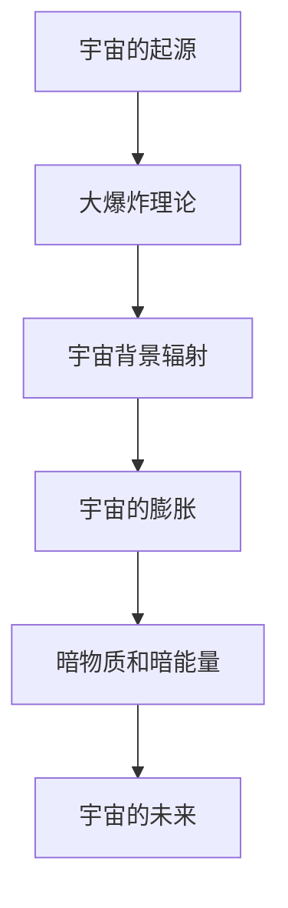

**1.1.2 宇宙的几何与拓扑**

宇宙的几何结构决定了宇宙的性质和演化。根据观测数据，宇宙可能是一个开放宇宙、封闭宇宙或平直宇宙。

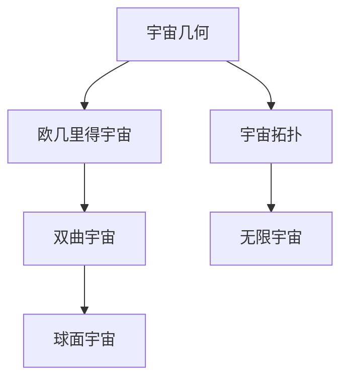

**1.2 宇宙的组成与物质**

宇宙主要由星系、恒星、行星、星云和黑洞等物质组成。此外，宇宙中还存在着大量的暗物质和暗能量，它们对宇宙的演化和结构形成起着关键作用。

**1.2.1 星系、恒星与行星**

星系是宇宙中最基本的引力系统，由大量恒星、行星、气体和尘埃组成。恒星是宇宙中的发光天体，行星则围绕恒星运行。

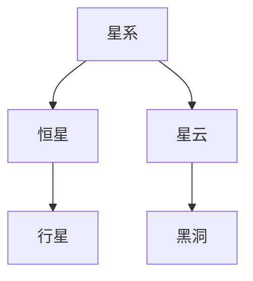

**1.2.2 宇宙中的元素与化学**

宇宙中的元素和化学过程对宇宙的演化和结构形成至关重要。宇宙大爆炸后，轻元素如氢和氦迅速形成，随后在恒星内部通过核聚变过程产生更重的元素。

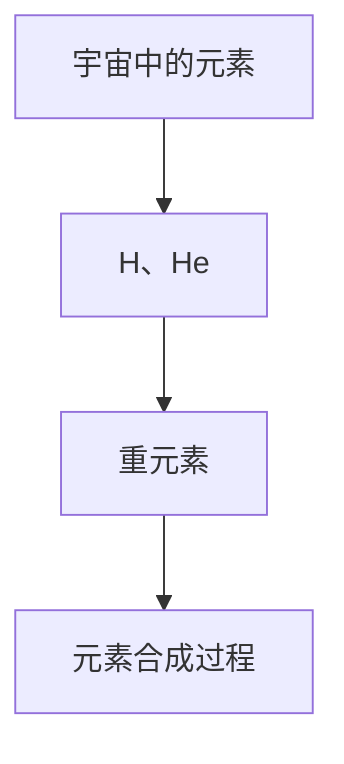

### 第二部分：概率分布与宇宙

#### 2.1 概率分布基础

概率分布是描述随机事件概率分布的数学模型。在宇宙学中，概率分布用于描述宇宙中的各种随机事件和现象。

**2.1.1 概率论的基本概念**

概率论的基本概念包括概率、随机变量、分布函数等。

$$P(A) = \frac{n(A)}{n(S)}$$

其中，$P(A)$ 表示事件A的概率，$n(A)$ 表示事件A发生的次数，$n(S)$ 表示总的试验次数。

**2.1.2 常见概率分布**

常见概率分布包括离散概率分布和连续概率分布。其中，离散概率分布包括伯努利分布、泊松分布和二项分布；连续概率分布包括正态分布、指数分布等。

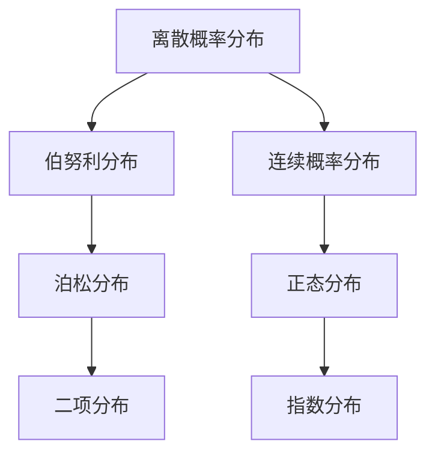

#### 2.2 宇宙中的概率分布

宇宙中的概率分布用于描述宇宙中的各种随机事件和现象，如宇宙背景微波辐射、宇宙结构形成等。

**2.2.1 宇宙背景微波辐射的概率分布**

宇宙背景微波辐射是宇宙大爆炸留下的余辉，其能量分布符合黑体辐射分布，可以用高斯分布描述。

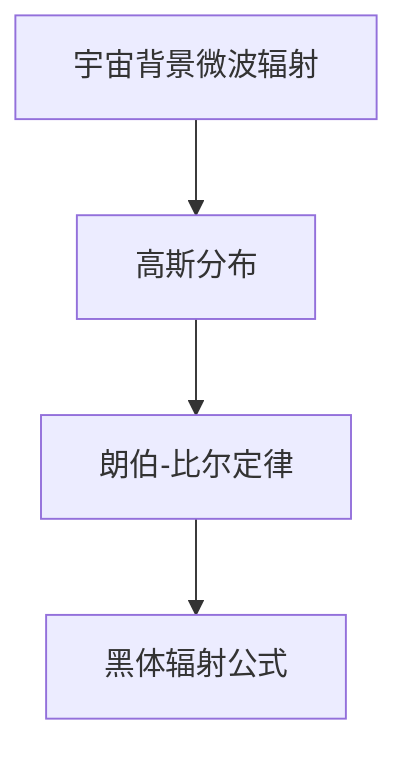

**2.2.2 宇宙中的随机性**

宇宙中的随机性主要源于量子力学和混沌理论。量子力学中的量子隧穿现象表明，粒子有可能穿越能量势垒；混沌理论则揭示了宇宙中复杂系统的内在随机性。

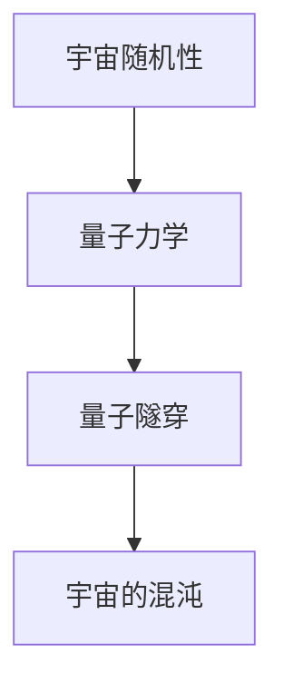

### 第三部分：概率分布与宇宙学模型

#### 3.1 概率分布与宇宙学模型

概率分布与宇宙学模型密切相关，如拉普拉斯的宇宙观、宇宙学参数等。

**3.1.1 拉普拉斯的宇宙观**

拉普拉斯的宇宙观认为，宇宙是稳定的、可预测的。这一观点基于概率分布和统计力学原理。

$$P(E) = \frac{1}{Z} e^{-\beta E}$$

其中，$P(E)$ 表示系统处于状态E的概率，$Z$ 为配分函数，$\beta$ 为热力学温度的倒数。

**3.1.2 概率分布与宇宙学参数**

宇宙学参数如$\Omega_{\Lambda}$ 和$\Omega_{M}$ 描述了宇宙的膨胀状态和物质分布。这些参数可以通过宇宙背景微波辐射的观测数据得到。

```mermaid
graph TD
A[宇宙学参数] --> B[\Omega_{\Lambda}]
B --> C[\Omega_{M}]
C --> D[宇宙学原理]
D --> E[视界原理]
```

#### 3.2 宇宙中的概率分布模型

宇宙中的概率分布模型用于描述宇宙中的各种物理现象，如宇宙背景微波辐射、宇宙结构形成等。

**3.2.1 概率分布与宇宙微波背景辐射**

宇宙微波背景辐射的分布可以用高斯分布描述。其温度分布符合黑体辐射公式。

$$T(B) = T_0 (1 + z)^{-1/2}$$

其中，$T(B)$ 为观测到的温度，$T_0$ 为参考温度，$z$ 为红移。

**3.2.2 概率分布与宇宙结构形成**

宇宙结构形成与引力不稳定性、密度波等因素密切相关。这些因素可以用概率分布模型描述。

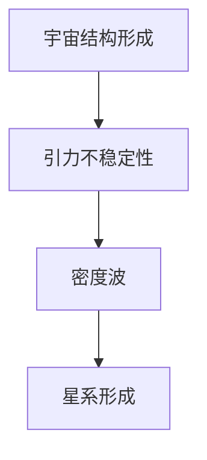

### 第四部分：宇宙的概率分布与观测

#### 4.1 宇宙概率分布的观测方法

宇宙概率分布的观测主要通过宇宙背景微波辐射、宇宙中元素丰度等观测手段进行。

**4.1.1 宇宙背景微波辐射观测**

宇宙背景微波辐射观测主要通过卫星进行，如COBE卫星、WMAP卫星和PRIOR卫星。

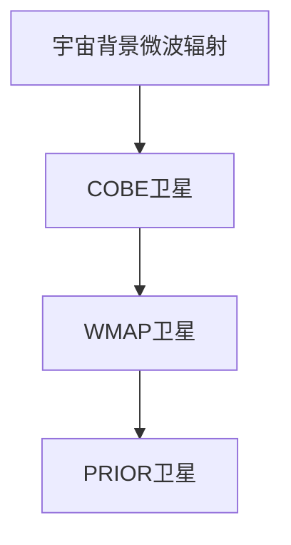

**4.1.2 宇宙中元素丰度的观测**

宇宙中元素丰度的观测主要通过Hubble太空望远镜、斯隆数字巡天和GAIA卫星等手段进行。

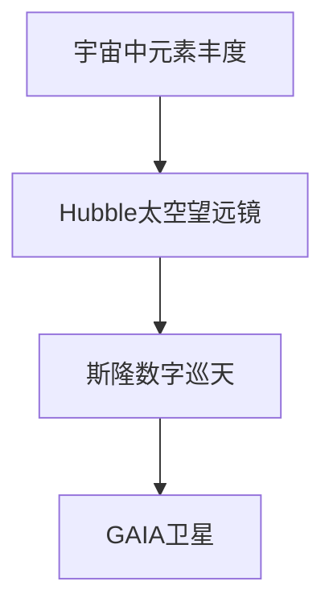

#### 4.2 宇宙概率分布的观测结果

通过宇宙背景微波辐射和宇宙中元素丰度的观测，我们可以获得宇宙概率分布的观测结果。

**4.2.1 宇宙背景微波辐射的观测结果**

宇宙背景微波辐射的观测结果揭示了宇宙背景微波辐射的黑体谱形状、温度波动和极化测量。

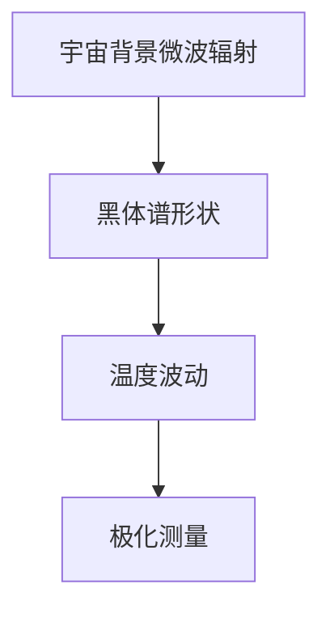

**4.2.2 宇宙中元素丰度的观测结果**

宇宙中元素丰度的观测结果揭示了宇宙中氢、氦和重元素的丰度比。

```mermaid
graph TD
A[宇宙中元素丰度] --> B[\frac{^4He}{^1H}比]
B --> C[\frac{^3He}{^1H}比]
C --> D[重元素丰度]
```

### 第五部分：宇宙的概率分布与未来

#### 5.1 宇宙概率分布的意义

宇宙概率分布的研究对于理解宇宙的起源、演化和结构形成具有重要意义。通过宇宙概率分布的研究，我们可以更好地理解宇宙的本质和演化规律。

#### 5.2 宇宙概率分布的未来研究方向

未来宇宙概率分布的研究将集中在以下几个方面：

1. 提高观测精度，获取更详细的宇宙背景微波辐射和宇宙中元素丰度数据。
2. 探索宇宙中概率分布模型与宇宙学参数之间的关系。
3. 深入研究宇宙中的随机性和混沌现象。
4. 发展新的理论模型，如量子宇宙学和多元宇宙理论。

#### 5.3 总结

宇宙是否是一个巨大的概率分布是一个复杂且有趣的问题。通过本文的探讨，我们了解了宇宙的概率分布与宇宙学模型、观测方法和未来研究方向。尽管目前仍有许多未知和挑战，但我们可以期待未来的研究将带来更多关于宇宙本质的认识。

### 作者信息：

作者：AI天才研究院/AI Genius Institute & 禅与计算机程序设计艺术 /Zen And The Art of Computer Programming

