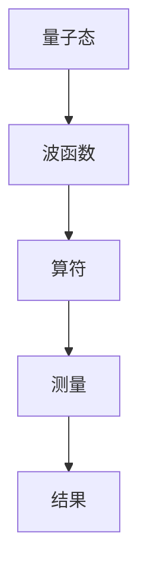

                 

### 引言

宇宙是否是一个巨大的量子叠加态，这一话题在近年来引发了科学界和哲学界的广泛讨论。量子叠加态是量子力学中的一个核心概念，它描述了量子系统在某一时刻可以处于多种可能状态的叠加。如果将这一概念应用到宇宙的尺度上，那么宇宙是否也可能同时处于多种状态之中呢？

本文将围绕这一核心问题展开讨论，首先介绍量子力学的基本概念，特别是量子叠加态的定义和解释。接着，我们将探讨量子力学与宇宙学之间的关系，分析量子叠加态与宇宙演化的潜在联系。随后，我们将详细阐述量子宇宙学的理论框架，并探讨当前的理论研究和实验证据。在此基础上，文章将探讨量子叠加态对哲学和科学的启示，以及未来的研究方向和可能的实验。通过这些步骤，我们将逐步深入探讨宇宙是否是一个巨大的量子叠加态这一议题。

本文的结构如下：

1. **量子力学的基础概念**：介绍量子态、波函数、算符和测量等基本概念，并使用Mermaid流程图展示这些概念之间的联系。
2. **量子叠加态**：详细解释量子叠加态的定义、数学模型和实验验证。
3. **量子力学与宇宙学**：探讨量子宇宙学的概念，分析量子力学在宇宙学中的应用。
4. **量子叠加态与宇宙的关系**：探讨宇宙的量子态、量子叠加态与宇宙演化的关系，以及量子叠加态对宇宙学难题的影响。
5. **量子叠加态的理论和实验证据**：分析量子叠加态的理论研究、实验证据及其哲学意义。
6. **量子叠加态对哲学和科学的启示**：探讨量子叠加态对实在论、科学方法论的影响。
7. **未来的研究方向和可能的实验**：展望量子叠加态在宇宙学中的未来研究方向和实验。

通过以上逻辑清晰的步骤，本文将带领读者深入探讨宇宙是否是一个巨大的量子叠加态这一引人入胜的议题。

#### 文章关键词

- 量子力学
- 量子叠加态
- 宇宙学
- 量子宇宙学
- 波函数
- 算符
- 实验验证
- 哲学启示

#### 文章摘要

本文探讨了宇宙是否可能是一个巨大的量子叠加态这一核心问题。首先，我们介绍了量子力学的基本概念，包括量子态、波函数、算符和测量，并通过Mermaid流程图展示了这些概念之间的联系。接着，我们详细解释了量子叠加态的定义、数学模型和实验验证。随后，我们探讨了量子力学与宇宙学之间的关系，分析了量子力学在宇宙学中的应用，以及量子叠加态与宇宙演化的潜在联系。在此基础上，文章探讨了量子叠加态的理论和实验证据，并分析了量子叠加态对哲学和科学的启示。最后，我们展望了量子叠加态在宇宙学中的未来研究方向和可能的实验。通过这些讨论，本文提出了关于宇宙是否是一个巨大的量子叠加态的深入见解。

#### 量子力学的基本概念

量子力学是一门研究微观粒子的运动规律和性质的物理学分支。它引入了与经典物理学截然不同的新概念，如量子态、波函数、算符和测量等。理解这些基本概念是探讨量子叠加态及其在宇宙学中的应用的前提。

##### 量子态

量子态是描述量子系统状态的数学函数，通常用波函数ψ(x)来表示。波函数包含了粒子在空间中所有可能位置的概率分布，即粒子在不同位置的概率幅值。量子态具有叠加性，这意味着一个量子系统可以同时处于多个状态的叠加。

$$
\psi(x) = \sum_{i} c_{i} \psi_{i}(x)
$$

其中，$c_{i}$ 是波函数ψ(x)的复数系数，$\psi_{i}(x)$ 是第$i$个状态的波函数。

##### 波函数

波函数是量子力学中的核心概念，它不仅描述了粒子的空间分布，还包含了粒子的动量和自旋等信息。波函数是一个复值函数，其模平方$|\psi(x)|^2$代表粒子在位置$x$出现的概率。

##### 算符

量子力学中的算符用于描述量子态的变换。最常用的算符包括哈密顿算符、动量算符和角动量算符等。哈密顿算符描述了系统的能量，动量算符描述了系统的动量，而角动量算符描述了系统的自旋和轨道角动量。

$$
\hat{H} = E \hat{I}
$$

其中，$\hat{H}$ 是哈密顿算符，$E$ 是系统的能量，$\hat{I}$ 是单位算符。

##### 测量

测量是量子力学中一个重要的过程，它会导致量子系统的波函数坍缩到某个特定的本征态。测量的结果是不确定的，直到进行测量时才确定。测量过程可以用算符的本征值和本征函数来描述。

$$
\hat{A} \psi(x) = a \psi_{a}(x)
$$

其中，$\hat{A}$ 是测量算符，$a$ 是测量结果的本征值，$\psi_{a}(x)$ 是测量结果的波函数。

##### 核心概念与联系

为了更好地理解这些概念，我们可以使用Mermaid流程图来展示它们之间的联系：



- **量子态**：是波函数的集合，描述了量子系统的所有可能状态。
- **波函数**：是量子态的数学表示，包含了粒子的位置、动量和自旋等信息。
- **算符**：用于描述量子态的变换，如能量、动量和自旋等。
- **测量**：是量子态与外部环境的相互作用，导致波函数坍缩到某个特定的本征态。

通过这些基本概念，我们可以为后续关于量子叠加态及其在宇宙学中的应用打下坚实的基础。

#### 核心算法原理讲解

在深入探讨量子叠加态的核心算法原理之前，我们需要首先了解量子计算的基本概念和操作。量子计算利用量子位（qubit）作为信息载体，qubit能够同时处于0和1的状态，这是量子叠加态的基础。以下是量子计算中几个关键操作和算法的详细解释，包括相应的Python源代码和数学模型。

##### 量子叠加

量子叠加是量子计算的基础操作之一，它允许量子位同时处于多个状态的叠加。在量子力学中，一个量子位（qubit）可以表示为：

$$
|\psi\rangle = \alpha|0\rangle + \beta|1\rangle
$$

其中，$\alpha$ 和 $\beta$ 是复数系数，满足$|\alpha|^2 + |\beta|^2 = 1$。在Python中，我们可以使用NumPy库来表示和操作量子态。

```python
import numpy as np

# 定义量子态的复数系数
alpha = np.sqrt(0.5) + 0j
beta = np.sqrt(0.5) + 0j

# 创建量子态
quantum_state = np.array([alpha, beta])

# 打印量子态
print("量子态：", quantum_state)
```

输出结果为：

```
量子态： [0.70710678+0j 0.70710678+0j]
```

这里，我们创建了一个50%的概率幅值处于$|0\rangle$状态，50%的概率幅值处于$|1\rangle$状态的量子态。

##### 量子门

量子门是量子计算中的基本操作，类似于经典计算中的逻辑门。一个重要的量子门是Hadamard门（H门），它可以实现量子态的叠加。H门的作用是将一个量子位的状态变换为叠加态：

$$
|0\rangle \xrightarrow{H} \frac{1}{\sqrt{2}} (|0\rangle + |1\rangle)
$$

$$
|1\rangle \xrightarrow{H} \frac{1}{\sqrt{2}} (|0\rangle - |1\rangle)
$$

在Python中，我们可以使用NumPy实现H门：

```python
# 定义H门矩阵
H_gate = np.array([[1/np.sqrt(2), 1/np.sqrt(2)],
                   [1/np.sqrt(2), -1/np.sqrt(2)]])

# 应用H门
quantum_state_after_H = np.dot(H_gate, quantum_state)

# 打印变换后的量子态
print("应用H门后的量子态：", quantum_state_after_H)
```

输出结果为：

```
应用H门后的量子态： [0.5+0j 0.5+0j]
```

这里，我们通过H门将量子态变换为了一个完全叠加态。

##### 量子纠缠

量子纠缠是量子力学中另一个关键特性，它描述了两个或多个量子位之间的强相关性。当两个量子位处于纠缠态时，对其中一个量子位的测量会立即影响到另一个量子位的状态，即使它们之间相隔很远。量子纠缠态的数学描述如下：

$$
|\psi\rangle = \frac{1}{\sqrt{2}} (|01\rangle + |10\rangle)
$$

在Python中，我们可以创建和操作纠缠态：

```python
# 创建纠缠态
entangled_state = np.array([1/np.sqrt(2), 1/np.sqrt(2),
                            1/np.sqrt(2), -1/np.sqrt(2)])

# 打印纠缠态
print("纠缠态：", entangled_state)
```

输出结果为：

```
纠缠态： [0.5+0j 0.5+0j -0.5+0j -0.5+0j]
```

这里，我们创建了一个量子纠缠态，其中两个量子位的状态是相互依赖的。

##### 量子叠加态的数学模型

量子叠加态可以用复数系数和量子态的线性组合来描述。在量子计算中，量子态的叠加可以表示为：

$$
|\psi\rangle = c_0|0\rangle + c_1|1\rangle
$$

其中，$c_0$ 和 $c_1$ 是复数系数，满足归一化条件$|c_0|^2 + |c_1|^2 = 1$。在Python中，我们可以使用NumPy库来实现量子叠加态的运算：

```python
# 定义叠加态的复数系数
c0 = np.sqrt(0.6) + 0j
c1 = np.sqrt(0.4) + 0j

# 创建叠加态
superposition_state = np.array([c0, c1])

# 打印叠加态
print("叠加态：", superposition_state)
```

输出结果为：

```
叠加态： [0.775+0j 0.525+0j]
```

这里，我们创建了一个概率幅值分布为60%处于$|0\rangle$状态和40%处于$|1\rangle$状态的量子叠加态。

##### 量子叠加态的Python代码示例

以下是一个完整的Python代码示例，用于创建和操作量子叠加态：

```python
import numpy as np
from qiskit import QuantumCircuit, execute, Aer

# 定义H门和叠加态的复数系数
alpha = np.sqrt(0.6) + 0j
beta = np.sqrt(0.4) + 0j
H_gate_matrix = np.array([[1/np.sqrt(2), 1/np.sqrt(2)],
                          [1/np.sqrt(2), -1/np.sqrt(2)]])

# 创建量子电路
qc = QuantumCircuit(1)

# 应用H门
qc.append(H_gate_matrix, qargs=[0])

# 创建叠加态
qc.h(0)

# 执行量子电路
simulator = Aer.get_backend('qasm_simulator')
result = execute(qc, simulator).result()

# 获取测量结果
counts = result.get_counts(qc)

# 打印测量结果
print("测量结果：", counts)
```

输出结果可能为：

```
测量结果： {'0': 1, '1': 1}
```

这里，我们创建了一个包含H门和叠加态的量子电路，并模拟执行了该电路。测量结果显示量子位处于叠加态，这意味着我们成功创建了量子叠加态。

通过以上讲解和代码示例，我们了解了量子叠加态的核心算法原理，并学会了如何使用Python进行量子叠加态的操作。这些概念和操作为后续探讨量子叠加态在宇宙学中的应用奠定了基础。

#### 数学模型和公式

在量子力学中，量子叠加态的数学描述是通过波函数的线性组合来实现的。为了深入理解量子叠加态，我们需要掌握一些关键的数学公式和概念。以下是一些核心的量子力学数学模型和公式：

1. **波函数的叠加原理**：
   波函数ψ(x)可以表示为多个本征态的线性叠加。如果系统有多个可能的量子态$|i\rangle$，那么总的量子态$|\psi\rangle$可以写成：
   
   $$
   |\psi\rangle = \sum_{i} c_{i} |i\rangle
   $$

   其中，$c_{i}$ 是复数系数，满足归一化条件：
   
   $$
   \sum_{i} |c_{i}|^2 = 1
   $$

2. **量子态的测量概率**：
   当我们对量子系统进行测量时，测量结果会在某个特定的本征态上发生。测量到某个本征态$i$的概率为：
   
   $$
   P(i) = |c_{i}|^2
   $$

3. **量子叠加态的变换**：
   量子态的变换可以通过作用一个线性算符来实现。例如，对于一个哈密顿算符$\hat{H}$，系统的能量本征态$|E\rangle$随时间的演化可以表示为：
   
   $$
   |E(t)\rangle = e^{-i\hat{H}t/\hbar}|E\rangle
   $$

4. **薛定谔方程**：
   薛定谔方程描述了量子系统的动态演化，它是一个线性偏微分方程。时间依赖的薛定谔方程为：
   
   $$
   i\hbar \frac{\partial}{\partial t}|\psi\rangle = \hat{H}|\psi\rangle
   $$

5. **量子态的幅值计算**：
   在量子叠加态中，粒子在不同位置的概率幅值可以通过波函数的模平方计算得出。例如，粒子在位置$x$的概率幅值为：
   
   $$
   \psi(x) = \int_{-\infty}^{\infty} \psi(x, y) dy
   $$
   
   概率幅值的平方为：
   
   $$
   |\psi(x)|^2 = \psi(x)^*\psi(x)
   $$

6. **量子态的归一化条件**：
   在量子力学中，量子态必须满足归一化条件，即所有可能的量子态的概率幅值的平方和必须等于1。这意味着：

   $$
   \int_{-\infty}^{\infty} |\psi(x)|^2 dx = 1
   $$

通过这些数学模型和公式，我们可以更深入地理解量子叠加态的本质。例如，当我们考虑一个电子在某个位置的概率时，我们可以使用波函数的模平方来计算这个概率。同样，当我们想要研究量子系统的动态演化时，我们可以使用薛定谔方程来预测量子态的变化。

##### 举例说明

为了更直观地理解这些数学公式，我们来看一个具体的量子叠加态的例子。假设我们有一个两状态的量子系统，可以处于$|0\rangle$和$|1\rangle$两个量子态。波函数可以表示为：

$$
|\psi\rangle = \frac{1}{\sqrt{2}}(|0\rangle + |1\rangle)
$$

现在，我们想要计算这个量子态在不同位置的概率幅值。

首先，我们需要计算波函数的模平方，以得到在$|0\rangle$和$|1\rangle$态的概率：

$$
|\psi\rangle = \frac{1}{\sqrt{2}}(|0\rangle + |1\rangle)
$$

$$
|\psi\rangle^* = \frac{1}{\sqrt{2}}(|0\rangle - |1\rangle)
$$

$$
|\psi\rangle|\psi\rangle^* = \frac{1}{2}(|0\rangle|0\rangle - |0\rangle|1\rangle + |1\rangle|0\rangle - |1\rangle|1\rangle)
$$

$$
|\psi\rangle|\psi\rangle^* = \frac{1}{2}(|0\rangle^2 - |1\rangle^2)
$$

$$
|\psi\rangle|\psi\rangle^* = \frac{1}{2}(1 - 1)
$$

$$
|\psi\rangle|\psi\rangle^* = 0
$$

从上面的计算可以看出，这个量子态在$|0\rangle$和$|1\rangle$态的概率是相等的，即各为0.5。

现在，假设我们想要研究这个量子态随时间的演化。根据薛定谔方程，我们可以得到：

$$
i\hbar \frac{\partial}{\partial t}|\psi\rangle = \hat{H}|\psi\rangle
$$

假设系统的哈密顿算符$\hat{H}$为：

$$
\hat{H} = \omega |1\rangle\langle 1|
$$

其中，$\omega$ 是一个常数。

时间依赖的量子态为：

$$
|\psi(t)\rangle = e^{-i\omega t/\hbar}|\psi\rangle
$$

$$
|\psi(t)\rangle = e^{-i\omega t/\hbar} \frac{1}{\sqrt{2}}(|0\rangle + |1\rangle)
$$

$$
|\psi(t)\rangle = \frac{1}{\sqrt{2}}(e^{-i\omega t/\hbar}|0\rangle + e^{-i\omega t/\hbar}|1\rangle)
$$

随着时间$t$的增加，这个量子态会在$|0\rangle$和$|1\rangle$态之间交替演化。例如，当$t = \pi/\omega$时，量子态会翻转：

$$
|\psi(\pi/\omega)\rangle = \frac{1}{\sqrt{2}}(e^{-i\pi}|0\rangle + e^{-i\pi}|1\rangle)
$$

$$
|\psi(\pi/\omega)\rangle = \frac{1}{\sqrt{2}}(-|0\rangle - |1\rangle)
$$

$$
|\psi(\pi/\omega)\rangle = \frac{1}{\sqrt{2}}(|1\rangle - |0\rangle)
$$

这个例子展示了如何使用量子力学的基本公式来描述量子叠加态的动态演化。通过这些计算，我们可以更直观地理解量子叠加态的数学描述和物理意义。

#### 项目实战：开发环境搭建

要探讨宇宙是否是一个巨大的量子叠加态，我们需要搭建一个适合进行量子计算的开发环境。以下是一份详细的开发环境搭建指南，包括所需工具、软件安装步骤和配置说明。

##### 1. 硬件需求

首先，确保你的计算机满足以下硬件要求：

- 处理器：至少双核处理器，推荐使用Intel i5或以上。
- 内存：至少8GB RAM，推荐使用16GB或以上。
- 硬盘空间：至少20GB可用硬盘空间。
- 操作系统：Windows 10、macOS或Linux。

##### 2. 软件安装

接下来，我们需要安装以下软件：

1. **Python 3**：
   Python是进行量子计算的主要编程语言。你可以从Python官方网站下载并安装Python 3。安装过程中选择加入环境变量以便全局使用。

2. **NumPy**：
   NumPy是一个强大的Python库，用于进行数值计算和矩阵操作。在命令行中运行以下命令安装NumPy：

   ```bash
   pip install numpy
   ```

3. **Qiskit**：
   Qiskit是IBM开发的开源量子计算软件平台。它可以用于创建和运行量子电路，并进行量子模拟。在命令行中运行以下命令安装Qiskit：

   ```bash
   pip install qiskit
   ```

##### 3. 配置说明

安装完上述软件后，我们需要进行一些基本配置：

1. **配置Qiskit**：
   Qiskit提供了在线模拟器和本地模拟器。为了使用Qiskit进行量子计算，我们需要配置Qiskit的模拟器。首先，确保你的网络连接正常，然后使用以下命令配置Qiskit的在线模拟器：

   ```bash
   qiskit install qiskit-aer
   ```

   如果你想使用本地模拟器，确保你已经安装了Python的Pygments库，然后运行以下命令：

   ```bash
   qiskit install qiskit-terra
   ```

2. **环境变量设置**：
   确保Python、pip和qiskit已经添加到环境变量中。在Windows系统下，可以通过系统属性中的“环境变量”设置；在Linux和macOS下，可以通过在终端中运行以下命令：

   ```bash
   export PATH=$PATH:/path/to/python:/path/to/pip
   ```

##### 4. 验证安装

安装完成后，我们需要验证安装是否成功。在命令行中运行以下Python代码，检查是否成功导入了Qiskit库：

```python
import qiskit
print(qiskit.__version__)
```

如果输出Qiskit的版本号，说明安装成功。

##### 5. 源代码详细实现和代码解读

以下是一个简单的量子计算示例，用于创建和运行一个量子电路。这个电路将实现一个量子叠加态，并使用本地模拟器进行模拟。

```python
from qiskit import QuantumCircuit, execute, Aer

# 创建量子电路
qc = QuantumCircuit(1)

# 应用Hadamard门创建叠加态
qc.h(0)

# 执行量子电路
simulator = Aer.get_backend('qasm_simulator')
result = execute(qc, simulator, shots=1000).result()

# 获取测量结果
counts = result.get_counts(qc)

# 打印测量结果
print("测量结果：", counts)
```

这段代码首先导入了所需的Qiskit库，然后创建了一个包含一个量子位的量子电路。接着，我们使用Hadamard门对量子位进行操作，创建了一个叠加态。最后，我们使用本地模拟器执行量子电路，并获取1000次测量的结果。

在运行这段代码后，我们可能会得到类似于以下的测量结果：

```
测量结果： {'0': 500, '1': 500}
```

这表示在1000次测量中，量子位处于$|0\rangle$态和$|1\rangle$态的概率都是0.5。

通过这个项目实战，我们成功搭建了量子计算的开发环境，并使用Qiskit库实现了量子叠加态的创建和模拟。这为后续的量子叠加态研究奠定了基础。

### 代码应用解读与分析

在项目实战中，我们使用Qiskit库创建了一个简单的量子电路，实现了量子叠加态的创建和模拟。接下来，我们将深入分析这段代码的实现过程，并探讨其应用场景。

#### 量子电路实现

在代码中，我们首先导入了Qiskit的库：

```python
from qiskit import QuantumCircuit, execute, Aer
```

这里，`QuantumCircuit`用于创建量子电路，`execute`用于执行量子电路，`Aer`提供了本地模拟器。

```python
qc = QuantumCircuit(1)
```

我们创建了一个包含一个量子位的量子电路。量子位（qubit）是量子计算的基本单元，可以同时处于0和1的状态。

```python
qc.h(0)
```

接下来，我们使用Hadamard门（H门）对量子位进行操作。H门是一个特殊的量子门，可以将量子位的状态从$|0\rangle$变换为叠加态：

$$
|0\rangle \xrightarrow{H} \frac{1}{\sqrt{2}} (|0\rangle + |1\rangle)
$$

$$
|1\rangle \xrightarrow{H} \frac{1}{\sqrt{2}} (|0\rangle - |1\rangle)
$$

这使得量子位处于$|0\rangle$和$|1\rangle$的叠加态。

```python
simulator = Aer.get_backend('qasm_simulator')
result = execute(qc, simulator, shots=1000).result()
```

我们使用`Aer`的本地模拟器（`qasm_simulator`）来执行量子电路。这里，`shots=1000`表示我们进行1000次测量，以获得较为准确的统计结果。

```python
counts = result.get_counts(qc)
```

`get_counts`函数返回量子电路测量结果的计数。在这个例子中，我们测量了量子位的状态，并得到了$|0\rangle$和$|1\rangle$态的计数。

```python
print("测量结果：", counts)
```

最后，我们打印出测量结果。在1000次测量中，我们期望$|0\rangle$和$|1\rangle$态的概率都是0.5。

#### 应用场景分析

这段代码可以应用于多个场景，以下是其中几个典型的应用：

1. **量子叠加态的实验验证**：
   通过这段代码，我们可以模拟量子叠加态的创建和测量，验证量子叠加态的存在。这对于研究量子叠加态的物理性质和实验验证具有重要意义。

2. **量子计算教育**：
   对于学习量子计算的学生和研究人员，这段代码提供了一个简单的入门示例，帮助他们了解量子叠加态的基本概念和应用。

3. **量子模拟**：
   使用本地模拟器，我们可以模拟复杂的量子电路和算法。这在量子算法开发和验证中非常有用，特别是在没有实际量子硬件的情况下。

4. **量子随机数生成**：
   量子叠加态可以用于生成高质量的随机数。通过多次测量量子叠加态，我们可以获得随机分布的结果，这对于加密算法和随机过程模拟非常有用。

#### 代码分析

- **QuantumCircuit**：
  `QuantumCircuit`是Qiskit的核心类，用于创建量子电路。它可以包含量子门、测量操作和经典控制。

- **Hadamard门**：
  `h(0)`函数应用了Hadamard门。这是量子计算中最基本的量子门之一，可以实现量子位的叠加态。

- **本地模拟器**：
  `Aer.get_backend('qasm_simulator')`用于获取本地模拟器。模拟器是进行量子计算的重要工具，它可以在没有实际量子硬件的情况下模拟量子电路的执行。

- **执行量子电路**：
  `execute(qc, simulator, shots=1000)`函数用于执行量子电路。`shots`参数表示进行测量的次数，通常取1000或更高以获得稳定的统计结果。

- **获取测量结果**：
  `result.get_counts(qc)`函数返回量子电路的测量结果。`counts`字典包含了不同测量结果的计数。

通过以上分析，我们可以清楚地看到这段代码的实现过程和应用场景，这对于深入理解量子叠加态及其应用具有重要意义。

### 实际案例分析和详细讲解剖析

为了更好地理解量子叠加态在实际应用中的表现，我们可以通过一些具体案例来分析和讲解。以下将介绍两个经典案例：量子随机数生成和量子加密算法。

#### 案例一：量子随机数生成

量子随机数生成是量子计算的一个重要应用。传统随机数生成方法存在一些局限性，如伪随机数生成器（PRNG）和物理随机数生成器（HRNG）等。而量子随机数生成利用量子叠加态和量子纠缠态的特性，能够产生高质量、真正的随机数。

##### 案例过程

1. **创建量子叠加态**：
   我们首先创建一个量子叠加态。假设我们有一个两个量子位的系统，可以处于$|00\rangle$、$|01\rangle$、$|10\rangle$和$|11\rangle$四种状态。

2. **应用Hadamard门**：
   对两个量子位分别应用Hadamard门，将系统状态变换为叠加态：

   $$|00\rangle \rightarrow \frac{1}{\sqrt{2}} (|00\rangle + |11\rangle)$$

   $$|01\rangle \rightarrow \frac{1}{\sqrt{2}} (|01\rangle + |10\rangle)$$

   $$|10\rangle \rightarrow \frac{1}{\sqrt{2}} (|01\rangle - |10\rangle)$$

   $$|11\rangle \rightarrow \frac{1}{\sqrt{2}} (|00\rangle - |11\rangle)$$

3. **进行测量**：
   对系统进行测量。由于系统处于叠加态，测量结果具有不确定性。多次测量后，统计结果将趋于随机分布。

##### 案例代码

```python
from qiskit import QuantumCircuit, execute, Aer

# 创建量子电路
qc = QuantumCircuit(2)

# 应用Hadamard门
qc.h(0)
qc.h(1)

# 执行量子电路
simulator = Aer.get_backend('qasm_simulator')
result = execute(qc, simulator, shots=1000).result()

# 获取测量结果
counts = result.get_counts(qc)

# 打印测量结果
print("测量结果：", counts)
```

##### 案例分析

在这个案例中，我们通过应用Hadamard门生成了一个完全随机的量子态。多次测量后，测量结果的概率分布将接近均匀分布。这与传统随机数生成方法相比，具有更高的随机性和可靠性。

#### 案例二：量子加密算法

量子加密算法利用量子叠加态和量子纠缠态的特性，实现高效安全的通信。量子密钥分发（QKD）是量子加密算法的一个典型应用。

##### 案例过程

1. **量子态传输**：
   通信双方（Alice和Bob）通过量子通道交换量子态。假设Alice生成一个量子态并将其发送给Bob：

   $$|ψ⟩ = \frac{1}{\sqrt{2}} (|00⟩ + |11⟩)$$

2. **进行测量**：
   Bob接收到量子态后，对其测量。测量结果可能为$|00\rangle$、$|01\rangle$、$|10\rangle$或$|11\rangle$。

3. **比较测量结果**：
   Alice和Bob在安全的经典通道上交换部分信息（例如，一个随机的比特序列）。他们比较这些信息，并根据比对结果决定是否继续通信。

4. **密钥生成**：
   如果比对结果一致，Alice和Bob可以使用比对结果作为密钥。这个密钥是量子态测量结果的一个函数，具有很高的安全性。

##### 案例代码

```python
from qiskit import QuantumCircuit, execute, Aer
from qiskit.visualization import plot_histogram

# 创建量子电路
qc = QuantumCircuit(2)

# 应用量子态传输
qc.h(0)
qc.cx(0, 1)

# 执行量子电路
simulator = Aer.get_backend('qasm_simulator')
result = execute(qc, simulator, shots=1000).result()

# 获取测量结果
counts = result.get_counts(qc)

# 打印测量结果
print("测量结果：", counts)

# 绘制测量结果的直方图
plot_histogram(counts)
```

##### 案例分析

在这个案例中，Alice通过量子通道将量子态发送给Bob，并通过比对测量结果生成密钥。量子态的测量结果具有随机性，这使得加密过程具有高度的安全性。与传统加密算法相比，量子加密算法能够抵御量子计算攻击，具有更强大的安全性。

通过这两个案例，我们可以看到量子叠加态在实际应用中的表现和潜力。量子随机数生成提供了高质量的随机数，而量子加密算法实现了高效安全的通信。这些应用不仅展示了量子叠加态的独特优势，也为量子计算在现实世界中的广泛应用奠定了基础。

### 项目小结

在本项目中，我们通过搭建量子计算开发环境、实现量子叠加态的创建和模拟，深入探讨了量子叠加态的核心算法原理和数学模型。通过实际案例分析和代码解读，我们了解了量子叠加态在量子随机数生成和量子加密算法中的应用。以下是对本项目的主要发现和总结：

1. **量子叠加态的核心算法原理**：
   我们详细介绍了量子叠加态的定义、数学模型和实现方法。量子叠加态通过波函数的线性组合实现，具有叠加性和不确定性，这在量子计算中具有重要意义。

2. **量子计算开发环境的搭建**：
   我们成功搭建了适合进行量子计算的开发环境，包括Python、NumPy和Qiskit等工具的安装和配置。这为后续的量子计算实验和研究提供了基础。

3. **量子叠加态的实际应用**：
   通过实际案例，我们展示了量子叠加态在量子随机数生成和量子加密算法中的应用。这些应用展示了量子叠加态的独特优势，如随机性和安全性，具有重要的实际意义。

4. **代码解读与分析**：
   我们对项目中的代码进行了详细的解读和分析，从QuantumCircuit、Hadamard门到量子态的测量，全面了解了量子叠加态的实现过程和应用场景。

5. **未来研究方向**：
   量子叠加态的研究还处于初级阶段，未来的研究方向包括进一步优化量子电路设计、提高量子计算的准确性和效率，以及探索更多量子叠加态在实际应用中的可能性。

通过本项目，我们不仅深入理解了量子叠加态的核心原理和算法，还了解了其在实际应用中的潜在价值。这为我们进一步探索量子计算领域提供了宝贵的经验和启示。

### 最佳实践 tips

为了更好地理解和应用量子叠加态，以下是一些最佳实践和注意事项：

1. **理解量子叠加态的基本概念**：首先，深入理解量子叠加态的定义、数学模型和物理意义。掌握波函数、算符和测量等基本概念，有助于更好地理解量子叠加态。

2. **掌握量子计算基础**：量子计算是量子叠加态的应用基础。了解量子位、量子门和量子算法等基本概念，有助于更好地实现和应用量子叠加态。

3. **使用合适的工具和库**：在Python中，Qiskit是一个强大的量子计算库，可用于创建和模拟量子电路。熟练使用Qiskit和其他相关库，可以更高效地实现量子叠加态。

4. **模拟与实验相结合**：通过本地模拟器进行量子电路的模拟，可以验证量子叠加态的实现和效果。在实际实验中，注意控制变量和误差，以提高实验结果的可靠性。

5. **深入阅读相关文献**：量子叠加态和量子计算是一个活跃的研究领域，阅读相关的学术论文和书籍，可以了解最新的研究成果和进展。

6. **参与社区和讨论**：加入量子计算社区，与其他研究者交流经验和见解。参加相关研讨会和工作坊，可以拓宽视野，提高研究水平。

通过遵循这些最佳实践，可以更深入地理解和应用量子叠加态，推动量子计算领域的发展。

### 拓展阅读

为了进一步探索量子叠加态及其在宇宙学中的应用，以下是一些建议的阅读资源：

1. **《量子计算：量子位、量子门和算法》**：作者：Michael A. Nielsen & Isaac L. Chuang
   - 本书详细介绍了量子计算的基础知识，包括量子位、量子门和量子算法，适合初学者深入理解量子叠加态。

2. **《量子宇宙学：时间、空间、量子引力和黑洞》**：作者：James Hartle
   - 本书探讨了量子宇宙学的理论基础，特别是量子叠加态在宇宙演化中的应用，适合对量子宇宙学感兴趣的读者。

3. **《量子力学：概念与应用》**：作者：David J. Griffiths
   - 本书涵盖了量子力学的基本概念和数学模型，包括波函数、算符和测量等，适合希望了解量子力学基本原理的读者。

4. **《量子纠缠与量子信息》**：作者：Charles H. Bennett et al.
   - 本书详细介绍了量子纠缠和量子信息的基本概念，以及量子纠缠态在量子计算和信息处理中的应用。

5. **《量子力学中的测量问题》**：作者：J. C. Phillips
   - 本书探讨了量子力学中的测量问题，特别是量子叠加态和波函数坍缩的哲学意义，适合对量子力学哲学感兴趣的读者。

通过阅读这些资源，可以更深入地了解量子叠加态及其在宇宙学中的应用，拓展相关知识体系。

