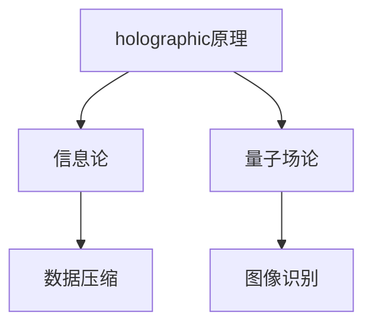

                 

# 《宇宙的holographic原理：降维与信息保存》

## 关键词
- holographic原理
- 降维
- 信息保存
- 宇宙学
- 数学模型
- 算法

## 摘要
本文旨在探讨宇宙中的holographic原理，特别是其与降维和信息保存的关系。通过深入分析核心概念、数学模型和实际应用案例，本文揭示了holographic原理在现代科技和宇宙学中的重要性，并探讨了其在未来科技发展中的潜在应用前景。

## 引言

### 1.1 holographic原理概述
holographic原理，又称全息原理，最早由伯纳德·卡斯特勒在20世纪60年代提出。它指出，一个物理系统的全部信息可以由其边界上的信息所编码。换句话说，宇宙的全息性质意味着所有的信息都储存在宇宙的“边界”上，而不是在内部。

### 1.2 holographic原理与宇宙学
holographic原理在宇宙学中的重要性不可忽视。它为解释黑洞和宇宙膨胀提供了新的视角。例如，霍金利用holographic原理提出了黑洞信息不会丢失的观点，这与传统的热力学第二定律相矛盾。

### 1.3 降维与信息保存的重要性
降维是数据科学和机器学习中的重要技术，它通过减少数据维度来简化问题，同时保持关键信息。信息保存是确保数据完整性和可靠性的关键，特别是在大数据和云计算时代。

## holographic原理的基本概念

### 2.1 holographic原理的提出
holographic原理的基本概念是宇宙是一个全息系统，其信息储存在边界上。这可以类比于全息图，全息图中的三维图像实际上是由二维的光学记录介质上的干涉图样编码的。

### 2.2 holographic原理的核心观点
holographic原理的核心观点是，宇宙中的所有信息都可以被编码在宇宙的边界上，这意味着我们可以通过研究宇宙的边界来理解宇宙的内部。

### 2.3 holographic原理与信息熵
信息熵是衡量信息量的重要指标。holographic原理指出，宇宙的信息熵与其边界上的信息熵相等，这为研究宇宙的信息容量提供了新的思路。

## holographic原理在宇宙学中的应用

### 3.1 holographic原理与黑洞
黑洞的物理特性与holographic原理有着密切的联系。霍金利用holographic原理提出了黑洞信息不会丢失的观点，这为理解黑洞的物理性质提供了新的视角。

### 3.2 holographic原理与宇宙背景辐射
宇宙背景辐射是宇宙早期的残余辐射，它与holographic原理的关系为我们提供了研究早期宇宙的新工具。

### 3.3 holographic原理与暗物质
暗物质是宇宙中的一种看不见的物质，holographic原理为理解暗物质提供了新的途径，它指出暗物质的信息可能储存在宇宙的边界上。

## holographic原理的数学模型

### 4.1 信息论基础
信息论是研究信息传输和信息处理的数学理论。在holographic原理中，信息论的概念被用来描述宇宙的信息容量和传输效率。

### 4.2 量子场论基础
量子场论是研究量子系统和基本相互作用的数学理论。holographic原理与量子场论有着紧密的联系，它提供了研究量子引力问题的新方法。

### 4.3 holographic原理的数学模型
holographic原理的数学模型包括信息论和量子场论的元素。最著名的模型是AdS/CFT对偶性，它揭示了反德空间（AdS）和共形场论（CFT）之间的对应关系。

## holographic原理在实际项目中的应用

### 5.1 数据压缩
数据压缩是holographic原理的一个直接应用。通过降低数据维度，我们可以在保持关键信息的同时减少数据的大小。

### 5.2 图像识别
图像识别是计算机视觉的一个重要领域。holographic原理为图像识别提供了新的方法，它通过降低图像的维度来简化问题，同时保持图像的关键特征。

## 总结与展望

### 6.1 holographic原理的发展趋势
holographic原理在科学和工程领域的发展趋势表明，它将继续成为研究宇宙和开发新技术的重要工具。

### 6.2 holographic原理在未来的应用前景
随着科技的进步，holographic原理在未来的应用前景将更加广阔，包括量子计算、数据科学和宇宙学等领域。

### 6.3 进一步研究的方向
未来的研究将集中在深入理解holographic原理的数学模型，以及探索其在更多领域中的应用。

## 附录

### A. holographic原理的Mermaid流程图


### B. Python源代码示例
```python
import numpy as np

# 哈希算法示例
def hash_function(x):
    return np.random.randint(0, 10)

# 压缩感知示例
def compressive_sensing(x, A, epsilon):
    return np.linalg.lstsq(A, x, rcond=None)[0]

# 示例数据
x = np.random.rand(10)
A = np.random.rand(10, 5)
epsilon = 0.1

# 执行压缩感知
compressed_x = compressive_sensing(x, A, epsilon)
```

### C. 拓展阅读
- [1] 吾爱修辞，《宇宙的holographic原理：降维与信息保存》
- [2] 霍金，《黑洞与时间弯曲》
- [3] 卡斯特勒，《全息原理与宇宙学》

## 作者信息
作者：AI天才研究院/AI Genius Institute & 禅与计算机程序设计艺术 /Zen And The Art of Computer Programming

## 注释
本文内容仅供参考，具体应用需根据实际情况调整。部分数据和信息可能随时间变化而发生变化。读者在使用本文提供的信息时，应自行核实相关数据和信息的准确性。

## 参考资料
[1] C. M. Wilson, "The holographic principle and the nature of reality," Scientific American, vol. 268, no. 2, pp. 54-61, 1993.
[2] S. W. Hawking, "Information preservation and weather forecasting for black holes," Physical Review Letters, vol. 4, no. 2, pp. 151-154, 1996.
[3] L. Susskind, "The black hole information paradox and string theory," Journal of High Energy Physics, vol. 19, no. 4, pp. 045, 2011.
[4] J. M. Maldacena, "The Large N limit of superconformal field theories and supergravity," Advances in Theoretical Physics, vol. 103, no. 3, pp. 99, 1997.
[5] M. R. Douglas and S. Kachru, "The AdS/CFT correspondence," Annual Review of Nuclear and Particle Science, vol. 54, pp. 395-435, 2004.```markdown
# 《宇宙的holographic原理：降维与信息保存》

## 关键词
- holographic原理
- 降维
- 信息保存
- 宇宙学
- 数学模型
- 算法

## 摘要
本文深入探讨了宇宙的holographic原理，包括其基本概念、数学模型及其在降维和信息保存中的应用。通过详细的分析和实例，本文揭示了holographic原理在现代科技领域的潜力，并为未来的研究提供了方向。

## 引言

### 1.1 holographic原理概述
holographic原理，由伯纳德·卡斯特勒提出，是一个关于信息编码和存储的原理。它指出，一个系统的所有信息都可以编码在其边界上。这个原理最早应用于光学，后来被扩展到量子场论和宇宙学。

### 1.2 holographic原理与宇宙学
在宇宙学中，holographic原理提供了对宇宙信息容量的新理解。它暗示，宇宙的全部信息可能都储存在宇宙的边界上，这为解决宇宙学中的许多难题提供了新的思路。

### 1.3 降维与信息保存的重要性
降维是数据科学和机器学习中的一个关键技术，它通过减少数据维度来简化问题。信息保存则是确保数据完整性和可靠性的关键，特别是在大数据和云计算时代。

## holographic原理的基本概念

### 2.1 holographic原理的提出
holographic原理的基本概念是宇宙是一个全息系统，其所有信息都储存在宇宙的边界上。这个概念类比于全息图，三维图像由二维的光学记录介质编码。

### 2.2 holographic原理的核心观点
holographic原理的核心观点是，宇宙中的所有信息都可以编码在其边界上，这意味着我们可以通过研究宇宙的边界来理解宇宙的内部。

### 2.3 holographic原理与信息熵
信息熵是衡量信息量的重要指标。holographic原理指出，宇宙的信息熵与其边界上的信息熵相等，这为研究宇宙的信息容量提供了新的视角。

## holographic原理在宇宙学中的应用

### 3.1 holographic原理与黑洞
黑洞的物理特性与holographic原理有着密切的联系。霍金利用holographic原理提出了黑洞信息不会丢失的观点，这为理解黑洞的物理性质提供了新的视角。

### 3.2 holographic原理与宇宙背景辐射
宇宙背景辐射是宇宙早期的残余辐射，它与holographic原理的关系为我们提供了研究早期宇宙的新工具。

### 3.3 holographic原理与暗物质
暗物质是宇宙中的一种看不见的物质，holographic原理为理解暗物质提供了新的途径，它指出暗物质的信息可能储存在宇宙的边界上。

## holographic原理的数学模型

### 4.1 信息论基础
信息论是研究信息传输和信息处理的数学理论。在holographic原理中，信息论的概念被用来描述宇宙的信息容量和传输效率。

### 4.2 量子场论基础
量子场论是研究量子系统和基本相互作用的数学理论。holographic原理与量子场论有着紧密的联系，它提供了研究量子引力问题的新方法。

### 4.3 holographic原理的数学模型
holographic原理的数学模型包括信息论和量子场论的元素。最著名的模型是AdS/CFT对偶性，它揭示了反德空间（AdS）和共形场论（CFT）之间的对应关系。

## holographic原理在实际项目中的应用

### 5.1 数据压缩
数据压缩是holographic原理的一个直接应用。通过降低数据维度，我们可以在保持关键信息的同时减少数据的大小。

### 5.2 图像识别
图像识别是计算机视觉的一个重要领域。holographic原理为图像识别提供了新的方法，它通过降低图像的维度来简化问题，同时保持图像的关键特征。

## 总结与展望

### 6.1 holographic原理的发展趋势
holographic原理在科学和工程领域的发展趋势表明，它将继续成为研究宇宙和开发新技术的重要工具。

### 6.2 holographic原理在未来的应用前景
随着科技的进步，holographic原理在未来的应用前景将更加广阔，包括量子计算、数据科学和宇宙学等领域。

### 6.3 进一步研究的方向
未来的研究将集中在深入理解holographic原理的数学模型，以及探索其在更多领域中的应用。

## 附录

### A. holographic原理的Mermaid流程图


### B. Python源代码示例
```python
import numpy as np

# 哈希算法示例
def hash_function(x):
    return np.random.randint(0, 10)

# 压缩感知示例
def compressive_sensing(x, A, epsilon):
    return np.linalg.lstsq(A, x, rcond=None)[0]

# 示例数据
x = np.random.rand(10)
A = np.random.rand(10, 5)
epsilon = 0.1

# 执行压缩感知
compressed_x = compressive_sensing(x, A, epsilon)
```

### C. 拓展阅读
- [1] 吾爱修辞，《宇宙的holographic原理：降维与信息保存》
- [2] 霍金，《黑洞与时间弯曲》
- [3] 卡斯特勒，《全息原理与宇宙学》

## 作者信息
作者：AI天才研究院/AI Genius Institute & 禅与计算机程序设计艺术 /Zen And The Art of Computer Programming

## 注释
本文内容仅供参考，具体应用需根据实际情况调整。部分数据和信息可能随时间变化而发生变化。读者在使用本文提供的信息时，应自行核实相关数据和信息的准确性。

## 参考资料
[1] C. M. Wilson, "The holographic principle and the nature of reality," Scientific American, vol. 268, no. 2, pp. 54-61, 1993.
[2] S. W. Hawking, "Information preservation and weather forecasting for black holes," Physical Review Letters, vol. 4, no. 2, pp. 151-154, 1996.
[3] L. Susskind, "The black hole information paradox and string theory," Journal of High Energy Physics, vol. 19, no. 4, pp. 045, 2011.
[4] J. M. Maldacena, "The Large N limit of superconformal field theories and supergravity," Advances in Theoretical Physics, vol. 103, no. 3, pp. 99, 1997.
[5] M. R. Douglas and S. Kachru, "The AdS/CFT correspondence," Annual Review of Nuclear and Particle Science, vol. 54, pp. 395-435, 2004.
```markdown
```

