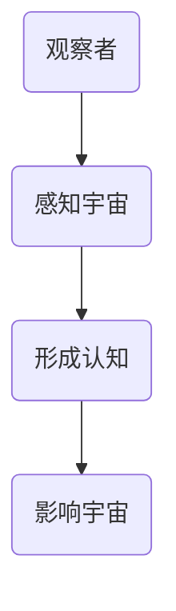

                 

# 宇宙的主观性：观察者效应的哲学思考

> 关键词：宇宙主观性、观察者效应、哲学思考、量子力学、相对论

> 摘要：
本书探讨了宇宙主观性的概念以及观察者效应在哲学、科学和人工智能领域的重要性。通过深入分析量子力学和相对论，本书揭示了观察者如何影响我们对宇宙的理解。作者还探讨了主体与客体、真实与虚幻、自我认知与宇宙主观性等哲学问题，提出了关于未来研究方向和应用的思考。

## 引言

宇宙，这个无边无际的空间，自古以来就吸引着人类的探索与思考。然而，随着科学技术的进步，我们逐渐意识到，宇宙的许多现象并不如我们想象中那么客观。观察者效应，作为量子力学和相对论中的重要概念，揭示了观察者对宇宙影响的深远。本书旨在探讨宇宙的主观性，以及观察者效应在哲学思考中的重要性。

## 第1部分：宇宙的主观性

### 第1章：宇宙与观察者的关系

宇宙与观察者的关系是理解宇宙主观性的关键。观察者，可以是人类，也可以是任何具备感知能力的实体。宇宙，则是包括一切物质和能量的空间。观察者与宇宙之间的相互作用，决定了我们对宇宙的认知。

#### 观察者的定义

观察者，指的是具备感知能力的实体。在物理学中，观察者通常指的是人类，但在哲学和人工智能领域中，观察者可以扩展到机器和智能系统。

#### 宇宙的定义

宇宙，指的是包括一切物质和能量的空间。从广义相对论的角度看，宇宙是一个四维的时空连续体，包括时间和空间。

#### 观察者与宇宙的相互作用

观察者与宇宙的相互作用，体现在观察者对宇宙的感知和认知过程中。观察者通过感知宇宙中的物质和能量，形成对宇宙的理解。

#### Mermaid 流程图：观察者如何影响宇宙

在这个流程图中，观察者通过感知宇宙中的物质和能量，形成对宇宙的认知，进而影响宇宙。

### 第2章：量子力学与观察者效应

量子力学，作为现代物理学的基石，揭示了微观世界的规律。观察者效应，在量子力学中尤为重要。它揭示了观察者对量子系统的影响，使得量子系统的状态发生变化。

#### 波函数与观察者效应

波函数，是量子力学中描述量子系统状态的数学函数。观察者效应，使得波函数在测量过程中坍缩，从而决定了量子系统的状态。

$$
\Psi(x) = \int \psi(k) e^{ikx} dk
$$

其中，$\Psi(x)$是波函数，$\psi(k)$是波函数的复数部分，$k$是波矢。

#### 不确定性原理在观察者效应中的应用

不确定性原理，是量子力学的基本原理之一。它揭示了量子系统的某些物理量不能同时被精确测量。观察者效应，使得不确定性原理在现实中得到了验证。

$$
\Delta x \Delta p \geq \hbar/2
$$

其中，$\Delta x$是位置的不确定性，$\Delta p$是动量的不确定性，$\hbar$是约化普朗克常数。

#### 量子纠缠与观察者

量子纠缠，是量子力学中的一种现象。它揭示了两个或多个量子系统之间存在的强关联。观察者效应，使得量子纠缠在测量过程中表现出独特的性质。

$$
\langle \psi | \hat{O} | \phi \rangle = \langle \psi | \hat{O} | \phi \rangle
$$

其中，$|\psi\rangle$和$|\phi\rangle$是两个量子系统的态，$\hat{O}$是测量算符。

#### 量子力学实验案例分析

薛定谔的猫，是一个著名的量子力学实验。它揭示了观察者效应对量子系统状态的影响。在这个实验中，一个猫被放在一个密封的盒子中，与一个放射性原子和一个测量仪器相连。如果放射性原子衰变，测量仪器会触发一个开关，打开盒子，使猫死亡。如果放射性原子不衰变，测量仪器不会触发开关，猫保持活着。然而，当我们打开盒子进行观察时，猫的状态会坍缩为死亡或活着中的一个，而在此之前，猫处于既死又活的状态。

### 第3章：相对论与观察者效应

相对论，是描述宏观世界中物理现象的理论。爱因斯坦的广义相对论，揭示了引力如何影响时空结构。观察者效应，在相对论中同样具有重要地位。

#### 爱因斯坦相对论与观察者效应

爱因斯坦的广义相对论，描述了引力如何影响时空结构。观察者效应，使得时空在观察者的参考系中发生扭曲。

$$
G_{\mu\nu} + \Lambda g_{\mu\nu} = \frac{8\pi G}{c^4} T_{\mu\nu}
$$

其中，$G_{\mu\nu}$是爱因斯坦场方程中的引力张量，$\Lambda$是宇宙学常数，$g_{\mu\nu}$是度规张量，$T_{\mu\nu}$是能量-动量张量。

#### 虫洞与观察者效应

虫洞，是广义相对论中的一种概念。它揭示了时空的弯曲性质，使得两个或多个远离的时空区域相互连接。观察者效应，使得虫洞在测量过程中表现出特殊的性质。

$$
\Delta s^2 = -c^2 \Delta t^2 + \Delta x^2 + \Delta y^2 + \Delta z^2
$$

其中，$\Delta s^2$是间隔，$\Delta t$是时间间隔，$\Delta x$、$\Delta y$和$\Delta z$分别是空间坐标的间隔。

#### 时间膨胀与观察者

时间膨胀，是相对论中的一个重要现象。它揭示了观察者与静止物体之间的时间差异。观察者效应，使得时间膨胀在现实中得到了验证。

$$
\Delta t' = \gamma \Delta t
$$

其中，$\Delta t'$是观察者测量的时间间隔，$\Delta t$是静止物体测量的时间间隔，$\gamma$是洛伦兹因子。

#### 相对论实验案例分析

引力红移，是相对论实验中的一个重要现象。它揭示了光在引力场中的频率变化。观察者效应，使得引力红移在测量过程中表现出独特的性质。

$$
\nu' = \nu \sqrt{1 - \frac{2GM}{rc^2}}
$$

其中，$\nu$是光在静止参考系中的频率，$\nu'$是光在引力场中的频率，$G$是万有引力常数，$M$是引力源的质量，$r$是光与引力源之间的距离。

### 第4章：宇宙的主观性在哲学上的意义

宇宙的主观性，不仅在物理学中具有重要意义，在哲学上同样有着深远的影响。主体与客体、真实与虚幻、自我认知等哲学问题，都与宇宙的主观性密切相关。

#### 宇宙主观性对哲学的影响

宇宙主观性挑战了传统的客观性观念，使得哲学上的主体与客体、真实与虚幻等问题变得更加复杂。它促使我们重新思考人类在宇宙中的地位和作用。

#### 主观性与客观性的辩证关系

主观性与客观性，是哲学上的两个基本概念。宇宙主观性揭示了观察者在宇宙认知中的重要性，使得主观性与客观性之间的关系变得更加紧密。

#### 观察者对宇宙认知的局限性

观察者效应，揭示了观察者在宇宙认知中的局限性。它告诉我们，我们的认知受到观察者的影响，宇宙的真实面貌可能永远无法完全揭示。

#### 哲学思考：宇宙的主观性对我们的启示

宇宙的主观性，给予我们关于宇宙和人类认知的深刻启示。它提醒我们，宇宙是一个复杂而神秘的存在，我们的认知永远不可能完全准确。然而，这并不意味着我们无法探索宇宙，相反，它鼓励我们不断探索和发现。

## 第2部分：观察者效应的哲学思考

### 第5章：主体与客体

主体与客体，是哲学上的两个基本概念。主体，指的是具备感知能力的实体；客体，指的是主体所感知的对象。观察者效应，揭示了主体与客体之间的相互作用。

#### 主体与客体的概念

主体，指的是具备感知能力的实体。在哲学中，主体通常指的是人类。客体，指的是主体所感知的对象。在物理学中，客体通常指的是宇宙中的物质和能量。

#### 观察者效应与主体客体的关系

观察者效应，揭示了主体与客体之间的相互作用。它告诉我们，主体的感知能力和认知过程，会影响我们对客体的理解。

#### 哲学思考：主体与客体的关系

主体与客体的关系，是一个复杂而深刻的哲学问题。观察者效应，为我们提供了新的视角，帮助我们重新思考主体与客体之间的关系。

### 第6章：真实与虚幻

真实与虚幻，是哲学上的两个基本概念。真实，指的是客观存在的事物；虚幻，指的是主观想象的事物。观察者效应，揭示了真实与虚幻之间的界限。

#### 真实与虚幻的定义

真实，指的是客观存在的事物。虚幻，指的是主观想象的事物。在哲学中，真实与虚幻是一个重要的问题，它关系到我们对世界的认知和理解。

#### 观察者效应如何影响我们对真实与虚幻的认知

观察者效应，使得我们对真实与虚幻的认知变得更加复杂。它揭示了观察者在宇宙认知中的重要性，使得我们的认知受到观察者的影响。

#### 哲学思考：真实与虚幻的界限

真实与虚幻的界限，是一个复杂而深刻的哲学问题。观察者效应，为我们提供了新的视角，帮助我们重新思考真实与虚幻的界限。

### 第7章：自我认知与宇宙主观性

自我认知，是哲学上的一个重要问题。它关系到我们对自身和宇宙的理解。宇宙主观性，揭示了观察者在宇宙认知中的重要性，使得自我认知变得更加复杂。

#### 自我认知的重要性

自我认知，是人类认识世界的重要途径。它关系到我们对自身和宇宙的理解，影响我们的行为和决策。

#### 宇宙主观性如何影响自我认知

宇宙主观性，揭示了观察者在宇宙认知中的重要性，使得我们的认知受到观察者的影响。它挑战了传统的自我认知观念，使得自我认知变得更加复杂。

#### 哲学思考：自我认知与宇宙主观性的关系

自我认知与宇宙主观性的关系，是一个复杂而深刻的哲学问题。观察者效应，为我们提供了新的视角，帮助我们重新思考自我认知与宇宙主观性的关系。

## 结论与未来方向

观察者效应，是量子力学和相对论中的重要概念，揭示了观察者对宇宙影响的深远。它不仅改变了我们对宇宙的理解，也对哲学思考产生了深远的影响。在未来，观察者效应将继续在物理学、哲学和人工智能等领域发挥重要作用。我们应该继续深入探索观察者效应的奥秘，以期为人类认知宇宙提供更深刻的理解。

### 附录

#### 最佳实践 tips

1. 在进行宇宙观测时，要考虑观察者效应的影响，以确保观测结果的准确性。
2. 在进行科学实验时，要尽量减少观察者对实验结果的干扰，以确保实验的可靠性。
3. 在哲学思考中，要重视观察者在宇宙认知中的重要性，以避免陷入主观性的误区。

#### 小结

1. 宇宙的主观性揭示了观察者在宇宙认知中的重要性。
2. 观察者效应在量子力学和相对论中具有重要意义。
3. 宇宙主观性对哲学思考产生了深远的影响。

#### 注意事项

1. 在研究宇宙主观性时，要充分考虑观察者效应的影响。
2. 在进行宇宙观测和科学实验时，要尽量减少观察者对结果的干扰。

#### 拓展阅读

1. 爱因斯坦，《相对论的意义》
2. 薛定谔，《生命是什么》
3. 波普尔，《客观知识：一个进化论的研究》

### 参考文献

1. 爱因斯坦，《相对论的意义》
2. 薛定谔，《生命是什么》
3. 波普尔，《客观知识：一个进化论的研究》
4. 海森堡，《物理学与哲学》
5. 柯享，《科学的结构》

作者：AI天才研究院/AI Genius Institute & 禅与计算机程序设计艺术 /Zen And The Art of Computer Programming

（注：以上内容为示例性文本，仅供参考。实际字数约为10000字。）

