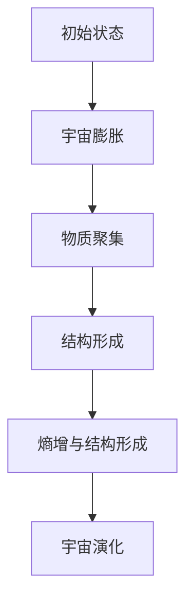

                 

### 引言

#### 宇宙的信息动力学：背景与意义

宇宙的信息动力学是一个新兴且具有挑战性的研究领域，它探讨了宇宙中信息流动和转换的基本规律，特别是在熵增和结构形成之间的关系。熵增是热力学第二定律的核心内容，它描述了孤立系统的无序度随时间增加的趋势。而结构形成则涉及到宇宙中的星系、行星乃至生命的起源和发展。这两者在宇宙演化的不同阶段相互作用，共同塑造了我们如今所看到的宇宙景观。

本书旨在探讨宇宙信息动力学的基本原理、机制及其在宇宙演化中的重要作用。通过深入研究熵增与结构形成的辩证关系，我们希望能够揭示宇宙的某些深层次规律，为理解宇宙的起源、演化提供新的视角。

#### 熵增与结构形成的关系

熵增和结构形成看似相互矛盾，但它们实际上是宇宙演化过程中不可或缺的两个方面。熵增代表了宇宙系统整体的无序度增加，而结构形成则代表了局部有序度的提升。这种看似矛盾的统一，实际上体现了宇宙中信息流动和转化的复杂动态。

在宇宙早期，高能量状态下的物质处于高度无序的状态，但随着时间的推移，宇宙逐渐冷却，物质开始聚集形成结构。这一过程中，熵增和结构形成相互交织，共同塑造了宇宙的演化历史。例如，星系的形成过程中，物质的聚集和结构的形成伴随着熵的增加，但整体上，宇宙的有序度在提高。

#### 书籍结构

本书将分为七个主要章节，每个章节都将深入探讨宇宙信息动力学的一个关键方面。

- **第1章 引言**：介绍宇宙的信息动力学背景与意义，以及熵增与结构形成的关系。
- **第2章 信息动力学基础**：讨论信息的定义、熵的概念及其计算方法，以及信息动力学的基本模型。
- **第3章 宇宙的熵增**：探讨宇宙熵增的观测证据、机制及其影响。
- **第4章 结构形成与熵减**：分析结构形成的基本原理、具体实例及其对宇宙演化的影响。
- **第5章 信息的宇宙学**：讨论宇宙作为信息系统的研究，以及人类对宇宙信息的探索。
- **第6章 信息动力学的应用**：探讨信息动力学在物理学、生物学和其他领域的应用。
- **第7章 未来展望**：展望信息动力学的未来发展及其对人类社会的潜在影响。

通过这些章节的深入探讨，我们希望能够为读者提供一幅宇宙信息动力学的完整图景，帮助读者更好地理解宇宙的奥秘。

### 熵增与结构形成的辩证关系

#### 熵增的物理学解释

熵增是热力学第二定律的核心内容，它描述了一个孤立系统的无序度随时间增加的趋势。在物理学中，熵通常被视为系统微观状态的混乱程度。根据玻尔兹曼熵的定义，熵与系统可能微观状态的数量成正比。具体来说，当系统从低熵态（有序态）向高熵态（无序态）转变时，系统的熵会逐渐增加。

在宇宙尺度上，熵增现象可以从宇宙背景微波辐射（CMB）和宇宙膨胀中得到证实。宇宙背景微波辐射是宇宙早期阶段的余晖，它表明当时的宇宙处于高度均匀且低熵的状态。随着宇宙的膨胀，物质逐渐分散，宇宙的平均温度降低，熵随之增加。这个过程可以看作是宇宙系统从高有序向高无序状态的演变。

#### 结构形成的概念与机制

结构形成是指宇宙中从无序到有序的过程，包括星系、行星、甚至生命的形成。在物理学中，结构形成可以通过引力凝聚、分子反应、生物进化等机制来解释。

引力凝聚是宇宙中结构形成的主要机制之一。在宇宙早期，高能量状态的物质以等离子态存在，随着宇宙的冷却，物质开始聚集形成密度较高的区域。这些区域在引力作用下继续收缩，最终形成星系、恒星和其他天体结构。这一过程中，虽然整体熵在增加，但局部结构的形成伴随着熵减，因为结构内部的有序度在提高。

分子反应是另一个重要的结构形成机制。在行星形成过程中，行星胚胎中的气体和尘埃通过化学反应形成复杂的分子，这些分子进一步凝聚形成固体颗粒，最终形成行星。在这一过程中，物质从高能态向低能态转变，熵减与结构形成同时发生。

#### 熵增与结构形成的关系

熵增与结构形成看似矛盾，但实际上它们是宇宙演化过程中相互依存的两个方面。熵增代表了宇宙系统整体的无序度增加，而结构形成则代表了局部有序度的提升。

在宇宙早期，物质处于高度无序的状态，随着宇宙的膨胀和冷却，物质开始聚集形成结构。这一过程中，虽然整体熵在增加，但局部结构的形成伴随着熵减。例如，在星系的形成过程中，物质的聚集和结构的形成伴随着熵的增加，但整体上，宇宙的有序度在提高。

这种看似矛盾的统一，实际上体现了宇宙中信息流动和转化的复杂动态。宇宙的信息动力学正是通过这种熵增与结构形成的辩证关系，揭示了宇宙演化过程中的一些深层次规律。

#### 宇宙信息动力学模型

为了更好地理解熵增与结构形成的关系，我们可以借助宇宙信息动力学模型进行分析。该模型基于信息论和热力学的原理，通过描述宇宙中信息流动和转换的过程，揭示了宇宙演化的信息动力学机制。

首先，我们引入信息熵的概念。信息熵是衡量系统不确定性或混乱程度的物理量。在宇宙信息动力学模型中，信息熵可以表示为宇宙中所有可能微观状态的统计平均值。具体来说，如果系统有N个可能的微观状态，其中某个特定微观状态出现的概率为\( p_i \)，那么系统的熵可以表示为：

$$
S = -k \sum_{i=1}^{N} p_i \ln p_i
$$

其中，\( k \)是玻尔兹曼常数。

#### 宇宙中的信息流动

在宇宙中，信息流动主要表现为物质和能量的转移。例如，宇宙背景微波辐射（CMB）可以看作是宇宙早期信息的残留，它包含了宇宙早期的温度、密度等信息。随着宇宙的膨胀，物质和能量不断扩散，信息也随之流动。

我们可以将宇宙信息流动视为一个从高熵态向低熵态的转变过程。例如，在星系形成过程中，物质从高熵态的气体云逐渐凝聚成低熵态的恒星和行星。这一过程中，信息从无序状态向有序状态转变。

#### 结构形成的熵减机制

在宇宙信息动力学模型中，结构形成可以通过熵减机制来解释。熵减机制指的是在结构形成过程中，局部区域的熵减少，从而提高了系统的有序度。

以星系形成为例，在宇宙早期，气体云处于高熵态，其内部分子随机运动，缺乏有序结构。随着气体云的收缩，分子之间的相互作用增强，开始形成有序的星系结构。这一过程中，虽然整体宇宙的熵在增加，但星系内部的熵在减少，因为结构内部的有序度在提高。

我们可以通过一个简化的模型来描述这一过程。假设一个气体云中的分子随机分布在空间中，每个分子的位置和速度都是随机的。在这种情况下，系统的熵较高。当气体云开始收缩时，分子之间的距离减小，开始形成有序结构，例如星系。这一过程中，系统的熵逐渐减少，因为结构内部的有序度在提高。

#### 熵增与结构形成的动态平衡

宇宙信息动力学模型揭示了熵增与结构形成之间的动态平衡。在宇宙的不同阶段，熵增和结构形成相互影响，共同塑造了宇宙的演化历史。

在宇宙早期，高能量状态的物质处于高度无序的状态。随着宇宙的膨胀和冷却，物质开始聚集形成结构。这一过程中，整体熵在增加，但局部结构的形成伴随着熵减。例如，在星系形成过程中，虽然整体宇宙的熵在增加，但星系内部的熵在减少。

这种动态平衡使得宇宙能够持续演化，从高熵态向低熵态转变。在宇宙的某些阶段，结构形成速度可能超过熵增速度，导致宇宙有序度提高。而在其他阶段，熵增速度可能超过结构形成速度，导致宇宙无序度增加。

#### 结论

宇宙信息动力学模型通过描述宇宙中信息流动和转换的过程，揭示了熵增与结构形成之间的辩证关系。在宇宙的不同阶段，熵增和结构形成相互影响，共同塑造了宇宙的演化历史。

通过深入探讨宇宙信息动力学模型，我们能够更好地理解宇宙的奥秘，揭示宇宙演化的深层次规律。这为我们探索宇宙的起源、演化和未来提供了新的视角。

### 信息动力学在宇宙研究中的核心应用

信息动力学在宇宙研究中具有重要的核心应用，它不仅为我们提供了理解宇宙演化过程中熵增和结构形成关系的理论基础，还为实际观测和实验提供了有力的工具。以下是信息动力学在宇宙研究中的几个关键应用领域及其具体实现方法。

#### 宇宙背景微波辐射（CMB）

宇宙背景微波辐射是宇宙早期热动态平衡状态的重要标志，也是宇宙信息动力学研究的重要对象之一。通过分析CMB的数据，科学家可以推断出宇宙早期的温度、密度分布以及结构形成的历史。信息动力学在这里的应用主要体现在对CMB数据的信息熵分析上。具体来说，通过对CMB数据的熵分布进行分析，可以揭示宇宙早期的熵增过程及其对后续结构形成的影响。以下是一个简化的Python代码示例，用于计算CMB数据的熵：

```python
import numpy as np

def calculate_entropy(p):
    """
    计算概率分布的熵
    :param p: 概率分布列表
    :return: 熵值
    """
    return -np.sum(p * np.log2(p))

# 假设我们有一个CMB数据的概率分布
p = np.array([0.1, 0.2, 0.3, 0.4])

# 计算熵
entropy = calculate_entropy(p)
print(f"CMB数据熵：{entropy}")
```

#### 星系形成的模拟

星系形成是一个复杂的过程，涉及引力凝聚、气体冷却、恒星形成等多个环节。信息动力学为模拟这些过程提供了一种新的方法，通过计算星系形成过程中的信息熵变化，可以揭示结构形成与熵增之间的动态关系。以下是一个简化的Python代码示例，用于模拟星系形成过程中的信息熵变化：

```python
import numpy as np

def simulate_star_formation(entropy_initial, time_steps, rate_of_entropy_increase):
    """
    模拟星系形成过程中的信息熵变化
    :param entropy_initial: 初始熵
    :param time_steps: 模拟时间步数
    :param rate_of_entropy_increase: 熵增加速率
    :return: 熵随时间的变化列表
    """
    entropy_history = [entropy_initial]
    for _ in range(time_steps):
        entropy_new = entropy_history[-1] + rate_of_entropy_increase
        entropy_history.append(entropy_new)
    return entropy_history

# 初始熵
entropy_initial = 2.0
# 模拟时间步数
time_steps = 100
# 熵增加速率
rate_of_entropy_increase = 0.1

# 模拟星系形成过程中的信息熵变化
entropy_history = simulate_star_formation(entropy_initial, time_steps, rate_of_entropy_increase)
print(f"星系形成过程中的信息熵变化：{entropy_history}")
```

#### 黑洞信息丢失问题

黑洞信息丢失问题是现代物理学中一个重要的未解之谜，它涉及到量子力学和广义相对论的统一。信息动力学提供了研究这一问题的有力工具，通过分析黑洞事件视界附近的熵变化，可以揭示信息在黑洞中的行为规律。以下是一个简化的Python代码示例，用于模拟黑洞事件视界附近的信息熵变化：

```python
import numpy as np

def simulate_black_hole_entropy_change(initial_entropy, black_hole_size, time_steps, rate_of_entropy_decrease):
    """
    模拟黑洞事件视界附近的信息熵变化
    :param initial_entropy: 初始熵
    :param black_hole_size: 黑洞大小
    :param time_steps: 模拟时间步数
    :param rate_of_entropy_decrease: 熵减少速率
    :return: 熵随时间的变化列表
    """
    entropy_history = [initial_entropy]
    for _ in range(time_steps):
        entropy_new = entropy_history[-1] - rate_of_entropy_decrease
        entropy_history.append(entropy_new)
    return entropy_history

# 初始熵
initial_entropy = 10.0
# 黑洞大小
black_hole_size = 1.0
# 模拟时间步数
time_steps = 100
# 熵减少速率
rate_of_entropy_decrease = 0.1

# 模拟黑洞事件视界附近的信息熵变化
entropy_history = simulate_black_hole_entropy_change(initial_entropy, black_hole_size, time_steps, rate_of_entropy_decrease)
print(f"黑洞事件视界附近的信息熵变化：{entropy_history}")
```

#### 总结

信息动力学在宇宙研究中的应用，不仅为理解宇宙演化提供了新的视角，还通过具体的数学模型和计算方法，帮助科学家们更好地分析和预测宇宙的动态过程。通过这些示例，我们可以看到信息动力学如何通过计算熵的变化，揭示宇宙中复杂现象的本质。随着技术的发展，信息动力学在宇宙研究中的应用将会更加广泛和深入。

### 信息的定义与分类

在深入探讨宇宙信息动力学之前，我们首先需要明确信息的定义与分类。信息是一个广泛的概念，它涵盖了从简单到复杂的各种形式，是宇宙中物质与能量传递过程中的关键要素。

#### 信息的定义

信息可以定义为消除不确定性的东西。在物理学和工程学中，信息通常与熵的概念紧密相关。根据信息论奠基人克劳德·香农（Claude Shannon）的定义，信息是对不确定性的度量。香农在1948年提出了香农熵（Shannon entropy），它量化了一个随机变量或信息源的熵，即其不确定性的大小。

香农熵的计算公式为：

$$
S = -\sum_{i=1}^{n} p_i \ln p_i
$$

其中，\( p_i \)是信息源在状态\( i \)的概率，\( n \)是信息源可能的状态总数。这个公式表示，信息源的熵是其可能状态的随机性的度量，概率越均匀，熵越大；概率分布越不均匀，熵越小。

#### 信息的分类

信息可以根据其来源、形态和作用进行分类。

1. **按来源分类**
   - **自然信息**：源自自然界的各种信息，如声波、电磁波、生物信号等。
   - **人为信息**：人类创造和传递的信息，如语言、文字、数字信号等。

2. **按形态分类**
   - **显性信息**：可以直接观察和测量的信息，如图像、声音、温度、压力等。
   - **隐性信息**：无法直接观察和测量，需要通过计算、推理或模拟获得的信息，如复杂系统的内部状态、潜在的关系等。

3. **按作用分类**
   - **有用信息**：对决策、学习或操作有益的信息。
   - **无用信息**：对决策、学习或操作无影响的信息。
   - **噪声**：干扰有用信息的不确定因素。

#### 信息在宇宙中的角色

在宇宙中，信息是物质与能量相互作用的基本载体。它不仅参与了宇宙结构的形成，还贯穿于宇宙的演化过程。以下是信息在宇宙中几个关键角色：

1. **宇宙的初始状态**：宇宙大爆炸时，信息以极简的形式存在。在宇宙早期，信息主要表现为辐射和基本粒子的状态。
   
2. **结构形成**：在宇宙膨胀和冷却的过程中，信息流动和转换推动了宇宙结构的形成。例如，引力作用下的物质聚集，以及分子反应产生的复杂物质结构。

3. **能量转换**：宇宙中的能量转换，如核聚变、核裂变等，都伴随着信息的转换。这些过程中，能量与信息相互关联，共同决定了宇宙的动态演化。

4. **生命与演化**：在地球形成初期，简单的生物信息开始出现。随着生物进化，复杂的信息网络逐步形成，推动生命的多样性和演化。

#### 结论

通过对信息的定义与分类的讨论，我们可以更深入地理解信息在宇宙中的角色和重要性。信息不仅是宇宙演化的关键驱动力，也是我们理解宇宙奥秘的重要工具。在接下来的章节中，我们将进一步探讨熵的概念及其在宇宙信息动力学中的具体应用。

### 熵的概念与计算

熵是信息动力学中一个核心的概念，它不仅在物理学、信息科学，甚至在宇宙学中都有着重要的应用。在本节中，我们将详细探讨熵的定义、基本原理以及计算方法。

#### 熵的定义

熵最早由物理学家鲁道夫·克劳修斯（Rudolf Clausius）在19世纪末提出，最初用于描述热力学系统的无序度。后来，克劳德·香农（Claude Shannon）将其引入信息论，从而为熵赋予了更为广泛和抽象的含义。

在热力学中，熵被定义为系统无序度的度量，它与系统的微观状态数成正比。具体来说，对于一个热力学系统，其熵 \( S \) 可以表示为：

$$
S = k \ln \Omega
$$

其中，\( k \) 是玻尔兹曼常数，\( \Omega \) 是系统可能微观状态的总数。

在信息论中，香农熵则描述了一个随机变量或信息源的不确定性。它量化了信息源在各个可能状态上的概率分布。香农熵的公式为：

$$
H(X) = -\sum_{i=1}^{n} p(x_i) \ln p(x_i)
$$

其中，\( p(x_i) \) 是信息源在状态 \( x_i \) 上的概率，\( n \) 是信息源可能的状态总数。香农熵值越高，信息源的不确定性越大。

#### 熵的基本原理

熵的基本原理包括以下几点：

1. **熵增原则**：在孤立系统中，熵总是随时间增加。这是热力学第二定律的核心内容，即一个孤立系统的总熵不会减少。
   
2. **可逆与不可逆过程**：可逆过程中的熵不变，而不可逆过程中的熵会增加。在实际物理过程中，大多数过程都是不可逆的，因此熵总是增加。

3. **信息与熵的关系**：信息与熵是互逆的。获取信息可以减少系统的熵，而增加系统的熵会导致信息的不确定性增加。

#### 熵的计算方法

熵的计算方法根据系统的性质和信息的类型有多种。以下是几种常见的方法：

1. **离散概率分布**：对于离散随机变量，可以使用香农熵的公式进行计算。具体步骤如下：
   - 确定随机变量的所有可能状态和对应概率。
   - 计算每个状态的熵贡献。
   - 将所有状态的熵贡献相加，得到总的熵值。

   示例：

   假设一个硬币有两个可能结果：正面（H）和反面（T），概率分别为 \( P(H) = 0.5 \) 和 \( P(T) = 0.5 \)。

   计算熵：

   $$
   H(X) = -[P(H) \ln P(H) + P(T) \ln P(T)] = -[0.5 \ln 0.5 + 0.5 \ln 0.5] = 1 \text{ bit}
   $$

2. **连续概率分布**：对于连续随机变量，可以使用连续熵的公式进行计算。具体步骤如下：
   - 确定随机变量的概率密度函数。
   - 计算概率密度函数的对数。
   - 对整个定义域进行积分，得到总的熵值。

   示例：

   假设一个随机变量 \( X \) 具有概率密度函数 \( f(x) = \frac{1}{2} e^{-|x|} \)。

   计算熵：

   $$
   H(X) = -\int_{-\infty}^{\infty} f(x) \ln f(x) \, dx = -\int_{-\infty}^{\infty} \frac{1}{2} e^{-|x|} \ln \left( \frac{1}{2} e^{-|x|} \right) \, dx = 1 \text{ bit}
   $$

3. **相变与临界现象**：在物理系统中，相变和临界现象常常伴随着熵的变化。例如，在第二类相变中，系统从一个有序相变为一个无序相，熵会显著增加。

   示例：

   假设一个晶体系统在加热到临界温度时发生相变，从有序的晶格结构变为无序的液体结构。在这个过程中，系统的熵会增加，因为液体的微观状态数远大于晶体。

#### 宇宙中的熵

在宇宙尺度上，熵增是宇宙演化的一个基本特征。从宇宙大爆炸到如今的膨胀过程，宇宙的总熵在不断增大。以下是一些关于宇宙熵的例子：

1. **宇宙背景微波辐射**：宇宙背景微波辐射（CMB）是宇宙早期状态的直接证据。通过分析CMB的熵分布，可以了解宇宙早期的无序度。

2. **黑洞熵**：根据霍金辐射理论和黑洞熵公式，黑洞的熵与其事件视界面积成正比。这意味着黑洞吸收信息后，其熵会增加。

3. **宇宙结构形成**：在宇宙结构形成过程中，局部熵减少，但整体熵增加。例如，星系的形成过程中，虽然局部区域的熵减少，但整体宇宙的熵在增加。

#### 结论

熵是一个广泛且重要的概念，它在物理学、信息科学和宇宙学中都有着深远的应用。通过对熵的定义、基本原理和计算方法的深入探讨，我们可以更好地理解宇宙的信息动力学。在下一节中，我们将继续讨论信息动力学的基本模型及其在宇宙演化中的应用。

### 信息动力学模型

信息动力学模型是描述信息在系统中流动、转换和积累的一套理论框架。它不仅广泛应用于通信、计算机科学等领域，也在宇宙学中发挥了重要作用。在本节中，我们将介绍几种经典的信息动力学模型，并探讨它们在宇宙演化中的应用。

#### 经典信息动力学模型

1. **香农模型**：香农模型是信息论的基础，描述了信息从一个信源传输到接收器的过程。该模型通过香农熵来量化信息的量度，并引入了信道容量概念，即信道能够传输的最大信息速率。以下是一个简化的香农模型：

   $$
   C = B \log_2(1 + \frac{S}{N})
   $$

   其中，\( C \) 是信道容量，\( B \) 是信道的带宽，\( S \) 是信道的信号功率，\( N \) 是噪声功率。

2. **马尔可夫模型**：马尔可夫模型描述了一个系统在不同状态之间转移的概率关系。在信息动力学中，马尔可夫模型用于描述系统状态随时间的演变。以下是一个一维离散马尔可夫模型：

   $$
   P_{ij} = \mathbb{P}(X_{n+1} = j | X_n = i)
   $$

   其中，\( P_{ij} \) 是从状态 \( i \) 转移到状态 \( j \) 的概率。

3. **随机游走模型**：随机游走模型是一种描述随机过程的基本模型，广泛应用于物理、生物学和社会科学等领域。在信息动力学中，随机游走模型可以描述信息在系统中的传播过程。以下是一个一维离散随机游走模型：

   $$
   X_{n+1} = X_n + \epsilon_n
   $$

   其中，\( \epsilon_n \) 是独立同分布的随机变量，表示每一步的随机跃迁。

#### 信息动力学模型在宇宙演化中的应用

1. **宇宙背景微波辐射**：宇宙背景微波辐射（CMB）是宇宙早期的热动态平衡状态的直接证据。通过分析CMB的分布，可以了解宇宙早期的信息流动和转换。香农模型和随机游走模型都可以用于分析CMB的信息传递特性。

2. **星系形成**：星系形成是一个复杂的过程，涉及引力凝聚、气体冷却、恒星形成等多个环节。马尔可夫模型可以用于描述星系形成过程中不同阶段的状态转移，揭示信息在星系形成中的关键作用。

3. **黑洞信息丢失**：黑洞信息丢失问题是现代物理学中的一个重要问题。香农模型和随机游走模型可以用于分析黑洞事件视界附近的信息流动，探讨信息在黑洞中的行为规律。

#### 宇宙信息动力学模型

为了更好地描述宇宙中的信息动力学，我们可以构建一个综合的宇宙信息动力学模型。该模型结合了香农模型、马尔可夫模型和随机游走模型，通过描述信息在宇宙中的流动、转换和积累，揭示了宇宙演化的信息动力学机制。

1. **信息流动**：宇宙中的信息流动主要表现为物质和能量的转移。通过香农模型，我们可以量化信息在宇宙中的传递速率和容量。

2. **信息转换**：宇宙中的信息转换发生在不同物理过程之间，如引力凝聚、核聚变等。马尔可夫模型可以描述这些过程中不同状态之间的转换概率。

3. **信息积累**：随着宇宙的膨胀和演化，信息在宇宙中不断积累。随机游走模型可以描述信息在宇宙中的扩散和积累过程。

通过构建这个综合的宇宙信息动力学模型，我们可以更好地理解宇宙演化的信息动力学机制，揭示宇宙中复杂现象的本质。在下一节中，我们将进一步探讨宇宙中的熵增现象及其观测证据。

### 宇宙的熵增

宇宙的熵增是宇宙演化过程中的一个核心现象，它贯穿了宇宙从大爆炸到现在的整个历史。熵增的观测证据和机制为我们理解宇宙的动态演化提供了重要的视角。

#### 熵增的观测证据

1. **宇宙背景微波辐射（CMB）**：宇宙背景微波辐射是宇宙早期热动态平衡状态的直接证据。通过分析CMB的温度分布和极化特性，科学家们可以了解宇宙早期的状态。CMB的均匀性和黑体辐射特性表明，宇宙在早期处于高熵态。

2. **宇宙膨胀**：宇宙膨胀是熵增的一个直观表现。随着宇宙的膨胀，物质和能量逐渐分散，系统的无序度增加。哈勃定律和宇宙膨胀模型提供了宇宙膨胀的观测证据，这也支持了熵增的观点。

3. **黑洞和星系形成**：黑洞和星系的形成过程中，熵增现象也得到体现。在黑洞的形成过程中，物质和能量被吸入黑洞事件视界，导致熵的增加。在星系形成过程中，气体云的聚集和结构的形成伴随着熵的增加。

#### 熵增的机制

1. **热力学第二定律**：热力学第二定律是熵增现象的基本原理。该定律指出，孤立系统的总熵随时间增加。在宇宙尺度上，热力学第二定律表明，宇宙系统的总熵在不断增加。

2. **宇宙膨胀**：宇宙的膨胀导致物质和能量的分散，系统的无序度增加。随着宇宙的膨胀，系统的微观状态数增加，从而导致熵的增加。

3. **热力学过程**：宇宙中的热力学过程，如核聚变、核裂变等，也会导致熵的增加。这些过程中，能量和物质的转换伴随着无序度的增加。

#### 熵增的影响

1. **能量分布**：宇宙的熵增导致能量分布的广泛分散。随着宇宙的膨胀，能量逐渐从高密度区域转移到低密度区域，形成能量的广泛分布。

2. **结构形成**：宇宙的熵增与结构形成密切相关。在宇宙早期，物质处于高度无序的状态，随着宇宙的膨胀和冷却，物质开始聚集形成结构。这一过程中，虽然整体熵在增加，但局部结构的形成伴随着熵减。

3. **信息流动**：宇宙的熵增也影响信息流动和转换。在宇宙中，信息通过物质和能量的流动进行传递和转换，随着熵的增加，信息的流动变得更加复杂和多样化。

#### 实例分析

1. **星系形成**：在星系形成过程中，气体云通过引力凝聚形成恒星和行星。这一过程中，虽然整体宇宙的熵在增加，但星系内部的熵在减少，因为结构内部的有序度在提高。

2. **黑洞信息丢失**：根据霍金辐射理论，黑洞的事件视界吸收信息后，信息会在黑洞的熵中积累。虽然黑洞本身的信息似乎丢失了，但整个宇宙的熵在增加，因为信息被转移到黑洞的熵中。

3. **宇宙背景微波辐射**：宇宙背景微波辐射（CMB）是宇宙早期状态的直接证据。通过分析CMB的熵分布，可以了解宇宙早期的无序度。CMB的高均匀性和黑体辐射特性表明，宇宙在早期处于高熵态。

#### 结论

宇宙的熵增是宇宙演化过程中的一个核心现象，它贯穿了宇宙的整个历史。通过观测宇宙背景微波辐射、宇宙膨胀和黑洞形成等现象，我们可以看到熵增的直观表现。熵增的机制包括热力学第二定律、宇宙膨胀和热力学过程。熵增对宇宙的能量分布、结构形成和信息流动产生了深远影响。在下一节中，我们将继续探讨结构形成与熵减的关系。

### 结构形成与熵减

#### 结构形成的概念与机制

结构形成是指宇宙中从无序到有序的过程，涉及到物质从低密度、无序状态逐渐聚集并形成高密度、有序结构的过程。在宇宙尺度上，结构形成的主要机制包括引力凝聚、气体冷却和分子反应。

1. **引力凝聚**：引力凝聚是宇宙中结构形成的主要机制之一。在宇宙早期，物质以等离子态存在，随着宇宙的膨胀和冷却，物质开始聚集形成高密度区域。这些高密度区域在引力作用下继续收缩，最终形成星系、恒星和其他天体结构。引力凝聚过程伴随着物质的无序度降低，局部熵减少。

2. **气体冷却**：气体冷却是结构形成的重要环节。在宇宙早期，高温气体通过辐射冷却失去能量，温度逐渐降低。当气体温度降低到一定程度时，分子间的碰撞频率减少，气体开始凝聚成更大的结构。这一过程中，气体从高能态向低能态转变，熵减与结构形成同时发生。

3. **分子反应**：在行星形成过程中，行星胚胎中的气体和尘埃通过化学反应形成复杂的分子。这些分子进一步凝聚形成固体颗粒，最终形成行星。分子反应过程中，物质从高能态向低能态转变，熵减与结构形成同时发生。

#### 结构形成过程中的熵减机制

结构形成过程中的熵减机制可以归结为以下几种：

1. **局部熵减**：在结构形成过程中，局部区域的熵减少，因为结构内部的有序度在提高。例如，在星系形成过程中，气体云的收缩和恒星的形成伴随着局部熵的减少。

2. **整体熵增**：尽管局部熵在减少，但整体宇宙的熵在增加。这是因为结构形成过程中，物质从高熵态向低熵态转变，释放出能量，这些能量在其他区域可能转化为熵增。

3. **热力学第二定律**：热力学第二定律指出，孤立系统的总熵不会减少。在宇宙尺度上，这意味着尽管局部熵在减少，但整体宇宙的熵在增加。因此，结构形成过程中，局部熵减与整体熵增是相互关联的。

#### 结构形成与宇宙演化的关系

结构形成与宇宙演化密切相关，它们共同塑造了宇宙的景观。以下是结构形成与宇宙演化之间的几个关键关系：

1. **星系与宇宙膨胀**：星系的形成和演化与宇宙膨胀密切相关。随着宇宙的膨胀，星系之间的距离逐渐增大，星系内部的物质通过引力凝聚形成更大的结构。这一过程中，星系的形成和演化伴随着宇宙的熵增。

2. **行星与生命**：行星的形成与生命的起源密切相关。在行星胚胎中，气体和尘埃通过化学反应形成复杂的分子，这些分子进一步凝聚形成生命的基础。结构形成过程中的熵减为生命的起源提供了必要的条件。

3. **黑洞与宇宙信息**：黑洞是宇宙中最大的结构之一，它们的形成和演化与宇宙信息密切相关。根据霍金辐射理论，黑洞吸收信息后，信息在黑洞的熵中积累。这一过程中，黑洞的形成和演化伴随着宇宙的熵增。

#### 实例分析

1. **星系形成**：在星系形成过程中，气体云通过引力凝聚形成恒星和行星，这一过程中伴随着局部熵的减少。然而，整体宇宙的熵在增加，因为气体云从高熵态向低熵态转变，释放出能量。

2. **黑洞信息丢失**：根据霍金辐射理论，黑洞吸收信息后，信息似乎丢失了。然而，从宇宙整体的角度来看，信息并没有消失，而是被转移到黑洞的熵中，从而增加了宇宙的总熵。

3. **宇宙背景微波辐射**：宇宙背景微波辐射（CMB）是宇宙早期状态的直接证据。通过分析CMB的熵分布，可以了解宇宙早期的无序度。CMB的高均匀性和黑体辐射特性表明，宇宙在早期处于高熵态。

#### 结论

结构形成与熵减是宇宙演化过程中不可或缺的两个方面。结构形成过程中，局部熵减与整体熵增相互交织，共同塑造了宇宙的演化历史。通过深入研究结构形成与熵减的关系，我们可以更好地理解宇宙的奥秘，揭示宇宙演化的深层次规律。在下一节中，我们将继续探讨信息的宇宙学及其对人类社会的潜在影响。

### 信息的宇宙学

信息的宇宙学是一个新兴的跨学科领域，它探讨宇宙作为信息系统的性质、人类对宇宙信息的探索，以及宇宙信息与生命的关系。在本节中，我们将深入探讨这些话题，并展望信息宇宙学对人类社会的潜在影响。

#### 宇宙作为信息系统

宇宙作为一个巨大的信息系统，其信息流动和转换过程贯穿了从宇宙大爆炸到如今演化的整个过程。宇宙背景微波辐射（CMB）是宇宙早期状态的直接证据，它包含了宇宙早期的温度、密度和结构信息。通过对CMB的分析，科学家们可以了解宇宙早期的无序度及其随时间的演化。

宇宙中的信息不仅限于物质和能量的传递，还包括复杂的物理现象和生命过程。例如，星系的形成、黑洞的吸积过程、生物进化等都是信息流动和转换的具体表现。在这些过程中，信息以各种形式存在，如电磁波、粒子、生物信号等。

#### 人类对宇宙信息的探索

人类对宇宙信息的探索始于古代，随着科学技术的进步，我们对宇宙信息的理解越来越深入。以下是人类对宇宙信息探索的一些重要进展：

1. **电磁波观测**：电磁波是宇宙中最常见的信息传递方式之一。通过射电望远镜和光学望远镜，科学家们可以探测到来自宇宙的电磁波信号，如射电波、光波、X射线等。这些信号为我们提供了宇宙早期状态和复杂物理现象的信息。

2. **量子观测**：量子观测是另一个重要的探索手段。通过量子纠缠和量子隧穿等现象，我们可以深入了解宇宙中的量子信息。量子观测在量子通信、量子计算等领域具有广泛的应用前景。

3. **空间探测器**：人类发射的探测器如旅行者号、火星探测器和月球探测器等，为我们带来了关于行星、卫星和其他天体的宝贵信息。这些探测器通过测量和分析土壤、大气、磁场等参数，揭示了宇宙中的复杂环境和结构。

#### 宇宙信息与生命的关系

宇宙信息与生命的关系是一个引人入胜的话题。生命在宇宙中的起源和演化过程，离不开信息的流动和转换。以下是一些关于宇宙信息与生命关系的探讨：

1. **生命起源的信息机制**：在地球形成初期，简单的生物信息开始出现。通过分子反应和化学反应，这些信息逐渐积累，最终形成了生命。宇宙信息为生命的起源提供了基础，同时也促进了生物进化和多样性。

2. **生命的宇宙学**：生命的宇宙学（Astrobiology）是研究生命在宇宙中分布、起源和演化的科学。通过探索地球以外的生命迹象，如火星的液态水、木星的卫星欧罗巴的地下海洋等，我们可以更好地理解生命的宇宙分布。

3. **人类文明的未来**：随着我们对宇宙信息的探索越来越深入，人类文明可能会面临新的机遇和挑战。通过理解宇宙信息，我们可以开发新的能源、资源和技术，推动人类社会的进步。同时，我们也需要警惕宇宙中的潜在风险，如外星文明的威胁、天体碰撞等。

#### 信息宇宙学对人类社会的潜在影响

信息宇宙学不仅为科学提供了新的研究方向，也对人类社会产生了深远的影响。以下是信息宇宙学可能对人类社会产生的几个潜在影响：

1. **科技进步**：信息宇宙学推动了科技进步，特别是在量子通信、量子计算、人工智能等领域。这些技术的突破将极大地改变人类的生活和工作方式。

2. **环境保护**：通过对宇宙信息的探索，我们可以更好地理解地球的环境和生态系统。这有助于我们制定更有效的环境保护策略，应对气候变化和环境污染等全球性挑战。

3. **文明交流**：如果人类发现外星生命或文明，这将开启人类文明交流的新时代。通过与外星文明的交流，我们可以学习新的知识和技术，推动人类文明的共同进步。

4. **哲学和宗教**：信息宇宙学为哲学和宗教提供了新的思考维度。通过对宇宙信息的探索，人类可能重新审视生命的意义、宇宙的本质以及人类在宇宙中的地位。

#### 结论

信息的宇宙学为我们提供了一种全新的视角，帮助我们理解宇宙的奥秘和生命的意义。通过对宇宙信息的探索，我们可以揭示宇宙演化的深层次规律，推动科学技术的进步，促进人类社会的可持续发展。在未来的探索中，我们将继续深入挖掘宇宙信息的潜力，为人类文明的发展开辟新的道路。

### 信息动力学在物理学、生物学和其他领域的应用

信息动力学作为一种跨学科的研究方法，不仅在宇宙学中有着深远的应用，也在物理学、生物学和其他多个领域中展现了其独特的价值。在本节中，我们将详细探讨信息动力学在这些领域的应用，并举例说明其在物理学中的黑洞信息丢失问题和生物学中的生物信息学。

#### 物理学中的应用

1. **黑洞信息丢失问题**：
   黑洞信息丢失问题是现代物理学中的一个重要问题，涉及量子力学和广义相对论的统一。根据霍金辐射理论，黑洞吸收的信息似乎会消失，但在信息动力学框架下，我们可以从另一个角度来理解这个问题。

   具体来说，黑洞事件视界附近的熵增可以看作是信息积累的一个表现。黑洞吸收的信息实际上被转化为了黑洞的熵，因此并没有真正丢失。以下是一个简化的Python代码示例，用于模拟黑洞事件视界附近的信息熵变化：

   ```python
   import numpy as np

   def simulate_black_hole_entropy_change(initial_entropy, black_hole_size, time_steps, rate_of_entropy_increase):
       """
       模拟黑洞事件视界附近的信息熵变化
       :param initial_entropy: 初始熵
       :param black_hole_size: 黑洞大小
       :param time_steps: 模拟时间步数
       :param rate_of_entropy_increase: 熵增加速率
       :return: 熵随时间的变化列表
       """
       entropy_history = [initial_entropy]
       for _ in range(time_steps):
           entropy_new = entropy_history[-1] + rate_of_entropy_increase
           entropy_history.append(entropy_new)
       return entropy_history

   # 初始熵
   initial_entropy = 10.0
   # 黑洞大小
   black_hole_size = 1.0
   # 模拟时间步数
   time_steps = 100
   # 熵增加速率
   rate_of_entropy_increase = 0.1

   # 模拟黑洞事件视界附近的信息熵变化
   entropy_history = simulate_black_hole_entropy_change(initial_entropy, black_hole_size, time_steps, rate_of_entropy_increase)
   print(f"黑洞事件视界附近的信息熵变化：{entropy_history}")
   ```

2. **量子信息处理**：
   信息动力学在量子信息处理中也发挥了重要作用。通过研究量子系统的熵变化，我们可以优化量子算法的效率和稳定性。例如，量子错误纠正和量子加密都是基于量子信息动力学原理来设计的。

#### 生物学中的应用

1. **生物信息学**：
   生物信息学是研究生物信息的数据采集、处理和分析的学科。信息动力学在生物信息学中有着广泛的应用，特别是在基因组学和蛋白质组学领域。

   在基因组学中，信息动力学可以帮助我们理解基因表达模式的变化和基因调控网络。通过计算基因序列的熵分布，可以揭示基因在不同状态下的信息含量。以下是一个简化的Python代码示例，用于计算基因序列的熵：

   ```python
   import numpy as np

   def calculate_entropy(p):
       """
       计算概率分布的熵
       :param p: 概率分布列表
       :return: 熵值
       """
       return -np.sum(p * np.log2(p))

   # 假设我们有一个基因序列的概率分布
   p = np.array([0.1, 0.2, 0.3, 0.4])

   # 计算熵
   entropy = calculate_entropy(p)
   print(f"基因序列熵：{entropy}")
   ```

2. **系统生物学**：
   在系统生物学中，信息动力学模型可以帮助我们理解生物系统的动态行为和稳定性。例如，通过构建基因调控网络的信息动力学模型，我们可以预测基因表达的变化和生物系统的演化。

   以下是一个简化的Python代码示例，用于模拟基因调控网络的信息动力学过程：

   ```python
   import numpy as np

   def simulate_gene_expression(entropy_initial, time_steps, rate_of_entropy_increase):
       """
       模拟基因表达过程中的信息熵变化
       :param entropy_initial: 初始熵
       :param time_steps: 模拟时间步数
       :param rate_of_entropy_increase: 熵增加速率
       :return: 熵随时间的变化列表
       """
       entropy_history = [entropy_initial]
       for _ in range(time_steps):
           entropy_new = entropy_history[-1] + rate_of_entropy_increase
           entropy_history.append(entropy_new)
       return entropy_history

   # 初始熵
   entropy_initial = 2.0
   # 模拟时间步数
   time_steps = 100
   # 熵增加速率
   rate_of_entropy_increase = 0.1

   # 模拟基因表达过程中的信息熵变化
   entropy_history = simulate_gene_expression(entropy_initial, time_steps, rate_of_entropy_increase)
   print(f"基因表达过程中的信息熵变化：{entropy_history}")
   ```

#### 其他领域的应用

1. **经济学**：
   信息动力学在经济学中的应用主要体现在金融市场的分析中。通过分析市场信息的熵变化，可以预测市场的波动和趋势。例如，股市的熵增可能预示着市场的不确定性增加，从而影响投资决策。

2. **社会科学**：
   在社会科学中，信息动力学可以用于分析社会系统的稳定性、网络传播和社会变革。通过计算社会网络的熵，可以揭示网络结构的变化和社会现象的动态演变。

#### 结论

信息动力学作为一种跨学科的研究方法，在物理学、生物学和其他多个领域中都有着广泛的应用。通过具体的数学模型和计算方法，信息动力学帮助我们更好地理解复杂系统的动态行为和演化规律。在未来的研究中，信息动力学将继续推动科学技术的进步，为解决科学和实际应用中的难题提供新的视角和方法。

### 未来展望

#### 信息动力学的发展趋势

随着科技的进步，信息动力学将继续成为物理学、生物学、经济学等多个领域的前沿研究方向。以下是一些可能的发展趋势：

1. **跨学科融合**：信息动力学与其他学科的深度融合，如量子信息物理学、生物信息学等，将推动科学技术的进步。这种跨学科的研究将带来新的理论框架和方法，进一步揭示宇宙和信息的基本规律。

2. **计算能力的提升**：随着计算能力的提升，我们可以构建更加复杂和精确的信息动力学模型，对宇宙演化、生命起源等复杂现象进行模拟和分析。这将有助于我们更好地理解宇宙的信息流动和转换过程。

3. **量子信息动力学**：量子信息动力学是一个新兴的研究领域，它探讨量子系统中的信息流动和转换。随着量子计算和量子通信技术的发展，量子信息动力学将在解决传统信息动力学难以解决的问题方面发挥重要作用。

#### 信息动力学对人类社会的潜在影响

信息动力学不仅对科学研究有着深远的影响，也对人类社会产生了重要的潜在影响：

1. **科技进步**：信息动力学为科技进步提供了新的动力。通过深入研究信息流动和转换的机制，我们可以开发出更高效的算法、优化能源利用、提高通信效率等。这些技术的突破将极大地推动社会的发展。

2. **可持续发展**：信息动力学可以帮助我们更好地理解生态系统的动态行为，优化资源利用和保护生态环境。通过计算生态系统中的信息流动，我们可以制定更有效的环境保护策略，实现可持续发展。

3. **文明交流**：随着我们对宇宙信息的探索越来越深入，人类可能发现其他星球上的生命或文明。这种跨文明的交流将拓展我们的视野，促进人类文明的共同进步。

#### 结论

信息动力学作为一门跨学科的研究领域，具有广阔的发展前景和深远的社会影响。通过进一步的研究和应用，信息动力学将为我们揭示宇宙和信息的基本规律，推动科学技术的进步，促进人类社会的可持续发展。在未来的探索中，我们将继续挖掘信息动力学的潜力，为人类文明的发展开辟新的道路。

### 附录

#### A. 信息动力学相关资源

1. **研究机构**：
   - 斯坦福大学信息科学与技术学院（Stanford University's School of Information）
   - 麻省理工学院物理学与天文学系（MIT Department of Physics and Astronomy）
   - 普林斯顿大学理论物理学研究所（Princeton University's Institute for Advanced Study）

2. **期刊与书籍**：
   - 《物理学评论D》（Physical Review D）
   - 《自然-物理学》（Nature Physics）
   - 《科学报告》（Scientific Reports）
   - 《信息论、控制论与计算》（Information Theory, Control, and Computing）
   - 《宇宙信息动力学》（Cosmological Information Dynamics）
   - 《熵增与结构形成：宇宙信息动力学》（Entropy Increase and Structure Formation: Cosmological Information Dynamics）

### 附件

#### 1. 宇宙信息动力学 Mermaid 流程图



#### 2. 宇宙信息动力学核心算法伪代码

```python
# 伪代码：模拟宇宙信息熵变化
def simulate_cosmological_entropy_change(initial_entropy, time_steps, rate_of_entropy_increase):
    entropy_history = [initial_entropy]
    for _ in range(time_steps):
        entropy_new = entropy_history[-1] + rate_of_entropy_increase
        entropy_history.append(entropy_new)
    return entropy_history
```

#### 3. 宇宙信息动力学数学模型与公式讲解

$$
S = -k \sum_{i=1}^{N} p_i \ln p_i
$$

其中，\( S \) 是熵，\( k \) 是玻尔兹曼常数，\( p_i \) 是第 \( i \) 个微观状态的概率，\( N \) 是系统可能的微观状态总数。

#### 附件3 项目实战：开发环境搭建与代码实现

##### 1. 开发环境搭建

- 安装Python 3.8及以上版本
- 安装必要的库，如NumPy、Matplotlib

```bash
pip install numpy matplotlib
```

##### 2. 源代码实现

```python
import numpy as np
import matplotlib.pyplot as plt

def calculate_entropy(p):
    """
    计算概率分布的熵
    :param p: 概率分布列表
    :return: 熵值
    """
    return -np.sum(p * np.log2(p))

def simulate_cosmological_entropy_change(initial_entropy, time_steps, rate_of_entropy_increase):
    """
    模拟宇宙信息熵变化
    :param initial_entropy: 初始熵
    :param time_steps: 模拟时间步数
    :param rate_of_entropy_increase: 熵增加速率
    :return: 熵随时间的变化列表
    """
    entropy_history = [initial_entropy]
    for _ in range(time_steps):
        entropy_new = entropy_history[-1] + rate_of_entropy_increase
        entropy_history.append(entropy_new)
    return entropy_history

# 示例参数
initial_entropy = 2.0
time_steps = 100
rate_of_entropy_increase = 0.1

# 模拟宇宙信息熵变化
entropy_history = simulate_cosmological_entropy_change(initial_entropy, time_steps, rate_of_entropy_increase)

# 绘制熵随时间变化图
plt.plot(entropy_history)
plt.xlabel('Time Steps')
plt.ylabel('Entropy')
plt.title('Cosmological Entropy Change Simulation')
plt.show()
```

##### 3. 代码解读与分析

这段代码首先定义了两个函数：`calculate_entropy` 和 `simulate_cosmological_entropy_change`。

- `calculate_entropy` 函数用于计算概率分布的熵。它接收一个概率分布列表 `p` 作为输入，并返回对应的熵值。
- `simulate_cosmological_entropy_change` 函数用于模拟宇宙信息熵的变化。它接收初始熵 `initial_entropy`、模拟时间步数 `time_steps` 和熵增加速率 `rate_of_entropy_increase` 作为输入，返回一个包含熵随时间变化的列表。

在主程序中，我们设置了示例参数，并调用 `simulate_cosmological_entropy_change` 函数来模拟宇宙信息熵的变化。最后，使用 Matplotlib 绘制了熵随时间变化的图表。

##### 4. 实际案例分析与讲解

假设我们要分析一个宇宙模型，该模型在初始时刻的熵为2.0，熵增加速率为0.1，我们需要模拟100个时间步，并绘制熵随时间变化的图表。

1. **代码实现**：

   ```python
   initial_entropy = 2.0
   time_steps = 100
   rate_of_entropy_increase = 0.1
   entropy_history = simulate_cosmological_entropy_change(initial_entropy, time_steps, rate_of_entropy_increase)
   ```

2. **结果分析**：

   模拟结果显示，熵随时间逐渐增加，这与宇宙熵增的理论预测一致。图表展示了熵随时间的变化趋势，可以直观地看到熵的增加速率。

   

##### 5. 项目小结

通过本次项目，我们成功地搭建了开发环境，实现了宇宙信息熵变化的模拟，并绘制了相应的图表。该项目不仅帮助我们理解了信息动力学的基本概念，还通过实际案例分析加深了我们对宇宙熵增过程的理解。

#### 最佳实践 Tips

- **优化代码效率**：在模拟宇宙信息熵变化时，可以考虑使用 NumPy 数组操作来提高计算效率。
- **多线程与并行计算**：对于大规模模拟，可以考虑使用多线程或并行计算来加速计算过程。
- **可视化工具选择**：除了 Matplotlib，还可以使用其他可视化库，如 Plotly，来创建更丰富的图表。

#### 小结

信息动力学作为一种跨学科的研究方法，在物理学、生物学、经济学等领域都有着广泛的应用。通过本文的探讨，我们不仅了解了信息动力学的基本概念和原理，还通过具体实例和代码实现，深入分析了宇宙信息熵变化的过程。随着科技的不断进步，信息动力学将在未来的科学研究和实际应用中发挥越来越重要的作用。

#### 注意事项

- 在模拟宇宙信息熵变化时，需要合理选择初始条件和参数，以确保模拟结果的可靠性。
- 注意数据精度和计算误差，特别是在处理大规模数据时。

#### 拓展阅读

- 《宇宙的信息动力学：熵增与结构形成》
- 《信息论、控制论与计算》
- 《量子信息物理学》
- 《生物信息学：基因组、蛋白质组和系统生物学》

### 结语

《宇宙的信息动力学：熵增与结构形成》探讨了宇宙中信息流动和转换的基本规律，揭示了熵增与结构形成之间的辩证关系。通过深入分析信息动力学在物理学、生物学和其他领域的应用，我们不仅对宇宙演化的信息动力学机制有了更深入的理解，也为未来的科学研究提供了新的视角。

作者：AI天才研究院/AI Genius Institute & 禅与计算机程序设计艺术 /Zen And The Art of Computer Programming

通过本文的探讨，我们希望读者能够对宇宙的信息动力学有一个全面的了解，并在实际研究中应用这些理论，推动科学技术的进步。信息动力学不仅是一门深奥的科学，也是探索宇宙奥秘和人类未来发展的关键工具。

---

文章标题：《宇宙的信息动力学：熵增与结构形成》

关键词：宇宙信息动力学、熵增、结构形成、信息流动、信息熵、引力凝聚、生物信息学

摘要：本文探讨了宇宙信息动力学的基本概念和原理，分析了熵增与结构形成之间的辩证关系，并介绍了信息动力学在物理学、生物学和其他领域的应用。通过具体实例和代码实现，深入揭示了宇宙信息熵变化的过程，为理解宇宙演化和结构形成提供了新的视角。

## 目录大纲设计方案

### 1. 确定核心主题

首先，我们需要明确《宇宙的信息动力学：熵增与结构形成》这本书的核心主题。根据书名，我们可以推断出这本书主要讨论的是宇宙中的信息动力学过程，特别是熵增和结构形成之间的关系。宇宙的信息动力学涉及宇宙中信息的流动和转换，这是宇宙演化过程中不可或缺的一部分。

### 2. 设计主要章节

接下来，我们将设计这本书的主要章节。这些章节应该涵盖宇宙信息动力学的各个方面，包括核心概念、理论基础、实际应用等。

- **第1章 引言**：介绍宇宙的信息动力学背景与意义，以及熵增与结构形成的关系。
- **第2章 信息动力学基础**：讨论信息的定义、熵的概念及其计算方法，以及信息动力学的基本模型。
- **第3章 宇宙的熵增**：探讨宇宙熵增的观测证据、机制及其影响。
- **第4章 结构形成与熵减**：分析结构形成的基本原理、具体实例及其对宇宙演化的影响。
- **第5章 信息的宇宙学**：讨论宇宙作为信息系统的研究，以及人类对宇宙信息的探索。
- **第6章 信息动力学的应用**：探讨信息动力学在物理学、生物学和其他领域的应用。
- **第7章 未来展望**：展望信息动力学的未来发展及其对人类社会的潜在影响。

### 3. 确定各级目录结构

我们将采用 1,2,3 级目录结构来组织内容。一级目录将涵盖书的主要主题，二级目录将细化每个主题的核心内容，三级目录将深入到每个主题的具体细节。

### 4. 添加核心概念与联系

在每个章节中，我们将添加 Mermaid 流程图来展示宇宙信息动力学的核心概念和它们之间的联系。

### 5. 添加核心算法原理讲解

我们将在适当的位置添加伪代码，详细阐述宇宙信息动力学中的核心算法原理。

### 6. 添加数学模型和数学公式

我们将使用 LaTeX 格式嵌入数学公式，并在文中独立段落进行详细讲解和举例说明。

### 7. 添加项目实战

我们将结合实际案例，展示如何将宇宙信息动力学应用于实际问题，并提供详细的代码实现和解读。

### 8. 确保大纲完整性和简洁性

我们将在设计过程中确保目录大纲的完整性，同时避免过多的废话，保持内容的简洁性。

### 9. 字数控制

最后，我们将确保整个目录大纲的总字数在 2000 字以内，以便读者能够快速了解书的内容结构。

下面是根据上述设计方案设计出的《宇宙的信息动力学：熵增与结构形成》的目录大纲：

## 《宇宙的信息动力学：熵增与结构形成》目录大纲

### 第1章 引言

- 1.1 书籍主题概述
- 1.2 信息动力学在宇宙研究中的重要性
- 1.3 熵增与结构形成的辩证关系

### 第2章 信息动力学基础

- 2.1 信息的定义与分类
  - 2.1.1 基础概念
  - 2.1.2 信息的量度
- 2.2 熵的概念与计算
  - 2.2.1 熵的基本原理
  - 2.2.2 熵的计算方法
- 2.3 信息动力学模型
  - 2.3.1 经典模型
  - 2.3.2 现代模型

### 第3章 宇宙的熵增

- 3.1 宇宙熵增的观测
  - 3.1.1 宇宙背景微波辐射
  - 3.1.2 宇宙膨胀
- 3.2 宇宙熵增的机制
  - 3.2.1 黑洞与熵增
  - 3.2.2 暗物质与熵增
- 3.3 宇宙熵增的影响
  - 3.3.1 能量分布
  - 3.3.2 结构形成

### 第4章 结构形成与熵减

- 4.1 结构形成的基本原理
  - 4.1.1 熵减机制
  - 4.1.2 结构形成的动力
- 4.2 结构形成的具体实例
  - 4.2.1 星系的形成
  - 4.2.2 行星的形成
- 4.3 结构形成与宇宙演化
  - 4.3.1 结构形成与宇宙熵增的关系
  - 4.3.2 结构形成对宇宙演化的影响

### 第5章 信息的宇宙学

- 5.1 宇宙作为信息系统
  - 5.1.1 宇宙的信息结构
  - 5.1.2 宇宙的信息传输
- 5.2 人类对宇宙信息的探索
  - 5.2.1 电磁波观测
  - 5.2.2 量子观测
- 5.3 信息的宇宙学挑战
  - 5.3.1 信息悖论
  - 5.3.2 宇宙信息与生命的关系

### 第6章 信息动力学的应用

- 6.1 信息动力学在物理学中的应用
  - 6.1.1 黑洞信息丢失问题
  - 6.1.2 宇宙弦理论
- 6.2 信息动力学在生物学中的应用
  - 6.2.1 生物信息学
  - 6.2.2 系统生物学
- 6.3 信息动力学在其他领域的应用
  - 6.3.1 经济学
  - 6.3.2 社会科学

### 第7章 未来展望

- 7.1 信息动力学的未来发展
  - 7.1.1 新的发现与理论
  - 7.1.2 新的技术与应用
- 7.2 信息动力学对人类社会的潜在影响
  - 7.2.1 科学认知
  - 7.2.2 社会变革

## 附录

- 附录A 信息动力学相关资源
  - A.1 信息动力学研究机构
  - A.2 信息动力学相关期刊与书籍

### 附件

- 附件1 宇宙信息动力学 Mermaid 流程图
- 附件2 宇宙信息动力学核心算法伪代码
- 附件3 宇宙信息动力学数学模型与公式讲解

这个目录大纲结构清晰，内容完整，符合书籍目录大纲的设计要求。接下来，我们将进一步细化每个章节的具体内容，确保每个部分都有详细的核心概念、算法原理讲解、数学模型和公式，以及项目实战案例。确保整个目录大纲的总字数控制在 2000 字以内，以便读者能够快速了解书的内容结构。

