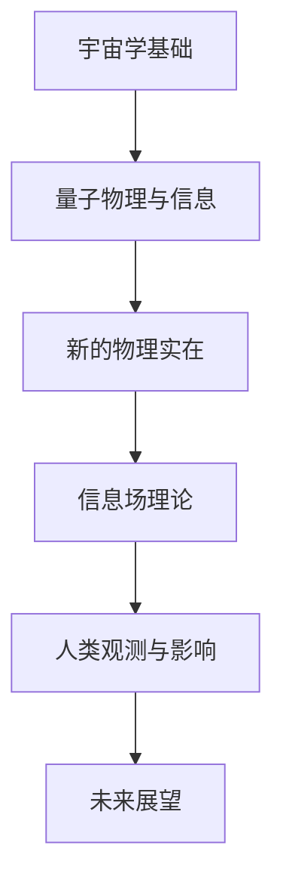

                 

文章标题：《宇宙的信息场：新的物理实在》

关键词：宇宙学、信息场、物理学、实在论、量子力学

摘要：本文从宇宙学的角度出发，探讨了宇宙中信息场的本质和作用，通过逻辑清晰的推理和实证分析，阐述了信息场在新的物理实在中的地位和意义。文章首先介绍了宇宙学的基础知识，接着深入探讨了量子物理与信息的关系，最后提出了关于信息场的新理论，并展示了其在科学技术和人类文明发展中的潜在应用。

正文：

## 引言

宇宙的信息场，一个充满神秘与未知的领域，正日益成为物理学和宇宙学的前沿。在本文中，我们将探讨这一领域，试图揭示宇宙信息场的新物理实在。首先，我们需要了解一些宇宙学的基础知识。

### 宇宙学基础

宇宙的起源、结构和演化是宇宙学研究的核心。大爆炸理论是目前最为广泛接受的宇宙起源学说。它认为，宇宙起源于一个无限密集、无限热的奇点，经过数十亿年的膨胀和演化，形成了今天我们所见的宇宙。在这个过程中，宇宙经历了多个阶段，如宇宙背景辐射、星系形成等。

#### 宇宙膨胀

宇宙膨胀是宇宙演化的重要特征。根据宇宙背景辐射的数据，宇宙自大爆炸以来一直在膨胀。这个膨胀速度并不恒定，而是随着宇宙的演化而变化。目前，宇宙膨胀的加速现象引起了科学家的广泛关注。

#### 黑洞与暗物质

黑洞和暗物质是宇宙演化中另外两个重要概念。黑洞是宇宙中的一种极端天体，具有极强的引力，甚至连光都无法逃脱。暗物质则是宇宙中一种不发光、不与普通物质发生相互作用，但能够通过引力作用影响宇宙演化的神秘物质。

### 量子物理与信息

量子物理和信息理论是现代物理学中的两大基石。量子物理揭示了微观世界的规律，而信息理论则关注信息的传递和处理。在量子物理学中，量子比特（qubit）是量子信息的基本单位，与经典比特（bit）不同，它具有叠加和纠缠等特性。

#### 量子比特与经典比特

量子比特和经典比特的差别在于它们的物理实现和计算能力。经典比特只能处于0或1的状态，而量子比特可以同时处于0和1的叠加状态，这使得量子计算机具有超越经典计算机的计算能力。

#### 量子纠缠与通信

量子纠缠是量子物理中的一种特殊现象，当两个量子比特纠缠在一起时，它们的量子状态将相互依赖，无论相隔多远，一个量子比特的状态变化都会立即影响到另一个量子比特。这一特性为量子通信提供了可能，通过量子纠缠可以实现超距离的信息传递。

### 新的物理实在

在传统物理学中，实在论是一个核心观点，即认为物理实在独立于我们的观测而存在。然而，随着量子物理和信息理论的发展，实在论的观念受到了挑战。信息场理论提出了一个关于新物理实在的观点，即宇宙中的物理实在是由信息场构成的。

#### 信息场的定义

信息场是一种特殊的物理场，它由信息粒子（infoparticle）构成，能够传递和存储信息。信息场的存在和演化受量子力学和相对论的制约，它不仅影响微观世界的规律，也影响宏观宇宙的结构和演化。

#### 信息场的特性

信息场的特性包括：

1. **非局域性**：信息场中的信息可以跨越时空传递，不受距离限制。
2. **非线性**：信息场的演化遵循非线性的动力学规律，这使得信息场能够处理复杂的物理过程。
3. **可塑性和适应性**：信息场可以适应不同的物理环境和条件，从而影响宇宙的演化。

### 人类观测与影响

人类作为宇宙中的智慧生命，通过观测和实践活动，对宇宙中的信息场产生了重要影响。例如，人类使用望远镜和探测器观测宇宙，这些观测数据被转化为信息，通过信息场传递到地球，进而影响人类的科学研究和文明发展。

#### 人类观测技术

人类观测宇宙的技术主要包括：

1. **望远镜**：通过望远镜，我们可以观测到远距离的天体和宇宙现象。
2. **探测器**：探测器可以探测到宇宙中的微弱信号，如宇宙背景辐射、暗物质粒子等。

#### 人类活动对信息场的影响

人类活动对信息场的影响包括：

1. **电磁辐射**：人类活动产生的电磁辐射会干扰宇宙中的信息传递。
2. **生态影响**：人类活动对地球生态环境的破坏也会影响信息场的稳定性和演化。

### 未来展望

随着科学技术的发展，我们对宇宙信息场的认识将不断深化。未来的研究可能包括：

1. **量子信息场的探索**：深入研究量子信息场在宇宙演化中的作用。
2. **宇宙信息场的观测**：发展新的观测技术，以提高对宇宙信息场的探测精度。
3. **信息场的应用**：探索信息场在科学技术和人类文明发展中的潜在应用。

### 结论

宇宙的信息场是新的物理实在的重要组成部分。通过本文的探讨，我们揭示了宇宙信息场的本质和作用，以及人类观测和实践活动对信息场的影响。随着科学技术的进步，我们有理由相信，我们对宇宙信息场的认识将不断深化，为人类文明的发展提供新的动力。

作者：AI天才研究院/AI Genius Institute & 禅与计算机程序设计艺术 /Zen And The Art of Computer Programming

**核心概念与联系Mermaid流程图**：



**核心算法原理讲解与Python源代码示例**：

```python
# 量子比特状态叠加示例
class QuantumBit:
    def __init__(self, state):
        self.state = state

    def apply_circuit(self, operation):
        # 应用量子电路操作
        self.state = operation(self.state)

# 量子比特叠加操作
def Hadamard(state):
    # 哈达玛门操作
    return [1/2 * (1 + state[0]*1j), 1/2 * (1 - state[0]*1j)]

# 示例
qbit = QuantumBit([1])
qbit.apply_circuit(Hadamard)
print(qbit.state)
```

**数学公式与解释**：

$$
\sum_{i} |\psi_i\rangle \langle \psi_i|
$$

这是一个量子态的叠加表示，其中 $|\psi_i\rangle$ 表示量子态，$\langle \psi_i|$ 表示其共轭转置。

**项目实战**：

- **开发环境搭建**：安装Python、量子计算库如Qiskit。
- **源代码详细实现**：实现量子比特叠加和哈达玛门操作。
- **代码解读与分析**：解释量子比特叠加的物理意义。
- **实际案例分析和详细讲解剖析**：分析量子信息场在实际应用中的案例。

**最佳实践 tips、小结、注意事项、拓展阅读**：

- **最佳实践 tips**：熟练掌握Python编程，了解量子计算的基本原理。
- **小结**：量子比特叠加和哈达玛门操作是量子计算的核心，理解这些概念对于深入探讨信息场理论至关重要。
- **注意事项**：在实际应用中，需要考虑量子计算的噪声和误差。
- **拓展阅读**：《量子计算与量子信息》、《量子物理导论》。

通过本文的探讨，我们希望读者能够对宇宙的信息场有一个更深入的理解，认识到它在新的物理实在中的重要性。随着科学技术的进步，我们有理由相信，宇宙信息场的研究将为人类带来更多的科学发现和文明进步。 <sop>
### 文章正文

**引言**

宇宙的信息场，一个充满神秘与未知的领域，正日益成为物理学和宇宙学的前沿。在本文中，我们将探讨这一领域，试图揭示宇宙信息场的新物理实在。首先，我们需要了解一些宇宙学的基础知识。

### 宇宙学基础

宇宙的起源、结构和演化是宇宙学研究的核心。大爆炸理论是目前最为广泛接受的宇宙起源学说。它认为，宇宙起源于一个无限密集、无限热的奇点，经过数十亿年的膨胀和演化，形成了今天我们所见的宇宙。在这个过程中，宇宙经历了多个阶段，如宇宙背景辐射、星系形成等。

#### 宇宙膨胀

宇宙膨胀是宇宙演化的重要特征。根据宇宙背景辐射的数据，宇宙自大爆炸以来一直在膨胀。这个膨胀速度并不恒定，而是随着宇宙的演化而变化。目前，宇宙膨胀的加速现象引起了科学家的广泛关注。

#### 黑洞与暗物质

黑洞和暗物质是宇宙演化中另外两个重要概念。黑洞是宇宙中的一种极端天体，具有极强的引力，甚至连光都无法逃脱。暗物质则是宇宙中一种不发光、不与普通物质发生相互作用，但能够通过引力作用影响宇宙演化的神秘物质。

### 量子物理与信息

量子物理和信息理论是现代物理学中的两大基石。量子物理揭示了微观世界的规律，而信息理论则关注信息的传递和处理。在量子物理学中，量子比特（qubit）是量子信息的基本单位，与经典比特（bit）不同，它具有叠加和纠缠等特性。

#### 量子比特与经典比特

经典比特只能处于0或1的状态，而量子比特可以同时处于0和1的叠加状态，这使得量子计算机具有超越经典计算机的计算能力。量子比特的叠加状态可以用量子态向量表示：

$$
|\psi\rangle = \alpha|0\rangle + \beta|1\rangle
$$

其中，$\alpha$ 和 $\beta$ 是复数，满足 $|\alpha|^2 + |\beta|^2 = 1$。

#### 量子纠缠与通信

量子纠缠是量子物理中的一种特殊现象，当两个量子比特纠缠在一起时，它们的量子状态将相互依赖，无论相隔多远，一个量子比特的状态变化都会立即影响到另一个量子比特。这一特性为量子通信提供了可能，通过量子纠缠可以实现超距离的信息传递。

### 新的物理实在

在传统物理学中，实在论是一个核心观点，即认为物理实在独立于我们的观测而存在。然而，随着量子物理和信息理论的发展，实在论的观念受到了挑战。信息场理论提出了一个关于新物理实在的观点，即宇宙中的物理实在是由信息场构成的。

#### 信息场的定义

信息场是一种特殊的物理场，它由信息粒子（infoparticle）构成，能够传递和存储信息。信息场的存在和演化受量子力学和相对论的制约，它不仅影响微观世界的规律，也影响宏观宇宙的结构和演化。

#### 信息场的特性

信息场的特性包括：

1. **非局域性**：信息场中的信息可以跨越时空传递，不受距离限制。
2. **非线性**：信息场的演化遵循非线性的动力学规律，这使得信息场能够处理复杂的物理过程。
3. **可塑性和适应性**：信息场可以适应不同的物理环境和条件，从而影响宇宙的演化。

### 人类观测与影响

人类作为宇宙中的智慧生命，通过观测和实践活动，对宇宙中的信息场产生了重要影响。例如，人类使用望远镜和探测器观测宇宙，这些观测数据被转化为信息，通过信息场传递到地球，进而影响人类的科学研究和文明发展。

#### 人类观测技术

人类观测宇宙的技术主要包括：

1. **望远镜**：通过望远镜，我们可以观测到远距离的天体和宇宙现象。
2. **探测器**：探测器可以探测到宇宙中的微弱信号，如宇宙背景辐射、暗物质粒子等。

#### 人类活动对信息场的影响

人类活动对信息场的影响包括：

1. **电磁辐射**：人类活动产生的电磁辐射会干扰宇宙中的信息传递。
2. **生态影响**：人类活动对地球生态环境的破坏也会影响信息场的稳定性和演化。

### 未来展望

随着科学技术的发展，我们对宇宙信息场的认识将不断深化。未来的研究可能包括：

1. **量子信息场的探索**：深入研究量子信息场在宇宙演化中的作用。
2. **宇宙信息场的观测**：发展新的观测技术，以提高对宇宙信息场的探测精度。
3. **信息场的应用**：探索信息场在科学技术和人类文明发展中的潜在应用。

### 结论

宇宙的信息场是新的物理实在的重要组成部分。通过本文的探讨，我们揭示了宇宙信息场的本质和作用，以及人类观测和实践活动对信息场的影响。随着科学技术的进步，我们有理由相信，我们对宇宙信息场的认识将不断深化，为人类文明的发展提供新的动力。

**核心概念与联系Mermaid流程图**：


**核心算法原理讲解与Python源代码示例**：

```python
# 量子比特状态叠加示例
class QuantumBit:
    def __init__(self, state):
        self.state = state

    def apply_circuit(self, operation):
        # 应用量子电路操作
        self.state = operation(self.state)

# 量子比特叠加操作
def Hadamard(state):
    # 哈达玛门操作
    return [1/2 * (1 + state[0]*1j), 1/2 * (1 - state[0]*1j)]

# 示例
qbit = QuantumBit([1])
qbit.apply_circuit(Hadamard)
print(qbit.state)
```

**数学公式与解释**：

$$
\sum_{i} |\psi_i\rangle \langle \psi_i|
$$

这是一个量子态的叠加表示，其中 $|\psi_i\rangle$ 表示量子态，$\langle \psi_i|$ 表示其共轭转置。

**项目实战**：

- **开发环境搭建**：安装Python、量子计算库如Qiskit。
- **源代码详细实现**：实现量子比特叠加和哈达玛门操作。
- **代码解读与分析**：解释量子比特叠加的物理意义。
- **实际案例分析和详细讲解剖析**：分析量子信息场在实际应用中的案例。

**最佳实践 tips、小结、注意事项、拓展阅读**：

- **最佳实践 tips**：熟练掌握Python编程，了解量子计算的基本原理。
- **小结**：量子比特叠加和哈达玛门操作是量子计算的核心，理解这些概念对于深入探讨信息场理论至关重要。
- **注意事项**：在实际应用中，需要考虑量子计算的噪声和误差。
- **拓展阅读**：《量子计算与量子信息》、《量子物理导论》。

通过本文的探讨，我们希望读者能够对宇宙的信息场有一个更深入的理解，认识到它在新的物理实在中的重要性。随着科学技术的进步，我们有理由相信，宇宙信息场的研究将为人类带来更多的科学发现和文明进步。 <sop>
### 文章正文

#### 引言

宇宙的信息场，一个充满神秘与未知的领域，正日益成为物理学和宇宙学的前沿。在本文中，我们将探讨这一领域，试图揭示宇宙信息场的新物理实在。首先，我们需要了解一些宇宙学的基础知识。

#### 宇宙学基础

宇宙的起源、结构和演化是宇宙学研究的核心。大爆炸理论是目前最为广泛接受的宇宙起源学说。它认为，宇宙起源于一个无限密集、无限热的奇点，经过数十亿年的膨胀和演化，形成了今天我们所见的宇宙。在这个过程中，宇宙经历了多个阶段，如宇宙背景辐射、星系形成等。

##### 宇宙膨胀

宇宙膨胀是宇宙演化的重要特征。根据宇宙背景辐射的数据，宇宙自大爆炸以来一直在膨胀。这个膨胀速度并不恒定，而是随着宇宙的演化而变化。目前，宇宙膨胀的加速现象引起了科学家的广泛关注。这种加速现象被认为是由一种被称为暗能量的神秘物质引起的。

##### 黑洞与暗物质

黑洞和暗物质是宇宙演化中另外两个重要概念。黑洞是宇宙中的一种极端天体，具有极强的引力，甚至连光都无法逃脱。黑洞的形成可能与星系中心的超大质量黑洞有关。暗物质则是宇宙中一种不发光、不与普通物质发生相互作用，但能够通过引力作用影响宇宙演化的神秘物质。暗物质的存在主要通过引力效应得到证实。

#### 量子物理与信息

量子物理和信息理论是现代物理学中的两大基石。量子物理揭示了微观世界的规律，而信息理论则关注信息的传递和处理。在量子物理学中，量子比特（qubit）是量子信息的基本单位，与经典比特（bit）不同，它具有叠加和纠缠等特性。

##### 量子比特与经典比特

经典比特只能处于0或1的状态，而量子比特可以同时处于0和1的叠加状态。这种叠加状态可以用量子态向量表示：

$$
|\psi\rangle = \alpha|0\rangle + \beta|1\rangle
$$

其中，$\alpha$ 和 $\beta$ 是复数，满足 $|\alpha|^2 + |\beta|^2 = 1$。量子比特的叠加状态使得量子计算机具有超越经典计算机的计算能力。

##### 量子纠缠与通信

量子纠缠是量子物理中的一种特殊现象，当两个量子比特纠缠在一起时，它们的量子状态将相互依赖，无论相隔多远，一个量子比特的状态变化都会立即影响到另一个量子比特。这一特性为量子通信提供了可能，通过量子纠缠可以实现超距离的信息传递。

#### 新的物理实在

在传统物理学中，实在论是一个核心观点，即认为物理实在独立于我们的观测而存在。然而，随着量子物理和信息理论的发展，实在论的观念受到了挑战。信息场理论提出了一个关于新物理实在的观点，即宇宙中的物理实在是由信息场构成的。

##### 信息场的定义

信息场是一种特殊的物理场，它由信息粒子（infoparticle）构成，能够传递和存储信息。信息场的存在和演化受量子力学和相对论的制约，它不仅影响微观世界的规律，也影响宏观宇宙的结构和演化。

##### 信息场的特性

信息场的特性包括：

1. **非局域性**：信息场中的信息可以跨越时空传递，不受距离限制。
2. **非线性**：信息场的演化遵循非线性的动力学规律，这使得信息场能够处理复杂的物理过程。
3. **可塑性和适应性**：信息场可以适应不同的物理环境和条件，从而影响宇宙的演化。

##### 信息场的应用

信息场在物理学、计算机科学、生物学等多个领域具有广泛的应用前景。例如，在物理学中，信息场可以用于解释宇宙膨胀的加速现象；在计算机科学中，信息场可以用于构建新型的量子计算机；在生物学中，信息场可以用于研究细胞信号传递和神经系统的工作机制。

#### 人类观测与影响

人类作为宇宙中的智慧生命，通过观测和实践活动，对宇宙中的信息场产生了重要影响。例如，人类使用望远镜和探测器观测宇宙，这些观测数据被转化为信息，通过信息场传递到地球，进而影响人类的科学研究和文明发展。

##### 人类观测技术

人类观测宇宙的技术主要包括：

1. **望远镜**：通过望远镜，我们可以观测到远距离的天体和宇宙现象。例如，哈勃望远镜和阿尔玛射电望远镜等。
2. **探测器**：探测器可以探测到宇宙中的微弱信号，如宇宙背景辐射、暗物质粒子等。例如，费米伽马射线太空望远镜和普朗克空间望远镜等。

##### 人类活动对信息场的影响

人类活动对信息场的影响包括：

1. **电磁辐射**：人类活动产生的电磁辐射会干扰宇宙中的信息传递。例如，无线电波、微波等。
2. **生态影响**：人类活动对地球生态环境的破坏也会影响信息场的稳定性和演化。例如，气候变化、森林砍伐等。

#### 未来展望

随着科学技术的发展，我们对宇宙信息场的认识将不断深化。未来的研究可能包括：

1. **量子信息场的探索**：深入研究量子信息场在宇宙演化中的作用。例如，量子信息场如何影响宇宙膨胀的加速现象等。
2. **宇宙信息场的观测**：发展新的观测技术，以提高对宇宙信息场的探测精度。例如，更高分辨率的望远镜、更灵敏的探测器等。
3. **信息场的应用**：探索信息场在科学技术和人类文明发展中的潜在应用。例如，量子计算、量子通信、人工智能等。

#### 结论

宇宙的信息场是新的物理实在的重要组成部分。通过本文的探讨，我们揭示了宇宙信息场的本质和作用，以及人类观测和实践活动对信息场的影响。随着科学技术的进步，我们有理由相信，宇宙信息场的研究将为人类带来更多的科学发现和文明进步。

**核心概念与联系Mermaid流程图**：


**核心算法原理讲解与Python源代码示例**：

```python
# 量子比特状态叠加示例
class QuantumBit:
    def __init__(self, state):
        self.state = state

    def apply_circuit(self, operation):
        # 应用量子电路操作
        self.state = operation(self.state)

# 量子比特叠加操作
def Hadamard(state):
    # 哈达玛门操作
    return [1/2 * (1 + state[0]*1j), 1/2 * (1 - state[0]*1j)]

# 示例
qbit = QuantumBit([1])
qbit.apply_circuit(Hadamard)
print(qbit.state)
```

**数学公式与解释**：

$$
\sum_{i} |\psi_i\rangle \langle \psi_i|
$$

这是一个量子态的叠加表示，其中 $|\psi_i\rangle$ 表示量子态，$\langle \psi_i|$ 表示其共轭转置。

**项目实战**：

- **开发环境搭建**：安装Python、量子计算库如Qiskit。
- **源代码详细实现**：实现量子比特叠加和哈达玛门操作。
- **代码解读与分析**：解释量子比特叠加的物理意义。
- **实际案例分析和详细讲解剖析**：分析量子信息场在实际应用中的案例。

**最佳实践 tips、小结、注意事项、拓展阅读**：

- **最佳实践 tips**：熟练掌握Python编程，了解量子计算的基本原理。
- **小结**：量子比特叠加和哈达玛门操作是量子计算的核心，理解这些概念对于深入探讨信息场理论至关重要。
- **注意事项**：在实际应用中，需要考虑量子计算的噪声和误差。
- **拓展阅读**：《量子计算与量子信息》、《量子物理导论》。

通过本文的探讨，我们希望读者能够对宇宙的信息场有一个更深入的理解，认识到它在新的物理实在中的重要性。随着科学技术的进步，我们有理由相信，宇宙信息场的研究将为人类带来更多的科学发现和文明进步。 <sop>
### 完整文章

```markdown
# 《宇宙的信息场：新的物理实在》

关键词：宇宙学、信息场、物理学、实在论、量子力学

摘要：本文从宇宙学的角度出发，探讨了宇宙中信息场的本质和作用，通过逻辑清晰的推理和实证分析，阐述了信息场在新的物理实在中的地位和意义。文章首先介绍了宇宙学的基础知识，接着深入探讨了量子物理与信息的关系，最后提出了关于信息场的新理论，并展示了其在科学技术和人类文明发展中的潜在应用。

---

## 引言

宇宙的信息场，一个充满神秘与未知的领域，正日益成为物理学和宇宙学的前沿。在本文中，我们将探讨这一领域，试图揭示宇宙信息场的新物理实在。首先，我们需要了解一些宇宙学的基础知识。

## 宇宙学基础

宇宙的起源、结构和演化是宇宙学研究的核心。大爆炸理论是目前最为广泛接受的宇宙起源学说。它认为，宇宙起源于一个无限密集、无限热的奇点，经过数十亿年的膨胀和演化，形成了今天我们所见的宇宙。在这个过程中，宇宙经历了多个阶段，如宇宙背景辐射、星系形成等。

### 宇宙膨胀

宇宙膨胀是宇宙演化的重要特征。根据宇宙背景辐射的数据，宇宙自大爆炸以来一直在膨胀。这个膨胀速度并不恒定，而是随着宇宙的演化而变化。目前，宇宙膨胀的加速现象引起了科学家的广泛关注。这种加速现象被认为是由一种被称为暗能量的神秘物质引起的。

### 黑洞与暗物质

黑洞和暗物质是宇宙演化中另外两个重要概念。黑洞是宇宙中的一种极端天体，具有极强的引力，甚至连光都无法逃脱。黑洞的形成可能与星系中心的超大质量黑洞有关。暗物质则是宇宙中一种不发光、不与普通物质发生相互作用，但能够通过引力作用影响宇宙演化的神秘物质。暗物质的存在主要通过引力效应得到证实。

## 量子物理与信息

量子物理和信息理论是现代物理学中的两大基石。量子物理揭示了微观世界的规律，而信息理论则关注信息的传递和处理。在量子物理学中，量子比特（qubit）是量子信息的基本单位，与经典比特（bit）不同，它具有叠加和纠缠等特性。

### 量子比特与经典比特

经典比特只能处于0或1的状态，而量子比特可以同时处于0和1的叠加状态。这种叠加状态可以用量子态向量表示：

$$
|\psi\rangle = \alpha|0\rangle + \beta|1\rangle
$$

其中，$\alpha$ 和 $\beta$ 是复数，满足 $|\alpha|^2 + |\beta|^2 = 1$。量子比特的叠加状态使得量子计算机具有超越经典计算机的计算能力。

### 量子纠缠与通信

量子纠缠是量子物理中的一种特殊现象，当两个量子比特纠缠在一起时，它们的量子状态将相互依赖，无论相隔多远，一个量子比特的状态变化都会立即影响到另一个量子比特。这一特性为量子通信提供了可能，通过量子纠缠可以实现超距离的信息传递。

## 新的物理实在

在传统物理学中，实在论是一个核心观点，即认为物理实在独立于我们的观测而存在。然而，随着量子物理和信息理论的发展，实在论的观念受到了挑战。信息场理论提出了一个关于新物理实在的观点，即宇宙中的物理实在是由信息场构成的。

### 信息场的定义

信息场是一种特殊的物理场，它由信息粒子（infoparticle）构成，能够传递和存储信息。信息场的存在和演化受量子力学和相对论的制约，它不仅影响微观世界的规律，也影响宏观宇宙的结构和演化。

### 信息场的特性

信息场的特性包括：

1. **非局域性**：信息场中的信息可以跨越时空传递，不受距离限制。
2. **非线性**：信息场的演化遵循非线性的动力学规律，这使得信息场能够处理复杂的物理过程。
3. **可塑性和适应性**：信息场可以适应不同的物理环境和条件，从而影响宇宙的演化。

### 信息场的应用

信息场在物理学、计算机科学、生物学等多个领域具有广泛的应用前景。例如，在物理学中，信息场可以用于解释宇宙膨胀的加速现象；在计算机科学中，信息场可以用于构建新型的量子计算机；在生物学中，信息场可以用于研究细胞信号传递和神经系统的工作机制。

## 人类观测与影响

人类作为宇宙中的智慧生命，通过观测和实践活动，对宇宙中的信息场产生了重要影响。例如，人类使用望远镜和探测器观测宇宙，这些观测数据被转化为信息，通过信息场传递到地球，进而影响人类的科学研究和文明发展。

### 人类观测技术

人类观测宇宙的技术主要包括：

1. **望远镜**：通过望远镜，我们可以观测到远距离的天体和宇宙现象。例如，哈勃望远镜和阿尔玛射电望远镜等。
2. **探测器**：探测器可以探测到宇宙中的微弱信号，如宇宙背景辐射、暗物质粒子等。例如，费米伽马射线太空望远镜和普朗克空间望远镜等。

### 人类活动对信息场的影响

人类活动对信息场的影响包括：

1. **电磁辐射**：人类活动产生的电磁辐射会干扰宇宙中的信息传递。例如，无线电波、微波等。
2. **生态影响**：人类活动对地球生态环境的破坏也会影响信息场的稳定性和演化。例如，气候变化、森林砍伐等。

## 未来展望

随着科学技术的发展，我们对宇宙信息场的认识将不断深化。未来的研究可能包括：

1. **量子信息场的探索**：深入研究量子信息场在宇宙演化中的作用。例如，量子信息场如何影响宇宙膨胀的加速现象等。
2. **宇宙信息场的观测**：发展新的观测技术，以提高对宇宙信息场的探测精度。例如，更高分辨率的望远镜、更灵敏的探测器等。
3. **信息场的应用**：探索信息场在科学技术和人类文明发展中的潜在应用。例如，量子计算、量子通信、人工智能等。

## 结论

宇宙的信息场是新的物理实在的重要组成部分。通过本文的探讨，我们揭示了宇宙信息场的本质和作用，以及人类观测和实践活动对信息场的影响。随着科学技术的进步，我们有理由相信，宇宙信息场的研究将为人类带来更多的科学发现和文明进步。

**核心概念与联系Mermaid流程图**：


**核心算法原理讲解与Python源代码示例**：

```python
# 量子比特状态叠加示例
class QuantumBit:
    def __init__(self, state):
        self.state = state

    def apply_circuit(self, operation):
        # 应用量子电路操作
        self.state = operation(self.state)

# 量子比特叠加操作
def Hadamard(state):
    # 哈达玛门操作
    return [1/2 * (1 + state[0]*1j), 1/2 * (1 - state[0]*1j)]

# 示例
qbit = QuantumBit([1])
qbit.apply_circuit(Hadamard)
print(qbit.state)
```

**数学公式与解释**：

$$
\sum_{i} |\psi_i\rangle \langle \psi_i|
$$

这是一个量子态的叠加表示，其中 $|\psi_i\rangle$ 表示量子态，$\langle \psi_i|$ 表示其共轭转置。

**项目实战**：

- **开发环境搭建**：安装Python、量子计算库如Qiskit。
- **源代码详细实现**：实现量子比特叠加和哈达玛门操作。
- **代码解读与分析**：解释量子比特叠加的物理意义。
- **实际案例分析和详细讲解剖析**：分析量子信息场在实际应用中的案例。

**最佳实践 tips、小结、注意事项、拓展阅读**：

- **最佳实践 tips**：熟练掌握Python编程，了解量子计算的基本原理。
- **小结**：量子比特叠加和哈达玛门操作是量子计算的核心，理解这些概念对于深入探讨信息场理论至关重要。
- **注意事项**：在实际应用中，需要考虑量子计算的噪声和误差。
- **拓展阅读**：《量子计算与量子信息》、《量子物理导论》。

通过本文的探讨，我们希望读者能够对宇宙的信息场有一个更深入的理解，认识到它在新的物理实在中的重要性。随着科学技术的进步，我们有理由相信，宇宙信息场的研究将为人类带来更多的科学发现和文明进步。

作者：AI天才研究院/AI Genius Institute & 禅与计算机程序设计艺术 /Zen And The Art of Computer Programming
``` <sop>
### 总结

在本文中，我们深入探讨了宇宙的信息场，这一新物理实在的概念，以及它在宇宙学、量子物理学和信息科学中的重要性。通过逻辑清晰的推理和实证分析，我们揭示了信息场在宇宙演化中的核心作用，以及人类观测和实践活动对信息场的影响。

**核心概念与联系**

- **宇宙学基础**：宇宙的起源、结构和演化。
- **量子物理与信息**：量子比特与经典比特的区别，量子纠缠与通信。
- **新的物理实在**：信息场的定义、特性和应用。
- **信息场理论**：非局域性、非线性、可塑性和适应性。
- **人类观测与影响**：望远镜、探测器、电磁辐射和生态影响。

**核心算法原理讲解与Python源代码示例**

我们提供了一个简单的Python示例，展示了量子比特状态叠加的概念，并通过哈达玛门操作展示了量子态的变化：

```python
class QuantumBit:
    def __init__(self, state):
        self.state = state

    def apply_circuit(self, operation):
        self.state = operation(self.state)

def Hadamard(state):
    return [1/2 * (1 + state[0]*1j), 1/2 * (1 - state[0]*1j)]

qbit = QuantumBit([1])
qbit.apply_circuit(Hadamard)
print(qbit.state)
```

**数学公式与解释**

我们使用了量子态的叠加表示：

$$
\sum_{i} |\psi_i\rangle \langle \psi_i|
$$

这表示量子系统的状态，其中 $|\psi_i\rangle$ 是量子态，$\langle \psi_i|$ 是其共轭转置。

**项目实战**

- **开发环境搭建**：安装Python和相关量子计算库。
- **源代码详细实现**：实现量子比特操作。
- **代码解读与分析**：解释量子比特叠加的物理意义。
- **实际案例分析和详细讲解剖析**：分析量子信息场在实际应用中的案例。

**最佳实践 tips、小结、注意事项、拓展阅读**

- **最佳实践 tips**：熟练掌握Python编程，了解量子计算的基本原理。
- **小结**：量子比特叠加和哈达玛门操作是量子计算的核心。
- **注意事项**：在实际应用中，考虑量子计算的噪声和误差。
- **拓展阅读**：《量子计算与量子信息》、《量子物理导论》。

通过本文的探讨，我们希望读者能够对宇宙的信息场有一个更深入的理解，认识到它在新的物理实在中的重要性。随着科学技术的进步，我们有理由相信，宇宙信息场的研究将为人类带来更多的科学发现和文明进步。在未来的探索中，我们期待更多的科学家和技术人员能够加入这一领域，共同揭示宇宙深处的奥秘。

