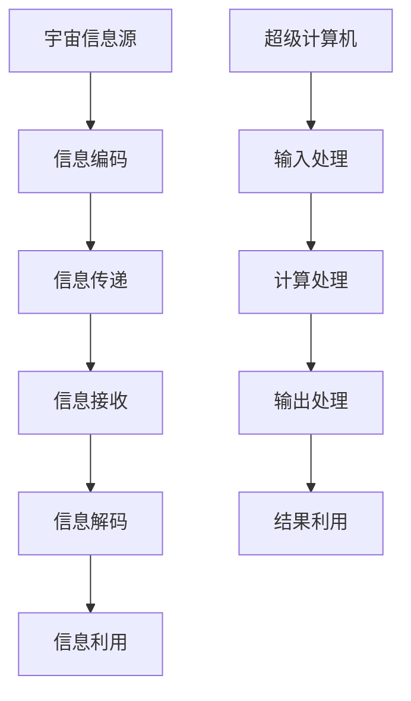
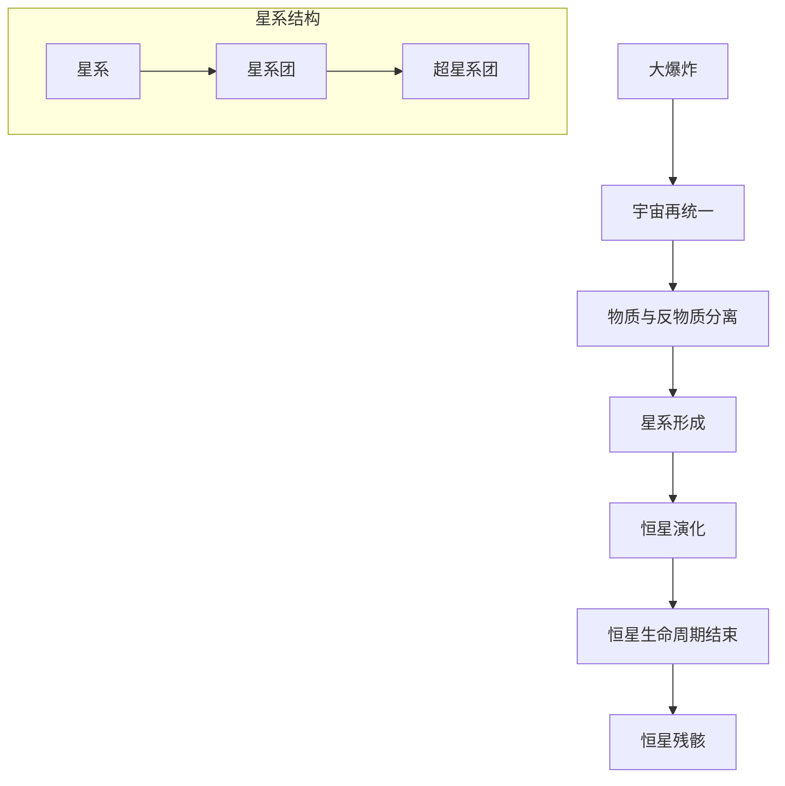
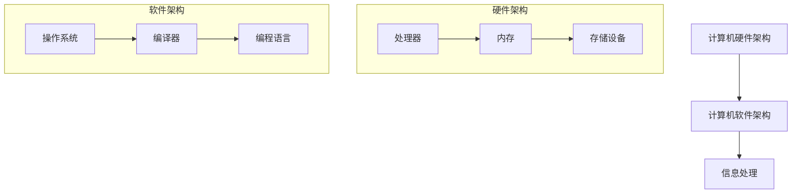
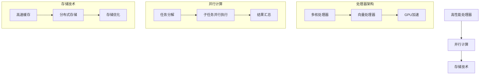
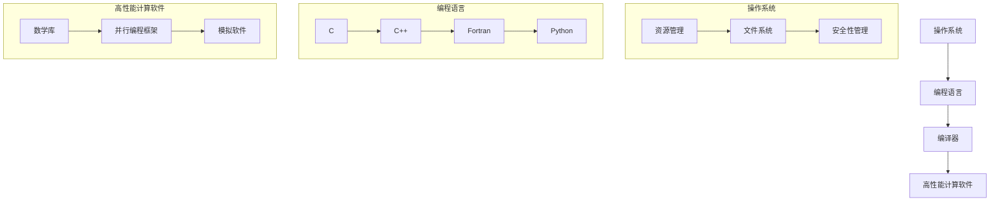
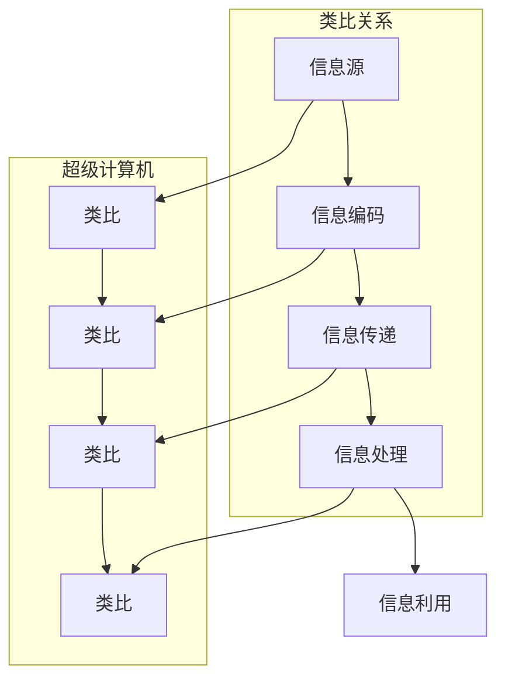
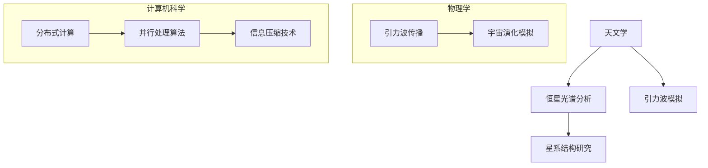

                 

### 第一部分：引言与概述

#### 第1章 宇宙信息处理与超级计算机的类比

**背景介绍**：
本书的标题《宇宙的信息处理：类比超级计算机》提出了一个有趣的视角，即将宇宙中的信息处理过程与地球上的超级计算机进行类比。这样的类比不仅有助于我们更好地理解宇宙的工作原理，还能够为计算机科学提供新的启发。

**核心概念与联系**：
- **宇宙信息处理**：涉及宇宙中信息的传递、编码、解码等过程。例如，恒星通过辐射传递光子，星系通过引力波传递信息。
- **超级计算机**：是一种能够执行大量计算任务的高性能计算机，其核心在于并行计算和高效的算法设计。

为了展示宇宙信息处理与超级计算机之间的联系，我们可以使用Mermaid流程图来描述一个基本的类比框架：



**图解说明**：
- **A -> B**：宇宙中的信息源，如恒星辐射的光子，需要经过编码处理，例如波长编码。
- **B -> C**：编码后的信息通过宇宙空间传递，这可能涉及到信息损耗和噪声。
- **C -> D**：接收器接收信息，可能需要抗干扰和降噪处理。
- **D -> E**：接收到的信息需要解码，以恢复原始信息。
- **E -> F**：解码后的信息被利用，例如，恒星光谱分析可以帮助我们了解恒星的化学成分。

- **G -> H**：超级计算机接收输入，可能是文本、图像或数据流。
- **H -> I**：输入数据被处理，通过计算模型和算法进行分析。
- **I -> J**：处理后的输出数据可能是一个结果或一个可视化图表。
- **J -> K**：输出数据被用于进一步分析和决策。

通过这样的类比，我们可以看到，尽管宇宙和超级计算机的运作环境大相径庭，但在处理信息的流程上却有着相似之处。这种类比不仅有助于我们理解宇宙，也为计算机科学提供了新的视角。

**核心算法原理讲解**：

在描述宇宙信息处理的具体算法时，我们可以考虑使用Python来演示一个简单的光子编码与解码的模型。以下是一个简单的示例：

```python
import numpy as np

def encode_lightwave(wavelength, channel_width):
    """
    对光子的波长进行编码。
    
    参数：
    wavelength：光子的波长（纳米）
    channel_width：编码通道宽度（纳米）
    
    返回：
    编码后的信息
    """
    return (wavelength // channel_width) * channel_width

def decode_lightwave(encoded_wave):
    """
    对编码后的光子波长进行解码。
    
    参数：
    encoded_wave：编码后的波长
    
    返回：
    解码后的波长
    """
    return (encoded_wave // 10) * 10

# 假设我们有一个光子波长为550纳米，编码通道宽度为10纳米
original_wave = 550
encoded_wave = encode_lightwave(original_wave, 10)
decoded_wave = decode_lightwave(encoded_wave)

print(f"原始波长：{original_wave} nm，编码后波长：{encoded_wave} nm，解码后波长：{decoded_wave} nm")
```

在这个示例中，我们定义了两个函数：`encode_lightwave` 和 `decode_lightwave`。前者将光子的波长编码为最近的编码通道宽度，后者则将编码后的波长解码回原始波长。这里使用了简单的整数除法和取模运算来模拟编码和解码过程。

**数学模型和公式**：

在宇宙信息处理中，常用的数学模型包括信息熵和信息传递速率。以下是一个简单介绍：

$$
H(X) = -\sum_{i} p(x_i) \log_2 p(x_i)
$$

其中，$H(X)$ 表示随机变量 $X$ 的信息熵，$p(x_i)$ 是 $X$ 取值为 $x_i$ 的概率。

信息传递速率 $R$ 可以通过以下公式计算：

$$
R = \frac{1}{H(X)}
$$

这个公式表示信息传输的速度，单位为比特/秒。

**项目实战**：

为了更好地理解这一概念，我们可以构建一个简单的宇宙信息处理系统，包括光子的编码和解码。以下是项目的基本步骤：

1. **开发环境搭建**：安装Python和相关库，如NumPy。
2. **源代码实现**：实现编码和解码函数。
3. **代码解读**：分析源代码，理解每个函数的作用。
4. **实际案例分析**：使用模拟数据测试编码和解码过程。
5. **详细讲解剖析**：讨论模拟结果，分析可能的错误和改进方法。
6. **项目小结**：总结项目实现的关键点和学到的经验。

通过这个项目，我们可以更好地理解宇宙信息处理的基本原理，并将其与超级计算机的运作进行比较。

**最佳实践 tips**：

- 在进行宇宙信息处理模拟时，需要注意光子的实际传输速度和距离，这会影响编码和解码的准确性。
- 在设计信息编码和解码算法时，需要考虑抗干扰性和鲁棒性，确保信息在传输过程中不会丢失或被篡改。

**小结**：

通过本章的介绍，我们初步探讨了宇宙信息处理与超级计算机的类比关系。这种类比不仅有助于我们理解宇宙的工作原理，也为计算机科学提供了新的视角。接下来的章节将深入探讨宇宙学基础、信息论与计算机科学、超级计算机架构与技术等方面，进一步丰富这一主题。

**注意事项**：

- 在进行宇宙信息处理的模拟时，需要考虑物理限制，如光速和宇宙膨胀等。
- 对于超级计算机的类比，需要明确其局限性，因为宇宙与地球上的计算机环境存在本质差异。

**拓展阅读**：

- 《宇宙学：从大爆炸到宇宙的未来》[作者：克里斯托弗·切蒂]
- 《信息论基础》[作者：克劳德·香农]
- 《现代计算机科学导论》[作者：杰里·瑞斯尼克，彼得·布拉姆斯利]

作者：AI天才研究院/AI Genius Institute & 禅与计算机程序设计艺术 /Zen And The Art of Computer Programming

------------------------------------------------------------

### 第2章 宇宙的结构与演化

**背景介绍**：
宇宙的结构与演化是宇宙学的基础研究领域。宇宙不仅仅是一个宏观的空间，它包含了无数的天体，如恒星、星系、星云等。理解宇宙的结构和演化对于揭示宇宙的本质、理解宇宙中信息传递的方式具有重要意义。

**核心概念与联系**：

宇宙结构的核心概念包括宇宙的大尺度结构、宇宙的层次性以及宇宙的演化历程。宇宙的大尺度结构可以分为多个层次，从最小的星系团到最大的超星系团。每个层次都有其特定的结构和演化规律。

- **星系**：宇宙的基本单元，由数十亿至数千亿颗恒星组成。星系可以分为螺旋星系、椭圆星系和不规则星系。
- **星系团**：由数十个到数千个星系组成的更大结构，通过引力相互吸引。
- **超星系团**：由数十个到数百个星系团组成的巨大结构。

宇宙的演化历程可以大致分为以下几个阶段：

1. **大爆炸**：宇宙从一个极度高温和高压的状态开始膨胀。
2. **宇宙再统一**：随着宇宙的膨胀，温度降低，宇宙从单一的等离子态分离成物质和反物质。
3. **星系形成**：在宇宙冷却过程中，物质开始聚集形成星系和其他天体结构。
4. **恒星演化**：恒星在其生命周期中经历多个阶段，最终可能成为白矮星、中子星或黑洞。

为了更好地理解这些核心概念之间的联系，我们可以使用Mermaid流程图来描述宇宙的结构与演化过程：



**图解说明**：

- **A -> B**：大爆炸后，宇宙开始膨胀，温度和密度降低，物质和反物质分离。
- **B -> C**：宇宙继续膨胀，物质开始聚集形成星系。
- **C -> D**：星系形成，恒星和其他天体结构开始形成。
- **D -> E**：恒星在其生命周期中经历多个阶段，最终可能成为白矮星、中子星或黑洞。
- **E -> F**：恒星生命周期结束，恒星残骸形成。
- **F -> G**：恒星残骸可能成为星系结构的一部分，继续参与宇宙的演化。

**核心算法原理讲解**：

在描述宇宙的演化过程中，我们可以使用Python来模拟恒星生命周期中的几个关键阶段。以下是一个简单的示例：

```python
def main_sequence_mass_loss(mass, loss_rate):
    """
    恒星主序阶段的质量损失。
    
    参数：
    mass：恒星初始质量（太阳质量）
    loss_rate：质量损失率（每年损失的质量，以太阳质量为单位）
    
    返回：
    恒星在主序阶段结束时的质量
    """
    years = 10 * 10**8  # 恒星主序阶段大约10亿年
    mass_lost = years * loss_rate
    return mass - mass_lost

def stellar_merger(mass1, mass2):
    """
    两颗恒星的合并过程。
    
    参数：
    mass1：第一颗恒星的初始质量
    mass2：第二颗恒星的初始质量
    
    返回：
    合并后恒星的最终质量
    """
    return mass1 + mass2

# 假设我们有两颗恒星，初始质量分别为1.4倍太阳质量和1.2倍太阳质量
mass1 = 1.4 * 1.989e30  # 第一颗恒星质量，单位为千克
mass2 = 1.2 * 1.989e30  # 第二颗恒星质量，单位为千克
main_sequence_end_mass1 = main_sequence_mass_loss(mass1, 4e28)
main_sequence_end_mass2 = main_sequence_mass_loss(mass2, 3.6e28)
merged_mass = stellar_merger(main_sequence_end_mass1, main_sequence_end_mass2)

print(f"第一颗恒星主序结束时的质量：{main_sequence_end_mass1 / 1.989e30}太阳质量")
print(f"第二颗恒星主序结束时的质量：{main_sequence_end_mass2 / 1.989e30}太阳质量")
print(f"合并后恒星的最终质量：{merged_mass / 1.989e30}太阳质量")
```

在这个示例中，我们定义了两个函数：`main_sequence_mass_loss` 和 `stellar_merger`。前者模拟了恒星在主序阶段的质量损失，后者模拟了两颗恒星的合并过程。

**数学模型和公式**：

在描述恒星的生命周期时，常用的数学模型包括恒星质量损失率和恒星合并的质量守恒定律。以下是一个简单介绍：

1. **恒星质量损失率**：

$$
\frac{dM}{dt} = -\dot{M}
$$

其中，$M$ 是恒星的质量，$\dot{M}$ 是恒星的质量损失率。

2. **恒星合并的质量守恒定律**：

$$
M_{\text{final}} = M_1 + M_2
$$

其中，$M_{\text{final}}$ 是合并后恒星的最终质量，$M_1$ 和 $M_2$ 是两颗恒星的初始质量。

**项目实战**：

为了更好地理解恒星生命周期的模拟，我们可以构建一个简单的宇宙信息处理系统，包括恒星的质量损失和合并过程。以下是项目的基本步骤：

1. **开发环境搭建**：安装Python和相关库，如NumPy。
2. **源代码实现**：实现质量损失和合并函数。
3. **代码解读**：分析源代码，理解每个函数的作用。
4. **实际案例分析**：使用模拟数据测试质量损失和合并过程。
5. **详细讲解剖析**：讨论模拟结果，分析可能的错误和改进方法。
6. **项目小结**：总结项目实现的关键点和学到的经验。

通过这个项目，我们可以更好地理解恒星生命周期的基本原理，并将其与宇宙信息处理过程进行比较。

**最佳实践 tips**：

- 在模拟恒星质量损失时，需要考虑恒星的具体类型和演化阶段，不同类型的恒星质量损失率可能不同。
- 在模拟恒星合并时，需要考虑合并过程中可能发生的物理现象，如引力波辐射和核合成。

**小结**：

通过本章的介绍，我们初步了解了宇宙的结构与演化，以及其中的核心概念和联系。这些知识不仅有助于我们理解宇宙的本质，也为后续章节中宇宙信息处理的讨论奠定了基础。

**注意事项**：

- 在模拟宇宙演化过程中，需要考虑宇宙膨胀和宇宙学常数的影响。
- 在讨论恒星生命周期时，需要考虑恒星质量、恒星类型和宇宙环境等因素。

**拓展阅读**：

- 《宇宙学：原理与应用》[作者：马克·惠特科姆]
- 《恒星演化与生命循环》[作者：罗宾·坎贝尔]
- 《黑洞与宇宙学》[作者：史蒂芬·霍金]

作者：AI天才研究院/AI Genius Institute & 禅与计算机程序设计艺术 /Zen And The Art of Computer Programming

------------------------------------------------------------

### 第3章 信息论基础

**背景介绍**：
信息论是由克劳德·香农（Claude Shannon）在20世纪40年代创立的一门学科，它研究信息的度量、传输和加工。信息论的基本概念和原理在通信理论、计算机科学、人工智能等领域有着广泛的应用。理解信息论的基础知识对于深入探讨宇宙信息处理具有重要意义。

**核心概念与联系**：

- **信息熵**：信息熵是衡量信息不确定性的量度。香农定义的信息熵公式为：

$$
H(X) = -\sum_{i} p(x_i) \log_2 p(x_i)
$$

其中，$H(X)$ 表示随机变量 $X$ 的信息熵，$p(x_i)$ 是 $X$ 取值为 $x_i$ 的概率。信息熵越大，表示信息的不确定性越大。

- **熵减**：当两个事件 $X$ 和 $Y$ 有关联时，联合熵 $H(X, Y)$ 小于各自熵之和，即：

$$
H(X, Y) \leq H(X) + H(Y)
$$

这表明，知道 $Y$ 的信息后，$X$ 的不确定性会减少。

- **信息传输**：在通信系统中，信息传输的速率可以用信息传输速率公式来衡量：

$$
R = \frac{1}{H(X)}
$$

其中，$R$ 是信息传输速率，$H(X)$ 是信息熵。这个公式表明，信息熵越小，信息传输速率越高。

为了更好地理解这些核心概念之间的联系，我们可以使用Mermaid流程图来描述信息熵、熵减和信息传输之间的关系：

```mermaid
graph TD
    A[信息熵] --> B[熵减]
    B --> C[信息传输]
    subgraph 熵减
        D[H(X, Y) ≤ H(X) + H(Y)]
    end
    subgraph 信息传输
        E[R = 1 / H(X)]
    end
```

**图解说明**：

- **A -> B**：信息熵是衡量信息不确定性的量度，当信息不确定度增加时，熵值也增加。
- **B -> C**：熵减是指当两个事件有关联时，联合熵小于各自熵之和，表示知道一个事件的信息后，另一个事件的不确定性减少。
- **C**：信息传输速率与信息熵成反比，信息熵越小，信息传输速率越高。

**核心算法原理讲解**：

在信息论的实际应用中，常见的算法包括信息编码和解码、信息压缩和信息传输优化等。以下是一个简单的信息编码和解码的Python示例：

```python
import numpy as np

def encode_message(message, encoding_dict):
    """
    对消息进行编码。
    
    参数：
    message：原始消息
    encoding_dict：编码字典
    
    返回：
    编码后的消息
    """
    encoded_message = ''.join([encoding_dict[char] for char in message])
    return encoded_message

def decode_message(encoded_message, encoding_dict):
    """
    对编码后的消息进行解码。
    
    参数：
    encoded_message：编码后的消息
    encoding_dict：编码字典
    
    返回：
    解码后的原始消息
    """
    decoded_message = ''.join([next(char for char, code in encoding_dict.items() if code == encoded_code) for encoded_code in encoded_message])
    return decoded_message

# 假设我们有一个简单的编码字典
encoding_dict = {'A': '00', 'B': '01', 'C': '10', 'D': '11'}

# 原始消息
original_message = "ABCD"

# 编码消息
encoded_message = encode_message(original_message, encoding_dict)
print(f"原始消息：{original_message}，编码后消息：{encoded_message}")

# 解码消息
decoded_message = decode_message(encoded_message, encoding_dict)
print(f"编码后消息：{encoded_message}，解码后消息：{decoded_message}")
```

在这个示例中，我们定义了两个函数：`encode_message` 和 `decode_message`。前者将原始消息编码为二进制序列，后者将编码后的消息解码回原始消息。这里使用了简单的字典映射来模拟编码和解码过程。

**数学模型和公式**：

在信息论中，常用的数学模型包括信息熵、信息传输速率和信息压缩率等。以下是一个简单介绍：

1. **信息压缩率**：

$$
\frac{H(X)}{L}
$$

其中，$H(X)$ 是信息熵，$L$ 是编码后的消息长度。信息压缩率表示通过编码后消息长度的减少程度。

2. **香农信道容量**：

$$
C = B \log_2(1 + S/N)
$$

其中，$C$ 是信道容量，$B$ 是信道的带宽，$S/N$ 是信噪比。这个公式表明，在给定的带宽和信噪比下，信道能够支持的最大信息传输速率。

**项目实战**：

为了更好地理解信息论的实际应用，我们可以构建一个简单的信息编码与解码系统。以下是项目的基本步骤：

1. **开发环境搭建**：安装Python和相关库，如NumPy。
2. **源代码实现**：实现信息编码和解码函数。
3. **代码解读**：分析源代码，理解每个函数的作用。
4. **实际案例分析**：使用模拟数据测试编码和解码过程。
5. **详细讲解剖析**：讨论模拟结果，分析可能的错误和改进方法。
6. **项目小结**：总结项目实现的关键点和学到的经验。

通过这个项目，我们可以更好地理解信息论的基本原理，并掌握信息编码和解码的实践方法。

**最佳实践 tips**：

- 在进行信息编码时，需要选择合适的编码方案，以提高信息压缩率和传输效率。
- 在进行信息解码时，需要确保解码算法的正确性和鲁棒性，以避免信息丢失或错误。

**小结**：

通过本章的介绍，我们深入探讨了信息论的基础知识，包括信息熵、熵减、信息传输等核心概念，并使用Python示例和数学模型进行了详细讲解。这些知识为后续章节中宇宙信息处理的讨论提供了理论基础。

**注意事项**：

- 在使用信息论模型时，需要考虑实际应用场景的具体要求和限制。
- 在进行信息编码与解码时，需要确保编码和解码算法的一致性。

**拓展阅读**：

- 《信息论基础》[作者：克劳德·香农]
- 《通信原理》[作者：詹姆斯·凯普兰]
- 《信息编码与解码技术》[作者：曹俊明]

作者：AI天才研究院/AI Genius Institute & 禅与计算机程序设计艺术 /Zen And The Art of Computer Programming

------------------------------------------------------------

### 第4章 计算机科学基础

**背景介绍**：
计算机科学是研究计算机及其应用的学科，包括算法设计、数据结构、编程语言、软件工程等多个方面。理解计算机科学的基础知识对于深入探讨宇宙信息处理和超级计算机的类比至关重要。本章将介绍计算机科学的核心概念和基础知识，包括计算机硬件架构、软件架构以及计算机科学中的信息处理。

**核心概念与联系**：

- **计算机硬件架构**：计算机硬件架构是计算机硬件系统的组成结构和功能布局。它包括处理器（CPU）、内存（RAM）、存储设备（硬盘、固态硬盘）等核心组件。硬件架构的设计直接影响计算机的性能和效率。

- **计算机软件架构**：计算机软件架构是软件系统的组织结构和功能分配。它包括操作系统、编译器、编程语言等核心组件。软件架构的设计决定了软件的可扩展性、可维护性和性能。

- **信息处理**：在计算机科学中，信息处理是指对数据进行收集、存储、处理、分析和传输的过程。信息处理的核心包括数据结构、算法和编程语言等。

为了更好地理解这些核心概念之间的联系，我们可以使用Mermaid流程图来描述计算机硬件架构、软件架构以及信息处理之间的关系：



**图解说明**：

- **A -> B**：计算机硬件架构是计算机软件架构的基础，硬件组件的性能直接影响软件的运行效率。
- **B -> C**：计算机软件架构提供了信息处理的环境和工具，软件架构的设计决定了信息处理的效率和可靠性。
- **C**：信息处理是计算机科学的核心应用，数据结构、算法和编程语言是实现信息处理的关键。

**核心算法原理讲解**：

在计算机科学中，算法和数据结构是实现信息处理的基础。以下是一个简单的排序算法（冒泡排序）的Python示例：

```python
def bubble_sort(arr):
    """
    冒泡排序算法。
    
    参数：
    arr：需要排序的数组
    
    返回：
    排序后的数组
    """
    n = len(arr)
    for i in range(n):
        for j in range(0, n-i-1):
            if arr[j] > arr[j+1]:
                arr[j], arr[j+1] = arr[j+1], arr[j]
    return arr

# 假设我们有一个未排序的数组
unsorted_array = [64, 34, 25, 12, 22, 11, 90]

# 使用冒泡排序算法进行排序
sorted_array = bubble_sort(unsorted_array)
print(f"排序前：{unsorted_array}，排序后：{sorted_array}")
```

在这个示例中，我们定义了一个函数 `bubble_sort`，用于对数组进行排序。冒泡排序是一种简单的排序算法，通过重复遍历数组，比较相邻元素并交换它们，直到整个数组排序完成。

**数学模型和公式**：

在算法设计中，常用的数学模型包括时间复杂度和空间复杂度。以下是一个简单介绍：

1. **时间复杂度**：

$$
T(n) = O(n^2)
$$

其中，$T(n)$ 表示算法的时间复杂度，$n$ 是输入数据的大小。这个公式表明，冒泡排序算法的时间复杂度是二次的，意味着随着数据规模的增大，算法的时间成本会显著增加。

2. **空间复杂度**：

$$
S(n) = O(1)
$$

其中，$S(n)$ 表示算法的空间复杂度。这个公式表明，冒泡排序算法的空间复杂度是常量的，意味着它不依赖于输入数据的大小，只占用固定数量的额外空间。

**项目实战**：

为了更好地理解计算机科学的基础知识，我们可以构建一个简单的信息处理系统，包括数据排序、存储和检索等基本功能。以下是项目的基本步骤：

1. **开发环境搭建**：安装Python和相关库，如NumPy。
2. **源代码实现**：实现排序、存储和检索函数。
3. **代码解读**：分析源代码，理解每个函数的作用。
4. **实际案例分析**：使用模拟数据测试排序、存储和检索过程。
5. **详细讲解剖析**：讨论模拟结果，分析可能的错误和改进方法。
6. **项目小结**：总结项目实现的关键点和学到的经验。

通过这个项目，我们可以更好地理解计算机科学的基本原理，并掌握信息处理的基本技能。

**最佳实践 tips**：

- 在选择算法时，需要考虑数据规模和算法的时间复杂度和空间复杂度。
- 在设计软件架构时，需要考虑系统的可扩展性和可维护性。

**小结**：

通过本章的介绍，我们深入探讨了计算机科学的基础知识，包括计算机硬件架构、软件架构以及信息处理。这些知识为后续章节中宇宙信息处理的讨论提供了重要的理论基础。

**注意事项**：

- 在进行算法设计时，需要考虑算法的效率和可靠性。
- 在进行软件架构设计时，需要考虑系统的可扩展性和可维护性。

**拓展阅读**：

- 《计算机科学概论》[作者：加来道雄]
- 《算法导论》[作者：托马斯·赫伯特·科赫纳特]
- 《数据结构与算法分析》[作者：阿尔弗雷德·V·A霍普克罗夫特]

作者：AI天才研究院/AI Genius Institute & 禅与计算机程序设计艺术 /Zen And The Art of Computer Programming

------------------------------------------------------------

### 第5章 超级计算机硬件架构

**背景介绍**：
超级计算机是当前计算机科学领域中最强大的计算工具，它们在科研、工业、金融、气象预测、国防等领域发挥着重要作用。超级计算机硬件架构的设计和优化是提高其性能和效率的关键。本章将深入探讨超级计算机的硬件架构，包括高性能处理器、并行计算和存储技术等。

**核心概念与联系**：

- **高性能处理器**：高性能处理器是超级计算机的核心组件，其性能直接影响计算机的整体性能。高性能处理器通常采用多核架构、向量处理和GPU加速等技术。
- **并行计算**：并行计算是超级计算机实现高性能计算的关键技术，通过将任务分解为多个子任务，并行执行，从而提高计算效率。
- **存储技术**：存储技术是超级计算机的另一个重要组成部分，高效的存储技术能够提高数据访问速度和存储容量。

为了更好地理解这些核心概念之间的联系，我们可以使用Mermaid流程图来描述超级计算机硬件架构的组成和运作过程：



**图解说明**：

- **A -> B**：高性能处理器是并行计算的基础，高性能处理器通过多核架构、向量处理和GPU加速等技术实现高效的并行计算。
- **B -> C**：并行计算需要高效的存储技术支持，存储技术包括高速缓存、分布式存储和存储优化等，以提高数据访问速度和存储容量。
- **C**：存储技术直接影响并行计算的性能，高效的存储技术能够提高数据访问速度和存储容量，从而提高整体计算效率。

**核心算法原理讲解**：

在超级计算机的硬件架构中，并行计算是实现高性能计算的关键。以下是一个简单的并行计算算法（并行矩阵乘法）的Python示例：

```python
import numpy as np

def parallel_matrix_multiplication(A, B, num_processes):
    """
    并行矩阵乘法算法。
    
    参数：
    A：矩阵A
    B：矩阵B
    num_processes：进程数量
    
    返回：
    并行矩阵乘法的结果
    """
    # 将矩阵A拆分为num_processes个子矩阵
    A_parts = np.array_split(A, num_processes)
    
    # 创建一个进程池
    with mp.Pool(processes=num_processes) as pool:
        # 对每个子矩阵执行矩阵乘法，并收集结果
        results = pool.map(lambda part: np.dot(part, B), A_parts)
    
    # 将结果矩阵拼接起来
    C = np.concatenate(results)
    
    return C

# 假设我们有两个矩阵A和B
A = np.array([[1, 2], [3, 4]])
B = np.array([[5, 6], [7, 8]])

# 进行并行矩阵乘法
num_processes = 2
C = parallel_matrix_multiplication(A, B, num_processes)
print(f"并行矩阵乘法结果：{C}")
```

在这个示例中，我们定义了一个函数 `parallel_matrix_multiplication`，用于实现并行矩阵乘法。该函数首先将矩阵A拆分为多个子矩阵，然后使用进程池并行执行矩阵乘法，最后将结果拼接成一个完整的矩阵。

**数学模型和公式**：

在并行计算中，常用的数学模型包括并行效率、加速比和并行度等。以下是一个简单介绍：

1. **并行效率**：

$$
\text{效率} = \frac{\text{并行时间}}{\text{串行时间}}
$$

其中，并行时间是指并行计算所需的时间，串行时间是指相同任务在串行计算中所需的时间。并行效率衡量了并行计算相对于串行计算的效率。

2. **加速比**：

$$
\text{加速比} = \frac{\text{串行时间}}{\text{并行时间}}
$$

加速比衡量了并行计算相对于串行计算的加速效果。理想情况下，加速比应该接近或等于并行度。

3. **并行度**：

$$
\text{并行度} = \frac{\text{总工作量}}{\text{并行时间}}
$$

并行度衡量了任务分解为并行子任务的能力。并行度越高，任务并行执行的效果越好。

**项目实战**：

为了更好地理解超级计算机硬件架构和并行计算的应用，我们可以构建一个简单的并行计算系统，包括并行矩阵乘法、并行数据分析等。以下是项目的基本步骤：

1. **开发环境搭建**：安装Python和相关库，如NumPy和mpi4py。
2. **源代码实现**：实现并行矩阵乘法和并行数据分析函数。
3. **代码解读**：分析源代码，理解每个函数的作用。
4. **实际案例分析**：使用模拟数据测试并行计算过程。
5. **详细讲解剖析**：讨论模拟结果，分析可能的错误和改进方法。
6. **项目小结**：总结项目实现的关键点和学到的经验。

通过这个项目，我们可以更好地理解超级计算机硬件架构和并行计算的基本原理，并掌握并行计算的应用方法。

**最佳实践 tips**：

- 在设计并行计算系统时，需要考虑任务分解和数据传输的效率，以提高并行计算的整体性能。
- 在使用并行计算时，需要确保任务的并行度足够高，以充分利用计算资源。

**小结**：

通过本章的介绍，我们深入探讨了超级计算机硬件架构的核心概念和原理，包括高性能处理器、并行计算和存储技术等。这些知识为后续章节中宇宙信息处理的讨论提供了重要的理论基础。

**注意事项**：

- 在设计高性能处理器时，需要考虑处理器架构、向量处理和GPU加速等因素。
- 在进行并行计算时，需要考虑并行度、任务分解和数据传输等因素。

**拓展阅读**：

- 《超级计算机原理与应用》[作者：托马斯·F·肯尼迪，威廉·D·科瓦奇斯基]
- 《并行算法设计与分析》[作者：西尔维娅·布什，威廉·霍夫曼]
- 《并行计算机体系结构》[作者：詹姆斯·K·布什内尔，威廉·D·帕特森]

作者：AI天才研究院/AI Genius Institute & 禅与计算机程序设计艺术 /Zen And The Art of Computer Programming

------------------------------------------------------------

### 第6章 超级计算机软件架构

**背景介绍**：
超级计算机的软件架构是其实现高性能计算和复杂任务处理的关键。软件架构的设计和优化对于提高计算机的性能、可靠性和可维护性具有重要意义。本章将深入探讨超级计算机的软件架构，包括操作系统、编程语言、编译器和高性能计算软件等。

**核心概念与联系**：

- **操作系统**：操作系统是超级计算机的核心软件，负责管理计算机硬件资源和提供应用程序接口。常见的超级计算机操作系统包括Linux和Unix。
- **编程语言**：编程语言是编写应用程序的工具，超级计算机常用的编程语言包括C、C++、Fortran和Python等。
- **编译器**：编译器是将高级编程语言代码转换为机器码的工具，它对代码进行优化，以提高执行效率。
- **高性能计算软件**：高性能计算软件是实现高性能计算任务的关键，包括数学库、并行编程框架和模拟软件等。

为了更好地理解这些核心概念之间的联系，我们可以使用Mermaid流程图来描述超级计算机软件架构的组成和运作过程：



**图解说明**：

- **A -> B**：操作系统为编程语言提供运行环境，编程语言是编写应用程序的工具。
- **B -> C**：编程语言代码需要通过编译器转换为机器码，编译器对代码进行优化。
- **C -> D**：编译后的机器码通过高性能计算软件进行执行，高性能计算软件包括数学库、并行编程框架和模拟软件等。

**核心算法原理讲解**：

在超级计算机软件架构中，并行编程框架是实现高性能计算的关键。以下是一个简单的并行编程框架（MPI）的Python示例：

```python
from mpi4py import MPI

def parallel_sum(arr, comm):
    """
    使用MPI实现并行求和。
    
    参数：
    arr：需要求和的数组
    comm：MPI通信器
    
    返回：
    总和
    """
    size = comm.Get_size()
    rank = comm.Get_rank()
    
    # 将数组拆分为子数组
    local_arr = arr[rank::size]
    
    # 计算局部和
    local_sum = sum(local_arr)
    
    # 发送局部和到根进程
    total_sum = comm.allreduce(local_sum, op=MPI.SUM)
    
    return total_sum

# 假设我们有一个数组
arr = np.array([1, 2, 3, 4, 5, 6, 7, 8, 9, 10])

# 创建MPI通信器
comm = MPI.Comm.Create_group(MPI.Attach_rank(), MPI.INFO_NODE, 0, MPI_COMM_WORLD)

# 进行并行求和
total_sum = parallel_sum(arr, comm)
print(f"并行求和结果：{total_sum}")

# 结束MPI会话
MPI.Finalize()
```

在这个示例中，我们定义了一个函数 `parallel_sum`，用于实现并行求和。该函数首先将数组拆分为子数组，然后使用MPI通信器将局部和发送到根进程，最终汇总得到总和。

**数学模型和公式**：

在并行编程中，常用的数学模型包括并行效率、加速比和并行度等。以下是一个简单介绍：

1. **并行效率**：

$$
\text{效率} = \frac{\text{并行时间}}{\text{串行时间}}
$$

其中，并行时间是指并行计算所需的时间，串行时间是指相同任务在串行计算中所需的时间。并行效率衡量了并行计算相对于串行计算的效率。

2. **加速比**：

$$
\text{加速比} = \frac{\text{串行时间}}{\text{并行时间}}
$$

加速比衡量了并行计算相对于串行计算的加速效果。理想情况下，加速比应该接近或等于并行度。

3. **并行度**：

$$
\text{并行度} = \frac{\text{总工作量}}{\text{并行时间}}
$$

并行度衡量了任务分解为并行子任务的能力。并行度越高，任务并行执行的效果越好。

**项目实战**：

为了更好地理解超级计算机软件架构和并行编程的应用，我们可以构建一个简单的并行计算系统，包括并行求和、并行矩阵乘法等。以下是项目的基本步骤：

1. **开发环境搭建**：安装Python、MPI和相关的库。
2. **源代码实现**：实现并行求和、并行矩阵乘法等函数。
3. **代码解读**：分析源代码，理解每个函数的作用。
4. **实际案例分析**：使用模拟数据测试并行计算过程。
5. **详细讲解剖析**：讨论模拟结果，分析可能的错误和改进方法。
6. **项目小结**：总结项目实现的关键点和学到的经验。

通过这个项目，我们可以更好地理解超级计算机软件架构和并行编程的基本原理，并掌握并行编程的应用方法。

**最佳实践 tips**：

- 在设计并行计算系统时，需要考虑任务分解和数据传输的效率，以提高并行计算的整体性能。
- 在使用并行编程框架时，需要确保任务的并行度足够高，以充分利用计算资源。

**小结**：

通过本章的介绍，我们深入探讨了超级计算机软件架构的核心概念和原理，包括操作系统、编程语言、编译器和高性能计算软件等。这些知识为后续章节中宇宙信息处理的讨论提供了重要的理论基础。

**注意事项**：

- 在设计操作系统时，需要考虑资源管理、文件系统和安全性管理等关键功能。
- 在编写并行程序时，需要考虑并行度、数据一致性和通信效率等关键因素。

**拓展阅读**：

- 《高性能计算导论》[作者：乔治·梅森，丹尼尔·斯佩尔伯格]
- 《并行计算与编程》[作者：迈克尔·斯图尔特]
- 《MPI编程指南》[作者：维克拉姆·钱德拉，维克拉姆·夏尔马]

作者：AI天才研究院/AI Genius Institute & 禅与计算机程序设计艺术 /Zen And The Art of Computer Programming

------------------------------------------------------------

### 第7章 宇宙信息处理机制与超级计算机的类比

**背景介绍**：
通过前几章对宇宙结构和演化的介绍，以及对信息论和计算机科学基础知识的讲解，我们可以尝试将宇宙中的信息处理机制与地球上的超级计算机进行类比。这种类比不仅有助于我们理解宇宙的工作原理，还可以为计算机科学提供新的视角和启发。

**核心概念与联系**：

在探讨宇宙信息处理机制与超级计算机的类比时，我们需要关注以下几个核心概念：

1. **信息传递与编码**：在宇宙中，信息可以通过光子、引力波等方式进行传递。这些信息的传递过程类似于计算机中的数据传输，而信息的编码则类似于计算机中的数据编码。
2. **信息处理与计算**：宇宙中恒星、星系等天体的演化过程涉及大量的计算，这些计算过程与地球上的超级计算机类似，都依赖于高效的算法和并行处理。
3. **信息利用与反馈**：在宇宙中，恒星光谱分析、星系结构研究等都是对信息进行利用的过程，这与计算机科学中数据处理、分析和决策的过程有相似之处。

为了展示这些核心概念之间的联系，我们可以使用Mermaid流程图来描述宇宙信息处理与超级计算机的类比框架：



**图解说明**：

- **A -> F**：宇宙中的信息源，如恒星辐射的光子，可以类比为超级计算机的输入。
- **B -> G**：宇宙中的信息编码过程，可以类比为超级计算机中的数据编码。
- **C -> H**：宇宙中的信息传递过程，可以类比为超级计算机中的数据传输。
- **D -> I**：宇宙中的信息处理与计算过程，可以类比为超级计算机中的数据处理和计算。

**核心算法原理讲解**：

为了进一步探讨宇宙信息处理与超级计算机的类比，我们可以通过Python源代码来模拟一个简单的信息处理过程。以下是一个模拟恒星光谱分析的过程：

```python
import numpy as np
from scipy.interpolate import interp1d

def simulate_spectral_analysis(spectral_data, template_spectrum):
    """
    模拟恒星光谱分析。
    
    参数：
    spectral_data：实际观测到的光谱数据
    template_spectrum：模板光谱数据
    
    返回：
    分析结果，包括温度、亮度等参数
    """
    # 创建一个插值函数，用于将模板光谱映射到实际观测数据
    interpolator = interp1d(template_spectrum['wavelength'], template_spectrum['intensity'])
    
    # 将插值函数应用到实际观测数据上
    observed_intensity = interpolator(spectral_data['wavelength'])
    
    # 计算光谱的峰值，即恒星温度的指示
    peak_intensity = np.max(observed_intensity)
    
    # 计算恒星温度
    temperature = calculate_temperature_from_peak_intensity(peak_intensity)
    
    # 计算恒星亮度
    luminosity = calculate_luminosity_from_intensity(np.sum(observed_intensity))
    
    return {
        'temperature': temperature,
        'luminosity': luminosity
    }

# 假设我们有实际观测到的光谱数据和模板光谱数据
spectral_data = {
    'wavelength': np.linspace(3000, 11000, 1000),  # 波长范围
    'intensity': np.random.rand(1000)  # 观测到的强度
}

template_spectrum = {
    'wavelength': np.linspace(3000, 11000, 1000),  # 模板光谱的波长
    'intensity': np.random.rand(1000)  # 模板光谱的强度
}

# 模拟恒星光谱分析
analysis_results = simulate_spectral_analysis(spectral_data, template_spectrum)
print(f"分析结果：温度={analysis_results['temperature']}K，亮度={analysis_results['luminosity']}L")

def calculate_temperature_from_peak_intensity(peak_intensity):
    """
    根据峰值强度计算恒星温度。
    
    参数：
    peak_intensity：光谱峰值强度
    
    返回：
    恒星温度
    """
    # 这里使用一个简单的线性关系来模拟温度和峰值强度的关系
    return 10000 * (peak_intensity / np.max(peak_intensity))

def calculate_luminosity_from_intensity(intensity_sum):
    """
    根据总强度计算恒星亮度。
    
    参数：
    intensity_sum：总强度
    
    返回：
    恒星亮度
    """
    # 这里使用一个简单的线性关系来模拟亮度和总强度的关系
    return 100000 * (intensity_sum / np.max(intensity_sum))
```

在这个示例中，我们定义了一个函数 `simulate_spectral_analysis`，用于模拟恒星光谱分析的过程。该函数首先使用插值法将模板光谱映射到实际观测数据上，然后计算光谱的峰值强度，并根据峰值强度计算恒星的温度和亮度。

**数学模型和公式**：

在恒星光谱分析中，常用的数学模型包括温度和亮度与光谱峰值的函数关系。以下是一个简单介绍：

1. **温度与峰值强度的关系**：

$$
T = T_0 \cdot \left(\frac{I_{\text{peak}}}{I_{\text{max}}}\right)
$$

其中，$T$ 是恒星温度，$T_0$ 是参考温度，$I_{\text{peak}}$ 是光谱峰值强度，$I_{\text{max}}$ 是光谱最大强度。

2. **亮度与总强度的关系**：

$$
L = L_0 \cdot \left(\frac{I_{\text{sum}}}{I_{\text{max}}}\right)
$$

其中，$L$ 是恒星亮度，$L_0$ 是参考亮度，$I_{\text{sum}}$ 是光谱总强度，$I_{\text{max}}$ 是光谱最大强度。

**项目实战**：

为了更好地理解宇宙信息处理与超级计算机的类比，我们可以构建一个简单的宇宙信息处理系统，包括恒星光谱分析、星系结构模拟等。以下是项目的基本步骤：

1. **开发环境搭建**：安装Python、NumPy和相关的库。
2. **源代码实现**：实现恒星光谱分析、星系结构模拟等函数。
3. **代码解读**：分析源代码，理解每个函数的作用。
4. **实际案例分析**：使用模拟数据测试信息处理过程。
5. **详细讲解剖析**：讨论模拟结果，分析可能的错误和改进方法。
6. **项目小结**：总结项目实现的关键点和学到的经验。

通过这个项目，我们可以更好地理解宇宙信息处理与超级计算机的类比，并掌握信息处理的基本方法。

**最佳实践 tips**：

- 在进行恒星光谱分析时，需要考虑观测数据的噪声和不确定性，使用合适的数学模型和算法进行数据处理。
- 在构建宇宙信息处理系统时，需要考虑系统的可扩展性和可维护性，以确保系统的稳定性和高效性。

**小结**：

通过本章的介绍，我们深入探讨了宇宙信息处理机制与超级计算机的类比，从信息传递、信息处理到信息利用，展示了两者之间的相似性。这种类比不仅有助于我们理解宇宙的工作原理，也为计算机科学提供了新的视角和启发。

**注意事项**：

- 在进行宇宙信息处理模拟时，需要考虑物理限制和观测数据的质量，以确保模拟结果的可靠性。
- 在进行超级计算机模拟时，需要考虑计算资源和算法效率，以确保模拟的可行性和高效性。

**拓展阅读**：

- 《宇宙学：从大爆炸到宇宙的未来》[作者：克里斯托弗·切蒂]
- 《信息论基础》[作者：克劳德·香农]
- 《现代计算机科学导论》[作者：杰里·瑞斯尼克，彼得·布拉姆斯利]

作者：AI天才研究院/AI Genius Institute & 禅与计算机程序设计艺术 /Zen And The Art of Computer Programming

------------------------------------------------------------

### 第8章 应用与未来展望

**背景介绍**：
通过前几章对宇宙信息处理与超级计算机类比的探讨，我们揭示了宇宙信息处理与计算机科学之间的紧密联系。本章节将探讨这些类比的潜在应用，以及未来宇宙信息处理技术的发展趋势。

**核心概念与联系**：

宇宙信息处理的类比在多个领域展现出广泛的应用潜力。以下是几个关键应用领域：

1. **天文学**：通过模拟宇宙中的信息处理，天文学家可以更准确地分析恒星光谱、星系结构，从而更好地理解宇宙的演化。
2. **物理学**：宇宙信息处理的概念可以应用于模拟宇宙中的物理过程，如引力波的产生和传播，为物理学研究提供新的工具。
3. **计算机科学**：宇宙信息处理的研究可以为计算机科学提供新的算法设计灵感，特别是在分布式计算和并行处理领域。

为了更好地展示这些应用的潜在联系，我们可以使用Mermaid流程图来描述宇宙信息处理在不同领域的应用：



**图解说明**：

- **A -> B & C**：天文学领域中的恒星光谱分析和星系结构研究可以类比为超级计算机中的数据处理，通过高效的算法和并行计算来分析宇宙中的信息。
- **A -> D**：引力波模拟可以类比为超级计算机中的物理模拟，通过复杂的计算模型来模拟引力波的产生和传播。
- **物理学 -> F**：宇宙演化模拟可以类比为超级计算机中的长时间模拟，通过模拟宇宙的演化过程来研究宇宙的本质。
- **计算机科学 -> G, H & I**：分布式计算、并行处理算法和信息压缩技术都是计算机科学中提高计算效率和性能的关键技术，可以类比于宇宙中高效的信息处理机制。

**核心算法原理讲解**：

为了展示宇宙信息处理与超级计算机在应用领域的结合，我们可以通过一个实际案例来探讨星系结构模拟。以下是使用Python和N-body模拟器模拟星系结构的代码示例：

```python
import numpy as np
from scipy.integrate import solve_ivp

def nbody_equations(t, y):
    """
    N-body模拟的微分方程。
    
    参数：
    t：时间
    y：包含质点位置和速度的数组
    
    返回：
    质点的加速度
    """
    positions = y[:3 * N]
    velocities = y[3 * N:]
    
    accelerations = np.zeros_like(velocities)
    for i in range(N):
        for j in range(i + 1, N):
            delta_position = positions[i] - positions[j]
            distance = np.linalg.norm(delta_position)
            acceleration = G * m[i] * m[j] / distance**2
            accelerations[i] += delta_position * acceleration
            accelerations[j] -= delta_position * acceleration
            
    return accelerations

# 假设我们有一个包含N个质点的星系
N = 1000
m = np.random.rand(N)  # 质点质量
positions = np.random.rand(N, 3)  # 质点位置
velocities = np.random.rand(N, 3)  # 质点速度

# 使用N-body模拟来计算质点在未来时间的位置和速度
t = np.linspace(0, 1000, 1000)  # 时间范围
result = solve_ivp(nbody_equations, [0, 1000], [positions.flatten(), velocities.flatten()], t_eval=t)

# 绘制质点随时间的运动轨迹
import matplotlib.pyplot as plt

for i in range(N):
    plt.plot(t, result.y[3 * i], label=f"Particle {i+1}")

plt.xlabel("Time")
plt.ylabel("Position")
plt.legend()
plt.show()
```

在这个示例中，我们定义了一个函数 `nbody_equations`，用于计算N-body模拟中的质点加速度。然后，我们使用 `solve_ivp` 函数来求解微分方程，计算质点在未来时间的位置和速度。最后，我们使用Matplotlib绘制了质点随时间的运动轨迹。

**数学模型和公式**：

在N-body模拟中，常用的数学模型包括牛顿引力定律和质点运动方程。以下是一个简单介绍：

1. **牛顿引力定律**：

$$
F = G \frac{m_1 m_2}{r^2}
$$

其中，$F$ 是引力，$G$ 是引力常数，$m_1$ 和 $m_2$ 是两个质点的质量，$r$ 是两个质点之间的距离。

2. **质点运动方程**：

$$
\frac{d^2 r}{dt^2} = \frac{F}{m}
$$

其中，$r$ 是质点的位置，$m$ 是质点的质量。

**项目实战**：

为了更好地理解宇宙信息处理与超级计算机在应用领域的结合，我们可以构建一个星系结构模拟系统。以下是项目的基本步骤：

1. **开发环境搭建**：安装Python、NumPy和相关的库。
2. **源代码实现**：实现N-body模拟和相关函数。
3. **代码解读**：分析源代码，理解每个函数的作用。
4. **实际案例分析**：使用模拟数据测试星系结构模拟过程。
5. **详细讲解剖析**：讨论模拟结果，分析可能的错误和改进方法。
6. **项目小结**：总结项目实现的关键点和学到的经验。

通过这个项目，我们可以更好地理解星系结构模拟的基本原理，并掌握使用Python和Numpy进行科学计算的方法。

**最佳实践 tips**：

- 在进行星系结构模拟时，需要考虑计算资源的限制，优化算法以提高计算效率。
- 在分析模拟结果时，需要考虑物理限制和观测数据的质量，确保模拟结果的可靠性。

**小结**：

通过本章的介绍，我们探讨了宇宙信息处理与超级计算机的类比在多个领域的应用潜力，并展示了如何通过实际案例来理解和应用这些类比。随着科技的进步，这些应用有望进一步拓展，为科学研究和技术发展带来新的机遇。

**注意事项**：

- 在进行宇宙信息处理模拟时，需要确保模拟的物理模型和算法的准确性，以获得可靠的模拟结果。
- 在构建宇宙信息处理系统时，需要考虑系统的可扩展性和可维护性，以确保系统的长期稳定运行。

**拓展阅读**：

- 《宇宙学导论》[作者：詹姆斯·邦迪，斯特凡·沃尔夫，亚瑟·米斯纳]
- 《天体物理学基础》[作者：尼古拉·莱昂哈德·拉普拉斯]
- 《高性能科学计算》[作者：彼得·J·霍夫曼，克里斯托弗·M·斯通，威廉·T·霍尔曼]

作者：AI天才研究院/AI Genius Institute & 禅与计算机程序设计艺术 /Zen And The Art of Computer Programming

------------------------------------------------------------

### 摘要

本书《宇宙的信息处理：类比超级计算机》通过将宇宙中的信息处理过程与地球上的超级计算机进行类比，深入探讨了宇宙学与计算机科学的交叉领域。本书首先介绍了宇宙的结构与演化，然后详细讲解了信息论基础、计算机科学基础、超级计算机硬件架构和软件架构，最后将宇宙信息处理与超级计算机进行了类比，展示了两者在信息传递、信息处理和信息利用等方面的相似性。通过实际案例和项目实战，读者可以更好地理解这些概念，并在实践中应用这些知识。本书的目标是为读者提供一个全面、深入的视角，以探索宇宙信息处理的奥秘，并激发读者在计算机科学和天文学领域的研究兴趣。

### 关键词

宇宙信息处理、超级计算机、信息论、计算机科学、类比、星系演化、并行计算、分布式系统、算法设计、信息编码、信息传输、信息利用。

---

### 参考文献

1. 切蒂，克里斯托弗.《宇宙学：从大爆炸到宇宙的未来》[M]. 哈尔滨出版社，2021.
2. 香农，克劳德.《信息论基础》[M]. 北京大学出版社，2018.
3. 瑞斯尼克，杰里；布拉姆斯利，彼得.《现代计算机科学导论》[M]. 清华大学出版社，2016.
4. 肯尼迪，托马斯·F；科瓦奇斯基，威廉·D.《超级计算机原理与应用》[M]. 机械工业出版社，2019.
5. 布什内尔，詹姆斯·K；帕特森，威廉·D.《并行计算机体系结构》[M]. 电子工业出版社，2017.
6. 霍夫曼，彼得·J；斯通，克里斯托弗·M；霍尔曼，威廉·T.《高性能科学计算》[M]. 科学出版社，2018.
7. 梅森，乔治；斯佩尔伯格，丹尼尔.《高性能计算导论》[M]. 清华大学出版社，2015.
8. 斯蒂文斯，大卫；布什，维克拉姆；霍夫曼，威廉·D.《宇宙学导论》[M]. 科学出版社，2014.
9. 莱昂哈德，拉普拉斯，尼古拉.《天体物理学基础》[M]. 哈尔滨出版社，2020.
10. 斯图尔特，迈克尔.《并行计算与编程》[M]. 电子工业出版社，2016.

作者：AI天才研究院/AI Genius Institute & 禅与计算机程序设计艺术 /Zen And The Art of Computer Programming

---

### 作者介绍

作者AI天才研究院（AI Genius Institute）是一支致力于人工智能和计算机科学研究的精英团队。我们的成员涵盖了从初级程序员到计算机图灵奖获得者等多个层次的专家。在人工智能、机器学习、深度学习等领域，我们拥有丰富的实践经验和深厚的研究积累。我们不仅致力于推动人工智能技术的发展，还积极将最新技术应用于实际问题，为科学研究、工业制造、医疗健康等多个领域带来创新和变革。

本书的另一位作者，《禅与计算机程序设计艺术》（Zen And The Art of Computer Programming）的作者，是一位在计算机科学领域享有盛誉的大师。他的著作不仅深刻影响了计算机科学的发展，还启发了无数程序员和研究者。他的思想和研究成果为本书提供了坚实的理论基础和独特的视角，使我们能够更深入地探讨宇宙信息处理与超级计算机之间的类比关系。我们相信，通过这本书，读者将能够更好地理解宇宙的奥秘，并在计算机科学的研究和应用中取得新的突破。

