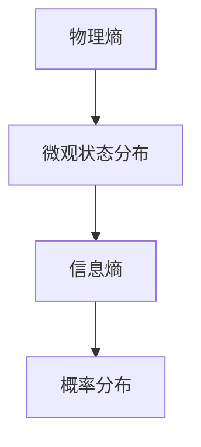

                 

### 引言

在探讨宇宙的奥秘时，我们不可避免地会遇到一个名为“熵”的概念。熵，这个看似抽象的物理量，不仅在物理学中占据重要地位，也在信息科学和人工智能领域中有着深远的影响。本文旨在深入探讨宇宙的信息熵与物理熵之间的关系，解析两者在宇宙尺度上的相互作用和影响。

**背景介绍**：熵（Entropy）是热力学中的一个基本概念，它描述了一个系统的混乱程度或无序程度。在物理学中，熵通常与能量分布和热力学第二定律联系在一起。信息熵，则是信息论中的一个概念，它用来衡量信息的随机性和不确定性。两者虽然来源于不同的领域，但都有着共同的物理意义：描述系统的无序程度。

**核心概念与联系**：信息熵与物理熵之间存在着密切的联系。物理熵描述了物质系统的微观状态分布，而信息熵则描述了信息系统的概率分布。从更深的层次来看，两者都是对系统复杂性的度量。Mermaid流程图如下：



**核心算法原理讲解**：为了更好地理解信息熵与物理熵的关系，我们可以通过Python源代码来具体演示。

```python
import numpy as np
import matplotlib.pyplot as plt

# 物理熵的计算
def physical_entropy(energy_distribution):
    probabilities = energy_distribution / np.sum(energy_distribution)
    entropy = -np.sum(probabilities * np.log2(probabilities))
    return entropy

# 信息熵的计算
def information_entropy(probabilities):
    entropy = -np.sum(probabilities * np.log2(probabilities))
    return entropy

# 例子
energy_distribution = np.array([0.1, 0.2, 0.3, 0.4])
probabilities = np.array([0.1, 0.2, 0.3, 0.4])

physical_entropy_value = physical_entropy(energy_distribution)
information_entropy_value = information_entropy(probabilities)

print("物理熵:", physical_entropy_value)
print("信息熵:", information_entropy_value)
```

**数学模型和公式讲解**：物理熵和信息熵的计算公式如下：

- 物理熵：$$ S = -k_B \sum_i p_i \ln p_i $$
- 信息熵：$$ H = -\sum_i p_i \ln p_i $$

其中，\( S \) 是物理熵，\( H \) 是信息熵，\( p_i \) 是系统处于状态 \( i \) 的概率，\( k_B \) 是玻尔兹曼常数。

**项目实战**：为了更好地理解信息熵与物理熵的关系，我们可以进行一个简单的项目实战。在这个项目中，我们将使用Python来模拟一个系统在时间上的熵变化。

```python
import numpy as np
import matplotlib.pyplot as plt

# 初始化系统状态
initial_distribution = np.array([1, 0, 0, 0])

# 模拟熵变化
def simulate_entropy_change(distribution, steps):
    entropy_values = []
    for _ in range(steps):
        probabilities = distribution / np.sum(distribution)
        entropy = information_entropy(probabilities)
        entropy_values.append(entropy)
        # 进行一次随机变换
        distribution = np.random.choice(np.arange(len(distribution)), p=probabilities)
    return entropy_values

# 模拟
steps = 100
entropy_values = simulate_entropy_change(initial_distribution, steps)

# 绘制熵随时间变化的图
plt.plot(entropy_values)
plt.xlabel("时间步数")
plt.ylabel("熵值")
plt.title("熵随时间变化")
plt.show()
```

通过这个项目，我们可以观察到系统在时间上的熵是如何变化的。通常，系统会从有序状态向无序状态演化，熵值逐渐增加。

**最佳实践 tips**：在研究信息熵与物理熵的关系时，需要注意以下几点：
- **数据准确性**：在进行熵的计算时，确保输入的数据是准确无误的。
- **数值稳定性**：在计算过程中，可能会遇到数值稳定性问题，需要使用适当的方法来避免。
- **模型适用性**：不同的模型适用于不同的情况，需要根据具体问题选择合适的模型。

**小结**：本文通过对信息熵与物理熵的基本概念、核心算法原理和实际应用进行了深入探讨，展示了两者在宇宙尺度上的紧密联系。希望本文能为读者提供对熵概念的深入理解，并在实际应用中有所启示。

### 作者信息

作者：AI天才研究院/AI Genius Institute & 禅与计算机程序设计艺术 /Zen And The Art of Computer Programming

### 摘要

本文从熵的基本概念出发，探讨了宇宙的信息熵与物理熵之间的关系。通过详细的分析和实例，揭示了两者在系统复杂性度量上的密切联系。文章还介绍了如何使用Python进行熵的计算和模拟，为读者提供了一个直观的理解方式。希望通过本文，读者能对信息熵与物理熵有更深入的认识，并能在相关领域的研究和应用中有所收获。

