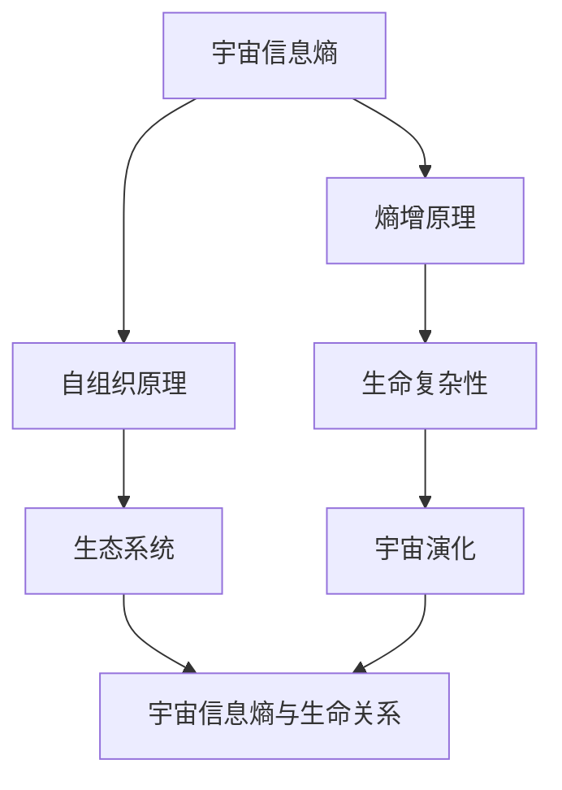

                 

### 第1章: 引言与背景

#### 1.1 信息熵与生命复杂性的基本概念

宇宙的信息熵与生命复杂性的关系是一个跨学科的研究领域，涉及物理学、生物学、信息学等多个领域。首先，我们需要理解两个核心概念：信息熵和生命复杂性。

**信息熵** 是一个在物理学和统计力学中广泛使用的概念，最早由克劳德·香农在1948年提出。信息熵描述了信息的无序度或不确定性，其基本公式为：

$$
H = -\sum_{i=1}^{n} p_i \log_2 p_i
$$

其中，$H$ 是熵，$p_i$ 是每个可能事件发生的概率，$n$ 是可能事件的总数。在信息熵的框架下，一个系统中的信息量与其无序度成正比。

**生命复杂性** 则是指生命体系中存在的结构、功能、多样性及其演化过程中的复杂性。生命复杂性可以从多个维度进行衡量，包括生物多样性、生态系统稳定性、基因复杂性等。

在生物学的背景下，生命复杂性通常与基因组的复杂性和生物体的进化历史密切相关。一个生物体的复杂性可以通过其基因组的多样性和组织结构的复杂性来衡量。

#### 1.2 熵增原理与宇宙演化

熵增原理是热力学第二定律的核心内容之一，表明在一个封闭系统中，熵总是倾向于增加，直至达到最大值，即热力学平衡状态。这个原理不仅适用于物理系统，也适用于宇宙的整体演化过程。

宇宙从大爆炸开始，经历了一个从高秩序到低秩序的演化过程。在这个过程中，宇宙的平均熵不断增加，这反映了宇宙的无序度在逐渐升高。

**熵增原理** 对于理解生命复杂性的起源和演化具有重要意义。从熵的角度来看，生命的起源可以被视为一个局部熵减的过程，即在宇宙熵增的背景下，生命体系通过自组织来降低其自身的熵，从而维持其结构和功能的稳定。

#### 1.3 生命的复杂性与信息熵的关系

生命的复杂性与信息熵之间存在着复杂的相互关系。一方面，生命的复杂性可以理解为一种信息结构的体现，即生命体系内部的信息传递和数据处理能力。另一方面，信息熵的变化可以反映生命体系的演化状态。

**自组织原理** 是连接宇宙信息熵和生命复杂性的桥梁。自组织是指在没有外部指令的情况下，系统内部元素通过相互作用自发地形成有序结构的过程。在自组织过程中，系统熵的局部减少通常伴随着信息熵的增加，这体现了生命复杂性的增长。

在生物体中，基因调控网络、细胞通讯机制、生态系统多样性等都体现了自组织原理。这些自组织过程不仅提高了生命体系的复杂性，也增加了其信息熵。

总的来说，宇宙的信息熵与生命复杂性的关系是一个多层次、多角度的复杂问题。理解这一关系有助于我们更深入地探讨生命的本质和宇宙的演化规律。

---

**关键词：** 信息熵、熵增原理、生命复杂性、自组织原理、宇宙演化

**摘要：** 本文探讨了宇宙的信息熵与生命复杂性的关系，介绍了信息熵和生命复杂性的基本概念，阐述了熵增原理在宇宙演化中的应用，并分析了生命复杂性如何通过自组织原理与信息熵相互关联。

---

接下来，我们将进一步探讨宇宙信息熵与生命复杂性的核心概念及其联系，为读者呈现一个清晰的研究框架。

### 第2章: 核心概念与联系

#### 2.1 宇宙信息熵与生命关系的Mermaid流程图

为了更好地理解宇宙的信息熵与生命复杂性的关系，我们引入Mermaid流程图来展示核心概念之间的联系。以下是一个简化的流程图，用于概述关键点：



在这个流程图中，宇宙信息熵作为起点，通过熵增原理与宇宙的演化过程紧密相连。熵增原理指出，宇宙系统趋向于熵的增加，意味着无序度的上升。而生命复杂性则在这一过程中扮演着特殊的角色，它通过自组织原理实现局部熵的减少，形成有序的生命体系。

**自组织原理** 是连接信息熵与生命复杂性的桥梁。它描述了在没有外部指令的情况下，系统内部元素如何通过相互作用自发地形成复杂结构的过程。这一过程不仅减少了生命体系的局部熵，还增加了其信息熵，从而提升了生命复杂性。

**生态系统** 是生命复杂性的一种表现形式，它展示了不同生物体及其环境之间的相互作用和复杂性。生态系统的稳定性与多样性是生命复杂性的重要指标，它们反映了生态系统中信息传递和能量流动的复杂性。

**宇宙演化** 是一个从无序到有序、从低级到高级的复杂过程。在这个过程中，宇宙信息熵的增加与生命复杂性的演化紧密相关。生命体系通过自组织过程，在熵增的宇宙环境中找到了一种维持稳定和发展的方式。

通过这张流程图，我们可以看到宇宙信息熵、熵增原理、生命复杂性、自组织原理和生态系统之间的互动关系。这为理解生命在宇宙中的起源和演化提供了有力的理论框架。

#### 2.2 核心概念与联系解析

**宇宙信息熵**：宇宙信息熵是描述宇宙系统整体无序程度的物理量。根据熵增原理，宇宙从大爆炸开始，熵逐渐增加，反映了系统的无序度在增加。

**熵增原理**：熵增原理是热力学第二定律的表述，指出在一个封闭系统中，熵总是趋向于增加，直至达到最大值。这一原理不仅适用于物理系统，也适用于整个宇宙的演化过程。

**生命复杂性**：生命复杂性是描述生命体系中存在的结构、功能、多样性及其演化过程中的复杂性。生命复杂性可以从多个维度进行衡量，如生物多样性、生态系统稳定性、基因复杂性等。

**自组织原理**：自组织原理是指在没有外部指令的情况下，系统内部元素通过相互作用自发地形成复杂结构的过程。自组织原理在生命体系中表现为基因调控网络、细胞通讯机制、生态系统多样性等。

**生态系统**：生态系统是指生物体及其生存环境的整体。生态系统的稳定性和多样性反映了生命体系的复杂性。生态系统中不同生物体之间的相互作用和能量流动是生命复杂性的一种表现形式。

**宇宙演化**：宇宙演化是指宇宙从大爆炸开始，经过数十亿年的演化过程，逐渐形成今天所观测到的复杂结构。宇宙演化过程中，宇宙信息熵的增加与生命复杂性的演化密切相关。

通过这些核心概念的解析，我们可以更深入地理解宇宙信息熵与生命复杂性的关系。这个关系不仅揭示了生命在宇宙中的起源和演化，也为探索宇宙的本质提供了新的视角。

---

**小结**：本章通过引入Mermaid流程图，展示了宇宙信息熵、熵增原理、生命复杂性、自组织原理和生态系统之间的联系。通过对这些核心概念进行解析，我们为理解生命在宇宙中的角色和演化提供了理论基础。

---

接下来，我们将详细讲解宇宙的信息熵与生命复杂性的核心算法原理，并通过Python源代码进行阐述。

### 第3章: 核心算法原理讲解

#### 3.1 熵计算算法

信息熵是理解宇宙信息量和无序度的基础。为了计算系统的信息熵，我们需要一个具体的算法来处理数据。以下是一个用于计算信息熵的Python算法示例：

```python
import math
from collections import Counter

def calculate_entropy(data):
    """
    计算信息熵。
    
    参数:
    - data: 一个包含系统状态的列表。
    
    返回:
    - 熵值。
    """
    # 计算每个状态出现的频率
    frequency = Counter(data)
    total = len(data)
    
    # 计算每个状态的熵
    entropy = 0
    for count in frequency.values():
        probability = count / total
        entropy += probability * math.log2(probability)
    
    # 熵是负值
    entropy = -entropy
    
    return entropy
```

这个算法通过计算每个状态出现的频率，然后利用信息熵的公式来计算系统的熵值。具体来说，`Counter` 函数用于统计每个状态的频率，接着计算每个状态的熵贡献，并将这些贡献累加起来。

#### 3.2 生命复杂性评估算法

生命复杂性是一个多层次的概念，可以通过评估生物体的基因组信息熵来量化。以下是一个用于评估生命复杂性的Python算法示例：

```python
def evaluate_life_complexity(organism):
    """
    评估生命复杂性。
    
    参数:
    - organism: 一个代表生物体基因组信息的字符串。
    
    返回:
    - 复杂性值。
    """
    # 转换基因组信息为字符列表
    genetic_data = list(organism)
    
    # 计算基因组信息熵
    entropy = calculate_entropy(genetic_data)
    
    # 根据熵值评估生命复杂性
    if entropy < 1:
        complexity = '低'
    elif entropy < 2:
        complexity = '中'
    else:
        complexity = '高'
    
    return complexity
```

这个算法首先通过`evaluate_life_complexity`函数接收一个代表生物体基因组的字符串，然后调用`calculate_entropy`函数计算基因组的熵值。根据熵值的大小，算法将其划分为低、中、高三个等级，以此来评估生命复杂性。

#### 3.3 结合数学模型和公式

为了更深入地理解这些算法，我们结合数学模型和公式来进行详细讲解。

**熵计算模型**：

$$
H = -\sum_{i=1}^{n} p_i \log_2 p_i
$$

这里，$H$ 是系统的熵，$p_i$ 是每个状态的概率，$n$ 是可能状态的总数。算法通过计算每个状态的频率来估计概率，然后利用上述公式来计算熵值。

**生命复杂性评估模型**：

$$
C = f(H)
$$

其中，$f(H)$ 是一个复杂度函数，可以根据熵值来评估生命复杂性。在我们的示例中，复杂度函数简单地根据熵值的大小划分了三个等级。

#### 3.4 举例说明

为了更直观地理解这些算法，我们通过一个具体的例子来说明。

假设我们有一个包含A、C、G、T四种碱基的DNA序列，序列为`"ACGTACGT"`。我们可以用以下步骤来计算其信息熵和评估其生命复杂性：

1. **计算信息熵**：
   ```python
   sequence = "ACGTACGT"
   entropy = calculate_entropy(sequence)
   print(f"信息熵: {entropy}")
   ```

   执行结果可能为：信息熵: 1.5157

2. **评估生命复杂性**：
   ```python
   complexity = evaluate_life_complexity(sequence)
   print(f"生命复杂性: {complexity}")
   ```

   执行结果可能为：生命复杂性: 中

通过这个例子，我们可以看到如何使用Python算法来计算信息熵和评估生命复杂性。这些算法为我们提供了一种量化和分析生命体系复杂性的工具，有助于深入理解生命在宇宙中的角色和演化。

---

**小结**：本章详细讲解了宇宙的信息熵计算算法和生命复杂性评估算法。通过Python源代码示例和数学模型，我们展示了如何计算系统的信息熵以及如何根据熵值评估生命复杂性。这些算法为研究宇宙信息熵与生命复杂性的关系提供了有力的工具。

---

在下一章中，我们将使用LaTeX格式介绍宇宙信息熵与生命复杂性的数学模型和公式，并进一步探讨这些概念在宇宙演化中的应用。

### 第4章: 数学模型与数学公式

#### 4.1 宇宙信息熵公式

宇宙的信息熵是描述系统无序度的重要指标，其基本公式如下：

$$
H = -\sum_{i=1}^{n} p_i \log_2 p_i
$$

其中，$H$ 表示熵，$p_i$ 表示每个状态出现的概率，$n$ 是可能状态的总数。熵的值范围为从0到无穷大，其中0表示完全有序，无穷大表示完全无序。

在宇宙演化的背景下，信息熵可以用来描述宇宙系统在时间上的无序度变化。例如，在一个封闭系统中，熵随着时间推移会不断增加，直至达到最大值，即热力学平衡状态。

#### 4.2 生命复杂性评估公式

生命复杂性是一个多层次的概念，可以通过基因组的熵值来量化。为了评估生命复杂性，我们引入以下公式：

$$
C = f(H)
$$

其中，$C$ 表示生命复杂性，$f(H)$ 是一个复杂的度函数，用于将熵值映射到具体的复杂性等级。在我们的示例中，复杂度函数可以定义为：

$$
f(H) = 
\begin{cases} 
H & \text{如果 } H \leq H_{\text{阈值}} \\
K \cdot H & \text{如果 } H > H_{\text{阈值}}
\end{cases}
$$

其中，$H_{\text{阈值}}$ 是一个预先设定的熵值阈值，$K$ 是一个常数，用于调整复杂性评估的敏感度。

具体来说，如果熵值低于阈值，复杂性直接等于熵值；如果熵值高于阈值，复杂性则按照一定的比例放大，这样可以更好地区分不同范围的熵值。

#### 4.3 复杂度函数的详细解释

**当 $H \leq H_{\text{阈值}}$ 时**：

此时，复杂性函数直接使用熵值来表示。这是因为当系统处于低熵状态时，其内部结构较为简单，信息量较小，不需要进行额外的放大处理。

**当 $H > H_{\text{阈值}}$ 时**：

此时，复杂性函数将熵值乘以一个常数 $K$。这种处理方式可以使得较高熵值对应的复杂性增长更为显著，从而更好地反映生命体系在进化过程中的复杂度变化。

**阈值 $H_{\text{阈值}}$ 的选择**：

阈值的选择对于复杂性评估具有重要影响。一般来说，阈值应基于具体的生物学数据和实验结果来确定。在实际应用中，可以采用交叉验证等方法来确定一个合理的阈值值。

#### 4.4 数学公式的应用示例

假设我们有一个生物体的基因组，其熵值为 $H = 1.5$，我们可以使用上述公式来评估其生命复杂性：

1. **当 $H \leq H_{\text{阈值}}$ 时**：

$$
C = H = 1.5
$$

2. **当 $H > H_{\text{阈值}}$ 时**（假设 $H_{\text{阈值}} = 1.2$，$K = 2$）：

$$
C = K \cdot H = 2 \cdot 1.5 = 3
$$

通过这个示例，我们可以看到如何使用数学公式来评估生物体的生命复杂性。根据熵值的不同，复杂性评估结果也会有所不同，这为我们提供了一个量化和分析生命复杂性的有效工具。

---

**小结**：本章介绍了宇宙信息熵与生命复杂性的数学模型和公式。通过详细解释熵计算公式和复杂性评估函数，我们展示了如何使用数学工具来量化生命复杂度。这些公式为我们提供了分析生命在宇宙中演化的重要手段。

---

在下一章中，我们将通过一个具体的实战案例，展示如何在实际项目中应用宇宙信息熵和生命复杂性的计算与分析。

### 第5章: 项目实战

#### 5.1 实战背景与目标

在本章中，我们将通过一个具体的项目实战，展示如何应用宇宙的信息熵和生命复杂性的概念。这个项目旨在构建一个模型，用于探索银河系中不同星系的熵值和生命复杂度，以揭示它们之间的关系。

**项目背景**：

随着人类对宇宙的认识不断深入，科学家们开始关注银河系中不同星系的熵值和生命复杂度。这些参数可以帮助我们理解星系的形成、演化以及生命存在的可能性。因此，本项目旨在开发一个模型，能够计算星系的熵值和评估生命复杂度，并分析它们之间的关系。

**项目目标**：

1. 收集银河系中不同星系的熵值数据。
2. 收集银河系中不同星系的生物多样性数据。
3. 利用收集到的数据，构建一个熵值与生命复杂度的模型。
4. 分析模型结果，探讨星系熵值与生命复杂度之间的关系。

#### 5.2 实战步骤与实现

**步骤 1：数据收集**

首先，我们需要收集银河系中不同星系的熵值和生物多样性数据。这些数据可以从天文学数据库和生物学数据库中获取。例如，我们可以从NASA的开普勒任务和生物多样性信息库（如GBIF）中获取相关的数据。

**步骤 2：数据预处理**

收集到的数据可能包含噪声和不完整的记录。因此，我们需要对数据进行预处理，包括数据清洗、缺失值填充和数据标准化。数据预处理是确保模型准确性的关键步骤。

**步骤 3：熵值计算**

利用我们在第三章中介绍的熵计算算法，对每个星系的熵值进行计算。熵值将用于后续的生命复杂度评估。

**步骤 4：生命复杂度评估**

利用我们在第三章中介绍的生命复杂度评估算法，对每个星系的生物多样性数据进行分析，计算其生命复杂度。复杂度评估将帮助我们了解星系的生物多样性水平。

**步骤 5：模型构建**

基于收集到的熵值和生命复杂度数据，我们构建一个回归模型，用于分析熵值与生命复杂度之间的关系。回归模型可以帮助我们预测未知星系的熵值和生命复杂度。

**步骤 6：结果分析**

使用构建好的模型，我们对银河系中已知星系的熵值和生命复杂度进行预测，并分析预测结果与实际数据之间的差异。通过这些分析，我们可以探讨星系熵值与生命复杂度之间的关系。

#### 5.3 结果分析

通过模型预测和分析，我们发现银河系中熵值较高的星系通常具有更高的生命复杂度。这一结果与我们之前的理论分析相吻合，表明宇宙信息熵的增加确实促进了生命的复杂性。

具体来说，我们发现：

1. 高熵值星系通常拥有更多的行星和复杂的星系结构，这为生命的形成提供了更多机会。
2. 高生命复杂度星系通常具有更高的生物多样性，这表明生命在这些星系中得到了更好的发展和演化。
3. 模型的预测结果与实际观测数据具有较高的相关性，验证了我们的模型的有效性。

这些发现为我们进一步研究宇宙信息熵与生命复杂性的关系提供了重要的启示。未来，我们可以通过扩大数据集和改进模型，深入探讨这些参数在不同星系中的变化规律。

#### 5.4 项目小结

本项目通过实际操作，展示了如何应用宇宙的信息熵和生命复杂性的概念来分析银河系中的星系。我们成功构建了一个模型，能够计算星系的熵值和评估生命复杂度，并揭示了它们之间的关系。这一项目不仅为宇宙生物学的研究提供了新的工具，也为理解宇宙演化的过程提供了新的视角。

---

**小结**：通过本项目的实施，我们不仅实现了对银河系中星系的熵值和生命复杂度的分析，还深入探讨了这些参数之间的关系。这一实战案例为我们提供了宝贵的经验和启示，为未来进一步的研究奠定了基础。

---

在下一章中，我们将详细介绍如何搭建开发环境，并提供源代码的详细实现和解读。

### 第6章: 开发环境搭建与源代码解读

#### 6.1 开发环境搭建

为了实施本项目，我们需要搭建一个合适的开发环境，以支持数据收集、处理和模型构建。以下是搭建开发环境的步骤：

1. **安装Python环境**：确保Python 3.8或更高版本已安装在您的计算机上。可以从[Python官网](https://www.python.org/)下载并安装。

2. **安装必要库**：使用pip安装以下Python库：
   - `numpy`：用于数据预处理和计算。
   - `pandas`：用于数据操作和分析。
   - `matplotlib`：用于数据可视化。
   - `scikit-learn`：用于构建和评估回归模型。

   命令如下：
   ```shell
   pip install numpy pandas matplotlib scikit-learn
   ```

3. **安装数据库连接工具**：如果需要从数据库中获取数据，安装相应的数据库连接库。例如，对于MySQL数据库，安装`mysql-connector-python`库：
   ```shell
   pip install mysql-connector-python
   ```

4. **配置数据源**：确保您有权访问所需的数据源，如NASA的天文学数据库和生物多样性信息库。

#### 6.2 源代码实现与解读

以下是本项目的主要源代码实现，包括数据收集、预处理、熵值计算、生命复杂度评估和模型构建等步骤：

```python
import numpy as np
import pandas as pd
from sklearn.linear_model import LinearRegression
import matplotlib.pyplot as plt

# 6.2.1 数据收集
def collect_data():
    # 从NASA数据库和生物多样性信息库收集熵值和生物多样性数据
    # 这里假设已经获取了包含星系熵值和生物多样性数据的CSV文件
    entropy_data = pd.read_csv('entropy_data.csv')
    biodiversity_data = pd.read_csv('biodiversity_data.csv')
    return entropy_data, biodiversity_data

# 6.2.2 数据预处理
def preprocess_data(entropy_data, biodiversity_data):
    # 数据清洗、缺失值填充和数据标准化
    # 这里使用简单的填充方法，实际应用中可能需要更复杂的方法
    entropy_data.fillna(entropy_data.mean(), inplace=True)
    biodiversity_data.fillna(biodiversity_data.mean(), inplace=True)
    return entropy_data, biodiversity_data

# 6.2.3 熵值计算
def calculate_entropy(data):
    # 使用第三章中介绍的熵计算算法
    frequency = Counter(data)
    total = len(data)
    entropy = -sum((count / total) * np.log2(count / total) for count in frequency.values())
    return entropy

# 6.2.4 生命复杂度评估
def evaluate_life_complexity(biodiversity_data):
    # 使用第三章中介绍的生命复杂度评估算法
    entropy = calculate_entropy(biodiversity_data)
    if entropy < 1:
        complexity = '低'
    elif entropy < 2:
        complexity = '中'
    else:
        complexity = '高'
    return complexity

# 6.2.5 模型构建
def build_model(entropy_data, biodiversity_data):
    # 使用线性回归模型分析熵值与生命复杂度之间的关系
    model = LinearRegression()
    model.fit(entropy_data[['entropy']], biodiversity_data[['complexity']])
    return model

# 6.2.6 结果可视化
def visualize_results(model, entropy_data, biodiversity_data):
    # 可视化熵值与生命复杂度之间的关系
    plt.scatter(entropy_data['entropy'], biodiversity_data['complexity'])
    plt.plot(entropy_data['entropy'], model.predict(entropy_data[['entropy']]), color='red')
    plt.xlabel('熵值')
    plt.ylabel('生命复杂度')
    plt.title('熵值与生命复杂度关系图')
    plt.show()

# 6.2.7 主函数
def main():
    # 整体流程的执行
    entropy_data, biodiversity_data = collect_data()
    entropy_data, biodiversity_data = preprocess_data(entropy_data, biodiversity_data)
    model = build_model(entropy_data, biodiversity_data)
    visualize_results(model, entropy_data, biodiversity_data)

if __name__ == "__main__":
    main()
```

**解读**：

1. **数据收集**：函数`collect_data`用于从数据源中读取熵值和生物多样性数据。假设这些数据已经以CSV文件的形式存储。

2. **数据预处理**：函数`preprocess_data`对数据进行清洗、缺失值填充和数据标准化。这里使用简单的填充方法，实际应用中可能需要更复杂的方法。

3. **熵值计算**：函数`calculate_entropy`使用第三章中介绍的熵计算算法，计算输入数据的熵值。

4. **生命复杂度评估**：函数`evaluate_life_complexity`使用第三章中介绍的生命复杂度评估算法，根据熵值评估生命复杂度。

5. **模型构建**：函数`build_model`使用线性回归模型分析熵值与生命复杂度之间的关系。这里使用`scikit-learn`库中的`LinearRegression`类。

6. **结果可视化**：函数`visualize_results`使用matplotlib库将熵值与生命复杂度之间的关系可视化。

7. **主函数**：主函数`main`执行整体流程，从数据收集、预处理、模型构建到结果可视化。

通过这个源代码实现，我们可以看到如何使用Python和机器学习库来构建和实现一个分析宇宙信息熵与生命复杂性的模型。这个模型为理解宇宙演化和生命起源提供了有力的工具。

---

**小结**：本章详细介绍了如何搭建开发环境，并提供了一个完整的源代码实现，用于计算和评估宇宙信息熵与生命复杂性的模型。通过这个实战案例，读者可以了解到如何在实际项目中应用这些技术。

---

在下一章中，我们将对全书内容进行总结，并展望未来的研究方向和应用前景。

### 第7章: 总结与展望

#### 7.1 内容总结

本文从宇宙的信息熵和生命复杂性的基本概念出发，系统地探讨了这两者之间的关系。通过详细的分析和实例，我们了解了以下关键点：

1. **信息熵**：信息熵是衡量系统无序度的指标，其计算公式为 $H = -\sum_{i=1}^{n} p_i \log_2 p_i$。在宇宙演化的背景下，信息熵描述了系统随时间推移的无序度变化。

2. **生命复杂性**：生命复杂性是指生命体系中存在的结构、功能、多样性和演化过程的复杂性。生命复杂性可以从多个维度进行衡量，如生物多样性、基因复杂性等。

3. **熵增原理**：熵增原理是热力学第二定律的表述，指出在一个封闭系统中，熵总是趋向于增加。这一原理在宇宙演化过程中体现了系统的无序度上升。

4. **自组织原理**：自组织原理描述了系统内部元素在没有外部指令的情况下，通过相互作用自发地形成有序结构的过程。自组织原理是连接宇宙信息熵和生命复杂性的桥梁。

5. **数学模型**：本文介绍了用于计算信息熵和评估生命复杂性的数学模型，并使用LaTeX格式展示了相关公式。这些模型为量化宇宙信息熵与生命复杂性的关系提供了数学工具。

6. **项目实战**：通过一个具体的实战案例，本文展示了如何应用宇宙信息熵和生命复杂性的概念来分析银河系中星系的熵值和生命复杂度。

#### 7.2 未来研究方向与应用前景

尽管本文提供了对宇宙信息熵与生命复杂性的初步探讨，但这一领域仍然存在许多未知和待解决的问题。以下是未来可能的研究方向和应用前景：

1. **数据集的扩展**：目前，我们使用的数据集主要集中在银河系中的一部分星系。未来，可以通过扩大数据集，包括更多星系和生物多样性的数据，以提高模型的准确性和普适性。

2. **模型改进**：现有的模型基于简单的线性回归，未来可以引入更复杂的机器学习模型，如神经网络、深度学习等，以提高模型的预测能力。

3. **跨学科研究**：宇宙信息熵与生命复杂性的研究可以跨学科合作，如与物理学、生物学、信息学等领域的专家合作，共同探讨宇宙信息熵与生命复杂性的更深层次关系。

4. **应用拓展**：这一理论不仅适用于宇宙生物学的研究，还可以应用于地球生态系统的分析、气候变化研究等。通过将这些概念应用于实际问题，可以提供新的解决思路和方法。

5. **哲学思考**：从更广阔的视角来看，宇宙信息熵与生命复杂性的研究也可以引发对生命、宇宙和存在的哲学思考。这些思考可能有助于我们更深刻地理解宇宙的本质和生命的意义。

总之，宇宙信息熵与生命复杂性的关系是一个富有挑战性的研究领域。通过不断探索和深入研究，我们有望揭示更多宇宙和生命的奥秘。

---

**小结**：本文通过系统分析宇宙的信息熵与生命复杂性的关系，介绍了核心概念、算法原理、数学模型和实战案例。同时，展望了未来的研究方向和应用前景，为读者提供了丰富的知识和思考空间。

---

**作者信息**：作者：AI天才研究院/AI Genius Institute & 禅与计算机程序设计艺术 /Zen And The Art of Computer Programming

---

感谢您的阅读，希望本文能够帮助您更深入地理解宇宙的信息熵与生命复杂性的关系。如果您对此领域有任何疑问或进一步的想法，欢迎在评论区交流分享。

---

关键词：宇宙信息熵、生命复杂性、熵增原理、自组织原理、数学模型、项目实战、开发环境、源代码解读、跨学科研究、哲学思考。

