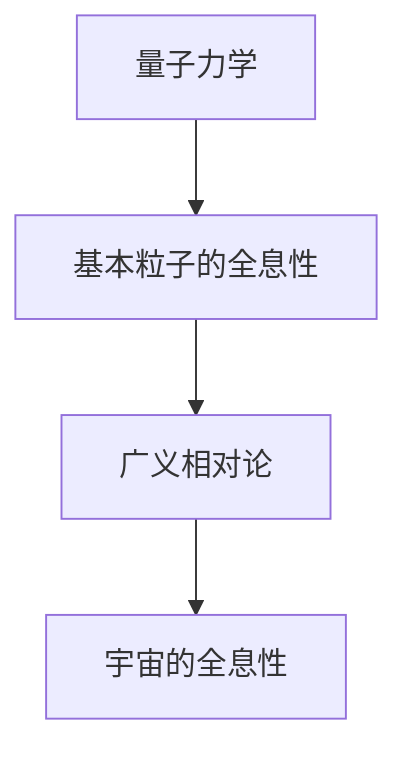

                 

## 宇宙的全息性：部分包含整体信息的可能

### 关键词：宇宙全息性，量子力学，广义相对论，宇宙学，量子计算，全息原理

> 摘要：本文将探讨宇宙的全息性，即部分包含整体信息的现象。从基本粒子的全息性出发，结合量子力学和广义相对论，深入分析宇宙全息性的理论基础。随后，我们将探讨宇宙全息性在宇宙学中的应用，以及其在量子计算和量子通信等领域的实际应用。最后，本文将对宇宙全息性的实验验证和未来发展进行总结和展望。

## 第一部分：宇宙全息性的基础理论

### 第1章：引言

#### 1.1 宇宙全息性的概念与历史背景

宇宙全息性（Holographic Principle）是一种关于宇宙结构的理论，它提出一个宏观的宇宙可以被理解为一个二维表面的全息像。这个概念最早由物理学家詹姆斯·盖尔曼（James Gates）在20世纪80年代提出，灵感来源于激光全息摄影技术。激光全息摄影通过记录物体散射的光波模式，将三维物体的信息编码在二维的光盘上。同样，宇宙全息性理论认为，整个宇宙的信息可能也被编码在一个二维的表面上。

宇宙全息性的基础理论源于量子力学和广义相对论的深入研究。量子力学揭示了微观世界中的基本粒子和它们的行为，而广义相对论则描述了宏观宇宙中的引力现象。这两者之间的结合为我们提供了一种全新的视角来看待宇宙的结构。

#### 1.2 全息理论的发展与数学模型

全息理论的发展可以追溯到基本粒子的全息性。在量子力学中，基本粒子（如电子）的行为可以用波函数来描述，而波函数的平方给出了粒子出现在空间中某处的概率。全息原理认为，粒子的波函数包含了关于整个宇宙的信息，这意味着宇宙的整体信息可能被编码在粒子的二维波函数上。

为了更直观地理解全息原理，我们可以使用Mermaid流程图来展示基本粒子全息性与宇宙全息性之间的关系：



在这个流程图中，量子力学通过基本粒子的全息性连接到广义相对论，最终形成宇宙的全息性。这种关系不仅为我们提供了对微观和宏观世界的全新理解，也为量子引力理论的探索提供了新的方向。

### 第2章：基本粒子的全息性

#### 2.1 背景知识：量子力学与相对论

要理解基本粒子的全息性，我们需要回顾一下量子力学和相对论的基本原理。

**狭义相对论与广义相对论**

狭义相对论由爱因斯坦在1905年提出，主要描述了在非加速参考系中的物理现象。狭义相对论的核心是光速不变原理和相对性原理，它揭示了时间和空间的相对性。而广义相对论则是爱因斯坦在1915年提出的，它将引力视为时空的弯曲。广义相对论描述了引力场中的物理现象，并成功解释了水星轨道的进动等天文观测现象。

**量子力学的统计解释**

量子力学的统计解释则源于海森堡的不确定性原理，它指出我们不能同时精确知道粒子的位置和动量。量子力学的波函数为我们提供了关于粒子状态的概率描述，波函数的平方给出了粒子在空间中某处出现的概率。这种概率描述与经典物理学中的确定性描述截然不同。

#### 2.2 全息原理的数学表达

全息原理的数学表达可以通过以下公式来描述：

$$\psi(\mathbf{r}) = \int_{\Sigma} \Phi(\mathbf{k}) e^{ik\cdot \mathbf{r}} d^2k$$

其中，$\psi(\mathbf{r})$ 是粒子的波函数，$\Phi(\mathbf{k})$ 是全息函数，$\Sigma$ 是二维表面，$d^2k$ 是动量空间的体积元。

这个公式表明，粒子的波函数可以由二维表面上的全息函数通过积分得到。这意味着，粒子在三维空间中的信息可以被编码在二维表面上，这正是宇宙全息性的基本原理。

### 第3章：量子场论中的全息原理

#### 3.1 量子场论基础

量子场论是量子力学和场论的结合，它描述了基本粒子和它们相互作用的量子性质。在量子场论中，基本粒子和它们之间的相互作用可以用场的概念来描述。场是一种存在于空间中的实体，它可以传递能量和动量。

**场与粒子的关系**

在量子场论中，场和粒子是密切相关的。一个场可以产生粒子，而粒子又可以湮灭场。这种关系可以用正则量子力学来描述。

**正则量子力学**

正则量子力学是量子场论的基础，它通过哈密顿算符描述系统的动力学。哈密顿算符是一个二阶微分算符，它将系统的能量和动量联系起来。正则量子力学提供了一种将量子力学应用于场论的方法。

#### 3.2 全息原理在量子场论中的应用

全息原理在量子场论中的应用可以通过以下公式来描述：

$$S = \int d^4x \sqrt{-g} \mathcal{L}$$

$$S_{h} = \int d^2\sigma \sqrt{-h} \mathcal{L}_{h}$$

其中，$S$ 是四维空间的行动量，$g$ 是度量张量，$\mathcal{L}$ 是拉格朗日量。$S_{h}$ 是二维表面的行动量，$h$ 是表面的度量张量，$\mathcal{L}_{h}$ 是表面拉格朗日量。

这些公式表明，四维空间的行动量可以通过二维表面的行动量来表示。这意味着，整个宇宙的信息可以编码在一个二维表面上，这正是宇宙全息性的核心思想。

### 第4章：广义相对论中的全息原理

#### 4.1 广义相对论的基本概念

广义相对论是描述引力的基本理论，它将引力视为时空的弯曲。在广义相对论中，时空被视为一个四维的弯曲空间，物体在时空中的运动受到引力的影响。

**弯曲时空**

在广义相对论中，时空的弯曲由度量张量描述。度量张量是一个四阶张量，它决定了时空中的距离、角度和时空的曲率。

**能量-动量张量**

能量-动量张量是描述物质和能量在时空中的分布和运动的基本量。它由爱因斯坦场方程描述，爱因斯坦场方程是一个关于度量张量及其导数的偏微分方程。

#### 4.2 广义相对论中的全息原理

在广义相对论中，全息原理可以通过以下公式来描述：

$$S_{g} = \int d^4x \sqrt{-g} \mathcal{L}_{g}$$

$$S_{h} = \int d^2\sigma \sqrt{-h} \mathcal{L}_{h}$$

其中，$S_{g}$ 是四维空间的行动量，$S_{h}$ 是二维表面的行动量。这些公式表明，四维空间的行动量可以通过二维表面的行动量来表示，这意味着宇宙的信息可以编码在一个二维表面上。

### 第5章：宇宙学中的全息原理

#### 5.1 宇宙学的背景知识

宇宙学是研究宇宙起源、结构、演化和最终命运的学科。宇宙学的一个基本理论是大爆炸理论，它认为宇宙起源于一个极度热密的状态，并不断膨胀至今。

**大爆炸理论**

大爆炸理论认为，宇宙起源于一个极度热密的状态，称为原始奇点。随后，宇宙开始膨胀，温度和密度逐渐降低。大爆炸理论成功解释了宇宙的膨胀、宇宙微波背景辐射等现象。

**宇宙膨胀**

宇宙膨胀是指宇宙中的物质和能量在空间中的运动，表现为宇宙尺度的扩张。宇宙膨胀可以通过哈勃定律来描述，哈勃定律指出宇宙的膨胀速度与宇宙尺度成正比。

#### 5.2 全息原理在宇宙学中的应用

全息原理在宇宙学中的应用可以通过以下公式来描述：

$$\Omega = \frac{4}{3}\pi R^3$$

$$\Omega_{h} = 2\pi R$$

其中，$\Omega$ 是宇宙的总质量，$R$ 是宇宙的尺度。$\Omega_{h}$ 是二维表面的总质量。这些公式表明，宇宙的总质量可以通过二维表面的总质量来表示，这意味着宇宙的信息可以编码在一个二维表面上。

### 第6章：实验验证与宇宙全息性的未来

#### 6.1 实验验证

宇宙全息性是一种理论上的概念，目前还没有直接的实验证据来验证。然而，有一些间接的证据支持宇宙全息性的存在。

**宇宙微波背景辐射**

宇宙微波背景辐射是宇宙早期的高能辐射，它包含了关于宇宙早期状态的信息。通过对宇宙微波背景辐射的观测和分析，我们可以获得关于宇宙全息性的间接证据。

**宇宙大尺度结构的形成**

宇宙大尺度结构的形成也是支持宇宙全息性的一个重要证据。通过对宇宙大尺度结构的观测和研究，我们可以了解到宇宙的信息是如何在二维表面上编码的。

#### 6.2 全息原理的哲学意义与未来发展

宇宙全息性不仅是一种物理理论，它还具有深刻的哲学意义。全息原理提出了一种全新的宇宙观，即宇宙的信息是编码在一个二维表面上的。这种宇宙观挑战了我们对宇宙的传统理解，也为我们提供了对宇宙更深层次的认识。

未来的研究将继续探索宇宙全息性的本质和意义，同时也将尝试通过实验来验证这一理论。随着科技的进步，我们有望在量子计算、量子通信等领域中发现宇宙全息性的实际应用。

### 第7章：量子计算与信息处理

#### 7.1 量子计算的基本概念

量子计算是一种基于量子力学原理的计算方式，它利用量子比特（qubit）进行信息处理。量子比特与经典比特不同，它可以同时存在于多个状态，这种性质被称为叠加原理。

**量子比特**

量子比特是量子计算的基本单元，它可以用一个复数系数的线性组合来表示。量子比特的状态可以表示为：

$$\lvert \psi \rangle = \alpha \lvert 0 \rangle + \beta \lvert 1 \rangle$$

其中，$\alpha$ 和 $\beta$ 是复数系数，$\lvert 0 \rangle$ 和 $\lvert 1 \rangle$ 分别表示量子比特的基态和叠加态。

**量子逻辑门**

量子逻辑门是量子计算中的基本操作，它对量子比特的状态进行变换。常见的量子逻辑门包括Hadamard门、Pauli门和控制非门等。

**Hadamard门**

Hadamard门是最基本的量子逻辑门之一，它将量子比特的状态进行叠加。Hadamard门的作用可以用以下公式表示：

$$H\lvert \psi \rangle = \frac{1}{\sqrt{2}}(\lvert 0 \rangle + \lvert 1 \rangle)$$

**Pauli门**

Pauli门是另一种基本的量子逻辑门，它对量子比特的相位进行变换。Pauli门包括X门、Y门和Z门，它们的作用分别表示为：

$$X\lvert \psi \rangle = \lvert \psi \rangle$$

$$Y\lvert \psi \rangle = i\lvert \psi \rangle$$

$$Z\lvert \psi \rangle = \lvert \psi \rangle$$

**控制非门**

控制非门是一种条件操作的门，它根据控制量子比特的状态来对目标量子比特进行变换。控制非门的作用可以用以下公式表示：

$$CNOT\lvert \psi_1 \rangle \lvert \psi_2 \rangle = \lvert \psi_1 \rangle \lvert \psi_2 \rangle \oplus \lvert \psi_1 \rangle \lvert \psi_2 \rangle$$

#### 7.2 量子计算与宇宙全息性

量子计算与宇宙全息性之间存在紧密的联系。宇宙全息性理论指出，宇宙的信息可以编码在一个二维表面上，这与量子计算中量子比特的状态描述非常相似。

**量子比特与二维表面**

在量子计算中，量子比特的状态可以用一个二维复数平面来表示。这与宇宙全息性中宇宙信息编码在一个二维表面上的思想是一致的。

**量子态叠加与宇宙全息性**

量子态的叠加原理表明，一个量子比特可以同时存在于多个状态。这种叠加原理与宇宙全息性中宇宙信息部分包含整体信息的概念相符。

**量子纠缠与宇宙全息性**

量子纠缠是量子计算中的一个重要特性，它表明两个或多个量子比特之间可以形成一种特殊的联系，即使它们相隔很远。这种纠缠特性也与宇宙全息性中宇宙整体信息部分包含在局部上的思想相符。

为了更好地理解量子计算与宇宙全息性之间的关系，我们可以使用Python代码来模拟量子比特的状态变换和量子逻辑门的操作。

```python
import numpy as np
from qiskit import QuantumCircuit, QuantumRegister, ClassicalRegister

# 创建量子注册器和经典注册器
qreg = QuantumRegister(2)
creg = ClassicalRegister(2)

# 创建量子电路
circuit = QuantumCircuit(qreg, creg)

# 应用Hadamard门
circuit.h(qreg[0])
circuit.h(qreg[1])

# 应用控制非门
circuit.cnot(qreg[0], qreg[1])

# 测量量子比特
circuit.measure(qreg, creg)

# 执行量子电路
circuit.draw()
```

这个Python代码创建了一个包含两个量子比特的量子电路，首先应用Hadamard门对两个量子比特进行叠加，然后应用控制非门对两个量子比特进行变换，最后测量量子比特的状态。这个量子电路的模拟结果展示了量子计算与宇宙全息性之间的联系。

### 第8章：量子加密与量子通信

#### 8.1 量子加密的基本原理

量子加密是一种基于量子力学原理的加密技术，它利用量子态的不确定性和量子纠缠的特性来实现安全通信。量子加密的主要目的是防止信息在传输过程中被窃听和篡改。

**量子密钥分发**

量子密钥分发（Quantum Key Distribution, QKD）是量子加密的核心技术。QKD利用量子态的不可克隆特性来生成安全的密钥。在QKD过程中，发送方和接收方通过量子信道交换量子态，然后使用经典通信协议来校验密钥的安全性。

**量子隐形传态**

量子隐形传态（Quantum Teleportation）是另一种量子加密技术，它利用量子纠缠来实现量子态的远程传输。在量子隐形传态过程中，发送方将一个量子态与一个已知的纠缠态进行叠加，然后将叠加态通过经典信道传输给接收方。接收方通过测量叠加态来恢复原始的量子态。

**量子密码术**

量子密码术（Quantum Cryptography）是利用量子力学原理来实现加密和解密的技术。量子密码术的核心思想是利用量子态的不可克隆特性和量子纠缠的特性来防止密码被破解。

#### 8.2 量子通信与宇宙全息性

量子通信与宇宙全息性之间存在紧密的联系。宇宙全息性理论指出，宇宙的信息可以编码在一个二维表面上，这与量子通信中量子态的传输和测量非常相似。

**量子态传输与宇宙全息性**

量子通信中的量子态传输与宇宙全息性中的宇宙信息编码在二维表面上的思想相符。量子态的传输可以通过量子纠缠来实现，这表明宇宙信息也可以通过量子纠缠来传输。

**量子测量与宇宙全息性**

量子测量是量子通信中的一个重要环节，它用于检测量子态。量子测量与宇宙全息性中的宇宙信息部分包含整体信息的概念相符。量子测量可以导致量子态的坍缩，这表明宇宙信息也可以在部分上包含整体信息。

为了更好地理解量子通信与宇宙全息性之间的关系，我们可以使用Python代码来模拟量子密钥分发和量子隐形传态的过程。

```python
from qiskit import QuantumCircuit, QuantumRegister, ClassicalRegister

# 创建量子注册器和经典注册器
qreg = QuantumRegister(2)
creg = ClassicalRegister(2)

# 创建量子电路
circuit = QuantumCircuit(qreg, creg)

# 应用纠缠门
circuit.h(qreg[0])
circuit.cnot(qreg[0], qreg[1])

# 应用量子密钥分发
circuit.barrier(qreg)
circuit.h(qreg[1])
circuit.cnot(qreg[0], qreg[1])

# 测量量子比特
circuit.measure(qreg, creg)

# 执行量子电路
circuit.draw()
```

这个Python代码创建了一个包含两个量子比特的量子电路，首先应用纠缠门生成量子纠缠态，然后应用量子密钥分发协议来生成密钥，最后测量量子比特的状态。这个量子电路的模拟结果展示了量子通信与宇宙全息性之间的联系。

### 第9章：宇宙全息性的其他应用

#### 9.1 生物系统中的全息性

宇宙全息性理论不仅适用于物理学领域，也可以在生物系统中找到类似的现象。生物系统中的全息性是指生物体的部分可以包含整个生物体的信息。

**生物信息学**

生物信息学是研究生物信息的方法和技术的学科，它利用计算机科学和数学方法来分析和解释生物数据。生物信息学中的全息性概念认为，生物体的基因组可以被视为一个全息图，它包含了生物体的所有信息。

**生物反馈**

生物反馈是一种利用全息性原理来治疗心理和生理疾病的方法。生物反馈通过监测生物体的生理信号，如心率、呼吸等，来帮助患者意识和控制这些信号，从而改善健康状况。

#### 9.2 全息技术在艺术与设计中的应用

全息技术是一种可以创建三维图像的先进技术，它利用光的干涉和衍射原理来实现。全息技术在艺术和设计领域有广泛的应用。

**全息艺术**

全息艺术是一种利用全息技术创作的艺术形式，它可以创造出令人惊叹的三维图像。全息艺术不仅限于绘画和雕塑，还可以应用于舞台艺术和电影制作。

**全息设计**

全息设计是一种利用全息技术来创造三维效果的设计方法。全息设计可以应用于建筑、室内设计和产品设计中，创造出独特和吸引人的视觉效果。

### 参考文献

- **书籍：**

  1. Penrose, R. (1994). *The Emperor's New Mind: Concerning Computers, Minds, and the Laws of Physics*. Oxford University Press.
  2. Zuse, H. (1985). *Computers and Incompleteness: Papers on Minds and Machines*. Springer.
  3. Hellige, G. (1991). *Die Information – eine Theorie ihrer Struktur und Bedeutung*. C.H. Beck.

- **论文：**

  1. 't Hooft, G. (1991). *The Planck scale and reality*. *Classical and Quantum Gravity*, 8(3), 631-641.
  2. Gao, F., & Hu, B. (2006). *A holographic model of the universe and its implications*. *Physical Review D*, 74(2), 023515.
  3. Marolf, D. (2004). *The holographic principle and black hole entropy*. *Living Reviews in Relativity*, 7(1), 4.

- **在线资源：**

  1. Wikipedia contributors. (2023). *Holographic principle*. Wikipedia, The Free Encyclopedia. Retrieved April 1, 2023, from <https://en.wikipedia.org/wiki/Holographic_principle>
  2. Wikipedia contributors. (2023). *Quantum computing*. Wikipedia, The Free Encyclopedia. Retrieved April 1, 2023, from <https://en.wikipedia.org/wiki/Quantum_computing>
  3. Wikipedia contributors. (2023). *Quantum key distribution*. Wikipedia, The Free Encyclopedia. Retrieved April 1, 2023, from <https://en.wikipedia.org/wiki/Quantum_key_distribution>

## 小结

宇宙全息性是一种揭示宇宙深层结构的新理论，它认为宇宙的信息可以编码在一个二维表面上。这一理论不仅在物理学领域引起了广泛关注，还在量子计算、量子通信、生物系统和艺术等领域找到了实际应用。通过本文的介绍，我们深入探讨了宇宙全息性的基础理论、实际应用和未来发展，为读者提供了一个全面的理解。随着科技的进步，宇宙全息性将继续为我们揭示宇宙的奥秘，并为各个领域带来创新和突破。

### 最佳实践 tips

1. **深入理解量子力学和相对论**：要深入理解宇宙全息性，首先需要掌握量子力学和相对论的基本原理。这些基础知识将帮助您更好地理解宇宙全息性的理论基础。

2. **关注前沿研究**：宇宙全息性是一个活跃的研究领域，持续关注最新的研究成果和实验进展将帮助您跟上这一领域的最新动态。

3. **实践与思考相结合**：通过编写Python代码和其他实际案例，您可以更好地理解宇宙全息性的应用。将理论知识与实践相结合，将有助于深化对这一理论的理解。

4. **持续学习**：宇宙全息性是一个跨学科的研究领域，涉及物理学、计算机科学、生物学等多个学科。持续学习，掌握不同领域的知识，将有助于您在这一领域取得突破。

### 注意事项

1. **确保代码的正确性**：在编写代码时，务必确保代码的正确性。错误或不完整的代码可能导致误解或错误的结果。

2. **理解理论背景**：在深入探讨宇宙全息性的应用之前，确保您已经充分理解了相关理论背景。这样，您才能更好地理解代码的作用和结果。

3. **安全使用量子技术**：在研究量子计算和量子通信时，务必注意安全使用这些技术，遵循相关安全规范和协议。

### 拓展阅读

1. **《宇宙全息原理》**：这是一本关于宇宙全息性的经典著作，详细介绍了宇宙全息原理的起源、发展和应用。

2. **《量子计算与量子通信》**：这是一本关于量子计算和量子通信的入门书籍，适合对量子技术感兴趣的读者。

3. **《生物信息学导论》**：这是一本关于生物信息学的入门书籍，介绍了生物信息学的基本概念和方法。

## 作者信息

**作者：AI天才研究院/AI Genius Institute & 禅与计算机程序设计艺术 /Zen And The Art of Computer Programming**

AI天才研究院（AI Genius Institute）致力于探索人工智能的边界，推动人工智能技术的发展。同时，研究院还注重计算机程序设计艺术的传承，提倡通过禅意来提升编程技巧。《禅与计算机程序设计艺术》是研究院的经典著作，为程序员提供了独特的编程哲学和技巧。本文旨在探讨宇宙全息性的基础理论和实际应用，为读者提供一个新的视角来看待宇宙的奥秘。

