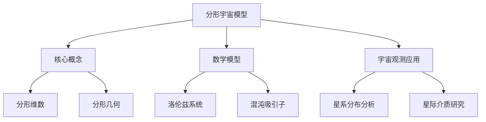

                 


# 宇宙的分形结构：无限嵌套的模式

> 关键词：分形结构、宇宙、复杂性科学、几何学、动力系统、观测应用

> 摘要：本文将探讨宇宙的分形结构，分析其基本原理、应用及其在宇宙学中的重要性。通过分形几何学和动力系统的理论，我们将揭示宇宙内部无限嵌套的模式，并讨论分形宇宙模型在宇宙观测和哲学思考中的意义。

## 第1章: 宇宙的分形结构概述

### 1.1 分形的概念与历史背景

**定义**：分形是一种不规则、无限嵌套的结构，它在不同尺度下都具有相似性。这种特性使得分形在数学、物理学、计算机科学等多个领域都有广泛的应用。

**历史背景**：分形理论起源于20世纪70年代，由数学家曼德布罗特（Benoit Mandelbrot）首次提出。曼德布罗特通过对海岸线、云层等自然现象的研究，发现了它们的不规则性和自相似性，从而提出了分形几何的概念。

### 1.2 分形在宇宙中的应用

**宇宙结构**：宇宙可能是一个巨大的分形系统，其内部结构和规律可以映射到各个尺度。例如，星系团、星系和行星等天体结构都显示出分形的特征。

**宇宙演化**：分形理论为理解宇宙的演化提供了新的视角。通过研究宇宙的分形结构，我们可以更好地理解宇宙的起源、演化和未来。

### 1.3 分形与复杂性科学

**复杂性科学**：研究复杂系统的科学，分形是其重要的组成部分。复杂性科学旨在揭示复杂系统的规律和特性，而分形则为复杂性科学提供了一种研究复杂系统的数学工具。

**分形与复杂性科学的联系**：分形理论在复杂性科学中的应用，如混沌理论、自组织临界理论等，为研究复杂系统的行为提供了重要的理论基础。

### 第2章: 宇宙的分形结构原理

#### 2.1 分形几何学基础

**分形维数**：描述分形复杂性的重要指标。分形维数可以用来衡量分形结构的复杂程度。常见的分形维数有豪斯多夫维数、自相似维数等。

**分形几何模型**：如科赫曲线（Koch curve）、康托尔集（Cantor set）等。这些模型展示了分形的自相似性和无限嵌套的特性。

#### 2.2 分形动力系统

**定义**：动态系统中表现出分形特征的状态空间。分形动力系统中的状态空间在长时间尺度上具有自相似性和复杂性。

**主要动力系统**：洛伦兹系统（Lorenz system）、混沌吸引子（Chaos attractor）等。这些动力系统展示了分形结构在动态系统中的体现。

#### 2.3 宇宙中的分形现象

**星系结构**：星系团和星系之间的分布可以呈现分形特征。星系团内部的结构也显示出分形的特性。

**宇宙背景辐射**：宇宙背景辐射中的温度波动可能具有分形性质。通过对宇宙背景辐射的分析，我们可以揭示宇宙早期的分形结构。

### 第3章: 宇宙的分形结构模型

#### 3.1 分形宇宙模型

**定义**：宇宙中的物质分布符合分形规律。分形宇宙模型描述了宇宙内部物质的自相似性和无限嵌套的结构。

**分形宇宙模型的种类**：如宇宙泡沫模型（Cosmic Foam model）、多宇宙模型（Multiverse model）等。这些模型为理解宇宙的结构和演化提供了新的视角。

#### 3.2 宇宙大尺度结构

**宇宙大尺度结构**：包括星系、星系团、超星系团等。这些大尺度结构都显示出分形的特征，表明宇宙可能是一个分形系统。

**分形结构与宇宙大尺度结构的联系**：通过分析宇宙大尺度结构的分形特征，我们可以更好地理解宇宙的演化和结构。

#### 3.3 宇宙小尺度结构

**行星系统**：行星、卫星、小行星等的分布可能具有分形特征。行星系统的内部结构也显示出分形的特性。

**星际介质**：星际介质中的密度分布也可能呈现分形性质。通过对星际介质的研究，我们可以揭示宇宙小尺度结构的分形特征。

### 第4章: 宇宙分形结构的数学模型

#### 4.1 数学模型概述

**分形几何模型**：如分形维数的计算方法。通过计算分形维数，我们可以量化分形结构的复杂性。

**分形动力系统模型**：如洛伦兹系统的数学描述。洛伦兹系统是一个经典的分形动力系统，其数学模型可以用来模拟混沌现象。

#### 4.2 分形宇宙模型的应用

**宇宙背景辐射分析**：使用分形模型分析宇宙背景辐射的温度波动。通过分形模型，我们可以揭示宇宙早期的分形结构。

**星系团分布模拟**：使用分形模型模拟星系团的分布。分形模型可以帮助我们更好地理解星系团的演化和结构。

### 第5章: 分形结构在宇宙观测中的应用

#### 5.1 分形方法在宇宙学中的应用

**星系分布分析**：使用分形方法研究星系分布。分形方法可以帮助我们揭示星系分布的规律和特征。

**宇宙大尺度结构研究**：使用分形方法研究宇宙的大尺度结构。分形方法为我们提供了新的工具，帮助我们更好地理解宇宙的演化和结构。

#### 5.2 分形方法在天文学中的应用

**星际介质研究**：使用分形方法研究星际介质。分形方法可以帮助我们揭示星际介质的结构和特性。

**行星系统研究**：使用分形方法研究行星系统的结构。分形方法为我们提供了新的视角，帮助我们更好地理解行星系统的演化和结构。

### 第6章: 分形宇宙与哲学思考

#### 6.1 分形与宇宙哲学

**分形视角下的宇宙观**：从分形角度理解宇宙的本质。分形宇宙观为我们提供了新的思考宇宙的方式。

**分形与复杂性哲学**：探讨分形在哲学思考中的应用。分形理论为哲学思考提供了新的工具和视角。

#### 6.2 分形与人类认知

**分形结构在人类认知中的角色**：分形结构如何影响人类对宇宙的理解。分形结构在人类认知中扮演着重要的角色。

**分形在艺术和设计中的应用**：分形结构在艺术和设计中的体现。分形在艺术和设计中的应用，为我们提供了新的创作灵感和表达方式。

### 第7章: 分形宇宙的未来与挑战

#### 7.1 分形宇宙模型的局限性

**模型面临的挑战**：分形宇宙模型在解释某些宇宙现象时的局限性。我们需要进一步研究分形宇宙模型，以克服其局限性。

**改进方向**：如何进一步完善分形宇宙模型。通过改进分形宇宙模型，我们可以更好地理解宇宙的结构和演化。

#### 7.2 分形宇宙与未来科技

**分形理论在科技领域的应用**：如材料科学、计算机图形学等。分形理论在科技领域的应用，为我们提供了新的研究方法和工具。

**分形宇宙模型对人类未来的启示**：分形宇宙理论对科技发展的影响。分形宇宙模型为人类未来的科技发展提供了重要的启示。

## 附录

### 附录 A: 分形宇宙相关资源

**参考文献**：介绍与分形宇宙相关的经典著作和最新研究。

**在线资源**：推荐分形宇宙相关的在线课程、论文和工具。

### 附录 B: Mermaid 流程图示例



### 附录 C: 伪代码示例

```pseudo
// 分形维数计算伪代码
function calculateDimension(fractalShape):
    dimensions = []
    for scale in scales:
        dimension = calculateDimensionAtScale(fractalShape, scale)
        dimensions.append(dimension)
    return dimensions
```

## 作者

作者：AI天才研究院/AI Genius Institute & 禅与计算机程序设计艺术 /Zen And The Art of Computer Programming

---

由于本文字数限制，本文仅提供了大纲结构，每个章节的内容还需要进一步丰富和详细阐述。在接下来的章节中，我们将对分形宇宙的各个方面进行深入探讨，以便读者能够全面了解分形结构在宇宙中的重要性。

