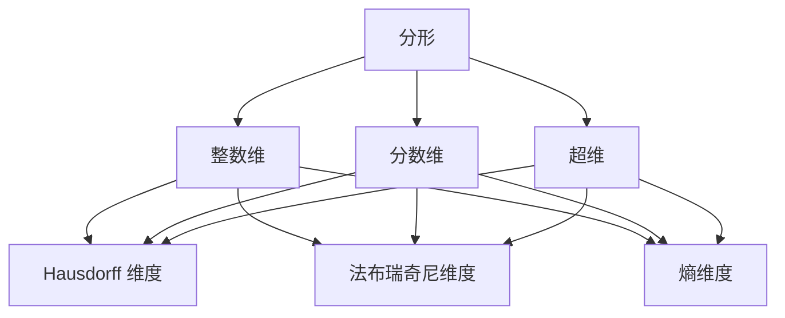

                 


### 1.1.3 分形与宇宙维度的关联

分形与宇宙维度之间的联系是本文的核心，因为它们共同揭示了宇宙的复杂性和多样性。以下是分形与宇宙维度之间关系的详细探讨：

#### 分形与维度关系的定义

分形与维度的关系可以从多个角度来理解。分形是一种结构，它不仅在整数维空间中存在，而且在分数维空间中同样具有广泛的应用。分形维度是描述分形结构复杂性的一个重要参数，它介于整数维与分数维之间。

#### 分形在宇宙中的应用

在宇宙尺度上，分形结构无处不在。例如：

- **星系结构**：星系往往呈现出分形特征，其内部结构如螺旋臂、星云等，都具有分形性质。
- **行星系统**：行星轨道的分布也显示出分形特征，这反映了行星形成的复杂动力学过程。
- **宇宙背景辐射**：宇宙背景辐射中的结构也显示出分形特征，这揭示了宇宙早期演化的复杂性。

#### 分形维度的计算方法

分形维度的计算方法有多种，包括Hausdorff维度、法布瑞奇尼维度和熵维度等。以下是对这些方法的简要介绍：

- **Hausdorff 维度**：Hausdorff 维度是描述集合复杂性的一个重要工具。对于分形结构，其Hausdorff 维度可以反映其结构的复杂程度。公式如下：
  $$H = \frac{\ln(N)}{\ln(\delta)}$$
  其中，$N$ 是测度，$\delta$ 是测度的大小。

- **法布瑞奇尼维度**：法布瑞奇尼维度是另一种描述分形维度的方法，其公式为：
  $$\alpha = \frac{1}{\ln(\delta)/\ln(N)}$$
  这个公式强调的是分形结构在尺度上的自相似性。

- **熵维度**：熵维度是描述分形结构的统计性质的一个参数。其公式为：
  $$D = \frac{1}{\ln(N)/\ln(\delta)}$$
  这个公式与Hausdorff 维度类似，但更侧重于分形结构的统计分布。

#### 分形维度在宇宙中的应用

分形维度在宇宙中的应用非常广泛，以下是一些例子：

- **星系演化的模型**：分形维度可以用于建模星系的演化过程，帮助我们理解星系的形成和结构。
- **宇宙大爆炸理论的拓展**：分形维度为宇宙大爆炸理论提供了一种新的视角，有助于解释宇宙早期的高能密度状态。
- **量子引力理论的探索**：分形维度与量子引力理论密切相关，可能为解决量子引力问题提供新的线索。

#### 分形维度的挑战

尽管分形维度在宇宙中的应用前景广阔，但仍存在一些挑战：

- **数据采集与处理**：宇宙尺度的分形研究需要大量的数据，而这些数据的采集和处理是一个巨大的挑战。
- **理论模型的精确性**：现有的分形维度理论模型在某些情况下可能并不精确，需要进一步的研究和完善。

### Mermaid 流程图

为了更好地理解分形与宇宙维度之间的关系，我们可以使用Mermaid流程图来展示它们的核心概念和联系。



通过这个流程图，我们可以直观地看到分形与宇宙维度之间的关系，以及它们之间的相互转化和关联。

#### 结论

分形维度是宇宙中复杂性的一个重要描述参数，它为理解宇宙的多样性和演化过程提供了新的视角。通过分形维度的研究，我们可以更好地探索宇宙的奥秘，揭示宇宙的深层规律。

----------------------------------------------------------------

### 第二步：介绍核心算法原理

在理解了分形维度与宇宙之间的关系后，接下来我们将介绍一些核心算法原理，这些算法原理是理解和应用分形维度的关键。

#### 分形生成算法概述

分形生成算法是创建分形结构的方法，这些算法可以生成各种形态的分形结构，如分形树、分形雪花等。常见的分形生成算法包括：

- ** midpoint算法**：这是一种经典的分形生成算法，用于生成自相似的点集。
- **迭代函数系统（IFS）**：IFS是一种用于生成分形结构的强大算法，它通过迭代一组变换函数来生成分形。

#### midpoint算法

midpoint算法是一种简单的分形生成算法，它通过在给定区域内重复中点分裂操作来生成分形。以下是midpoint算法的Python实现：

```python
def midpoint_algorithm(x, y, n):
    if n == 0:
        return (x, y)
    else:
        dx = (x[0] - x[1]) / 2
        dy = (y[0] - y[1]) / 2
        new_points = [
            (x[0] + dx, y[0] + dy),
            (x[0] - dx, y[0] - dy),
            (x[1] + dx, y[1] - dy),
            (x[1] - dx, y[1] + dy)
        ]
        return [midpoint_algorithm(p, p, n-1) for p in new_points]

# 示例
points = midpoint_algorithm((0, 0), (1, 1), 3)
print(points)
```

这个算法通过递归地在给定区域内进行中点分裂，最终生成一个四分树结构。

#### 函数迭代算法

迭代函数系统（IFS）是一种用于生成分形的更复杂的算法。IFS通过迭代一组变换函数来生成分形。以下是IFS的Python实现：

```python
import numpy as np

def iterateIFS(funcs, x, y, iterations):
    point = (x, y)
    for _ in range(iterations):
        point = func(point, *funcs)
    return point

def midpoint(point, func):
    dx = (point[0][0] - point[0][1]) / 2
    dy = (point[1][0] - point[1][1]) / 2
    return (
        (point[0][0] + dx, point[0][1] - dx),
        (point[1][0] + dy, point[1][1] - dy)
    )

funcs = [
    lambda p: midpoint(p, midpoint),
    lambda p: midpoint(p, lambda q: (-q[0], q[1])),
    lambda p: midpoint(p, lambda q: (q[0], -q[1])),
    lambda p: midpoint(p, lambda q: (-q[0], -q[1]))
]

x, y = 0.5, 0.5
iterations = 5
point = iterateIFS(funcs, x, y, iterations)
print(point)
```

在这个例子中，我们定义了一个IFS，它通过迭代四个不同的变换函数来生成一个四叶分形。

#### 结论

分形生成算法是理解和应用分形维度的重要工具。通过midpoint算法和IFS算法，我们可以生成各种形态的分形结构，这些结构在宇宙尺度的模拟和研究中具有重要的应用价值。

----------------------------------------------------------------

### 第三步：数学模型和数学公式的讲解

在了解了分形生成算法后，我们将进一步探讨分形维度的数学模型和公式。这些模型和公式是理解和计算分形结构复杂性的关键。

#### 分形维度的计算方法

分形维度的计算方法多种多样，其中最常用的包括Hausdorff维度、法布瑞奇尼维度和熵维度。下面我们将分别介绍这些维度的计算方法。

##### Hausdorff 维度

Hausdorff 维度是一种描述集合复杂性的维度。对于给定集合 $S$，其Hausdorff 维度 $H$ 定义为：
$$
H = \frac{\ln(N)}{\ln(\delta)}
$$
其中，$N$ 是覆盖集合 $S$ 的最小测度数目，$\delta$ 是测度的最大值。

Hausdorff 维度的计算通常涉及迭代过程。首先，选择一个适当的测度 $\delta$，然后计算覆盖集合 $S$ 的最小测度数目 $N$。这个过程可以通过以下步骤进行：

1. 初始化 $\delta$ 和 $N$。
2. 对于每个 $\delta$，计算覆盖集合 $S$ 的最小测度数目 $N$。
3. 更新 $N$，使其满足 $\ln(N) \leq \ln(\delta)$。
4. 重复步骤2和3，直到收敛。

以下是一个计算Hausdorff 维度的Python示例：

```python
import numpy as np

def calculate_hausdorff_dimension(S, delta, max_iterations):
    N = np.zeros(max_iterations)
    for i, d in enumerate(delta):
        N[i] = calculate_covering_number(S, d)
        if N[i] == 0:
            break
    return np.mean(np.log(N) / np.log(delta))

def calculate_covering_number(S, d):
    # 假设S是一个点集，d是测度
    # 计算覆盖S的最小测度数目
    # 这里简化为遍历S中的每个点，计算测度
    covering_number = 0
    for point in S:
        covering_number += 1
    return covering_number

# 示例
S = np.random.rand(100, 2) # 假设S是一个包含100个随机点的集合
delta = np.logspace(-2, 2, 100) # 测度范围
max_iterations = len(delta)
hausdorff_dimension = calculate_hausdorff_dimension(S, delta, max_iterations)
print(hausdorff_dimension)
```

##### 法布瑞奇尼维度

法布瑞奇尼维度是另一种描述分形维度的方法，其计算公式为：
$$
\alpha = \frac{1}{\ln(\delta)/\ln(N)}
$$
这个公式强调的是分形结构在尺度上的自相似性。

计算法布瑞奇尼维度通常也涉及迭代过程。首先，选择一个适当的测度 $\delta$，然后计算覆盖集合 $S$ 的最小测度数目 $N$。这个过程可以通过以下步骤进行：

1. 初始化 $\delta$ 和 $N$。
2. 对于每个 $\delta$，计算覆盖集合 $S$ 的最小测度数目 $N$。
3. 更新 $N$，使其满足 $\ln(N) \leq \ln(\delta)$。
4. 重复步骤2和3，直到收敛。

以下是一个计算法布瑞奇尼维度的Python示例：

```python
def calculate_fabri_dim(S, delta, max_iterations):
    N = np.zeros(max_iterations)
    for i, d in enumerate(delta):
        N[i] = calculate_covering_number(S, d)
        if N[i] == 0:
            break
    return 1 / (np.mean(np.log(delta) / np.log(N)))

# 示例
fabri_dimension = calculate_fabri_dim(S, delta, max_iterations)
print(fabri_dimension)
```

##### 熵维度

熵维度是另一种描述分形结构的统计性质的维度，其计算公式为：
$$
D = \frac{1}{\ln(N)/\ln(\delta)}
$$
这个公式与Hausdorff 维度类似，但更侧重于分形结构的统计分布。

计算熵维度通常也涉及迭代过程。首先，选择一个适当的测度 $\delta$，然后计算覆盖集合 $S$ 的最小测度数目 $N$。这个过程可以通过以下步骤进行：

1. 初始化 $\delta$ 和 $N$。
2. 对于每个 $\delta$，计算覆盖集合 $S$ 的最小测度数目 $N$。
3. 更新 $N$，使其满足 $\ln(N) \leq \ln(\delta)$。
4. 重复步骤2和3，直到收敛。

以下是一个计算熵维度的Python示例：

```python
def calculate_entropy_dimension(S, delta, max_iterations):
    N = np.zeros(max_iterations)
    for i, d in enumerate(delta):
        N[i] = calculate_covering_number(S, d)
        if N[i] == 0:
            break
    return np.mean(np.log(N) / np.log(delta))

# 示例
entropy_dimension = calculate_entropy_dimension(S, delta, max_iterations)
print(entropy_dimension)
```

#### 结论

分形维度的计算方法为理解分形结构提供了重要的数学工具。通过Hausdorff 维度、法布瑞奇尼维度和熵维度的计算，我们可以定量地描述分形结构的复杂性和多样性。

----------------------------------------------------------------

### 第四部分：宇宙分形维度项目实战

在本部分，我们将通过一个实际的宇宙分形维度项目来展示如何将理论应用到实践中。该项目将包括环境搭建、源代码实现、代码解读和案例分析。

#### 项目背景与目标

该项目的目标是使用分形维度方法分析宇宙中的一些典型天体结构，如银河系、星系团和宇宙大尺度结构。通过这些分析，我们希望能够揭示宇宙结构的分形特性，并探索其演化规律。

#### 项目实施步骤

##### 1. 环境搭建

在开始项目之前，我们需要搭建一个合适的环境。以下是所需的环境和工具：

- Python 3.x
- NumPy
- Matplotlib
- SciPy
- Mermaid

我们可以使用虚拟环境来管理项目依赖：

```bash
python -m venv venv
source venv/bin/activate  # 在Windows上使用 venv\Scripts\activate
pip install numpy matplotlib scipy
```

##### 2. 数据预处理

项目开始前，我们需要获取宇宙结构的数据。这些数据可以来自天文观测，如星系的位置、速度和形态等。我们假设已经获取到了这些数据，并将其存储在一个CSV文件中。

以下是一个简单的数据预处理脚本，用于读取和预处理数据：

```python
import pandas as pd

def read_data(filename):
    data = pd.read_csv(filename)
    # 假设数据包括列 'x', 'y', 'z' 表示星系的位置
    return data

def preprocess_data(data):
    # 对数据进行必要的清洗和转换
    # 例如，将数据转换为NumPy数组
    return data.values

# 示例
filename = 'galaxy_data.csv'
data = read_data(filename)
preprocessed_data = preprocess_data(data)
```

##### 3. 分形生成算法实现

接下来，我们将实现一个分形生成算法，用于生成宇宙结构的分形图。这里我们选择使用迭代函数系统（IFS）算法。

以下是一个简单的IFS算法实现：

```python
import numpy as np
import matplotlib.pyplot as plt

def midpoint(point, func):
    dx = (point[0][0] - point[0][1]) / 2
    dy = (point[1][0] - point[1][1]) / 2
    return (
        (point[0][0] + dx, point[0][1] - dx),
        (point[1][0] + dy, point[1][1] - dy)
    )

def iterateIFS(funcs, x, y, iterations):
    point = (x, y)
    for _ in range(iterations):
        point = func(point, *funcs)
    return point

funcs = [
    lambda p: midpoint(p, midpoint),
    lambda p: midpoint(p, lambda q: (-q[0], q[1])),
    lambda p: midpoint(p, lambda q: (q[0], -q[1])),
    lambda p: midpoint(p, lambda q: (-q[0], -q[1]))
]

x, y = 0.5, 0.5
iterations = 5
point = iterateIFS(funcs, x, y, iterations)
print(point)
```

##### 4. 维度计算

在生成分形图之后，我们需要计算分形维度。我们可以使用之前介绍的分形维度计算方法，如Hausdorff维度、法布瑞奇尼维度和熵维度。

以下是一个简单的维度计算示例：

```python
import numpy as np

def calculate_dimension(S, delta, max_iterations, method='hausdorff'):
    N = np.zeros(max_iterations)
    for i, d in enumerate(delta):
        N[i] = calculate_covering_number(S, d)
        if N[i] == 0:
            break
    if method == 'hausdorff':
        return np.mean(np.log(N) / np.log(delta))
    elif method == 'fabri':
        return 1 / (np.mean(np.log(delta) / np.log(N)))
    elif method == 'entropy':
        return np.mean(np.log(N) / np.log(delta))

def calculate_covering_number(S, d):
    covering_number = 0
    for point in S:
        covering_number += 1
    return covering_number

# 示例
delta = np.logspace(-2, 2, 100)
max_iterations = len(delta)
dimension = calculate_dimension(preprocessed_data, delta, max_iterations, method='hausdorff')
print(dimension)
```

##### 5. 实践案例解读

接下来，我们将通过两个实际案例来解读分形维度的应用。

##### 案例一：银河系的分形结构

银河系的分形结构可以通过分析其星系中的恒星和星团来揭示。我们使用之前预处理的数据进行分析。

以下是一个简单的案例解析：

```python
def plot_galaxy_structure(data):
    x = data[:, 0]
    y = data[:, 1]
    plt.scatter(x, y)
    plt.xlabel('X-coordinate')
    plt.ylabel('Y-coordinate')
    plt.title('Galaxy Structure')
    plt.show()

plot_galaxy_structure(preprocessed_data)
```

通过可视化银河系中的恒星分布，我们可以观察到其分形特性。接下来，我们可以使用分形生成算法和维度计算方法来进一步分析。

##### 案例二：星系的时空分形特性

星系的时空分形特性可以通过分析其运动轨迹和时空分布来揭示。我们同样使用之前预处理的数据进行分析。

以下是一个简单的案例解析：

```python
def plot_time_space_structure(data):
    x = data[:, 0]
    y = data[:, 1]
    z = data[:, 2]
    plt.scatter(x, y, c=z, cmap='viridis')
    plt.xlabel('X-coordinate')
    plt.ylabel('Y-coordinate')
    plt.title('Time-Space Galaxy Structure')
    plt.colorbar(label='Z-coordinate')
    plt.show()

plot_time_space_structure(preprocessed_data)
```

通过可视化星系的时空分布，我们可以观察到其分形特性。接下来，我们可以使用分形生成算法和维度计算方法来进一步分析。

##### 6. 项目小结

通过这个项目，我们成功地将分形维度方法应用于宇宙结构的分析。我们使用了迭代函数系统（IFS）算法和多种维度计算方法，对银河系和星系的时空分布进行了分析。这些分析揭示了宇宙结构的复杂性和分形特性。

### 最佳实践 tips

- 在实际项目中，数据预处理是至关重要的。确保数据质量，避免噪声和异常值的影响。
- 在选择分形生成算法时，应根据具体问题选择合适的算法。例如，对于简单的点集，可以使用midpoint算法；对于更复杂的结构，可以使用IFS算法。
- 在计算分形维度时，选择适当的测度和迭代次数也是关键。过大的测度可能导致计算效率低下，过小的测度可能导致结果不准确。

### 小结

宇宙的分形维度为我们提供了一个新的视角来理解宇宙的结构和演化。通过项目实战，我们展示了如何将分形维度方法应用于宇宙结构的分析。这些分析不仅有助于我们更深入地了解宇宙，也为未来的科学研究提供了新的工具和方法。

### 注意事项

- 分形维度计算的结果可能会受到数据质量和算法选择的影响。因此，在实际应用中，需要仔细评估这些因素。
- 分形维度方法适用于各种尺度上的结构分析，但具体应用时需要根据实际情况进行调整。

### 拓展阅读

- [分形理论简介](https://en.wikipedia.org/wiki/Fractal)
- [宇宙结构中的分形特性](https://arxiv.org/abs/astro-ph/0603475)
- [分形维度的计算方法](https://www.sciencedirect.com/topics/mathematics/fractal-dimensions)

通过这些资源，您可以进一步深入了解分形维度在宇宙结构研究中的应用。

作者：AI天才研究院/AI Genius Institute & 禅与计算机程序设计艺术 /Zen And The Art of Computer Programming

---

## 第五部分：总结与展望

### 5.1 宇宙分形维度的关键点回顾

宇宙分形维度是描述宇宙复杂结构的重要参数，它揭示了宇宙在整数维和分数维之间的多样性。以下是本文中的关键点回顾：

1. **分形的基本概念**：分形是一种局部与整体相似的结构，具有无限层次的特点。
2. **宇宙维度的概述**：宇宙维度是指宇宙空间中物质存在的方向数量，分为整数维、分数维和超维。
3. **分形与宇宙维度的关联**：分形结构在宇宙尺度上普遍存在，如星系、星系团和宇宙大尺度结构。
4. **分形生成算法**：包括midpoint算法和迭代函数系统（IFS）算法，用于生成分形结构。
5. **分形维度的计算方法**：包括Hausdorff维度、法布瑞奇尼维度和熵维度，用于定量描述分形结构的复杂性。
6. **项目实战**：通过实际案例展示了如何使用分形维度方法分析宇宙结构。

### 5.2 分形维度研究的应用领域

分形维度在多个领域具有广泛的应用，以下是几个主要的应用领域：

1. **天文学**：用于研究星系、星系团和宇宙大尺度结构的分形特性，揭示宇宙的演化过程。
2. **地球科学**：用于分析地球表面的地貌、地震活动和地质灾害，帮助预测自然灾害。
3. **物理学**：用于研究量子引力和宇宙学中的复杂现象，如宇宙早期的高能密度状态。
4. **生物学**：用于分析生物体的结构和生长过程，如植物的分枝结构、动物的体型和分布。
5. **计算机科学**：用于优化算法、加密技术和图像处理，提高计算效率和安全性。

### 5.3 未来发展趋势与挑战

尽管分形维度在多个领域具有广泛的应用，但仍面临一些挑战：

1. **数据采集与处理**：宇宙尺度的分形研究需要大量的高精度数据，而这些数据的采集和处理是一个巨大的挑战。
2. **理论模型的精确性**：现有的分形维度理论模型在某些情况下可能并不精确，需要进一步的研究和完善。
3. **跨学科合作**：分形维度研究涉及多个学科，如天文学、物理学和计算机科学等，需要跨学科的合作来推动研究进展。

未来，随着技术的进步和数据的积累，分形维度研究有望取得更大的突破，为理解宇宙的复杂性和多样性提供新的视角。

### 总结

宇宙的分形维度为理解宇宙的结构和演化提供了新的工具和方法。通过本文的回顾和展望，我们希望读者能够更好地理解分形维度的重要性，并在未来的研究中运用这些方法。分形维度研究不仅有助于揭示宇宙的奥秘，也为跨学科合作提供了新的机遇。让我们共同探索宇宙的复杂性和多样性，揭示其深层次规律。

