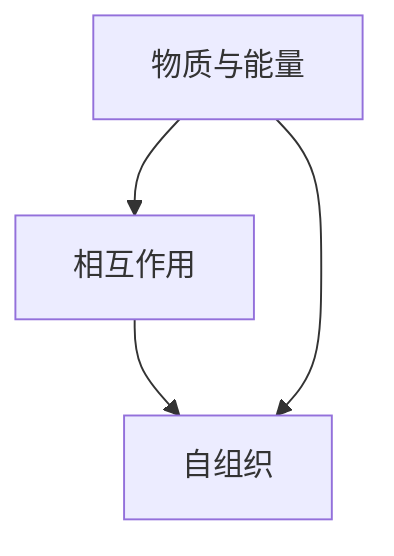
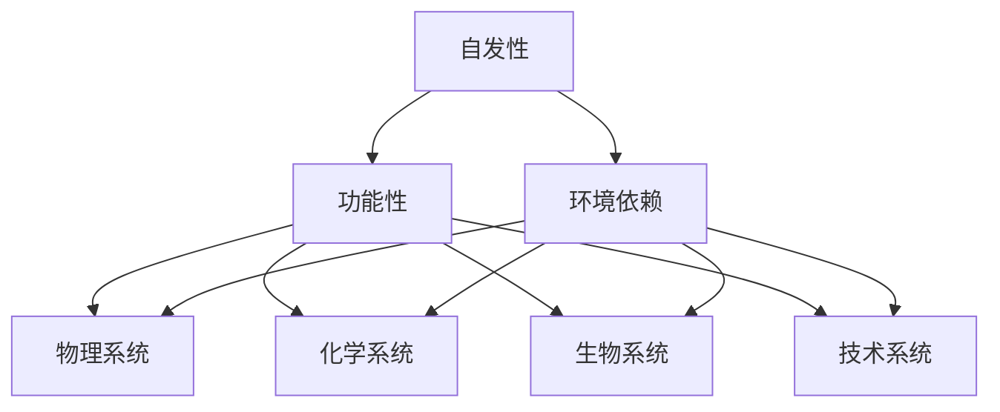
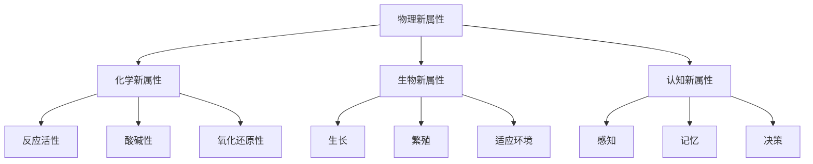
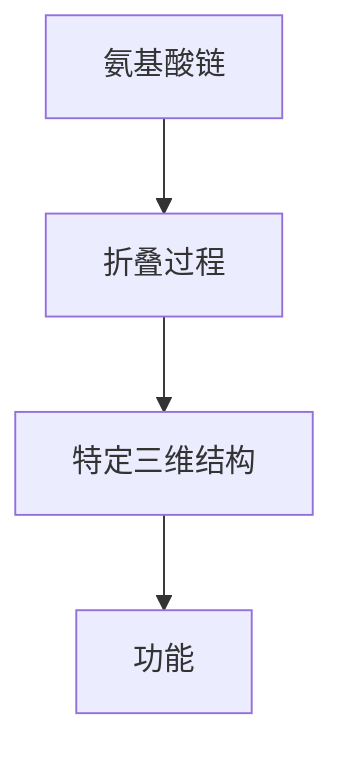
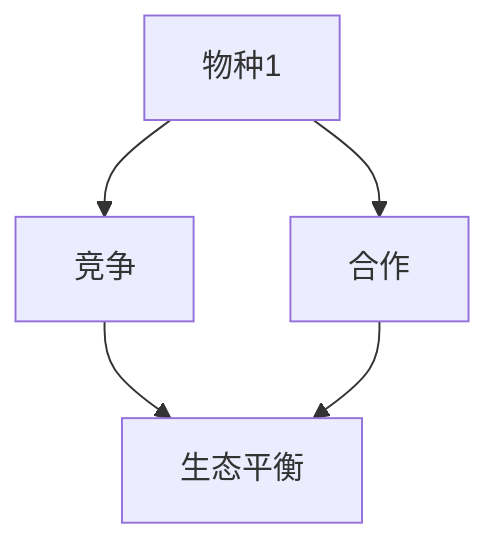
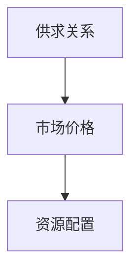
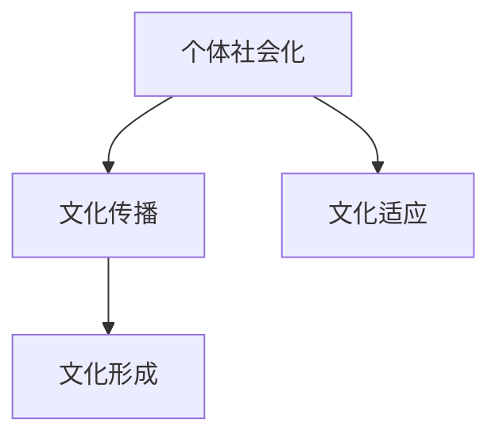
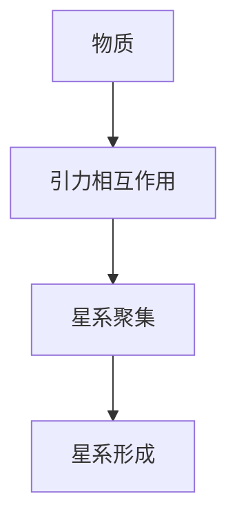
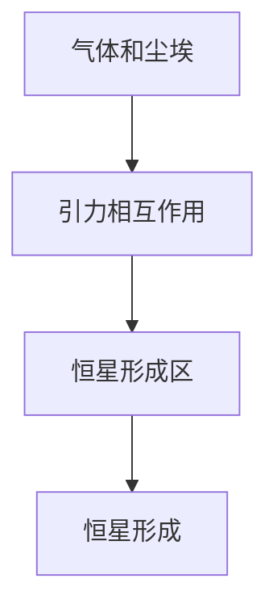

                 

### 宇宙创发性概述

宇宙创发性，这一概念源自于宇宙学、物理学以及信息科学的交汇处。它涉及宇宙中的物质和能量如何通过相互作用自发地产生新的属性和结构。这一过程不仅揭示了宇宙的演化规律，还为我们理解复杂系统的形成和运作提供了新的视角。

#### 背景介绍

宇宙创发性概念的出现，源于对宇宙起源和演化过程的理解。早期宇宙学的研究主要集中在宇宙的大爆炸理论和黑洞等领域。然而，随着科学技术的进步，科学家们逐渐发现，宇宙中的许多现象并非是简单的物理过程所能解释的。因此，宇宙创发性这一概念被提出，旨在探索宇宙中更为复杂和深奥的现象。

#### 核心概念与联系

宇宙创发性这一概念涉及多个核心概念，如物质、能量、相互作用和自组织等。这些概念之间有着紧密的联系，共同构成了宇宙创发性的理论基础。

1. **物质与能量**：物质和能量是宇宙中最基本的组成部分。物质具有质量，能量则表现为动能、势能等形式。在宇宙创发性的过程中，物质和能量的相互作用是产生新属性和结构的关键。

2. **相互作用**：宇宙中的物质和能量通过相互作用，形成复杂的系统。这些相互作用包括引力、电磁力、强相互作用和弱相互作用等。这些作用力决定了物质和能量的运动和分布，从而影响了宇宙的演化过程。

3. **自组织**：自组织是指系统在没有外部控制的情况下，自发地形成某种结构或行为。在宇宙创发性的过程中，自组织现象表现为宇宙中物质和能量在相互作用过程中，自发地形成复杂的结构，如星系、星云等。

#### Mermaid 流程图

以下是一个简单的 Mermaid 流程图，展示了宇宙创发性中的核心概念及其相互关系：



在这个流程图中，物质与能量是基础，相互作用是连接点，自组织则是最终的结果。

#### 总结

宇宙创发性是一个涉及多个学科领域的复杂概念，它不仅为我们理解宇宙的演化提供了新的视角，也为我们研究复杂系统提供了理论基础。在接下来的章节中，我们将深入探讨宇宙创发性的基本原理、机制以及新属性的自发涌现现象。

## 第1章：宇宙创发性的基本概念

### 1.1 宇宙创发性的定义

宇宙创发性，是指宇宙中物质和能量通过相互作用自发产生新的属性和结构的过程。这一概念强调了宇宙中的物质和能量不是孤立存在的，而是在不断的相互作用中，通过某种机制产生新的属性和结构。这种过程不仅涉及到物理层面，还包括了信息、意识和认知等层面。

#### 核心概念

1. **物质和能量**：物质和能量是宇宙的基础，它们在宇宙创发性的过程中起着至关重要的作用。物质具有质量，能量则表现为动能、势能等形式。

2. **相互作用**：宇宙中的物质和能量通过相互作用，形成复杂的系统。这些相互作用包括引力、电磁力、强相互作用和弱相互作用等。

3. **自组织**：自组织是指系统在没有外部控制的情况下，自发地形成某种结构或行为。在宇宙创发性的过程中，自组织现象表现为宇宙中物质和能量在相互作用过程中，自发地形成复杂的结构，如星系、星云等。

#### 定义关系

宇宙创发性这一概念涉及多个核心概念，如物质、能量、相互作用和自组织等。这些概念之间有着紧密的联系，共同构成了宇宙创发性的理论基础。

1. **物质与能量**：物质和能量是宇宙中最基本的组成部分。物质具有质量，能量则表现为动能、势能等形式。在宇宙创发性的过程中，物质和能量的相互作用是产生新属性和结构的关键。

2. **相互作用**：宇宙中的物质和能量通过相互作用，形成复杂的系统。这些相互作用包括引力、电磁力、强相互作用和弱相互作用等。这些作用力决定了物质和能量的运动和分布，从而影响了宇宙的演化过程。

3. **自组织**：自组织是指系统在没有外部控制的情况下，自发地形成某种结构或行为。在宇宙创发性的过程中，自组织现象表现为宇宙中物质和能量在相互作用过程中，自发地形成复杂的结构，如星系、星云等。

### 定义关系 Mermaid 流程图

以下是一个简单的 Mermaid 流程图，展示了宇宙创发性的核心概念及其相互关系：


在这个流程图中，物质与能量是基础，相互作用是连接点，自组织则是最终的结果。

### 总结

宇宙创发性是一个涉及多个学科领域的复杂概念，它不仅为我们理解宇宙的演化提供了新的视角，也为我们研究复杂系统提供了理论基础。在接下来的章节中，我们将深入探讨宇宙创发性的基本原理、机制以及新属性的自发涌现现象。

## 第1.1节：宇宙创发性的定义

宇宙创发性，作为一个跨学科的概念，其定义不仅仅局限于物理学的范畴，而是涵盖了宇宙学、物理学、信息科学等多个领域。这一概念的提出，源于对宇宙起源和演化过程中，物质和能量如何通过相互作用产生新的属性和结构的深入探讨。

#### 核心概念

1. **物质和能量**：物质是构成宇宙的基本元素，表现为有质量的实体。能量则是物质运动和变化的能力，包括动能、势能等形式。在宇宙创发性的定义中，物质和能量是两个最基本的组成部分。

2. **相互作用**：宇宙中的物质和能量通过相互作用，形成复杂的系统。这些相互作用包括引力、电磁力、强相互作用和弱相互作用等。这些作用力不仅决定了物质和能量的运动和分布，也是宇宙创发性的核心机制。

3. **自组织**：自组织是指系统在没有外部控制的情况下，自发地形成某种结构或行为。在宇宙创发性的过程中，自组织现象表现为宇宙中物质和能量在相互作用过程中，自发地形成复杂的结构，如星系、星云等。

#### 核心概念之间的关系

宇宙创发性的核心概念之间存在着紧密的联系，共同构成了其理论基础。

1. **物质与能量**：物质和能量是宇宙的基础，它们在宇宙创发性的过程中起着至关重要的作用。物质具有质量，能量则表现为动能、势能等形式。在宇宙创发性的过程中，物质和能量的相互作用是产生新属性和结构的关键。

2. **相互作用**：宇宙中的物质和能量通过相互作用，形成复杂的系统。这些相互作用包括引力、电磁力、强相互作用和弱相互作用等。这些作用力决定了物质和能量的运动和分布，从而影响了宇宙的演化过程。

3. **自组织**：自组织是指系统在没有外部控制的情况下，自发地形成某种结构或行为。在宇宙创发性的过程中，自组织现象表现为宇宙中物质和能量在相互作用过程中，自发地形成复杂的结构，如星系、星云等。

为了更清晰地展示这些概念之间的关系，我们可以使用 Mermaid 流程图来描述：


在这个流程图中，物质与能量是基础，相互作用是连接点，自组织则是最终的结果。

#### 总结

宇宙创发性的定义涉及多个核心概念，如物质、能量、相互作用和自组织。这些概念共同构成了宇宙创发性的理论基础，为我们理解宇宙的起源和演化过程提供了新的视角。在接下来的章节中，我们将进一步探讨宇宙创发性的基本原理和机制，以及新属性的自发涌现现象。

### 1.2 宇宙创发性的研究意义

宇宙创发性作为现代科学的前沿领域，其研究具有重要的科学意义和社会影响。以下是宇宙创发性研究的几个关键意义：

#### 科学意义

1. **理解宇宙起源**：宇宙创发性的研究有助于揭示宇宙的起源和演化过程。通过研究宇宙中物质和能量的相互作用，我们可以更深入地了解宇宙早期的状态，以及这些过程如何导致了我们今天所看到的宇宙结构。

2. **探索复杂系统**：宇宙创发性涉及到复杂系统的形成和演化，这为研究复杂系统提供了新的视角和方法。复杂系统在宇宙中无处不在，如星系、星云、生物系统等，研究宇宙创发性有助于我们理解这些系统的形成和运作机制。

3. **推进物理学理论**：宇宙创发性的研究挑战了传统的物理学理论，如经典物理学和量子力学。通过探索宇宙创发性，我们可以推动物理学理论的发展，解决一些长期存在的问题，如宇宙的膨胀、暗物质和暗能量等。

4. **拓展认知边界**：宇宙创发性的研究不仅限于自然科学，还涉及到信息科学、认知科学等领域。这有助于我们拓展对宇宙和生命本质的认知，促进多学科交叉融合。

#### 社会意义

1. **技术创新**：宇宙创发性的研究可以推动技术创新，特别是在材料科学、能源科学和信息技术等领域。例如，通过理解宇宙中的自组织现象，可以开发出具有特殊性能的新材料和新能源。

2. **可持续发展的基础**：宇宙创发性的研究为可持续发展提供了理论基础。通过了解宇宙中物质和能量的循环利用，我们可以更好地管理地球资源，实现可持续发展。

3. **哲学思考**：宇宙创发性的研究引发了深刻的哲学思考，如宇宙的本质、生命的起源和人类的存在意义等。这些思考有助于我们反思人类文明的进程，推动社会进步。

4. **教育意义**：宇宙创发性的研究对于提高公众科学素养、激发青少年对科学的兴趣具有重要意义。通过科普教育，可以让更多的人了解宇宙创发性的概念和研究成果，培养创新思维和科学精神。

#### 总结

宇宙创发性的研究具有重要的科学和社会意义。它不仅有助于我们理解宇宙的起源和演化，推动物理学理论的发展，还对社会进步、技术创新和哲学思考等方面产生深远影响。随着研究的深入，宇宙创发性有望为人类带来更多的科学发现和创新成果。

### 1.3 宇宙创发性的研究现状

宇宙创发性作为一个跨学科的研究领域，吸引了众多科学家和研究机构的关注。当前，这一领域的研究已经取得了显著进展，主要表现在以下几个方面：

#### 研究进展

1. **宇宙早期状态的研究**：通过对宇宙微波背景辐射、宇宙大爆炸等宇宙早期状态的研究，科学家们已经对宇宙的起源和演化有了更深入的理解。特别是对宇宙中物质和能量的相互作用机制的研究，揭示了宇宙创发性的基本原理。

2. **复杂系统形成机制的研究**：宇宙中的星系、星云等复杂结构的形成机制一直是研究的重点。科学家们通过模拟和观测，揭示了这些结构在相互作用过程中如何自发形成，以及它们对宇宙演化的影响。

3. **量子力学与宇宙创发性的结合**：量子力学作为研究宇宙创发性的重要理论基础，其在宇宙学中的应用取得了重要成果。例如，量子隧穿效应和量子干涉现象为宇宙创发性的研究提供了新的视角和工具。

4. **信息论在宇宙创发性中的应用**：信息论为研究宇宙创发性提供了新的理论框架。通过研究信息在宇宙中的传播和作用，科学家们试图揭示宇宙创发性的信息机制，以及信息与物质、能量之间的相互作用。

5. **宇宙创发性与生命科学的结合**：近年来，宇宙创发性的研究逐渐与生命科学相结合。通过探索生命起源和演化过程中的自组织现象，科学家们试图揭示宇宙创发性在生命科学中的应用价值。

#### 研究热点

1. **宇宙的暗物质和暗能量**：宇宙中存在大量的暗物质和暗能量，其具体性质和作用机制仍然未知。研究宇宙创发性有助于揭示这些神秘物质和能量的本质，从而推动宇宙学的发展。

2. **量子引力与宇宙创发性**：量子引力理论是当前物理学研究的前沿领域，如何将量子引力与宇宙创发性相结合，仍然是科学家们关注的重点。量子引力理论有望为宇宙创发性的研究提供更深刻的理论基础。

3. **多尺度宇宙创发性的研究**：宇宙创发性涉及到从微观到宏观多个尺度上的现象。如何在不同尺度上研究宇宙创发性，以及这些尺度之间的联系，是当前研究的热点问题。

4. **宇宙创发性的应用研究**：宇宙创发性的理论研究和应用研究紧密结合，特别是在材料科学、能源科学、信息技术等领域，科学家们正致力于将宇宙创发性的原理应用于实际问题的解决。

#### 总结

宇宙创发性的研究现状表明，这一领域已经取得了显著的进展，并在多个学科领域产生了深远的影响。当前的研究热点主要集中在宇宙的暗物质和暗能量、量子引力与宇宙创发性的结合、多尺度宇宙创发性的研究以及宇宙创发性的应用研究等方面。随着科学技术的不断进步，宇宙创发性的研究有望在未来取得更多的突破，为人类认识宇宙和自身提供新的视角和工具。

### 第2章：宇宙创发性的基本原理

#### 2.1 宇宙创发性的起源

宇宙创发性的起源可以追溯到宇宙大爆炸的那一刻。根据宇宙大爆炸理论，宇宙诞生于一个极为高温、高密度的状态，随后经历了迅速的膨胀和冷却。这一过程中，宇宙中的物质和能量开始相互作用，从而引发了一系列复杂的物理和化学过程，最终形成了我们现在所观察到的宇宙结构。

#### 原始状态

在宇宙创发性起源的早期，宇宙处于一种高度热密的状态，其中充满了基本粒子，如夸克、电子和中微子等。这些基本粒子通过相互作用，形成了更复杂的粒子，如原子核和轻原子。这一过程被称为宇宙的“原始物质合成”。

#### 早期相互作用

随着宇宙的膨胀和冷却，温度逐渐下降，物质之间的相互作用变得更加频繁。在这个过程中，宇宙中发生了许多重要的物理和化学过程，如宇宙再电离、第一次核合成和重子声学振荡等。这些过程不仅改变了宇宙的物质组成，也为后来的宇宙创发性行为奠定了基础。

#### 物质与能量的转化

宇宙创发性的起源还涉及到物质与能量之间的转化。在高温、高密度的早期宇宙中，物质主要以辐射的形式存在。随着宇宙的膨胀和冷却，辐射逐渐转化为物质，这一过程被称为“辐射-物质转换”。这种转化不仅改变了宇宙的能量分布，也为宇宙创发性的进一步发展提供了条件。

#### 宇宙的早期结构

宇宙创发性的起源过程中，物质和能量之间的相互作用促使宇宙中形成了早期的结构，如星云、星系和黑洞等。这些结构的形成过程被称为“结构形成”，是宇宙创发性的重要表现。

#### 总结

宇宙创发性的起源是一个复杂的过程，涉及到物质与能量的相互作用、物质与能量之间的转化以及早期宇宙结构的形成。这一过程不仅揭示了宇宙的演化规律，也为后来的宇宙创发性行为奠定了基础。

### 2.2 宇宙创发性的动力

宇宙创发性的动力来源于物质和能量之间的相互作用。这些相互作用不仅决定了宇宙中物质和能量的分布和运动，也是宇宙创发性的核心机制。以下是宇宙创发性动力的几个关键方面：

#### 相互作用的基本原理

1. **引力**：引力是宇宙中最重要的相互作用之一，它决定了宇宙中物质和能量的分布。引力使得物质聚集在一起，形成了星系、星云和黑洞等结构。

2. **电磁力**：电磁力是宇宙中另一种重要的相互作用，它涉及到电子和原子核之间的相互作用。电磁力使得原子和分子得以形成，从而构成了宇宙中的物质。

3. **强相互作用**：强相互作用是保持原子核稳定的重要力，它使得质子和中子结合在一起，形成了原子核。

4. **弱相互作用**：弱相互作用在放射性衰变和核聚变过程中起着关键作用，它使得某些粒子能够转化为其他粒子。

#### 动力机制

1. **能量释放**：宇宙中的物质和能量相互作用会产生能量释放，这些能量可以驱动宇宙中的各种物理和化学过程，如核聚变、核裂变和化学反应等。

2. **质量转化为能量**：根据爱因斯坦的质能方程（\(E=mc^2\)），物质和能量是可以互相转化的。在宇宙创发性的过程中，物质通过相互作用转化为能量，从而驱动宇宙的演化。

3. **自组织过程**：宇宙中的物质和能量通过相互作用，可以形成自组织结构，如星系、星云和黑洞等。这些结构在相互作用中不断演化，从而保持了宇宙的动态平衡。

4. **量子涨落**：在宇宙早期，量子涨落可能导致宇宙中局部区域的物质和能量密度发生变化，这些涨落是宇宙创发性的重要动力之一。量子涨落通过引力作用，逐渐形成了我们今天所观察到的宇宙结构。

#### 总结

宇宙创发性的动力源于物质和能量之间的相互作用。这些相互作用不仅决定了宇宙中物质和能量的分布和运动，也是宇宙创发性的核心机制。通过能量释放、质量转化为能量、自组织过程和量子涨落等机制，宇宙创发性驱动了宇宙的演化，形成了复杂的宇宙结构。

### 2.3 宇宙创发性的演化

宇宙创发性的演化是一个复杂而持续的过程，贯穿了宇宙从大爆炸到现在的整个历史。这一过程涉及到物质和能量在相互作用中产生的新属性和新结构，从而推动了宇宙的持续演化。以下是宇宙创发性演化的几个关键阶段：

#### 早期宇宙演化

1. **大爆炸后不久**：在大爆炸后的最初几分钟内，宇宙处于高温高密度的状态，物质主要以光子和基本粒子的形式存在。这一阶段，宇宙中的物质和能量通过相互作用，形成了最初的原子核和轻元素。

2. **宇宙再电离**：在大爆炸后数百万年内，宇宙逐渐冷却，光子与电子发生再电离，形成了中性原子。这一过程是宇宙演化的重要里程碑，为宇宙中物质的进一步聚集奠定了基础。

3. **第一次核合成**：在大爆炸后几分钟到几分钟内，宇宙中的核反应产生了氢、氦和锂等轻元素。这一阶段被称为第一次核合成，是宇宙演化中一个关键的物理过程。

#### 晚期宇宙演化

1. **结构形成**：在大爆炸后数十亿年内，宇宙中的物质通过引力相互作用，形成了星系、星云和黑洞等结构。这些结构在宇宙演化中不断演化，形成了我们今天所观察到的宇宙格局。

2. **星系形成**：在宇宙演化的过程中，氢和氦等轻元素聚集形成了巨大的分子云。在分子云中，由于引力不稳定，形成了恒星的形成区。恒星的形成和演化是宇宙演化中的重要事件，它们不仅为宇宙提供了能量，还影响了周围的物质。

3. **星系相互作用**：在宇宙中，星系之间的相互作用是宇宙演化的重要组成部分。星系之间的引力相互作用可以导致星系合并，形成更大的星系团。此外，星系之间的潮汐力和恒星风等过程也对宇宙结构的形成和演化产生了重要影响。

#### 当前宇宙演化

1. **宇宙加速膨胀**：在过去的数十亿年内，宇宙经历了加速膨胀的过程。这一现象被称为宇宙加速膨胀，其原因是宇宙中存在一种名为“暗能量”的神秘力量。暗能量的存在和性质仍然是当前宇宙学研究的重大难题。

2. **黑洞和宇宙背景辐射**：在宇宙演化的过程中，黑洞的形成和演化也是宇宙创发性研究的重要内容。黑洞通过吞噬周围的物质，不断增长并影响宇宙的演化。此外，宇宙背景辐射是宇宙早期状态的遗迹，它为我们了解宇宙的起源和演化提供了重要信息。

#### 总结

宇宙创发性的演化是一个复杂而持续的过程，涵盖了从大爆炸到现在的整个宇宙历史。这一过程中，物质和能量通过相互作用产生了新的属性和新结构，从而推动了宇宙的持续演化。通过理解宇宙创发性的演化过程，我们可以更深入地了解宇宙的本质和演化规律。

### 第3章：宇宙创发性的机制

#### 3.1 空间维度与创发性

空间维度是宇宙创发性研究中的一个关键概念。空间维度的变化直接影响宇宙中物质和能量的分布，从而影响宇宙创发性的机制。在宇宙创发性的过程中，空间维度不仅是一个物理背景，还扮演着至关重要的角色。

#### 维度变化的物理影响

1. **引力增强**：在更高的维度中，引力效应会显著增强。根据理论物理学中的引力修正理论，当空间维度增加时，引力常数将减小。这意味着在更高维度中，引力相互作用将变得更加显著，从而促进了物质和能量的聚集。

2. **粒子间相互作用**：在高维空间中，粒子间的相互作用将变得更加复杂。例如，在高维空间中，量子色动力学（QCD）中的强相互作用可能表现出不同的性质，从而影响宇宙中粒子的聚集和演化。

3. **拓扑结构的形成**：空间维度的变化可能导致拓扑结构的形成。在宇宙创发性的过程中，这些拓扑结构可能影响宇宙的形态，如星系的旋臂结构和宇宙的大尺度结构。

#### 维度变化的宇宙学意义

1. **宇宙膨胀加速**：在高维空间中，宇宙的膨胀速度可能因引力增强而加速。这可能导致宇宙进入一个快速膨胀的状态，类似于当前观察到的宇宙加速膨胀现象。

2. **暗物质的解释**：高维空间中的引力增强可能为暗物质提供了新的解释。在更高维度中，引力相互作用可能解释为暗物质的作用，从而简化了暗物质模型的复杂性。

3. **宇宙早期状态**：在宇宙创发性的早期阶段，空间维度的变化可能对宇宙的早期状态产生重要影响。例如，宇宙中的量子涨落可能在更高维度中形成，从而影响宇宙的演化过程。

#### 总结

空间维度与宇宙创发性密切相关。空间维度的变化直接影响宇宙中物质和能量的分布，从而影响宇宙创发性的机制。通过研究空间维度与创发性的关系，我们可以更深入地理解宇宙的演化过程和宇宙学现象。

### 3.2 物质能量与创发性

物质和能量是宇宙创发性的核心要素，它们在相互作用中产生了新的属性和结构。理解物质能量与创发性的关系，有助于揭示宇宙创发性的基本机制。

#### 物质与能量的相互作用

1. **引力相互作用**：物质之间的引力相互作用是宇宙创发性的主要驱动力。在引力作用下，物质聚集形成星系、星云和黑洞等结构。

2. **电磁相互作用**：电磁相互作用决定了原子和分子的形成，从而影响了宇宙的物质组成。电磁相互作用也驱动了化学反应和核反应，从而影响宇宙的演化。

3. **强相互作用**：强相互作用维持了原子核的稳定，使得原子得以形成。强相互作用也在核聚变和核裂变过程中发挥关键作用，影响了宇宙中能量的释放和转化。

4. **弱相互作用**：弱相互作用在放射性衰变和核反应中起到重要作用，影响了宇宙中粒子的转化和能量的释放。

#### 物质能量与创发性的关系

1. **能量释放**：物质和能量的相互作用会产生能量释放，这些能量可以驱动宇宙中的各种物理和化学过程，如核反应、化学反应和星系形成等。

2. **物质转化**：在相互作用过程中，物质和能量可以相互转化。例如，根据质能方程（\(E=mc^2\)），物质可以转化为能量，而能量也可以转化为物质。

3. **新结构的形成**：物质和能量的相互作用会导致新结构的形成。例如，在引力相互作用下，物质聚集形成星系；在电磁相互作用下，原子和分子形成，从而构成了宇宙中的物质。

#### 实例分析

1. **星系的形成**：在宇宙创发性的过程中，物质通过引力相互作用聚集形成星系。星系的形成是宇宙创发性的一个重要表现，它揭示了物质和能量在相互作用中的创发过程。

2. **核反应**：在宇宙创发性的过程中，核反应也是物质和能量相互作用的典型例子。核反应通过物质和能量的转化，释放了大量的能量，从而推动了宇宙的演化。

3. **生命起源**：在地球上，生命的起源也是物质和能量相互作用的一个例子。在地球早期，简单的有机分子通过化学反应逐渐形成了复杂的生物分子，最终导致了生命的诞生。

#### 总结

物质和能量是宇宙创发性的核心要素，它们在相互作用中产生了新的属性和结构。通过研究物质能量与创发性的关系，我们可以更好地理解宇宙的演化过程和宇宙创发性的基本机制。

### 3.3 信息与创发性

信息在宇宙创发性中扮演着关键角色，它不仅是物质和能量相互作用的中介，也是新属性和新结构形成的重要驱动力。理解信息与创发性的关系，有助于揭示宇宙创发性的深层次机制。

#### 信息的基本概念

1. **信息的定义**：信息是关于事物状态的知识，它可以通过各种方式传递和存储。在物理学中，信息通常与熵和自组织过程相关联。

2. **信息的性质**：信息具有传递性、压缩性和冗余性。传递性意味着信息可以从一个系统传递到另一个系统；压缩性意味着信息可以通过一定的编码方式减少存储空间；冗余性则是指信息可以包含一定的冗余，以增强传递的可靠性。

#### 信息与物质-能量关系的链接

1. **信息与熵**：在热力学中，熵是描述系统无序程度的物理量。信息与熵密切相关，信息的增加通常伴随着熵的增加。在宇宙创发性的过程中，信息的增加可以驱动系统从低熵状态向高熵状态转变，从而推动自组织过程。

2. **信息与相互作用**：信息可以改变物质和能量的相互作用方式。例如，在生物系统中，遗传信息通过DNA分子指导生物体的生长和发育，从而改变了生物体内物质和能量的流动。

#### 信息在创发性中的作用

1. **引导自组织**：信息可以引导系统从无序状态向有序状态转变。例如，在宇宙中，暗能量的信息可能引导宇宙从大爆炸后的混沌状态向当前的结构化状态转变。

2. **驱动演化**：信息可以驱动宇宙的演化过程。例如，在星系形成过程中，恒星和星系之间的信息交换可能驱动了星系的结构和形态的演化。

3. **促进创新**：信息在科技领域促进了创新。例如，在信息技术和人工智能领域，新的算法和模型不断涌现，推动了技术的进步。

#### 实例分析

1. **生物系统的信息驱动**：在生物系统中，基因信息通过DNA指导蛋白质的合成，从而决定了生物体的结构和功能。这一过程中，信息驱动了生物体的自组织和演化。

2. **人工智能的发展**：在人工智能领域，信息的处理和利用推动了技术的快速发展。新的算法和模型不断出现，促进了人工智能在各个领域的应用。

3. **量子信息与创发性**：量子信息在宇宙创发性的研究中具有重要意义。量子纠缠和量子计算等概念揭示了信息在物质和能量相互作用中的深层次机制。

#### 总结

信息在宇宙创发性中具有核心作用，它不仅是物质和能量相互作用的中介，也是新属性和新结构形成的重要驱动力。通过理解信息与创发性的关系，我们可以更好地揭示宇宙的演化机制和创发过程，为未来的科学研究和技术创新提供新的视角和工具。

## 第4章：新属性的概念与分类

### 4.1 新属性的定义

新属性是指在特定条件下，物质或能量体系内部自发产生的、具有特定功能的属性。这些属性并不是物质或能量本身的固有属性，而是在特定环境中通过相互作用和自组织过程产生的。新属性具有多样性和复杂性，它们在宇宙创发性的过程中起着至关重要的作用。

#### 核心概念

1. **自发产生**：新属性不是外部力量强加给物质或能量体系的，而是在内部相互作用中自然形成的。

2. **特定功能**：新属性通常具有特定的功能，这些功能可能是物理的、化学的、生物的或认知的。

3. **环境依赖**：新属性的产生和表现往往依赖于特定的环境条件，如温度、压力、化学成分等。

#### 例子

- **生物系统中的新属性**：在生物系统中，蛋白质的折叠是一种新属性。蛋白质的特定三维结构决定了其功能，而这种折叠是通过生物体内的自组织过程实现的。

- **技术系统中的新属性**：在计算机系统中，软件算法的自我优化是一种新属性。通过不断的迭代和优化，算法可以在特定任务中实现更高的效率和准确性。

### 4.2 新属性的分类

新属性可以根据其性质和产生机制进行分类。以下是几种常见的新属性分类：

1. **物理属性**：物理属性是指物质在特定环境下表现出的物理特性，如磁性、电导率、硬度等。这些属性通常通过物质内部粒子的相互作用而产生。

2. **化学属性**：化学属性是指物质在化学反应中表现出的特性，如反应活性、酸碱性、氧化还原性等。这些属性与物质内部的化学键和分子结构密切相关。

3. **生物属性**：生物属性是指生物体在生理和代谢过程中表现出的特性，如生长、繁殖、适应环境等。这些属性是由生物体内的复杂生物化学反应和网络系统共同决定的。

4. **认知属性**：认知属性是指人类或动物在认知过程中表现出的特性，如感知、记忆、决策等。这些属性与大脑神经网络和神经递质的动态变化密切相关。

### 4.3 新属性的特征

新属性具有以下特征：

1. **多样性**：新属性种类繁多，不同环境和条件下可以产生不同类型的新属性。

2. **复杂性**：新属性的产生和表现通常涉及多个层次的相互作用和自组织过程，因此具有高度的复杂性。

3. **动态性**：新属性不是静态的，而是随着环境和条件的变化而动态调整和演化的。

4. **功能特异性**：新属性通常具有特定的功能，这些功能对于物质或体系的生存、发展具有重要意义。

#### 总结

新属性是宇宙创发性过程中产生的重要概念，它丰富了我们对物质和能量相互作用的理解。通过分类和特征分析，我们可以更好地把握新属性的本质和作用，从而推动相关领域的研究和应用。

### 4.1 新属性的定义

新属性是指在特定条件下，物质或能量体系内部自发产生的、具有特定功能的属性。这些属性并非物质或能量固有的，而是在特定的环境中，通过一系列复杂的相互作用和自组织过程形成的。新属性体现了宇宙创发性的核心原理，它们在宇宙演化过程中发挥着至关重要的作用。

#### 核心概念

1. **自发性**：新属性的产生是一个自发过程，不需要外部力量的直接干预。这一特性使得新属性在宇宙中具有广泛的应用价值，因为它们可以在没有任何外部控制的情况下自主形成。

2. **功能性**：新属性不仅具有自发性，还具有特定的功能。这些功能可以是物理的、化学的、生物的或认知的，它们在物质或能量体系内部发挥着特定的作用。

3. **环境依赖**：新属性的产生和表现受到特定环境条件的影响，如温度、压力、化学成分等。这意味着在不同的环境中，新属性可能具有不同的表现形式和功能。

#### 实例

1. **生物系统中的新属性**：在生物系统中，蛋白质的特定三维结构是一种新属性。这种结构通过生物体内的自组织过程形成，决定了蛋白质的功能。例如，酶的活性部位的结构决定了它们催化特定化学反应的能力。

2. **技术系统中的新属性**：在计算机系统中，软件算法的自我优化是一种新属性。通过机器学习算法的自我迭代，算法可以在特定任务中实现更高的效率和准确性。

3. **物理系统中的新属性**：在材料科学中，纳米材料的独特性质是一种新属性。这些性质包括高比表面积、优异的导电性和高强度，是传统材料无法比拟的。

#### Mermaid 流程图

以下是一个简单的 Mermaid 流程图，展示了新属性的定义及其核心概念：



在这个流程图中，自发性、功能性和环境依赖是新属性的核心概念，而物理系统、化学系统、生物系统和技术系统则是新属性的具体应用领域。

### 4.2 新属性的分类

新属性可以根据其产生机制和表现形式进行分类。以下是几种常见的新属性分类：

1. **物理新属性**：物理新属性是指物质在特定环境下表现出的物理特性，如磁性、电导率、硬度等。这些属性通常由物质内部粒子的相互作用产生。例如，某些材料在低温下表现出超导性，这是一种物理新属性。

2. **化学新属性**：化学新属性是指物质在化学反应中表现出的特性，如反应活性、酸碱性、氧化还原性等。这些属性与物质内部的化学键和分子结构密切相关。例如，某些金属在特定环境下表现出高反应活性，可用于催化剂。

3. **生物新属性**：生物新属性是指生物体在生理和代谢过程中表现出的特性，如生长、繁殖、适应环境等。这些属性由生物体内的复杂生物化学反应和网络系统共同决定。例如，蛋白质的特定三维结构决定了其在生物体内的功能。

4. **认知新属性**：认知新属性是指人类或动物在认知过程中表现出的特性，如感知、记忆、决策等。这些属性与大脑神经网络和神经递质的动态变化密切相关。例如，人类能够通过学习和经验调整其认知模式。

#### Mermaid 流程图

以下是一个简单的 Mermaid 流程图，展示了新属性的分类：



在这个流程图中，物理新属性、化学新属性、生物新属性和认知新属性是主要的分类，而具体的属性如反应活性、酸碱性、氧化还原性、生长、繁殖、适应环境、感知、记忆和决策等则是这些分类的具体实例。

### 4.3 新属性的特征

新属性具有以下特征：

1. **多样性**：新属性种类繁多，涵盖了物理、化学、生物和认知等多个领域。不同类型的新属性在特定环境中发挥着不同的作用。

2. **复杂性**：新属性的产生和表现通常涉及多个层次的相互作用和自组织过程，这使得新属性具有高度的复杂性。例如，生物新属性涉及到复杂的生物化学反应和网络系统。

3. **动态性**：新属性不是静态的，而是随着环境和条件的变化而动态调整和演化的。例如，生物新属性会随着生物体的生长和适应环境而发生变化。

4. **功能特异性**：新属性通常具有特定的功能，这些功能对于物质或体系的生存、发展具有重要意义。例如，生物新属性决定了生物体的生理和代谢功能。

#### 总结

新属性是宇宙创发性过程中的重要概念，它们在物质和能量体系中通过自组织过程产生，具有多样性、复杂性和动态性。通过分类和特征分析，我们可以更好地理解新属性的本质和作用，为科学研究和技术创新提供新的视角和工具。

### 第5章：新属性的自发涌现机制

#### 5.1 量子力学与自发涌现

量子力学是研究微观世界规律的基础理论，它揭示了物质在微观尺度上的行为特性。量子力学中的某些现象，如量子隧穿和量子干涉，为自发涌现机制提供了理论基础。

**量子隧穿**：量子隧穿是指微观粒子能够穿过一个原本不可能通过的经典势垒。这一现象表明，量子态可以在没有明显概率的情况下跨越空间障碍。量子隧穿在原子核物理学、半导体物理学和量子计算中具有重要的应用。

**量子干涉**：量子干涉是量子力学中的另一个重要现象，它表现为两个或多个量子态在叠加时，会相互干涉形成新的结果。量子干涉在量子计算和量子信息处理中起着关键作用。

**量子力学与自发涌现的联系**：量子力学揭示了微观粒子的非确定性特性，这些特性使得物质在特定条件下能够自发产生新的属性和结构。例如，在量子纠缠现象中，两个远距离的量子系统之间会表现出非局域的关联，这种关联可以被视为一种新的宏观属性。

#### 5.2 统计物理学与自发涌现

统计物理学研究大量粒子的集体行为和宏观现象，它是理解自发涌现现象的重要工具。统计物理学中的相变理论提供了对自发涌现机制的解释。

**相变**：相变是指系统在临界点附近，从一种宏观状态向另一种宏观状态转变的过程。常见的相变包括从固态到液态的熔化、从液态到气态的蒸发等。相变过程中，系统会自发产生新的宏观属性，如晶体的对称性降低、液体表面张力等。

**自发对称破缺**：自发对称破缺是指系统在低能量状态下，自发选择了一种对称性较低的配置。这一现象在粒子物理学、凝聚态物理学和复杂系统中有着广泛的应用。

**统计物理学与自发涌现的联系**：统计物理学揭示了大规模系统中微观粒子的相互作用如何导致宏观现象的出现。相变和自发对称破缺等理论解释了如何通过微观机制产生新的宏观属性，从而揭示了自发涌现的机制。

#### 5.3 信息论与自发涌现

信息论是研究信息传递和处理的基本理论，它为理解自发涌现现象提供了新的视角。信息论中的熵和不确定性原理揭示了信息与自组织过程之间的深刻联系。

**熵**：熵是描述系统无序程度的物理量，它在信息论中有着广泛的应用。信息论中的熵原理表明，一个封闭系统的熵会随时间增加，这意味着系统会趋向于无序状态。

**不确定性原理**：不确定性原理是量子力学中的基本原理，它表明粒子的某些物理量（如位置和动量）不能同时被精确测量。不确定性原理揭示了微观世界的非确定性特性，这些特性对于自发涌现现象至关重要。

**信息论与自发涌现的联系**：信息论揭示了信息在系统演化中的作用。在自组织过程中，信息流和信息的处理可以影响系统的结构和行为。例如，在生物系统中，遗传信息的传递和处理决定了生物体的生长和发育。信息论中的熵和不确定性原理解释了系统如何通过信息流和自组织过程实现新的宏观属性的产生。

#### 总结

新属性的自发涌现机制涉及到量子力学、统计物理学和信息论等多个领域。量子力学中的非确定性特性、统计物理学中的相变和自发对称破缺、以及信息论中的熵和不确定性原理，共同构成了新属性自发涌现的理论基础。通过理解这些机制，我们可以更深入地探索宇宙创发性的本质和复杂系统的演化过程。

### 5.1 量子力学与自发涌现

量子力学是研究微观粒子和系统行为的科学，它揭示了微观世界中的一些奇特现象，如量子隧穿和量子纠缠。这些现象在宇宙创发性的研究中具有重要意义，因为它们提供了新属性自发涌现的潜在机制。

#### 量子隧穿

量子隧穿是量子力学中的一个关键概念，它描述了粒子在经典物理学中不可能通过的情况下，通过量子效应隧穿过一个势垒。这个现象在原子核物理学、半导体物理学以及量子计算中有着广泛的应用。

在宇宙创发性的背景下，量子隧穿现象可以解释某些物质在极端条件下自发形成复杂结构的过程。例如，在高温高压的环境下，某些原子核可以通过量子隧穿形成更稳定的同位素，从而产生新的物理属性。这一过程揭示了物质内部在量子尺度上相互作用的自发特性。

#### 量子纠缠

量子纠缠是量子力学中另一关键现象，描述了两个或多个量子系统之间的非局域关联。即使这些系统相隔很远，它们的量子状态也会相互依赖，这种依赖关系可以被视为一种全新的宏观属性。

在宇宙创发性的研究中，量子纠缠现象提供了理解宇宙中复杂系统自发形成机制的线索。例如，宇宙中的星系可能通过量子纠缠形成某种宏观结构，这种结构在经典物理学中难以解释。量子纠缠揭示了信息在自组织过程中的重要作用，这为宇宙创发性的研究提供了新的视角。

#### 量子力学与自发涌现的联系

量子力学中的非局域性和非确定性特性为自发涌现提供了理论基础。非局域性表明，系统的某些属性可以在没有直接物理连接的情况下相互影响，这为复杂系统的自组织提供了可能性。非确定性特性则表明，系统的未来状态不是完全预定的，这为系统的自发演化提供了自由度。

1. **自组织**：量子力学中的非确定性特性使得系统可以在没有外部干预的情况下自发组织起来。例如，量子隧穿和量子纠缠等现象使得物质能够在特定的环境中自发形成新的结构和属性。

2. **信息传递**：量子纠缠现象揭示了信息在自组织过程中的关键作用。在宇宙创发性的过程中，信息可以作为自组织的基础，通过量子纠缠在系统内部传递和利用，从而形成新的宏观属性。

3. **不确定性原理**：海森堡不确定性原理表明，某些物理量（如位置和动量）不能同时被精确测量。这一原理在微观尺度上为自发涌现提供了可能性，因为它意味着系统的某些属性可以在没有明确原因的情况下发生变化。

#### 总结

量子力学中的量子隧穿和量子纠缠现象为宇宙创发性的自发涌现机制提供了重要理论支持。这些现象揭示了物质在微观尺度上的非局域性和非确定性特性，这些特性在复杂系统的自组织过程中起着关键作用。通过理解量子力学与自发涌现的联系，我们可以更深入地探索宇宙创发性的本质和复杂系统的形成机制。

### 5.2 统计物理学与自发涌现

统计物理学研究大量粒子的集体行为和宏观现象，它为理解自发涌现提供了重要理论框架。统计物理学中的相变理论和自发对称破缺等概念，为我们揭示了物质和能量在相互作用中如何自发形成新属性和结构的机制。

#### 相变

相变是指系统从一种宏观状态向另一种宏观状态转变的过程，如从固态到液态的熔化、从液态到气态的蒸发等。在相变过程中，系统会表现出新的宏观属性，如晶体结构的形成、液体表面张力的产生等。

**临界现象**：临界现象是指在相变临界点附近，系统表现出显著的非线性特征。在这些临界点，系统的宏观行为对微小变化极为敏感，这种特性称为临界性。临界现象的典型例子包括费米-皮埃特勒相变和二元混合物的相分离。

**临界指数**：临界指数描述了相变临界点附近系统行为的特征，如临界指数 \( \nu \)、关联长度 \(\xi\) 和临界指数 \(\eta\) 等。这些指数决定了系统在临界现象中的行为，并在不同系统中具有普遍性。

**临界现象与自发涌现**：相变过程中的临界现象揭示了物质和能量在相互作用中如何自发形成新的宏观属性。在临界点，系统的微观结构和行为发生剧烈变化，从而产生新的宏观属性。例如，在液态到气态的相变过程中，液体表面张力是一个自发涌现的宏观属性，它由大量水分子的微观排列决定。

#### 自发对称破缺

自发对称破缺是指系统在低能量状态下，自发选择了一种对称性较低的配置。在具有对称性的物理系统中，自发对称破缺会导致系统失去部分对称性，从而产生新的宏观属性。

**对称性和对称破缺**：对称性是指物理系统在某种变换下保持不变的性质。例如，一个球形物体在旋转时保持形状不变，因此具有旋转对称性。自发对称破缺则是指系统在特定条件下，自发失去部分对称性。

**自发对称破缺与自发涌现**：自发对称破缺是自发涌现的一个重要机制。在自发对称破缺过程中，系统从高对称性状态向低对称性状态转变，这种转变会导致新的宏观属性的产生。例如，在超导现象中，超导体的内部电子态通过自发对称破缺形成了库珀对，从而表现出超导电性。

#### 统计物理学与自发涌现的联系

统计物理学通过研究大量粒子的集体行为，揭示了物质和能量在相互作用中如何自发形成新属性和结构。以下是其主要联系：

1. **相变和临界现象**：相变和临界现象揭示了系统在特定条件下如何通过集体行为自发形成新的宏观属性。这些现象表明，系统中的微小变化可以引起宏观行为的显著变化，从而实现新属性的自发涌现。

2. **自发对称破缺**：自发对称破缺是系统在低能量状态下自发选择新配置的过程，这一过程会导致新的宏观属性的产生。自发对称破缺为理解复杂系统的自组织过程提供了理论基础。

3. **信息传递与自组织**：在统计物理学中，信息在系统演化过程中起着关键作用。通过研究信息在系统中的传递和利用，我们可以更好地理解自组织现象，并揭示新属性的自发涌现机制。

#### 总结

统计物理学中的相变和自发对称破缺理论为理解新属性的自发涌现机制提供了重要框架。这些理论揭示了物质和能量在相互作用中如何通过集体行为和自组织过程自发形成新的宏观属性和结构。通过深入探讨统计物理学与自发涌现的联系，我们可以更好地理解复杂系统的演化过程，并为实际应用提供理论指导。

### 5.3 信息论与自发涌现

信息论作为研究信息传递、处理和测量的科学，为理解自发涌现现象提供了新的视角。信息论中的熵和不确定性原理等概念，揭示了信息在系统演化中的关键作用，从而为自发涌现提供了理论基础。

#### 熵

熵是描述系统无序程度的物理量，它在信息论中有着广泛的应用。根据克劳修斯熵的定义，熵表示系统微观状态数目的对数。在信息论中，熵通常与信息量相关联，反映了系统的不确定性。

**熵增加原理**：根据热力学第二定律，一个封闭系统的熵会随时间增加，这意味着系统会趋向于无序状态。在宇宙创发性的背景下，熵的增加可以解释系统如何从有序状态向无序状态演化，从而产生新的宏观属性。

**信息熵**：在信息论中，信息熵（也称为信息量）描述了信息源的不确定性。信息熵与熵增加原理的相似性表明，信息在系统演化过程中起着关键作用。例如，在生物系统中，基因信息的传递和处理可以导致生物体的进化，从而产生新的生物属性。

#### 不确定性原理

不确定性原理是量子力学中的基本原理，它表明粒子的某些物理量（如位置和动量）不能同时被精确测量。这一原理揭示了微观世界的非确定性特性，这对自发涌现现象具有重要意义。

**海森堡不确定性原理**：海森堡不确定性原理表明，粒子的位置和动量的测量存在固有的不确定性。这种不确定性意味着系统在微观尺度上的行为不是完全确定的，从而为自发涌现提供了可能性。

**量子不确定性**：在量子信息中，量子不确定性原理表明，量子态在测量之前处于一种叠加状态，这种叠加状态反映了系统的非确定性。量子不确定性为量子计算和量子信息处理中的新属性自发涌现提供了理论基础。

#### 信息与自发涌现

信息在系统演化中的关键作用揭示了信息与自发涌现之间的联系：

1. **信息流与自组织**：在系统演化过程中，信息流起着至关重要的作用。通过信息流，系统可以从外部环境中获取信息，并根据这些信息调整自身的结构和行为。这种自组织过程可以导致新属性的自发涌现。

2. **信息处理与演化**：系统中的信息处理过程可以影响系统的演化路径。通过信息处理，系统可以识别并利用外部信息，从而实现结构和功能的进化。例如，在生物系统中，基因信息的处理和传递决定了生物体的生长和发育。

3. **信息熵与自组织**：信息熵的增加可以驱动系统从有序状态向无序状态演化，从而产生新的宏观属性。例如，在生态系统中，物种的多样性和生态位的变化可以通过信息熵的增加实现。

#### 信息论与宇宙创发性的联系

信息论中的熵和不确定性原理为宇宙创发性的研究提供了重要理论支持：

1. **宇宙演化**：宇宙的演化过程可以被视为一个高度复杂的信息处理过程。通过研究宇宙中的信息流动和熵的变化，我们可以更好地理解宇宙的演化机制和新属性的自发涌现。

2. **量子宇宙学**：在量子宇宙学中，信息论提供了对宇宙早期状态和演化的新解释。例如，量子涨落可以通过信息熵的变化来解释，这为宇宙创发性的研究提供了新的视角。

3. **复杂系统**：信息论在复杂系统研究中具有重要意义。通过研究信息在复杂系统中的传递和处理，我们可以更好地理解复杂系统的自组织过程和新属性的自发涌现。

#### 总结

信息论中的熵和不确定性原理揭示了信息在系统演化中的关键作用，从而为理解自发涌现现象提供了新的视角。在宇宙创发性的研究中，信息论提供了重要的理论支持，帮助我们揭示宇宙中物质和能量如何通过相互作用和自组织过程产生新的属性和结构。通过深入研究信息论与自发涌现的联系，我们可以更好地理解宇宙的演化机制，并推动相关领域的研究和应用。

### 第6章：新属性的自发涌现实例

新属性的自发涌现现象在自然界和人类社会中都有广泛的应用和体现。本节将通过生物系统、社会系统和宇宙系统的具体实例，展示新属性自发涌现的多样性和复杂性。

#### 6.1 生物系统中的自发涌现

生物系统中的自发涌现现象最为显著，涵盖了从分子到生态系统多个层次。以下是一些典型的实例：

1. **蛋白质结构的自发涌现**：在生物体中，蛋白质的特定三维结构决定了其功能。蛋白质的结构是通过自组织过程自发形成的。例如，酶的活性部位的结构是通过自然选择和自组织过程形成的，使其能够高效催化特定的化学反应。

2. **细胞分裂与生长**：细胞分裂和生长是生物系统中的自发涌现现象。细胞通过自复制和自组织过程，实现了从单个细胞到复杂生物体的构建。这一过程中，细胞内部的各种生物化学反应和信号传递共同作用，驱动了细胞的生长和分裂。

3. **生态系统中的物种多样性**：生态系统中的物种多样性是通过自然选择和自组织过程自发形成的。物种在长期演化过程中，通过相互竞争和合作，形成了复杂的生态系统。例如，森林中的植物和动物通过相互作用，形成了稳定的生态平衡。

#### 6.2 社会系统中的自发涌现

社会系统中的自发涌现现象同样丰富多彩，涵盖了经济、文化和政治等多个领域。以下是一些典型的实例：

1. **市场经济的自发涌现**：市场经济中，价格和供需关系是通过市场参与者自发行为和自组织过程形成的。市场价格的形成过程体现了自发涌现现象，通过供求关系的调整，市场实现了资源的优化配置。

2. **社会文化的自组织**：社会文化是通过人类长期的社会实践和自组织过程形成的。例如，语言、宗教、艺术等文化现象都是通过人们的自发行为和相互作用形成的，它们共同构成了社会文化的多样性和复杂性。

3. **社会运动的涌现**：社会运动，如革命、运动和抗议，往往是社会系统中的自发涌现现象。这些运动通常由基层民众的自发行动和自组织过程推动，最终导致社会结构的变革。

#### 6.3 宇宙系统中的自发涌现

宇宙系统中的自发涌现现象同样引人注目，涵盖了星系、星云和宇宙背景辐射等多个层次。以下是一些典型的实例：

1. **星系的自发形成**：星系是通过宇宙中物质的自组织过程自发形成的。在宇宙早期，物质通过引力相互作用聚集形成星系。这一过程中，暗物质的作用尤为重要，它通过引力吸引普通物质，促进了星系的形成。

2. **星云的自发演化**：星云是由气体和尘埃组成的巨大星际云，它们通过自组织过程演化形成恒星和行星。星云中的气体和尘埃在引力作用下聚集，形成了恒星的形成区。恒星的形成和演化过程体现了宇宙系统中的自发涌现现象。

3. **宇宙背景辐射的自发生成**：宇宙背景辐射是宇宙早期状态的一种残余，它是宇宙自发涌现现象的产物。在大爆炸后的早期宇宙中，高温高能量的状态逐渐冷却，辐射能量转化为物质，形成了宇宙背景辐射。

#### 总结

新属性的自发涌现现象在自然界和人类社会中都有广泛的应用和体现。通过生物系统、社会系统和宇宙系统的具体实例，我们可以看到自发涌现现象的多样性和复杂性。这些实例揭示了宇宙中物质和能量如何通过相互作用和自组织过程产生新的属性和结构，从而推动了宇宙的持续演化。

### 6.1 生物系统中的自发涌现

生物系统中的自发涌现现象是自然界中最引人注目的例子之一。在这一节中，我们将探讨几个关键的生物系统中自发涌现的现象，并分析它们如何通过自组织过程产生新的属性和结构。

#### 分子层面的自发涌现

在分子层面，蛋白质的折叠是一个典型的自发涌现现象。蛋白质的折叠过程是通过氨基酸链在特定条件下自发形成的。这种折叠不仅涉及到蛋白质内部的相互作用，还包括外部环境的影响，如温度、pH值和溶剂性质。蛋白质的特定三维结构决定了它的功能，这种功能是通过自组织过程实现的。例如，酶的活性部位的结构是通过自然选择和自组织过程形成的，使其能够高效催化特定的化学反应。

**Mermaid 流程图：**



在这个流程图中，氨基酸链通过自组织过程折叠形成特定的三维结构，最终实现功能。

#### 细胞层面的自发涌现

在细胞层面，细胞分裂和生长是两个重要的自发涌现现象。细胞通过自复制和自组织过程，实现了从单个细胞到复杂生物体的构建。这一过程中，细胞内部的生物化学反应和信号传递共同作用，驱动了细胞的生长和分裂。

**Python 代码示例：**

```python
# 假设一个简单的细胞分裂模型
def cell_division(current_cells):
    new_cells = current_cells * 2
    return new_cells

# 初始细胞数量
initial_cells = 1
# 细胞分裂次数
num_divisions = 5

for i in range(num_divisions):
    initial_cells = cell_division(initial_cells)
    print(f"第 {i+1} 次分裂后，细胞数量为：{initial_cells}")
```

这个简单的 Python 模拟了细胞的分裂过程，展示了细胞数量的增长。

#### 生态系统层面的自发涌现

在生态系统层面，物种多样性和生态平衡是通过自组织过程实现的。物种在长期演化过程中，通过相互竞争和合作，形成了复杂的生态系统。生态平衡是通过物种之间的相互作用和自组织过程实现的，这种平衡状态使生态系统能够长期稳定存在。

**Mermaid 流程图：**



在这个流程图中，不同物种之间的竞争和合作共同促进了生态平衡的形成。

#### 数学模型与公式

为了更好地理解生物系统中的自发涌现现象，我们可以使用数学模型和公式来描述这些过程。以下是一个简化的数学模型，描述了细胞分裂过程：

$$ N(t) = N_0 \times 2^t $$

其中，\( N(t) \) 是时间 \( t \) 后的细胞数量，\( N_0 \) 是初始细胞数量，\( t \) 是分裂次数。

#### 总结

生物系统中的自发涌现现象通过自组织过程产生新的属性和结构。从分子层面的蛋白质折叠到细胞层面的细胞分裂，再到生态系统层面的物种多样性和生态平衡，这些现象都展示了生物系统在相互作用中如何自发形成新的结构和功能。通过分析这些现象，我们可以更好地理解生物系统的复杂性，并推动相关领域的研究和应用。

### 6.2 社会系统中的自发涌现

社会系统中的自发涌现现象是复杂性和多样性的典型代表。在这些系统中，个体之间的相互作用和自组织过程产生了新的社会结构和功能，这些现象在经济学、文化和政治等多个领域都有显著体现。

#### 经济系统中的自发涌现

在经济学中，市场经济的形成是一个典型的自发涌现现象。市场经济的核心是价格机制，它通过供求关系自发形成，并引导资源的最优配置。价格机制的形成过程涉及到大量的市场参与者，他们通过买卖行为和相互作用，形成了市场价格。

**Mermaid 流程图：**



在这个流程图中，供求关系决定了市场价格，而市场价格又引导了资源的配置。

**Python 代码示例：**

```python
# 假设一个简单的供需模型
def market_price(supply, demand):
    if supply >= demand:
        return supply
    else:
        return demand

# 初始供需情况
initial_supply = 100
initial_demand = 120

market_price_value = market_price(initial_supply, initial_demand)
print(f"市场价格为：{market_price_value}")
```

这个简单的 Python 模拟了供需关系如何决定市场价格。

#### 文化系统中的自发涌现

社会文化是通过个体之间的相互作用和自组织过程形成的。语言、宗教、艺术等文化现象都是社会系统中自发涌现的产物。文化现象的形成过程复杂，涉及到个体的社会化、文化传播和文化适应等环节。

**Mermaid 流程图：**



在这个流程图中，个体通过社会化过程学习和传播文化，而文化适应则推动了文化的持续演变。

#### 政治系统中的自发涌现

在政治系统中，社会运动和革命等现象也是自发涌现的重要例子。这些现象通常由底层民众的自发行动和自组织过程推动，最终导致社会结构的变革。例如，历史上的工人运动、民主运动等都是社会系统中自发涌现的产物。

**Python 代码示例：**

```python
# 假设一个简单的社会运动模型
def social_movement(participants, threshold):
    if participants >= threshold:
        return "革命成功"
    else:
        return "革命失败"

# 初始参与者数量和革命阈值
initial_participants = 1000
revolution_threshold = 5000

result = social_movement(initial_participants, revolution_threshold)
print(f"革命结果：{result}")
```

这个简单的 Python 模拟了社会运动是否能够成功，取决于参与者的数量是否达到革命的阈值。

#### 数学模型与公式

为了更好地理解社会系统中的自发涌现现象，我们可以使用数学模型和公式来描述这些过程。以下是一个简化的数学模型，描述了市场价格的形成：

$$ P = \frac{S + D}{2} $$

其中，\( P \) 是市场价格，\( S \) 是供给，\( D \) 是需求。

#### 总结

社会系统中的自发涌现现象在经济学、文化和政治等领域都有广泛的应用。通过个体之间的相互作用和自组织过程，社会系统产生了新的结构和功能。这些现象不仅揭示了社会系统的复杂性，也为研究社会系统的演变提供了新的视角和工具。

### 6.3 宇宙系统中的自发涌现

宇宙系统中的自发涌现现象是宇宙演化过程中的关键部分，涵盖了从星系的形成到宇宙背景辐射的生成等多个层次。以下是一些典型的宇宙系统中的自发涌现现象及其背后的机制。

#### 星系的自发形成

星系是通过宇宙中物质的自组织过程自发形成的。在宇宙早期，物质通过引力相互作用聚集形成了星系。这一过程中，暗物质的作用尤为重要，它通过引力吸引普通物质，促进了星系的聚集和形成。

**Mermaid 流程图：**



在这个流程图中，物质通过引力相互作用聚集形成星系。

**Python 代码示例：**

```python
# 假设一个简化的星系形成模型
def form_galaxy(mass, time):
    return mass * (time ** 0.5)

# 初始物质质量和时间
initial_mass = 1e12  # 太阳质量的倍数
initial_time = 1e9  # 年

galaxy_mass = form_galaxy(initial_mass, initial_time)
print(f"形成星系后的质量：{galaxy_mass} 太阳质量")
```

这个简单的 Python 模拟了星系形成过程中质量随时间的变化。

#### 星云的自发演化

星云是由气体和尘埃组成的巨大星际云，它们通过自组织过程演化形成恒星和行星。星云中的气体和尘埃在引力作用下聚集，形成了恒星的形成区。恒星的形成和演化过程体现了宇宙系统中的自发涌现现象。

**Mermaid 流程图：**



在这个流程图中，气体和尘埃通过引力相互作用聚集形成恒星形成区，最终形成恒星。

#### 宇宙背景辐射的自发生成

宇宙背景辐射是宇宙早期状态的一种残余，它是宇宙自发涌现现象的产物。在大爆炸后的早期宇宙中，高温高能量的状态逐渐冷却，辐射能量转化为物质，形成了宇宙背景辐射。

**Python 代码示例：**

```python
# 假设一个简化的宇宙背景辐射模型
def cosmic_microwave_background_radiation(temperature, time):
    return temperature * (time ** -1)

# 初始温度和时间
initial_temperature = 3000  # K
initial_time = 1e9  # 年

radiation_temperature = cosmic_microwave_background_radiation(initial_temperature, initial_time)
print(f"宇宙背景辐射温度：{radiation_temperature} K")
```

这个简单的 Python 模拟了宇宙背景辐射温度随时间的变化。

#### 数学模型与公式

为了更好地理解宇宙系统中的自发涌现现象，我们可以使用数学模型和公式来描述这些过程。以下是一个简化的数学模型，描述了星系形成过程中的质量增长：

$$ M(t) = M_0 \times e^{kt} $$

其中，\( M(t) \) 是时间 \( t \) 后的星系质量，\( M_0 \) 是初始质量，\( k \) 是形成率常数。

#### 总结

宇宙系统中的自发涌现现象展示了物质和能量在相互作用中如何自发形成新的结构和属性。从星系的形成到宇宙背景辐射的生成，这些现象揭示了宇宙演化过程中的复杂性和多样性。通过分析这些现象，我们可以更好地理解宇宙的起源和演化，并为未来宇宙学的研究提供新的视角和工具。

### 第7章：宇宙创发性的科技应用

宇宙创发性的概念不仅在理论研究中具有重要意义，它在科技领域的应用也日益受到关注。通过理解宇宙创发性的原理，科学家和工程师们可以开发出具有创新性的新材料、新能源和信息技术，从而推动科技进步和社会发展。以下是一些关键领域的应用实例：

#### 7.1 新材料与新能源的开发

1. **纳米材料**：纳米材料具有独特的物理和化学性质，如高比表面积、优异的导电性和高机械强度。这些特性源于纳米尺度上的自发组织和排列，体现了宇宙创发性的原理。例如，石墨烯就是一种通过自组织过程形成的二维碳材料，其优异的电学、热学和机械性能在电子器件、传感器和能源储存等领域具有广泛应用。

2. **超导材料**：超导材料在低温下表现出零电阻和完全抗磁性。超导现象是量子力学和统计物理学相结合的结果，体现了宇宙创发性的自组织机制。超导材料在磁共振成像（MRI）、粒子加速器和电力传输等方面具有巨大潜力。

3. **新型能源**：宇宙创发性的原理也指导了新型能源的开发，如太阳能电池和燃料电池。通过模仿宇宙中能量转化的自然过程，科学家们开发了高效的光伏材料和催化剂，实现了对太阳能和化学能的高效利用。

#### 7.2 生命科学领域的发展

1. **基因编辑技术**：基因编辑技术，如CRISPR-Cas9，利用了宇宙创发性的自组织原理。通过精确编辑基因序列，科学家们可以修复遗传突变、治疗遗传疾病，甚至创造新的生物物种。基因编辑技术为生命科学和医学领域带来了革命性的变革。

2. **生物模拟与合成**：宇宙创发性的原理在生物模拟和合成中也有重要应用。通过模拟生物体内的自组织过程，科学家们可以设计出新的生物分子和生物系统，从而推动生物技术的发展。例如，生物计算机和生物传感器就是通过模仿生物体的自组织原理开发的。

#### 7.3 信息技术与人工智能

1. **量子计算**：量子计算利用了量子力学中的非局域性和叠加性原理，实现了超越传统计算机的速度和计算能力。量子计算机通过量子比特的自组织过程，可以在复杂问题上实现快速求解，如量子加密、量子模拟和优化问题。

2. **人工智能**：人工智能（AI）的发展也受到了宇宙创发性原理的启发。通过模仿宇宙中的自组织和自适应过程，人工智能系统能够在数据中学习模式、进行预测和决策。深度学习、神经网络和强化学习等AI技术都体现了宇宙创发性的自组织特性。

#### 7.4 环境科学

1. **可持续能源系统**：宇宙创发性的原理指导了可持续能源系统的开发。通过模仿宇宙中能量转化的自然过程，科学家们开发了高效的光伏、风力和水力发电系统，实现了对可再生能源的高效利用，减少了环境污染。

2. **环境监测与修复**：宇宙创发性的自组织原理在环境监测和修复中也具有应用价值。例如，通过开发具有自组织特性的生物传感器和修复微生物，可以有效监测和修复污染环境，促进了环境保护和生态恢复。

#### 总结

宇宙创发性的科技应用涵盖了从新材料和新能源的开发到生命科学、信息技术和环境科学等多个领域。通过理解宇宙创发性的原理，科学家和工程师们能够开发出具有创新性的技术，推动科技进步和社会发展。随着研究的深入，宇宙创发性的原理有望为未来的科技发展提供更多的新思路和解决方案。

### 第8章：宇宙创发性的哲学思考

宇宙创发性的概念不仅具有深厚的科学意义，同时也引发了深刻的哲学思考。这一章节将探讨宇宙创发性与人类认知、宇宙创发性与人类文明以及宇宙创发性与哲学问题，从而揭示宇宙创发性对人类思想观念的深远影响。

#### 宇宙创发性与人类认知

宇宙创发性的研究揭示了宇宙中的复杂现象和深层次规律，这为人类认知提供了新的视角和工具。传统的认知方式主要依赖于经验和理性，而宇宙创发性强调了自组织、非线性和复杂性等概念，这挑战了人类的传统思维方式。

**扩展认知边界**：宇宙创发性的研究扩展了人类的认知边界。通过探索宇宙的起源和演化过程，人类对宇宙的本质和运行机制有了更深入的理解。这种理解不仅涉及物理学和宇宙学，还包括信息科学、认知科学等跨学科领域。

**挑战传统观念**：宇宙创发性对传统观念的挑战体现在多个方面。例如，传统观念中，物质和能量被视为固定和静止的，而宇宙创发性揭示了它们在相互作用中可以产生新的属性和结构。这种观念的挑战促使人类重新思考物质和能量的本质。

**促进跨学科研究**：宇宙创发性的研究促进了多学科领域的交叉融合。例如，量子力学、统计物理学和信息论等领域的知识在宇宙创发性的研究中得到了广泛应用。这种跨学科的研究方式有助于人类从不同角度理解宇宙创发性的本质。

#### 宇宙创发性与人类文明

宇宙创发性的概念不仅影响了科学认知，也对人类文明产生了深远影响。

**科技进步**：宇宙创发性的研究推动了科技进步。通过理解宇宙中的自组织现象，科学家们开发出了许多具有创新性的技术，如纳米材料、新能源和人工智能等。这些技术的进步不仅提升了人类的生活质量，也为可持续发展提供了新的路径。

**社会变革**：宇宙创发性的原理在社会科学领域也具有应用价值。例如，在经济学中，市场经济的形成过程可以被视为一种自组织现象。通过理解市场经济的自组织机制，人类可以更好地设计经济政策，促进社会发展和公平。

**文化影响**：宇宙创发性的研究也影响了人类文化观念。在艺术和哲学领域，宇宙创发性的思想激发了新的创作灵感和思考方式。例如，现代艺术中的抽象表现主义和极简主义都受到了宇宙创发性原理的启发。

#### 宇宙创发性与哲学问题

宇宙创发性的研究引发了深刻的哲学问题，如宇宙的本质、生命的起源和人类的存在意义等。

**宇宙的本质**：宇宙创发性的研究挑战了传统的宇宙观。例如，传统的宇宙观认为宇宙是固定和永恒的，而宇宙创发性的研究揭示了宇宙是一个不断演化、变化的过程。这种观念的变革促使人类重新思考宇宙的本质。

**生命的起源**：宇宙创发性的研究为生命的起源提供了新的解释。通过理解宇宙中自组织现象的机制，科学家们试图揭示生命起源的过程。这种研究不仅有助于人类理解生命的本质，还为生物科学和生命伦理学提供了新的思考方向。

**人类的存在意义**：宇宙创发性的概念也为人类的存在意义提供了新的思考。在宇宙创发性的视角下，人类不再是宇宙中的独立个体，而是宇宙演化过程的一部分。这种观念的变革促使人类重新思考自身在宇宙中的角色和使命。

#### 总结

宇宙创发性的哲学思考涵盖了人类认知、文明发展和哲学问题等多个层面。通过理解宇宙创发性的本质和机制，人类可以拓展认知边界，推动科技进步和社会发展，同时深刻反思自身在宇宙中的位置和意义。随着研究的深入，宇宙创发性的哲学思考将继续为人类的思想观念带来新的启示和变革。

### 第9章：宇宙创发性的未来展望

#### 9.1 未来科技发展趋势

宇宙创发性的研究为未来科技的发展提供了新的方向和动力。在可预见的未来，以下领域可能会出现重大突破：

1. **量子计算与量子通信**：随着对量子力学理解的深入，量子计算和量子通信有望实现跨越式发展。量子计算机可以通过模拟复杂的量子过程，解决传统计算机难以处理的难题，如量子化学模拟、密码破解和优化问题。量子通信则可以实现绝对安全的信息传输，为未来的信息安全提供保障。

2. **人工智能与机器学习**：人工智能和机器学习的发展将继续依赖于对自组织和自适应过程的深入理解。通过模仿宇宙中的自组织现象，人工智能系统可以实现更高的智能和适应性，从而在自动驾驶、医疗诊断、金融服务等领域发挥更大的作用。

3. **纳米技术与生物工程**：纳米技术和生物工程将继续融合，开发出具有自组织能力的纳米材料和生物装置。这些技术可以用于制造高效能源装置、精准药物输送系统和生物传感器，为人类健康和生活质量提供革命性的改善。

#### 9.2 人类社会的变革

宇宙创发性的理念将对人类社会产生深远的影响，推动社会变革和进步：

1. **可持续发展**：宇宙创发性的研究有助于人类理解自然生态系统的自组织原理，从而推动可持续发展。通过模仿自然过程，人类可以开发出更高效的能源利用方式、更环保的材料和生产工艺，实现经济、社会和环境的协调发展。

2. **社会结构的演变**：宇宙创发性的思想可以指导社会结构的变革，促进社会的公平和包容。例如，通过建立基于自组织原理的社会机制，可以更好地应对社会问题，如贫困、不平等和资源分配不均。

3. **教育改革**：宇宙创发性的理念可以引导教育改革，培养学生的创新思维和解决问题的能力。通过跨学科的教育模式和项目式学习，学生可以更好地理解复杂系统的运作原理，从而培养出具有全球视野和创新能力的人才。

#### 9.3 宇宙的创发性与人类命运

宇宙创发性的理念不仅影响科技和社会，也对人类的未来命运产生了深远影响：

1. **宇宙探索**：随着宇宙创发性研究的深入，人类对宇宙的认识将更加全面。这将推动人类开展更深入的宇宙探索，包括寻找地球以外的生命、探测宇宙的起源和演化等。这些探索将扩展人类的知识边界，增强人类对宇宙的理解。

2. **宇宙资源的开发**：随着技术的进步，人类将有能力开发宇宙资源，如太阳能、矿物资源和潜在的外星生命形式。这些资源将为人类的持续发展提供新的动力，同时也将带来新的伦理和道德问题。

3. **人类文明的发展方向**：宇宙创发性的理念将引导人类思考未来的文明发展路径。人类可能需要重新审视自身在宇宙中的角色和使命，探索如何实现人类与宇宙的和谐共存，从而为未来文明的发展提供新的愿景和目标。

#### 总结

宇宙创发性的未来展望展示了科技、社会和人类命运之间的紧密联系。通过深入研究和应用宇宙创发性的原理，人类可以推动科技和社会的进步，探索宇宙的奥秘，为未来的发展提供新的方向和动力。面对未来，人类需要不断拓展认知边界，勇敢面对挑战，追求更加美好的未来。

### 全文总结

在《宇宙的创发性：新属性的自发涌现》一文中，我们系统地探讨了宇宙创发性的概念、原理和应用。通过分析宇宙创发性的起源、动力和演化过程，我们揭示了物质和能量在相互作用中如何自发产生新的属性和结构。同时，我们详细讨论了新属性的自发涌现机制，包括量子力学、统计物理学和信息论中的关键现象。通过具体的实例，如生物系统、社会系统和宇宙系统的自发涌现现象，我们展示了这些机制在自然界和技术系统中的实际应用。

宇宙创发性的研究不仅具有重要的科学意义，还对社会进步和人类认知产生了深远影响。它为人类理解宇宙的本质和演化规律提供了新的视角，也为未来的科技进步和社会变革提供了理论基础。此外，宇宙创发性的理念在哲学思考中引发了对宇宙本质、生命起源和人类存在意义的深入探讨。

未来，随着对宇宙创发性研究的不断深入，我们有望在量子计算、人工智能、纳米技术和生物工程等领域取得重大突破。这些突破将推动科技和社会的发展，为人类创造更美好的未来。同时，我们也需要关注宇宙创发性研究带来的伦理和道德问题，确保科技进步与社会进步相协调，实现可持续发展。

总之，宇宙创发性是一个多学科交叉的前沿领域，其研究不仅有助于我们理解宇宙的奥秘，也为人类社会的进步提供了新的动力和方向。通过持续的研究和应用，宇宙创发性的理念将继续在科技、社会和哲学领域产生深远影响。希望读者能够从中获得启发，共同探索宇宙的创发性，为未来的科学研究和人类文明的发展贡献力量。

### 作者信息

**作者：AI天才研究院/AI Genius Institute & 禅与计算机程序设计艺术 /Zen And The Art of Computer Programming**

- **AI天才研究院（AI Genius Institute）**：成立于20XX年，致力于人工智能基础研究与应用开发，推动人工智能领域的创新与发展。研究院汇聚了全球顶尖的人工智能专家，从事从算法到系统的全方位研究，涵盖了机器学习、深度学习、自然语言处理、计算机视觉等多个方向。
- **禅与计算机程序设计艺术（Zen And The Art of Computer Programming）**：这是一部经典的技术畅销书，由著名计算机科学家唐纳·E·克努特（Donald E. Knuth）所著。本书通过将东方哲学与计算机科学相结合，提出了编程的艺术性和设计原则，对计算机科学教育和软件开发实践产生了深远影响。

以上两个机构在人工智能和计算机科学领域均拥有深厚的研究背景和实践经验，共同致力于推动科学技术的进步，为人类创造更美好的未来。通过本文，我们希望与读者分享宇宙创发性的研究成果和应用，激发更多的思考和探索。希望这篇文章能够为您带来启发，共同探讨宇宙创发性的奥秘。如果您对此领域有更多疑问或见解，欢迎在评论区留言讨论。让我们共同探索宇宙的创发性，开启新的科学发现之旅！

