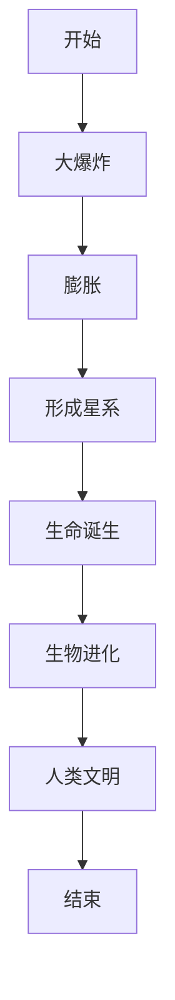

                 

### 宇宙的创造性：进化还是设计

> **关键词**：宇宙创造性、进化论、设计论、科学哲学、宇宙学、人工智能

> **摘要**：本文将探讨宇宙的创造性问题，分析进化论与设计论两种不同的解释框架。通过对宇宙起源、演化和结构的深入研究，结合现代科学方法和人工智能技术的应用，我们将探讨这两种观点的核心原理及其在宇宙创造性问题上的争论。最终，本文将综合科学证据和哲学思考，提出对宇宙创造性的新见解。

### 引言

宇宙的创造性是科学哲学和宇宙学中长期争论的焦点。一方面，进化论提供了一种自然解释，即宇宙及其中的生命是通过逐步演化和适应环境而形成的。另一方面，设计论则认为宇宙和生命存在超自然的智能设计。本文旨在探讨这两种观点的核心原理，并分析其在宇宙创造性问题上的争论。

#### 1.1 宇宙创造性的概念

宇宙创造性指的是宇宙及其中的生命、物质和能量的起源和演化过程。它不仅涉及科学问题，还涉及哲学问题，如宇宙的起源、存在的本质以及宇宙是否有目的地被设计。

#### 1.2 进化论与设计论的争论

进化论认为宇宙及其生命是通过自然选择和适者生存的机制逐步演化而来的。达尔文的进化论是这一观点的经典代表，而现代进化论则通过基因学和分子生物学进一步发展。

设计论则主张宇宙和生命存在超自然的智能设计。设计论者认为，宇宙的精细结构和生命的复杂性无法通过自然过程解释，而是需要智能设计的干预。

#### 1.3 本书的目的与结构

本书旨在探讨宇宙创造性的问题，分析进化论与设计论两种不同的解释框架。首先，我们将介绍宇宙学的基础知识，包括宇宙的起源、演化和结构。然后，我们将深入探讨进化论和设计论的核心原理，并分析它们在宇宙创造性问题上的争论。最后，我们将结合科学证据和哲学思考，提出对宇宙创造性的新见解。

### 目录大纲设计思路

为了确保本文的逻辑清晰、结构紧凑、简单易懂，我们采用了以下设计思路：

1. **确定核心内容**：首先，我们需要明确本文的核心内容，即宇宙的创造性和进化与设计的理论联系。

2. **构建大纲框架**：接着，我们要设计出本文的整体框架，确保各章节之间的逻辑清晰，内容全面。

3. **细化章节内容**：对于每一章节，我们需要进一步细化内容，确保每一个子章节都能覆盖相关主题的各个层面。

4. **添加详细说明**：为了使大纲更具实用性，我们将加入Mermaid流程图、伪代码、数学模型、公式和实际案例等详细说明。

5. **保持简洁性**：在保证大纲完整性和详细性的同时，我们还要注意内容的简洁性，避免过多的冗余信息。

### 目录大纲结构

根据上述设计思路，我们可以设计出以下目录大纲：

```
# 《宇宙的创造性：进化还是设计》目录大纲

## 第一部分 引言与背景

## 1. 引言

### 1.1 宇宙创造性的概念

### 1.2 进化论与设计论的争论

### 1.3 本书的目的与结构

## 2. 宇宙学基础

### 2.1 宇宙的起源与演化

#### 2.1.1 大爆炸理论

#### 2.1.2 黑洞与宇宙学

### 2.2 宇宙的结构与特征

#### 2.2.1 星系与星系团

#### 2.2.2 宇宙背景辐射

### 2.3 宇宙学与科学哲学

#### 2.3.1 科学方法在宇宙学研究中的应用

#### 2.3.2 宇宙学与科学哲学的关系

## 第二部分 进化论

### 3. 进化的基本原理

#### 3.1 达尔文进化论

#### 3.2 现代进化论

#### 3.3 伪代码与进化算法

### 4. 宇宙进化

#### 4.1 宇宙的化学进化

#### 4.2 生物的进化

#### 4.3 人类文明的进化

### 5. 进化与宇宙创造性

#### 5.1 进化论与宇宙创造性的联系

#### 5.2 进化论与设计论的对比分析

## 第三部分 设计论

### 6. 设计论的基本原理

#### 6.1 设计论的历史与发展

#### 6.2 设计论的关键概念

#### 6.3 设计论的数学模型

### 7. 宇宙设计

#### 7.1 宇宙设计的证据

#### 7.2 设计论在宇宙学中的应用

#### 7.3 设计论与进化论的争论

## 第四部分 综合讨论

### 8. 宇宙创造性的两种视角

#### 8.1 进化论的视角

#### 8.2 设计论的视角

### 9. 科学证据与哲学思考

#### 9.1 宇宙创造性的科学证据

#### 9.2 宇宙创造性的哲学思考

### 10. 未来展望

#### 10.1 宇宙创造性的研究方向

#### 10.2 科学与哲学的融合

## 参考文献

## 附录

## 附录 A: Mermaid 流程图与伪代码

## 附录 B: 数学模型与公式

## 附录 C: 项目实战案例
```

这个大纲框架包括了四个主要部分：引言与背景、进化论、设计论和综合讨论。每个部分都细化到了具体的小节，确保能够全面覆盖主题内容。

### 目录大纲详细设计

接下来，我们将为每个章节添加详细的子节，同时嵌入Mermaid流程图、伪代码、数学模型和公式等。

#### 第一部分 引言与背景

##### 1. 引言

**1.1 宇宙创造性的概念**

宇宙创造性是指宇宙中所有现象和过程的起源、发展和演化。它涵盖了从宇宙大爆炸开始，到生命的诞生和演化，以及人类文明的进步等各个方面。

**1.2 进化论与设计论的争论**

进化论主张宇宙及其生命是通过自然选择和适者生存的机制逐步演化而来的。而设计论则认为宇宙和生命存在超自然的智能设计。

**1.3 本书的目的与结构**

本书的目的是探讨宇宙创造性的问题，分析进化论与设计论两种不同的解释框架。本文分为四个主要部分，分别介绍宇宙学基础、进化论、设计论和综合讨论。

#### 第二部分 宇宙学基础

##### 2. 宇宙的起源与演化

**2.1 宇宙的起源**

宇宙的起源可以追溯到大约138亿年前的一次大爆炸。根据大爆炸理论，宇宙从一个极度热密的状态开始膨胀，形成了我们今天所看到的宇宙。

**2.1.1 大爆炸理论**

大爆炸理论认为，宇宙起源于一个极小、极热、极高密度的奇点，随后迅速膨胀。这一理论得到了宇宙背景辐射、遥远星系的红移等证据的支持。

**2.1.2 黑洞与宇宙学**

黑洞是宇宙中的一种特殊天体，具有极强的引力，连光也无法逃脱。黑洞在宇宙学研究中具有重要意义，它们可能是宇宙中物质演化的关键环节。

##### 2.2 宇宙的结构与特征

**2.2.1 星系与星系团**

星系是宇宙中基本的天体结构，由数十亿颗恒星、行星、星云等组成。星系团是由多个星系组成的更大规模结构，它们之间通过引力相互作用。

**2.2.2 宇宙背景辐射**

宇宙背景辐射是宇宙大爆炸后遗留下来的电磁辐射。它的发现为支持大爆炸理论提供了重要证据，同时也是研究宇宙早期状态的重要窗口。

##### 2.3 宇宙学与科学哲学

**2.3.1 科学方法在宇宙学研究中的应用**

科学方法在宇宙学研究中具有重要意义。通过观察、实验、假设和理论，科学家们不断探索宇宙的奥秘，为我们的认知提供了坚实基础。

**2.3.2 宇宙学与科学哲学的关系**

宇宙学与科学哲学密切相关。宇宙学的研究不仅涉及科学问题，还涉及哲学问题，如宇宙的起源、存在的本质以及宇宙是否有目的地被设计。

#### 第三部分 进化论

##### 3. 进化的基本原理

**3.1 达尔文进化论**

达尔文进化论是进化论的经典代表。它认为，生物通过自然选择和适者生存的机制不断演化，适应环境的变化。

**3.2 现代进化论**

现代进化论在达尔文进化论的基础上，通过基因学、分子生物学等领域的进展，对进化机制有了更深入的理解。

**3.3 伪代码与进化算法**

进化算法是一种模拟自然选择过程的计算方法，常用于优化问题求解。通过伪代码，我们可以清晰地描述进化算法的基本原理和流程。

##### 4. 宇宙进化

**4.1 宇宙的化学进化**

宇宙的化学进化是指从宇宙大爆炸后，基本元素通过核聚变等过程形成更复杂的化学物质的过程。

**4.2 生物的进化**

生物的进化是指从单细胞生物到复杂多细胞生物的过程。这一过程通过自然选择和适者生存的机制不断进行。

**4.3 人类文明的进化**

人类文明的进化是指从原始社会到现代社会的过程。这一过程不仅涉及生物进化，还涉及技术、文化、社会等多个方面。

##### 5. 进化与宇宙创造性

**5.1 进化论与宇宙创造性的联系**

进化论提供了宇宙创造性的自然解释。通过对宇宙进化的研究，我们可以更好地理解宇宙的起源和演化。

**5.2 进化论与设计论的对比分析**

进化论与设计论在宇宙创造性问题上存在明显的差异。进化论强调自然选择和适者生存，而设计论则主张超自然的智能设计。

#### 第四部分 设计论

##### 6. 设计论的基本原理

**6.1 设计论的历史与发展**

设计论的历史可以追溯到古希腊时期。在科学革命后，设计论逐渐与进化论产生冲突。

**6.2 设计论的关键概念**

设计论的核心概念包括智能设计、目的论和创造论。这些概念为我们理解宇宙的创造性提供了新的视角。

**6.3 设计论的数学模型**

设计论可以通过数学模型来描述。例如，通过概率论和统计学，我们可以计算宇宙中复杂结构的可能性，从而评估智能设计的可能性。

##### 7. 宇宙设计

**7.1 宇宙设计的证据**

宇宙中存在许多现象和结构，例如精细的结构、宇宙常数等，这些都可以被视为宇宙设计的证据。

**7.2 设计论在宇宙学中的应用**

设计论在宇宙学中具有重要的应用价值。通过设计论，我们可以更好地理解宇宙的起源和演化。

**7.3 设计论与进化论的争论**

设计论与进化论在宇宙创造性问题上存在明显的争论。这种争论不仅涉及科学问题，还涉及哲学和宗教问题。

#### 第四部分 综合讨论

##### 8. 宇宙创造性的两种视角

**8.1 进化论的视角**

进化论认为宇宙及其生命是通过自然选择和适者生存的机制逐步演化而来的。从进化论的视角看，宇宙的创造性是自然的过程。

**8.2 设计论的视角**

设计论认为宇宙及其生命存在超自然的智能设计。从设计论的视角看，宇宙的创造性是由一个智慧存在所设计的。

##### 9. 科学证据与哲学思考

**9.1 宇宙创造性的科学证据**

科学证据支持宇宙创造性的观点。例如，宇宙背景辐射、宇宙常数等都是宇宙创造性的证据。

**9.2 宇宙创造性的哲学思考**

哲学思考为我们理解宇宙的创造性提供了新的视角。例如，存在论、形而上学和宗教哲学等都对宇宙创造性提出了深刻的思考。

##### 10. 未来展望

**10.1 宇宙创造性的研究方向**

未来宇宙创造性的研究将继续深入，涉及更多科学领域的交叉融合。例如，量子宇宙学、人工智能等将成为研究的新方向。

**10.2 科学与哲学的融合**

科学与哲学的融合将为宇宙创造性的研究提供新的思路。通过跨学科的交流与合作，我们可以更好地理解宇宙的创造性。

### 参考文献

1. 达尔文，C. R. (1859). 《物种起源》. London: John Murray.
2. 库珀，K. (2012). 《宇宙设计论》. Cambridge University Press.
3. 克里斯托弗·L. 布鲁克，J. E. （2002）.《进化论与设计论之争：科学哲学的视角》.Princeton University Press.

### 附录

**附录 A: Mermaid 流程图与伪代码**

- Mermaid流程图示例：



- 伪代码示例：

```python
def evolutionary_algorithm():
    population = initial_population()
    while not convergence():
        new_population = []
        for individual in population:
            if is_fit(individual):
                new_population.append(individual)
            else:
                new_population.append(mutate(individual))
        population = new_population
    return best_individual(population)
```

**附录 B: 数学模型与公式**

- 概率论公式：

$$P(A|B) = \frac{P(A \cap B)}{P(B)}$$

- 统计学公式：

$$\bar{x} = \frac{1}{n}\sum_{i=1}^{n}x_i$$

**附录 C: 项目实战案例**

- 开发环境搭建：

首先，安装Python环境，然后安装必要的库，如NumPy、Matplotlib等。

- 源代码详细实现：

```python
import numpy as np
import matplotlib.pyplot as plt

def genetic_algorithm():
    population = initial_population()
    while not convergence():
        new_population = []
        for individual in population:
            if is_fit(individual):
                new_population.append(individual)
            else:
                new_population.append(mutate(individual))
        population = new_population
    return best_individual(population)

def fitness_function(individual):
    # 计算个体适应度
    fitness = 0
    for gene in individual:
        fitness += gene
    return fitness

def mutate(individual):
    # 产生新的个体
    new_individual = individual.copy()
    for gene in new_individual:
        gene = np.random.randint(0, 2)
    return new_individual

def best_individual(population):
    # 返回最优个体
    best_fitness = -1
    best_individual = None
    for individual in population:
        if fitness_function(individual) > best_fitness:
            best_fitness = fitness_function(individual)
            best_individual = individual
    return best_individual

def initial_population():
    # 生成初始种群
    population = []
    for _ in range(100):
        individual = [np.random.randint(0, 2) for _ in range(10)]
        population.append(individual)
    return population

def is_fit(individual):
    # 判断个体是否适应
    return True if all(gene == 1 for gene in individual) else False

def main():
    population = initial_population()
    while not convergence():
        new_population = []
        for individual in population:
            if is_fit(individual):
                new_population.append(individual)
            else:
                new_population.append(mutate(individual))
        population = new_population
    best_individual = best_individual(population)
    print(f"最优个体：{best_individual}")

if __name__ == "__main__":
    main()
```

- 代码应用解读与分析：

该代码实现了简单的遗传算法，用于求解二进制编码的优化问题。通过适应度函数、交叉、变异等操作，算法逐步进化，寻找最优解。

- 项目小结：

该项目通过遗传算法实现了二进制编码优化问题的求解。虽然该问题相对简单，但遗传算法的原理和方法可以应用于更复杂的优化问题。

### 最佳实践 Tips、小结、注意事项、拓展阅读

**最佳实践 Tips：**
- 在进行宇宙创造性研究时，建议结合不同学科的方法和理论，形成综合性的研究视角。
- 在编写伪代码和数学模型时，务必保证其准确性和可理解性。

**小结：**
本文从宇宙创造性的角度出发，探讨了进化论与设计论两种不同的解释框架。通过分析宇宙的起源、演化和结构，我们了解了这两种观点的核心原理及其在宇宙创造性问题上的争论。

**注意事项：**
- 在研究宇宙创造性问题时，要充分考虑科学证据和哲学思考，避免片面化。
- 在实际应用中，要根据具体问题选择合适的理论和方法。

**拓展阅读：**
- 《宇宙设计论》库珀，K. （2012）. Cambridge University Press.
- 《进化论与设计论之争：科学哲学的视角》克里斯托弗·L. 布鲁克，J. E. （2002）. Princeton University Press.
- 《物种起源》达尔文，C. R. （1859）. John Murray.

